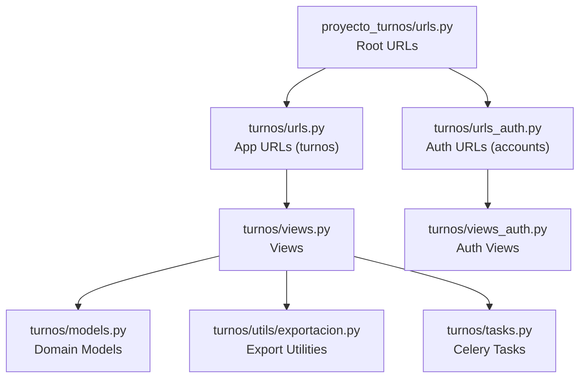
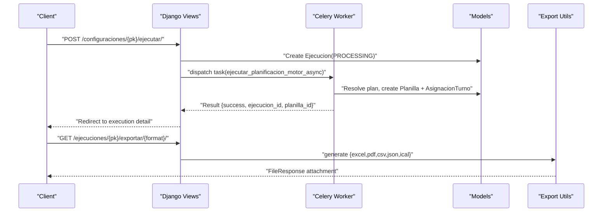
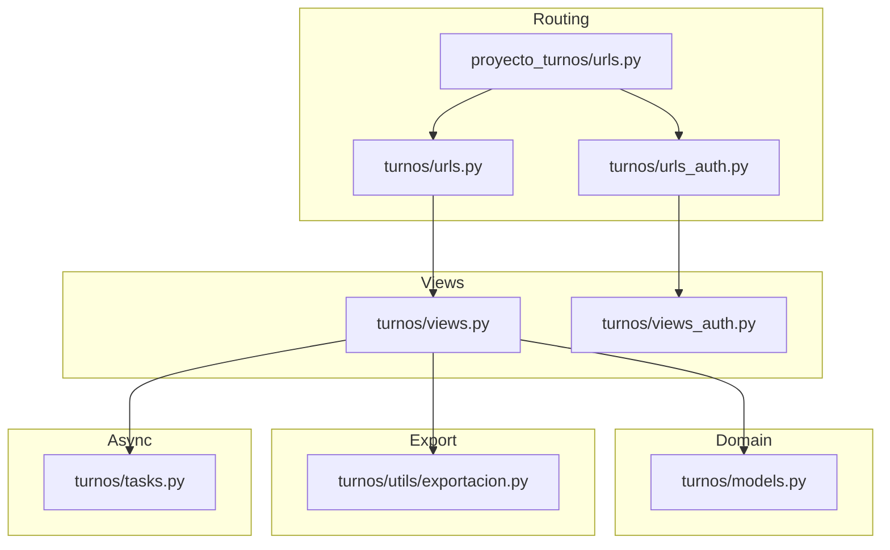

# API Reference

<cite>
**Referenced Files in This Document**
- [proyecto_turnos/urls.py](file://proyecto_turnos/urls.py)
- [turnos/urls.py](file://turnos/urls.py)
- [turnos/urls_auth.py](file://turnos/urls_auth.py)
- [turnos/views.py](file://turnos/views.py)
- [turnos/views_auth.py](file://turnos/views_auth.py)
- [turnos/mixins.py](file://turnos/mixins.py)
- [turnos/models.py](file://turnos/models.py)
- [turnos/utils/exportacion.py](file://turnos/utils/exportacion.py)
- [turnos/tasks.py](file://turnos/tasks.py)
- [turnos/static/js/ajax-helpers.js](file://turnos/static/js/ajax-helpers.js)
- [turnos/templates/includes/workspace_selector.html](file://turnos/templates/includes/workspace_selector.html)
</cite>

## Table of Contents
1. [Introduction](#introduction)
2. [Project Structure](#project-structure)
3. [Core Components](#core-components)
4. [Architecture Overview](#architecture-overview)
5. [Detailed Component Analysis](#detailed-component-analysis)
6. [Dependency Analysis](#dependency-analysis)
7. [Performance Considerations](#performance-considerations)
8. [Troubleshooting Guide](#troubleshooting-guide)
9. [Conclusion](#conclusion)
10. [Appendices](#appendices)

## Introduction
This document describes the public API surface of the turn scheduling application. It covers URL routing, HTTP methods, authentication, permissions, request/response formats, and integration patterns for configuration management, staff operations, scheduling execution, and export functionality. It also documents workspace isolation, rate limiting considerations, versioning, backward compatibility, and client implementation guidelines.

## Project Structure
The application is organized around Django’s URL dispatcher and view layer. The main project routes include:
- Root app routes under the “turnos” namespace
- Authentication routes under the “accounts” namespace
- Static assets served in development mode

**Diagram sources**
- [proyecto_turnos/urls.py:9-19](file://proyecto_turnos/urls.py#L9-L19)
- [turnos/urls.py:11-107](file://turnos/urls.py#L11-L107)
- [turnos/urls_auth.py:9-20](file://turnos/urls_auth.py#L9-L20)

**Section sources**
- [proyecto_turnos/urls.py:9-19](file://proyecto_turnos/urls.py#L9-L19)
- [turnos/urls.py:11-107](file://turnos/urls.py#L11-L107)
- [turnos/urls_auth.py:9-20](file://turnos/urls_auth.py#L9-L20)

## Core Components
- Authentication and session-based access control via Django’s LoginRequiredMixin and custom mixins
- Workspace-based data isolation enforced by WorkspaceMixin and per-model workspace foreign keys
- Asynchronous scheduling via Celery tasks
- Export endpoints for multiple formats (Excel, PDF, CSV, JSON, iCalendar)
- CRUD and wizard-style configuration creation for scheduling plans

Key access control and isolation mechanisms:
- LoginRequiredMixin ensures all protected endpoints require authentication
- OwnerRequiredMixin restricts edits/deletes to object owners
- WorkspaceMixin filters model queries by the current workspace stored in the session
- WorkspaceSelector UI updates the session workspace and reloads the page

**Section sources**
- [turnos/mixins.py:11-47](file://turnos/mixins.py#L11-L47)
- [turnos/views.py:2079-2100](file://turnos/views.py#L2079-L2100)
- [turnos/templates/includes/workspace_selector.html:1-18](file://turnos/templates/includes/workspace_selector.html#L1-L18)
- [turnos/models.py:12-27](file://turnos/models.py#L12-L27)

## Architecture Overview
High-level flow for scheduling execution and exports:

**Diagram sources**
- [turnos/views.py:683-792](file://turnos/views.py#L683-L792)
- [turnos/tasks.py:333-697](file://turnos/tasks.py#L333-L697)
- [turnos/utils/exportacion.py:135-626](file://turnos/utils/exportacion.py#L135-L626)

## Detailed Component Analysis

### Authentication and Authorization
- Authentication endpoints
  - POST /accounts/login/
  - POST /accounts/logout/
  - POST /accounts/registro/
  - POST /accounts/password/change/
  - POST /accounts/password/reset/confirm/{uidb64}/{token}/
  - GET /accounts/editar-perfil/

- Access control
  - LoginRequiredMixin applied to all protected endpoints
  - OwnerRequiredMixin for configuration edit/delete
  - WorkspaceMixin for workspace-scoped filtering
  - CSRF protection via X-CSRFToken header in AJAX helpers

- Workspace switching
  - POST /workspace/cambiar/ updates session workspace_id

Example client usage patterns:
- Use X-CSRFToken header for AJAX requests
- Maintain session cookies for authenticated flows

**Section sources**
- [turnos/urls_auth.py:9-20](file://turnos/urls_auth.py#L9-L20)
- [turnos/views_auth.py:24-106](file://turnos/views_auth.py#L24-L106)
- [turnos/mixins.py:11-47](file://turnos/mixins.py#L11-L47)
- [turnos/views.py:2094-2100](file://turnos/views.py#L2094-L2100)
- [turnos/static/js/ajax-helpers.js:44-159](file://turnos/static/js/ajax-helpers.js#L44-L159)

### Configuration Management
Endpoints
- GET /configuraciones/ — List configurations (supports search/filter/pagination)
- GET /configuraciones/nueva/ — Render wizard form
- GET /configuraciones/wizard/step-by-step/ — Step-by-step wizard
- GET /configuraciones/<int:pk>/ — Detail
- POST /configuraciones/<int:pk>/editar/ — Update
- POST /configuraciones/<int:pk>/eliminar/ — Delete
- POST /configuraciones/<int:pk>/duplicar/ — Duplicate
- POST /configuraciones/<int:pk>/ejecutar/ — Trigger scheduling execution
- GET /configuraciones/<int:pk>/exportar/json/ — Export configuration as JSON

Permissions
- LoginRequiredMixin for all
- OwnerRequiredMixin for update/delete
- WorkspaceMixin for list/detail/queryset scoping

Request/Response
- Forms rendered server-side; JSON export returns structured configuration data
- Example export payload keys include name, description, num_days, start_date, nurses/shifts lists, demand, hard/soft constraints, solver params

Notes
- Wizard supports multi-step creation with JSON-backed patterns
- Restriction editing endpoint allows adding/removing hard/soft constraints and loading presets

**Section sources**
- [turnos/urls.py:17-37](file://turnos/urls.py#L17-L37)
- [turnos/views.py:100-127](file://turnos/views.py#L100-L127)
- [turnos/views.py:148-283](file://turnos/views.py#L148-L283)
- [turnos/views.py:2053-2077](file://turnos/views.py#L2053-L2077)
- [turnos/views.py:2106-2284](file://turnos/views.py#L2106-L2284)
- [turnos/mixins.py:33-47](file://turnos/mixins.py#L33-L47)

### Staff Operations (Nurses)
Endpoints
- GET /enfermeras/ — List nurses
- GET /enfermeras/nueva/ — New form
- GET /enfermeras/<int:pk>/ — Detail
- POST /enfermeras/<int:pk>/editar/ — Update
- POST /enfermeras/<int:pk>/eliminar/ — Delete
- POST /enfermeras/importar/ — Bulk import from Excel
- GET /enfermeras/plantilla/ — Download import template

Permissions
- LoginRequiredMixin
- WorkspaceMixin for scoped queries

Request/Response
- Import endpoint accepts multipart/form-data with file and overwrite flag
- Export template endpoint returns Excel file

**Section sources**
- [turnos/urls.py:52-60](file://turnos/urls.py#L52-L60)
- [turnos/views.py:814-1067](file://turnos/views.py#L814-L1067)
- [turnos/utils/exportacion.py:629-664](file://turnos/utils/exportacion.py#L629-L664)

### Shift Types (Shifts)
Endpoints
- GET /tipos-turno/ — List shift types
- GET /tipos-turno/nuevo/ — New form
- POST /tipos-turno/<int:pk>/editar/ — Update
- POST /tipos-turno/<int:pk>/eliminar/ — Delete
- POST /tipos-turno/predeterminados/ — Create default shifts (Morning/Afternoon/Night)

Permissions
- LoginRequiredMixin
- WorkspaceMixin for scoped queries

Constraints
- Unique constraints per workspace for name and short code
- Validation prevents invalid combinations (e.g., substitute-free vs. time-based)

**Section sources**
- [turnos/urls.py:61-66](file://turnos/urls.py#L61-L66)
- [turnos/models.py:60-207](file://turnos/models.py#L60-L207)
- [turnos/views.py:1110-1165](file://turnos/views.py#L1110-L1165)

### Executions and Scheduling Execution
Endpoints
- GET /ejecuciones/ — List executions
- GET /ejecuciones/<int:pk>/ — Detail
- POST /ejecuciones/<int:pk>/eliminar/ — Delete
- GET /ejecuciones/rapida/ — Quick execution form
- POST /configuraciones/<int:pk>/ejecutar/ — Execute plan (async)
- GET /ejecuciones/<int:pk>/exportar/excel/ — Export execution to Excel
- GET /ejecuciones/<int:pk>/exportar/pdf/ — Export execution to PDF
- GET /ejecuciones/<int:pk>/exportar/csv/ — Export execution to CSV
- GET /ejecuciones/<int:pk>/exportar/json/ — Export execution to JSON
- GET /ejecuciones/<int:pk>/exportar/ical/ — Export execution to iCal
- GET /descargar/excel/<int:pk>/ — Download execution Excel
- GET /descargar/pdf/<int:pk>/ — Download execution PDF
- GET /descargar/csv/<int:pk>/ — Download execution CSV
- GET /descargar/json/<int:pk>/ — Download execution JSON
- GET /descargar/ical/<int:pk>/ — Download execution iCal
- GET /descargar/enfermeras/ — Download nurses Excel

Permissions
- LoginRequiredMixin
- WorkspaceMixin for scoped queries

Execution flow
- POST /configuraciones/{pk}/ejecutar/ creates Ejecucion(PROCESSING) and dispatches Celery task
- Celery task resolves plan, persists Planilla and AsignacionTurno entries
- Export endpoints stream generated files

**Section sources**
- [turnos/urls.py:39-51](file://turnos/urls.py#L39-L51)
- [turnos/urls.py:98-104](file://turnos/urls.py#L98-L104)
- [turnos/views.py:486-508](file://turnos/views.py#L486-L508)
- [turnos/views.py:511-648](file://turnos/views.py#L511-L648)
- [turnos/views.py:683-792](file://turnos/views.py#L683-L792)
- [turnos/views.py:1732-2033](file://turnos/views.py#L1732-L2033)
- [turnos/views.py:2294-2391](file://turnos/views.py#L2294-L2391)
- [turnos/tasks.py:333-697](file://turnos/tasks.py#L333-L697)
- [turnos/utils/exportacion.py:135-626](file://turnos/utils/exportacion.py#L135-L626)

### Results and Reports
Endpoints
- GET /resultados/<int:pk>/calendario/ — Calendar view
- GET /resultados/<int:pk>/estadisticas/ — Statistics view
- GET /resultados/<int:pk>/tabla/ — Table view
- GET /resultados/comparar/ — Compare two executions

Permissions
- LoginRequiredMixin
- WorkspaceMixin for scoped queries

**Section sources**
- [turnos/urls.py:82-85](file://turnos/urls.py#L82-L85)
- [turnos/views.py:1548-1720](file://turnos/views.py#L1548-L1720)

### User Preferences and Profile
Endpoints
- GET /perfil/ — User profile
- GET /preferencias/ — Preferences page
- POST /preferencias/guardar/ — Save preferences to session

Permissions
- LoginRequiredMixin

**Section sources**
- [turnos/urls.py:87-90](file://turnos/urls.py#L87-L90)
- [turnos/views.py:1506-1543](file://turnos/views.py#L1506-L1543)

### Workspace Isolation and Selection
- Workspace model links Users and data models
- WorkspaceMixin filters all list/detail queries by current workspace
- Workspace selector UI posts to /workspace/cambiar/ and reloads

**Section sources**
- [turnos/models.py:12-27](file://turnos/models.py#L12-L27)
- [turnos/views.py:2079-2100](file://turnos/views.py#L2079-L2100)
- [turnos/templates/includes/workspace_selector.html:1-18](file://turnos/templates/includes/workspace_selector.html#L1-L18)

### Request/Response Formats and Examples
- JSON export endpoints return structured payloads suitable for downstream systems
- Export endpoints return binary attachments (Excel, PDF, CSV, iCal)
- AJAX helpers demonstrate expected headers (X-CSRFToken, X-Requested-With)

Example JSON export keys (configuration):
- name, description, num_days, start_date, nurse_ids[], shift_ids[], demand_by_shift, hard_constraints[], soft_constraints[], workers, timeout_seconds, seed

Example JSON export keys (execution):
- execution_id, configuration, start_time, status, optimal?, total_penalty, planilla{name, dates, assignments[]}

Note: Payloads are derived from view logic and exported functions; refer to the implementation files for exact shapes.

**Section sources**
- [turnos/views.py:2053-2077](file://turnos/views.py#L2053-L2077)
- [turnos/views.py:1946-1986](file://turnos/views.py#L1946-L1986)
- [turnos/utils/exportacion.py:559-581](file://turnos/utils/exportacion.py#L559-L581)
- [turnos/static/js/ajax-helpers.js:44-159](file://turnos/static/js/ajax-helpers.js#L44-L159)

### Error Handling and Status Codes
- Protected endpoints return 403 for insufficient permissions
- Non-AJAX requests to AJAX-only endpoints receive 400 with JSON error
- Export endpoints return 404 if execution lacks associated planilla
- Celery task failures mark Ejecucion as ERROR with messages

Common statuses:
- 200 OK for successful operations
- 400 Bad Request for malformed requests or non-AJAX calls
- 403 Forbidden for unauthorized access
- 404 Not Found for missing resources
- 500 Internal Server Error for unexpected exceptions

**Section sources**
- [turnos/mixins.py:50-56](file://turnos/mixins.py#L50-L56)
- [turnos/views.py:1732-1756](file://turnos/views.py#L1732-L1756)
- [turnos/tasks.py:204-239](file://turnos/tasks.py#L204-L239)

### Authentication Mechanisms and Permissions
- Session-based authentication with CSRF protection
- Required headers for AJAX: X-CSRFToken, X-Requested-With
- Workspace-scoped access via session workspace_id
- Owner-only modifications via OwnerRequiredMixin

**Section sources**
- [turnos/mixins.py:11-47](file://turnos/mixins.py#L11-L47)
- [turnos/static/js/ajax-helpers.js:44-159](file://turnos/static/js/ajax-helpers.js#L44-L159)
- [turnos/views.py:2094-2100](file://turnos/views.py#L2094-L2100)

### Rate Limiting, Versioning, and Backward Compatibility
- No explicit rate limiting middleware configured in the provided files
- No API versioning scheme observed; endpoints use stable resource paths
- Backward compatibility maintained by retaining legacy export endpoints and supporting both wizard modes

Recommendations:
- Introduce rate limiting at the web server or Django middleware level
- Consider adding API versioning (e.g., /api/v1/) for future-proofing

**Section sources**
- [turnos/urls.py:11-107](file://turnos/urls.py#L11-L107)
- [turnos/views.py:317-481](file://turnos/views.py#L317-L481)

### Client Implementation Guidelines
- Use X-CSRFToken header for AJAX POST/PUT/DELETE
- Respect X-Requested-With: XMLHttpRequest for AJAX-only endpoints
- Maintain session cookies for authenticated flows
- Workspace selection should POST to /workspace/cambiar/ and refresh the page
- For exports, call the appropriate GET endpoint and handle FileResponse attachments

Example AJAX helpers:
- GET/POST/PUT/DELETE wrappers with CSRF and JSON handling
- Form submission helper for FormData

**Section sources**
- [turnos/static/js/ajax-helpers.js:44-159](file://turnos/static/js/ajax-helpers.js#L44-L159)
- [turnos/templates/includes/workspace_selector.html:10-17](file://turnos/templates/includes/workspace_selector.html#L10-L17)

## Dependency Analysis
Relationships among components:

**Diagram sources**
- [proyecto_turnos/urls.py:9-19](file://proyecto_turnos/urls.py#L9-L19)
- [turnos/urls.py:11-107](file://turnos/urls.py#L11-L107)
- [turnos/urls_auth.py:9-20](file://turnos/urls_auth.py#L9-L20)
- [turnos/views.py:1-120](file://turnos/views.py#L1-L120)
- [turnos/views_auth.py:1-30](file://turnos/views_auth.py#L1-L30)
- [turnos/models.py:1-80](file://turnos/models.py#L1-L80)
- [turnos/utils/exportacion.py:1-50](file://turnos/utils/exportacion.py#L1-L50)
- [turnos/tasks.py:1-30](file://turnos/tasks.py#L1-L30)

**Section sources**
- [proyecto_turnos/urls.py:9-19](file://proyecto_turnos/urls.py#L9-L19)
- [turnos/urls.py:11-107](file://turnos/urls.py#L11-L107)
- [turnos/views.py:1-120](file://turnos/views.py#L1-L120)

## Performance Considerations
- Asynchronous execution via Celery avoids blocking requests; monitor queue throughput and worker capacity
- Export generation uses streaming responses; ensure adequate memory limits for large periods
- Workspace-scoped queries rely on filtered querysets; avoid N+1 queries by leveraging select_related/prefetch_related where applicable
- Consider pagination and search filters for large lists

[No sources needed since this section provides general guidance]

## Troubleshooting Guide
Common issues and resolutions:
- 403 Forbidden: Ensure user is authenticated and owns the object (OwnerRequiredMixin)
- 400 Bad Request (AJAX): Verify X-CSRFToken and X-Requested-With headers
- 404 Not Found: Confirm resource exists and is associated with the current workspace
- Export fails: Verify execution has a generated planilla; otherwise, trigger execution first
- Celery task errors: Inspect Ejecucion.messages for error details and retry policy

**Section sources**
- [turnos/mixins.py:50-56](file://turnos/mixins.py#L50-L56)
- [turnos/views.py:1732-1756](file://turnos/views.py#L1732-L1756)
- [turnos/tasks.py:204-239](file://turnos/tasks.py#L204-L239)

## Conclusion
The application exposes a comprehensive set of endpoints for managing scheduling configurations, staff, and execution results, with robust workspace isolation and asynchronous processing. Clients should adhere to session-based authentication, CSRF protection, and workspace scoping to integrate reliably.

[No sources needed since this section summarizes without analyzing specific files]

## Appendices

### Endpoint Reference Summary
- Authentication: /accounts/*
- Configurations: /configuraciones/*
- Executions: /ejecuciones/*
- Nurses: /enfermeras/*
- Shift types: /tipos-turno/*
- Results: /resultados/*
- Exports: /descargar/* and /ejecuciones/*/exportar/*

**Section sources**
- [turnos/urls.py:11-107](file://turnos/urls.py#L11-L107)
- [turnos/urls_auth.py:9-20](file://turnos/urls_auth.py#L9-L20)