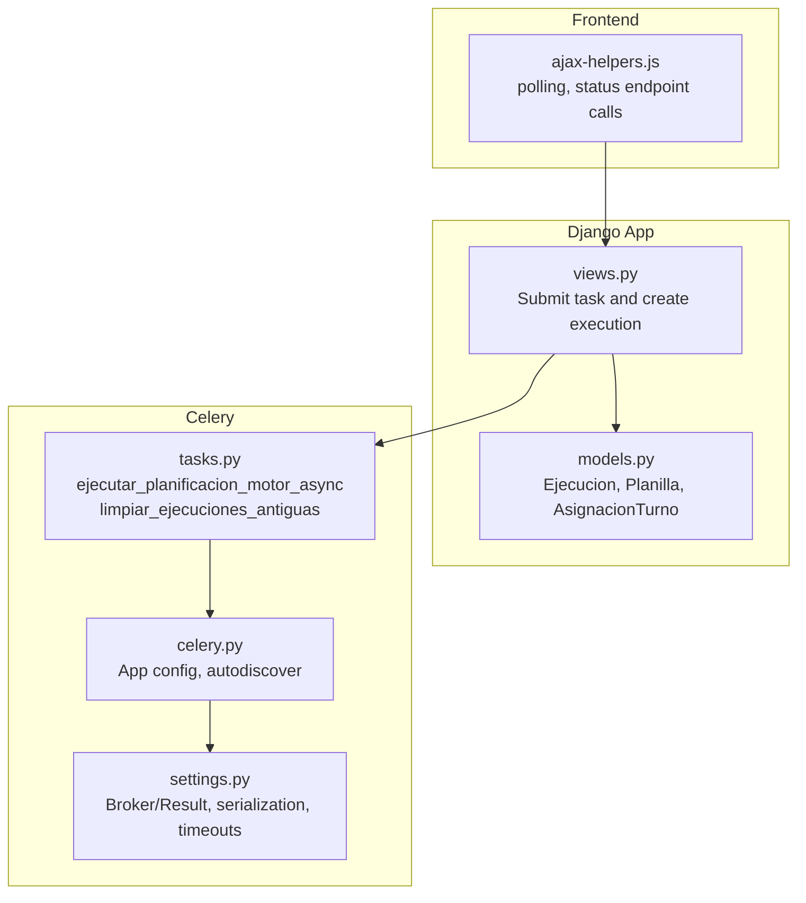
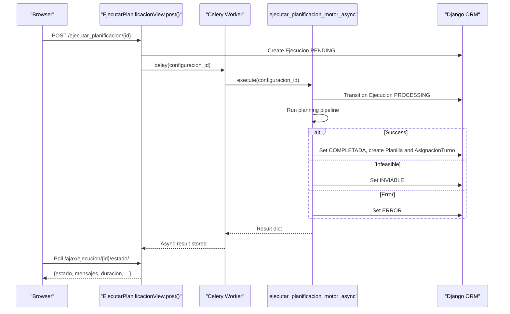
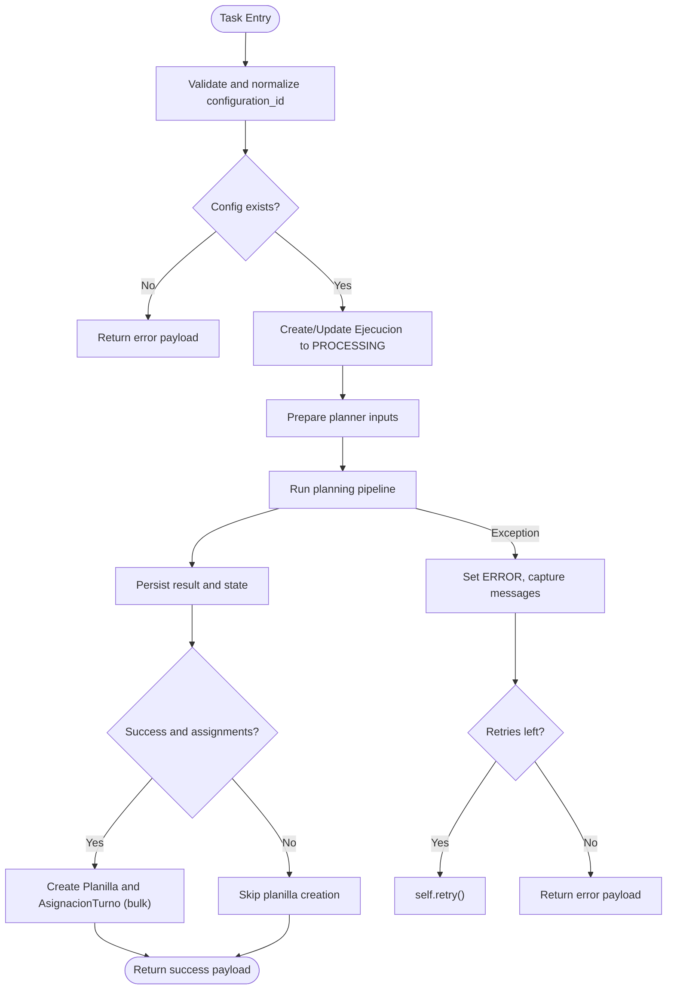
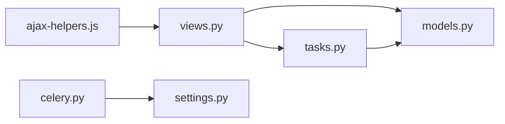

# Asynchronous Tasks

<cite>
**Referenced Files in This Document**
- [celery.py](file://proyecto_turnos/celery.py)
- [settings.py](file://proyecto_turnos/settings.py)
- [tasks.py](file://turnos/tasks.py)
- [views.py](file://turnos/views.py)
- [models.py](file://turnos/models.py)
- [ajax-helpers.js](file://static/js/ajax-helpers.js)
- [configuration_detail.html](file://turnos/templates/turnos/configuration_detail.html)
- [preferencias.html](file://turnos/templates/turnos/preferencias.html)
- [paso4_blandas.html](file://turnos/templates/turnos/wizard/paso4_blandas.html)
- [API.md](file://docs/API.md)
- [new.sh](file://proyecto_turnos/new.sh)
</cite>

## Table of Contents
1. [Introduction](#introduction)
2. [Project Structure](#project-structure)
3. [Core Components](#core-components)
4. [Architecture Overview](#architecture-overview)
5. [Detailed Component Analysis](#detailed-component-analysis)
6. [Dependency Analysis](#dependency-analysis)
7. [Performance Considerations](#performance-considerations)
8. [Troubleshooting Guide](#troubleshooting-guide)
9. [Conclusion](#conclusion)
10. [Appendices](#appendices)

## Introduction
This document explains the Celery-based asynchronous task processing used by the API to compute staff scheduling plans. It covers how tasks are submitted, monitored, retried, and how results are stored and retrieved. It also documents serialization, parameter passing, result caching, and client-side polling patterns. Guidance is included for workers, queues, retries, timeouts, and troubleshooting.

## Project Structure
The asynchronous execution spans several layers:
- Django settings define Celery broker/result backend and serialization/timeouts.
- Celery app is configured and autodiscovers tasks.
- Task module defines the long-running planning tasks and auxiliary maintenance tasks.
- Views submit tasks and create execution records.
- Models persist execution state and results.
- Frontend helpers poll execution status via AJAX.

**Diagram sources**
- [views.py:722-791](file://turnos/views.py#L722-L791)
- [tasks.py:333-696](file://turnos/tasks.py#L333-L696)
- [models.py:482-532](file://turnos/models.py#L482-L532)
- [settings.py:134-160](file://proyecto_turnos/settings.py#L134-L160)
- [celery.py:1-14](file://proyecto_turnos/celery.py#L1-L14)
- [ajax-helpers.js:204-250](file://static/js/ajax-helpers.js#L204-L250)

**Section sources**
- [celery.py:1-14](file://proyecto_turnos/celery.py#L1-L14)
- [settings.py:134-160](file://proyecto_turnos/settings.py#L134-L160)
- [tasks.py:17-268](file://turnos/tasks.py#L17-L268)
- [views.py:722-791](file://turnos/views.py#L722-L791)
- [models.py:482-532](file://turnos/models.py#L482-L532)
- [ajax-helpers.js:204-250](file://static/js/ajax-helpers.js#L204-L250)

## Core Components
- Celery app and configuration: Broker and result backend are Redis-based; JSON serialization is enforced; timezone and UTC are configured; task limits and extended results are enabled.
- Task definitions:
  - Long-running planning task with retry policy and database transaction boundaries.
  - Maintenance task to purge old execution records.
- Execution lifecycle:
  - View creates an execution record in PENDING state.
  - Celery task transitions it to PROCESSING, then COMPLETED/INVIABLE/ERROR.
  - Results are persisted in the execution record and linked planilla is created on success.
- Frontend polling:
  - JavaScript helper polls a dedicated AJAX endpoint until completion/error.

**Section sources**
- [settings.py:134-160](file://proyecto_turnos/settings.py#L134-L160)
- [tasks.py:17-268](file://turnos/tasks.py#L17-L268)
- [tasks.py:242-268](file://turnos/tasks.py#L242-L268)
- [views.py:722-791](file://turnos/views.py#L722-L791)
- [models.py:482-532](file://turnos/models.py#L482-L532)
- [ajax-helpers.js:204-250](file://static/js/ajax-helpers.js#L204-L250)

## Architecture Overview
End-to-end flow for submitting and monitoring a planning task:

**Diagram sources**
- [views.py:722-791](file://turnos/views.py#L722-L791)
- [tasks.py:333-696](file://turnos/tasks.py#L333-L696)
- [models.py:482-532](file://turnos/models.py#L482-L532)
- [ajax-helpers.js:234-250](file://static/js/ajax-helpers.js#L234-L250)

## Detailed Component Analysis

### Celery Configuration and Autodiscovery
- Celery app loads Django settings with a dedicated namespace and autodiscovers tasks.
- Debug task is registered to aid local testing.

**Section sources**
- [celery.py:1-14](file://proyecto_turnos/celery.py#L1-L14)

### Task Queue Management and Serialization
- Broker and result backend are Redis URLs.
- Content type is JSON; serializer and result serializers are JSON.
- Timezone is set to Europe/Madrid; UTC is enabled.
- Extended results are enabled; result backend retry is configured.
- Task-level time limits and soft time limits are set to protect workers.

**Section sources**
- [settings.py:134-160](file://proyecto_turnos/settings.py#L134-L160)

### Planning Task: Execution Flow and Retry Policy
- Task name: ejecutar_planificacion_motor_async.
- Parameters: configuration_id (int or dict).
- Retry policy: max_retries=3, default_retry_delay=60s.
- Transaction boundaries:
  - Atomic block around execution creation/update.
  - Atomic block around result persistence and planilla creation.
- Execution states:
  - PENDING -> PROCESSING -> COMPLETADA/INVIABLE/ERROR.
- Result shape includes success flag, execution id, planilla id, optimality, counts, and validation metadata.
- Error handling:
  - On failure, marks execution ERROR with messages containing error type and retry count.
  - Retries up to max_retries; otherwise returns structured error payload.

**Diagram sources**
- [tasks.py:333-696](file://turnos/tasks.py#L333-L696)

**Section sources**
- [tasks.py:17-268](file://turnos/tasks.py#L17-L268)
- [tasks.py:333-696](file://turnos/tasks.py#L333-L696)

### Execution Record Lifecycle and Persistence
- Ejecucion model stores:
  - State transitions, timestamps, optimality flag, penalties, raw results, and messages.
  - Durations computed from timestamps.
- Planilla and AsignacionTurno are created on successful runs.
- Historical balances may be updated post-run.

**Section sources**
- [models.py:482-532](file://turnos/models.py#L482-L532)
- [models.py:534-624](file://turnos/models.py#L534-L624)
- [models.py:787-800](file://turnos/models.py#L787-L800)

### Task Submission from Django Views
- View EjecutarPlanificacionView.post:
  - Validates configuration prerequisites.
  - Creates an Ejecucion record in PENDING.
  - Dispatches the Celery task with configuration_id.
  - Handles dispatch failures by marking execution ERROR.
  - Redirects to execution detail page.

**Section sources**
- [views.py:683-791](file://turnos/views.py#L683-L791)

### Frontend Polling Mechanism
- JavaScript helper:
  - Provides a poll(url, callback, interval, maxAttempts) function.
  - Dedicated function to fetch execution status from /turnos/ajax/ejecucion/{id}/estado/.
  - monitorizarEjecucion triggers periodic updates and stops on completion/error.

**Section sources**
- [ajax-helpers.js:204-250](file://static/js/ajax-helpers.js#L204-L250)

### Auxiliary Tasks
- limpiar_ejecuciones_antiguas: Periodically deletes old completed/error executions older than N days.
- Usage example is documented in API guide.

**Section sources**
- [tasks.py:242-268](file://turnos/tasks.py#L242-L268)
- [API.md:75-82](file://docs/API.md#L75-L82)

### Configuration Options Exposed to Users
- num_trabajadores (parallel workers) and tiempo_maximo_segundos (solver time budget) are configurable in:
  - Wizard step 4 (blancas).
  - Preferences page.
  - Configuration detail view.

These influence planning runtime and resource usage.

**Section sources**
- [paso4_blandas.html:177-193](file://turnos/templates/turnos/wizard/paso4_blandas.html#L177-L193)
- [preferencias.html:109-134](file://turnos/templates/turnos/preferencias.html#L109-L134)
- [configuration_detail.html:220-243](file://turnos/templates/turnos/configuration_detail.html#L220-L243)

## Dependency Analysis
Key dependencies and relationships:
- views.py depends on tasks.py for dispatch and on models.py for execution records.
- tasks.py depends on models.py for domain entities and on the planning pipeline.
- celery.py depends on settings.py for configuration.
- ajax-helpers.js depends on views.py’s AJAX endpoint semantics.

**Diagram sources**
- [views.py:722-791](file://turnos/views.py#L722-L791)
- [tasks.py:333-696](file://turnos/tasks.py#L333-L696)
- [models.py:482-532](file://turnos/models.py#L482-L532)
- [celery.py:1-14](file://proyecto_turnos/celery.py#L1-L14)
- [settings.py:134-160](file://proyecto_turnos/settings.py#L134-L160)
- [ajax-helpers.js:234-250](file://static/js/ajax-helpers.js#L234-L250)

**Section sources**
- [views.py:722-791](file://turnos/views.py#L722-L791)
- [tasks.py:333-696](file://turnos/tasks.py#L333-L696)
- [models.py:482-532](file://turnos/models.py#L482-L532)
- [celery.py:1-14](file://proyecto_turnos/celery.py#L1-L14)
- [settings.py:134-160](file://proyecto_turnos/settings.py#L134-L160)
- [ajax-helpers.js:234-250](file://static/js/ajax-helpers.js#L234-L250)

## Performance Considerations
- Parallel workers: Adjust num_trabajadores to balance throughput vs. CPU/memory usage.
- Time budget: tiempo_maximo_segundos controls solver runtime per run.
- Time limits: Soft and hard task limits prevent runaway workers.
- Bulk operations: Planilla creation uses bulk_create to reduce DB overhead.
- Retry backoff: default_retry_delay balances resilience and queue pressure.
- Monitoring: Use extended results and task events to track progress.

[No sources needed since this section provides general guidance]

## Troubleshooting Guide
Common issues and resolutions:
- Task dispatch fails:
  - Verify broker/result backend connectivity and credentials.
  - Confirm Celery worker is running and autodiscovers tasks.
- Execution stuck in PENDING:
  - Ensure the view created Ejecucion and dispatched the task.
  - Check worker logs for exceptions.
- Execution stuck in PROCESSING:
  - Inspect task logs for long-running steps.
  - Review time limit and soft time limit settings.
- Frequent retries:
  - Tune max_retries and default_retry_delay.
  - Investigate transient errors captured in execution messages.
- Cleanup not triggered:
  - Schedule limpiar_ejecuciones_antiguas periodically.
- Frontend polling stalls:
  - Confirm AJAX endpoint returns expected JSON.
  - Check network tab and console for errors.

**Section sources**
- [settings.py:134-160](file://proyecto_turnos/settings.py#L134-L160)
- [tasks.py:213-248](file://turnos/tasks.py#L213-L248)
- [tasks.py:242-268](file://turnos/tasks.py#L242-L268)
- [views.py:722-791](file://turnos/views.py#L722-L791)
- [ajax-helpers.js:204-250](file://static/js/ajax-helpers.js#L204-L250)

## Conclusion
The system uses Celery to offload long-running planning computations, with robust state tracking, retry logic, and frontend polling. Proper configuration of serialization, time limits, and parallelism ensures reliable operation. Maintenance tasks keep the database lean, and user-configurable parameters allow tuning for workload characteristics.

[No sources needed since this section summarizes without analyzing specific files]

## Appendices

### Client Implementation Guidelines
- Submit a planning run via the view that creates an Ejecucion and dispatches the task.
- Poll the execution status endpoint until completion or error.
- Handle retries gracefully on the client side and present meaningful feedback to users.

**Section sources**
- [views.py:722-791](file://turnos/views.py#L722-L791)
- [ajax-helpers.js:234-250](file://static/js/ajax-helpers.js#L234-L250)

### Worker Startup
- Start a Celery worker pointing to the Django settings module.

**Section sources**
- [new.sh:1-1](file://proyecto_turnos/new.sh#L1-L1)