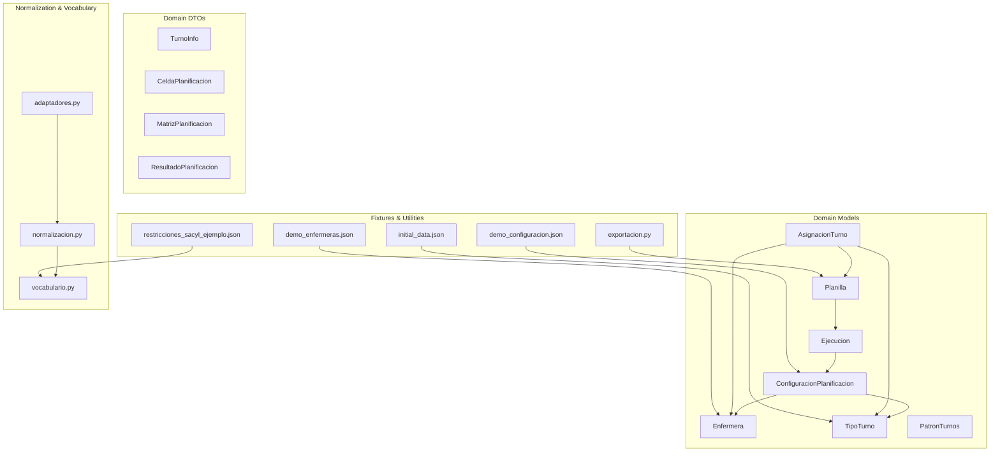
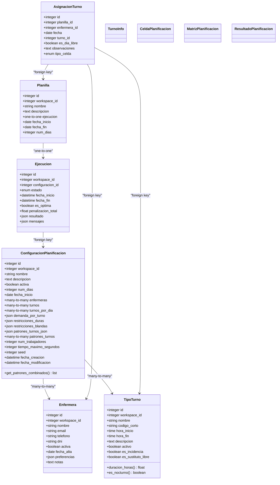
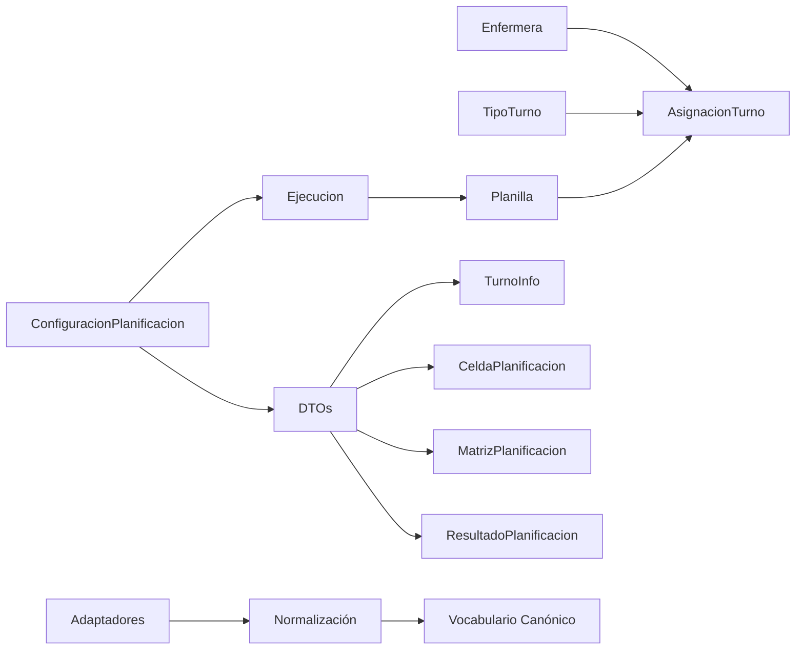

# Data Models and Schemas

<cite>
**Referenced Files in This Document**
- [models.py](file://turnos/models.py)
- [dtos.py](file://turnos/dominio/dtos.py)
- [vocabulario.py](file://turnos/dominio/vocabulario.py)
- [normalizacion.py](file://turnos/dominio/normalizacion.py)
- [adaptadores.py](file://turnos/dominio/adaptadores.py)
- [demo_enfermeras.json](file://turnos/fixtures/demo_enfermeras.json)
- [demo_configuracion.json](file://turnos/fixtures/demo_configuracion.json)
- [initial_data.json](file://turnos/fixtures/initial_data.json)
- [restricciones_sacyl_ejemplo.json](file://turnos/fixtures/restricciones_sacyl_ejemplo.json)
- [exportacion.py](file://turnos/utils/exportacion.py)
- [views.py](file://turnos/views.py)
</cite>

## Table of Contents
1. [Introduction](#introduction)
2. [Project Structure](#project-structure)
3. [Core Components](#core-components)
4. [Architecture Overview](#architecture-overview)
5. [Detailed Component Analysis](#detailed-component-analysis)
6. [Dependency Analysis](#dependency-analysis)
7. [Performance Considerations](#performance-considerations)
8. [Troubleshooting Guide](#troubleshooting-guide)
9. [Conclusion](#conclusion)
10. [Appendices](#appendices)

## Introduction
This document defines the API data models and schemas used for requests and responses across the turn scheduling system. It focuses on the core domain entities and DTOs, detailing fields, data types, validation rules, relationships, and normalization semantics. It also documents JSON payload structures for configuration, restrictions, patterns, and exported plan outputs, along with examples taken from fixtures and internal utilities.

## Project Structure
The data model layer is primarily defined in Django models and complemented by domain DTOs and vocabulary/normalization utilities. Fixtures provide realistic examples of request/response payloads.

**Diagram sources**
- [models.py:30-825](file://turnos/models.py#L30-L825)
- [dtos.py:44-274](file://turnos/dominio/dtos.py#L44-L274)
- [vocabulario.py:1-112](file://turnos/dominio/vocabulario.py#L1-L112)
- [normalizacion.py:1-190](file://turnos/dominio/normalizacion.py#L1-L190)
- [adaptadores.py:1-247](file://turnos/dominio/adaptadores.py#L1-L247)
- [demo_enfermeras.json:1-197](file://turnos/fixtures/demo_enfermeras.json#L1-L197)
- [demo_configuracion.json:1-152](file://turnos/fixtures/demo_configuracion.json#L1-L152)
- [initial_data.json:1-36](file://turnos/fixtures/initial_data.json#L1-L36)
- [restricciones_sacyl_ejemplo.json:1-21](file://turnos/fixtures/restricciones_sacyl_ejemplo.json#L1-L21)
- [exportacion.py:559-582](file://turnos/utils/exportacion.py#L559-L582)

**Section sources**
- [models.py:30-825](file://turnos/models.py#L30-L825)
- [dtos.py:44-274](file://turnos/dominio/dtos.py#L44-L274)
- [vocabulario.py:1-112](file://turnos/dominio/vocabulario.py#L1-L112)
- [normalizacion.py:1-190](file://turnos/dominio/normalizacion.py#L1-L190)
- [adaptadores.py:1-247](file://turnos/dominio/adaptadores.py#L1-L247)
- [demo_enfermeras.json:1-197](file://turnos/fixtures/demo_enfermeras.json#L1-L197)
- [demo_configuracion.json:1-152](file://turnos/fixtures/demo_configuracion.json#L1-L152)
- [initial_data.json:1-36](file://turnos/fixtures/initial_data.json#L1-L36)
- [restricciones_sacyl_ejemplo.json:1-21](file://turnos/fixtures/restricciones_sacyl_ejemplo.json#L1-L21)
- [exportacion.py:559-582](file://turnos/utils/exportacion.py#L559-L582)

## Core Components
This section documents the primary data models and DTOs used in requests and responses, including fields, types, constraints, and relationships.

- Enfermera
  - Purpose: Represents a nurse resource.
  - Fields:
    - id: integer
    - workspace_id: integer (nullable)
    - nombre: string
    - email: string (unique)
    - telefono: string
    - dni: string (unique, nullable)
    - activa: boolean
    - fecha_alta: date
    - preferencias: JSON object
    - notas: text
  - Constraints:
    - Unique constraint on email
    - Unique constraint on dni (when present)
  - Relationships:
    - belongs to Workspace (nullable)
    - has many AsignacionTurno
    - has one ContratoEnfermera
    - has many Incidencias
    - has many BalancesHistóricos

- TipoTurno
  - Purpose: Defines a shift type with optional schedule and metadata.
  - Fields:
    - id: integer
    - workspace_id: integer (nullable)
    - nombre: string
    - codigo_corto: string (unique per workspace)
    - hora_inicio: time (nullable)
    - hora_fin: time (nullable)
    - descripcion: text
    - activo: boolean
    - es_incidencia: boolean
    - es_sustituto_libre: boolean
  - Constraints:
    - Unique constraints on (workspace, nombre) and (workspace, codigo_corto)
    - Validation rules:
      - If es_sustituto_libre: no hora_inicio/hora_fin; cannot be es_incidencia
      - Else if regular (not incidence): hora_inicio and hora_fin required
      - codigo_corto required and unique per workspace
  - Properties:
    - duracion_horas: computed duration in hours (0 if no schedule)
    - es_nocturno: computed flag based on schedule crossing midnight
    - num_configuraciones: count of configurations referencing this type

- ConfiguracionPlanificacion
  - Purpose: Encapsulates a planning configuration (time window, participants, demands, constraints, patterns).
  - Fields:
    - id: integer
    - workspace_id: integer (nullable)
    - nombre: string
    - descripcion: text
    - activa: boolean
    - num_dias: integer (validated 7..366)
    - fecha_inicio: date
    - enfermeras: many-to-many Enfermera
    - turnos: many-to-many TipoTurno
    - turnos_por_dia: many-to-many TipoTurno (optional subset)
    - demanda_por_turno: JSON object (per shift code)
    - restricciones_duras: JSON array
    - restricciones_blandas: JSON array
    - patrones_turnos_json: JSON array (dynamic configuration)
    - patrones_turnos: many-to-many PatronTurnos (legacy)
    - num_trabajadores: integer (1..8)
    - tiempo_maximo_segundos: integer (10..600)
    - seed: integer (nullable)
    - creado_por: foreign key User
    - fecha_creacion: datetime
    - fecha_modificacion: datetime
  - Computed/Helper:
    - get_patrones_combinados(): merges patrones_turnos_json and active patrones_turnos (legacy)
    - clean/save: validates period length (7–366 days)

- Ejecucion
  - Purpose: Tracks a single run of the planner.
  - Fields:
    - id: integer
    - workspace_id: integer (nullable)
    - configuracion_id: foreign key ConfiguracionPlanificacion
    - estado: choice
    - fecha_inicio: datetime
    - fecha_fin: datetime (nullable)
    - es_optima: boolean
    - penalizacion_total: float (nullable)
    - resultado: JSON object
    - mensajes: JSON object

- Planilla
  - Purpose: Stores the resulting schedule after execution.
  - Fields:
    - id: integer
    - workspace_id: integer (nullable)
    - nombre: string
    - descripcion: text
    - ejecucion_id: one-to-one Ejecucion
    - fecha_inicio: date
    - fecha_fin: date
    - num_dias: integer

- AsignacionTurno
  - Purpose: Assignments of shifts to nurses for specific dates.
  - Fields:
    - id: integer
    - planilla_id: foreign key Planilla
    - enfermera_id: foreign key Enfermera
    - fecha: date
    - turno_id: foreign key TipoTurno (nullable)
    - es_dia_libre: boolean
    - observaciones: text
    - tipo_celda: choice (TURNO, LIBRE, VACACIONES, PERMISO, BAJA, FORMACION, ASIGNACION_FIJA)
  - Constraints:
    - Unique constraint on (planilla, enfermera, fecha)
    - Validation: if tipo_celda is TURNO, either turno must be set or es_dia_libre must be true

- DTOs (domain-only)
  - TurnoInfo: shift metadata for solver/runtime
  - CeldaPlanificacion: single cell (nurse × date) with computed helpers
  - MatrizPlanificacion: grid of cells with helpers to query and clone
  - ResultadoPlanificacion: solver result with metrics and validation info

**Section sources**
- [models.py:30-825](file://turnos/models.py#L30-L825)
- [dtos.py:44-274](file://turnos/dominio/dtos.py#L44-L274)

## Architecture Overview
The system separates persistence models from runtime/domain DTOs. Legacy configurations and patterns are normalized and adapted to canonical identifiers before being consumed by the planner.

**Diagram sources**
- [models.py:30-825](file://turnos/models.py#L30-L825)
- [dtos.py:44-274](file://turnos/dominio/dtos.py#L44-L274)

## Detailed Component Analysis

### Enfermera Model
- Fields and types:
  - id: integer
  - workspace_id: integer (nullable)
  - nombre: string (max length 200)
  - email: string (unique)
  - telefono: string (max length 20)
  - dni: string (unique, nullable)
  - activa: boolean
  - fecha_alta: date
  - preferencias: JSON object
  - notas: text
- Validation rules:
  - Unique constraints on email and dni
- Relationships:
  - Belongs to Workspace (nullable)
  - Has many AsignacionTurno
  - Has one ContratoEnfermera
  - Has many Incidencias
  - Has many BalancesHistóricos

**Section sources**
- [models.py:30-58](file://turnos/models.py#L30-L58)

### TipoTurno Model
- Fields and types:
  - id: integer
  - workspace_id: integer (nullable)
  - nombre: string (max length 100)
  - codigo_corto: string (max length 5)
  - hora_inicio: time (nullable)
  - hora_fin: time (nullable)
  - descripcion: text
  - activo: boolean
  - es_incidencia: boolean
  - es_sustituto_libre: boolean
- Validation rules:
  - Unique constraints on (workspace, nombre) and (workspace, codigo_corto)
  - If es_sustituto_libre: no schedule; cannot be incidence
  - Else: schedule required
  - codigo_corto required and unique per workspace
- Computed properties:
  - duracion_horas: float
  - es_nocturno: boolean

**Section sources**
- [models.py:60-208](file://turnos/models.py#L60-L208)

### ConfiguracionPlanificacion Model
- Fields and types:
  - id: integer
  - workspace_id: integer (nullable)
  - nombre: string (max length 200)
  - descripcion: text
  - activa: boolean
  - num_dias: integer (validators 7..366)
  - fecha_inicio: date
  - enfermeras: many-to-many Enfermera
  - turnos: many-to-many TipoTurno
  - turnos_por_dia: many-to-many TipoTurno (optional)
  - demanda_por_turno: JSON object
  - restricciones_duras: JSON array
  - restricciones_blandas: JSON array
  - patrones_turnos_json: JSON array
  - patrones_turnos: many-to-many PatronTurnos (legacy)
  - num_trabajadores: integer (1..8)
  - tiempo_maximo_segundos: integer (10..600)
  - seed: integer (nullable)
  - creado_por: foreign key User
  - fecha_creacion: datetime
  - fecha_modificacion: datetime
- Validation rules:
  - Period length validated (7–366 days)
- Helper:
  - get_patrones_combinados(): merges JSON and legacy ManyToMany

**Section sources**
- [models.py:332-480](file://turnos/models.py#L332-L480)

### Ejecucion Model
- Fields and types:
  - id: integer
  - workspace_id: integer (nullable)
  - configuracion_id: foreign key ConfiguracionPlanificacion
  - estado: choice
  - fecha_inicio: datetime
  - fecha_fin: datetime (nullable)
  - es_optima: boolean
  - penalizacion_total: float (nullable)
  - resultado: JSON object
  - mensajes: JSON object

**Section sources**
- [models.py:482-532](file://turnos/models.py#L482-L532)

### Planilla Model
- Fields and types:
  - id: integer
  - workspace_id: integer (nullable)
  - nombre: string (max length 200)
  - descripcion: text
  - ejecucion_id: one-to-one Ejecucion
  - fecha_inicio: date
  - fecha_fin: date
  - num_dias: integer

**Section sources**
- [models.py:534-566](file://turnos/models.py#L534-L566)

### AsignacionTurno Model
- Fields and types:
  - id: integer
  - planilla_id: foreign key Planilla
  - enfermera_id: foreign key Enfermera
  - fecha: date
  - turno_id: foreign key TipoTurno (nullable)
  - es_dia_libre: boolean
  - observaciones: text
  - tipo_celda: choice
- Validation rules:
  - Unique constraint on (planilla, enfermera, fecha)
  - If tipo_celda is TURNO, either turno must be set or es_dia_libre must be true

**Section sources**
- [models.py:568-624](file://turnos/models.py#L568-L624)

### Domain DTOs (runtime/internal)
- TurnoInfo
  - Fields: id, nombre, hora_inicio, hora_fin, duracion_horas, es_nocturno, es_sustituto_libre
  - Helpers: es_tipo_libre property
- CeldaPlanificacion
  - Fields: enfermera_id, enfermera_nombre, fecha, turno (optional), tipo_celda, es_modificable, observaciones, pertenece_rotacion_base, desviacion_de_rotacion, _turno_base_original_id
  - Helpers: es_libre, horas_asignadas, es_noche, es_fin_de_semana, es_festivo, turno_base_id, turno_id (getter/setter)
- MatrizPlanificacion
  - Fields: celdas (dict), fechas (list), enfermeras (dict), turnos_disponibles (list)
  - Methods: obtener_celda, asignar_celda, obtener_celdas_enfermera, obtener_celdas_fecha, total_celdas, clone
- ResultadoPlanificacion
  - Fields: exitosa, matriz, balances, metricas, estado_solver, tiempo_resolucion, celdas_modificadas, celdas_totales, restricciones_duras_cumplidas, violaciones, warnings
  - Helpers: porcentaje_modificaciones property

**Section sources**
- [dtos.py:44-274](file://turnos/dominio/dtos.py#L44-L274)

### Vocabulary and Normalization
- Canonical identifiers for restrictions, patterns, and cell types are defined centrally.
- Normalization utilities translate legacy names to canonical identifiers and log warnings.
- Adaptation utilities bridge legacy ManyToMany patterns to JSON-based configuration.

**Section sources**
- [vocabulario.py:1-112](file://turnos/dominio/vocabulario.py#L1-L112)
- [normalizacion.py:1-190](file://turnos/dominio/normalizacion.py#L1-L190)
- [adaptadores.py:1-247](file://turnos/dominio/adaptadores.py#L1-L247)

## Dependency Analysis
The following diagram shows how models and DTOs depend on each other and on normalization utilities.

**Diagram sources**
- [models.py:30-825](file://turnos/models.py#L30-L825)
- [dtos.py:44-274](file://turnos/dominio/dtos.py#L44-L274)
- [adaptadores.py:1-247](file://turnos/dominio/adaptadores.py#L1-L247)
- [normalizacion.py:1-190](file://turnos/dominio/normalizacion.py#L1-L190)
- [vocabulario.py:1-112](file://turnos/dominio/vocabulario.py#L1-L112)

**Section sources**
- [models.py:30-825](file://turnos/models.py#L30-L825)
- [dtos.py:44-274](file://turnos/dominio/dtos.py#L44-L274)
- [adaptadores.py:1-247](file://turnos/dominio/adaptadores.py#L1-L247)
- [normalizacion.py:1-190](file://turnos/dominio/normalizacion.py#L1-L190)
- [vocabulario.py:1-112](file://turnos/dominio/vocabulario.py#L1-L112)

## Performance Considerations
- Prefer select_related and prefetch_related in queries to reduce N+1 issues (e.g., fetching related nurses and shifts).
- Use JSON fields judiciously; consider denormalizing frequently accessed scalar values if read-heavy.
- Normalize legacy configuration once during ingestion to avoid repeated parsing overhead.
- Clone matrices only when necessary; reuse DTO instances where possible.

[No sources needed since this section provides general guidance]

## Troubleshooting Guide
Common validation errors and constraints:
- TipoTurno validation failures:
  - Substitutes of “Libre” cannot have a schedule and cannot be marked as incidence.
  - Regular types require both hora_inicio and hora_fin.
  - codigo_corto must be unique per workspace.
- ConfiguracionPlanificacion validation failures:
  - num_dias must be between 7 and 366.
- AsignacionTurno validation failures:
  - TURNO type requires either a turno or es_dia_libre.

**Section sources**
- [models.py:126-168](file://turnos/models.py#L126-L168)
- [models.py:425-456](file://turnos/models.py#L425-L456)
- [models.py:617-623](file://turnos/models.py#L617-L623)

## Conclusion
The system’s data model layer cleanly separates persistent Django models from runtime DTOs, with robust validation and normalization ensuring consistent configuration across legacy and modern formats. JSON payloads for configuration, restrictions, and exports are well-defined and exemplified by fixtures and utilities.

[No sources needed since this section summarizes without analyzing specific files]

## Appendices

### JSON Schema Examples

- Enfermera (request/response)
  - Example shape (from fixture):
    - {
        "id": 1,
        "nombre": "María García López",
        "email": "maria.garcia@hospital.es",
        "telefono": "+34 612 345 678",
        "dni": "12345678A",
        "activa": true,
        "notas": "Preferencia turno de mañana. Experiencia en UCI.",
        "fecha_alta": "2024-01-15"
      }
  - Notes:
    - Preferencias is a JSON object; can include preferences arrays or maps.
    - Unique constraints apply to email and dni.

- ConfiguracionPlanificacion (request/response)
  - Example shape (from fixture):
    - {
        "id": 1,
        "nombre": "Configuración Estándar - Septiembre 2025",
        "descripcion": "Planificación típica para un mes completo...",
        "num_dias": 30,
        "fecha_inicio": "2025-09-01",
        "activa": true,
        "tiempo_maximo_segundos": 120,
        "num_trabajadores": 4,
        "demanda_por_turno": {
          "MAÑANA": {"min": 3, "max": 5, "optimo": 4},
          "TARDE": {"min": 2, "max": 4, "optimo": 3},
          "NOCHE": {"min": 2, "max": 3, "optimo": 2}
        },
        "restricciones_duras": [
          {"nombre": "cobertura_minima", "activa": true, "parametros": {"incremento_fines_semana": 1}},
          {"nombre": "cobertura_maxima", "activa": true, "parametros": {}},
          {"nombre": "un_turno_por_dia", "activa": true, "parametros": {}},
          ...
        ],
        "restricciones_blandas": [
          {"nombre": "distribucion_equitativa_noches", "activa": true, "peso": 5.0, "parametros": {}},
          {"nombre": "minimizar_cambios_turno", "activa": true, "peso": 2.0, "parametros": {}},
          ...
        ],
        "fecha_creacion": "2025-08-15T10:00:00Z",
        "fecha_modificacion": "2025-08-15T10:00:00Z"
      }

- TipoTurno (request/response)
  - Example shape (from fixture):
    - {
        "id": 1,
        "nombre": "MANANA",
        "codigo_corto": "M",
        "hora_inicio": "07:00:00",
        "hora_fin": "15:00:00",
        "activo": true
      }

- Restriction/Pattern metadata (example)
  - Example shape (from fixture):
    - {
        "metadata": {"version": "ejemplo_sacyl_v1"},
        "restricciones_duras": [
          {"id": "RD006", "nombre": "descanso_minimo_12h", "tipo": "descanso", "obligatorio": true, "parametros": {"minimo_horas": 12}, "descripcion": "..."},
          {"id": "RD019", "nombre": "cobertura_minima_por_turno", "tipo": "cobertura", "obligatorio": true, "parametros": {"minimo_por_turno": "variable"}, "descripcion": "..."},
          {"id": "RD020", "nombre": "no_solapamiento", "tipo": "asignacion", "obligatorio": true, "descripcion": "..."}
        ],
        "restricciones_blandas": [
          {"id": "RB001", "nombre": "equidad_festivos", "tipo": "equidad", "peso": 100, "descripcion": "..."}
        ]
      }

- Planilla export (JSON)
  - Example shape (from export utility):
    - {
        "configuracion": {"id": 1, "nombre": "Configuración Estándar..."},
        "ejecucion": {"id": 1, "estado": "COMPLETADA"},
        "planilla": { /* vertical dictionary of assignments */ },
        "generado": "2025-08-15T10:00:00Z"
      }

**Section sources**
- [demo_enfermeras.json:1-197](file://turnos/fixtures/demo_enfermeras.json#L1-L197)
- [demo_configuracion.json:1-152](file://turnos/fixtures/demo_configuracion.json#L1-L152)
- [initial_data.json:1-36](file://turnos/fixtures/initial_data.json#L1-L36)
- [restricciones_sacyl_ejemplo.json:1-21](file://turnos/fixtures/restricciones_sacyl_ejemplo.json#L1-L21)
- [exportacion.py:559-582](file://turnos/utils/exportacion.py#L559-L582)

### Request/Validation Requirements

- Enfermera creation/update
  - Required: nombre, email
  - Unique: email, dni (if provided)
  - Optional: telefono, dni, preferencias (JSON), notas

- TipoTurno creation/update
  - Required: nombre, codigo_corto
  - Unique: (workspace, nombre), (workspace, codigo_corto)
  - If es_sustituto_libre: hora_inicio and hora_fin must be null; es_incidencia must be false
  - Else: hora_inicio and hora_fin required

- ConfiguracionPlanificacion creation/update
  - Required: nombre, num_dias, fecha_inicio, demanda_por_turno, restricciones_duras, restricciones_blandas
  - Validated ranges: num_dias in [7, 366]; num_trabajadores in [1, 8]; tiempo_maximo_segundos in [10, 600]
  - patrones_turnos_json and patrones_turnos (legacy) combined via get_patrones_combinados()

- AsignacionTurno creation/update
  - Unique: (planilla, enfermera, fecha)
  - If tipo_celda == TURNO: turno must be set or es_dia_libre must be true

**Section sources**
- [models.py:30-58](file://turnos/models.py#L30-L58)
- [models.py:60-208](file://turnos/models.py#L60-L208)
- [models.py:332-480](file://turnos/models.py#L332-L480)
- [models.py:568-624](file://turnos/models.py#L568-L624)

### Response Formatting

- JSON export of a planilla
  - Generated by exportacion.py; includes configuration, execution, planilla data, and generation timestamp.
  - Planilla data is a vertical dictionary keyed by day identifiers.

**Section sources**
- [exportacion.py:559-582](file://turnos/utils/exportacion.py#L559-L582)

### Versioning and Backward Compatibility

- Canonical vocabulary and normalization
  - Legacy names are mapped to canonical identifiers (e.g., UPPER_SNAKE_CASE) with warnings logged.
  - Adaptadores convert legacy ManyToMany patterns to JSON for unified consumption.

- ConfiguracionPlanificacion
  - patrones_turnos_json is the active source; patrones_turnos remains for legacy compatibility.

**Section sources**
- [vocabulario.py:1-112](file://turnos/dominio/vocabulario.py#L1-L112)
- [normalizacion.py:1-190](file://turnos/dominio/normalizacion.py#L1-L190)
- [adaptadores.py:1-247](file://turnos/dominio/adaptadores.py#L1-L247)
- [models.py:457-480](file://turnos/models.py#L457-L480)