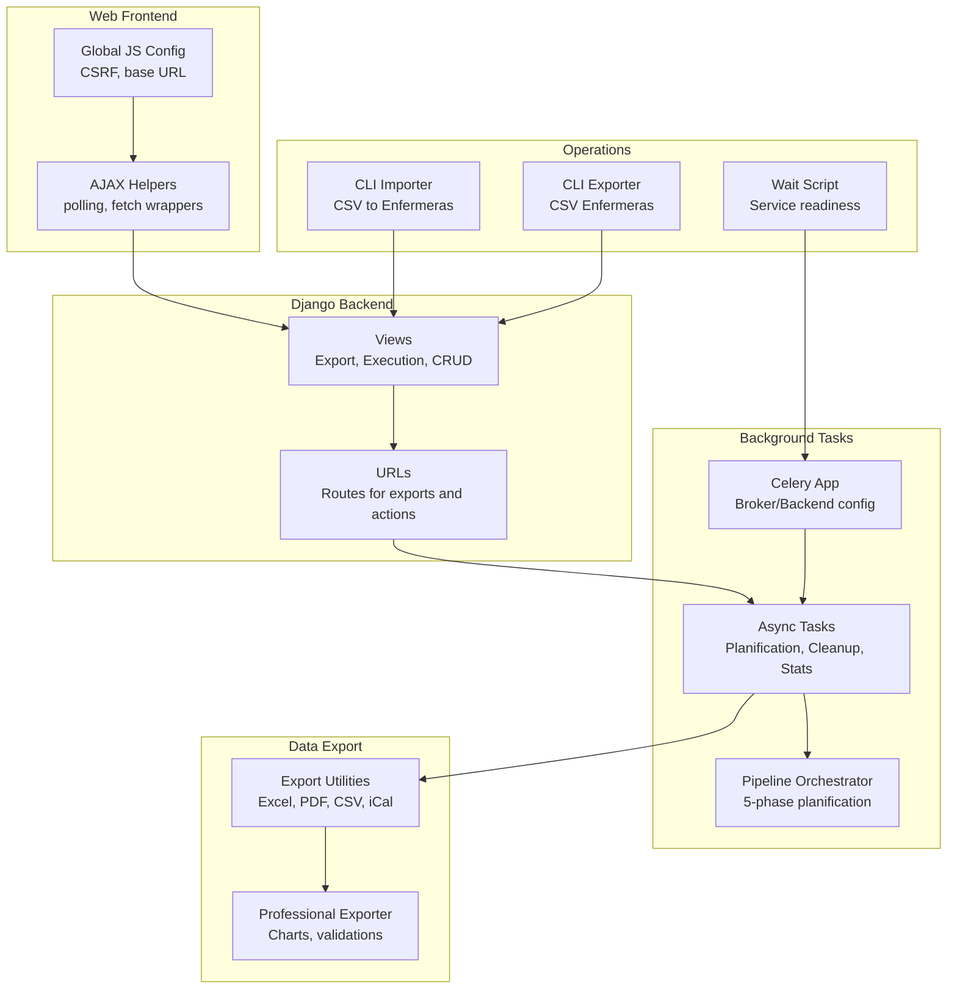
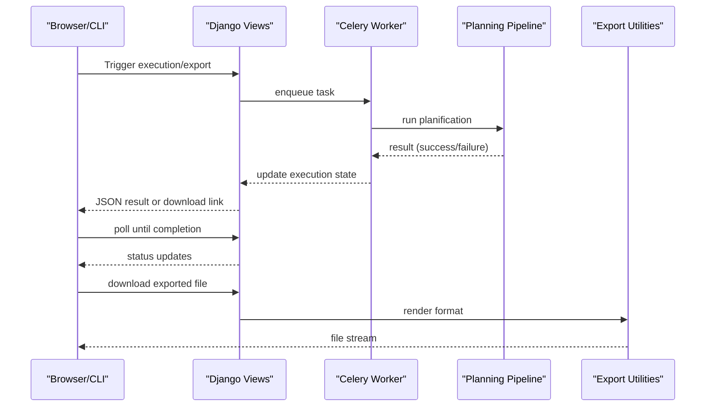
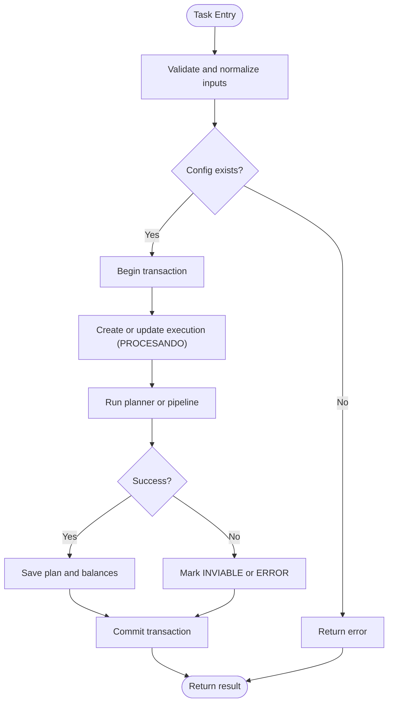
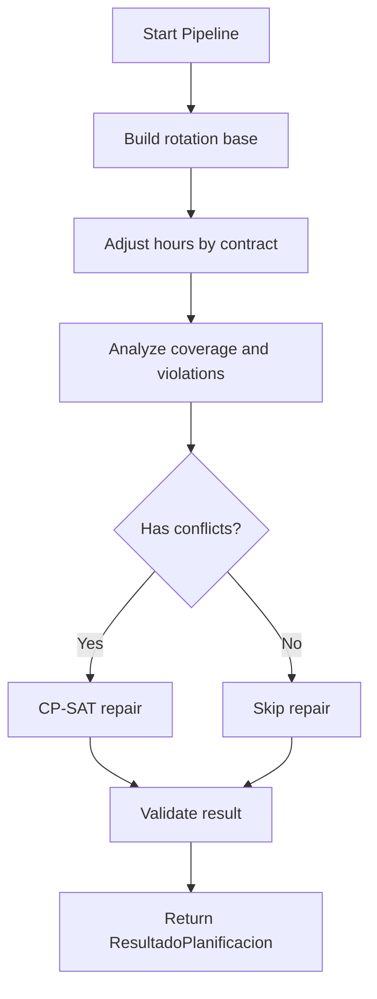
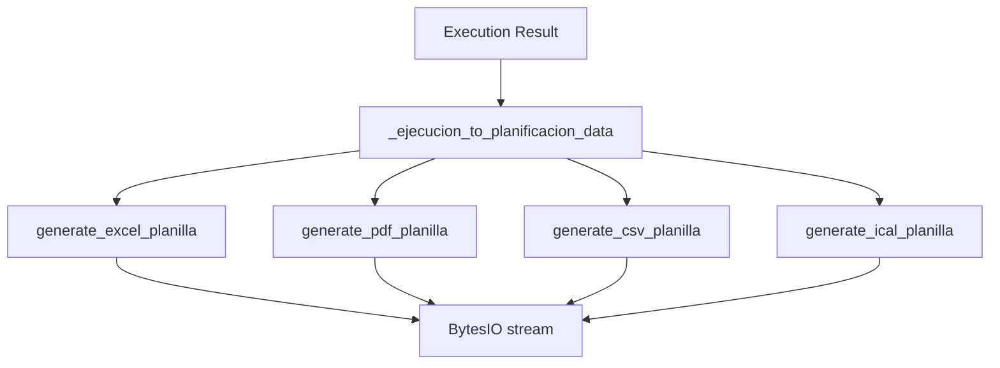
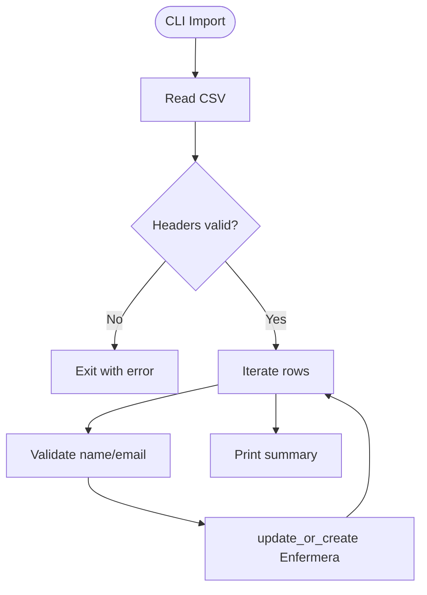
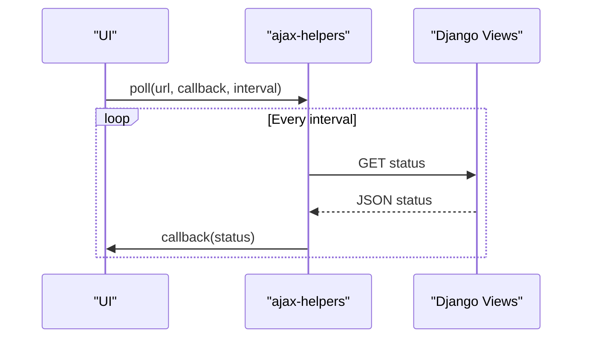
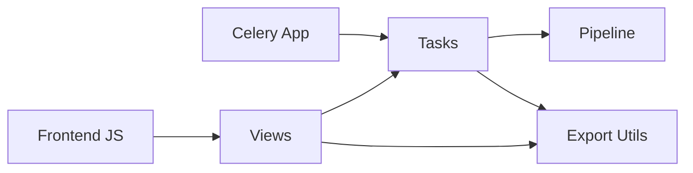

# Integration Patterns

<cite>
**Referenced Files in This Document**
- [tasks.py](file://turnos/tasks.py)
- [celery.py](file://proyecto_turnos/celery.py)
- [pipeline.py](file://turnos/motor/pipeline.py)
- [exportacion.py](file://turnos/utils/exportacion.py)
- [exportador_profesional.py](file://turnos/utils/exportador_profesional.py)
- [exportar_enfermeras.py](file://turnos/management/commands/exportar_enfermeras.py)
- [importar_enfermeras.py](file://turnos/management/commands/importar_enfermeras.py)
- [urls.py](file://turnos/urls.py)
- [views.py](file://turnos/views.py)
- [ajax-helpers.js](file://turnos/static/js/ajax-helpers.js)
- [main.js](file://turnos/static/js/main.js)
- [wait-for-it.sh](file://wait-for-it.sh)
</cite>

## Table of Contents
1. [Introduction](#introduction)
2. [Project Structure](#project-structure)
3. [Core Components](#core-components)
4. [Architecture Overview](#architecture-overview)
5. [Detailed Component Analysis](#detailed-component-analysis)
6. [Dependency Analysis](#dependency-analysis)
7. [Performance Considerations](#performance-considerations)
8. [Troubleshooting Guide](#troubleshooting-guide)
9. [Conclusion](#conclusion)
10. [Appendices](#appendices)

## Introduction
This document describes integration patterns and client implementation strategies implemented in the codebase. It focuses on asynchronous execution via Celery, batch processing workflows, real-time synchronization patterns, data export/import mechanisms, and operational reliability. It also provides guidance for integrating with external systems (payroll, HR, scheduling), implementing idempotent operations, managing transactions, and ensuring data consistency across distributed components.

## Project Structure
The system orchestrates long-running planning computations asynchronously, persists execution metadata, and exposes multiple export formats and CLI importers. The frontend uses AJAX helpers and polling to integrate with backend endpoints.

**Diagram sources**
- [urls.py:1-108](file://turnos/urls.py#L1-L108)
- [views.py:1-200](file://turnos/views.py#L1-L200)
- [tasks.py:17-240](file://turnos/tasks.py#L17-L240)
- [pipeline.py:31-246](file://turnos/motor/pipeline.py#L31-L246)
- [exportacion.py:135-467](file://turnos/utils/exportacion.py#L135-L467)
- [exportador_profesional.py:256-766](file://turnos/utils/exportador_profesional.py#L256-L766)
- [exportar_enfermeras.py:1-58](file://turnos/management/commands/exportar_enfermeras.py#L1-L58)
- [importar_enfermeras.py:1-167](file://turnos/management/commands/importar_enfermeras.py#L1-L167)
- [celery.py:1-14](file://proyecto_turnos/celery.py#L1-L14)
- [ajax-helpers.js:161-208](file://turnos/static/js/ajax-helpers.js#L161-L208)
- [main.js:1-38](file://turnos/static/js/main.js#L1-L38)
- [wait-for-it.sh:1-57](file://wait-for-it.sh#L1-L57)

**Section sources**
- [urls.py:1-108](file://turnos/urls.py#L1-L108)
- [views.py:1-200](file://turnos/views.py#L1-L200)
- [tasks.py:17-240](file://turnos/tasks.py#L17-L240)
- [pipeline.py:31-246](file://turnos/motor/pipeline.py#L31-L246)
- [exportacion.py:135-467](file://turnos/utils/exportacion.py#L135-L467)
- [exportador_profesional.py:256-766](file://turnos/utils/exportador_profesional.py#L256-L766)
- [exportar_enfermeras.py:1-58](file://turnos/management/commands/exportar_enfermeras.py#L1-L58)
- [importar_enfermeras.py:1-167](file://turnos/management/commands/importar_enfermeras.py#L1-L167)
- [celery.py:1-14](file://proyecto_turnos/celery.py#L1-L14)
- [ajax-helpers.js:161-208](file://turnos/static/js/ajax-helpers.js#L161-L208)
- [main.js:1-38](file://turnos/static/js/main.js#L1-L38)
- [wait-for-it.sh:1-57](file://wait-for-it.sh#L1-L57)

## Core Components
- Asynchronous Task Execution: Celery-backed tasks encapsulate long-running planning, with retries, transactional updates, and structured result reporting.
- Planning Pipeline: A five-phase orchestration (rotation base → hours adjustment → coverage → repair → validation) produces deterministic regular assignments.
- Export Utilities: Multiple formats (Excel, PDF, CSV, iCal) generated from execution results; professional exporter adds charts and validations.
- CLI Import/Export: Management commands support importing/exporting staff records from/to CSV.
- Frontend Integration: AJAX helpers and polling enable real-time UX feedback for long-running operations.

**Section sources**
- [tasks.py:17-240](file://turnos/tasks.py#L17-L240)
- [pipeline.py:31-246](file://turnos/motor/pipeline.py#L31-L246)
- [exportacion.py:135-467](file://turnos/utils/exportacion.py#L135-L467)
- [exportador_profesional.py:256-766](file://turnos/utils/exportador_profesional.py#L256-L766)
- [exportar_enfermeras.py:1-58](file://turnos/management/commands/exportar_enfermeras.py#L1-L58)
- [importar_enfermeras.py:1-167](file://turnos/management/commands/importar_enfermeras.py#L1-L167)
- [ajax-helpers.js:161-208](file://turnos/static/js/ajax-helpers.js#L161-L208)

## Architecture Overview
The system separates concerns across layers:
- Presentation: Django views and templates expose endpoints for execution, export, and administrative actions.
- Background: Celery workers execute planning tasks and periodic maintenance jobs.
- Domain: The pipeline orchestrates specialized stages to produce a validated plan.
- Persistence: Execution metadata and plan artifacts are stored transactionally.
- Integration: Frontend polls for progress; CLI tools support external data ingestion and distribution.

**Diagram sources**
- [views.py:1-200](file://turnos/views.py#L1-L200)
- [tasks.py:17-240](file://turnos/tasks.py#L17-L240)
- [pipeline.py:92-246](file://turnos/motor/pipeline.py#L92-L246)
- [exportacion.py:135-467](file://turnos/utils/exportacion.py#L135-L467)

## Detailed Component Analysis

### Asynchronous Execution and Retry Strategy
Asynchronous tasks encapsulate planning and cleanup operations. They:
- Validate inputs robustly, log outcomes, and propagate errors.
- Use atomic transactions to update execution state consistently.
- Retry transient failures up to a configured limit with exponential backoff semantics via Celery’s default retry delay.

**Diagram sources**
- [tasks.py:17-240](file://turnos/tasks.py#L17-L240)

**Section sources**
- [tasks.py:17-240](file://turnos/tasks.py#L17-L240)

### Planning Pipeline Orchestration
The pipeline executes five phases:
1. Rotation base builder: deterministic base schedule.
2. Hours adjustment: align with contractual targets.
3. Coverage analysis: compute deviations and conflicts.
4. Repair with CP-SAT: resolve conflicts if present.
5. Validation: produce metrics, balances, and warnings.

**Diagram sources**
- [pipeline.py:92-246](file://turnos/motor/pipeline.py#L92-L246)

**Section sources**
- [pipeline.py:31-246](file://turnos/motor/pipeline.py#L31-L246)

### Export Workflows and Formats
Export utilities transform execution results into multiple formats:
- Excel: Seven-sheet workbook (vertical/horizontal plan, stats, per-nurse, coverage, equity, validations).
- PDF: Professional layout with tables and statistics.
- CSV: Comma-separated vertical plan.
- iCal: Calendar events for turns.

**Diagram sources**
- [exportacion.py:473-627](file://turnos/utils/exportacion.py#L473-L627)
- [exportador_profesional.py:256-766](file://turnos/utils/exportador_profesional.py#L256-L766)

**Section sources**
- [exportacion.py:135-467](file://turnos/utils/exportacion.py#L135-L467)
- [exportador_profesional.py:256-766](file://turnos/utils/exportador_profesional.py#L256-L766)

### Data Import/Export Commands
- Import CSV: Reads staff records, validates headers and emails, supports update mode by email.
- Export CSV: Produces a CSV of staff with configurable filters.

**Diagram sources**
- [importar_enfermeras.py:29-151](file://turnos/management/commands/importar_enfermeras.py#L29-L151)
- [exportar_enfermeras.py:1-58](file://turnos/management/commands/exportar_enfermeras.py#L1-L58)

**Section sources**
- [importar_enfermeras.py:1-167](file://turnos/management/commands/importar_enfermeras.py#L1-L167)
- [exportar_enfermeras.py:1-58](file://turnos/management/commands/exportar_enfermeras.py#L1-L58)

### Real-Time Synchronization and Polling
Frontend helpers support asynchronous workflows:
- Fetch wrappers for forms and content.
- Polling mechanism to check progress periodically.
- Global configuration for CSRF and base API URL.

**Diagram sources**
- [ajax-helpers.js:161-208](file://turnos/static/js/ajax-helpers.js#L161-L208)
- [main.js:1-38](file://turnos/static/js/main.js#L1-L38)

**Section sources**
- [ajax-helpers.js:161-208](file://turnos/static/js/ajax-helpers.js#L161-L208)
- [main.js:1-38](file://turnos/static/js/main.js#L1-L38)

### External System Integrations
- Payroll/Human Resources: Use the professional exporter to generate Excel/PDF reports suitable for distribution to payroll or HR systems. The CLI import/export commands facilitate ingestion and distribution of staff data.
- Scheduling Applications: The iCal export can be consumed by calendar systems; the Excel/PDF exports can be integrated into scheduling dashboards.

Implementation guidelines:
- Use the CLI import/export commands for batch ingestion/distribution.
- Expose dedicated endpoints for scheduled exports and push notifications.
- Apply idempotency keys for webhook deliveries and deduplicate events on the consumer side.

[No sources needed since this section provides general guidance]

## Dependency Analysis
Key dependencies and relationships:
- Celery app configuration drives task execution.
- Tasks depend on the planning pipeline and export utilities.
- Views coordinate user actions and trigger tasks.
- Frontend helpers rely on CSRF tokens and base URLs.

**Diagram sources**
- [celery.py:1-14](file://proyecto_turnos/celery.py#L1-L14)
- [tasks.py:17-240](file://turnos/tasks.py#L17-L240)
- [pipeline.py:31-246](file://turnos/motor/pipeline.py#L31-L246)
- [exportacion.py:135-467](file://turnos/utils/exportacion.py#L135-L467)
- [views.py:1-200](file://turnos/views.py#L1-L200)
- [ajax-helpers.js:161-208](file://turnos/static/js/ajax-helpers.js#L161-L208)

**Section sources**
- [celery.py:1-14](file://proyecto_turnos/celery.py#L1-L14)
- [tasks.py:17-240](file://turnos/tasks.py#L17-L240)
- [pipeline.py:31-246](file://turnos/motor/pipeline.py#L31-L246)
- [exportacion.py:135-467](file://turnos/utils/exportacion.py#L135-L467)
- [views.py:1-200](file://turnos/views.py#L1-L200)
- [ajax-helpers.js:161-208](file://turnos/static/js/ajax-helpers.js#L161-L208)

## Performance Considerations
- Use bulk creation for assignment generation to minimize database overhead.
- Prefer streaming buffers for large exports to reduce memory usage.
- Tune Celery concurrency and queue topology for CPU-bound planning tasks.
- Cache frequently accessed configuration data during planning runs.
- Monitor task durations and adjust retry delays based on observed failure patterns.

[No sources needed since this section provides general guidance]

## Troubleshooting Guide
Common issues and remedies:
- Task failures: Inspect execution state and messages persisted in the execution record. Retries are automatic up to a limit; review logs for root causes.
- Pipeline errors: Validate configuration constraints (coverage, consecutive shifts, night limits) and ensure turn types are properly defined.
- Export failures: Confirm optional dependencies (Excel/PDF/iCal libraries) are installed; fallback to CSV when necessary.
- Frontend polling: Ensure CSRF tokens are included and base URLs are correct; verify network connectivity to the backend.

**Section sources**
- [tasks.py:204-240](file://turnos/tasks.py#L204-L240)
- [pipeline.py:236-246](file://turnos/motor/pipeline.py#L236-L246)
- [exportacion.py:135-467](file://turnos/utils/exportacion.py#L135-L467)
- [main.js:1-38](file://turnos/static/js/main.js#L1-L38)

## Conclusion
The system integrates asynchronous planning, robust export capabilities, and operational tools to support external integrations. By leveraging Celery, transactional updates, and standardized export formats, it enables reliable batch processing and real-time synchronization. Applying idempotent delivery, transactional writes, and careful retry policies ensures resilience in distributed environments.

[No sources needed since this section summarizes without analyzing specific files]

## Appendices

### Implementation Guidelines for Common Scenarios
- Payroll Systems
  - Use the professional exporter to generate Excel/PDF reports.
  - Provide a scheduled export endpoint and notify downstream systems via webhook.
  - Include an idempotency key in webhook payloads and deduplicate receipts on the consumer side.
- HR Platforms
  - Use CLI import/export commands to synchronize staff data.
  - Validate incoming CSV headers and enforce email uniqueness.
  - On change events, trigger incremental updates rather than full reloads.
- Scheduling Applications
  - Expose an iCal export endpoint for calendar sync.
  - Implement polling in the client to reflect execution progress.
  - Store execution identifiers alongside plan artifacts for auditability.

[No sources needed since this section provides general guidance]

### Security Considerations
- CSRF Protection: Ensure frontend requests include CSRF tokens.
- Authentication: All views require login; restrict sensitive endpoints appropriately.
- Data Validation: Validate and sanitize all inputs, especially CSV imports.
- Secrets and Environment: Keep broker credentials and API keys out of code; use environment variables.

**Section sources**
- [main.js:1-38](file://turnos/static/js/main.js#L1-L38)
- [importar_enfermeras.py:1-167](file://turnos/management/commands/importar_enfermeras.py#L1-L167)

### Idempotency and Transaction Management
- Idempotency Keys: Use unique keys for webhook deliveries; store processed keys to avoid reprocessing.
- Transactions: Wrap state updates in atomic blocks to maintain consistency.
- Retries: Employ bounded retries with exponential backoff; surface errors to monitoring.

**Section sources**
- [tasks.py:17-240](file://turnos/tasks.py#L17-L240)

### Operational Readiness
- Service Readiness: Use the wait script to ensure dependent services are available before launching workers.
- Monitoring: Track task durations, failure rates, and export sizes.

**Section sources**
- [wait-for-it.sh:1-57](file://wait-for-it.sh#L1-L57)