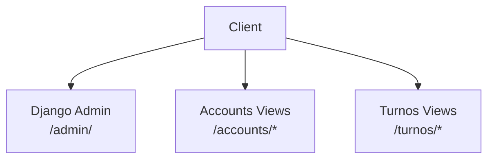
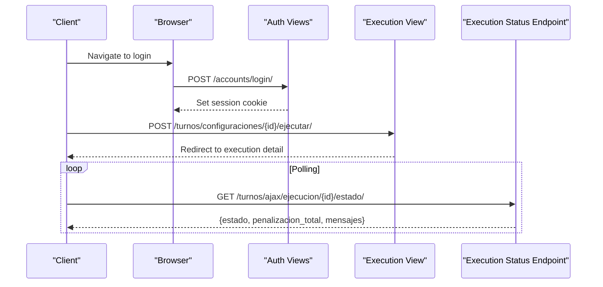
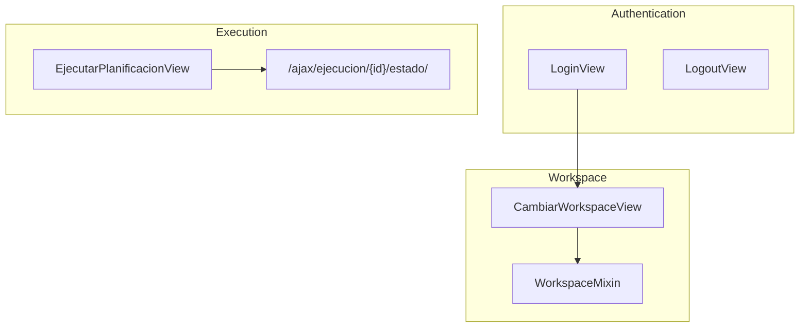

# REST Endpoints

<cite>
**Referenced Files in This Document**
- [urls.py](file://proyecto_turnos/urls.py)
- [urls.py](file://turnos/urls.py)
- [urls_auth.py](file://turnos/urls_auth.py)
- [views.py](file://turnos/views.py)
- [views_auth.py](file://turnos/views_auth.py)
- [models.py](file://turnos/models.py)
- [mixins.py](file://turnos/mixins.py)
- [forms.py](file://turnos/forms.py)
- [workspace_selector.html](file://turnos/templates/includes/workspace_selector.html)
- [ajax-helpers.js](file://turnos/static/js/ajax-helpers.js)
</cite>

## Table of Contents
1. [Introduction](#introduction)
2. [Project Structure](#project-structure)
3. [Core Components](#core-components)
4. [Architecture Overview](#architecture-overview)
5. [Detailed Component Analysis](#detailed-component-analysis)
6. [Dependency Analysis](#dependency-analysis)
7. [Performance Considerations](#performance-considerations)
8. [Troubleshooting Guide](#troubleshooting-guide)
9. [Conclusion](#conclusion)
10. [Appendices](#appendices)

## Introduction
This document describes the REST API surface exposed by the staff scheduling application. It covers HTTP endpoints for staff management, scheduling configuration, and planning execution, including URL patterns, request/response formats, authentication, permissions, workspace isolation, error handling, and client implementation guidelines. The backend is a Django application with a traditional server-rendered interface; however, the same URL patterns and request/response semantics apply to clients consuming the backend via HTTP requests.

## Project Structure
The project exposes endpoints under the application namespace. The main routing includes:
- Root application routes under the “turnos” app
- Authentication routes under the “accounts” app
- Admin routes under the “admin” namespace

**Diagram sources**
- [urls.py:9-19](file://proyecto_turnos/urls.py#L9-L19)

**Section sources**
- [urls.py:9-19](file://proyecto_turnos/urls.py#L9-L19)
- [urls.py:1-108](file://turnos/urls.py#L1-L108)
- [urls_auth.py:9-20](file://turnos/urls_auth.py#L9-L20)

## Core Components
- Authentication and session-based access control:
  - Login, logout, registration, password change/reset, and profile edit endpoints are defined under the accounts namespace.
- Workspace isolation:
  - Users belong to Workspaces; views filter data by the current workspace stored in the session or the user’s default workspace.
- Execution orchestration:
  - Planning execution is initiated via a view that creates an execution record and dispatches a background task; clients can poll for execution status.

Key behaviors:
- Login requirement: Most endpoints require authentication.
- Workspace filtering: Queries are scoped to the current workspace.
- Export endpoints: Provide downloadable artifacts (Excel, PDF, CSV, JSON, iCalendar).

**Section sources**
- [views_auth.py:24-67](file://turnos/views_auth.py#L24-L67)
- [views.py:2079-2100](file://turnos/views.py#L2079-L2100)
- [mixins.py:33-47](file://turnos/mixins.py#L33-L47)
- [models.py:12-27](file://turnos/models.py#L12-L27)

## Architecture Overview
The system uses Django views to serve both HTML pages and structured responses. For execution status monitoring, the frontend polls a dedicated endpoint. Workspace selection updates the session-scoped workspace context.

**Diagram sources**
- [views_auth.py:24-67](file://turnos/views_auth.py#L24-L67)
- [views.py:722-791](file://turnos/views.py#L722-L791)
- [ajax-helpers.js:234-250](file://turnos/static/js/ajax-helpers.js#L234-L250)

## Detailed Component Analysis

### Authentication Endpoints
- POST /accounts/login/
  - Purpose: Authenticate user and set session.
  - Request: Form-encoded fields username, password; optional next.
  - Response: Redirect to dashboard or error message.
  - Notes: Uses Django’s AuthenticationForm; CSRF required for POST.
- GET /accounts/logout/
  - Purpose: Clear session and redirect to login.
  - Response: Redirect.
- POST /accounts/logout/
  - Purpose: CSRF-safe logout.
  - Response: Redirect.
- POST /accounts/registro/
  - Purpose: Register a new user.
  - Response: Redirect to login.
- POST /accounts/password/change/
  - Purpose: Change current password.
  - Response: Redirect to success page.
- GET /accounts/password/reset/
  - Purpose: Initiate password reset.
  - Response: Renders reset form.
- GET /accounts/password/reset/confirm/{uidb64}/{token}/
  - Purpose: Confirm password reset.
  - Response: Renders confirm form.
- GET /accounts/password/reset/complete/
  - Purpose: Reset complete.
  - Response: Renders completion page.
- GET /accounts/editar-perfil/
  - Purpose: Edit current user profile.
  - Response: Renders profile form.

Authentication requirements:
- Most endpoints require a logged-in session.
- Some endpoints enforce staff or superuser roles via mixins.

**Section sources**
- [urls_auth.py:9-20](file://turnos/urls_auth.py#L9-L20)
- [views_auth.py:24-67](file://turnos/views_auth.py#L24-L67)
- [views_auth.py:70-89](file://turnos/views_auth.py#L70-L89)
- [views_auth.py:136-143](file://turnos/views_auth.py#L136-L143)

### Staff Management Endpoints
- GET /turnos/enfermeras/
  - Purpose: List staff members.
  - Query parameters: q=search term, per_page pagination.
  - Response: HTML list; workspace-filtered.
- POST /turnos/workspace/cambiar/
  - Purpose: Switch current workspace.
  - Request: workspace_id.
  - Response: JSON {success: true, workspace: name}.
- GET /turnos/enfermeras/nueva/
  - Purpose: Render staff creation form.
- POST /turnos/enfermeras/nueva/
  - Purpose: Create staff member.
  - Request: Form fields from EnfermeraForm.
  - Response: Redirect to detail or form with errors.
- GET /turnos/enfermeras/{id}/
  - Purpose: View staff detail.
- GET /turnos/enfermeras/{id}/editar/
  - Purpose: Render staff update form.
- POST /turnos/enfermeras/{id}/editar/
  - Purpose: Update staff member.
  - Request: Form fields from EnfermeraForm.
  - Response: Redirect to detail or form with errors.
- POST /turnos/enfermeras/{id}/eliminar/
  - Purpose: Delete staff member.
  - Response: Redirect to list.

Permissions and workspace:
- Workspace filtering applies to queries and exports.
- Ownership checks may apply depending on view.

**Section sources**
- [urls.py:52-60](file://turnos/urls.py#L52-L60)
- [views.py:2079-2100](file://turnos/views.py#L2079-L2100)
- [forms.py:14-73](file://turnos/forms.py#L14-L73)

### Scheduling Configuration Endpoints
- GET /turnos/configuraciones/
  - Purpose: List configurations.
  - Query parameters: q=search, estado=activa|inactiva, orden sorting, per_page.
  - Response: HTML list; workspace-filtered.
- GET /turnos/configuraciones/nueva/
  - Purpose: Render configuration creation form.
- POST /turnos/configuraciones/nueva/
  - Purpose: Create configuration.
  - Request: Form fields from ConfiguracionPlanificacionForm (JSON fields supported).
  - Response: Redirect to detail or form with errors.
- GET /turnos/configuraciones/{id}/
  - Purpose: View configuration detail.
- GET /turnos/configuraciones/{id}/editar/
  - Purpose: Render configuration update form.
- POST /turnos/configuraciones/{id}/editar/
  - Purpose: Update configuration.
  - Request: Form fields from ConfiguracionPlanificacionForm.
  - Response: Redirect to detail or form with errors.
- POST /turnos/configuraciones/{id}/eliminar/
  - Purpose: Delete configuration.
  - Response: Redirect to list.
- POST /turnos/configuraciones/{id}/duplicar/
  - Purpose: Duplicate configuration.
  - Response: Redirect to new detail.
- POST /turnos/configuraciones/{id}/ejecutar/
  - Purpose: Trigger planning execution.
  - Response: Redirect to execution detail.
- GET /turnos/configuraciones/{id}/exportar/json/
  - Purpose: Download configuration as JSON.
  - Response: JSON file attachment.

Configuration payload (example structure):
- Fields: nombre, descripcion, activa, num_dias, fecha_inicio, enfermeras[], turnos[], demanda_por_turno{}, restricciones_duras[], restricciones_blandas[], num_trabajadores, tiempo_maximo_segundos, seed, patrones_turnos_json[].

Notes:
- JSON fields support both arrays and objects; validation handles stringified JSON.
- Workspace filtering applies to queries.

**Section sources**
- [urls.py:17-36](file://turnos/urls.py#L17-L36)
- [views.py:2053-2077](file://turnos/views.py#L2053-L2077)
- [forms.py:164-326](file://turnos/forms.py#L164-L326)

### Planning Execution Endpoints
- GET /turnos/ejecuciones/
  - Purpose: List executions.
  - Query parameters: q=search, estado, proyecto_turnos=config id.
  - Response: HTML list; workspace-filtered.
- GET /turnos/ejecuciones/{id}/
  - Purpose: View execution detail.
- POST /turnos/ejecuciones/{id}/eliminar/
  - Purpose: Delete execution.
  - Response: Redirect to list.
- GET /turnos/ejecuciones/rapida/
  - Purpose: Render quick execution form.
- POST /turnos/ejecuciones/rapida/
  - Purpose: Submit quick execution.
  - Response: Redirect to executions list.

Execution status polling:
- GET /turnos/ajax/ejecucion/{id}/estado/
  - Purpose: Poll execution status.
  - Response: JSON {estado, penalizacion_total, mensajes}.
  - Notes: Requires X-Requested-With: XMLHttpRequest header.

Export endpoints:
- GET /turnos/ejecuciones/{id}/exportar/excel/
- GET /turnos/ejecuciones/{id}/exportar/pdf/
- GET /turnos/ejecuciones/{id}/exportar/csv/
- GET /turnos/ejecuciones/{id}/exportar/json/
- GET /turnos/ejecuciones/{id}/exportar/ical/

Planilla export:
- GET /turnos/planillas/{id}/exportar/excel/
- GET /turnos/planillas/{id}/exportar/pdf/

Staff list export:
- GET /turnos/descargar/enfermeras/

**Section sources**
- [urls.py:39-51](file://turnos/urls.py#L39-L51)
- [urls.py:68-74](file://turnos/urls.py#L68-L74)
- [urls.py:98-105](file://turnos/urls.py#L98-L105)
- [views.py:2079-2100](file://turnos/views.py#L2079-L2100)
- [ajax-helpers.js:234-250](file://turnos/static/js/ajax-helpers.js#L234-L250)

### Types and Patterns Endpoints
- GET /turnos/tipos-turno/
  - Purpose: List turn types.
- GET /turnos/tipos-turno/nuevo/
  - Purpose: Render type creation form.
- POST /turnos/tipos-turno/nuevo/
  - Purpose: Create type.
  - Request: Form fields from TipoTurnoForm.
- GET /turnos/tipos-turno/{id}/editar/
  - Purpose: Render type update form.
- POST /turnos/tipos-turno/{id}/editar/
  - Purpose: Update type.
- POST /turnos/tipos-turno/{id}/eliminar/
  - Purpose: Delete type.
- POST /turnos/tipos-turno/predeterminados/
  - Purpose: Create default turn types.

Validation:
- TipoTurnoForm enforces constraints (e.g., mandatory short code, valid time ranges, mutual exclusivity of flags).

**Section sources**
- [urls.py:61-67](file://turnos/urls.py#L61-L67)
- [forms.py:75-161](file://turnos/forms.py#L75-L161)

### Restriction Management Endpoints
- GET /turnos/configuracion/{id}/restricciones/
  - Purpose: Edit hard and soft restrictions for a configuration.
- POST /turnos/configuracion/{id}/restricciones/
  - Actions: add_dura, add_blanda, delete_dura, delete_blanda, cargar_sacyl.
  - Request: Form fields or JSON payload depending on action.
  - Response: Redirect to same page with messages.

Restrictions payload (examples):
- Hard restriction: {id, nombre, tipo, obligatorio, parametros, descripcion}
- Soft restriction: {id, nombre, tipo, peso, parametros, descripcion}

**Section sources**
- [urls.py:11-13](file://turnos/urls.py#L11-L13)
- [views.py:2106-2284](file://turnos/views.py#L2106-L2284)

### Reports and Results Endpoints
- GET /turnos/reportes/
- GET /turnos/reportes/carga/
- GET /turnos/reportes/conflictos/
- GET /turnos/reportes/tendencias/
- GET /turnos/resultados/{id}/calendario/
- GET /turnos/resultados/{id}/estadisticas/
- GET /turnos/resultados/{id}/tabla/
- GET /turnos/resultados/comparar/

These endpoints render reports and results; they are primarily HTML views.

**Section sources**
- [urls.py:75-86](file://turnos/urls.py#L75-L86)

### User Profile and Preferences
- GET /turnos/perfil/
- GET /turnos/preferencias/
- POST /turnos/preferencias/guardar/

**Section sources**
- [urls.py:87-91](file://turnos/urls.py#L87-L91)

## Dependency Analysis
- Authentication and permissions:
  - LoginRequiredMixin enforced on most views.
  - OwnerRequiredMixin for editing/deleting owned objects.
  - StaffRequiredMixin and SuperuserRequiredMixin for privileged actions.
- Workspace isolation:
  - WorkspaceMixin filters querysets by current workspace.
  - Workspace selector updates session variable.
- Execution orchestration:
  - Execution view creates an Ejecucion record and dispatches a Celery task.
  - Frontend polling uses a dedicated AJAX endpoint.

**Diagram sources**
- [views_auth.py:24-67](file://turnos/views_auth.py#L24-L67)
- [views.py:2094-2100](file://turnos/views.py#L2094-L2100)
- [views.py:2079-2092](file://turnos/views.py#L2079-L2092)
- [views.py:722-791](file://turnos/views.py#L722-L791)
- [ajax-helpers.js:234-250](file://turnos/static/js/ajax-helpers.js#L234-L250)

**Section sources**
- [mixins.py:11-47](file://turnos/mixins.py#L11-L47)
- [views.py:2079-2100](file://turnos/views.py#L2079-L2100)
- [views.py:722-791](file://turnos/views.py#L722-L791)

## Performance Considerations
- Workspace filtering adds a database filter; ensure proper indexing on workspace foreign keys.
- Export endpoints stream binary content; avoid loading entire datasets into memory unnecessarily.
- Execution polling intervals should be tuned to balance responsiveness and server load.
- JSON fields (demanda, restricciones, patrones) should be validated early to prevent heavy processing on invalid inputs.

## Troubleshooting Guide
Common HTTP statuses and causes:
- 401 Unauthorized: Not authenticated; submit credentials or session cookie.
- 403 Forbidden: Insufficient permissions (staff/superuser/owner).
- 404 Not Found: Resource does not exist (invalid id).
- 400 Bad Request: Invalid request (missing fields, invalid JSON).
- 500 Internal Server Error: Unexpected server error during processing.

Error handling patterns:
- LoginView/FormView returns form with error messages on validation failures.
- Generic views log exceptions and show user-friendly messages.
- Export views catch exceptions and redirect with error messages.

Rate limiting:
- No explicit rate limiting is implemented in the provided code. Consider adding middleware or external controls if needed.

**Section sources**
- [views_auth.py:24-67](file://turnos/views_auth.py#L24-L67)
- [views.py:2294-2324](file://turnos/views.py#L2294-L2324)
- [views.py:2327-2357](file://turnos/views.py#L2327-L2357)
- [views.py:2360-2390](file://turnos/views.py#L2360-L2390)
- [views.py:2393-2423](file://turnos/views.py#L2393-L2423)
- [views.py:2426-2456](file://turnos/views.py#L2426-L2456)
- [views.py:2459-2494](file://turnos/views.py#L2459-L2494)

## Conclusion
The application exposes a coherent set of endpoints for managing staff, configuring schedules, and orchestrating planning execution. Authentication is session-based, workspace isolation is enforced, and export capabilities provide multiple output formats. Clients should adhere to the documented request/response semantics, handle errors gracefully, and implement appropriate polling for asynchronous execution.

## Appendices

### Authentication and Permissions Reference
- Authentication: Session cookies; CSRF required for POST.
- Permissions:
  - LoginRequiredMixin: Access requires login.
  - StaffRequiredMixin: Requires staff status.
  - SuperuserRequiredMixin: Requires superuser status.
  - OwnerRequiredMixin: Requires ownership of the object or superuser status.

**Section sources**
- [mixins.py:11-47](file://turnos/mixins.py#L11-L47)
- [views_auth.py:24-67](file://turnos/views_auth.py#L24-L67)

### Workspace Isolation Reference
- Current workspace determined by session variable or user’s default workspace.
- WorkspaceMixin filters querysets accordingly.
- Workspace selector updates session and reloads page.

**Section sources**
- [views.py:2079-2100](file://turnos/views.py#L2079-L2100)
- [workspace_selector.html:1-18](file://turnos/templates/includes/workspace_selector.html#L1-L18)

### Client Implementation Guidelines
- Use X-Requested-With: XMLHttpRequest for AJAX endpoints.
- Follow the polling pattern for execution status:
  - Poll GET /turnos/ajax/ejecucion/{id}/estado/ until completion or error.
- Respect workspace boundaries; switch workspace before bulk operations.
- Validate JSON payloads for configuration endpoints before submission.

**Section sources**
- [ajax-helpers.js:234-250](file://turnos/static/js/ajax-helpers.js#L234-L250)
- [views.py:2079-2100](file://turnos/views.py#L2079-L2100)