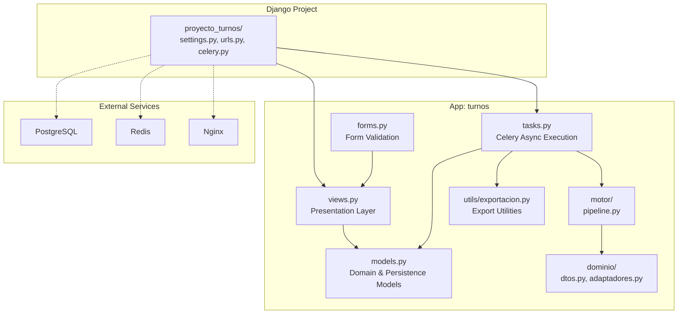
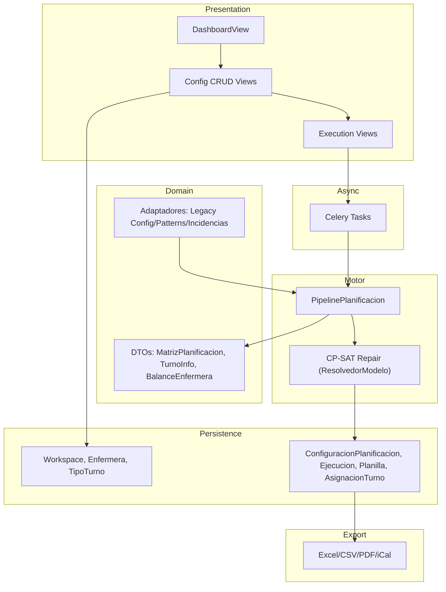
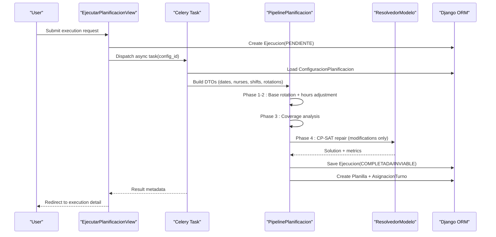
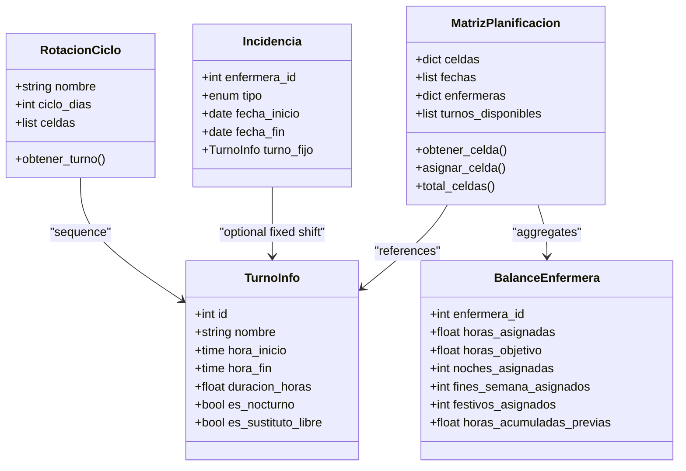
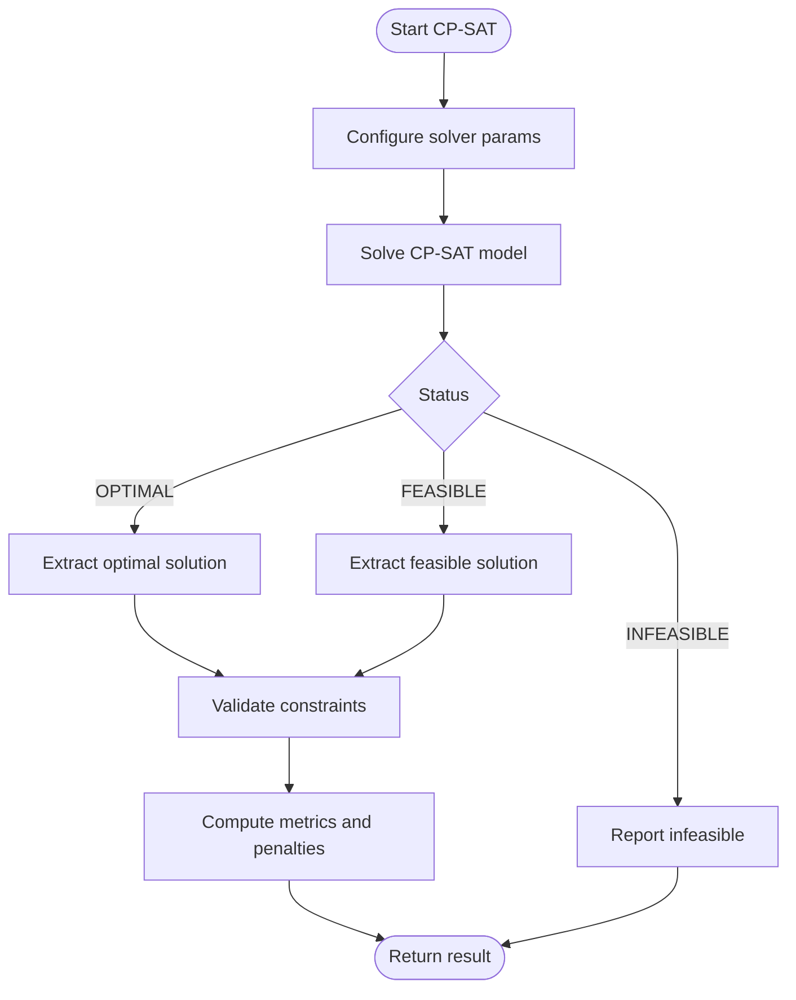
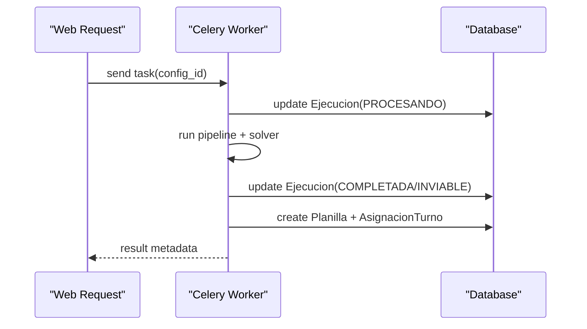
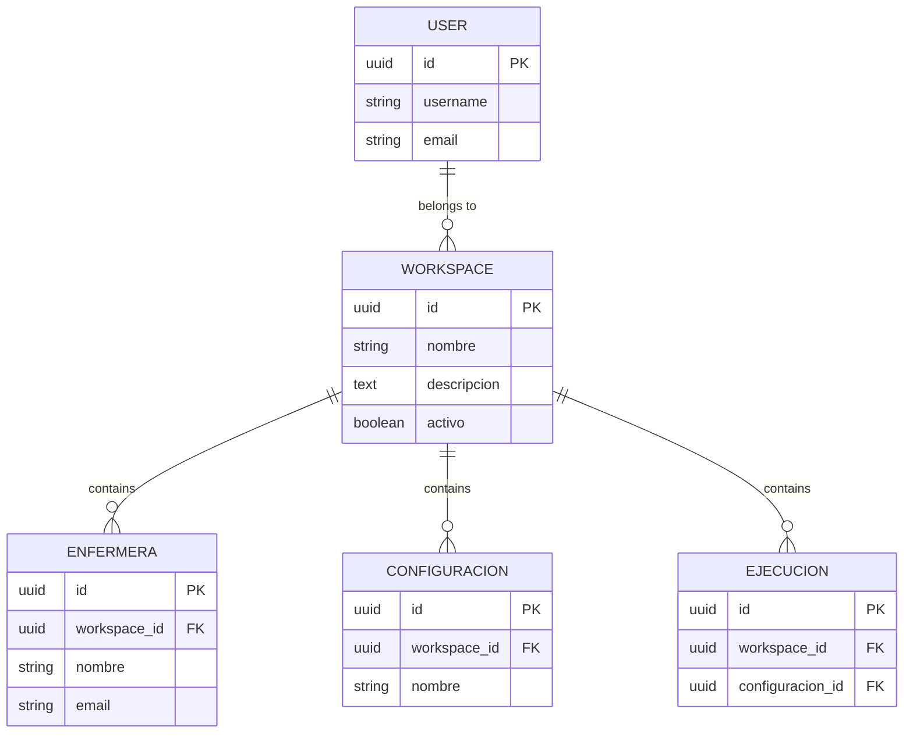
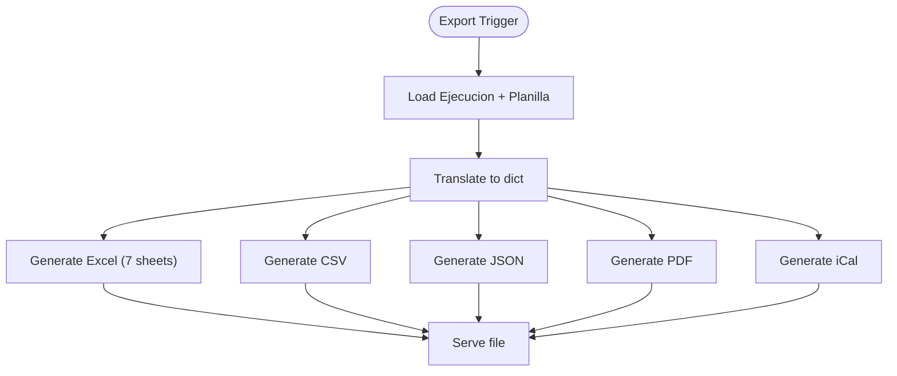
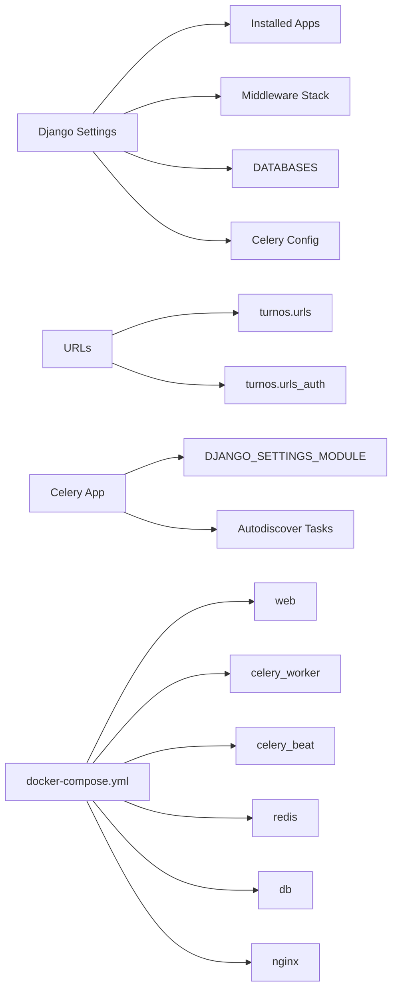

# Architecture and Design

<cite>
**Referenced Files in This Document**
- [settings.py](file://proyecto_turnos/settings.py)
- [urls.py](file://proyecto_turnos/urls.py)
- [celery.py](file://proyecto_turnos/celery.py)
- [docker-compose.yml](file://docker-compose.yml)
- [models.py](file://turnos/models.py)
- [views.py](file://turnos/views.py)
- [forms.py](file://turnos/forms.py)
- [pipeline.py](file://turnos/motor/pipeline.py)
- [resolvedor.py](file://turnos/resolvedor.py)
- [tasks.py](file://turnos/tasks.py)
- [dtos.py](file://turnos/dominio/dtos.py)
- [adaptadores.py](file://turnos/dominio/adaptadores.py)
- [exportacion.py](file://turnos/utils/exportacion.py)
- [ARQUITECTURA.md](file://docs/ARQUITECTURA.md)
</cite>

## Table of Contents
1. [Introduction](#introduction)
2. [Project Structure](#project-structure)
3. [Core Components](#core-components)
4. [Architecture Overview](#architecture-overview)
5. [Detailed Component Analysis](#detailed-component-analysis)
6. [Dependency Analysis](#dependency-analysis)
7. [Performance Considerations](#performance-considerations)
8. [Troubleshooting Guide](#troubleshooting-guide)
9. [Conclusion](#conclusion)
10. [Appendices](#appendices)

## Introduction
This document describes the system architecture and design of a nursing shift scheduling platform built with Django and Google OR-Tools CP-SAT. It focuses on a layered architecture aligned with Domain-Driven Design (DDD), separating presentation, domain, and persistence layers. The system orchestrates a five-phase pipeline to generate monthly roster matrices, using CP-SAT as a repair solver to minimize deviations from deterministic base rotations while satisfying hard constraints and optimizing soft objectives lexicographically.

Key design goals:
- Deterministic base rotation plus minimal CP-SAT repairs
- Hours-based equity and historical context-aware planning
- Multi-workspace isolation and robust asynchronous execution
- Comprehensive export capabilities and validation feedback

## Project Structure
The repository follows a Django app-centric layout with clear separation of concerns:
- proyecto_turnos: Django project configuration (settings, URLs, Celery)
- turnos: Application containing models, views, forms, domain DTOs, motor pipeline, tasks, and utilities
- docs: Architectural and operational documentation
- docker: Containerization assets for development and production

**Diagram sources**
- [settings.py:14-27](file://proyecto_turnos/settings.py#L14-L27)
- [urls.py:9-19](file://proyecto_turnos/urls.py#L9-L19)
- [celery.py:8-10](file://proyecto_turnos/celery.py#L8-L10)
- [models.py:12-52](file://turnos/models.py#L12-L52)
- [views.py:52-95](file://turnos/views.py#L52-L95)
- [forms.py:164-230](file://turnos/forms.py#L164-L230)
- [dtos.py:197-238](file://turnos/dominio/dtos.py#L197-L238)
- [pipeline.py:31-102](file://turnos/motor/pipeline.py#L31-L102)
- [tasks.py:17-50](file://turnos/tasks.py#L17-L50)
- [exportacion.py:135-170](file://turnos/utils/exportacion.py#L135-L170)

**Section sources**
- [settings.py:14-27](file://proyecto_turnos/settings.py#L14-L27)
- [urls.py:9-19](file://proyecto_turnos/urls.py#L9-L19)
- [ARQUITECTURA.md:18-49](file://docs/ARQUITECTURA.md#L18-L49)

## Core Components
- Presentation layer (MTV-style Django):
  - Views: Dashboard, configuration CRUD, wizard, execution orchestration, and result rendering
  - Forms: Validation and normalization of configuration inputs (JSON fields, selections)
  - Templates: HTML pages for wizards, lists, details, and dashboards
- Domain layer:
  - DTOs: Matrices, balances, rotations, and typed structures for internal computation
  - Adaptadores: Compatibility adapters for legacy configurations and patterns
- Motor pipeline:
  - Five-phase orchestration: base rotation → hours adjustment → coverage analysis → CP-SAT repair → validation
- Persistence layer:
  - Django ORM models for workspaces, staff, shifts, configurations, executions, and results
- Asynchronous processing:
  - Celery tasks for plan generation, cleanup, and reporting
- Export utilities:
  - Excel, CSV, PDF, JSON, and iCalendar exports

**Section sources**
- [views.py:52-95](file://turnos/views.py#L52-L95)
- [forms.py:164-230](file://turnos/forms.py#L164-L230)
- [dtos.py:197-238](file://turnos/dominio/dtos.py#L197-L238)
- [pipeline.py:31-102](file://turnos/motor/pipeline.py#L31-L102)
- [models.py:12-52](file://turnos/models.py#L12-L52)
- [tasks.py:17-50](file://turnos/tasks.py#L17-L50)
- [exportacion.py:135-170](file://turnos/utils/exportacion.py#L135-L170)

## Architecture Overview
The system adheres to layered architecture with DDD boundaries:
- Presentation (Views + Forms) handles user interactions and validates inputs
- Domain (DTOs + Adaptadores) encapsulates planning semantics and normalization
- Motor (Pipeline) orchestrates the constraint satisfaction workflow
- Persistence (Django ORM) stores configurations, executions, and results
- Cross-cutting: Authentication, multi-workspace isolation, export, and asynchronous execution

**Diagram sources**
- [views.py:52-95](file://turnos/views.py#L52-L95)
- [dtos.py:197-238](file://turnos/dominio/dtos.py#L197-L238)
- [adaptadores.py:22-76](file://turnos/dominio/adaptadores.py#L22-L76)
- [pipeline.py:31-102](file://turnos/motor/pipeline.py#L31-L102)
- [resolvedor.py:11-51](file://turnos/resolvedor.py#L11-L51)
- [models.py:332-532](file://turnos/models.py#L332-L532)
- [tasks.py:17-50](file://turnos/tasks.py#L17-L50)
- [exportacion.py:135-170](file://turnos/utils/exportacion.py#L135-L170)

## Detailed Component Analysis

### MVC/MTV Separation and Constraint Satisfaction Workflow
- MTV separation:
  - Templates render dashboards and forms
  - Views coordinate requests, delegate to tasks, and prepare context
  - Forms validate and normalize inputs (including JSON fields)
- Constraint satisfaction workflow:
  - Base rotation phase builds a deterministic matrix
  - Coverage analysis detects deviations and conflicts
  - CP-SAT repairs only modifiable cells respecting fixed blocks
  - Final validation persists planilla and updates historical balances

**Diagram sources**
- [views.py:683-792](file://turnos/views.py#L683-L792)
- [tasks.py:334-686](file://turnos/tasks.py#L334-L686)
- [pipeline.py:92-246](file://turnos/motor/pipeline.py#L92-L246)
- [resolvedor.py:21-51](file://turnos/resolvedor.py#L21-L51)
- [models.py:482-532](file://turnos/models.py#L482-L532)

**Section sources**
- [views.py:683-792](file://turnos/views.py#L683-L792)
- [tasks.py:334-686](file://turnos/tasks.py#L334-L686)
- [pipeline.py:92-246](file://turnos/motor/pipeline.py#L92-L246)
- [resolvedor.py:21-51](file://turnos/resolvedor.py#L21-L51)

### Domain Layer: DTOs and Normalization
- DTOs define the internal representation of planning entities:
  - MatrizPlanificacion: Nested dictionary of nurse-date assignments
  - TurnoInfo: Typed shift metadata (hours, nocturnal flag)
  - BalanceEnfermera: Personalized workload metrics and historical accumulations
  - Incidencia and RotacionCiclo: Contextual constraints and cycles
- Normalization ensures legacy vocabulary compatibility and consistent canonical identifiers for constraints and patterns.

**Diagram sources**
- [dtos.py:197-238](file://turnos/dominio/dtos.py#L197-L238)
- [dtos.py:44-132](file://turnos/dominio/dtos.py#L44-L132)
- [dtos.py:135-166](file://turnos/dominio/dtos.py#L135-L166)
- [dtos.py:169-181](file://turnos/dominio/dtos.py#L169-L181)
- [dtos.py:184-194](file://turnos/dominio/dtos.py#L184-L194)

**Section sources**
- [dtos.py:197-238](file://turnos/dominio/dtos.py#L197-L238)
- [dtos.py:44-132](file://turnos/dominio/dtos.py#L44-L132)
- [dtos.py:135-166](file://turnos/dominio/dtos.py#L135-L166)
- [dtos.py:169-181](file://turnos/dominio/dtos.py#L169-L181)
- [dtos.py:184-194](file://turnos/dominio/dtos.py#L184-L194)

### CP-SAT Solver Integration
- Google OR-Tools CP-SAT is used as a repair engine:
  - ResolvedorModelo configures solver parameters (workers, time limit, seed)
  - Extracts feasible solutions and validates against constraints
  - Returns structured results with penalties and timing metrics

**Diagram sources**
- [resolvedor.py:21-51](file://turnos/resolvedor.py#L21-L51)
- [resolvedor.py:52-113](file://turnos/resolvedor.py#L52-L113)

**Section sources**
- [resolvedor.py:21-51](file://turnos/resolvedor.py#L21-L51)
- [resolvedor.py:52-113](file://turnos/resolvedor.py#L52-L113)

### Asynchronous Processing with Celery
- Celery tasks handle long-running plan generation:
  - Async execution decouples UI from solver runtime
  - Robust error handling with retries and state updates
  - Periodic tasks for cleanup and statistics

**Diagram sources**
- [tasks.py:17-50](file://turnos/tasks.py#L17-L50)
- [tasks.py:334-686](file://turnos/tasks.py#L334-L686)
- [models.py:482-532](file://turnos/models.py#L482-L532)

**Section sources**
- [tasks.py:17-50](file://turnos/tasks.py#L17-L50)
- [tasks.py:334-686](file://turnos/tasks.py#L334-L686)
- [models.py:482-532](file://turnos/models.py#L482-L532)

### Multi-workspace Isolation and Authentication
- Multi-workspace isolation:
  - Workspace model links users, staff, shifts, and configurations
  - All domain entities reference workspace to enforce tenant boundaries
- Authentication:
  - Django auth middleware and redirects configured in settings
  - Login/logout flows under dedicated URLs

**Diagram sources**
- [models.py:12-52](file://turnos/models.py#L12-L52)
- [models.py:332-424](file://turnos/models.py#L332-L424)
- [models.py:482-532](file://turnos/models.py#L482-L532)

**Section sources**
- [models.py:12-52](file://turnos/models.py#L12-L52)
- [models.py:332-424](file://turnos/models.py#L332-L424)
- [models.py:482-532](file://turnos/models.py#L482-L532)
- [settings.py:121-124](file://proyecto_turnos/settings.py#L121-L124)

### Export Processing
- Export utilities generate multiple formats:
  - Excel: 7 worksheets (vertical/horizontal, stats, per-nurse, coverage, equity, validations)
  - CSV, JSON, PDF, iCalendar
- Exporters translate ORM results into structured outputs for distribution

**Diagram sources**
- [exportacion.py:135-170](file://turnos/utils/exportacion.py#L135-L170)
- [exportacion.py:515-529](file://turnos/utils/exportacion.py#L515-L529)
- [exportacion.py:531-557](file://turnos/utils/exportacion.py#L531-L557)
- [exportacion.py:559-582](file://turnos/utils/exportacion.py#L559-L582)
- [exportacion.py:584-627](file://turnos/utils/exportacion.py#L584-L627)

**Section sources**
- [exportacion.py:135-170](file://turnos/utils/exportacion.py#L135-L170)
- [exportacion.py:515-529](file://turnos/utils/exportacion.py#L515-L529)
- [exportacion.py:531-557](file://turnos/utils/exportacion.py#L531-L557)
- [exportacion.py:559-582](file://turnos/utils/exportacion.py#L559-L582)
- [exportacion.py:584-627](file://turnos/utils/exportacion.py#L584-L627)

## Dependency Analysis
- Django settings configure installed apps, middleware, database, static/media, and Celery
- URL routing delegates to turnos app and authentication namespaces
- Celery app loads Django settings and autodiscovers tasks
- Docker Compose defines services for web, Celery workers, Redis, PostgreSQL, and Nginx

**Diagram sources**
- [settings.py:14-27](file://proyecto_turnos/settings.py#L14-L27)
- [settings.py:29-39](file://proyecto_turnos/settings.py#L29-L39)
- [settings.py:62-76](file://proyecto_turnos/settings.py#L62-L76)
- [settings.py:134-160](file://proyecto_turnos/settings.py#L134-L160)
- [urls.py:9-19](file://proyecto_turnos/urls.py#L9-L19)
- [celery.py:8-10](file://proyecto_turnos/celery.py#L8-L10)
- [docker-compose.yml:44-152](file://docker-compose.yml#L44-L152)

**Section sources**
- [settings.py:14-27](file://proyecto_turnos/settings.py#L14-L27)
- [settings.py:29-39](file://proyecto_turnos/settings.py#L29-L39)
- [settings.py:62-76](file://proyecto_turnos/settings.py#L62-L76)
- [settings.py:134-160](file://proyecto_turnos/settings.py#L134-L160)
- [urls.py:9-19](file://proyecto_turnos/urls.py#L9-L19)
- [celery.py:8-10](file://proyecto_turnos/celery.py#L8-L10)
- [docker-compose.yml:44-152](file://docker-compose.yml#L44-L152)

## Performance Considerations
- Solver tuning:
  - Parallel workers, time limits, and seeds controlled via configuration
  - Early termination on infeasibility with clear messaging
- Data access:
  - Select-related and prefetches reduce queries in views
  - Bulk creation for planilla assignments
- Asynchrony:
  - Long-running tasks offload UI and improve responsiveness
- Storage:
  - PostgreSQL recommended for production; SQLite for development
- Containerization:
  - Redis-backed Celery workers scale horizontally

[No sources needed since this section provides general guidance]

## Troubleshooting Guide
- Execution stuck in PENDIENTE:
  - Verify Celery worker is running and Redis is healthy
  - Check task logs for exceptions and retries
- Infeasible solutions:
  - Review hard constraints and coverage demands
  - Reduce time limits or increase demand flexibility
- Export failures:
  - Confirm optional libraries are installed (openpyxl, reportlab, icalendar)
- Database connectivity:
  - Validate DATABASE_URL and credentials
  - Health checks in docker-compose indicate readiness

**Section sources**
- [tasks.py:204-240](file://turnos/tasks.py#L204-L240)
- [tasks.py:334-686](file://turnos/tasks.py#L334-L686)
- [exportacion.py:22-49](file://turnos/utils/exportacion.py#L22-L49)
- [docker-compose.yml:20-25](file://docker-compose.yml#L20-L25)
- [docker-compose.yml:87-104](file://docker-compose.yml#L87-L104)
- [docker-compose.yml:147-152](file://docker-compose.yml#L147-L152)

## Conclusion
The system combines Django’s MTV pattern with a DDD-inspired domain layer and a CP-SAT-based repair pipeline. Multi-workspace isolation, robust asynchronous execution, and comprehensive exports enable scalable, maintainable shift planning. The architecture emphasizes deterministic base rotations with targeted repairs, ensuring predictable, equitable outcomes grounded in historical context and explicit constraints.

[No sources needed since this section summarizes without analyzing specific files]

## Appendices

### Technology Stack Decisions
- Django: Web framework with mature ecosystem, ORM, and admin
- Google OR-Tools CP-SAT: Integer programming solver for constraint satisfaction
- Celery + Redis: Asynchronous task execution and result storage
- PostgreSQL: Production-grade relational persistence
- Docker: Containerized deployment with Nginx proxy

**Section sources**
- [settings.py:134-160](file://proyecto_turnos/settings.py#L134-L160)
- [docker-compose.yml:44-152](file://docker-compose.yml#L44-L152)
- [ARQUITECTURA.md:284-302](file://docs/ARQUITECTURA.md#L284-L302)

### Deployment Topology
- Single-container development via docker-compose
- Production-ready with separate services for web, Celery workers, Redis, PostgreSQL, and Nginx
- Environment variables for configuration and secrets

**Section sources**
- [docker-compose.yml:44-152](file://docker-compose.yml#L44-L152)
- [settings.py:62-76](file://proyecto_turnos/settings.py#L62-L76)
- [settings.py:134-160](file://proyecto_turnos/settings.py#L134-L160)