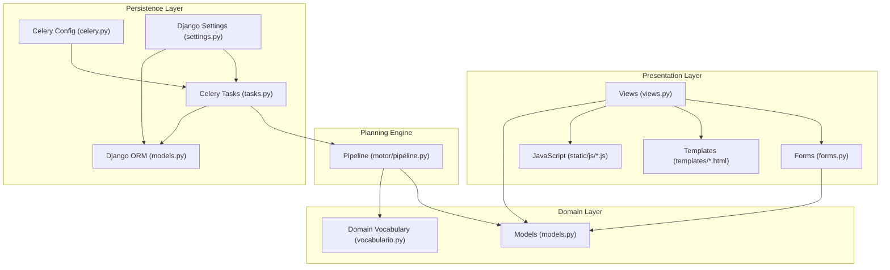
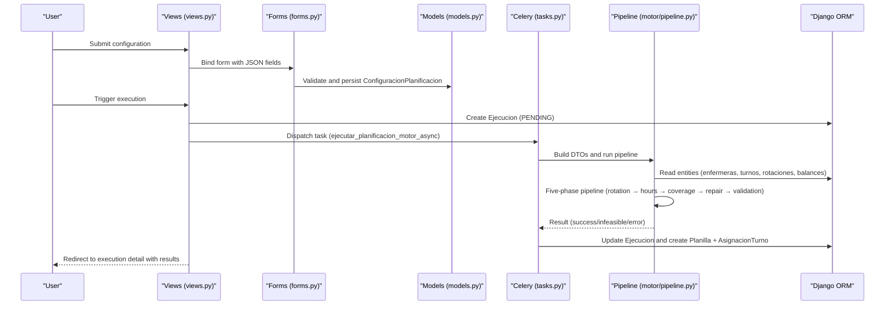
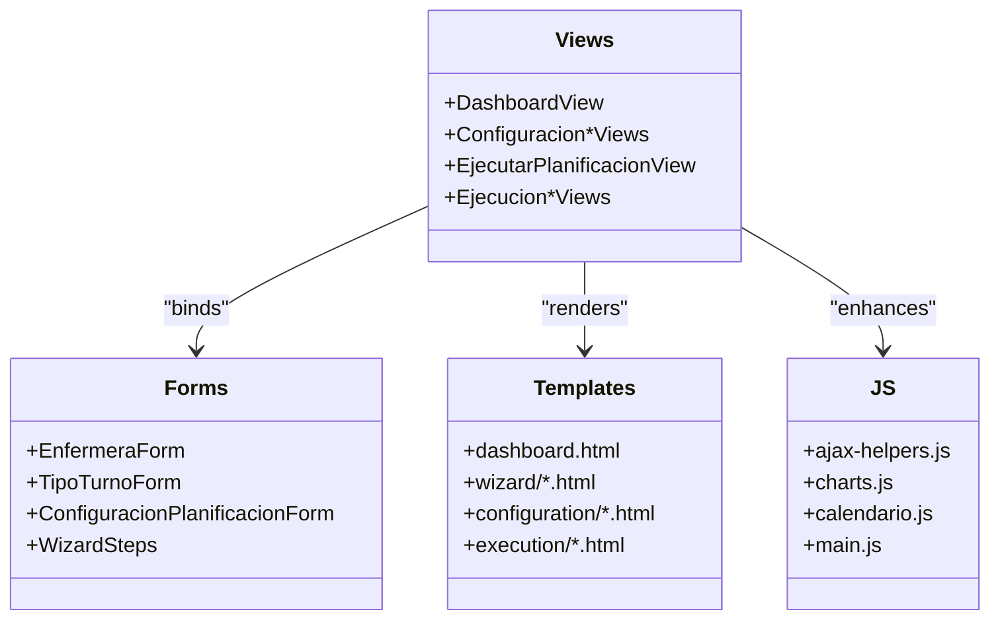
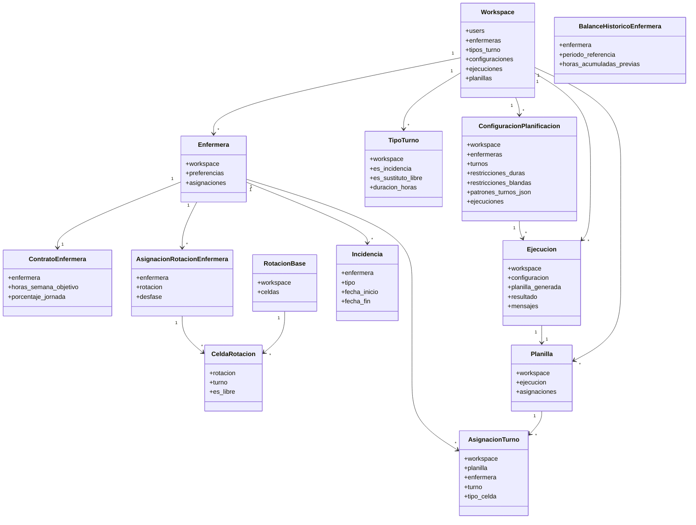
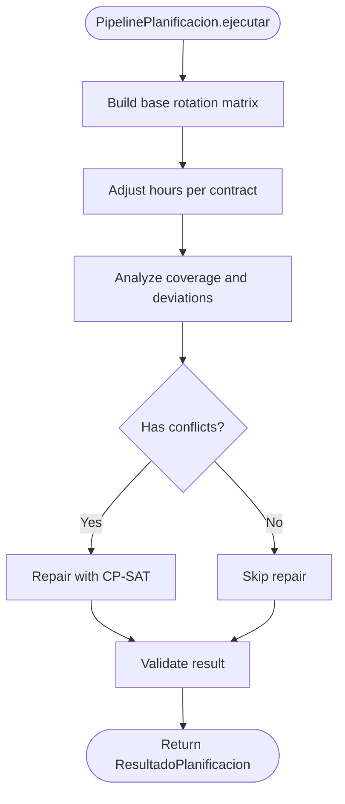
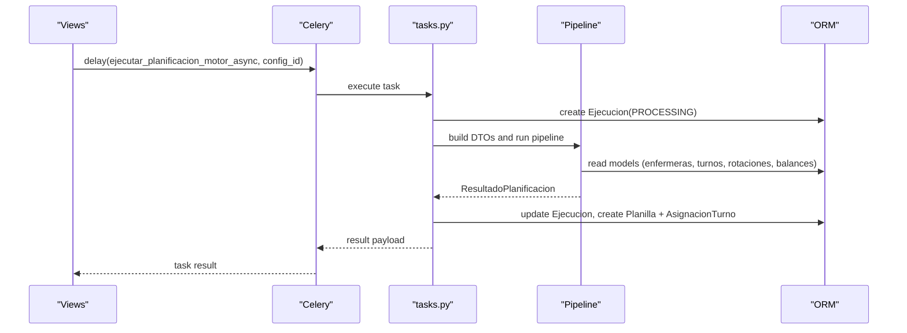
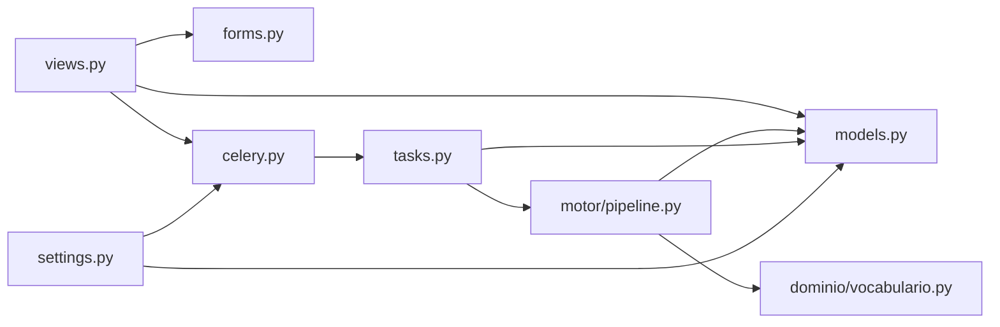

# Component Architecture

<cite>
**Referenced Files in This Document**
- [settings.py](file://proyecto_turnos/settings.py)
- [celery.py](file://proyecto_turnos/celery.py)
- [models.py](file://turnos/models.py)
- [views.py](file://turnos/views.py)
- [pipeline.py](file://turnos/motor/pipeline.py)
- [vocabulario.py](file://turnos/dominio/vocabulario.py)
- [tasks.py](file://turnos/tasks.py)
- [forms.py](file://turnos/forms.py)
</cite>

## Table of Contents
1. [Introduction](#introduction)
2. [Project Structure](#project-structure)
3. [Core Components](#core-components)
4. [Architecture Overview](#architecture-overview)
5. [Detailed Component Analysis](#detailed-component-analysis)
6. [Dependency Analysis](#dependency-analysis)
7. [Performance Considerations](#performance-considerations)
8. [Troubleshooting Guide](#troubleshooting-guide)
9. [Conclusion](#conclusion)
10. [Appendices](#appendices)

## Introduction
This document describes the layered component architecture of the turn scheduling application. It focuses on a four-tier system design:
- Presentation Layer (Views, Templates, Forms, JavaScript)
- Domain Layer (Django Models, New Domain Models, Vocabulary Normalization)
- Planning Engine (5-step Pipeline)
- Persistence Layer (Django ORM, Celery)

It explains component interactions, data flow from configuration input through solver execution to result delivery, the MVC/MTV separation, how views interact with models, and the pipeline orchestration between domain objects and the CP-SAT solver. It also documents system boundaries, integration patterns, cross-cutting concerns (multi-workspace isolation, authentication), and technology stack decisions with scalability and containerization support.

## Project Structure
The project follows a Django application layout with clear separation of concerns:
- proyecto_turnos: Django project configuration, middleware, database, static/media, and Celery integration
- turnos: Application containing models, views, forms, templates, utilities, domain vocabulary, motor pipeline, and Celery tasks
- Static assets and templates for frontend rendering and user interaction

**Diagram sources**
- [views.py:1-800](file://turnos/views.py#L1-L800)
- [forms.py:1-800](file://turnos/forms.py#L1-L800)
- [models.py:1-825](file://turnos/models.py#L1-L825)
- [vocabulario.py:1-112](file://turnos/dominio/vocabulario.py#L1-L112)
- [pipeline.py:1-267](file://turnos/motor/pipeline.py#L1-L267)
- [tasks.py:1-716](file://turnos/tasks.py#L1-L716)
- [celery.py:1-14](file://proyecto_turnos/celery.py#L1-L14)
- [settings.py:1-160](file://proyecto_turnos/settings.py#L1-L160)

**Section sources**
- [settings.py:1-160](file://proyecto_turnos/settings.py#L1-L160)
- [models.py:1-825](file://turnos/models.py#L1-L825)
- [views.py:1-800](file://turnos/views.py#L1-L800)
- [pipeline.py:1-267](file://turnos/motor/pipeline.py#L1-L267)
- [vocabulario.py:1-112](file://turnos/dominio/vocabulario.py#L1-L112)
- [tasks.py:1-716](file://turnos/tasks.py#L1-L716)
- [celery.py:1-14](file://proyecto_turnos/celery.py#L1-L14)

## Core Components
- Presentation Layer
  - Views: Handle HTTP requests, coordinate forms, render templates, and trigger asynchronous execution via Celery
  - Forms: Validate and serialize configuration inputs (JSON fields, selections)
  - Templates: Render dashboards, wizards, lists, and results
  - JavaScript: Enhance UX (ajax helpers, charts, calendar, and dynamic forms)
- Domain Layer
  - Models: Define multi-workspace isolation, core entities (Enfermera, TipoTurno, ConfiguracionPlanificacion, Ejecucion, Planilla, AsignacionTurno), and advanced domain models (ContratoEnfermera, RotacionBase, CeldaRotacion, AsignacionRotacionEnfermera, Incidencia, BalanceHistoricoEnfermera)
  - Vocabulary: Canonical identifiers for constraints, patterns, and solver priorities
- Planning Engine
  - Pipeline: Orchestrates five phases: base rotation → hours adjustment → coverage analysis → CP-SAT repair → validation
- Persistence Layer
  - Django ORM: Centralized persistence for all domain entities
  - Celery: Asynchronous task execution for long-running planning runs

**Section sources**
- [views.py:1-800](file://turnos/views.py#L1-L800)
- [forms.py:1-800](file://turnos/forms.py#L1-L800)
- [models.py:1-825](file://turnos/models.py#L1-L825)
- [vocabulario.py:1-112](file://turnos/dominio/vocabulario.py#L1-L112)
- [pipeline.py:1-267](file://turnos/motor/pipeline.py#L1-L267)
- [tasks.py:1-716](file://turnos/tasks.py#L1-L716)

## Architecture Overview
The system adheres to a layered, event-driven design:
- MVC/MTV separation: Views handle request/response, Templates render UI, Models encapsulate domain logic and persistence
- Multi-workspace isolation: All entities are scoped to a Workspace, ensuring tenant-like separation
- Asynchronous execution: Long-running planning is offloaded to Celery workers
- Canonical vocabulary: Constraints and patterns are normalized for consistent interpretation across the engine

**Diagram sources**
- [views.py:683-792](file://turnos/views.py#L683-L792)
- [forms.py:164-326](file://turnos/forms.py#L164-L326)
- [models.py:332-532](file://turnos/models.py#L332-L532)
- [tasks.py:333-686](file://turnos/tasks.py#L333-L686)
- [pipeline.py:92-246](file://turnos/motor/pipeline.py#L92-L246)

## Detailed Component Analysis

### Presentation Layer
- Views
  - Dashboard, CRUD for configurations, wizard-based creation, execution triggers, and result visualization
  - Execution view creates an Ejecucion record and dispatches a Celery task
- Forms
  - Model forms for Enfermera, TipoTurno, and ConfiguracionPlanificacion
  - Wizard steps with JSON fields for demand, hard and soft constraints, and patterns
  - Validation ensures minimum nurse count, required turn types, and JSON correctness
- Templates and JavaScript
  - Rich UI for configuration wizards, dashboards, calendars, and reports
  - AJAX helpers and chart libraries for interactive displays

**Diagram sources**
- [views.py:52-792](file://turnos/views.py#L52-L792)
- [forms.py:14-800](file://turnos/forms.py#L14-L800)

**Section sources**
- [views.py:52-792](file://turnos/views.py#L52-L792)
- [forms.py:14-800](file://turnos/forms.py#L14-L800)

### Domain Layer
- Multi-workspace isolation
  - Workspace entity links Users and data entities; all major models include workspace foreign keys
- Core entities
  - Enfermera, TipoTurno, ConfiguracionPlanificacion, Ejecucion, Planilla, AsignacionTurno
- Advanced domain models
  - ContratoEnfermera, RotacionBase, CeldaRotacion, AsignacionRotacionEnfermera, Incidencia, BalanceHistoricoEnfermera
- Vocabulary normalization
  - Canonical constraint and pattern names enable consistent interpretation by the engine

**Diagram sources**
- [models.py:12-825](file://turnos/models.py#L12-L825)

**Section sources**
- [models.py:12-825](file://turnos/models.py#L12-L825)
- [vocabulario.py:1-112](file://turnos/dominio/vocabulario.py#L1-L112)

### Planning Engine (5-step Pipeline)
The pipeline orchestrates deterministic base rotation, contract-hours adjustments, coverage analysis, optional CP-SAT repair, and validation. It consumes normalized constraints and patterns and produces a validated schedule.

**Diagram sources**
- [pipeline.py:92-246](file://turnos/motor/pipeline.py#L92-L246)

**Section sources**
- [pipeline.py:31-267](file://turnos/motor/pipeline.py#L31-L267)
- [vocabulario.py:10-112](file://turnos/dominio/vocabulario.py#L10-L112)

### Persistence Layer (Django ORM, Celery)
- Django ORM
  - Centralized persistence for all domain entities with workspace scoping
- Celery
  - Asynchronous task execution for planning runs
  - Task lifecycle: create Ejecucion, run pipeline, persist Planilla and AsignacionTurno, update Ejecucion status

**Diagram sources**
- [views.py:757-780](file://turnos/views.py#L757-L780)
- [tasks.py:333-686](file://turnos/tasks.py#L333-L686)
- [pipeline.py:92-246](file://turnos/motor/pipeline.py#L92-L246)

**Section sources**
- [tasks.py:17-240](file://turnos/tasks.py#L17-L240)
- [tasks.py:333-686](file://turnos/tasks.py#L333-L686)
- [celery.py:1-14](file://proyecto_turnos/celery.py#L1-L14)
- [settings.py:134-160](file://proyecto_turnos/settings.py#L134-L160)

## Dependency Analysis
- Views depend on Forms and Models; they trigger Celery tasks and render templates
- Forms depend on Models for validation and selection fields
- Pipeline depends on Models and Vocabulary for DTOs and canonical identifiers
- Celery tasks depend on Pipeline and Models for execution and persistence
- Settings and Celery configuration bind the asynchronous infrastructure

**Diagram sources**
- [views.py:1-800](file://turnos/views.py#L1-L800)
- [forms.py:1-800](file://turnos/forms.py#L1-L800)
- [models.py:1-825](file://turnos/models.py#L1-L825)
- [pipeline.py:1-267](file://turnos/motor/pipeline.py#L1-L267)
- [vocabulario.py:1-112](file://turnos/dominio/vocabulario.py#L1-L112)
- [tasks.py:1-716](file://turnos/tasks.py#L1-L716)
- [celery.py:1-14](file://proyecto_turnos/celery.py#L1-L14)
- [settings.py:1-160](file://proyecto_turnos/settings.py#L1-L160)

**Section sources**
- [views.py:1-800](file://turnos/views.py#L1-L800)
- [forms.py:1-800](file://turnos/forms.py#L1-L800)
- [models.py:1-825](file://turnos/models.py#L1-L825)
- [pipeline.py:1-267](file://turnos/motor/pipeline.py#L1-L267)
- [vocabulario.py:1-112](file://turnos/dominio/vocabulario.py#L1-L112)
- [tasks.py:1-716](file://turnos/tasks.py#L1-L716)
- [celery.py:1-14](file://proyecto_turnos/celery.py#L1-L14)
- [settings.py:1-160](file://proyecto_turnos/settings.py#L1-L160)

## Performance Considerations
- Asynchronous execution: Long-running planning runs are delegated to Celery workers to avoid blocking the web server
- Bulk operations: Assignments are created in bulk to minimize database round-trips
- Transactional integrity: Atomic blocks protect state transitions and result persistence
- Workspace scoping: Limits cross-entity scans to tenant boundaries
- Timeouts and limits: Celery settings include time limits and retries to prevent resource exhaustion
- Static/media: Whitenoise and compressed static files improve frontend performance

[No sources needed since this section provides general guidance]

## Troubleshooting Guide
- Authentication and redirects
  - LOGIN_URL, LOGIN_REDIRECT_URL, LOGOUT_REDIRECT_URL configured centrally
- Database connectivity checks
  - Celery tasks include a DB connectivity test task
- Execution errors
  - Views mark Ejecucion as ERROR and attach messages; tasks log exceptions and retry up to configured limits
- JSON field validation
  - Forms validate JSON for demand, hard/soft constraints, and patterns; invalid JSON raises validation errors

**Section sources**
- [settings.py:121-124](file://proyecto_turnos/settings.py#L121-L124)
- [tasks.py:317-332](file://turnos/tasks.py#L317-L332)
- [tasks.py:204-240](file://turnos/tasks.py#L204-L240)
- [forms.py:231-326](file://turnos/forms.py#L231-L326)

## Conclusion
The system’s layered architecture cleanly separates presentation, domain, planning, and persistence concerns. Multi-workspace isolation and canonical vocabulary enable scalable, maintainable planning logic. Asynchronous execution via Celery ensures responsiveness while handling computationally intensive scheduling tasks. The design supports future enhancements such as richer constraints, additional solver priorities, and expanded reporting.

[No sources needed since this section summarizes without analyzing specific files]

## Appendices

### Technology Stack Decisions
- Django: Web framework with robust ORM, authentication, and admin
- Celery: Distributed task queue for asynchronous planning execution
- Whitenoise: Static file serving optimized for production deployments
- Redis: Broker and result backend for Celery
- SQLite (development) and PostgreSQL (production-ready via DATABASE_URL): Flexible persistence

**Section sources**
- [settings.py:62-76](file://proyecto_turnos/settings.py#L62-L76)
- [settings.py:134-160](file://proyecto_turnos/settings.py#L134-L160)

### Scalability and Deployment Topology
- Horizontal scaling: Separate web workers and Celery workers; Redis broker supports multiple consumers
- Containerization: Dockerfile and docker-compose files support building and orchestrating services
- Environment separation: DATABASE_URL, Celery broker/result backend, and static/media handled via environment variables

**Section sources**
- [settings.py:62-76](file://proyecto_turnos/settings.py#L62-L76)
- [settings.py:134-160](file://proyecto_turnos/settings.py#L134-L160)