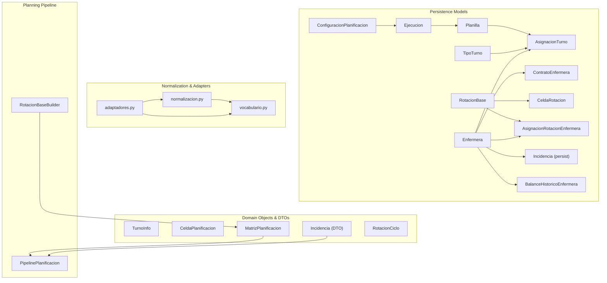
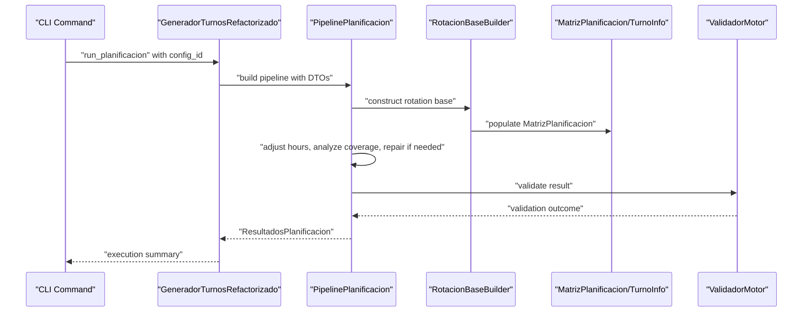
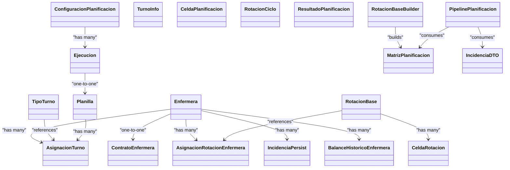

# Domain Layer

<cite>
**Referenced Files in This Document**
- [models.py](file://turnos/models.py)
- [0009_add_domain_models.py](file://turnos/migrations/0009_add_domain_models.py)
- [dtos.py](file://turnos/dominio/dtos.py)
- [normalizacion.py](file://turnos/dominio/normalizacion.py)
- [vocabulario.py](file://turnos/dominio/vocabulario.py)
- [adaptadores.py](file://turnos/dominio/adaptadores.py)
- [pipeline.py](file://turnos/motor/pipeline.py)
- [rotacion_base.py](file://turnos/motor/rotacion_base.py)
- [run_planificacion.py](file://turnos/management/commands/run_planificacion.py)
- [generador_refactorizado.py](file://turnos/generador_refactorizado.py)
- [test_dtos.py](file://turnos/tests/test_dominio/test_dtos.py)
- [test_normalizacion.py](file://turnos/tests/test_dominio/test_normalizacion.py)
</cite>

## Table of Contents
1. [Introduction](#introduction)
2. [Project Structure](#project-structure)
3. [Core Components](#core-components)
4. [Architecture Overview](#architecture-overview)
5. [Detailed Component Analysis](#detailed-component-analysis)
6. [Dependency Analysis](#dependency-analysis)
7. [Performance Considerations](#performance-considerations)
8. [Troubleshooting Guide](#troubleshooting-guide)
9. [Conclusion](#conclusion)
10. [Appendices](#appendices)

## Introduction
This document describes the Domain Layer of the nursing shift planner, focusing on the enhanced Django models and new domain objects that formalize the planning system’s business rules. It explains how rich domain models encapsulate planning logic, how DTOs enable solver integration, and how the vocabulary normalization layer ensures consistent identifiers across legacy and modern configurations. The document also outlines the domain-driven design principles applied, including separation of persistence and domain concerns, and demonstrates practical examples of domain object creation, validation, and integration with the planning pipeline.

## Project Structure
The Domain Layer spans several modules:
- Enhanced Django models for core planning entities (Enfermera, TipoTurno, ConfiguracionPlanificacion, Ejecucion, Planilla, AsignacionTurno)
- New domain models for advanced planning (ContratoEnfermera, RotacionBase, CeldaRotacion, AsignacionRotacionEnfermera, Incidencia, BalanceHistoricoEnfermera)
- Domain objects and DTOs for solver integration (TurnoInfo, CeldaPlanificacion, MatrizPlanificacion, Incidencia DTO, RotacionCiclo)
- Vocabulary normalization and compatibility adapters for legacy configurations
- Integration with the planning pipeline and management commands

**Diagram sources**
- [models.py:30-825](file://turnos/models.py#L30-L825)
- [dtos.py:44-274](file://turnos/dominio/dtos.py#L44-L274)
- [normalizacion.py:10-190](file://turnos/dominio/normalizacion.py#L10-L190)
- [vocabulario.py:10-112](file://turnos/dominio/vocabulario.py#L10-L112)
- [adaptadores.py:22-247](file://turnos/dominio/adaptadores.py#L22-L247)
- [rotacion_base.py:21-94](file://turnos/motor/rotacion_base.py#L21-L94)
- [pipeline.py:31-267](file://turnos/motor/pipeline.py#L31-L267)

**Section sources**
- [models.py:30-825](file://turnos/models.py#L30-L825)
- [dtos.py:1-274](file://turnos/dominio/dtos.py#L1-L274)
- [normalizacion.py:1-190](file://turnos/dominio/normalizacion.py#L1-L190)
- [vocabulario.py:1-112](file://turnos/dominio/vocabulario.py#L1-L112)
- [adaptadores.py:1-247](file://turnos/dominio/adaptadores.py#L1-L247)
- [rotacion_base.py:1-94](file://turnos/motor/rotacion_base.py#L1-L94)
- [pipeline.py:1-267](file://turnos/motor/pipeline.py#L1-L267)

## Core Components
- Rich domain models encapsulate business rules and constraints:
  - Enfermera: professional profile and preferences
  - TipoTurno: turn type with schedule, incidence flag, and “substitute-free” semantics
  - ConfiguracionPlanificacion: planning configuration with combined JSON and legacy ManyToMany patterns
  - AsignacionTurno: assignment with explicit cell type
  - New domain models: ContratoEnfermera, RotacionBase/CeldaRotacion, AsignacionRotacionEnfermera, Incidencia (persist), BalanceHistoricoEnfermera
- DTOs decouple the solver and pipeline from Django models:
  - TurnoInfo, CeldaPlanificacion, MatrizPlanificacion, Incidencia (DTO), RotacionCiclo
- Vocabulary normalization and adapters translate legacy identifiers and formats into canonical domain structures
- Planning pipeline orchestrates deterministic rotation base generation, hours adjustment, coverage analysis, optional repair, and validation

**Section sources**
- [models.py:30-825](file://turnos/models.py#L30-L825)
- [dtos.py:44-274](file://turnos/dominio/dtos.py#L44-L274)
- [normalizacion.py:68-190](file://turnos/dominio/normalizacion.py#L68-L190)
- [adaptadores.py:22-247](file://turnos/dominio/adaptadores.py#L22-L247)
- [pipeline.py:31-267](file://turnos/motor/pipeline.py#L31-L267)

## Architecture Overview
The Domain Layer separates persistence concerns from domain logic:
- Persistence models define schema and constraints
- Domain objects and DTOs carry runtime semantics and solver metadata
- Normalization and adapters bridge legacy configurations to canonical identifiers
- The pipeline consumes DTOs and produces validated results

**Diagram sources**
- [run_planificacion.py:13-40](file://turnos/management/commands/run_planificacion.py#L13-L40)
- [generador_refactorizado.py:105-140](file://turnos/generador_refactorizado.py#L105-L140)
- [pipeline.py:92-267](file://turnos/motor/pipeline.py#L92-L267)
- [rotacion_base.py:41-94](file://turnos/motor/rotacion_base.py#L41-L94)
- [dtos.py:197-274](file://turnos/dominio/dtos.py#L197-L274)

## Detailed Component Analysis

### Enhanced Django Models

#### Enfermera
- Purpose: Professional profile with preferences and notes
- Business rules: Unique constraints on email/DNI per workspace; activation flag; URL resolution for views
- Validation: Encapsulated in model-level constraints and related helpers

**Section sources**
- [models.py:30-58](file://turnos/models.py#L30-L58)

#### TipoTurno
- Purpose: Defines turn types with schedule, short code, and special flags
- Business rules:
  - Substitute-free turns cannot have schedule and cannot be incidences
  - Regular turns require start/end times
  - Short code uniqueness per workspace
- Properties: duration calculation, nocturnal detection, count of configurations

**Section sources**
- [models.py:60-208](file://turnos/models.py#L60-L208)

#### ConfiguracionPlanificacion
- Purpose: Central planning configuration
- Business rules:
  - Period validation (min/max days)
  - Combined JSON and legacy ManyToMany patterns for turn patterns
- Methods: period computation, validation, pattern aggregation

**Section sources**
- [models.py:332-480](file://turnos/models.py#L332-L480)

#### Ejecucion
- Purpose: Execution lifecycle and result storage
- Business rules: state transitions, timing, and result serialization

**Section sources**
- [models.py:482-532](file://turnos/models.py#L482-L532)

#### Planilla
- Purpose: Persisted plan after successful execution
- Business rules: one-to-one relationship with execution; date range and day count

**Section sources**
- [models.py:534-566](file://turnos/models.py#L534-L566)

#### AsignacionTurno
- Purpose: Final assignments with explicit cell type
- Business rules: unique constraint per planilla/enfermera/date; mandatory turn or free day marker

**Section sources**
- [models.py:568-624](file://turnos/models.py#L568-L624)

### New Domain Models

#### ContratoEnfermera
- Purpose: Define contractual hours and workload percentage
- Business rules: target weekly/yearly hours, percentage of full-time, validity period

**Section sources**
- [models.py:629-664](file://turnos/models.py#L629-L664)

#### RotacionBase
- Purpose: Explicit rotation cycle definition
- Business rules: cycle length in days; workspace scoping

**Section sources**
- [models.py:666-688](file://turnos/models.py#L666-L688)

#### CeldaRotacion
- Purpose: Individual cell inside a rotation cycle
- Business rules: ordered positions; either a turn or a free day; uniqueness by rotation/order

**Section sources**
- [models.py:690-720](file://turnos/models.py#L690-L720)

#### AsignacionRotacionEnfermera
- Purpose: Assign a rotation to an enfermera with offset
- Business rules: start/end dates; offset within the cycle

**Section sources**
- [models.py:722-747](file://turnos/models.py#L722-L747)

#### Incidencia (Persistence)
- Purpose: Events affecting planning (vacations, permission, illness, training, fixed assignment)
- Business rules: date range; optional fixed turn for fixed assignment

**Section sources**
- [models.py:749-784](file://turnos/models.py#L749-L784)

#### BalanceHistoricoEnfermera
- Purpose: Historical accumulation for balanced planning
- Business rules: monthly period reference; accumulated hours and counts; last turn type and date

**Section sources**
- [models.py:787-825](file://turnos/models.py#L787-L825)

### DTO System for Solver Integration

#### TurnoInfo
- Purpose: Solver-friendly representation of a turn type
- Properties: duration, nocturnal flag, substitute-free semantics

**Section sources**
- [dtos.py:44-58](file://turnos/dominio/dtos.py#L44-L58)

#### CeldaPlanificacion
- Purpose: Single cell in the planning matrix
- Properties: type classification, free detection, hours, night/fine/weekend/festival flags, immutable base turn snapshot

**Section sources**
- [dtos.py:61-132](file://turnos/dominio/dtos.py#L61-L132)

#### MatrizPlanificacion
- Purpose: Complete planning grid
- Operations: retrieval, assignment, cloning, totals

**Section sources**
- [dtos.py:197-238](file://turnos/dominio/dtos.py#L197-L238)

#### Incidencia (DTO)
- Purpose: Overlay events during post-generation phase
- Behavior: date-range overlap checks

**Section sources**
- [dtos.py:169-181](file://turnos/dominio/dtos.py#L169-L181)

#### RotacionCiclo
- Purpose: Explicit rotation cycle for deterministic base generation
- Behavior: day-offset lookup to obtain turn

**Section sources**
- [dtos.py:184-194](file://turnos/dominio/dtos.py#L184-L194)

#### ResultadoPlanificacion
- Purpose: Structured result of the pipeline
- Fields: success flag, matrix, balances, solver metrics, validation outcomes

**Section sources**
- [dtos.py:251-274](file://turnos/dominio/dtos.py#L251-L274)

### Vocabulary Normalization and Compatibility Adapters

#### Normalization
- Purpose: Translate legacy names to canonical identifiers
- Features: restriction normalization, pattern normalization, list normalization, uppercase fallback

**Section sources**
- [normalizacion.py:68-190](file://turnos/dominio/normalizacion.py#L68-L190)

#### Canonical Vocabulary
- Purpose: Define official identifiers for restrictions, patterns, cell types, and solver priorities
- Coverage: hard and soft constraints, rotation patterns, cell types, solver priority levels

**Section sources**
- [vocabulario.py:10-112](file://turnos/dominio/vocabulario.py#L10-L112)

#### Compatibility Adapters
- Purpose: Bridge legacy configurations and formats to new domain structures
- Components:
  - AdaptadorConfiguracionLegacy: normalize legacy dictionaries
  - AdaptadorPatronesLegacy: convert ManyToMany to normalized JSON
  - AdaptadorRestriccionesLegacy: normalize restriction names
  - AdaptadorIncidenciasLegacy: convert legacy incidence dicts to DTOs
  - AdaptadorRotacionLegacy: convert abstract patterns to explicit cycles

**Section sources**
- [adaptadores.py:22-247](file://turnos/dominio/adaptadores.py#L22-L247)

### Planning Pipeline Integration

#### PipelinePlanificacion
- Purpose: Orchestrates five phases: rotation base, hours adjustment, coverage analysis, optional repair, validation
- Inputs: dates, enfermeras, rotation assignments, offsets, incidences, targets, coverage, solver config, turn info, constraints, historical balances
- Outputs: ResultadoPlanificacion with matrix, balances, metrics, solver status

**Section sources**
- [pipeline.py:31-267](file://turnos/motor/pipeline.py#L31-L267)

#### RotacionBaseBuilder
- Purpose: Deterministic base generation using rotation cycles
- Behavior: computes cell types (including substitute-free), populates MatrizPlanificacion

**Section sources**
- [rotacion_base.py:21-94](file://turnos/motor/rotacion_base.py#L21-L94)

#### Management Command Integration
- Purpose: Exposes planning execution via CLI
- Behavior: loads configuration, delegates to generator, prints results and violations

**Section sources**
- [run_planificacion.py:13-40](file://turnos/management/commands/run_planificacion.py#L13-L40)

## Dependency Analysis

**Diagram sources**
- [models.py:30-825](file://turnos/models.py#L30-L825)
- [dtos.py:44-274](file://turnos/dominio/dtos.py#L44-L274)
- [rotacion_base.py:21-94](file://turnos/motor/rotacion_base.py#L21-L94)
- [pipeline.py:31-267](file://turnos/motor/pipeline.py#L31-L267)

**Section sources**
- [models.py:30-825](file://turnos/models.py#L30-L825)
- [dtos.py:44-274](file://turnos/dominio/dtos.py#L44-L274)
- [rotacion_base.py:21-94](file://turnos/motor/rotacion_base.py#L21-L94)
- [pipeline.py:31-267](file://turnos/motor/pipeline.py#L31-L267)

## Performance Considerations
- DTO-based matrices minimize ORM overhead during solver phases
- Immutability markers (e.g., base turn snapshots) reduce recomputation costs
- Normalization caches canonical forms to avoid repeated conversions
- Pipeline phases are designed to short-circuit when feasible (e.g., no conflicts)

[No sources needed since this section provides general guidance]

## Troubleshooting Guide
Common issues and resolutions:
- Validation errors on TipoTurno: ensure substitute-free turns have no schedule and are not marked as incidences; regular turns require start/end times; short code uniqueness per workspace
- Validation errors on AsignacionTurno: if cell type is TURNO, a turn must be assigned or the free-day flag must be set
- Configuration period out of bounds: adjust number of days within configured min/max limits
- Legacy configuration mismatch: use normalization and adapters to convert names and formats to canonical identifiers

**Section sources**
- [models.py:126-168](file://turnos/models.py#L126-L168)
- [models.py:617-623](file://turnos/models.py#L617-L623)
- [models.py:425-456](file://turnos/models.py#L425-L456)
- [normalizacion.py:68-190](file://turnos/dominio/normalizacion.py#L68-L190)
- [adaptadores.py:22-247](file://turnos/dominio/adaptadores.py#L22-L247)

## Conclusion
The Domain Layer cleanly separates persistence from domain logic, enriches models with business rules, and introduces robust DTOs and normalization to support solver integration and legacy compatibility. The new domain models formalize rotation and historical balancing, while the pipeline orchestrates deterministic base generation followed by optional repair and validation. Together, these components embody domain-driven design principles and enable scalable, maintainable planning automation.

[No sources needed since this section summarizes without analyzing specific files]

## Appendices

### Examples of Domain Object Creation and Validation

- Creating a TurnoInfo and verifying properties
  - Path: [dtos.py:44-58](file://turnos/dominio/dtos.py#L44-L58)
- Creating a CeldaPlanificacion and checking derived properties
  - Path: [dtos.py:61-132](file://turnos/dominio/dtos.py#L61-L132)
- Building a MatrizPlanificacion and assigning cells
  - Path: [dtos.py:197-238](file://turnos/dominio/dtos.py#L197-L238)
- Validating normalization of legacy names
  - Path: [test_normalizacion.py:19-52](file://turnos/tests/test_dominio/test_normalizacion.py#L19-L52)
- Validating DTO behaviors (rotation cycle, weekend detection)
  - Path: [test_dtos.py:145-185](file://turnos/tests/test_dominio/test_dtos.py#L145-L185)

### Integration with the Planning Pipeline
- Running the pipeline from a management command
  - Path: [run_planificacion.py:13-40](file://turnos/management/commands/run_planificacion.py#L13-L40)
- Pipeline orchestration and result construction
  - Path: [pipeline.py:92-267](file://turnos/motor/pipeline.py#L92-L267)
- Deterministic base generation using rotation cycles
  - Path: [rotacion_base.py:41-94](file://turnos/motor/rotacion_base.py#L41-L94)