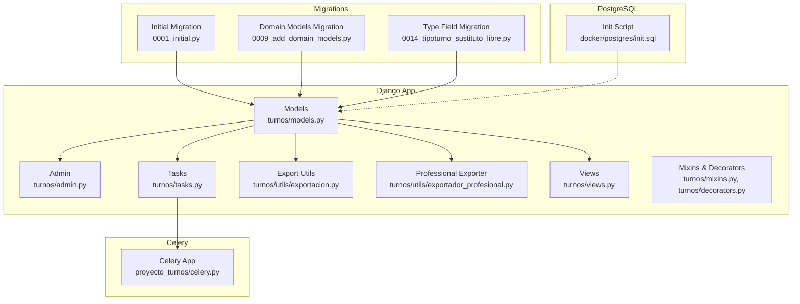
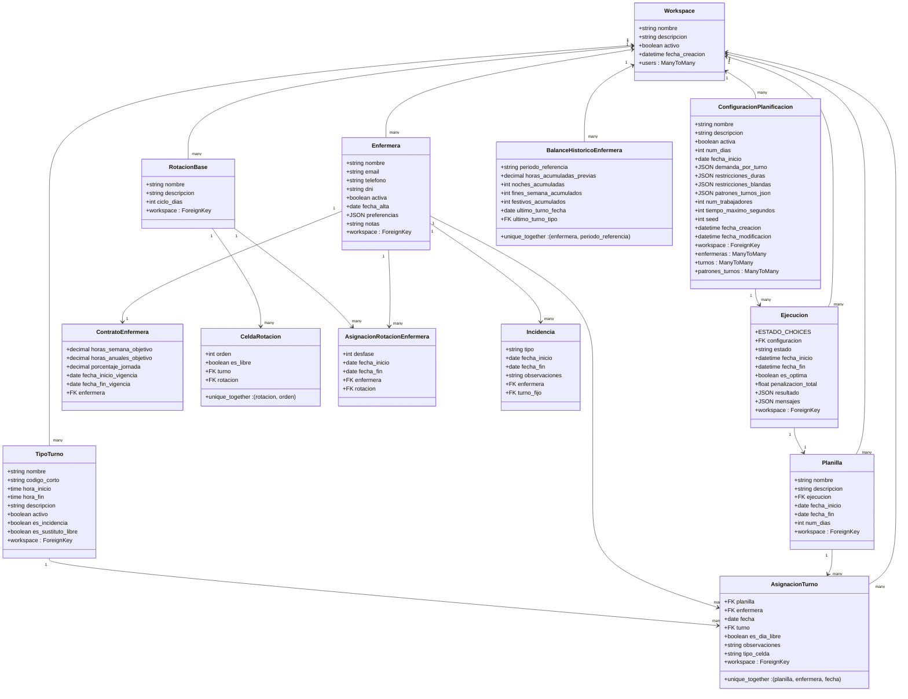
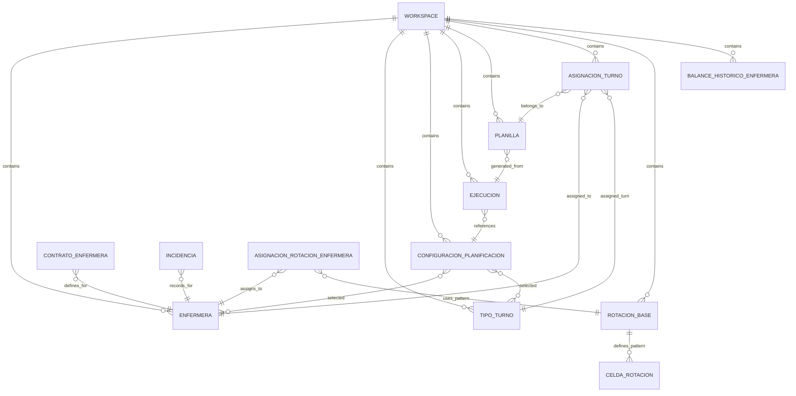
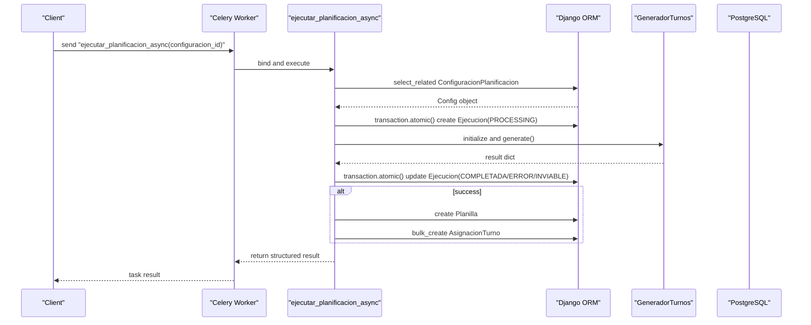
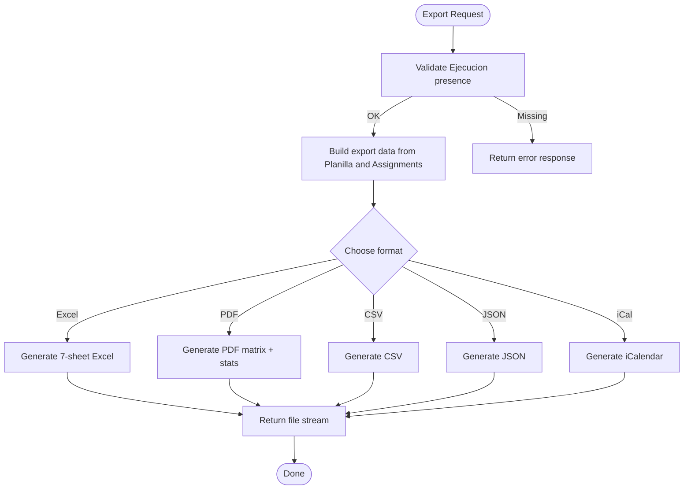
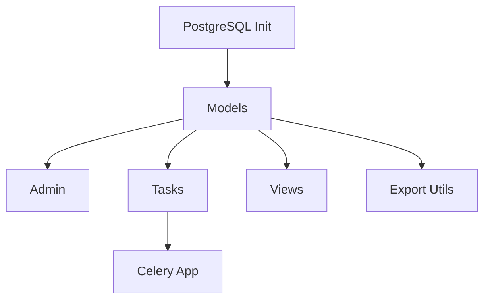

# Persistence Layer

<cite>
**Referenced Files in This Document**
- [models.py](file://turnos/models.py)
- [admin.py](file://turnos/admin.py)
- [tasks.py](file://turnos/tasks.py)
- [celery.py](file://proyecto_turnos/celery.py)
- [exportacion.py](file://turnos/utils/exportacion.py)
- [exportador_profesional.py](file://turnos/utils/exportador_profesional.py)
- [0001_initial.py](file://turnos/migrations/0001_initial.py)
- [0009_add_domain_models.py](file://turnos/migrations/0009_add_domain_models.py)
- [0014_tipoturno_sustituto_libre.py](file://turnos/migrations/0014_tipoturno_sustituto_libre.py)
- [init.sql](file://docker/postgres/init.sql)
- [views.py](file://turnos/views.py)
- [mixins.py](file://turnos/mixins.py)
- [decorators.py](file://turnos/decorators.py)
</cite>

## Table of Contents
1. [Introduction](#introduction)
2. [Project Structure](#project-structure)
3. [Core Components](#core-components)
4. [Architecture Overview](#architecture-overview)
5. [Detailed Component Analysis](#detailed-component-analysis)
6. [Dependency Analysis](#dependency-analysis)
7. [Performance Considerations](#performance-considerations)
8. [Troubleshooting Guide](#troubleshooting-guide)
9. [Conclusion](#conclusion)
10. [Appendices](#appendices)

## Introduction
This document provides a comprehensive guide to the Persistence Layer of the Nursing Shift Scheduler application. It covers Django ORM integration, database schema design, model relationships, indexing strategies, and multi-workspace data isolation. It also documents the Django Admin configuration, asynchronous task processing via Celery, export processing workflows, database migration strategy, model validation rules, and data integrity constraints. Guidance on performance, caching, and scalability is included.

## Project Structure
The persistence layer spans several Django app modules:
- Models define the domain and relational schema.
- Admin provides a tailored Django Admin interface.
- Tasks orchestrate asynchronous execution of planning and exports.
- Migrations encode schema evolution.
- Utilities implement export workflows to Excel, PDF, CSV, JSON, and iCalendar.
- PostgreSQL initialization script configures extensions, search, views, indices, and policies.

**Diagram sources**
- [models.py:12-825](file://turnos/models.py#L12-L825)
- [admin.py:1-449](file://turnos/admin.py#L1-L449)
- [tasks.py:1-716](file://turnos/tasks.py#L1-L716)
- [celery.py:1-14](file://proyecto_turnos/celery.py#L1-L14)
- [exportacion.py:1-665](file://turnos/utils/exportacion.py#L1-L665)
- [exportador_profesional.py:1-990](file://turnos/utils/exportador_profesional.py#L1-L990)
- [0001_initial.py:1-140](file://turnos/migrations/0001_initial.py#L1-L140)
- [0009_add_domain_models.py:1-123](file://turnos/migrations/0009_add_domain_models.py#L1-L123)
- [0014_tipoturno_sustituto_libre.py:1-19](file://turnos/migrations/0014_tipoturno_sustituto_libre.py#L1-L19)
- [init.sql:1-508](file://docker/postgres/init.sql#L1-L508)

**Section sources**
- [models.py:12-825](file://turnos/models.py#L12-L825)
- [admin.py:1-449](file://turnos/admin.py#L1-L449)
- [tasks.py:1-716](file://turnos/tasks.py#L1-L716)
- [celery.py:1-14](file://proyecto_turnos/celery.py#L1-L14)
- [exportacion.py:1-665](file://turnos/utils/exportacion.py#L1-L665)
- [exportador_profesional.py:1-990](file://turnos/utils/exportador_profesional.py#L1-L990)
- [0001_initial.py:1-140](file://turnos/migrations/0001_initial.py#L1-L140)
- [0009_add_domain_models.py:1-123](file://turnos/migrations/0009_add_domain_models.py#L1-L123)
- [0014_tipoturno_sustituto_libre.py:1-19](file://turnos/migrations/0014_tipoturno_sustituto_libre.py#L1-L19)
- [init.sql:1-508](file://docker/postgres/init.sql#L1-L508)

## Core Components
- Workspace: Tenant container isolating data per user group.
- Domain Entities: Enfermera, TipoTurno, ConfiguracionPlanificacion, Ejecucion, Planilla, AsignacionTurno.
- Advanced Domain: ContratoEnfermera, RotacionBase, CeldaRotacion, AsignacionRotacionEnfermera, Incidencia, BalanceHistoricoEnfermera.
- Admin: Tailored ModelAdmin configurations with custom lists, filters, and badges.
- Tasks: Asynchronous planning execution and export generation.
- Exports: Multi-format export pipeline (Excel, PDF, CSV, JSON, iCal) with validation and statistics.

**Section sources**
- [models.py:12-825](file://turnos/models.py#L12-L825)
- [admin.py:1-449](file://turnos/admin.py#L1-L449)
- [tasks.py:17-716](file://turnos/tasks.py#L17-L716)
- [exportacion.py:1-665](file://turnos/utils/exportacion.py#L1-L665)
- [exportador_profesional.py:1-990](file://turnos/utils/exportador_profesional.py#L1-L990)

## Architecture Overview
The persistence layer integrates Django ORM with PostgreSQL, supports multi-workspace isolation, and leverages Celery for asynchronous processing. Admin provides operational controls, while export utilities transform persisted planning results into multiple formats.

**Diagram sources**
- [models.py:12-825](file://turnos/models.py#L12-L825)

## Detailed Component Analysis

### Database Schema Design and Relationships
- Workspace acts as the tenant boundary; all major entities include a workspace foreign key (with exceptions noted below).
- Enfermera and TipoTurno support workspace scoping; legacy admin comments indicate future workspace enforcement.
- ConfiguracionPlanificacion links Enfermera and TipoTurno sets and holds planning metadata.
- Ejecucion captures planning runs with state transitions and results.
- Planilla stores generated schedules and AsignacionTurno records individual assignments.
- Advanced domain models extend planning capabilities:
  - ContratoEnfermera defines contractual hours.
  - RotacionBase and CeldaRotacion define cyclic patterns.
  - AsignacionRotacionEnfermera assigns rotations to nurses with offsets.
  - Incidencia records absence events.
  - BalanceHistoricoEnfermera tracks cumulative metrics per nurse and period.

**Diagram sources**
- [models.py:12-825](file://turnos/models.py#L12-L825)

**Section sources**
- [models.py:12-825](file://turnos/models.py#L12-L825)

### Multi-Workspace Data Isolation
- Workspace is the tenant discriminator. New models include workspace foreign keys; legacy models lack this field but admin comments indicate future migration plans.
- Admin configurations reflect current state, with comments noting workspace-enabled lists pending migration completion.
- PostgreSQL initialization script outlines Row Level Security (RLS) policy examples for future enforcement, although RLS is not enabled in the provided script.

Recommendations:
- Enforce workspace filtering at query time using middleware or per-view scopes.
- Add workspace-aware permissions and enforce RLS in production environments.

**Section sources**
- [models.py:12-825](file://turnos/models.py#L12-L825)
- [admin.py:270-294](file://turnos/admin.py#L270-L294)
- [init.sql:265-276](file://docker/postgres/init.sql#L265-L276)

### Django Admin Interface Configuration
Key customizations:
- TipoTurnoAdmin: Color badges, inline fields, and computed duration and night shift detection.
- PatronTurnosAdmin: Dynamic textarea hints for configuration JSON based on selected type.
- ConfiguracionPlanificacionAdmin: Horizontal filters for ManyToMany relations, readonly audit fields, and detail link.
- EjecucionAdmin: Status badges, result link, readonly durations and messages.
- PlanillaAdmin: Inline count of assignments.
- AsignacionTurnoAdmin: Date hierarchy and search by nurse and plan.
- WorkspaceAdmin: Horizontal filter for users.
- Advanced domain admins: Inline editing for rotation cycles, contract validity, incidence periods, and historical balances.

**Section sources**
- [admin.py:16-449](file://turnos/admin.py#L16-L449)

### Celery Integration for Asynchronous Processing
Celery app configuration:
- Autodiscovers tasks and binds to Django settings.

Planning tasks:
- Shared task executes planning asynchronously, validates inputs, manages atomic transactions, updates Ejecucion states, persists Planilla and AsignacionTurno entries, and handles retries with exponential backoff.
- Alternative motor task orchestrates a new pipeline with richer domain models, including contracts, historical balances, and rotation patterns.
- Utility tasks include cleanup of old executions and statistics reporting.

**Diagram sources**
- [tasks.py:17-240](file://turnos/tasks.py#L17-L240)
- [celery.py:1-14](file://proyecto_turnos/celery.py#L1-L14)

**Section sources**
- [tasks.py:17-716](file://turnos/tasks.py#L17-L716)
- [celery.py:1-14](file://proyecto_turnos/celery.py#L1-L14)

### Export Processing System
Export utilities:
- Excel exporter: Seven-sheet workbook (vertical/horizontal plan, statistics, per-nurse distribution, coverage, equity, validations).
- Professional exporter: Advanced Excel/PDF with statistics, charts, and validation reports.
- CSV/JSON/iCal exporters: Lightweight formats for interoperability.

Workflow:
- Views trigger export functions using persisted Ejecucion and Planilla data.
- Exporters translate ORM objects into structured dictionaries and render to target formats.

**Diagram sources**
- [exportacion.py:135-665](file://turnos/utils/exportacion.py#L135-L665)
- [exportador_profesional.py:256-990](file://turnos/utils/exportador_profesional.py#L256-L990)
- [views.py:26-48](file://turnos/views.py#L26-L48)

**Section sources**
- [exportacion.py:1-665](file://turnos/utils/exportacion.py#L1-L665)
- [exportador_profesional.py:1-990](file://turnos/utils/exportador_profesional.py#L1-L990)
- [views.py:26-48](file://turnos/views.py#L26-L48)

### Database Migration Strategy
- Initial migration establishes core entities and relationships.
- Domain models migration adds advanced planning entities and fields.
- Type field migration introduces “sustituto_libre” flag for flexible absence modeling.
- These migrations evolve the schema while preserving data integrity.

**Diagram sources**
- [0001_initial.py:1-140](file://turnos/migrations/0001_initial.py#L1-L140)
- [0009_add_domain_models.py:1-123](file://turnos/migrations/0009_add_domain_models.py#L1-L123)
- [0014_tipoturno_sustituto_libre.py:1-19](file://turnos/migrations/0014_tipoturno_sustituto_libre.py#L1-L19)

**Section sources**
- [0001_initial.py:1-140](file://turnos/migrations/0001_initial.py#L1-L140)
- [0009_add_domain_models.py:1-123](file://turnos/migrations/0009_add_domain_models.py#L1-L123)
- [0014_tipoturno_sustituto_libre.py:1-19](file://turnos/migrations/0014_tipoturno_sustituto_libre.py#L1-L19)

### Model Validation Rules and Data Integrity Constraints
- Unique constraints on TipoTurno for workspace-scoped name and code.
- Unique constraint on CeldaRotacion for rotation+order uniqueness.
- Unique constraint on BalanceHistoricoEnfermera for nurse+period combination.
- Model-level clean/validation methods enforce business rules (e.g., turn timing, substitute-free constraints).
- Ejecucion state machine and atomic transaction boundaries ensure consistency during planning.

**Section sources**
- [models.py:113-124](file://turnos/models.py#L113-L124)
- [models.py:712-720](file://turnos/models.py#L712-L720)
- [models.py:818-822](file://turnos/models.py#L818-L822)
- [models.py:126-168](file://turnos/models.py#L126-L168)
- [tasks.py:70-126](file://turnos/tasks.py#L70-L126)

### Examples of Queries, Task Scheduling, and Transactions
- Queries:
  - Select related configuration and prefetch related entities for efficient rendering.
  - Filter recent executions and distinct dates for dashboard statistics.
  - Use unique constraints and unique together tuples to prevent duplicates.
- Task scheduling:
  - Use shared_task to enqueue planning jobs.
  - Retry with bounded attempts and delays for transient failures.
- Transactions:
  - Wrap planning result persistence and plan creation in atomic blocks.
  - Update Ejecucion state and results atomically.

**Section sources**
- [views.py:64-95](file://turnos/views.py#L64-L95)
- [tasks.py:17-240](file://turnos/tasks.py#L17-L240)
- [tasks.py:563-639](file://turnos/tasks.py#L563-L639)

## Dependency Analysis
- Models depend on Django ORM and Python standard libraries.
- Admin depends on models and Django admin components.
- Tasks depend on models and external libraries for export formats.
- Celery app depends on Django settings and autodiscovers tasks.
- PostgreSQL init script configures extensions, search, views, and indices.

**Diagram sources**
- [models.py:12-825](file://turnos/models.py#L12-L825)
- [admin.py:1-449](file://turnos/admin.py#L1-L449)
- [tasks.py:1-716](file://turnos/tasks.py#L1-L716)
- [celery.py:1-14](file://proyecto_turnos/celery.py#L1-L14)
- [exportacion.py:1-665](file://turnos/utils/exportacion.py#L1-L665)
- [init.sql:1-508](file://docker/postgres/init.sql#L1-L508)

**Section sources**
- [models.py:12-825](file://turnos/models.py#L12-L825)
- [admin.py:1-449](file://turnos/admin.py#L1-L449)
- [tasks.py:1-716](file://turnos/tasks.py#L1-L716)
- [celery.py:1-14](file://proyecto_turnos/celery.py#L1-L14)
- [exportacion.py:1-665](file://turnos/utils/exportacion.py#L1-L665)
- [init.sql:1-508](file://docker/postgres/init.sql#L1-L508)

## Performance Considerations
- PostgreSQL Extensions and Search:
  - Extensions: uuid-ossp, pg_trgm, unaccent, hstore, pgcrypto.
  - Text search configuration for Spanish without accents.
  - Additional TRGM indices on name/email fields for improved search performance.
- Indices:
  - Django auto-generated indices plus TRGM indices for text search.
  - Consider composite indices for frequent filter/sort patterns (e.g., Ejecucion state+date).
- Views:
  - Materialized or regular views for common aggregates (e.g., active nurses, configuration stats).
- Auditing and Maintenance:
  - Audit triggers capture create/update/delete actions.
  - Automated maintenance functions for reindexing and statistics updates.
- Application-Level:
  - Use select_related/prefetch_related in views to reduce N+1 queries.
  - Bulk operations for assignment creation.
  - Caching for repeated computations (e.g., throttling decorator).

[No sources needed since this section provides general guidance]

## Troubleshooting Guide
Common issues and resolutions:
- Workspace Isolation:
  - Symptom: Cross-tenant data visibility.
  - Resolution: Enforce workspace filtering in views and admin; consider enabling RLS.
- Planning Failures:
  - Symptom: Ejecucion marked ERROR with messages.
  - Resolution: Inspect task logs, validate configuration constraints, retry with corrected inputs.
- Export Errors:
  - Symptom: Missing optional dependencies (openpyxl, reportlab, icalendar).
  - Resolution: Install extras and rerun export.
- Index/Query Performance:
  - Symptom: Slow searches or aggregates.
  - Resolution: Review TRGM indices and consider adding composite indices; analyze query plans.

**Section sources**
- [tasks.py:204-240](file://turnos/tasks.py#L204-L240)
- [init.sql:233-249](file://docker/postgres/init.sql#L233-L249)
- [mixins.py:110-138](file://turnos/mixins.py#L110-L138)
- [decorators.py:110-142](file://turnos/decorators.py#L110-L142)

## Conclusion
The Persistence Layer integrates Django ORM with PostgreSQL to support multi-workspace planning, robust model validation, and scalable asynchronous execution via Celery. Admin customization streamlines operations, while comprehensive export utilities deliver actionable outputs. The migration strategy and PostgreSQL enhancements lay a solid foundation for performance and maintainability.

[No sources needed since this section summarizes without analyzing specific files]

## Appendices

### Indexing Strategies
- TRGM indices on textual fields for fuzzy search.
- Unique constraints for business integrity (type codes, rotation cells, historical balances).
- Consider composite indices for common query patterns.

**Section sources**
- [init.sql:233-249](file://docker/postgres/init.sql#L233-L249)
- [models.py:113-124](file://turnos/models.py#L113-L124)
- [models.py:712-720](file://turnos/models.py#L712-L720)
- [models.py:818-822](file://turnos/models.py#L818-L822)

### Transaction Handling Patterns
- Atomic blocks around Ejecucion state updates and Planilla/AsignacionTurno creation.
- Bulk creation to minimize round-trips.

**Section sources**
- [tasks.py:70-126](file://turnos/tasks.py#L70-L126)
- [tasks.py:563-639](file://turnos/tasks.py#L563-L639)