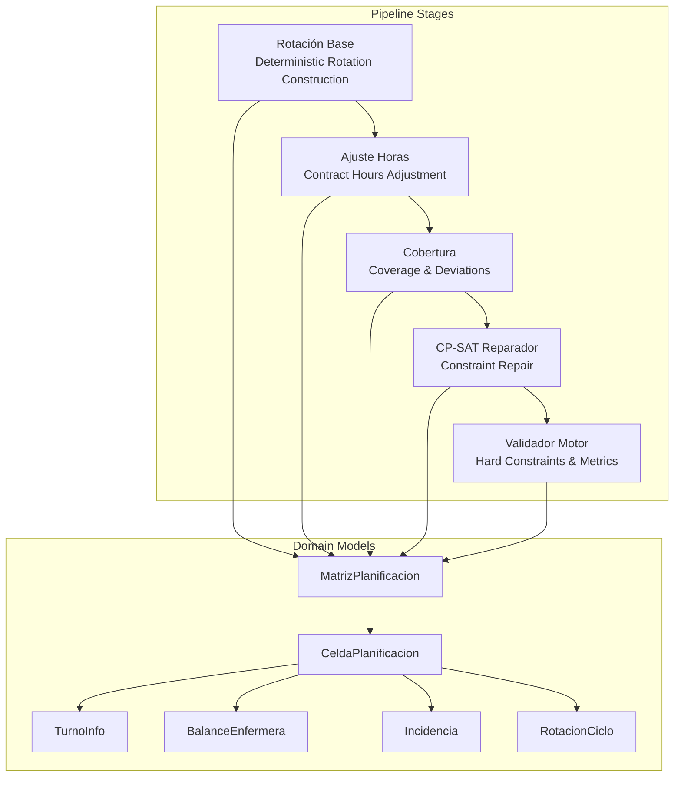
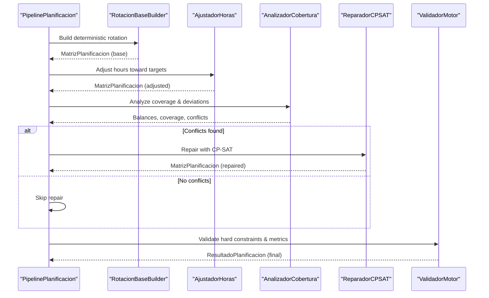
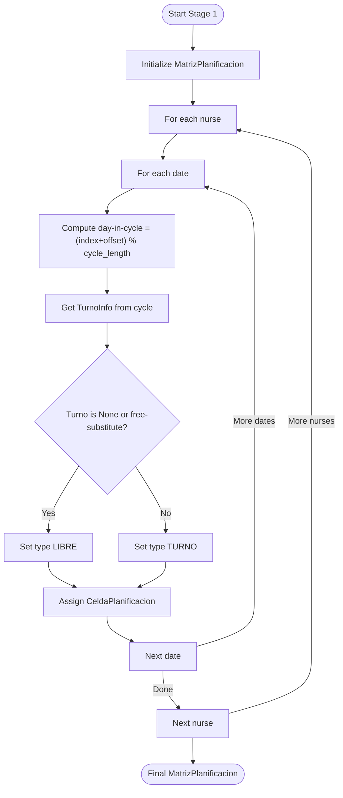
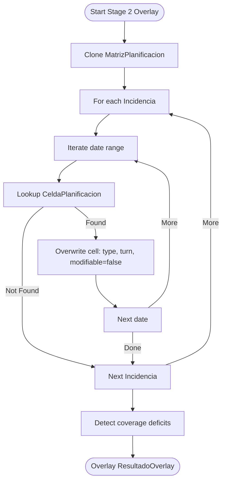
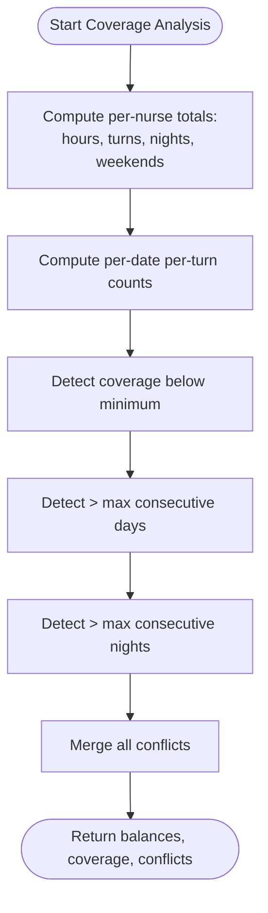
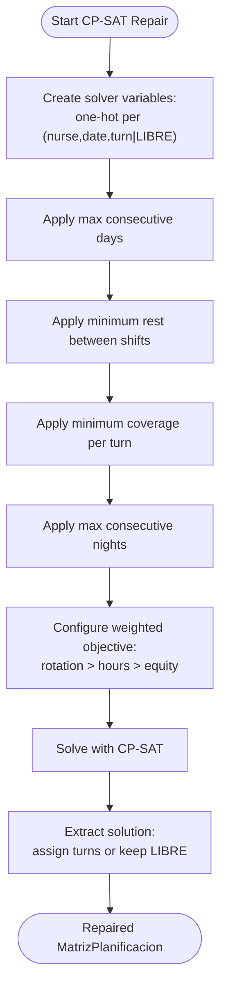
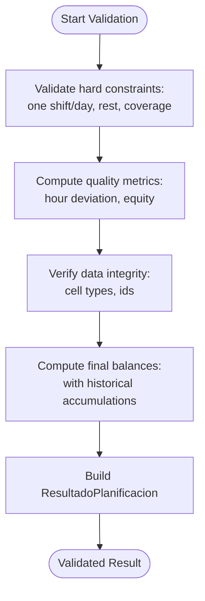
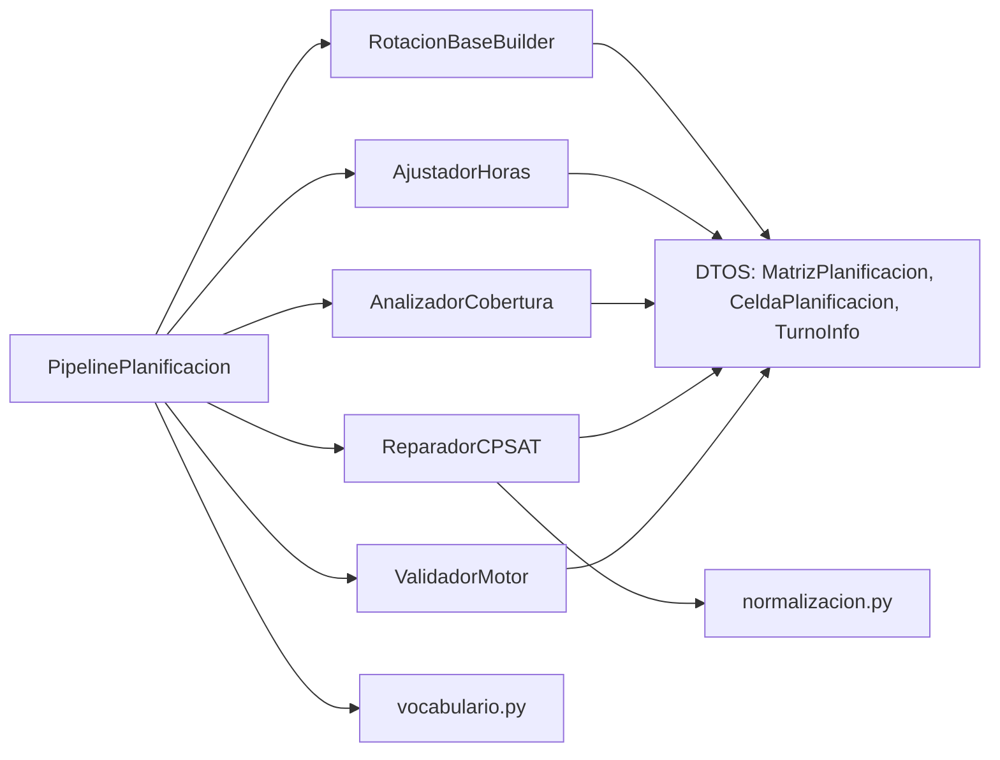
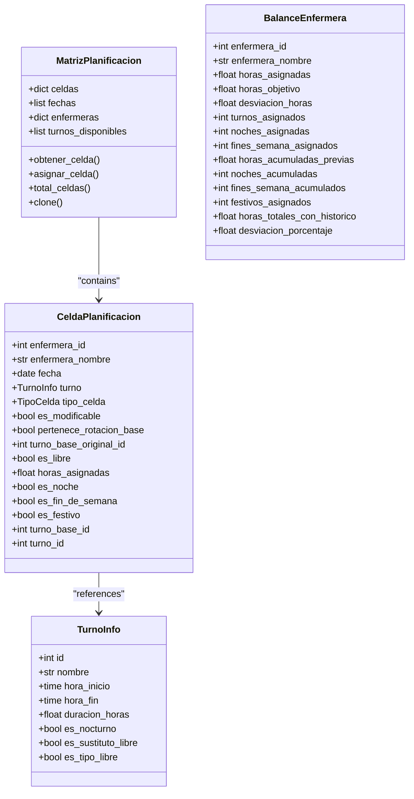

# Planning Engine

<cite>
**Referenced Files in This Document**
- [pipeline.py](file://turnos/motor/pipeline.py)
- [rotacion_base.py](file://turnos/motor/rotacion_base.py)
- [ajuste_horas.py](file://turnos/motor/ajuste_horas.py)
- [cobertura.py](file://turnos/motor/cobertura.py)
- [reparador.py](file://turnos/motor/reparador.py)
- [validador_motor.py](file://turnos/motor/validador_motor.py)
- [overlay_incidencias.py](file://turnos/motor/overlay_incidencias.py)
- [dtos.py](file://turnos/dominio/dtos.py)
- [vocabulario.py](file://turnos/dominio/vocabulario.py)
- [normalizacion.py](file://turnos/dominio/normalizacion.py)
- [adaptadores.py](file://turnos/dominio/adaptadores.py)
- [test_pipeline.py](file://turnos/tests/test_motor/test_pipeline.py)
- [test_reparador.py](file://turnos/tests/test_motor/test_reparador.py)
- [test_integracion_final.py](file://turnos/tests/test_motor/test_integracion_final.py)
</cite>

## Table of Contents
1. [Introduction](#introduction)
2. [Project Structure](#project-structure)
3. [Core Components](#core-components)
4. [Architecture Overview](#architecture-overview)
5. [Detailed Component Analysis](#detailed-component-analysis)
6. [Dependency Analysis](#dependency-analysis)
7. [Performance Considerations](#performance-considerations)
8. [Troubleshooting Guide](#troubleshooting-guide)
9. [Conclusion](#conclusion)
10. [Appendices](#appendices)

## Introduction
This document describes the Planning Engine’s five-stage pipeline that generates regular rotating schedules, validates hard constraints, repairs conflicts with a CP-SAT solver, and persists final results with historical balance updates. It explains deterministic rotation construction, contract-based hour adjustments, coverage and deviation analysis, CP-SAT repair with weighted objectives, and final validation and persistence. It also covers solver integration with Google OR-Tools, the repair mechanism that preserves rotation regularity, and practical examples of pipeline execution and constraint handling.

## Project Structure
The Planning Engine resides under turnos/motor and uses domain DTOs under turnos/dominio. Tests under turnos/tests validate pipeline stages and solver behavior.

**Diagram sources**
- [pipeline.py:92-234](file://turnos/motor/pipeline.py#L92-L234)
- [rotacion_base.py:41-93](file://turnos/motor/rotacion_base.py#L41-L93)
- [ajuste_horas.py:46-88](file://turnos/motor/ajuste_horas.py#L46-L88)
- [cobertura.py:46-73](file://turnos/motor/cobertura.py#L46-L73)
- [reparador.py:63-95](file://turnos/motor/reparador.py#L63-L95)
- [validador_motor.py:48-86](file://turnos/motor/validador_motor.py#L48-L86)
- [dtos.py:197-237](file://turnos/dominio/dtos.py#L197-L237)

**Section sources**
- [pipeline.py:31-267](file://turnos/motor/pipeline.py#L31-L267)
- [dtos.py:197-237](file://turnos/dominio/dtos.py#L197-L237)

## Core Components
- PipelinePlanificacion orchestrates the five-stage pipeline, invoking each stage in order and aggregating results.
- RotacionBaseBuilder constructs a deterministic base schedule from explicit rotation cycles and nurse offsets.
- AjustadorHoras adjusts hours per nurse toward contractual targets with minimal disruption.
- AnalizadorCobertura computes balances, coverage, and detects hard-constraint violations.
- ReparadorCPSAT repairs detected conflicts using CP-SAT with weighted objectives and rotation preservation.
- ValidadorMotor performs hard-constraint checks, quality metrics, and prepares final results with balances and warnings.
- OverlayIncidencias applies vacation, permission, leave, training, and fixed assignment overlays after generation.

**Section sources**
- [pipeline.py:92-234](file://turnos/motor/pipeline.py#L92-L234)
- [rotacion_base.py:41-93](file://turnos/motor/rotacion_base.py#L41-L93)
- [ajuste_horas.py:46-88](file://turnos/motor/ajuste_horas.py#L46-L88)
- [cobertura.py:46-73](file://turnos/motor/cobertura.py#L46-L73)
- [reparador.py:63-95](file://turnos/motor/reparador.py#L63-L95)
- [validador_motor.py:48-86](file://turnos/motor/validador_motor.py#L48-L86)
- [overlay_incidencias.py:45-75](file://turnos/motor/overlay_incidencias.py#L45-L75)

## Architecture Overview
The pipeline executes in strict order: deterministic rotation → contract hours → coverage analysis → CP-SAT repair → validation and persistence. Hard constraints are enforced at stages 3 and 5. Soft objectives (lexicographic priorities) are encoded as weighted penalties in the CP-SAT model.

**Diagram sources**
- [pipeline.py:107-234](file://turnos/motor/pipeline.py#L107-L234)
- [reparador.py:63-95](file://turnos/motor/reparador.py#L63-L95)
- [validador_motor.py:48-86](file://turnos/motor/validador_motor.py#L48-L86)

## Detailed Component Analysis

### Stage 1: Deterministic Rotation Construction
- Purpose: Build a rotating schedule from explicit cycles and nurse offsets without solver.
- Inputs: dates, nurses, rotation assignments, per-nurse offsets.
- Process:
  - For each nurse-date pair, compute day-in-cycle using offset and cycle length.
  - Select TurnoInfo from the cycle; mark as LIBRE if None or substitute-free.
  - Mark cells as belonging to base rotation and snapshot original turn ID for later repair.
- Outputs: MatrizPlanificacion with all cells assigned deterministically.

**Diagram sources**
- [rotacion_base.py:41-93](file://turnos/motor/rotacion_base.py#L41-L93)

**Section sources**
- [rotacion_base.py:41-93](file://turnos/motor/rotacion_base.py#L41-L93)
- [dtos.py:61-131](file://turnos/dominio/dtos.py#L61-L131)

### Stage 2: Fixed Incidents Application
- Purpose: Apply vacation, permission, leave, training, blocked availability, and fixed assignments.
- Note: This stage is documented conceptually; the pipeline itself does not apply incidents automatically. They are applied as a post-generation overlay in a separate phase.
- OverlayIncidencias:
  - Iterates over incident date ranges and overwrites matching cells.
  - Marks cells as non-modifiable and sets appropriate types and observations.
  - Detects coverage deficits caused by the overlay.

**Diagram sources**
- [overlay_incidencias.py:45-75](file://turnos/motor/overlay_incidencias.py#L45-L75)

**Section sources**
- [overlay_incidencias.py:45-75](file://turnos/motor/overlay_incidencias.py#L45-L75)
- [dtos.py:169-181](file://turnos/dominio/dtos.py#L169-L181)

### Stage 3: Coverage Calculation and Deviations
- Purpose: Compute per-nurse totals, per-turn coverage, and detect hard-constraint violations.
- Inputs: MatrizPlanificacion, per-nurse target hours, minimum coverage per turn, historical balances, max consecutive days/night rules.
- Outputs: balances, coverage counts, conflict list, and presence flag.

**Diagram sources**
- [cobertura.py:46-73](file://turnos/motor/cobertura.py#L46-L73)
- [cobertura.py:139-207](file://turnos/motor/cobertura.py#L139-L207)

**Section sources**
- [cobertura.py:46-73](file://turnos/motor/cobertura.py#L46-L73)
- [cobertura.py:139-207](file://turnos/motor/cobertura.py#L139-L207)

### Stage 4: CP-SAT Repair
- Purpose: Resolve detected coverage and soft-equity conflicts while preserving rotation regularity.
- Solver: Google OR-Tools CP-SAT.
- Approach:
  - Variables: one Boolean variable per (nurse, date, turn-or-LIBRE).
  - Constraints:
    - Exactly-one assignment per cell.
    - Max consecutive days/night constraints.
    - Minimum rest between consecutive shifts (real-time calculation).
    - Minimum coverage per turn.
  - Objective: weighted sum minimizing:
    - Deviation from base rotation (highest weight).
    - Monthly hours balance.
    - Night and weekend equity.
  - Repair preserves rotation pattern by penalizing changes from the immutable base snapshot.

**Diagram sources**
- [reparador.py:63-95](file://turnos/motor/reparador.py#L63-L95)
- [reparador.py:97-132](file://turnos/motor/reparador.py#L97-L132)
- [reparador.py:133-296](file://turnos/motor/reparador.py#L133-L296)
- [reparador.py:297-334](file://turnos/motor/reparador.py#L297-L334)
- [reparador.py:581-608](file://turnos/motor/reparador.py#L581-L608)

**Section sources**
- [reparador.py:63-95](file://turnos/motor/reparador.py#L63-L95)
- [reparador.py:97-132](file://turnos/motor/reparador.py#L97-L132)
- [reparador.py:133-296](file://turnos/motor/reparador.py#L133-L296)
- [reparador.py:297-334](file://turnos/motor/reparador.py#L297-L334)
- [reparador.py:581-608](file://turnos/motor/reparador.py#L581-L608)

### Stage 5: Validation and Persistence
- Purpose: Verify hard constraints, compute final metrics, and prepare persisted results.
- Hard checks:
  - One shift/day per nurse.
  - Max consecutive days/night.
  - Minimum rest between shifts (including cross-period continuity).
  - Minimum coverage per turn.
- Quality checks:
  - Hour deviation, night and weekend equity.
- Persistence:
  - Final balances include historical accumulations.
  - ResultadoPlanificacion carries exit status, warnings, and solver metadata.

**Diagram sources**
- [validador_motor.py:48-86](file://turnos/motor/validador_motor.py#L48-L86)
- [validador_motor.py:88-104](file://turnos/motor/validador_motor.py#L88-L104)
- [validador_motor.py:312-364](file://turnos/motor/validador_motor.py#L312-L364)
- [validador_motor.py:366-387](file://turnos/motor/validador_motor.py#L366-L387)
- [validador_motor.py:389-438](file://turnos/motor/validador_motor.py#L389-L438)

**Section sources**
- [validador_motor.py:48-86](file://turnos/motor/validador_motor.py#L48-L86)
- [validador_motor.py:88-104](file://turnos/motor/validador_motor.py#L88-L104)
- [validador_motor.py:312-364](file://turnos/motor/validador_motor.py#L312-L364)
- [validador_motor.py:366-387](file://turnos/motor/validador_motor.py#L366-L387)
- [validador_motor.py:389-438](file://turnos/motor/validador_motor.py#L389-L438)

## Dependency Analysis
- Pipeline orchestration depends on:
  - RotacionBaseBuilder for deterministic base.
  - AjustadorHoras for contract hours alignment.
  - AnalizadorCobertura for conflict detection.
  - ReparadorCPSAT for conflict resolution.
  - ValidadorMotor for hard-constraint verification and finalization.
- Domain DTOs define the shared data structures and enums used across stages.
- Vocabulary and normalization provide canonical identifiers and weights for solver priorities.

**Diagram sources**
- [pipeline.py:31-74](file://turnos/motor/pipeline.py#L31-L74)
- [reparador.py:19-58](file://turnos/motor/reparador.py#L19-L58)
- [vocabulario.py:75-111](file://turnos/dominio/vocabulario.py#L75-L111)
- [normalizacion.py:68-92](file://turnos/dominio/normalizacion.py#L68-L92)
- [dtos.py:197-237](file://turnos/dominio/dtos.py#L197-L237)

**Section sources**
- [pipeline.py:31-74](file://turnos/motor/pipeline.py#L31-L74)
- [reparador.py:19-58](file://turnos/motor/reparador.py#L19-L58)
- [vocabulario.py:75-111](file://turnos/dominio/vocabulario.py#L75-L111)
- [normalizacion.py:68-92](file://turnos/dominio/normalizacion.py#L68-L92)
- [dtos.py:197-237](file://turnos/dominio/dtos.py#L197-L237)

## Performance Considerations
- CP-SAT solver parameters:
  - Time limit and worker count configured to balance speed and solution quality.
- Objective weighting:
  - Heavy penalty on rotation deviation ensures minimal disruption to the base pattern.
- Coverage analysis:
  - Linear scans over nurses and dates; efficient due to sparse matrices.
- Hour adjustment:
  - Greedy selection prioritizes neighbors of free days to minimize pattern fragmentation.

[No sources needed since this section provides general guidance]

## Troubleshooting Guide
Common issues and resolutions:
- CP-SAT infeasible or slow:
  - Review hard constraints and coverage requirements; reduce minimum coverage or increase rest thresholds.
  - Verify turn durations and rest computations are correct.
- Unexpected rotation changes:
  - Confirm that the immutable base snapshot is respected during repair.
- Violations after validation:
  - Inspect hard-constraint checks for consecutive days/night and minimum rest.
- Historical balance not applied:
  - Ensure historical balances are passed to both coverage analyzer and CP-SAT.

**Section sources**
- [reparador.py:75-89](file://turnos/motor/reparador.py#L75-L89)
- [validador_motor.py:88-104](file://turnos/motor/validador_motor.py#L88-L104)
- [test_reparador.py:130-154](file://turnos/tests/test_motor/test_reparador.py#L130-L154)

## Conclusion
The Planning Engine produces robust, regular rotating schedules by combining deterministic construction, contract-aligned hour adjustments, rigorous coverage analysis, CP-SAT repair with weighted objectives, and final hard-constraint validation. Historical balances are integrated throughout, and the repair mechanism preserves rotation regularity while resolving conflicts efficiently.

[No sources needed since this section summarizes without analyzing specific files]

## Appendices

### A. Five-Stage Pipeline Execution Example
- Deterministic rotation built from cycles and offsets.
- Contract hours adjusted with minimal changes.
- Coverage analyzed; conflicts reported.
- CP-SAT repairs if needed; otherwise skip.
- Final validation yields success/failure, balances, and warnings.

**Section sources**
- [pipeline.py:107-234](file://turnos/motor/pipeline.py#L107-L234)
- [test_pipeline.py:274-362](file://turnos/tests/test_motor/test_pipeline.py#L274-L362)

### B. Constraint Handling and Solver Weights
- Hard constraints enforced by coverage analyzer and validator.
- Soft objectives prioritized lexicographically via weighted penalties in CP-SAT.
- Weights emphasize rotation preservation, followed by monthly hours balance, and equity.

**Section sources**
- [reparador.py:297-334](file://turnos/motor/reparador.py#L297-L334)
- [vocabulario.py:75-111](file://turnos/dominio/vocabulario.py#L75-L111)

### C. Data Model Overview

**Diagram sources**
- [dtos.py:197-237](file://turnos/dominio/dtos.py#L197-L237)
- [dtos.py:61-131](file://turnos/dominio/dtos.py#L61-L131)
- [dtos.py:44-57](file://turnos/dominio/dtos.py#L44-L57)
- [dtos.py:135-166](file://turnos/dominio/dtos.py#L135-L166)