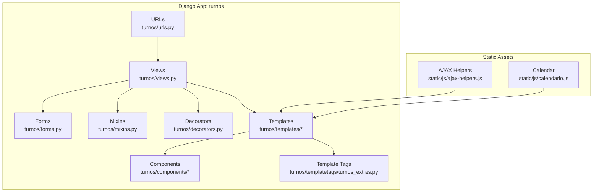
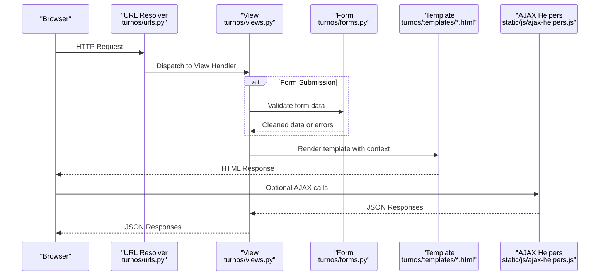
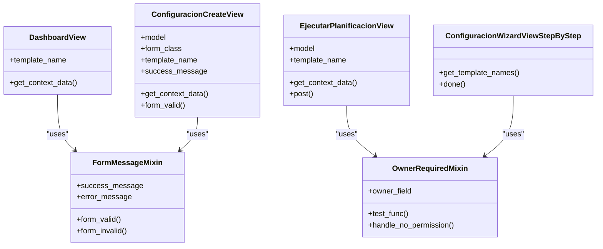
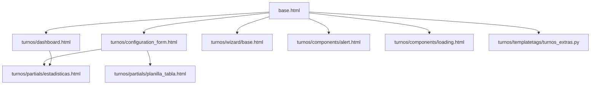
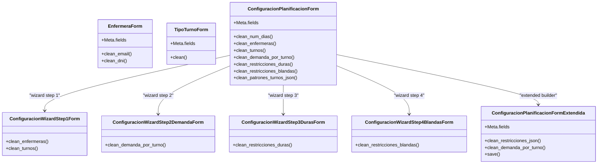
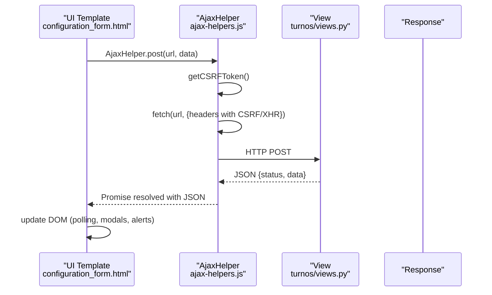
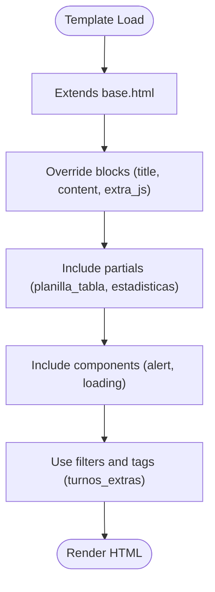
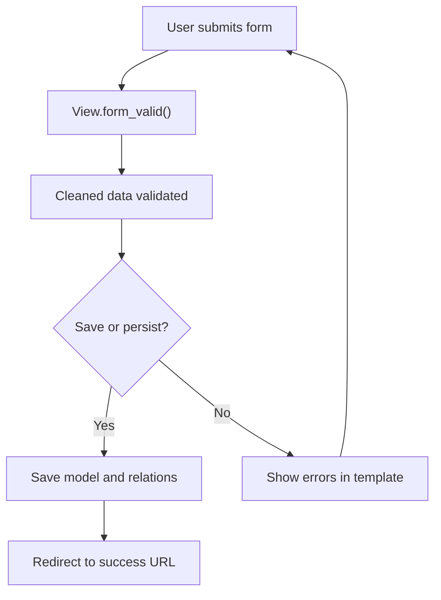
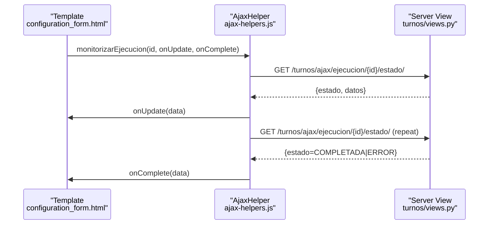
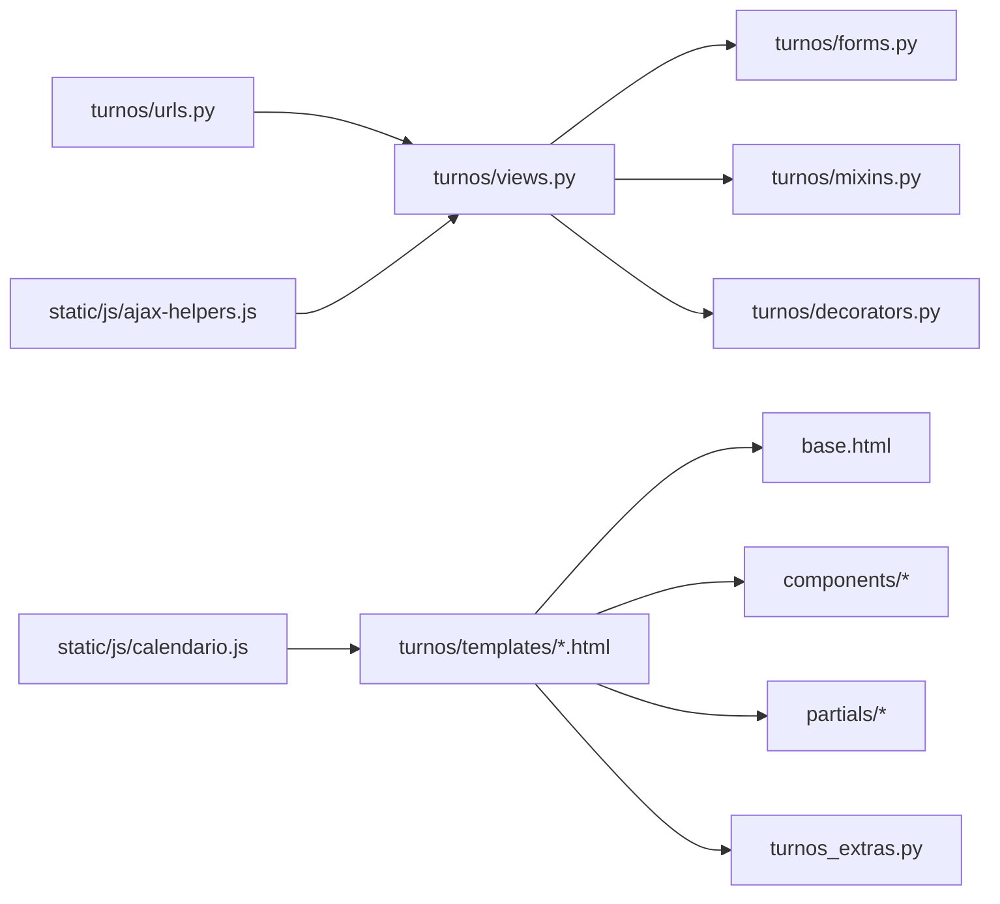

# Presentation Layer

<cite>
**Referenced Files in This Document**
- [views.py](file://turnos/views.py)
- [forms.py](file://turnos/forms.py)
- [mixins.py](file://turnos/mixins.py)
- [decorators.py](file://turnos/decorators.py)
- [urls.py](file://turnos/urls.py)
- [base.html](file://turnos/templates/base.html)
- [dashboard.html](file://turnos/templates/turnos/dashboard.html)
- [configuration_form.html](file://turnos/templates/turnos/configuration_form.html)
- [wizard/base.html](file://turnos/templates/turnos/wizard/base.html)
- [partials/planilla_tabla.html](file://turnos/templates/turnos/partials/planilla_tabla.html)
- [partials/estadisticas.html](file://turnos/templates/turnos/partials/estadisticas.html)
- [components/alert.html](file://turnos/components/alert.html)
- [components/loading.html](file://turnos/components/loading.html)
- [ajax-helpers.js](file://static/js/ajax-helpers.js)
- [calendario.js](file://static/js/calendario.js)
- [turnos_extras.py](file://turnos/templatetags/turnos_extras.py)
- [login.html](file://turnos/templates/accounts/login.html)
</cite>

## Table of Contents
1. [Introduction](#introduction)
2. [Project Structure](#project-structure)
3. [Core Components](#core-components)
4. [Architecture Overview](#architecture-overview)
5. [Detailed Component Analysis](#detailed-component-analysis)
6. [Dependency Analysis](#dependency-analysis)
7. [Performance Considerations](#performance-considerations)
8. [Troubleshooting Guide](#troubleshooting-guide)
9. [Conclusion](#conclusion)
10. [Appendices](#appendices)

## Introduction
This document explains the Presentation Layer of the application, focusing on Django’s Model-Template-View (MTV) architecture. It covers:
- Views: class-based and function-based, including decorators and mixins
- Templates: inheritance, reusable components, and context processors
- Forms: validation, field types, and rendering
- Frontend JavaScript: AJAX helpers, calendar functionality, and interactive components
- How the system separates Django’s MTV from traditional MVC and how views handle HTTP requests, render templates, and manage user interactions

## Project Structure
The Presentation Layer spans three primary areas:
- Views: turnos/views.py defines class-based views, form views, and specialized views for execution and exports
- Templates: turnos/templates contains base.html and feature-specific templates with inheritance and reusable components
- Static assets: static/js provides JavaScript modules for AJAX and interactive UI

**Diagram sources**
- [views.py:1-2495](file://turnos/views.py#L1-L2495)
- [forms.py:1-905](file://turnos/forms.py#L1-L905)
- [mixins.py:1-229](file://turnos/mixins.py#L1-L229)
- [decorators.py:1-162](file://turnos/decorators.py#L1-L162)
- [urls.py:1-108](file://turnos/urls.py#L1-L108)
- [base.html:1-384](file://turnos/templates/base.html#L1-L384)
- [ajax-helpers.js:1-316](file://static/js/ajax-helpers.js#L1-L316)
- [calendario.js:1-243](file://static/js/calendario.js#L1-L243)
- [turnos_extras.py:1-855](file://turnos/templatetags/turnos_extras.py#L1-L855)

**Section sources**
- [views.py:1-2495](file://turnos/views.py#L1-L2495)
- [urls.py:1-108](file://turnos/urls.py#L1-L108)

## Core Components
- Views: Class-based views (ListView, DetailView, CreateView, UpdateView, DeleteView, FormView, TemplateView) handle HTTP requests, apply mixins, and render templates. Specialized views include execution triggers and wizards.
- Forms: Model forms and formsets encapsulate validation, field rendering, and JSON-based fields for complex configurations.
- Mixins: Reusable behaviors for permissions, pagination, search, filtering, AJAX handling, and messaging.
- Decorators: Function-based decorators enforce permissions, ownership, AJAX-only access, throttling, and logging.
- Templates: Base template provides layout and navigation; feature templates extend it and use reusable components and filters.
- JavaScript: AJAX helpers centralize CSRF handling and HTTP operations; calendar module renders interactive calendars.

**Section sources**
- [views.py:50-95](file://turnos/views.py#L50-L95)
- [forms.py:14-326](file://turnos/forms.py#L14-L326)
- [mixins.py:11-229](file://turnos/mixins.py#L11-L229)
- [decorators.py:12-162](file://turnos/decorators.py#L12-L162)
- [base.html:1-384](file://turnos/templates/base.html#L1-L384)
- [ajax-helpers.js:8-225](file://static/js/ajax-helpers.js#L8-L225)

## Architecture Overview
The Presentation Layer follows Django’s MTV:
- Model: Data models are handled by the domain layer (outside scope here)
- Template: Renders HTML with inheritance and reusable components
- View: Handles HTTP requests, applies mixins and decorators, orchestrates forms and models, and renders templates

**Diagram sources**
- [urls.py:11-107](file://turnos/urls.py#L11-L107)
- [views.py:50-95](file://turnos/views.py#L50-L95)
- [forms.py:14-326](file://turnos/forms.py#L14-L326)
- [ajax-helpers.js:39-89](file://static/js/ajax-helpers.js#L39-L89)

## Detailed Component Analysis

### View Layer: Class-Based and Function-Based Views
- Class-based views:
  - DashboardView: Renders the dashboard with statistics and recent executions
  - CRUD views: ConfiguracionListView, ConfiguracionDetailView, ConfiguracionCreateView, ConfiguracionUpdateView, ConfiguracionDeleteView
  - Execution views: EjecucionListView, EjecucionDetailView, EjecucionDeleteView, EjecutarPlanificacionView, EjecucionRapidaView
  - Wizard: ConfiguracionWizardView (step-by-step) and ConfiguracionWizardViewStepByStep (SessionWizardView)
  - Utility: ConfiguracionDuplicarView (POST duplication)
- Mixins applied:
  - LoginRequiredMixin for authentication
  - OwnerRequiredMixin for ownership checks
  - FormMessageMixin for automatic success/error messages
  - SearchMixin, FilterMixin, PaginationMixin for list views
  - AjaxRequiredMixin for AJAX-only endpoints
- Function-based views and helpers:
  - Decorators enforce permissions and AJAX constraints
  - Specialized views handle execution orchestration and export actions

**Diagram sources**
- [views.py:52-95](file://turnos/views.py#L52-L95)
- [views.py:148-190](file://turnos/views.py#L148-L190)
- [views.py:683-792](file://turnos/views.py#L683-L792)
- [views.py:378-482](file://turnos/views.py#L378-L482)
- [mixins.py:71-86](file://turnos/mixins.py#L71-L86)
- [mixins.py:33-47](file://turnos/mixins.py#L33-L47)

**Section sources**
- [views.py:52-95](file://turnos/views.py#L52-L95)
- [views.py:148-190](file://turnos/views.py#L148-L190)
- [views.py:683-792](file://turnos/views.py#L683-L792)
- [views.py:378-482](file://turnos/views.py#L378-L482)
- [mixins.py:33-86](file://turnos/mixins.py#L33-L86)

### Template Layer: Inheritance, Components, and Filters
- Base template (base.html): Provides global layout, navigation, breadcrumbs, messages, and shared assets
- Feature templates:
  - dashboard.html extends base.html and renders cards, recent executions, and quick actions
  - configuration_form.html extends base.html and renders a complex configuration form with JSON builders
  - wizard/base.html extends base.html and provides a step-by-step wizard layout
  - Partial templates (partials/planilla_tabla.html, partials/estadisticas.html) encapsulate reusable UI blocks
  - Components (components/alert.html, components/loading.html) provide reusable snippets
- Template tags (turnos_extras.py): Provide filters for dictionaries, lists, formatting, badges, and inclusion tags for components

**Diagram sources**
- [base.html:1-384](file://turnos/templates/base.html#L1-L384)
- [dashboard.html:1-189](file://turnos/templates/turnos/dashboard.html#L1-L189)
- [configuration_form.html:1-607](file://turnos/templates/turnos/configuration_form.html#L1-L607)
- [wizard/base.html:1-157](file://turnos/templates/turnos/wizard/base.html#L1-L157)
- [partials/planilla_tabla.html:1-78](file://turnos/templates/turnos/partials/planilla_tabla.html#L1-L78)
- [partials/estadisticas.html:1-312](file://turnos/templates/turnos/partials/estadisticas.html#L1-L312)
- [components/alert.html:1-7](file://turnos/components/alert.html#L1-L7)
- [components/loading.html:1-7](file://turnos/components/loading.html#L1-L7)
- [turnos_extras.py:1-855](file://turnos/templatetags/turnos_extras.py#L1-L855)

**Section sources**
- [base.html:1-384](file://turnos/templates/base.html#L1-L384)
- [dashboard.html:1-189](file://turnos/templates/turnos/dashboard.html#L1-L189)
- [configuration_form.html:1-607](file://turnos/templates/turnos/configuration_form.html#L1-L607)
- [wizard/base.html:1-157](file://turnos/templates/turnos/wizard/base.html#L1-L157)
- [partials/planilla_tabla.html:1-78](file://turnos/templates/turnos/partials/planilla_tabla.html#L1-L78)
- [partials/estadisticas.html:1-312](file://turnos/templates/turnos/partials/estadisticas.html#L1-L312)
- [components/alert.html:1-7](file://turnos/components/alert.html#L1-L7)
- [components/loading.html:1-7](file://turnos/components/loading.html#L1-L7)
- [turnos_extras.py:1-855](file://turnos/templatetags/turnos_extras.py#L1-L855)

### Forms Layer: Validation, Field Types, and Rendering
- Model forms:
  - EnfermeraForm: Validates uniqueness and Spanish DNI format
  - TipoTurnoForm: Validates time ranges, duration bounds, and mutually exclusive flags
  - ConfiguracionPlanificacionForm: Validates numeric ranges, selections, and JSON fields (demanda, restricciones, patrones)
- Form classes:
  - ConfiguracionWizardStep1Form, ConfiguracionWizardStep2DemandaForm, ConfiguracionWizardStep3DurasForm, ConfiguracionWizardStep4BlandasForm
  - EjecucionRapidaForm, FiltroEjecucionesForm, ImportarEnfermerasForm
- Extended form: ConfiguracionPlanificacionFormExtendida supports a JSON builder for restrictions and patterns
- Validation patterns:
  - Clean methods for cross-field validation
  - JSON parsing with robust error handling
  - Widget customization for Bootstrap styling

**Diagram sources**
- [forms.py:14-73](file://turnos/forms.py#L14-L73)
- [forms.py:75-162](file://turnos/forms.py#L75-L162)
- [forms.py:164-326](file://turnos/forms.py#L164-L326)
- [forms.py:328-392](file://turnos/forms.py#L328-L392)
- [forms.py:394-446](file://turnos/forms.py#L394-L446)
- [forms.py:448-512](file://turnos/forms.py#L448-L512)
- [forms.py:514-551](file://turnos/forms.py#L514-L551)
- [forms.py:639-782](file://turnos/forms.py#L639-L782)

**Section sources**
- [forms.py:14-73](file://turnos/forms.py#L14-L73)
- [forms.py:75-162](file://turnos/forms.py#L75-L162)
- [forms.py:164-326](file://turnos/forms.py#L164-L326)
- [forms.py:328-512](file://turnos/forms.py#L328-L512)
- [forms.py:639-782](file://turnos/forms.py#L639-L782)

### Frontend JavaScript Integration: AJAX and Calendar
- AJAX helpers (ajax-helpers.js):
  - Centralized CSRF token retrieval and X-Requested-With headers
  - Generic GET/POST/PUT/DELETE handlers
  - Form submission with FormData
  - Content loading and polling utilities
  - Application-specific helpers: execution status monitoring, configuration validation, duplication, export triggers, dashboard stats, and user preferences
- Calendar (calendario.js):
  - Interactive month grid with day click events
  - Modal detail view for daily assignments
  - Navigation controls and today/current month logic
  - Bootstrap-powered UI integration

**Diagram sources**
- [configuration_form.html:609-753](file://turnos/templates/turnos/configuration_form.html#L609-L753)
- [ajax-helpers.js:67-89](file://static/js/ajax-helpers.js#L67-L89)
- [ajax-helpers.js:241-257](file://static/js/ajax-helpers.js#L241-L257)
- [views.py:722-792](file://turnos/views.py#L722-L792)

**Section sources**
- [ajax-helpers.js:8-225](file://static/js/ajax-helpers.js#L8-L225)
- [ajax-helpers.js:234-257](file://static/js/ajax-helpers.js#L234-L257)
- [calendario.js:12-66](file://static/js/calendario.js#L12-L66)
- [calendario.js:110-177](file://static/js/calendario.js#L110-L177)
- [configuration_form.html:609-753](file://turnos/templates/turnos/configuration_form.html#L609-L753)

### Template Inheritance Patterns and Reusable Components
- Inheritance:
  - Feature templates extend base.html and override blocks (title, content, extra_css, extra_js)
  - Wizard templates extend base.html and embed step indicators and help panels
- Reusable components:
  - Partials encapsulate complex UI sections (tables, statistics)
  - Components provide alert and loading spinners
- Template tags:
  - Dictionary/list accessors, formatting, badges, and inclusion tags for components

**Diagram sources**
- [base.html:1-384](file://turnos/templates/base.html#L1-L384)
- [dashboard.html:1-189](file://turnos/templates/turnos/dashboard.html#L1-L189)
- [wizard/base.html:1-157](file://turnos/templates/turnos/wizard/base.html#L1-L157)
- [partials/planilla_tabla.html:1-78](file://turnos/templates/turnos/partials/planilla_tabla.html#L1-L78)
- [partials/estadisticas.html:1-312](file://turnos/templates/turnos/partials/estadisticas.html#L1-L312)
- [components/alert.html:1-7](file://turnos/components/alert.html#L1-L7)
- [components/loading.html:1-7](file://turnos/components/loading.html#L1-L7)
- [turnos_extras.py:1-855](file://turnos/templatetags/turnos_extras.py#L1-L855)

**Section sources**
- [base.html:1-384](file://turnos/templates/base.html#L1-L384)
- [dashboard.html:1-189](file://turnos/templates/turnos/dashboard.html#L1-L189)
- [wizard/base.html:1-157](file://turnos/templates/turnos/wizard/base.html#L1-L157)
- [partials/planilla_tabla.html:1-78](file://turnos/templates/turnos/partials/planilla_tabla.html#L1-L78)
- [partials/estadisticas.html:1-312](file://turnos/templates/turnos/partials/estadisticas.html#L1-L312)
- [components/alert.html:1-7](file://turnos/components/alert.html#L1-L7)
- [components/loading.html:1-7](file://turnos/components/loading.html#L1-L7)
- [turnos_extras.py:1-855](file://turnos/templatetags/turnos_extras.py#L1-L855)

### Form Processing Workflows
- Basic CRUD:
  - Create/Update/Delete views leverage Django’s generic views with mixins for permissions and messages
  - get_context_data enriches templates with related data and computed metrics
- Wizard:
  - Step-by-step wizard collects data across multiple steps, validates JSON fields, and persists configuration atomically
- Execution:
  - Execution view validates prerequisites, creates an execution record, dispatches a background task, and redirects to the execution detail page

**Diagram sources**
- [views.py:162-190](file://turnos/views.py#L162-L190)
- [views.py:261-283](file://turnos/views.py#L261-L283)
- [views.py:385-482](file://turnos/views.py#L385-L482)

**Section sources**
- [views.py:162-190](file://turnos/views.py#L162-L190)
- [views.py:261-283](file://turnos/views.py#L261-L283)
- [views.py:385-482](file://turnos/views.py#L385-L482)

### Frontend-Backend Communication via AJAX
- AJAX helpers:
  - Automatic CSRF token resolution
  - Standardized request headers for XMLHttpRequest
  - JSON parsing and error propagation
- Calendar integration:
  - Click-to-open modal with daily assignments
  - Navigation updates the grid dynamically
- Execution monitoring:
  - Periodic polling for execution status
  - Real-time UI updates based on server responses

**Diagram sources**
- [configuration_form.html:738-753](file://turnos/templates/turnos/configuration_form.html#L738-L753)
- [ajax-helpers.js:241-257](file://static/js/ajax-helpers.js#L241-L257)
- [views.py:722-792](file://turnos/views.py#L722-L792)

**Section sources**
- [ajax-helpers.js:8-225](file://static/js/ajax-helpers.js#L8-L225)
- [ajax-helpers.js:234-257](file://static/js/ajax-helpers.js#L234-L257)
- [configuration_form.html:738-753](file://turnos/templates/turnos/configuration_form.html#L738-L753)

### Separation Between Django’s MTV and Traditional MVC
- Django’s MTV differs from classic MVC by emphasizing:
  - Template-centric rendering (templates are closer to “views” in MVC)
  - Views handling HTTP requests and delegating to templates and forms
  - Forms encapsulating validation and rendering logic
- In this project:
  - Views act as orchestrators, applying mixins and decorators, invoking forms, and rendering templates
  - Templates focus on presentation and composition using inheritance and components
  - JavaScript handles client-side interactivity and AJAX-driven updates

[No sources needed since this section provides conceptual clarification]

## Dependency Analysis
- Views depend on:
  - Forms for validation and data persistence
  - Mixins for cross-cutting concerns (permissions, pagination, AJAX)
  - Decorators for function-based enforcement
  - URLs for routing
- Templates depend on:
  - Base template for layout
  - Components and partials for reuse
  - Template tags for formatting and UI helpers
- JavaScript depends on:
  - Templates for DOM hooks
  - Views for AJAX endpoints

**Diagram sources**
- [views.py:1-2495](file://turnos/views.py#L1-L2495)
- [forms.py:1-905](file://turnos/forms.py#L1-L905)
- [mixins.py:1-229](file://turnos/mixins.py#L1-L229)
- [decorators.py:1-162](file://turnos/decorators.py#L1-L162)
- [urls.py:1-108](file://turnos/urls.py#L1-L108)
- [base.html:1-384](file://turnos/templates/base.html#L1-L384)
- [turnos_extras.py:1-855](file://turnos/templatetags/turnos_extras.py#L1-L855)
- [ajax-helpers.js:1-316](file://static/js/ajax-helpers.js#L1-L316)
- [calendario.js:1-243](file://static/js/calendario.js#L1-L243)

**Section sources**
- [views.py:1-2495](file://turnos/views.py#L1-L2495)
- [forms.py:1-905](file://turnos/forms.py#L1-L905)
- [mixins.py:1-229](file://turnos/mixins.py#L1-L229)
- [decorators.py:1-162](file://turnos/decorators.py#L1-L162)
- [urls.py:1-108](file://turnos/urls.py#L1-L108)
- [base.html:1-384](file://turnos/templates/base.html#L1-L384)
- [turnos_extras.py:1-855](file://turnos/templatetags/turnos_extras.py#L1-L855)
- [ajax-helpers.js:1-316](file://static/js/ajax-helpers.js#L1-L316)
- [calendario.js:1-243](file://static/js/calendario.js#L1-L243)

## Performance Considerations
- Efficient database queries:
  - select_related and prefetch_related reduce N+1 queries in list/detail views
  - JSON serialization uses DjangoJSONEncoder for predictable output
- Pagination and filtering:
  - PaginationMixin and FilterMixin reduce payload sizes
- Client-server communication:
  - AJAX polling intervals and max attempts prevent excessive requests
  - JSON-only endpoints minimize HTML overhead for data exchange

[No sources needed since this section provides general guidance]

## Troubleshooting Guide
- Authentication and permissions:
  - LoginRequiredMixin ensures access control; check user authentication state
  - OwnerRequiredMixin verifies ownership; confirm owner_field matches model
- AJAX-only endpoints:
  - AjaxRequiredMixin rejects non-XHR requests; ensure X-Requested-With header
- Form validation:
  - JSON fields require valid structures; review clean_* methods for detailed error messages
- Execution failures:
  - Execution view logs errors and sets execution state; inspect messages and logs
- Template rendering:
  - Verify base.html inheritance and block overrides
  - Confirm component and partial includes exist and paths are correct

**Section sources**
- [mixins.py:11-86](file://turnos/mixins.py#L11-L86)
- [mixins.py:50-57](file://turnos/mixins.py#L50-L57)
- [forms.py:231-326](file://turnos/forms.py#L231-L326)
- [views.py:722-792](file://turnos/views.py#L722-L792)
- [base.html:1-384](file://turnos/templates/base.html#L1-L384)

## Conclusion
The Presentation Layer integrates Django’s MTV with modern frontend practices:
- Views orchestrate HTTP handling, validation, and rendering
- Templates emphasize inheritance and reuse through components and partials
- Forms encapsulate validation and JSON-based configuration
- JavaScript augments UX with AJAX and interactive UI

[No sources needed since this section summarizes without analyzing specific files]

## Appendices

### Example: Template Inheritance Pattern
- Base template defines global layout and navigation
- Feature templates extend base and override content blocks
- Wizard templates provide step indicators and help panels

**Section sources**
- [base.html:1-384](file://turnos/templates/base.html#L1-L384)
- [dashboard.html:1-189](file://turnos/templates/turnos/dashboard.html#L1-L189)
- [wizard/base.html:1-157](file://turnos/templates/turnos/wizard/base.html#L1-L157)

### Example: Form Processing Workflow
- User submits configuration form
- View validates via form.clean_* methods
- On success, view persists configuration and redirects

**Section sources**
- [forms.py:164-326](file://turnos/forms.py#L164-L326)
- [views.py:162-190](file://turnos/views.py#L162-L190)

### Example: Frontend-Backend Communication via AJAX
- Template triggers AjaxHelper.post to validate configuration
- Server responds with JSON; template updates UI

**Section sources**
- [ajax-helpers.js:67-89](file://static/js/ajax-helpers.js#L67-L89)
- [configuration_form.html:609-753](file://turnos/templates/turnos/configuration_form.html#L609-L753)