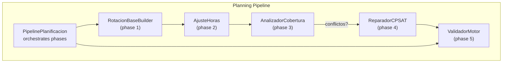
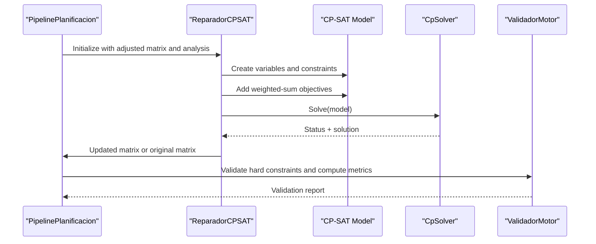
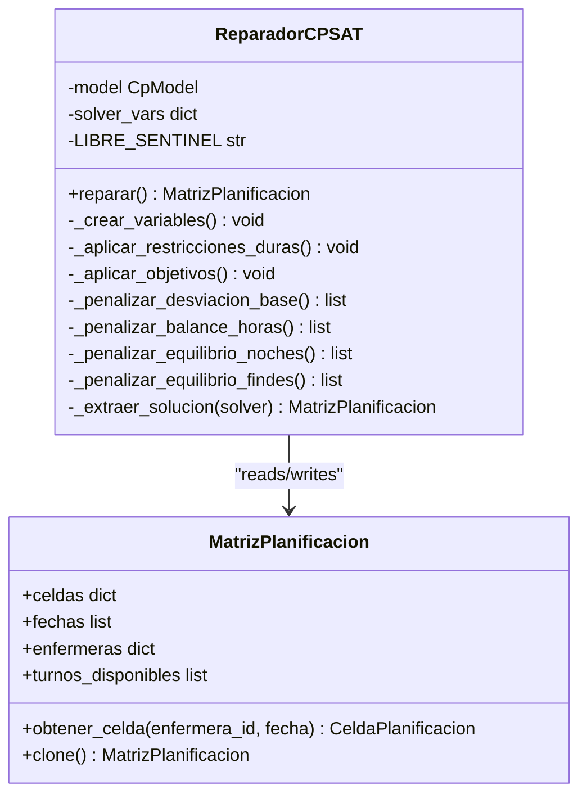
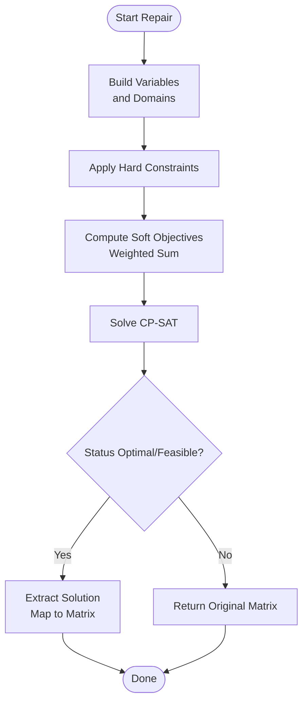
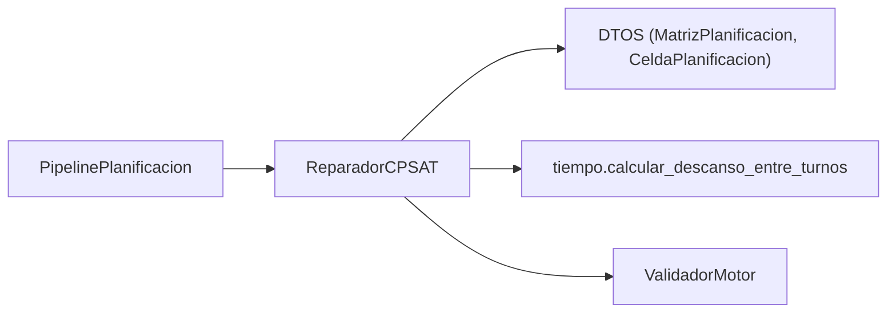

# CP-SAT Repair Phase

<cite>
**Referenced Files in This Document**
- [reparador.py](file://turnos/motor/reparador.py)
- [pipeline.py](file://turnos/motor/pipeline.py)
- [validador_motor.py](file://turnos/motor/validador_motor.py)
- [dtos.py](file://turnos/dominio/dtos.py)
- [tiempo.py](file://turnos/utils/tiempo.py)
- [test_reparador.py](file://turnos/tests/test_motor/test_reparador.py)
- [test_integracion_final.py](file://turnos/tests/test_motor/test_integracion_final.py)
- [WIKI.md](file://docs/WIKI.md)
</cite>

## Table of Contents
1. [Introduction](#introduction)
2. [Project Structure](#project-structure)
3. [Core Components](#core-components)
4. [Architecture Overview](#architecture-overview)
5. [Detailed Component Analysis](#detailed-component-analysis)
6. [Dependency Analysis](#dependency-analysis)
7. [Performance Considerations](#performance-considerations)
8. [Troubleshooting Guide](#troubleshooting-guide)
9. [Conclusion](#conclusion)
10. [Appendices](#appendices)

## Introduction
This document explains the CP-SAT repair phase that resolves conflicts in the nursing shift schedule while preserving rotation regularity and minimizing changes. It focuses on the ReparadorCPSAT class, solver configuration, and repair algorithms. It documents CP-SAT integration, variable definitions, and objective functions, and shows how the system repairs conflicts, maintains rotation patterns, and optimizes soft constraints. It also covers lexicographic optimization approaches, constraint prioritization, solver performance, timeout handling, repair quality assessment, and practical guidance for configuration tuning and troubleshooting.

## Project Structure
The repair phase is part of the planning pipeline orchestrated by PipelinePlanificacion. ReparadorCPSAT builds a CP-SAT model from the adjusted matrix, applies hard constraints, and optimizes soft objectives. Validation occurs afterward to ensure hard constraints are satisfied and to compute quality metrics.

**Diagram sources**
- [pipeline.py:92-234](file://turnos/motor/pipeline.py#L92-L234)
- [reparador.py:63-96](file://turnos/motor/reparador.py#L63-L96)

**Section sources**
- [pipeline.py:92-234](file://turnos/motor/pipeline.py#L92-L234)

## Core Components
- ReparadorCPSAT: CP-SAT-based repair engine that minimizes deviations from the base rotation and soft objectives while satisfying hard constraints.
- PipelinePlanificacion: Orchestration of the five-phase pipeline, invoking repair only when coverage conflicts are detected.
- ValidadorMotor: Post-repair validation ensuring hard constraints are met and computing balances and quality metrics.
- DTOs and utilities: Data structures and time utilities supporting the repair process.

Key responsibilities:
- Build CP-SAT variables for each cell/enfermera/date/shift combination plus a special “free” sentinel.
- Enforce hard constraints: consecutive shifts, minimum rest between shifts, minimum coverage per shift/day, maximum consecutive nights.
- Apply weighted-sum soft objectives: base rotation deviation, monthly hours balance, night equity, weekend equity.
- Extract solution and preserve rotation regularity using immutable base rotation snapshots.

**Section sources**
- [reparador.py:24-96](file://turnos/motor/reparador.py#L24-L96)
- [pipeline.py:170-200](file://turnos/motor/pipeline.py#L170-L200)
- [validador_motor.py:48-86](file://turnos/motor/validador_motor.py#L48-L86)
- [dtos.py:61-132](file://turnos/dominio/dtos.py#L61-L132)

## Architecture Overview
The repair phase sits between coverage analysis and final validation. It uses CP-SAT to resolve conflicts by changing minimal sets of cells while respecting hard constraints and optimizing soft objectives.

**Diagram sources**
- [pipeline.py:170-200](file://turnos/motor/pipeline.py#L170-L200)
- [reparador.py:63-96](file://turnos/motor/reparador.py#L63-L96)
- [validador_motor.py:48-86](file://turnos/motor/validador_motor.py#L48-L86)

## Detailed Component Analysis

### ReparadorCPSAT: CP-SAT Repair Engine
ReparadorCPSAT constructs a Boolean satisfiability model over all cells and applies hard constraints and soft objectives. It preserves rotation regularity by penalizing deviations from the base rotation snapshot and uses a weighted-sum objective to balance soft goals.

- Variables and domains:
  - One Boolean variable per (enfermera, fecha, turno) representing assignment.
  - Special “free” sentinel included among available shifts to allow cells to remain free.
  - Exactly-one constraint per cell across available shifts.

- Hard constraints:
  - Consecutive shifts limit: enforced over sliding windows excluding the free sentinel.
  - Minimum 12-hour real rest between consecutive shifts using precise time calculations.
  - Minimum coverage per shift and day.
  - Maximum consecutive nights, configurable.

- Soft objectives (weighted-sum):
  - Base rotation deviation: highest weight to preserve cyclic pattern.
  - Monthly hours balance: incorporates historical totals to favor those with excess accumulated hours.
  - Night equity: minimize max-min difference in nights.
  - Weekend equity: minimize max-min difference in weekends worked.

- Solution extraction:
  - Maps solver values to matrix cells, setting free sentinel to LIBRE and others to actual turns.

**Diagram sources**
- [reparador.py:24-609](file://turnos/motor/reparador.py#L24-L609)
- [dtos.py:197-238](file://turnos/dominio/dtos.py#L197-L238)

**Section sources**
- [reparador.py:63-96](file://turnos/motor/reparador.py#L63-L96)
- [reparador.py:97-132](file://turnos/motor/reparador.py#L97-L132)
- [reparador.py:133-296](file://turnos/motor/reparador.py#L133-L296)
- [reparador.py:297-334](file://turnos/motor/reparador.py#L297-L334)
- [reparador.py:336-374](file://turnos/motor/reparador.py#L336-L374)
- [reparador.py:376-446](file://turnos/motor/reparador.py#L376-L446)
- [reparador.py:448-508](file://turnos/motor/reparador.py#L448-L508)
- [reparador.py:510-578](file://turnos/motor/reparador.py#L510-L578)
- [reparador.py:581-609](file://turnos/motor/reparador.py#L581-L609)

### Constraint Prioritization and Objective Functions
- Hard constraints are mandatory and take strict precedence.
- Soft objectives use a weighted-sum formulation:
  - Rotation base: highest weight to preserve the cyclic pattern.
  - Monthly hours balance: considers historical totals to reduce imbalance across months.
  - Night equity and weekend equity: minimize differences across nurses.

Note: The implementation uses a weighted-sum objective rather than strict lexicographic ordering. The documentation describes a lexicographic order for planning context, while the current implementation uses weights.

**Diagram sources**
- [reparador.py:63-96](file://turnos/motor/reparador.py#L63-L96)
- [reparador.py:297-334](file://turnos/motor/reparador.py#L297-L334)

**Section sources**
- [reparador.py:297-334](file://turnos/motor/reparador.py#L297-L334)
- [WIKI.md:924-938](file://docs/WIKI.md#L924-L938)

### Conflict Resolution Examples
- Coverage conflicts: When minimum coverage per shift/day is not met, the solver adjusts assignments to satisfy constraints while minimizing changes.
- Rotation preservation: Even when conflicts exist, the solver heavily penalizes deviations from the base rotation snapshot, keeping the cyclic pattern intact.
- Historical balance: The hours objective incorporates previous accumulated totals to avoid repeated deficits for the same nurse.

Concrete examples are validated by integration tests that confirm:
- The solver does not crash on real conflict scenarios.
- Variables are correctly collected and used.
- Rotation base snapshots are respected even after adjustments.

**Section sources**
- [test_integracion_final.py:141-200](file://turnos/tests/test_motor/test_integracion_final.py#L141-L200)
- [test_reparador.py:80-184](file://turnos/tests/test_motor/test_reparador.py#L80-L184)
- [test_reparador.py:187-286](file://turnos/tests/test_motor/test_reparador.py#L187-L286)

### CP-SAT Integration Details
- Model construction: Uses cp_model.CpModel and Boolean variables for assignments.
- Constraint encoding: Linear constraints over Booleans; integer arithmetic for penalties.
- Solver configuration: Fixed-timeout and worker count in the repair module; configurable parameters in broader contexts.

Solver parameters used in repair:
- max_time_in_seconds: 30 seconds
- num_search_workers: 4

**Section sources**
- [reparador.py:75-77](file://turnos/motor/reparador.py#L75-L77)
- [WIKI.md:940-958](file://docs/WIKI.md#L940-L958)

### Variable Definitions and Domains
- Variables: x_e,f,t ∈ {0,1} indicating assignment of shift t to cell (e,f).
- Domain extension: turnos_disponibles includes a special LIBRE_SENTINEL to allow free cells.
- Exactly-one constraint per cell across all available shifts.

**Section sources**
- [reparador.py:111-132](file://turnos/motor/reparador.py#L111-L132)
- [dtos.py:197-205](file://turnos/dominio/dtos.py#L197-L205)

### Objective Functions
- Base rotation deviation: Penalizes assignments differing from the immutable base rotation snapshot.
- Monthly hours balance: Penalizes deviation from target monthly hours, incorporating historical totals.
- Night equity: Penalizes max-min difference in nights worked.
- Weekend equity: Penalizes max-min difference in weekend days worked.

Penalty expressions are built using integer variables and linear constraints to maintain CP-SAT compatibility.

**Section sources**
- [reparador.py:315-334](file://turnos/motor/reparador.py#L315-L334)
- [reparador.py:336-374](file://turnos/motor/reparador.py#L336-L374)
- [reparador.py:376-446](file://turnos/motor/reparador.py#L376-L446)
- [reparador.py:448-508](file://turnos/motor/reparador.py#L448-L508)
- [reparador.py:510-578](file://turnos/motor/reparador.py#L510-L578)

### Repair Strategies
- Minimal change principle: Soft objectives encourage keeping existing assignments.
- Rotation preservation: Highest penalty weight for base rotation deviations.
- Equity-driven adjustments: Night and weekend equity reduce disparities across nurses.
- Free sentinel: Allows cells to remain free when optimal solution requires it.

**Section sources**
- [reparador.py:315-334](file://turnos/motor/reparador.py#L315-L334)
- [reparador.py:581-609](file://turnos/motor/reparador.py#L581-L609)

## Dependency Analysis
The repair phase depends on:
- DTOs for data structures and metadata (rotation snapshots, cell types).
- Time utilities for accurate rest computations between shifts.
- Pipeline orchestration to trigger repair only when conflicts are detected.
- Validation to ensure hard constraints are satisfied post-repair.

**Diagram sources**
- [reparador.py:11-21](file://turnos/motor/reparador.py#L11-L21)
- [dtos.py:61-132](file://turnos/dominio/dtos.py#L61-L132)
- [tiempo.py:8-31](file://turnos/utils/tiempo.py#L8-L31)
- [pipeline.py:170-200](file://turnos/motor/pipeline.py#L170-L200)
- [validador_motor.py:48-86](file://turnos/motor/validador_motor.py#L48-L86)

**Section sources**
- [reparador.py:11-21](file://turnos/motor/reparador.py#L11-L21)
- [dtos.py:61-132](file://turnos/dominio/dtos.py#L61-L132)
- [tiempo.py:8-31](file://turnos/utils/tiempo.py#L8-L31)
- [pipeline.py:170-200](file://turnos/motor/pipeline.py#L170-L200)
- [validador_motor.py:48-86](file://turnos/motor/validador_motor.py#L48-L86)

## Performance Considerations
- Solver parameters:
  - Timeout: 30 seconds in the repair module; broader configurations support up to 600 seconds.
  - Workers: 4 in repair; configurable up to 8 for larger instances.
- Complexity drivers:
  - Number of variables: ∑(enfermeras × dias × turnos) + 1 sentinel.
  - Constraint density: coverage, consecutive shifts, rest, and nightly limits.
- Recommendations:
  - Increase workers and timeout for large schedules.
  - Reduce search space by limiting available shifts per cell when appropriate.
  - Monitor solver statistics (conflicts, branches) to tune further.

**Section sources**
- [reparador.py:75-77](file://turnos/motor/reparador.py#L75-L77)
- [WIKI.md:940-958](file://docs/WIKI.md#L940-L958)

## Troubleshooting Guide
Common issues and resolutions:
- No feasible solution:
  - Verify hard constraints are achievable given available nurses and shifts.
  - Relax minimum coverage or increase workforce.
  - Check shift timing to ensure minimum rest feasibility.
- Unexpected free cells:
  - Confirm LIBRE_SENTINEL is included in turnos_disponibles.
  - Review penalties: if rotation weight is very high, solver may keep free cells to avoid violating rotation.
- Rotation pattern changes:
  - Ensure base rotation snapshot is preserved using immutable identifiers.
  - Validate that soft objective weights are set appropriately.
- Performance timeouts:
  - Increase timeout and workers for large instances.
  - Simplify constraints or reduce search space.

Validation and diagnostics:
- Post-repair validation checks hard constraints and computes quality metrics.
- Logs indicate solver status and whether a feasible or optimal solution was found.

**Section sources**
- [validador_motor.py:88-105](file://turnos/motor/validador_motor.py#L88-L105)
- [validador_motor.py:164-202](file://turnos/motor/validador_motor.py#L164-L202)
- [validador_motor.py:279-311](file://turnos/motor/validador_motor.py#L279-L311)
- [reparador.py:82-88](file://turnos/motor/reparador.py#L82-L88)

## Conclusion
The CP-SAT repair phase ensures that conflicts in coverage and hard constraints are resolved while preserving rotation regularity and minimizing disruption. Through carefully designed hard constraints and a weighted-sum soft objective, the system balances practical needs with fairness across nurses. Proper solver configuration, validation, and monitoring enable robust operation across small to large-scale scheduling problems.

## Appendices

### Solver Configuration Tuning
- Repair module defaults:
  - max_time_in_seconds: 30
  - num_search_workers: 4
- Broader configuration options:
  - num_trabajadores: 1–8
  - tiempo_maximo_segundos: 10–600
  - seed: reproducibility

Recommendations by scenario:
- Small: 2 workers, 30 seconds
- Medium: 4 workers, 60–120 seconds
- Large: 8 workers, 300–600 seconds

**Section sources**
- [reparador.py:75-77](file://turnos/motor/reparador.py#L75-L77)
- [WIKI.md:940-958](file://docs/WIKI.md#L940-L958)

### Constraint Prioritization Reference
- Hard constraints (must be satisfied):
  - One shift per day
  - Maximum consecutive shifts without rest
  - Minimum 12-hour rest between shifts
  - Minimum coverage per shift/day
  - Maximum consecutive nights
- Soft objectives (priority order):
  - Rotation base deviation
  - Monthly hours balance
  - Night equity
  - Weekend equity

**Section sources**
- [reparador.py:133-296](file://turnos/motor/reparador.py#L133-L296)
- [reparador.py:297-334](file://turnos/motor/reparador.py#L297-L334)
- [WIKI.md:924-938](file://docs/WIKI.md#L924-L938)