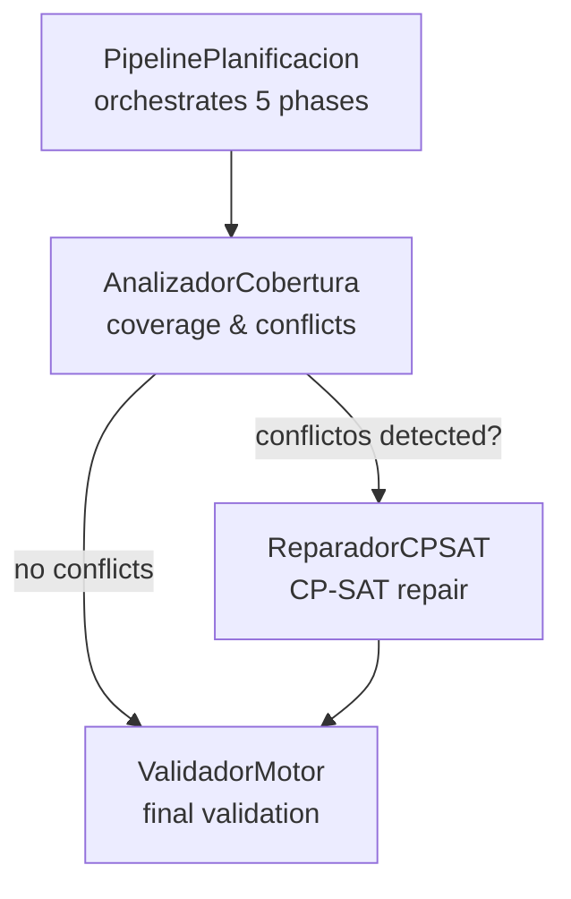
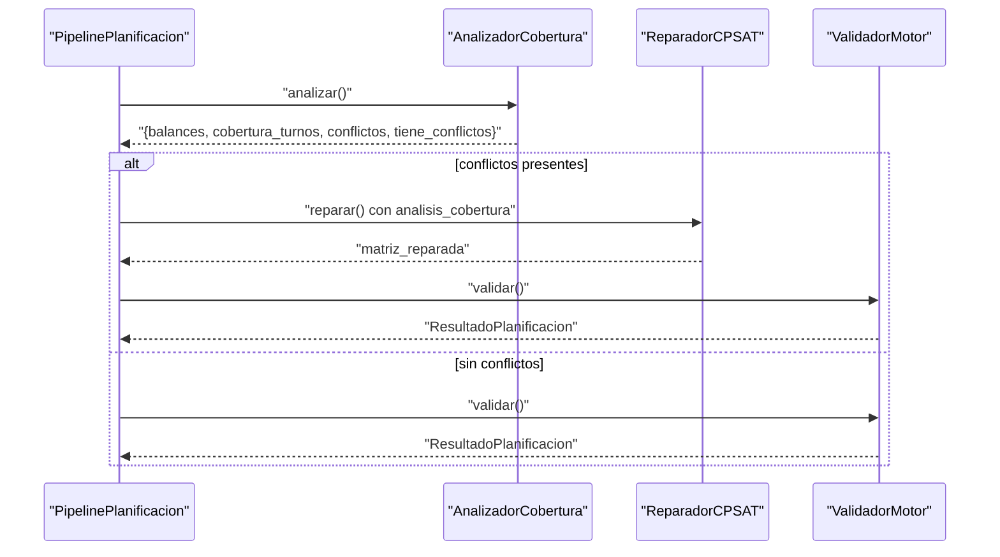
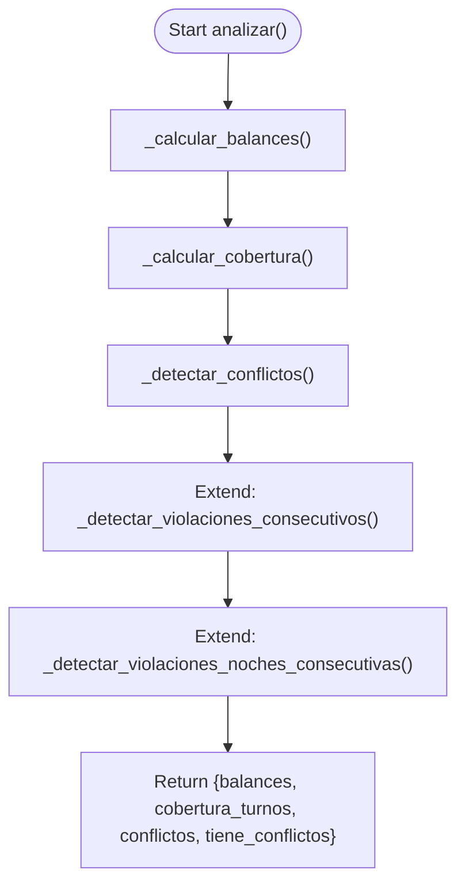
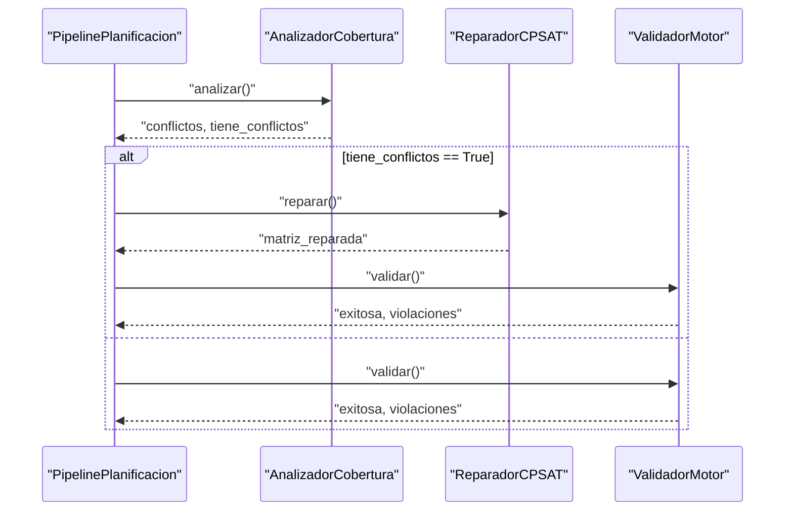
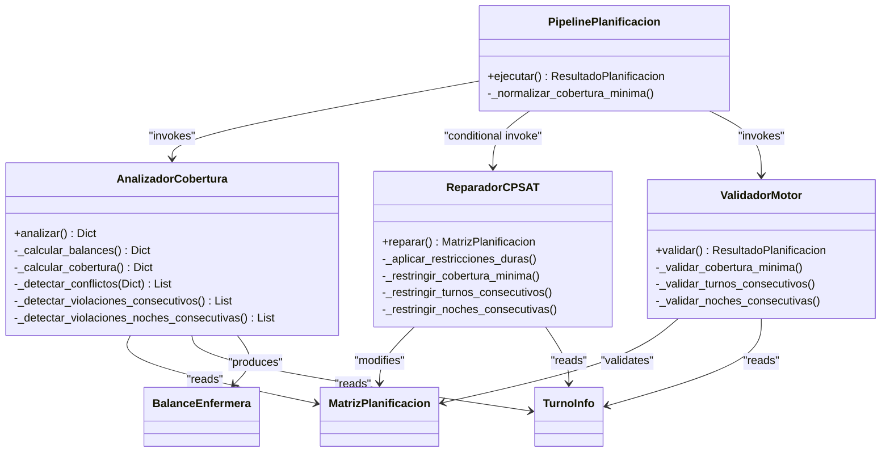

# Coverage Analysis Phase

<cite>
**Referenced Files in This Document**
- [cobertura.py](file://turnos/motor/cobertura.py)
- [dtos.py](file://turnos/dominio/dtos.py)
- [pipeline.py](file://turnos/motor/pipeline.py)
- [reparador.py](file://turnos/motor/reparador.py)
- [validador_motor.py](file://turnos/motor/validador_motor.py)
- [test_pipeline.py](file://turnos/tests/test_motor/test_pipeline.py)
- [test_integracion_final.py](file://turnos/tests/test_motor/test_integracion_final.py)
- [models.py](file://turnos/models.py)
</cite>

## Table of Contents
1. [Introduction](#introduction)
2. [Project Structure](#project-structure)
3. [Core Components](#core-components)
4. [Architecture Overview](#architecture-overview)
5. [Detailed Component Analysis](#detailed-component-analysis)
6. [Dependency Analysis](#dependency-analysis)
7. [Performance Considerations](#performance-considerations)
8. [Troubleshooting Guide](#troubleshooting-guide)
9. [Conclusion](#conclusion)
10. [Appendices](#appendices)

## Introduction
This document explains the coverage analysis phase that assesses demand versus supply in the scheduling system. It focuses on the AnalizadorCobertura class, how it computes coverage metrics, detects deviations, and identifies conflicts. It also documents the relationship between coverage analysis and the subsequent repair phase, and provides practical guidance for interpreting outputs and resolving conflicts.

## Project Structure
The coverage analysis is part of the scheduling pipeline orchestrated by PipelinePlanificacion. The key modules involved are:
- PipelinePlanificacion orchestrates the five-phase pipeline and invokes AnalizadorCobertura during phase 3.
- AnalizadorCobertura performs coverage calculations, balance computation, and conflict detection.
- ReparadorCPSAT repairs conflicts using CP-SAT when conflicts are detected.
- ValidadorMotor validates the final solution after repair.

**Diagram sources**
- [pipeline.py:92-234](file://turnos/motor/pipeline.py#L92-L234)
- [cobertura.py:46-73](file://turnos/motor/cobertura.py#L46-L73)
- [reparador.py:63-96](file://turnos/motor/reparador.py#L63-L96)
- [validador_motor.py:48-86](file://turnos/motor/validador_motor.py#L48-L86)

**Section sources**
- [pipeline.py:31-234](file://turnos/motor/pipeline.py#L31-L234)

## Core Components
- AnalizadorCobertura: Computes per-enfermera hours, per-shift coverage, deviations, and detects conflicts.
- MatrizPlanificacion: The central data structure holding assignments for each nurse-date combination.
- BalanceEnfermera: Aggregated metrics per nurse including hours, nights, weekend days, and historical accumulations.
- TurnoInfo: Defines turn types and properties such as duration and whether a turn is nocturnal.
- PipelinePlanificacion: Executes the pipeline and integrates coverage analysis and optional repair.
- ReparadorCPSAT: Solves conflicts using CP-SAT with weighted objectives.
- ValidadorMotor: Final validation ensuring hard constraints are satisfied.

**Section sources**
- [cobertura.py:21-208](file://turnos/motor/cobertura.py#L21-L208)
- [dtos.py:197-274](file://turnos/dominio/dtos.py#L197-L274)
- [pipeline.py:31-234](file://turnos/motor/pipeline.py#L31-L234)
- [reparador.py:24-609](file://turnos/motor/reparador.py#L24-L609)
- [validador_motor.py:23-451](file://turnos/motor/validador_motor.py#L23-L451)

## Architecture Overview
The coverage analysis phase sits between rotation generation and repair. It evaluates:
- Shift demand against available staff per day/shift.
- Individual nurse workload against targets.
- Hard constraints violations (consecutive shifts, consecutive nights).
It produces a structured result consumed by the repair stage.

**Diagram sources**
- [pipeline.py:156-234](file://turnos/motor/pipeline.py#L156-L234)
- [cobertura.py:46-73](file://turnos/motor/cobertura.py#L46-L73)
- [reparador.py:63-96](file://turnos/motor/reparador.py#L63-L96)
- [validador_motor.py:48-86](file://turnos/motor/validador_motor.py#L48-L86)

## Detailed Component Analysis

### AnalizadorCobertura
Responsibilities:
- Compute per-nurse totals: assigned hours, turns, nights, weekends.
- Incorporate historical accumulations (hours, nights, weekends, holidays) into totals.
- Calculate per-day, per-shift coverage counts.
- Detect coverage gaps compared to minimum requirements.
- Detect hard-constraint violations: consecutive shifts and consecutive nights.

Key methods and behaviors:
- Initialization accepts:
  - MatrizPlanificacion
  - Hours target per nurse
  - Minimum coverage per shift
  - Historical balances
  - Maximum consecutive shifts and nights
- Analysis returns:
  - balances: per-nurse aggregated metrics
  - cobertura_turnos: dictionary of counts per date and shift
  - conflictos: list of human-readable conflict strings
  - tiene_conflictos: boolean flag

Coverage calculation:
- For each date, iterate cells and count non-free, non-incidence turn assignments per shift.

Conflict detection:
- Coverage gaps: compare assigned nurses per shift/date with configured minimums.
- Consecutive shifts: sliding window over ordered dates per nurse; count only real turns.
- Consecutive nights: similar sliding window for night turns.

**Diagram sources**
- [cobertura.py:46-73](file://turnos/motor/cobertura.py#L46-L73)
- [cobertura.py:75-124](file://turnos/motor/cobertura.py#L75-L124)
- [cobertura.py:126-137](file://turnos/motor/cobertura.py#L126-L137)
- [cobertura.py:139-161](file://turnos/motor/cobertura.py#L139-L161)
- [cobertura.py:163-184](file://turnos/motor/cobertura.py#L163-L184)
- [cobertura.py:186-207](file://turnos/motor/cobertura.py#L186-L207)

**Section sources**
- [cobertura.py:21-208](file://turnos/motor/cobertura.py#L21-L208)

### Coverage Metrics and Deviation Analysis
- Per-nurse metrics:
  - Assigned hours vs target hours (absolute and percentage deviation).
  - Number of turns, nights, weekend days, and holidays assigned.
  - Accumulated historical totals included in totals.
- Per-shift coverage:
  - Count of assigned nurses per shift per date.
  - Gap analysis compares counts to configured minimums.

Interpretation guidance:
- If a nurse’s assigned hours deviate significantly from target, consider adjusting hours objective or redistributing turns.
- If coverage gaps exist for certain shifts on specific dates, consider adding more nurses or adjusting shift assignments.

**Section sources**
- [cobertura.py:75-124](file://turnos/motor/cobertura.py#L75-L124)
- [dtos.py:135-166](file://turnos/dominio/dtos.py#L135-L166)
- [cobertura.py:126-161](file://turnos/motor/cobertura.py#L126-L161)

### Constraint Checking and Conflict Categorization
Detected conflicts:
- Coverage gaps: “Date X, shift Y: N nurses (minimum Z)”.
- Consecutive shifts violation: “Nurse X, date Y: K consecutive shifts (maximum M)”.
- Consecutive nights violation: “Nurse X, date Y: K consecutive nights (maximum M)”.

Validation alignment:
- The final validator repeats checks for hard constraints and coverage minimums to ensure no regressions after repair.

**Section sources**
- [cobertura.py:139-161](file://turnos/motor/cobertura.py#L139-L161)
- [cobertura.py:163-184](file://turnos/motor/cobertura.py#L163-L184)
- [cobertura.py:186-207](file://turnos/motor/cobertura.py#L186-L207)
- [validador_motor.py:88-105](file://turnos/motor/validador_motor.py#L88-L105)
- [validador_motor.py:279-310](file://turnos/motor/validador_motor.py#L279-L310)

### Relationship Between Coverage Analysis and Repair
- If AnalizadorCobertura reports conflicts, PipelinePlanificacion triggers ReparadorCPSAT.
- ReparadorCPSAT enforces hard constraints (including coverage minimums) and attempts to minimize deviations from the base rotation pattern.
- After repair, ValidadorMotor ensures hard constraints remain satisfied.

**Diagram sources**
- [pipeline.py:156-234](file://turnos/motor/pipeline.py#L156-L234)
- [reparador.py:63-96](file://turnos/motor/reparador.py#L63-L96)
- [validador_motor.py:48-86](file://turnos/motor/validador_motor.py#L48-L86)

**Section sources**
- [pipeline.py:156-234](file://turnos/motor/pipeline.py#L156-L234)
- [reparador.py:133-296](file://turnos/motor/reparador.py#L133-L296)
- [validador_motor.py:88-105](file://turnos/motor/validador_motor.py#L88-L105)

### Practical Examples and Scenarios
- Example scenario: Coverage gap
  - A morning shift requires two nurses, but only one is assigned on a given date.
  - Conflict reported: “Date 2026-04-10, shift 1: 1 nurse (minimum 2)”.
- Example scenario: Consecutive shifts violation
  - A nurse exceeds the maximum allowed consecutive shifts.
  - Conflict reported: “Nurse 1, date 2026-04-07: 7 consecutive shifts (maximum 6)”.
- Example scenario: Consecutive nights violation
  - A nurse exceeds the maximum allowed consecutive night shifts.
  - Conflict reported: “Nurse 2, date 2026-04-05: 4 consecutive nights (maximum 3)”.
- Peak demand periods
  - During weekends or public holidays, ensure adequate night coverage and avoid consecutive night violations.
- Coverage optimization strategies
  - Adjust shift mix to meet minimums while balancing workload.
  - Use historical accumulations to distribute work fairly across months.

Note: These examples illustrate typical outputs and scenarios. Actual conflict messages are generated dynamically by the analyzer.

**Section sources**
- [cobertura.py:139-161](file://turnos/motor/cobertura.py#L139-L161)
- [cobertura.py:163-184](file://turnos/motor/cobertura.py#L163-L184)
- [cobertura.py:186-207](file://turnos/motor/cobertura.py#L186-L207)

### Coverage Matrices and Demand Patterns
- Coverage matrix structure
  - Rows: dates
  - Columns: shift IDs
  - Cells: number of assigned nurses
- Demand patterns
  - Minimum coverage per shift per day is configured externally and passed to the analyzer.
  - The analyzer compares actual assignments to these minimums.

**Section sources**
- [cobertura.py:126-137](file://turnos/motor/cobertura.py#L126-L137)
- [pipeline.py:78-90](file://turnos/motor/pipeline.py#L78-L90)

### Interpretation Guidance and Resolving Conflicts
- Interpreting outputs
  - Review balances to understand individual workload deviations.
  - Review coverage matrix to identify under-resourced shifts/days.
  - Review conflict list to prioritize fixes.
- Resolving coverage conflicts
  - Add more nurses to under-resourced shifts.
  - Reassign existing nurses to meet minimums.
  - If repair is needed, the pipeline will invoke CP-SAT to fix conflicts while respecting hard constraints.
- Resolving consecutive shifts/nights conflicts
  - Limit consecutive real turns and nights to configured maximums.
  - Use free days strategically to break long sequences.

**Section sources**
- [cobertura.py:46-73](file://turnos/motor/cobertura.py#L46-L73)
- [pipeline.py:156-234](file://turnos/motor/pipeline.py#L156-L234)
- [reparador.py:151-296](file://turnos/motor/reparador.py#L151-L296)
- [validador_motor.py:118-162](file://turnos/motor/validador_motor.py#L118-L162)

## Dependency Analysis
- AnalizadorCobertura depends on:
  - MatrizPlanificacion for iteration over assignments.
  - TurnoInfo for shift durations and night classification.
  - BalanceEnfermera for aggregated metrics.
- PipelinePlanificacion composes:
  - AnalizadorCobertura invocation.
  - Conditional ReparadorCPSAT invocation.
  - ValidadorMotor invocation.
- ReparadorCPSAT depends on:
  - TurnoInfo for shift properties.
  - Coverage minimums and hard constraints.
  - CP-SAT model to enforce constraints and optimize.

**Diagram sources**
- [pipeline.py:92-234](file://turnos/motor/pipeline.py#L92-L234)
- [cobertura.py:46-208](file://turnos/motor/cobertura.py#L46-L208)
- [reparador.py:63-296](file://turnos/motor/reparador.py#L63-L296)
- [validador_motor.py:48-105](file://turnos/motor/validador_motor.py#L48-L105)
- [dtos.py:197-274](file://turnos/dominio/dtos.py#L197-L274)

**Section sources**
- [pipeline.py:92-234](file://turnos/motor/pipeline.py#L92-L234)
- [cobertura.py:46-208](file://turnos/motor/cobertura.py#L46-L208)
- [reparador.py:63-296](file://turnos/motor/reparador.py#L63-L296)
- [validador_motor.py:48-105](file://turnos/motor/validador_motor.py#L48-L105)

## Performance Considerations
- Coverage computations iterate over all dates and all assignments; complexity is proportional to total celled entries.
- Consecutive shift and night checks scan ordered dates per nurse; complexity is linear in number of dates per nurse.
- To maintain performance:
  - Keep the number of nurses and dates reasonable.
  - Use historical balances judiciously to avoid excessive recomputation.
  - Normalize coverage minimums once during pipeline initialization.

[No sources needed since this section provides general guidance]

## Troubleshooting Guide
Common issues and resolutions:
- Unexpected coverage gaps
  - Verify that minimum coverage configuration is correct and covers all required shifts.
  - Confirm that the matrix contains actual turn assignments (not free/incidence cells).
- Excessive consecutive shifts/nights
  - Adjust maximum allowed consecutive limits or redistribute shifts to include frees.
- Repair does not converge
  - Reduce coverage minimums slightly or relax hard constraints temporarily.
  - Inspect turn durations and night classifications to ensure correctness.

Validation and repair logs:
- The pipeline logs conflict counts and solver status to aid diagnosis.

**Section sources**
- [pipeline.py:156-234](file://turnos/motor/pipeline.py#L156-L234)
- [reparador.py:74-96](file://turnos/motor/reparador.py#L74-L96)
- [validador_motor.py:88-105](file://turnos/motor/validador_motor.py#L88-L105)

## Conclusion
The coverage analysis phase provides essential insight into demand-supply mismatches and hard-constraint violations. By computing per-nurse balances, per-shift coverage, and detecting conflicts, it enables informed decisions and targeted repairs. When conflicts are found, the CP-SAT repair engine restores feasibility while preserving the base rotation pattern and minimizing deviations.

[No sources needed since this section summarizes without analyzing specific files]

## Appendices

### Appendix A: Data Model Overview
- MatrizPlanificacion: central assignment grid with celdas, fechas, enfermeras, and turnos_disponibles.
- CeldaPlanificacion: per-nurse, per-date cell with turn, type, and metadata.
- TurnoInfo: defines shift properties including duration and night classification.
- BalanceEnfermera: aggregated metrics per nurse including historical accumulations.

**Section sources**
- [dtos.py:197-274](file://turnos/dominio/dtos.py#L197-L274)
- [dtos.py:61-132](file://turnos/dominio/dtos.py#L61-L132)
- [dtos.py:44-58](file://turnos/dominio/dtos.py#L44-L58)
- [dtos.py:135-166](file://turnos/dominio/dtos.py#L135-L166)

### Appendix B: Tests Demonstrating Coverage Analysis
- Basic balance calculation and deviation checks.
- Conflict detection for coverage minimums.
- Integration tests showing how historical balances influence analysis.

**Section sources**
- [test_pipeline.py:217-246](file://turnos/tests/test_motor/test_pipeline.py#L217-L246)
- [test_pipeline.py:245-362](file://turnos/tests/test_motor/test_pipeline.py#L245-L362)
- [test_integracion_final.py:275-290](file://turnos/tests/test_motor/test_integracion_final.py#L275-L290)
- [test_integracion_final.py:449-475](file://turnos/tests/test_motor/test_integracion_final.py#L449-L475)