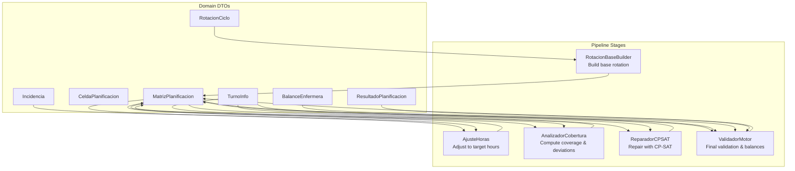
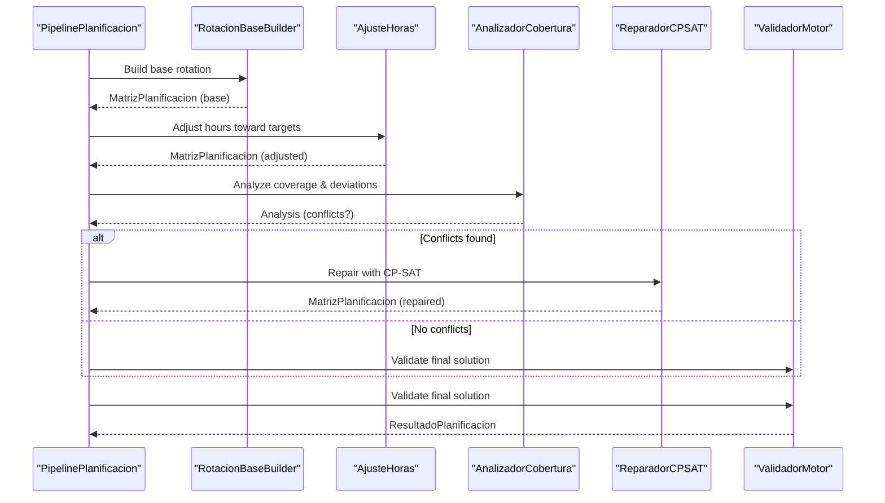
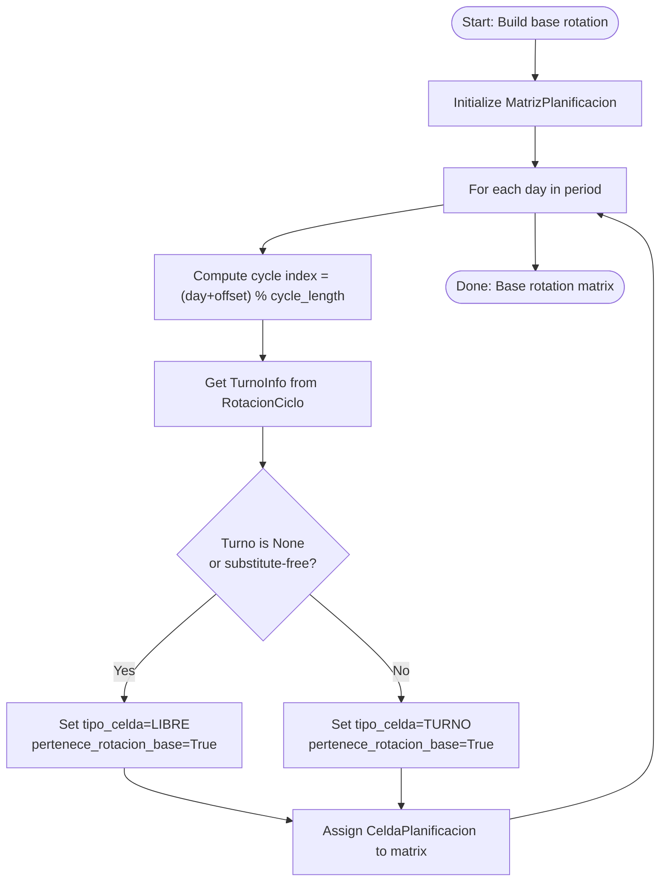
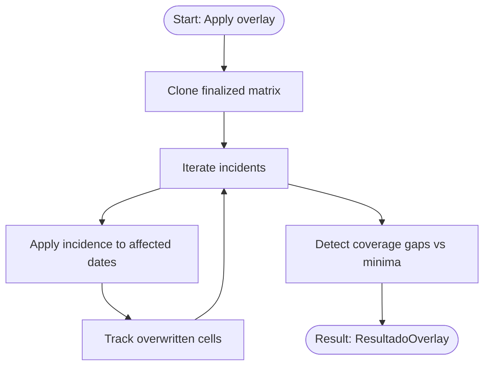
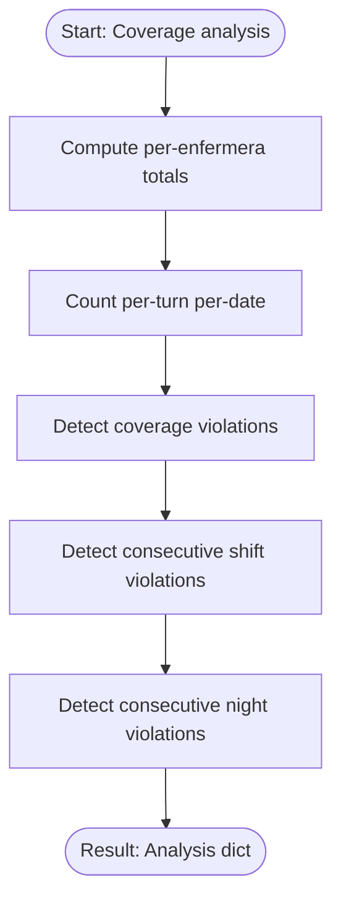
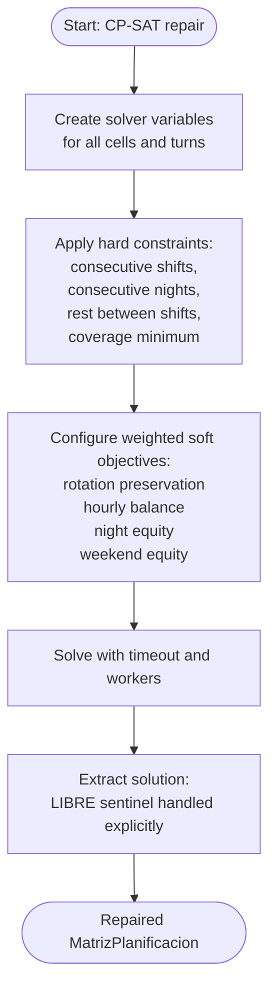
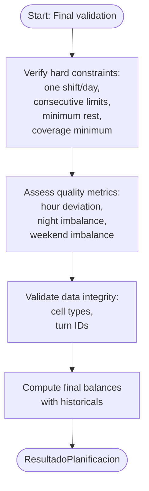
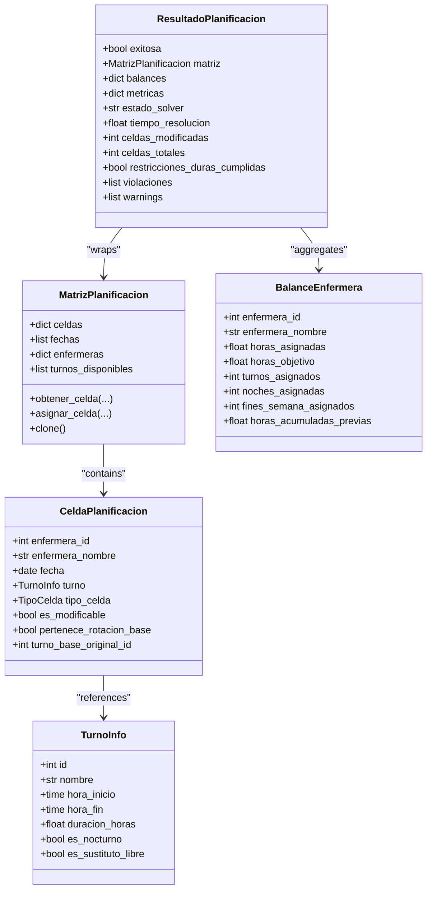
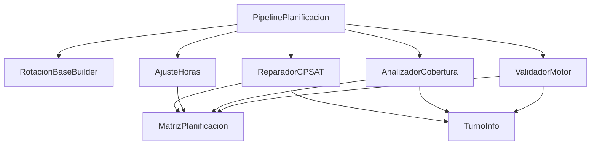

# Data Flow and Processing Pipeline

<cite>
**Referenced Files in This Document**
- [pipeline.py](file://turnos/motor/pipeline.py)
- [rotacion_base.py](file://turnos/motor/rotacion_base.py)
- [ajuste_horas.py](file://turnos/motor/ajuste_horas.py)
- [cobertura.py](file://turnos/motor/cobertura.py)
- [reparador.py](file://turnos/motor/reparador.py)
- [validador_motor.py](file://turnos/motor/validador_motor.py)
- [overlay_incidencias.py](file://turnos/motor/overlay_incidencias.py)
- [dtos.py](file://turnos/dominio/dtos.py)
- [test_pipeline.py](file://turnos/tests/test_motor/test_pipeline.py)
- [test_reparador.py](file://turnos/tests/test_motor/test_reparador.py)
- [run_planificacion.py](file://turnos/management/commands/run_planificacion.py)
- [generador_refactorizado.py](file://turnos/generador_refactorizado.py)
</cite>

## Table of Contents
1. [Introduction](#introduction)
2. [Project Structure](#project-structure)
3. [Core Components](#core-components)
4. [Architecture Overview](#architecture-overview)
5. [Detailed Component Analysis](#detailed-component-analysis)
6. [Dependency Analysis](#dependency-analysis)
7. [Performance Considerations](#performance-considerations)
8. [Troubleshooting Guide](#troubleshooting-guide)
9. [Conclusion](#conclusion)
10. [Appendices](#appendices)

## Introduction
This document explains the 5-step planning pipeline that generates regular weekly rotations, adjusts hours to contractual targets, validates coverage, repairs residual conflicts with CP-SAT, and persists validated results. It documents the complete data journey from configuration inputs to final persisted outcomes, including how rotation regularity is preserved during repairs, how hard and soft constraints are enforced, and how domain DTOs map to solver variables and final results. Practical examples illustrate typical execution paths, intermediate representations, and edge-case handling.

## Project Structure
The pipeline orchestrator coordinates deterministic rotation building, targeted hour adjustments, coverage analysis, optional CP-SAT repair, and final validation. Domain DTOs define the internal data model used across stages.

**Diagram sources**
- [pipeline.py:92-234](file://turnos/motor/pipeline.py#L92-L234)
- [rotacion_base.py:41-93](file://turnos/motor/rotacion_base.py#L41-L93)
- [ajuste_horas.py:46-88](file://turnos/motor/ajuste_horas.py#L46-L88)
- [cobertura.py:46-73](file://turnos/motor/cobertura.py#L46-L73)
- [reparador.py:63-95](file://turnos/motor/reparador.py#L63-L95)
- [validador_motor.py:48-86](file://turnos/motor/validador_motor.py#L48-L86)
- [dtos.py:197-274](file://turnos/dominio/dtos.py#L197-L274)

**Section sources**
- [pipeline.py:31-266](file://turnos/motor/pipeline.py#L31-L266)
- [dtos.py:22-166](file://turnos/dominio/dtos.py#L22-L166)

## Core Components
- Pipeline orchestrator: Executes the 5-stage pipeline and aggregates results.
- Rotation builder: Deterministically constructs base rotation using configured cycles and offsets.
- Hour adjuster: Applies minimal changes to align total monthly hours with targets.
- Coverage analyzer: Computes per-turn coverage, deviations, and detects hard-constraint violations.
- CP-SAT repairer: Resolves residual conflicts with weighted soft objectives while preserving rotation regularity.
- Final validator: Ensures hard constraints, computes balances, and prepares persisted results.

**Section sources**
- [pipeline.py:92-234](file://turnos/motor/pipeline.py#L92-L234)
- [rotacion_base.py:41-93](file://turnos/motor/rotacion_base.py#L41-L93)
- [ajuste_horas.py:46-88](file://turnos/motor/ajuste_horas.py#L46-L88)
- [cobertura.py:46-73](file://turnos/motor/cobertura.py#L46-L73)
- [reparador.py:63-95](file://turnos/motor/reparador.py#L63-L95)
- [validador_motor.py:48-86](file://turnos/motor/validador_motor.py#L48-L86)

## Architecture Overview
The pipeline is a deterministic-to-stochastic flow:
- Deterministic phases (rotation build, hour adjustment) preserve rotation regularity.
- Coverage analysis identifies conflicts requiring CP-SAT repair.
- CP-SAT repair optimizes a weighted objective that prioritizes staying close to the base rotation.
- Final validation ensures hard constraints and computes balances.

**Diagram sources**
- [pipeline.py:107-234](file://turnos/motor/pipeline.py#L107-L234)
- [reparador.py:63-95](file://turnos/motor/reparador.py#L63-L95)
- [validador_motor.py:48-86](file://turnos/motor/validador_motor.py#L48-L86)

## Detailed Component Analysis

### Stage 1: Rotation Construction (Base Rotation)
Responsibilities:
- Build a deterministic base rotation matrix from configured cycles and offsets.
- Mark cells as part of the base rotation and capture immutable base turn snapshots.

Intermediate representation:
- MatrizPlanificacion populated with CeldaPlanificacion entries.
- Each cell stores whether it belongs to the base rotation and the immutable base turn ID.

Key transformations:
- Cycle index computed using day index plus offset modulo cycle length.
- Cells with no assigned turn or flagged as free substitutes are marked as LIBRE.

**Diagram sources**
- [rotacion_base.py:41-93](file://turnos/motor/rotacion_base.py#L41-L93)
- [dtos.py:61-132](file://turnos/dominio/dtos.py#L61-L132)

**Section sources**
- [rotacion_base.py:41-93](file://turnos/motor/rotacion_base.py#L41-L93)
- [dtos.py:197-237](file://turnos/dominio/dtos.py#L197-L237)

### Stage 2: Incident Application (Overlay)
Responsibilities:
- Apply vacation, leave, illness, training, fixed assignments, and blocked days as overlays after generation.
- Do not modify solver-generated assignments; only post-process the finalized schedule.

Intermediate representation:
- MatrizPlanificacion remains unchanged by the solver; overlay produces a separate ResultadoOverlay with modified cells and coverage gaps.

Key transformations:
- Overwrite cell type and turn assignment according to incidence type.
- Track overwritten cells and compute coverage deficits against configured minimums.

**Diagram sources**
- [overlay_incidencias.py:45-75](file://turnos/motor/overlay_incidencias.py#L45-L75)
- [overlay_incidencias.py:77-164](file://turnos/motor/overlay_incidencias.py#L77-L164)
- [overlay_incidencias.py:166-204](file://turnos/motor/overlay_incidencias.py#L166-L204)

**Section sources**
- [overlay_incidencias.py:45-75](file://turnos/motor/overlay_incidencias.py#L45-L75)
- [overlay_incidencias.py:77-164](file://turnos/motor/overlay_incidencias.py#L77-L164)
- [overlay_incidencias.py:166-204](file://turnos/motor/overlay_incidencias.py#L166-L204)

### Stage 3: Coverage Calculation
Responsibilities:
- Compute per-turn coverage counts across the matrix.
- Calculate per-enfermera metrics: assigned hours, nights, weekend days, and deviations from targets.
- Detect hard-constraint violations: consecutive shifts, consecutive nights, and coverage below minimum.

Intermediate representation:
- Dictionary of per-date, per-turn counts.
- BalanceEnfermera records per-enfermera totals and accumulated historicals.

**Diagram sources**
- [cobertura.py:46-73](file://turnos/motor/cobertura.py#L46-L73)
- [cobertura.py:75-124](file://turnos/motor/cobertura.py#L75-L124)
- [cobertura.py:126-137](file://turnos/motor/cobertura.py#L126-L137)
- [cobertura.py:139-207](file://turnos/motor/cobertura.py#L139-L207)

**Section sources**
- [cobertura.py:46-73](file://turnos/motor/cobertura.py#L46-L73)
- [cobertura.py:75-124](file://turnos/motor/cobertura.py#L75-L124)
- [cobertura.py:126-137](file://turnos/motor/cobertura.py#L126-L137)
- [cobertura.py:139-207](file://turnos/motor/cobertura.py#L139-L207)

### Stage 4: CP-SAT Repair
Responsibilities:
- Repair residual conflicts by solving a constraint satisfaction problem with weighted soft objectives.
- Preserve rotation regularity by heavily penalizing deviations from base rotation.
- Enforce hard constraints: max consecutive shifts, max consecutive nights, minimum rest between shifts, and minimum coverage.

Intermediate representation:
- Solver variables represent “assign turn t to cell (e,f)” and a special “LIBRE” sentinel.
- Objective function is a weighted sum: rotation preservation >> hourly balance >> night equity >> weekend equity.

Key transformations:
- Variables created for all cells and all turns (plus LIBRE).
- Hard constraints encoded as integer constraints.
- Soft objectives encoded as penalty terms with weights.

**Diagram sources**
- [reparador.py:63-95](file://turnos/motor/reparador.py#L63-L95)
- [reparador.py:97-132](file://turnos/motor/reparador.py#L97-L132)
- [reparador.py:133-296](file://turnos/motor/reparador.py#L133-L296)
- [reparador.py:297-334](file://turnos/motor/reparador.py#L297-L334)
- [reparador.py:581-608](file://turnos/motor/reparador.py#L581-L608)

**Section sources**
- [reparador.py:63-95](file://turnos/motor/reparador.py#L63-L95)
- [reparador.py:97-132](file://turnos/motor/reparador.py#L97-L132)
- [reparador.py:133-296](file://turnos/motor/reparador.py#L133-L296)
- [reparador.py:297-334](file://turnos/motor/reparador.py#L297-L334)
- [reparador.py:581-608](file://turnos/motor/reparador.py#L581-L608)

### Stage 5: Validation Persistence
Responsibilities:
- Verify hard constraints are satisfied.
- Compute final balances including historical accumulations.
- Produce structured ResultadoPlanificacion with solver metadata and validation artifacts.

Intermediate representation:
- ResultadoPlanificacion containing exit status, matrix, balances, metrics, solver status, and validation lists.

**Diagram sources**
- [validador_motor.py:48-86](file://turnos/motor/validador_motor.py#L48-L86)
- [validador_motor.py:88-104](file://turnos/motor/validador_motor.py#L88-L104)
- [validador_motor.py:312-364](file://turnos/motor/validador_motor.py#L312-L364)
- [validador_motor.py:366-388](file://turnos/motor/validador_motor.py#L366-L388)
- [validador_motor.py:389-438](file://turnos/motor/validador_motor.py#L389-L438)

**Section sources**
- [validador_motor.py:48-86](file://turnos/motor/validador_motor.py#L48-L86)
- [validador_motor.py:88-104](file://turnos/motor/validador_motor.py#L88-L104)
- [validador_motor.py:312-364](file://turnos/motor/validador_motor.py#L312-L364)
- [validador_motor.py:366-388](file://turnos/motor/validador_motor.py#L366-L388)
- [validador_motor.py:389-438](file://turnos/motor/validador_motor.py#L389-L438)

### Relationship Between Domain DTOs, Solver Variables, and Results
- Domain DTOs define the canonical data model used across stages.
- Solver variables mirror the matrix structure: one Boolean variable per (enfermera, fecha, turno_or_LIBRE).
- Final results are packaged into ResultadoPlanificacion with balances and validation metadata.

**Diagram sources**
- [dtos.py:197-274](file://turnos/dominio/dtos.py#L197-L274)
- [dtos.py:61-132](file://turnos/dominio/dtos.py#L61-L132)
- [dtos.py:44-58](file://turnos/dominio/dtos.py#L44-L58)
- [dtos.py:135-166](file://turnos/dominio/dtos.py#L135-L166)

**Section sources**
- [dtos.py:197-274](file://turnos/dominio/dtos.py#L197-L274)
- [dtos.py:61-132](file://turnos/dominio/dtos.py#L61-L132)
- [dtos.py:44-58](file://turnos/dominio/dtos.py#L44-L58)
- [dtos.py:135-166](file://turnos/dominio/dtos.py#L135-L166)

## Dependency Analysis
The pipeline composes specialized modules with clear boundaries:
- Pipeline orchestrator depends on rotation builder, hour adjuster, coverage analyzer, CP-SAT repairer, and final validator.
- Repairer depends on TurnoInfo for turn semantics and uses CP-SAT variables to encode constraints and objectives.
- Validator consumes the final matrix and TurnoInfo to enforce hard constraints and compute balances.

**Diagram sources**
- [pipeline.py:110-211](file://turnos/motor/pipeline.py#L110-L211)
- [reparador.py:47-56](file://turnos/motor/reparador.py#L47-L56)
- [cobertura.py:30-44](file://turnos/motor/cobertura.py#L30-L44)
- [validador_motor.py:34-44](file://turnos/motor/validador_motor.py#L34-L44)

**Section sources**
- [pipeline.py:110-211](file://turnos/motor/pipeline.py#L110-L211)
- [reparador.py:47-56](file://turnos/motor/reparador.py#L47-L56)
- [cobertura.py:30-44](file://turnos/motor/cobertura.py#L30-L44)
- [validador_motor.py:34-44](file://turnos/motor/validador_motor.py#L34-L44)

## Performance Considerations
- Memory management:
  - MatrizPlanificacion.clone() is used in CP-SAT extraction to avoid mutating the original matrix.
  - CP-SAT variable creation enumerates all (e, d, t) combinations; large periods increase variable count quadratically in number of nurses and days.
- Solver tuning:
  - Max time and worker count are set to balance speed and solution quality.
  - Weighted objectives prioritize rotation preservation to minimize changes to the base pattern.
- Coverage analysis:
  - Iterating over all dates and turns is O(D×T×E); keep periods bounded and use efficient lookups.
- Historical balances:
  - Incorporating historical totals into penalties helps maintain long-term equity without adding extra constraints.

[No sources needed since this section provides general guidance]

## Troubleshooting Guide
Common failure modes and remedies:
- CP-SAT infeasible:
  - Cause: Hard constraints too tight given coverage minimums and consecutive limits.
  - Action: Relax coverage minimums, increase consecutive limits, or reduce penalties for soft objectives.
- Excessive modifications:
  - Cause: Overly strict penalties or insufficient slack in constraints.
  - Action: Review objective weights and ensure coverage minimums are realistic.
- Violations after repair:
  - Cause: Transitions violating minimum rest between shifts across the boundary of the analyzed period.
  - Action: Enable trans-period rest validation and adjust shift transitions accordingly.
- Logging and debugging:
  - Use the management command to trigger generation and inspect logs for constraint names and violation details.
  - Inspect solver status to determine feasibility.

**Section sources**
- [pipeline.py:236-245](file://turnos/motor/pipeline.py#L236-L245)
- [reparador.py:74-89](file://turnos/motor/reparador.py#L74-L89)
- [validador_motor.py:164-202](file://turnos/motor/validador_motor.py#L164-L202)
- [run_planificacion.py:13-39](file://turnos/management/commands/run_planificacion.py#L13-L39)

## Conclusion
The pipeline preserves rotation regularity by anchoring repairs to an immutable base rotation snapshot while using CP-SAT to resolve residual conflicts. Hard constraints are enforced during both repair and final validation, and soft objectives promote equity across shifts, nights, and weekends. Domain DTOs provide a consistent model across deterministic and stochastic stages, ensuring reliable persistence and reporting.

[No sources needed since this section summarizes without analyzing specific files]

## Appendices

### Execution Path Examples
- Typical successful path:
  - Base rotation built deterministically.
  - Hour adjustments applied with small changes.
  - Coverage analysis finds no conflicts.
  - Final validation passes; ResultadoPlanificacion exitosa.
- Edge case: Coverage deficit triggers CP-SAT repair:
  - Coverage analysis reports deficits.
  - CP-SAT repairs with weighted objectives; solver status recorded.
  - Final validation confirms hard constraints satisfied.

**Section sources**
- [test_pipeline.py:274-362](file://turnos/tests/test_motor/test_pipeline.py#L274-L362)
- [test_reparador.py:199-249](file://turnos/tests/test_motor/test_reparador.py#L199-L249)

### Constraint Satisfaction Workflow
- Hard constraints encoded as integer constraints in CP-SAT:
  - One shift per day per nurse.
  - Maximum consecutive shifts and nights.
  - Minimum rest between incompatible transitions.
  - Minimum coverage per turn per day.
- Soft objectives:
  - Rotation preservation (highest weight).
  - Hourly balance.
  - Night equity.
  - Weekend equity.

**Section sources**
- [reparador.py:133-296](file://turnos/motor/reparador.py#L133-L296)
- [reparador.py:297-334](file://turnos/motor/reparador.py#L297-L334)

### Relationship to Legacy Generator
- The legacy generator delegates to a refactored generator that applies patterns and resolves constraints differently.
- The pipeline documented here focuses on the 5-stage orchestration with CP-SAT repair.

**Section sources**
- [generador_refactorizado.py:105-135](file://turnos/generador_refactorizado.py#L105-L135)
- [run_planificacion.py:21-23](file://turnos/management/commands/run_planificacion.py#L21-L23)