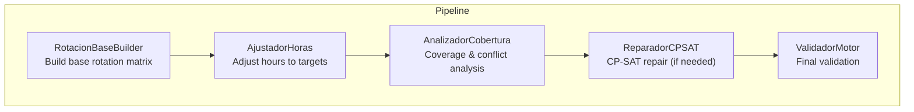
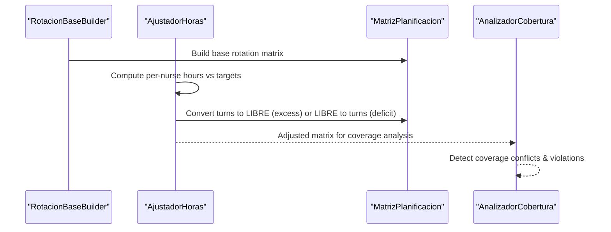
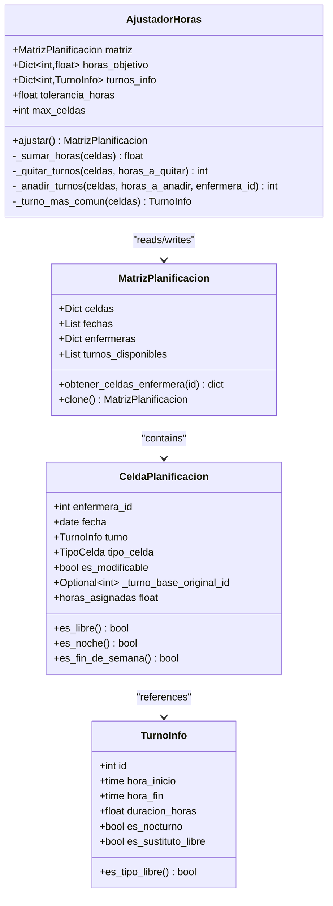
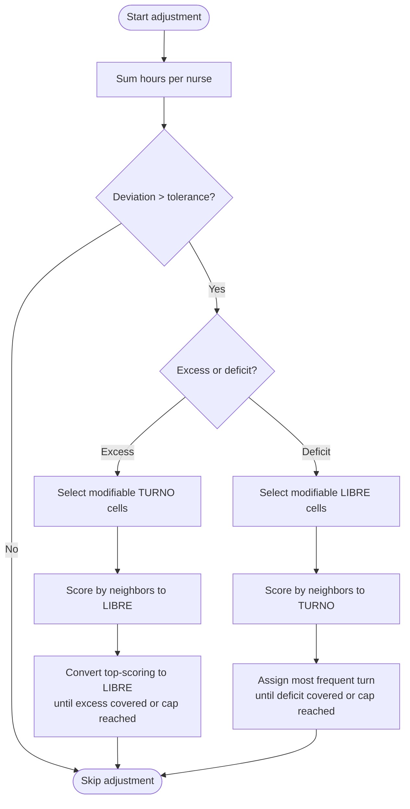
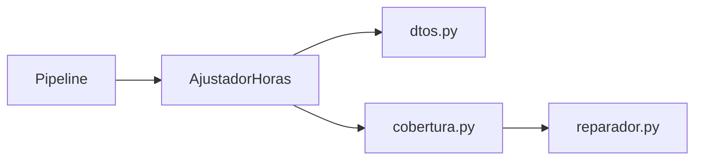

# Hour Adjustment Phase

<cite>
**Referenced Files in This Document**
- [ajuste_horas.py](file://turnos/motor/ajuste_horas.py)
- [pipeline.py](file://turnos/motor/pipeline.py)
- [dtos.py](file://turnos/dominio/dtos.py)
- [cobertura.py](file://turnos/motor/cobertura.py)
- [reparador.py](file://turnos/motor/reparador.py)
- [test_integracion_final.py](file://turnos/tests/test_motor/test_integracion_final.py)
- [test_reparador.py](file://turnos/tests/test_motor/test_reparador.py)
</cite>

## Table of Contents
1. [Introduction](#introduction)
2. [Project Structure](#project-structure)
3. [Core Components](#core-components)
4. [Architecture Overview](#architecture-overview)
5. [Detailed Component Analysis](#detailed-component-analysis)
6. [Dependency Analysis](#dependency-analysis)
7. [Performance Considerations](#performance-considerations)
8. [Troubleshooting Guide](#troubleshooting-guide)
9. [Conclusion](#conclusion)

## Introduction
This document explains the hour adjustment phase that balances contract-based working hours after the deterministic base rotation. It focuses on the AjustadorHoras class, target hour calculations, and adjustment algorithms. It also documents how the system handles excess and deficit hours, contract compliance, shift-type strategies, tolerance thresholds, and the impact on rotation regularity and conflict detection. Edge cases such as minimum/maximum hour constraints, special shift patterns, and adjustment limitations are covered, along with troubleshooting guidance and optimization techniques for large datasets.

## Project Structure
The hour adjustment phase is part of the main pipeline orchestration:
- Pipeline orchestrates five sequential phases: base rotation, hour adjustment, coverage analysis, repair with CP-SAT, and validation.
- AjustadorHoras performs targeted adjustments to align actual hours per nurse with contractual targets.
- Coverage analysis detects conflicts (including consecutive days and nights) after adjustments.
- CP-SAT solver preserves rotation regularity while optimizing monthly hour balance and other soft objectives.

**Diagram sources**
- [pipeline.py:108-234](file://turnos/motor/pipeline.py#L108-L234)
- [ajuste_horas.py:46-88](file://turnos/motor/ajuste_horas.py#L46-L88)
- [cobertura.py:46-73](file://turnos/motor/cobertura.py#L46-L73)
- [reparador.py:315-334](file://turnos/motor/reparador.py#L315-L334)

**Section sources**
- [pipeline.py:31-234](file://turnos/motor/pipeline.py#L31-L234)

## Core Components
- AjustadorHoras: Computes per-nurse totals, compares against target hours, and applies minimal adjustments to reduce deviation within a tolerance threshold. It converts turns to free days to reduce excess hours and converts free days to turns to cover deficits, preferring neighbors that minimize disruption to rotation patterns.
- Pipeline: Executes the hour adjustment phase and counts cells modified during adjustment.
- DTOs: Provide the MatrizPlanificacion, CeldaPlanificacion, TurnoInfo, and related structures used by adjustment logic.
- AnalizadorCobertura: Calculates per-nurse hours, coverage by turn, and detects conflicts (including consecutive work days and nights).
- ReparadorCPSAT: Optimizes rotation regularity and monthly hour balance using CP-SAT with weighted penalties.

**Section sources**
- [ajuste_horas.py:21-233](file://turnos/motor/ajuste_horas.py#L21-L233)
- [pipeline.py:119-135](file://turnos/motor/pipeline.py#L119-L135)
- [dtos.py:44-132](file://turnos/dominio/dtos.py#L44-L132)
- [cobertura.py:21-208](file://turnos/motor/cobertura.py#L21-L208)
- [reparador.py:315-334](file://turnos/motor/reparador.py#L315-L334)

## Architecture Overview
The hour adjustment phase sits between base rotation and coverage analysis. It ensures that generated hours approximate contractual targets with minimal disruption, then coverage analysis determines whether CP-SAT repair is needed.

**Diagram sources**
- [pipeline.py:119-163](file://turnos/motor/pipeline.py#L119-L163)
- [ajuste_horas.py:46-88](file://turnos/motor/ajuste_horas.py#L46-L88)
- [cobertura.py:46-73](file://turnos/motor/cobertura.py#L46-L73)

## Detailed Component Analysis

### AjustadorHoras: Contract-Based Hour Balancing
AjustadorHoras compares actual hours per nurse with contractual targets and adjusts minimally when deviation exceeds a configured tolerance. It operates cell-by-cell, prioritizing neighborhood effects to preserve rotation patterns.

Key behaviors:
- Target calculation: Uses per-nurse target hours passed into the class. Targets are enforced without historical accumulation in the adjustment phase.
- Adjustment strategies:
  - Excess hours: Convert eligible TURNO cells to LIBRE, preferring candidates adjacent to existing LIBRE cells to minimize pattern disruption.
  - Deficit hours: Convert eligible LIBRE cells to TURNO using the most frequent turn type for that nurse, preferring candidates adjacent to existing TURNO cells to maintain blocks.
- Limits: Caps the number of cells changed per nurse per iteration to constrain disruption.
- Tolerance: Only acts when absolute deviation exceeds the tolerance threshold.

**Diagram sources**
- [ajuste_horas.py:21-233](file://turnos/motor/ajuste_horas.py#L21-L233)
- [dtos.py:44-132](file://turnos/dominio/dtos.py#L44-L132)

**Section sources**
- [ajuste_horas.py:21-233](file://turnos/motor/ajuste_horas.py#L21-L233)
- [dtos.py:44-132](file://turnos/dominio/dtos.py#L44-L132)

### Adjustment Algorithms: Excess Hours and Deficit Hours
Excess hours:
- Candidate selection: Eligible TURNO cells that are modifiable.
- Scoring: Prefer cells adjacent to LIBRE cells (either actual LIBRE or empty TURNO cells) to minimize fragmentation.
- Execution: Remove turns until the excess is reduced or the per-nurse cap is reached.

Deficit hours:
- Candidate selection: Eligible LIBRE cells that are modifiable.
- Scoring: Prefer cells adjacent to existing TURNO cells to keep work blocks intact.
- Execution: Assign the most frequent turn type for that nurse until the deficit is covered or the per-nurse cap is reached.

**Diagram sources**
- [ajuste_horas.py:98-213](file://turnos/motor/ajuste_horas.py#L98-L213)

**Section sources**
- [ajuste_horas.py:98-213](file://turnos/motor/ajuste_horas.py#L98-L213)

### Target Hour Calculations and Contract Compliance
- Targets: Provided externally as a dictionary mapping nurse IDs to target hours. These are used directly in the adjustment phase without historical accumulation.
- Compliance: The adjustment phase aims to reduce absolute deviation below the tolerance threshold. Coverage analysis later checks for consecutive work/day constraints and other hard limits.

Evidence from tests:
- Monthly hour targets are enforced independently of historical accumulation during the adjustment phase.
- CP-SAT balance objective considers historical accumulation when computing deviations for optimization.

**Section sources**
- [ajuste_horas.py:57-87](file://turnos/motor/ajuste_horas.py#L57-L87)
- [test_integracion_final.py:950-1007](file://turnos/tests/test_motor/test_integracion_final.py#L950-L1007)
- [reparador.py:376-411](file://turnos/motor/reparador.py#L376-L411)

### Impact on Rotation Regularity and Conflict Detection
- Rotation preservation: CP-SAT places heavy weight on minimizing deviations from the base rotation (via immutable snapshot references). This ensures that AjustadorHoras’ adjustments do not destabilize the rotation pattern unless necessary.
- Conflict detection: After adjustments, coverage analysis computes per-nurse totals and detects violations such as consecutive work days and consecutive night shifts. If conflicts are found, CP-SAT repairs are triggered.

**Section sources**
- [pipeline.py:119-163](file://turnos/motor/pipeline.py#L119-L163)
- [reparador.py:315-334](file://turnos/motor/reparador.py#L315-L334)
- [cobertura.py:163-207](file://turnos/motor/cobertura.py#L163-L207)

### Adjustment Strategies for Shift Types, Overtime Rules, and Rounding Policies
- Shift types: The adjustment prefers the most frequent turn type for each nurse when adding turns. Special “free” or substitute-free turn types are treated as zero-duration free cells.
- Overtime rules: There are no explicit overtime caps in AjustadorHoras. Excess hours are removed by converting turns to LIBRE. CP-SAT soft objectives help distribute hours more evenly across months.
- Rounding policy: Targets are enforced as-is; no fractional rounding is applied by AjustadorHoras. CP-SAT internally requires integer variables for optimization, but the target values are derived from external configuration.

**Section sources**
- [ajuste_horas.py:152-213](file://turnos/motor/ajuste_horas.py#L152-L213)
- [dtos.py:44-57](file://turnos/dominio/dtos.py#L44-L57)
- [reparador.py:405-411](file://turnos/motor/reparador.py#L405-L411)

### Examples: Hour Targets, Adjustment Calculations, Modified Matrices
Concrete examples are demonstrated in tests that show:
- Two nurses with very different historical accumulations but equal monthly targets: the solver optimizes current month hours independently of accumulated totals during the adjustment phase.
- When CP-SAT repairs are triggered, historical accumulation influences the balance objective to favor long-term equity.

These examples illustrate how targets and historical data influence the optimization process without altering the deterministic base rotation.

**Section sources**
- [test_integracion_final.py:950-1086](file://turnos/tests/test_motor/test_integracion_final.py#L950-L1086)
- [test_reparador.py:251-285](file://turnos/tests/test_motor/test_reparador.py#L251-L285)

### Edge Cases and Adjustment Limitations
- Minimum/maximum hour constraints: Enforced by hard constraints during coverage analysis (e.g., maximum consecutive work days and nights). If exceeded, CP-SAT repair attempts to resolve conflicts.
- Special shift patterns: Zero-duration or substitute-free turns are treated as LIBRE-like cells, affecting scoring and eligibility for conversion.
- Adjustment limitations: The per-nurse cap limits the number of cells changed per iteration, reducing disruption but potentially requiring multiple passes for large deviations.
- Tolerance threshold: Adjustments only occur when deviation exceeds the tolerance; small deviations are ignored to avoid unnecessary churn.

**Section sources**
- [cobertura.py:163-207](file://turnos/motor/cobertura.py#L163-L207)
- [ajuste_horas.py:37-44](file://turnos/motor/ajuste_horas.py#L37-L44)
- [dtos.py:44-57](file://turnos/dominio/dtos.py#L44-L57)

## Dependency Analysis
The hour adjustment phase depends on:
- DTOs for data structures and turn metadata.
- Pipeline for orchestration and counting modified cells.
- Coverage analysis for detecting conflicts after adjustments.
- CP-SAT repair for preserving rotation regularity and optimizing soft objectives.

**Diagram sources**
- [ajuste_horas.py:11-16](file://turnos/motor/ajuste_horas.py#L11-L16)
- [pipeline.py:16-26](file://turnos/motor/pipeline.py#L16-L26)
- [cobertura.py:11-16](file://turnos/motor/cobertura.py#L11-L16)
- [reparador.py:315-334](file://turnos/motor/reparador.py#L315-L334)

**Section sources**
- [pipeline.py:119-163](file://turnos/motor/pipeline.py#L119-L163)
- [ajuste_horas.py:46-88](file://turnos/motor/ajuste_horas.py#L46-L88)
- [cobertura.py:46-73](file://turnos/motor/cobertura.py#L46-L73)
- [reparador.py:315-334](file://turnos/motor/reparador.py#L315-L334)

## Performance Considerations
- Complexity: Per-nurse scanning is linear in the number of assigned cells. Candidate scoring is proportional to candidate count, bounded by the number of modifiable cells.
- Tuning parameters: Increase max_celdas_per_nurse cautiously to reduce iterations but risk more disruption; adjust tolerance to balance stability and accuracy.
- Large datasets: Consider increasing solver workers and ensuring adequate memory for CP-SAT when conflicts arise after adjustments.

## Troubleshooting Guide
Common issues and resolutions:
- Excessive modifications: Reduce max_celdas or increase tolerance to limit disruption; review rotation patterns to minimize required changes.
- Persistent conflicts after adjustment: Enable CP-SAT repair; verify hard constraints (consecutive days/nights) and adjust limits if needed.
- Historical imbalance: Confirm that monthly targets exclude accumulated hours in the adjustment phase; CP-SAT balance objective can incorporate historical data for long-term fairness.
- Rotation drift concerns: CP-SAT heavily penalizes deviations from base rotation; ensure AjustadorHoras does not override immutable base snapshots.

**Section sources**
- [pipeline.py:119-135](file://turnos/motor/pipeline.py#L119-L135)
- [reparador.py:315-334](file://turnos/motor/reparador.py#L315-L334)
- [test_integracion_final.py:950-1007](file://turnos/tests/test_motor/test_integracion_final.py#L950-L1007)

## Conclusion
The hour adjustment phase ensures contract-based hour compliance with minimal disruption by converting turns to LIBRE for excess hours and LIBRE to turns for deficits, guided by neighborhood scoring and per-nurse caps. Coverage analysis and CP-SAT repair further refine the schedule to preserve rotation regularity and optimize soft objectives, including monthly hour balance and weekend/night distribution. Proper tuning of tolerance and caps, combined with awareness of hard constraints and historical data handling, yields robust and fair scheduling outcomes.