# Pipeline Overview and Architecture

<cite>
**Referenced Files in This Document**
- [pipeline.py](file://turnos/motor/pipeline.py)
- [rotacion_base.py](file://turnos/motor/rotacion_base.py)
- [ajuste_horas.py](file://turnos/motor/ajuste_horas.py)
- [cobertura.py](file://turnos/motor/cobertura.py)
- [reparador.py](file://turnos/motor/reparador.py)
- [overlay_incidencias.py](file://turnos/motor/overlay_incidencias.py)
- [validador_motor.py](file://turnos/motor/validador_motor.py)
- [dtos.py](file://turnos/dominio/dtos.py)
- [models.py](file://turnos/models.py)
- [test_pipeline.py](file://turnos/tests/test_motor/test_pipeline.py)
- [logger_config.py](file://turnos/logger_config.py)
- [run_planificacion.py](file://turnos/management/commands/run_planificacion.py)
</cite>

## Table of Contents
1. [Introduction](#introduction)
2. [Project Structure](#project-structure)
3. [Core Components](#core-components)
4. [Architecture Overview](#architecture-overview)
5. [Detailed Component Analysis](#detailed-component-analysis)
6. [Dependency Analysis](#dependency-analysis)
7. [Performance Considerations](#performance-considerations)
8. [Troubleshooting Guide](#troubleshooting-guide)
9. [Conclusion](#conclusion)
10. [Appendices](#appendices)

## Introduction
This document explains the 5-stage planning pipeline design that generates regular shifts deterministically, validates outcomes, and separates incident overlays for manual adjustments. It covers the pipeline orchestrator, initialization parameters, configuration options, stage sequencing, data transformations, error handling, logging, performance, and debugging capabilities. It also documents the architectural separation between automatic regular shift generation and manual incident overlays, and provides diagrams to visualize the flow and interactions.

## Project Structure
The pipeline resides in the motor package and operates on domain DTOs. Key modules:
- Pipeline orchestrator: coordinates the 5 stages
- Stage builders and analyzers: deterministic rotation, hours adjustment, coverage analysis
- Repairer: CP-SAT repair for conflicts
- Validator: final validation and metrics
- Overlay: post-generation incident application

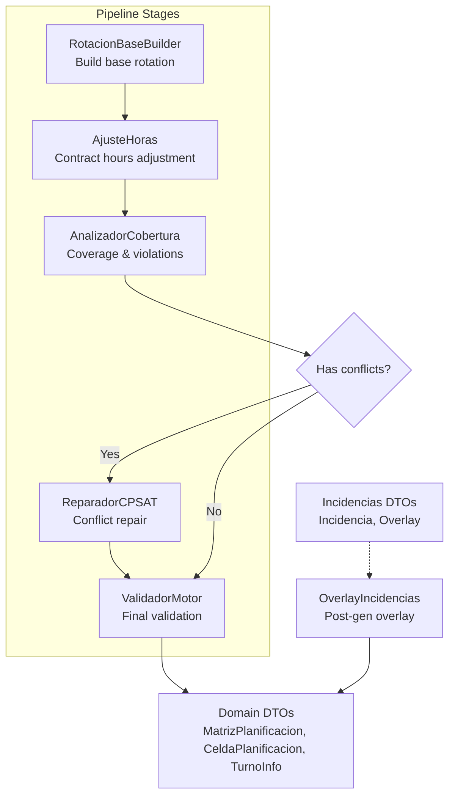

**Diagram sources**
- [pipeline.py:92-234](file://turnos/motor/pipeline.py#L92-L234)
- [rotacion_base.py:41-93](file://turnos/motor/rotacion_base.py#L41-L93)
- [ajuste_horas.py:46-88](file://turnos/motor/ajuste_horas.py#L46-L88)
- [cobertura.py:46-73](file://turnos/motor/cobertura.py#L46-L73)
- [reparador.py:63-95](file://turnos/motor/reparador.py#L63-L95)
- [validador_motor.py:48-86](file://turnos/motor/validador_motor.py#L48-L86)
- [overlay_incidencias.py:45-75](file://turnos/motor/overlay_incidencias.py#L45-L75)
- [dtos.py:197-237](file://turnos/dominio/dtos.py#L197-L237)

**Section sources**
- [pipeline.py:31-267](file://turnos/motor/pipeline.py#L31-L267)
- [dtos.py:197-274](file://turnos/dominio/dtos.py#L197-L274)

## Core Components
- PipelinePlanificacion: Orchestrates 5 stages, manages configuration, and produces a ResultadoPlanificacion.
- RotacionBaseBuilder: Deterministic base rotation from explicit cycles.
- AjustadorHoras: Adjusts hours toward contractual targets with minimal changes.
- AnalizadorCobertura: Computes balances, coverage, and detects violations.
- ReparadorCPSAT: CP-SAT repair to resolve conflicts while preserving base rotation proximity.
- ValidadorMotor: Final checks against hard constraints and quality metrics.
- OverlayIncidencias: Applies manual incidents after generation (vacations, permissions, etc.).

**Section sources**
- [pipeline.py:31-267](file://turnos/motor/pipeline.py#L31-L267)
- [rotacion_base.py:21-93](file://turnos/motor/rotacion_base.py#L21-L93)
- [ajuste_horas.py:21-233](file://turnos/motor/ajuste_horas.py#L21-L233)
- [cobertura.py:21-208](file://turnos/motor/cobertura.py#L21-L208)
- [reparador.py:24-609](file://turnos/motor/reparador.py#L24-L609)
- [validador_motor.py:23-451](file://turnos/motor/validador_motor.py#L23-L451)
- [overlay_incidencias.py:24-205](file://turnos/motor/overlay_incidencias.py#L24-L205)

## Architecture Overview
The pipeline follows a strict sequential processing model:
1) Build base rotation deterministically from configured cycles
2) Adjust hours per contract to approximate targets
3) Analyze coverage and violations
4) Repair conflicts with CP-SAT if needed
5) Validate final solution

Separation of concerns:
- Automatic regular shifts: generated in stages 1–3 and optionally repaired in stage 4.
- Manual incident overlays: applied after stage 5 as a separate post-processing step.

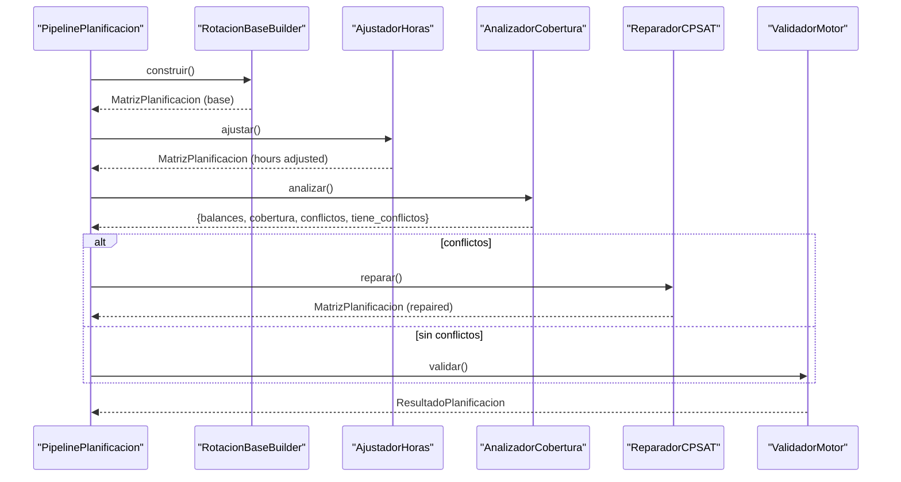

**Diagram sources**
- [pipeline.py:92-234](file://turnos/motor/pipeline.py#L92-L234)
- [rotacion_base.py:41-93](file://turnos/motor/rotacion_base.py#L41-L93)
- [ajuste_horas.py:46-88](file://turnos/motor/ajuste_horas.py#L46-L88)
- [cobertura.py:46-73](file://turnos/motor/cobertura.py#L46-L73)
- [reparador.py:63-95](file://turnos/motor/reparador.py#L63-L95)
- [validador_motor.py:48-86](file://turnos/motor/validador_motor.py#L48-L86)

## Detailed Component Analysis

### PipelinePlanificacion: Orchestrator and Initialization
Responsibilities:
- Accepts dates, nurses, rotation assignments, offsets, optional incidents, target hours, coverage minimums, solver configuration, turn types, hard and soft constraints, and historical balances.
- Normalizes coverage minimums to integer values.
- Executes 5 stages sequentially and aggregates results into ResultadoPlanificacion.
- Extracts validator configuration from hard constraints.

Key behaviors:
- Logs start/end of pipeline and each stage.
- Counts modified cells during hours adjustment and repair.
- Preserves solver status and timing metadata.
- On exceptions, returns a failed ResultadoPlanificacion with error details.

Initialization parameters and configuration options:
- fechas: list of dates
- enfermeras: mapping id -> name
- asignaciones_rotacion: mapping nurse_id -> RotacionCiclo
- desfases: mapping nurse_id -> offset_days
- incidencias: list of Incidencia (default empty)
- horas_objetivo: mapping nurse_id -> target_hours
- cobertura_minima: mapping turn_id -> min_nurses (accepts dict or int)
- configuracion_solver: dict (solver parameters)
- turnos_info: mapping turn_id -> TurnoInfo
- restricciones_duras: list of dicts
- restricciones_blandas: list of dicts
- balances_historicos: mapping nurse_id -> historic stats

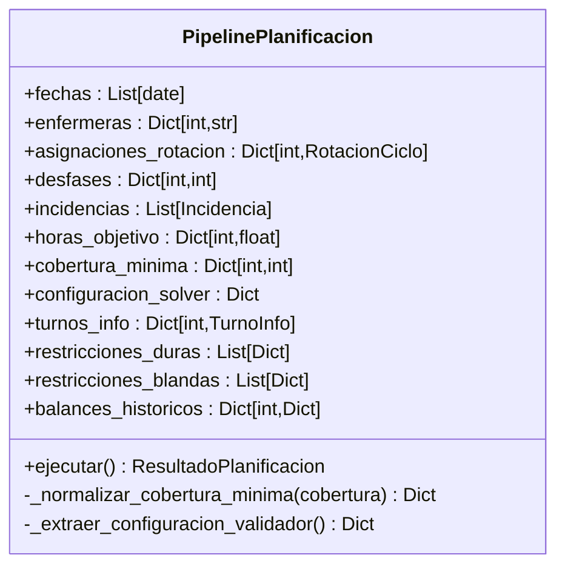

**Diagram sources**
- [pipeline.py:47-73](file://turnos/motor/pipeline.py#L47-L73)
- [pipeline.py:78-90](file://turnos/motor/pipeline.py#L78-L90)
- [pipeline.py:247-266](file://turnos/motor/pipeline.py#L247-L266)

**Section sources**
- [pipeline.py:31-267](file://turnos/motor/pipeline.py#L31-L267)

### RotacionBaseBuilder: Deterministic Base Rotation
- Builds MatrizPlanificacion from explicit rotation cycles and nurse offsets.
- Uses TurnoInfo to set cell type (TURNO vs LIBRE) and marks cells as belonging to base rotation.
- Stores immutable snapshot of base turn to support solver penalties.

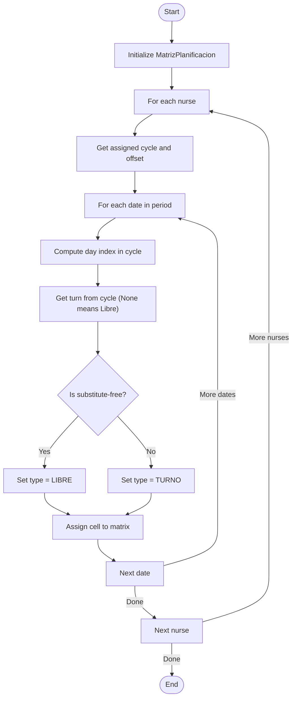

**Diagram sources**
- [rotacion_base.py:41-93](file://turnos/motor/rotacion_base.py#L41-L93)

**Section sources**
- [rotacion_base.py:21-93](file://turnos/motor/rotacion_base.py#L21-L93)
- [dtos.py:197-237](file://turnos/dominio/dtos.py#L197-L237)

### AjustadorHoras: Contract Hours Adjustment
- Compares actual hours per nurse against target hours and tolerances.
- Converts TURNO to LIBRE to reduce excess or LIBRE to TURNO to increase deficit.
- Prioritizes neighbors adjacent to free days to minimize pattern disruption.
- Limits number of modifications per nurse.

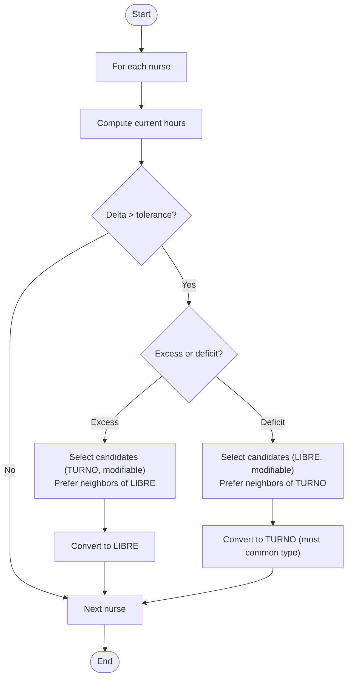

**Diagram sources**
- [ajuste_horas.py:46-88](file://turnos/motor/ajuste_horas.py#L46-L88)
- [ajuste_horas.py:98-213](file://turnos/motor/ajuste_horas.py#L98-L213)

**Section sources**
- [ajuste_horas.py:21-233](file://turnos/motor/ajuste_horas.py#L21-L233)

### AnalizadorCobertura: Coverage and Violations
- Computes per-nurse balances (hours, turns, nights, weekends, holidays).
- Calculates coverage per date and turn.
- Detects violations:
  - Coverage below minimum
  - Consecutive work days exceeding configured maximum
  - Consecutive night shifts exceeding configured maximum

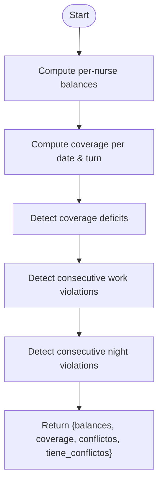

**Diagram sources**
- [cobertura.py:46-73](file://turnos/motor/cobertura.py#L46-L73)
- [cobertura.py:139-207](file://turnos/motor/cobertura.py#L139-L207)

**Section sources**
- [cobertura.py:21-208](file://turnos/motor/cobertura.py#L21-L208)

### ReparadorCPSAT: CP-SAT Repair
- Builds a CP-SAT model over all cells, allowing assignment to any TurnoInfo or LIBRE.
- Enforces hard constraints: one shift per day, minimum 12h rest between turns, max consecutive work days, max consecutive nights, minimum coverage.
- Objective: weighted minimization favoring preservation of base rotation, then hourly balance, then equity of nights and weekends.
- Returns repaired matrix if feasible; otherwise returns original matrix.

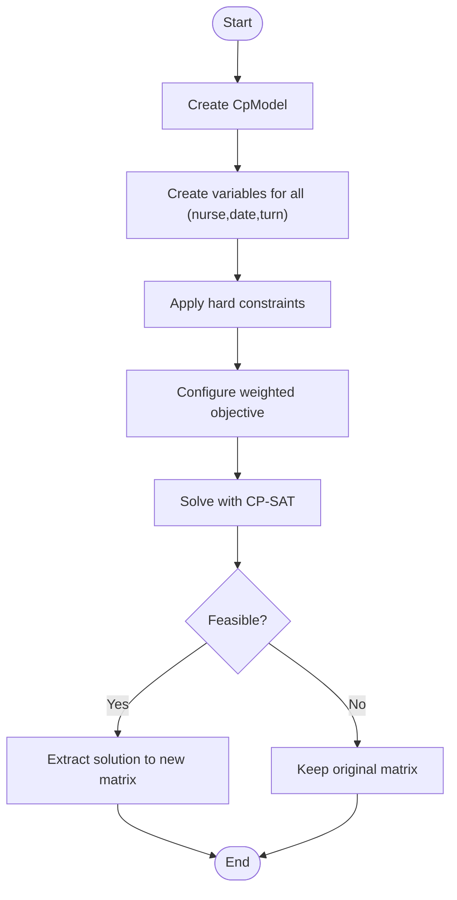

**Diagram sources**
- [reparador.py:63-95](file://turnos/motor/reparador.py#L63-L95)
- [reparador.py:133-296](file://turnos/motor/reparador.py#L133-L296)
- [reparador.py:297-334](file://turnos/motor/reparador.py#L297-L334)
- [reparador.py:581-609](file://turnos/motor/reparador.py#L581-L609)

**Section sources**
- [reparador.py:24-609](file://turnos/motor/reparador.py#L24-L609)

### ValidadorMotor: Final Validation
- Validates hard constraints: one shift/day, max consecutive work days, max consecutive nights, minimum 12h rest, minimum coverage.
- Performs cross-period continuity check for rest between last shift of previous period and first shift of current period.
- Computes final balances including historical accumulations.
- Emits warnings for significant equity deviations.

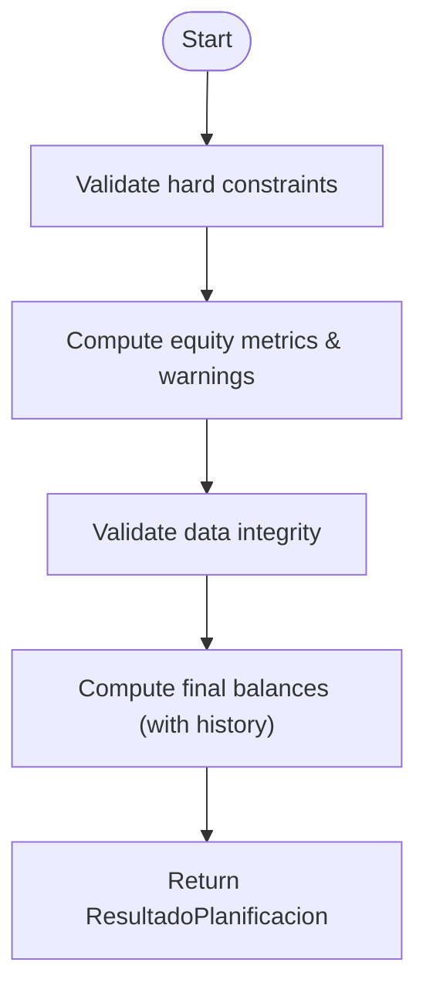

**Diagram sources**
- [validador_motor.py:48-86](file://turnos/motor/validador_motor.py#L48-L86)
- [validador_motor.py:88-311](file://turnos/motor/validador_motor.py#L88-L311)
- [validador_motor.py:366-438](file://turnos/motor/validador_motor.py#L366-L438)

**Section sources**
- [validador_motor.py:23-451](file://turnos/motor/validador_motor.py#L23-L451)

### OverlayIncidencias: Manual Incident Overlays
- Applies incidents (vacations, permissions, leaves, training, blocked pay, fixed assignments) after generation.
- Marks affected cells as non-modifiable and sets appropriate cell types.
- Detects coverage holes created by overlays.

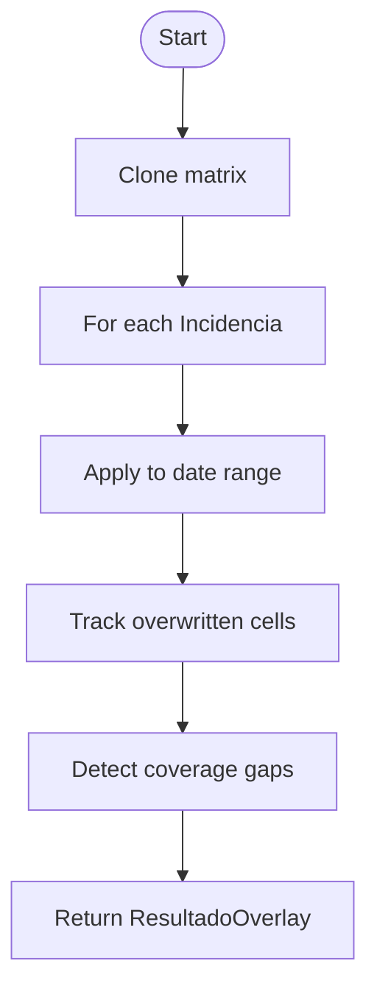

**Diagram sources**
- [overlay_incidencias.py:45-75](file://turnos/motor/overlay_incidencias.py#L45-L75)
- [overlay_incidencias.py:77-164](file://turnos/motor/overlay_incidencias.py#L77-L164)
- [overlay_incidencias.py:166-204](file://turnos/motor/overlay_incidencias.py#L166-L204)

**Section sources**
- [overlay_incidencias.py:24-205](file://turnos/motor/overlay_incidencias.py#L24-L205)

### Data Models and DTOs
- MatrizPlanificacion: core matrix structure holding CeldaPlanificacion instances.
- CeldaPlanificacion: per-nurse, per-date cell with type, turn, modifiability, and base rotation snapshot.
- TurnoInfo: turn metadata including duration and whether nocturnal.
- ResultadoPlanificacion: structured pipeline output with validation results and solver metrics.
- DTO enums: TipoCelda, TipoIncidencia.

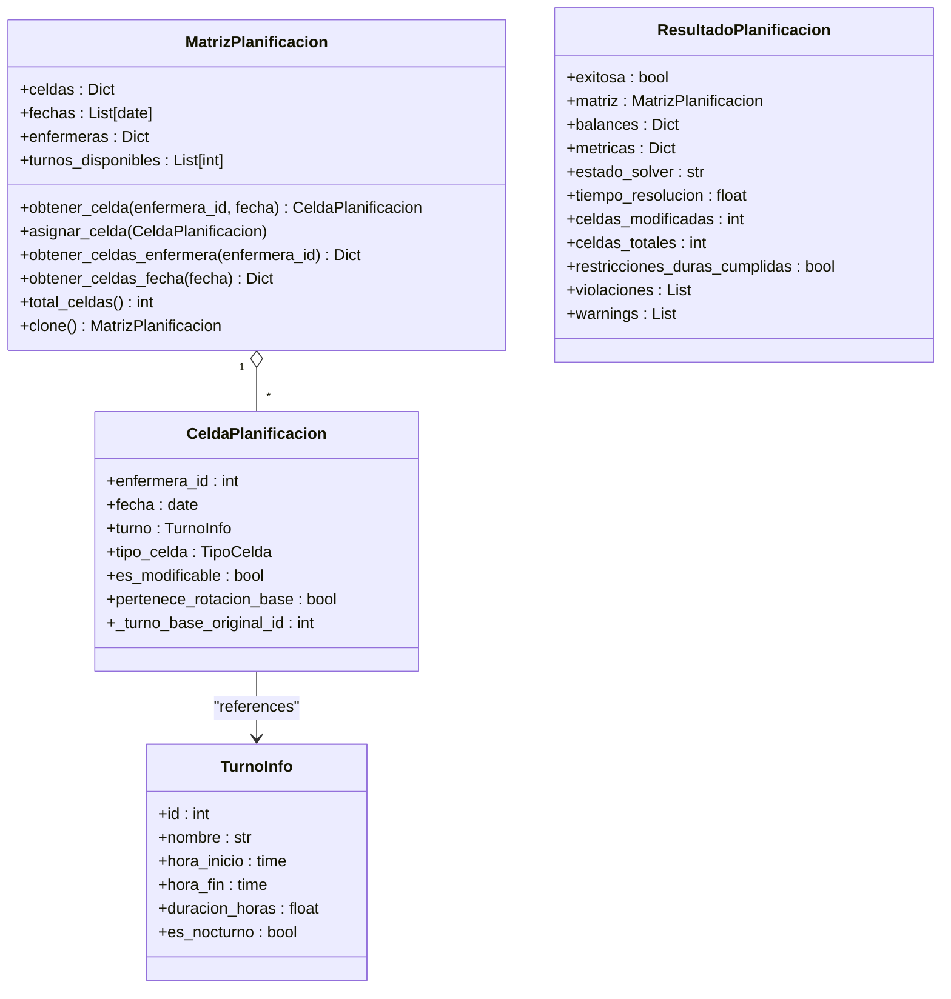

**Diagram sources**
- [dtos.py:197-274](file://turnos/dominio/dtos.py#L197-L274)

**Section sources**
- [dtos.py:22-200](file://turnos/dominio/dtos.py#L22-L200)
- [dtos.py:197-274](file://turnos/dominio/dtos.py#L197-L274)

## Dependency Analysis
- Pipeline orchestrator depends on stage components and DTOs.
- Stage components depend on DTOs and each other in sequence.
- ReparadorCPSAT depends on CP-SAT and TurnoInfo for constraint modeling.
- ValidadorMotor depends on TurnoInfo and time utilities for continuity checks.
- OverlayIncidencias depends on DTOs and coverage minimums.

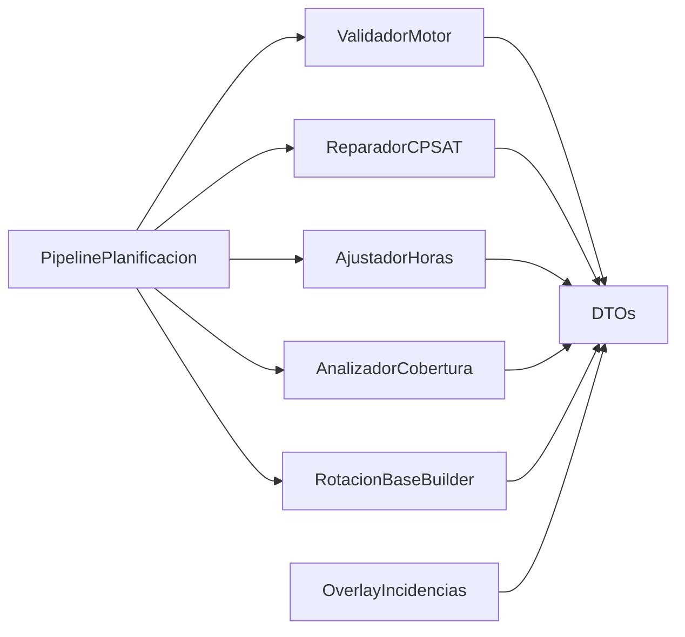

**Diagram sources**
- [pipeline.py:16-26](file://turnos/motor/pipeline.py#L16-L26)
- [reparador.py:11-18](file://turnos/motor/reparador.py#L11-L18)
- [validador_motor.py:11-18](file://turnos/motor/validador_motor.py#L11-L18)
- [overlay_incidencias.py:11-19](file://turnos/motor/overlay_incidencias.py#L11-L19)

**Section sources**
- [pipeline.py:16-26](file://turnos/motor/pipeline.py#L16-L26)
- [reparador.py:11-19](file://turnos/motor/reparador.py#L11-L19)
- [validador_motor.py:11-18](file://turnos/motor/validador_motor.py#L11-L18)
- [overlay_incidencias.py:11-19](file://turnos/motor/overlay_incidencias.py#L11-L19)

## Performance Considerations
- Sequential processing ensures predictable memory usage and clear intermediate states.
- CP-SAT repair is bounded by the number of variables (nurses × days × turns plus sentinel) and constraints; solver parameters limit runtime.
- Logging is enabled at INFO level for stages and DEBUG for detailed traces; consider rotating logs in production.
- Memory management:
  - MatrizPlanificacion.clone() creates deep copies for overlays and repairs; avoid unnecessary cloning outside of required steps.
  - AjustadorHoras limits per-nurse modifications to reduce solver workload.
- Debugging:
  - Centralized logging configuration supports file and console handlers.
  - Tests demonstrate reproducibility and expected behavior under various scenarios.

[No sources needed since this section provides general guidance]

## Troubleshooting Guide
Common issues and strategies:
- Pipeline errors: The orchestrator catches exceptions and returns a failed ResultadoPlanificacion with error messages; check logs for stack traces.
- Infeasible CP-SAT: Solver status indicates infeasibility; review hard constraints and coverage minimums.
- Coverage deficits after overlay: Use ResultadoOverlay huecos_cobertura to identify gaps and adjust coverage minimums or schedule replacements.
- Equity warnings: ValidadorMotor emits warnings for high deviation in hours, nights, or weekends; adjust rotation cycles or distribute free days.

Operational tips:
- Enable debug logging to capture detailed pipeline steps.
- Use management command to trigger planification runs and inspect outputs.

**Section sources**
- [pipeline.py:236-245](file://turnos/motor/pipeline.py#L236-L245)
- [logger_config.py:6-23](file://turnos/logger_config.py#L6-L23)
- [run_planificacion.py:13-39](file://turnos/management/commands/run_planificacion.py#L13-L39)

## Conclusion
The 5-stage pipeline delivers a robust, deterministic foundation for regular shift generation, with CP-SAT repair for conflicts and rigorous final validation. The separation between automatic regular shifts and manual incident overlays enables controlled, auditable adjustments post-generation. Clear logging, structured DTOs, and comprehensive validation support maintainability, performance, and reliability.

[No sources needed since this section summarizes without analyzing specific files]

## Appendices

### Typical Pipeline Configuration Options
- Dates and scope: fechas, enfermeras, num_dias, fecha_inicio
- Rotation: asignaciones_rotacion, desfases, RotacionCiclo
- Targets: horas_objetivo, balances_historicos
- Coverage: cobertura_minima
- Constraints: restricciones_duras (hard), restricciones_blandas (soft)
- Solver: configuracion_solver (parameters)
- Turn types: turnos_info (TurnoInfo)

**Section sources**
- [pipeline.py:47-73](file://turnos/motor/pipeline.py#L47-L73)
- [models.py:332-456](file://turnos/models.py#L332-L456)

### Execution Scenarios
- Regular shifts only: Run pipeline with no incidents; overlay applied later if needed.
- With incidents: Run pipeline, then apply OverlayIncidencias to finalize planilla.
- Validation failures: Review ValidadorMotor violations and adjust constraints or targets.

**Section sources**
- [test_pipeline.py:271-362](file://turnos/tests/test_motor/test_pipeline.py#L271-L362)
- [overlay_incidencias.py:45-75](file://turnos/motor/overlay_incidencias.py#L45-L75)