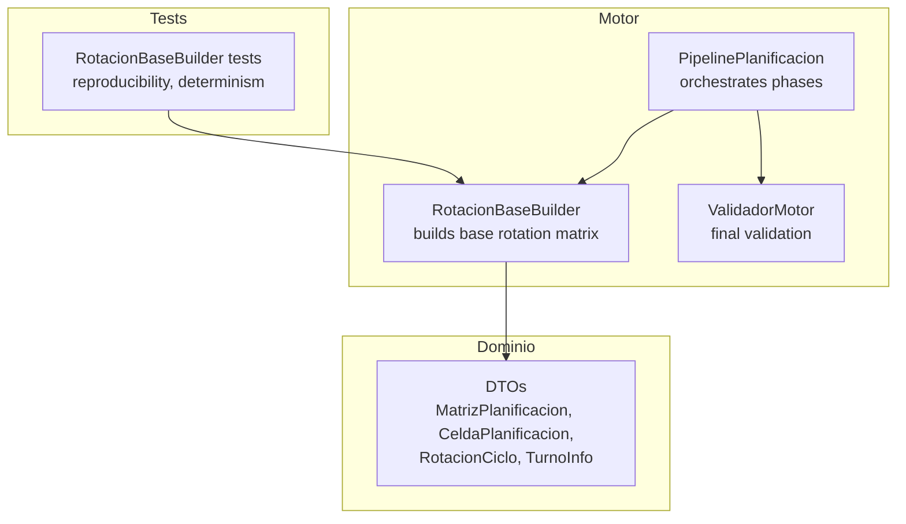
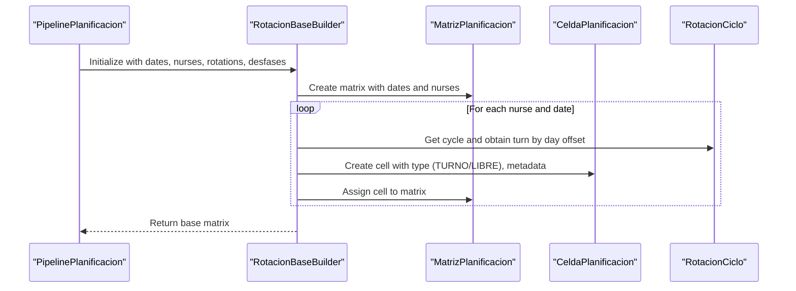
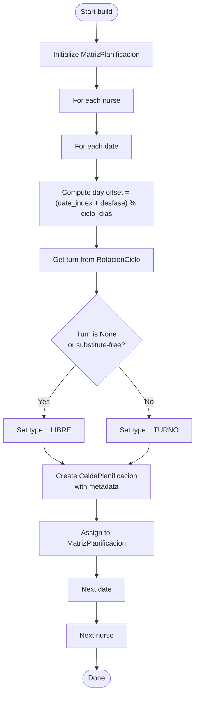
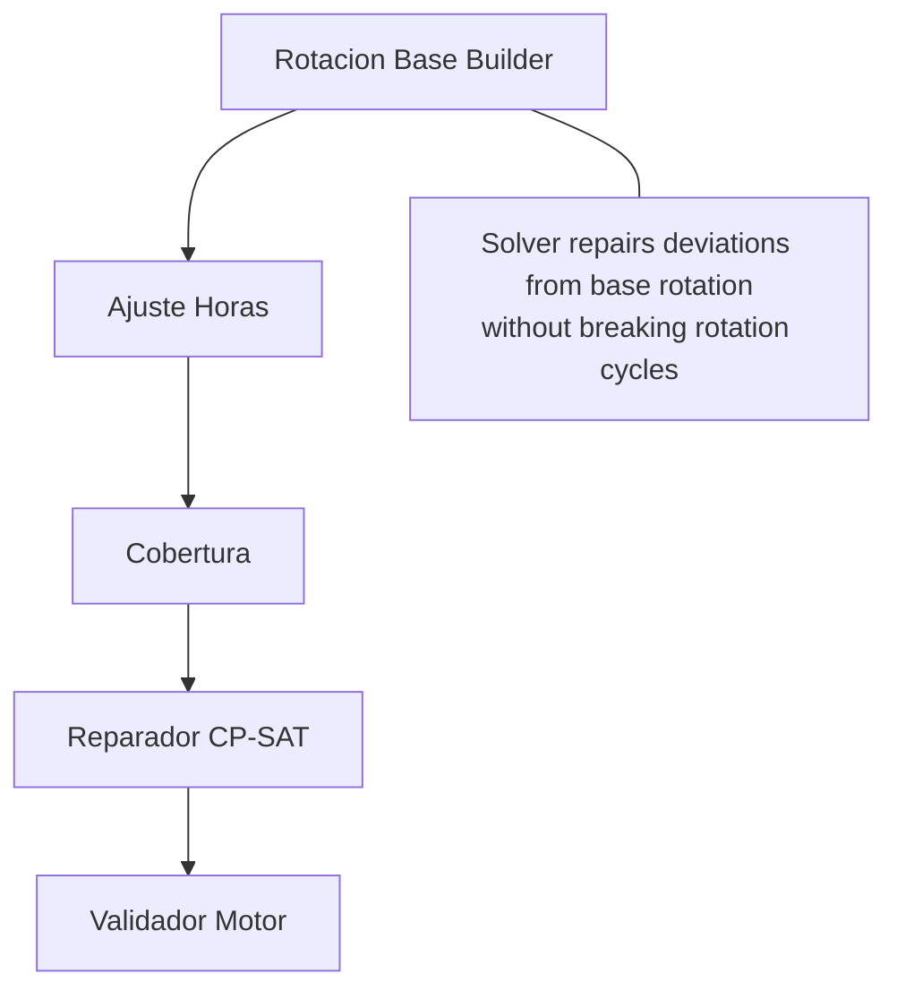
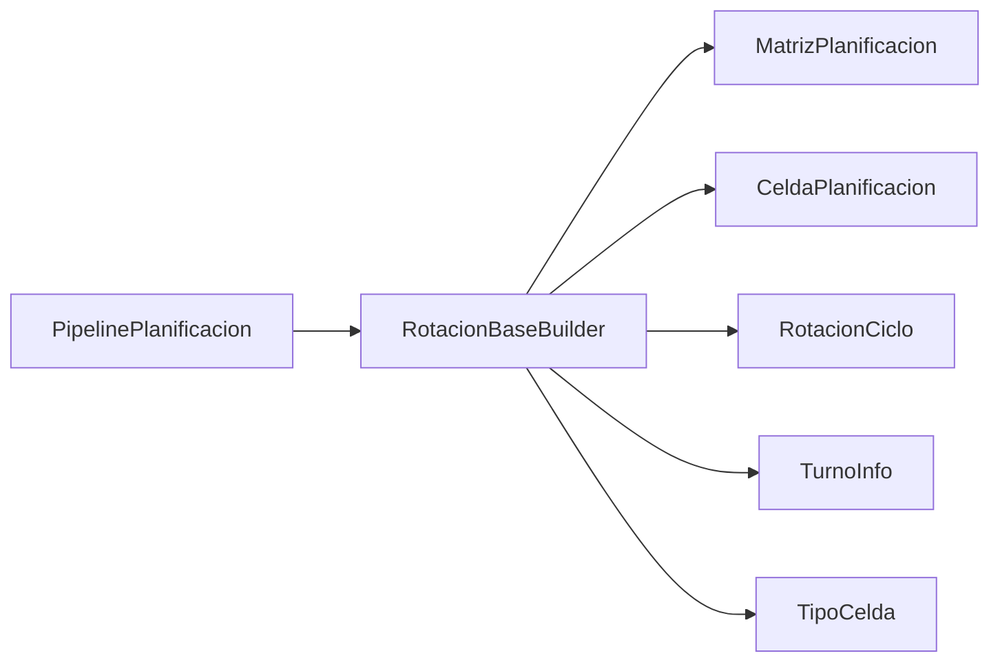

# Rotation Construction Phase

<cite>
**Referenced Files in This Document**
- [rotacion_base.py](file://turnos/motor/rotacion_base.py)
- [dtos.py](file://turnos/dominio/dtos.py)
- [pipeline.py](file://turnos/motor/pipeline.py)
- [test_pipeline.py](file://turnos/tests/test_motor/test_pipeline.py)
- [vocabulario.py](file://turnos/dominio/vocabulario.py)
- [validador_motor.py](file://turnos/motor/validador_motor.py)
- [test_reparador.py](file://turnos/tests/test_motor/test_reparador.py)
- [WIKI.md](file://docs/WIKI.md)
</cite>

## Table of Contents
1. [Introduction](#introduction)
2. [Project Structure](#project-structure)
3. [Core Components](#core-components)
4. [Architecture Overview](#architecture-overview)
5. [Detailed Component Analysis](#detailed-component-analysis)
6. [Dependency Analysis](#dependency-analysis)
7. [Performance Considerations](#performance-considerations)
8. [Troubleshooting Guide](#troubleshooting-guide)
9. [Conclusion](#conclusion)

## Introduction
This document explains the rotation construction phase that builds the deterministic base rotation used by the planner. It focuses on the RotacionBaseBuilder class, how shift pattern cycles are constructed, and how nurses are assigned to shifts across dates. It also documents the base rotation algorithm, shift pattern normalization, cyclic assignment strategies, and how the system preserves rotation regularity while accommodating different shift types and patterns. Concrete examples illustrate input parameters, rotation matrices, and output structures. Finally, it describes the relationship between base rotations and subsequent adjustment phases, edge cases, validation, debugging techniques, and performance optimization strategies.

## Project Structure
The rotation construction phase is part of the planning pipeline and centers around:
- A deterministic builder that creates a base rotation matrix from explicit cyclic patterns
- Domain DTOs that define cells, shifts, rotation cycles, and matrices
- Tests that validate determinism, reproducibility, and correctness of the base rotation
- Pipeline orchestration that invokes the builder as the first stage

**Diagram sources**
- [rotacion_base.py:21-94](file://turnos/motor/rotacion_base.py#L21-L94)
- [dtos.py:197-238](file://turnos/dominio/dtos.py#L197-L238)
- [pipeline.py:92-116](file://turnos/motor/pipeline.py#L92-L116)
- [test_pipeline.py:84-127](file://turnos/tests/test_motor/test_pipeline.py#L84-L127)

**Section sources**
- [rotacion_base.py:1-94](file://turnos/motor/rotacion_base.py#L1-L94)
- [dtos.py:197-238](file://turnos/dominio/dtos.py#L197-L238)
- [pipeline.py:92-116](file://turnos/motor/pipeline.py#L92-L116)
- [test_pipeline.py:84-127](file://turnos/tests/test_motor/test_pipeline.py#L84-L127)

## Core Components
- RotacionBaseBuilder: constructs the base rotation matrix deterministically from configured cycles, assigning shifts or free days to each nurse-date pair according to cycle offsets and per-nurse phases.
- DTOs: define the data structures used across the pipeline, including MatrizPlanificacion, CeldaPlanificacion, RotacionCiclo, and TurnoInfo.
- PipelinePlanificacion: orchestrates the five-phase pipeline, invoking the builder as the first deterministic stage.

Key responsibilities:
- Build a fully populated MatrizPlanificacion with CeldaPlanificacion entries for each nurse and date
- Respect cycle lengths and per-nurse desfases (offsets)
- Normalize shift types to LIBRE when appropriate (None turns or substitute-free types)
- Preserve rotation metadata for later phases

**Section sources**
- [rotacion_base.py:21-94](file://turnos/motor/rotacion_base.py#L21-L94)
- [dtos.py:184-238](file://turnos/dominio/dtos.py#L184-L238)
- [pipeline.py:92-116](file://turnos/motor/pipeline.py#L92-L116)

## Architecture Overview
The rotation construction phase is the first stage of the pipeline. It produces a base matrix that subsequent stages adjust and repair while preserving rotation regularity.

**Diagram sources**
- [pipeline.py:108-116](file://turnos/motor/pipeline.py#L108-L116)
- [rotacion_base.py:41-94](file://turnos/motor/rotacion_base.py#L41-L94)
- [dtos.py:197-238](file://turnos/dominio/dtos.py#L197-L238)

## Detailed Component Analysis

### RotacionBaseBuilder: Base Rotation Construction
RotacionBaseBuilder generates a deterministic base rotation matrix:
- Inputs: dates, nurses (id→name), per-nurse RotacionCiclo assignments, per-nurse desfases (offsets in days)
- Algorithm:
  - Initialize an empty MatrizPlanificacion
  - For each nurse-date pair:
    - Compute day offset within cycle considering desfase
    - Retrieve turn from RotacionCiclo using modulo arithmetic
    - Determine cell type: LIBRE if turn is None or marked as substitute-free; otherwise TURNO
    - Create CeldaPlanificacion with metadata (including immutable base turn snapshot)
    - Assign cell to matrix

Shift pattern normalization:
- If a cycle cell is None, the cell becomes LIBRE
- If a TurnoInfo indicates substitute-free, the cell becomes LIBRE
- Otherwise, the cell is TURNO

Preserving rotation regularity:
- Cycle length is enforced by modulo over cycle_dias
- Per-nurse desfases stagger rotation starts across the workforce
- Cell metadata tracks whether it belongs to the base rotation and retains the original base turn id

Output structure:
- MatrizPlanificacion containing all nurse-date cells with normalized types and metadata

**Diagram sources**
- [rotacion_base.py:41-94](file://turnos/motor/rotacion_base.py#L41-L94)
- [dtos.py:184-238](file://turnos/dominio/dtos.py#L184-L238)

**Section sources**
- [rotacion_base.py:21-94](file://turnos/motor/rotacion_base.py#L21-L94)
- [dtos.py:184-238](file://turnos/dominio/dtos.py#L184-L238)

### Pattern Cycle Construction and Nurse-to-Shift Assignments
Pattern cycle construction:
- RotacionCiclo defines a repeating sequence of TurnoInfo or None (representing free days)
- The cycle length determines periodicity; modulo arithmetic maps any date index to a position within the cycle
- Per-nurse desfases shift the starting position within the cycle, ensuring staggered assignments

Nurse-to-shift assignments:
- Each CeldaPlanificacion records the assigned TurnoInfo (or None for LIBRE)
- The cell’s type is normalized to LIBRE when appropriate
- Pertinent metadata marks the cell as belonging to the base rotation and stores the immutable base turn id

Validation during construction:
- Tests confirm reproducibility and determinism under identical inputs
- Tests verify that all cells belong to the base rotation and carry correct types

**Section sources**
- [dtos.py:184-238](file://turnos/dominio/dtos.py#L184-L238)
- [test_pipeline.py:84-127](file://turnos/tests/test_motor/test_pipeline.py#L84-L127)

### Base Rotation Algorithm, Shift Pattern Normalization, and Cyclic Assignment Strategies
Base rotation algorithm:
- Iterates over all nurse-date pairs
- Computes cycle-relative day using desfase and cycle_dias
- Retrieves the corresponding TurnoInfo from the cycle
- Normalizes to LIBRE when needed
- Creates and assigns CeldaPlanificacion

Shift pattern normalization:
- Explicit None in the cycle → LIBRE
- TurnoInfo.es_sustituto_libre → LIBRE
- Otherwise → TURNO

Cyclic assignment strategies:
- Modulo ensures wrap-around within the cycle
- Desfases distribute assignments across the workforce
- LIBRE days are preserved explicitly in the cycle and normalized at cell creation

**Section sources**
- [rotacion_base.py:57-90](file://turnos/motor/rotacion_base.py#L57-L90)
- [dtos.py:44-58](file://turnos/dominio/dtos.py#L44-L58)

### Relationship Between Base Rotations and Subsequent Adjustment Phases
The base rotation is the foundation for later phases:
- PipelinePlanificacion executes:
  1) Rotación base (deterministic)
  2) Ajuste horas (contract hours adjustments)
  3) Cobertura (coverage analysis)
  4) Reparación CP-SAT (repair conflicts)
  5) Validación (final checks)

The solver acts as a repairer over the base rotation, not as a generator. This preserves rotation regularity and ensures reproducibility.

**Diagram sources**
- [pipeline.py:92-234](file://turnos/motor/pipeline.py#L92-L234)
- [WIKI.md:118-123](file://docs/WIKI.md#L118-L123)

**Section sources**
- [pipeline.py:92-234](file://turnos/motor/pipeline.py#L92-L234)
- [WIKI.md:118-123](file://docs/WIKI.md#L118-L123)

### Edge Cases, Pattern Conflicts, and Validation During Rotation Construction
Edge cases:
- Nurses without a rotation assignment: skipped with a warning
- Empty cycles or invalid TurnoInfo ids: handled by adapters/conversion logic outside base builder
- Mixed None and TurnoInfo entries: supported via RotacionCiclo celdas

Pattern conflicts:
- Detected in later phases (coverage analysis and CP-SAT repair)
- Base builder preserves the intended cycle; conflicts are resolved by adjusting within constraints

Validation during construction:
- Tests enforce determinism and reproducibility
- Tests verify that cells belong to base rotation and carry correct types

Post-construction validation:
- ValidadorMotor checks hard constraints (one shift/day, consecutive limits, minimum rest, coverage)
- Uses immutable base turn ids to maintain rotation regularity during repairs

**Section sources**
- [rotacion_base.py:62-64](file://turnos/motor/rotacion_base.py#L62-L64)
- [test_pipeline.py:84-127](file://turnos/tests/test_motor/test_pipeline.py#L84-L127)
- [validador_motor.py:88-105](file://turnos/motor/validador_motor.py#L88-L105)
- [test_reparador.py:83-128](file://turnos/tests/test_motor/test_reparador.py#L83-L128)

### Concrete Examples: Input Parameters, Rotation Matrices, and Outputs
Example scenario:
- Dates: first 10 days of April 2026
- Nurses: 3 (id→name)
- Rotation: 2M-2T-2N-2L over 8 days
- Desfases: staggered (0, 2, 4)

Expected outputs:
- Matrix: 3 nurses × 10 days = 30 cells
- All cells normalized to TURNO or LIBRE
- All cells marked as belonging to base rotation
- Deterministic and reproducible across runs

Validation:
- Tests assert total cell count, date and nurse counts, reproducibility, and base-rotation membership

**Section sources**
- [test_pipeline.py:87-101](file://turnos/tests/test_motor/test_pipeline.py#L87-L101)
- [test_pipeline.py:102-127](file://turnos/tests/test_motor/test_pipeline.py#L102-L127)

## Dependency Analysis
RotacionBaseBuilder depends on:
- DTOs for MatrizPlanificacion, CeldaPlanificacion, RotacionCiclo, TurnoInfo, and cell type enums
- Pipeline orchestration for initialization and integration

**Diagram sources**
- [rotacion_base.py:10-16](file://turnos/motor/rotacion_base.py#L10-L16)
- [dtos.py:197-238](file://turnos/dominio/dtos.py#L197-L238)
- [pipeline.py:108-116](file://turnos/motor/pipeline.py#L108-L116)

**Section sources**
- [rotacion_base.py:10-16](file://turnos/motor/rotacion_base.py#L10-L16)
- [dtos.py:197-238](file://turnos/dominio/dtos.py#L197-L238)
- [pipeline.py:108-116](file://turnos/motor/pipeline.py#L108-L116)

## Performance Considerations
- Complexity: O(N × D) where N is number of nurses and D is number of dates
- Memory: One CeldaPlanificacion per nurse-date pair
- Optimization strategies:
  - Precompute modulo offsets per cycle to avoid repeated calculations
  - Use efficient iteration over dates and nurses
  - Keep TurnoInfo lookups minimal by passing prebuilt maps
  - Avoid unnecessary deep copies; use shallow cloning for matrices when needed

[No sources needed since this section provides general guidance]

## Troubleshooting Guide
Common issues and techniques:
- Non-deterministic output:
  - Verify identical inputs and absence of external randomness
  - Confirm reproducibility tests pass
- Unexpected LIBRE cells:
  - Check for None entries in the cycle or substitute-free turn types
- Coverage conflicts after adjustments:
  - Review AjusteHoras modifications and consult ValidadorMotor violations
- Solver not restoring base rotation:
  - Ensure _turno_base_original_id is preserved and used by the solver
  - Confirm ValidadorMotor uses enum comparisons, not string comparisons

Debugging aids:
- Logging in RotacionBaseBuilder and PipelinePlanificacion
- Unit tests validating determinism and structure
- ValidadorMotor enumerating violations and warnings

**Section sources**
- [rotacion_base.py:48-93](file://turnos/motor/rotacion_base.py#L48-L93)
- [test_pipeline.py:102-127](file://turnos/tests/test_motor/test_pipeline.py#L102-L127)
- [validador_motor.py:48-86](file://turnos/motor/validador_motor.py#L48-L86)
- [test_reparador.py:83-128](file://turnos/tests/test_motor/test_reparador.py#L83-L128)

## Conclusion
The rotation construction phase establishes a deterministic, reproducible base rotation that preserves rotation regularity. RotacionBaseBuilder maps explicit cyclic patterns onto nurse-date grids, normalizes shift types, and annotates cells with metadata for later phases. The pipeline leverages this base rotation to adjust hours, analyze coverage, repair conflicts, and validate outcomes—ensuring stable, predictable schedules aligned with configured patterns.