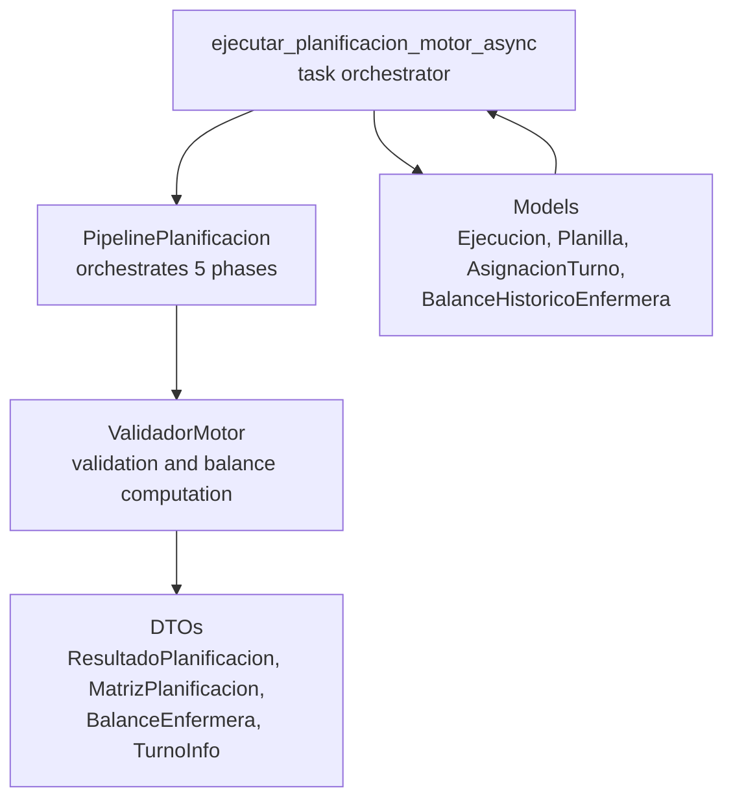
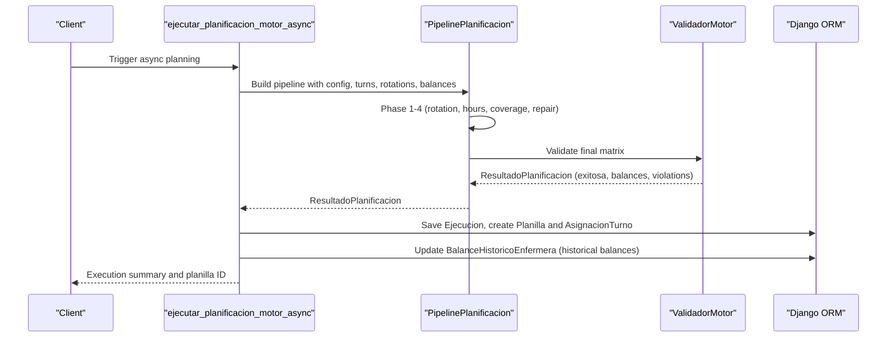
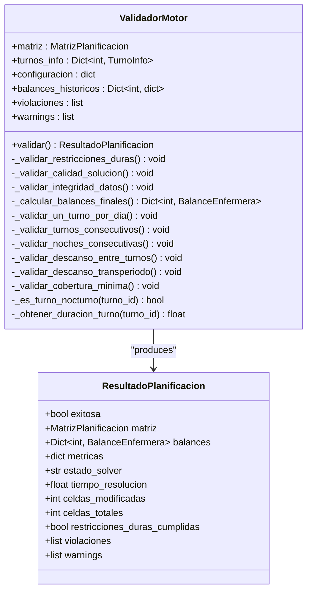
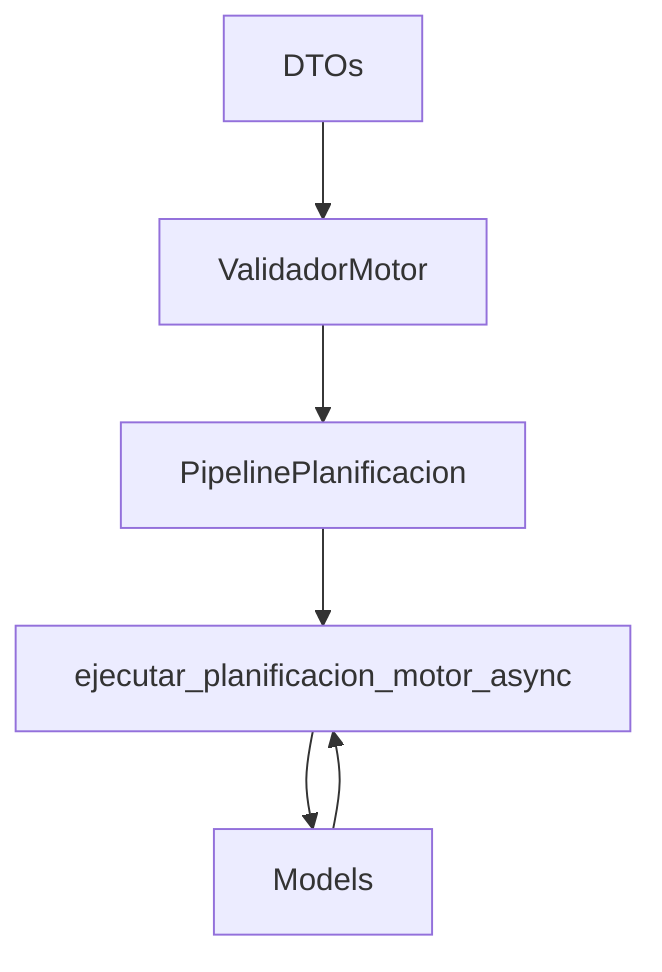

# Validation and Persistence Phase

<cite>
**Referenced Files in This Document**
- [validador_motor.py](file://turnos/motor/validador_motor.py)
- [dtos.py](file://turnos/dominio/dtos.py)
- [pipeline.py](file://turnos/motor/pipeline.py)
- [tasks.py](file://turnos/tasks.py)
- [models.py](file://turnos/models.py)
- [test_integracion_final.py](file://turnos/tests/test_motor/test_integracion_final.py)
- [validador.py](file://turnos/validador.py)
</cite>

## Table of Contents
1. [Introduction](#introduction)
2. [Project Structure](#project-structure)
3. [Core Components](#core-components)
4. [Architecture Overview](#architecture-overview)
5. [Detailed Component Analysis](#detailed-component-analysis)
6. [Dependency Analysis](#dependency-analysis)
7. [Performance Considerations](#performance-considerations)
8. [Troubleshooting Guide](#troubleshooting-guide)
9. [Conclusion](#conclusion)

## Introduction
This document focuses on the validation and persistence phase of the planning system, covering how the system verifies solution correctness, assesses result quality, and persists balances for future planning. It explains the ValidadorMotor class, validation rules, and result quality assessment criteria, along with metric computations and compliance checks. It also documents how final results are validated, performance metrics computed, and data integrity ensured, including historical balance integration and persistence strategies. Concrete examples illustrate validation outputs, quality scores, and compliance reports, and guidance is provided for interpreting validation results and troubleshooting issues.

## Project Structure
The validation and persistence phase spans several modules:
- Motor validation: Validates hard constraints, solution quality, and data integrity, and computes final balances.
- Domain DTOs: Define the ResultadoPlanificacion structure and supporting data models.
- Pipeline orchestration: Integrates validation into the five-phase planning pipeline.
- Task orchestration: Executes the new motor pipeline, persists results, and updates historical balances.
- Models: Define persisted entities for balances and plan records.

**Diagram sources**
- [validador_motor.py:23-86](file://turnos/motor/validador_motor.py#L23-L86)
- [dtos.py:251-274](file://turnos/dominio/dtos.py#L251-L274)
- [pipeline.py:92-234](file://turnos/motor/pipeline.py#L92-L234)
- [tasks.py:333-685](file://turnos/tasks.py#L333-L685)
- [models.py:482-566](file://turnos/models.py#L482-L566)

**Section sources**
- [validador_motor.py:23-86](file://turnos/motor/validador_motor.py#L23-L86)
- [dtos.py:251-274](file://turnos/dominio/dtos.py#L251-L274)
- [pipeline.py:92-234](file://turnos/motor/pipeline.py#L92-L234)
- [tasks.py:333-685](file://turnos/tasks.py#L333-L685)
- [models.py:482-566](file://turnos/models.py#L482-L566)

## Core Components
- ValidadorMotor: Performs hard constraint validation, solution quality checks, data integrity checks, and computes final balances with historical accumulation.
- ResultadoPlanificacion: The structured result containing exit status, matrices, balances, solver metadata, and validation artifacts.
- PipelinePlanificacion: Integrates validation into the five-phase pipeline and produces a ResultadoPlanificacion.
- Tasks: Executes the pipeline, persists results, creates planillas, and updates historical balances.
- Models: Persist executions, planillas, assignments, and historical balances.

Key responsibilities:
- Hard constraints: One shift per day, maximum consecutive shifts, maximum consecutive nights, minimum rest between shifts, and coverage requirements.
- Quality metrics: Equity checks for hours, night shifts, and weekends.
- Data integrity: Correct cell types and presence of required identifiers.
- Historical integration: Uses previous accumulated hours, nights, weekends, and holidays to compute updated balances.

**Section sources**
- [validador_motor.py:48-86](file://turnos/motor/validador_motor.py#L48-L86)
- [dtos.py:251-274](file://turnos/dominio/dtos.py#L251-L274)
- [pipeline.py:201-234](file://turnos/motor/pipeline.py#L201-L234)
- [tasks.py:566-685](file://turnos/tasks.py#L566-L685)
- [models.py:787-825](file://turnos/models.py#L787-L825)

## Architecture Overview
The validation and persistence flow integrates the validator into the planning pipeline and persists results via Celery tasks.

**Diagram sources**
- [pipeline.py:92-234](file://turnos/motor/pipeline.py#L92-L234)
- [validador_motor.py:48-86](file://turnos/motor/validador_motor.py#L48-L86)
- [tasks.py:566-685](file://turnos/tasks.py#L566-L685)
- [models.py:482-566](file://turnos/models.py#L482-L566)

## Detailed Component Analysis

### ValidadorMotor
ValidadorMotor performs:
- Hard constraint checks: one shift per day, maximum consecutive shifts, maximum consecutive nights, minimum rest between shifts (including inter-period continuity), and coverage requirements.
- Quality checks: equity metrics for hours, nights, and weekends.
- Data integrity checks: correct cell types and presence of identifiers.
- Final balance calculation: aggregates hours, nights, weekends, and holidays, incorporating historical accumulations.

Validation rules and criteria:
- One shift per day: Each nurse must have exactly one shift or be marked as free for each calendar day.
- Maximum consecutive shifts: Controlled by configuration; default thresholds applied if not specified.
- Maximum consecutive nights: Controlled by configuration; default thresholds applied if not specified.
- Minimum rest between shifts: Real-world rest between consecutive shifts must meet a 12-hour threshold; cross-period continuity validated when historical last shift precedes the current period.
- Coverage requirements: For each day and shift type, actual coverage must meet configured minimums; absence across the entire period is considered zero coverage.

Quality assessment:
- Hours equity: Computes average hours per nurse and flags high deviation (>10 hours).
- Night shift equity: Computes max-min difference across nurses and flags differences >3.
- Weekend equity: Computes max-min difference across nurses and flags differences >2.

Data integrity:
- Cell type validation against enum values.
- Presence of required identifiers for shift cells.

Final balances:
- Computes assigned hours, nights, weekends, and holidays.
- Incorporates historical accumulations (hours, nights, weekends, holidays) and last shift metadata.
- Produces a dictionary mapping nurse IDs to BalanceEnfermera instances.

**Diagram sources**
- [validador_motor.py:23-86](file://turnos/motor/validador_motor.py#L23-L86)
- [dtos.py:251-274](file://turnos/dominio/dtos.py#L251-L274)

**Section sources**
- [validador_motor.py:48-86](file://turnos/motor/validador_motor.py#L48-L86)
- [validador_motor.py:88-311](file://turnos/motor/validador_motor.py#L88-L311)
- [validador_motor.py:312-388](file://turnos/motor/validador_motor.py#L312-L388)
- [validador_motor.py:389-451](file://turnos/motor/validador_motor.py#L389-L451)
- [dtos.py:251-274](file://turnos/dominio/dtos.py#L251-L274)

### ResultadoPlanificacion Structure
Resultados carry:
- exitosa: Boolean indicating whether all hard constraints were satisfied.
- matriz: Final MatrizPlanificacion after repairs.
- balances: Dictionary of BalanceEnfermera per nurse.
- metricas: Placeholder for computed metrics.
- Solver metadata: state, resolution time, number of modified cells.
- Compliance: flags for hard constraint satisfaction, lists of violations and warnings.

Interpretation:
- exitosa = True indicates a feasible, compliant plan.
- Non-empty violations imply hard constraint failures.
- Warnings indicate quality issues (equity concerns).

**Section sources**
- [dtos.py:251-274](file://turnos/dominio/dtos.py#L251-L274)

### Validation Criteria and Metric Calculations
Hard constraints:
- One shift per day: Detects missing assignments or multiple shifts per day.
- Consecutive shifts and nights: Counts sequences and flags exceeding configured thresholds.
- Minimum rest: Computes real-world rest between shifts and flags insufficient rest.
- Coverage: Aggregates actual shifts per day/shift type and compares to minimum requirements.

Quality metrics:
- Hours equity: Average hours per nurse; flags deviations >10 hours.
- Night equity: Difference between max and min nights assigned.
- Weekend equity: Difference between max and min weekend days assigned.

Compliance checking:
- Hard constraints must be fully satisfied (no violations) for exitosa = True.
- Soft equity warnings do not invalidate feasibility but signal imbalance.

**Section sources**
- [validador_motor.py:106-311](file://turnos/motor/validador_motor.py#L106-L311)
- [validador_motor.py:312-364](file://turnos/motor/validador_motor.py#L312-L364)

### Result Quality Assessment
Quality assessment focuses on equity:
- Hours equity: Detects extreme deviations from the mean.
- Night equity: Highlights imbalances in night shift distribution.
- Weekend equity: Highlights imbalances in weekend coverage.

These checks produce warnings that inform planning adjustments without failing feasibility.

**Section sources**
- [validador_motor.py:312-364](file://turnos/motor/validador_motor.py#L312-L364)

### Historical Data Integration and Balance Calculation
Historical balances are integrated to inform planning and are updated upon successful execution:
- Historical accumulations: Previous hours, nights, weekends, and holidays.
- Last shift metadata: Date and type of the last shift worked prior to the current period.
- Period reference: Monthly period (YYYY-MM) used to uniquely identify historical records.
- Balance computation: Summarizes assigned hours, nights, weekends, and holidays, adding historical accumulations.

Persistence:
- Historical balances are updated or created per nurse and monthly period using Django’s update_or_create.
- Only the last shift metadata is updated if the nurse had any real shifts during the period.

**Section sources**
- [tasks.py:640-675](file://turnos/tasks.py#L640-L675)
- [models.py:787-825](file://turnos/models.py#L787-L825)

### Validation Failure Scenarios and Error Reporting
Failure scenarios:
- Hard constraint violations: One shift per day, consecutive limits, minimum rest, coverage.
- Data integrity issues: Invalid cell types or missing identifiers.
- Infeasible periods: Detected by pipeline or solver.

Error reporting:
- Violations recorded with type, affected nurse/date, and description.
- Warnings highlight quality issues (equity).
- Task-level error handling marks execution as ERROR and retries up to configured limit.

**Section sources**
- [validador_motor.py:106-311](file://turnos/motor/validador_motor.py#L106-L311)
- [tasks.py:204-239](file://turnos/tasks.py#L204-L239)

### Result Persistence Strategies
Persistence pipeline:
- Ejecucion: Stores execution state, timestamps, optimality flag, and validation messages.
- Planilla: Created on successful execution with period dates and count.
- AsignacionTurno: Bulk-created from the final matrix, capturing nurse assignments, dates, and cell types.
- BalanceHistoricoEnfermera: Updated or created monthly with aggregated totals and last shift metadata.

**Section sources**
- [tasks.py:106-170](file://turnos/tasks.py#L106-L170)
- [tasks.py:601-675](file://turnos/tasks.py#L601-L675)
- [models.py:482-566](file://turnos/models.py#L482-L566)

## Dependency Analysis
The validation and persistence phase depends on:
- DTOs for internal structures (MatrizPlanificacion, ResultadoPlanificacion, BalanceEnfermera, TurnoInfo).
- Pipeline orchestration to integrate validation into the planning process.
- Task orchestration to execute the pipeline, persist results, and update balances.
- Models for persistent entities (Ejecucion, Planilla, AsignacionTurno, BalanceHistoricoEnfermera).

**Diagram sources**
- [dtos.py:197-238](file://turnos/dominio/dtos.py#L197-L238)
- [validador_motor.py:23-86](file://turnos/motor/validador_motor.py#L23-L86)
- [pipeline.py:92-234](file://turnos/motor/pipeline.py#L92-L234)
- [tasks.py:333-685](file://turnos/tasks.py#L333-L685)
- [models.py:482-566](file://turnos/models.py#L482-L566)

**Section sources**
- [dtos.py:197-238](file://turnos/dominio/dtos.py#L197-L238)
- [validador_motor.py:23-86](file://turnos/motor/validador_motor.py#L23-L86)
- [pipeline.py:92-234](file://turnos/motor/pipeline.py#L92-L234)
- [tasks.py:333-685](file://turnos/tasks.py#L333-L685)
- [models.py:482-566](file://turnos/models.py#L482-L566)

## Performance Considerations
- Validation complexity: Linear in the number of nurse-day cells for constraint checks and O(N) for equity metrics.
- Historical balance queries: Minimal overhead; single query per nurse to fetch latest historical record before the current period.
- Bulk creation: AsignacionTurno uses bulk_create to minimize database round trips.
- Logging and warnings: Used for diagnostics; keep verbosity appropriate for production throughput.

[No sources needed since this section provides general guidance]

## Troubleshooting Guide
Common issues and resolutions:
- Hard constraint violations:
  - Review violations list for types (e.g., consecutive shifts, nights, rest, coverage).
  - Adjust configuration thresholds (maximum consecutive shifts/nights) or increase coverage.
- Quality warnings:
  - Investigate equity warnings (hours, nights, weekends) and rebalance assignments.
- Data integrity errors:
  - Ensure cell types match enums and required identifiers are present.
- Historical balance anomalies:
  - Verify last shift metadata and accumulated totals; update_or_create preserves existing records when no shifts occur in the period.
- Task failures:
  - Check execution state transitions and retry logs; inspect error messages stored in Ejecucion.mensajes.

Concrete examples from tests:
- Validation detects insufficient coverage across the entire period.
- Validation flags minimum rest violations between shifts.
- Historical balance update_or_create behavior verified across periods.

**Section sources**
- [test_integracion_final.py:401-425](file://turnos/tests/test_motor/test_integracion_final.py#L401-L425)
- [test_integracion_final.py:781-800](file://turnos/tests/test_motor/test_integracion_final.py#L781-L800)
- [test_integracion_final.py:544-596](file://turnos/tests/test_motor/test_integracion_final.py#L544-L596)

## Conclusion
The validation and persistence phase ensures that generated plans satisfy hard constraints, maintain solution quality, and preserve historical context for future planning. ValidadorMotor enforces strict compliance while providing actionable quality signals. The pipeline and task orchestration integrate validation seamlessly, persist results reliably, and update historical balances for informed decision-making. By interpreting validation outputs and addressing identified issues, administrators can improve plan fairness and adherence to operational standards.