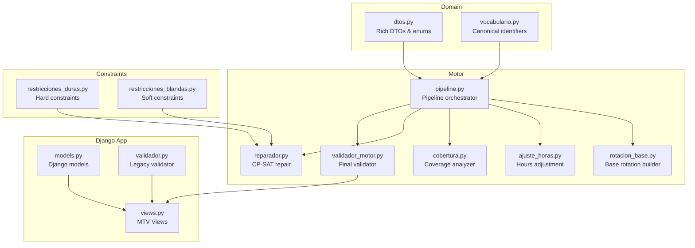
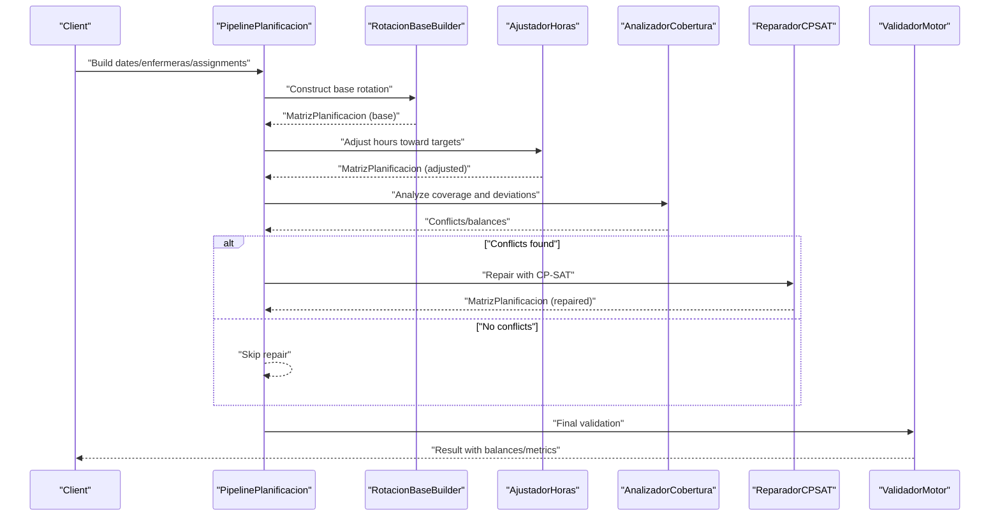
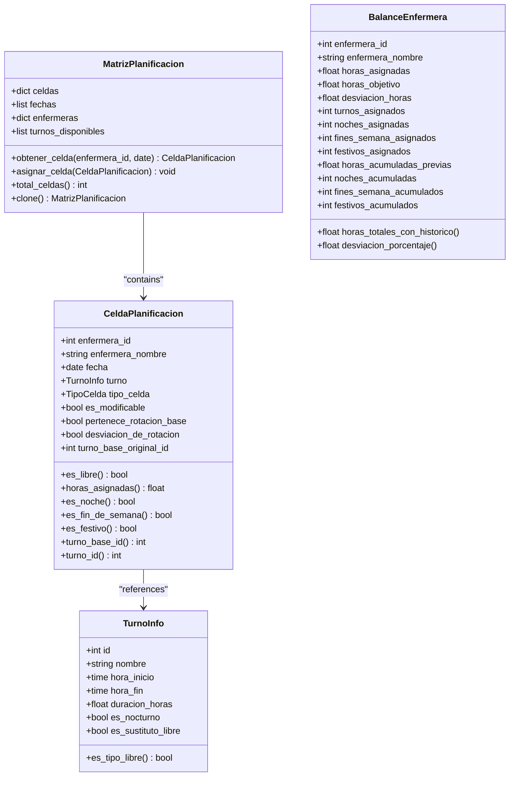
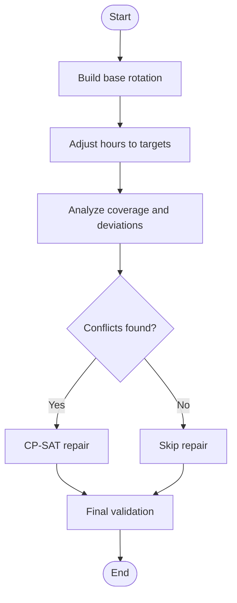
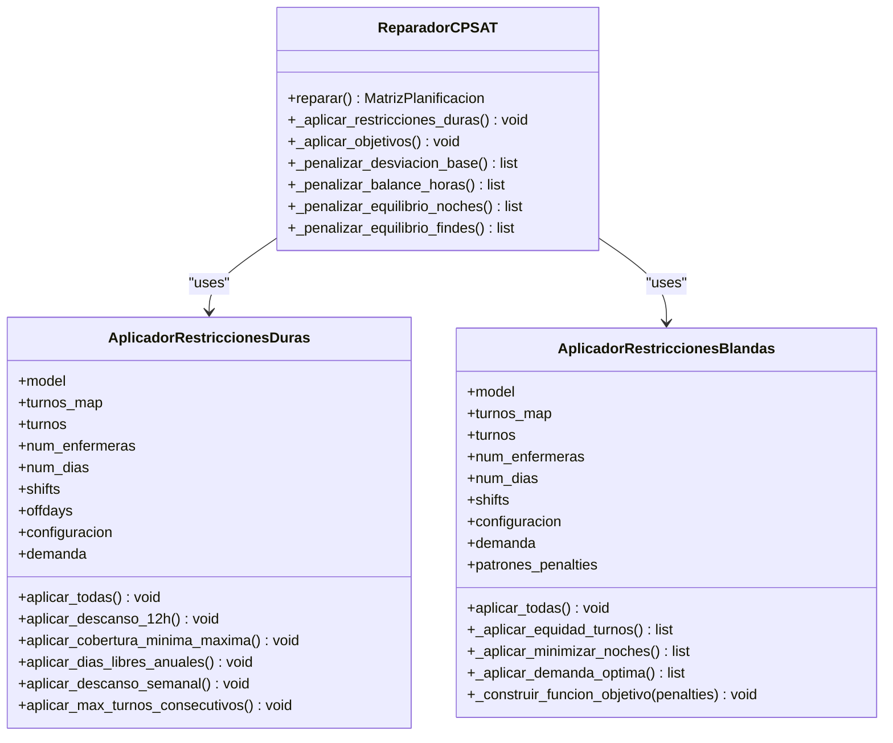
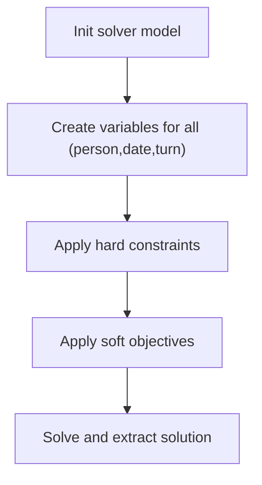
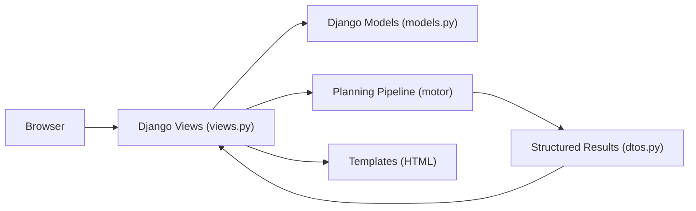
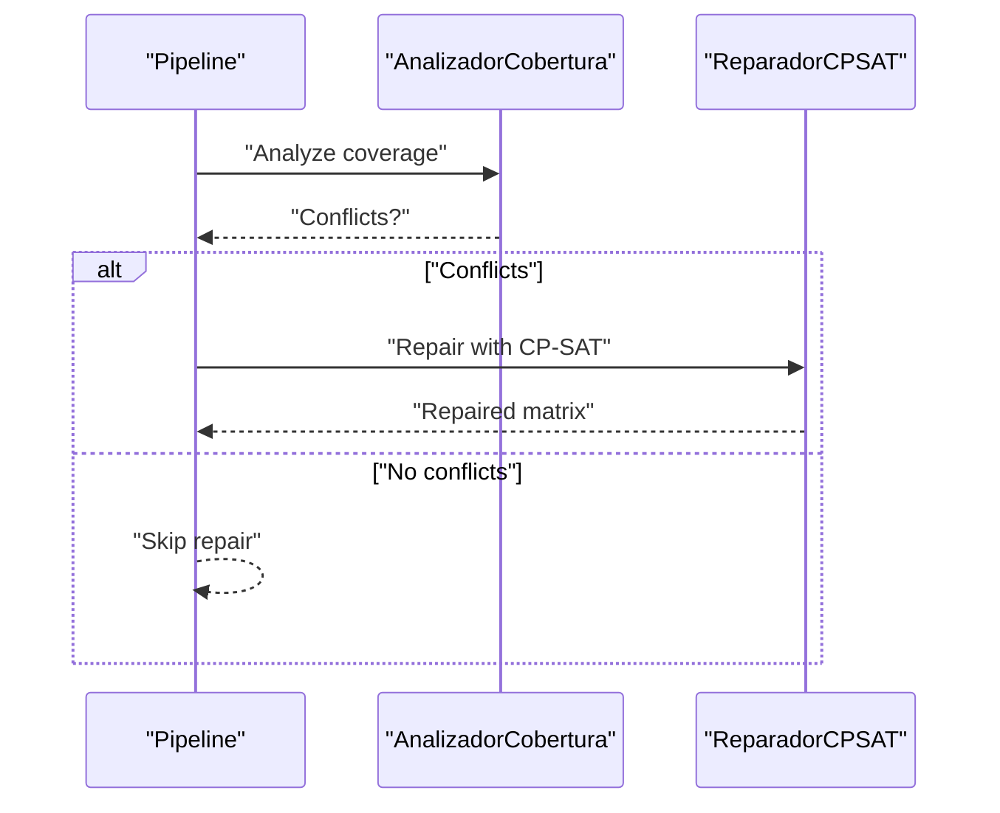
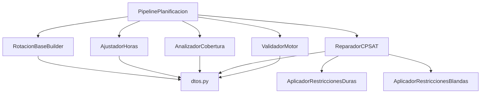

# Design Patterns and Principles

<cite>
**Referenced Files in This Document**
- [pipeline.py](file://turnos/motor/pipeline.py)
- [rotacion_base.py](file://turnos/motor/rotacion_base.py)
- [ajuste_horas.py](file://turnos/motor/ajuste_horas.py)
- [cobertura.py](file://turnos/motor/cobertura.py)
- [reparador.py](file://turnos/motor/reparador.py)
- [validador_motor.py](file://turnos/motor/validador_motor.py)
- [dtos.py](file://turnos/dominio/dtos.py)
- [vocabulario.py](file://turnos/dominio/vocabulario.py)
- [restricciones_duras.py](file://turnos/restricciones_duras.py)
- [restricciones_blandas.py](file://turnos/restricciones_blandas.py)
- [views.py](file://turnos/views.py)
- [models.py](file://turnos/models.py)
- [validador.py](file://turnos/validador.py)
</cite>

## Table of Contents
1. [Introduction](#introduction)
2. [Project Structure](#project-structure)
3. [Core Components](#core-components)
4. [Architecture Overview](#architecture-overview)
5. [Detailed Component Analysis](#detailed-component-analysis)
6. [Dependency Analysis](#dependency-analysis)
7. [Performance Considerations](#performance-considerations)
8. [Troubleshooting Guide](#troubleshooting-guide)
9. [Conclusion](#conclusion)

## Introduction
This document explains the design patterns and architectural principles implemented in the nursing shift scheduler. It focuses on:
- Domain-Driven Design with rich domain models and explicit DTOs
- Pipeline pattern for sequential processing stages
- Strategy-like constraint evaluation and weighted objectives
- Factory-like construction of solver constraints from configuration
- MVC/MTV separation in Django
- CP-SAT as a repair mechanism rather than free generation
- Consolidation of multiple solvers into a single active engine

It also documents the rationale behind key design decisions (e.g., measuring equity in actual hours, using historical context, explicit domain models) and provides practical troubleshooting guidance.

## Project Structure
The system is organized around a clear separation of concerns:
- Domain layer: rich models and DTOs define the planning vocabulary and data structures
- Motor layer: orchestration pipeline and processing stages
- Django app: views, models, and templates (MTV)
- Constraints: hard and soft constraints applied to the CP-SAT model

**Diagram sources**
- [pipeline.py:31-267](file://turnos/motor/pipeline.py#L31-L267)
- [rotacion_base.py:21-94](file://turnos/motor/rotacion_base.py#L21-L94)
- [ajuste_horas.py:21-233](file://turnos/motor/ajuste_horas.py#L21-L233)
- [cobertura.py:21-208](file://turnos/motor/cobertura.py#L21-L208)
- [reparador.py:24-609](file://turnos/motor/reparador.py#L24-L609)
- [validador_motor.py:23-451](file://turnos/motor/validador_motor.py#L23-L451)
- [dtos.py:16-274](file://turnos/dominio/dtos.py#L16-L274)
- [vocabulario.py:10-112](file://turnos/dominio/vocabulario.py#L10-L112)
- [restricciones_duras.py:10-156](file://turnos/restricciones_duras.py#L10-L156)
- [restricciones_blandas.py:9-138](file://turnos/restricciones_blandas.py#L9-L138)
- [views.py:52-200](file://turnos/views.py#L52-L200)
- [models.py:12-200](file://turnos/models.py#L12-L200)
- [validador.py:11-200](file://turnos/validador.py#L11-L200)

**Section sources**
- [pipeline.py:1-267](file://turnos/motor/pipeline.py#L1-L267)
- [dtos.py:1-274](file://turnos/dominio/dtos.py#L1-L274)
- [views.py:1-200](file://turnos/views.py#L1-L200)
- [models.py:1-200](file://turnos/models.py#L1-L200)

## Core Components
- PipelinePlanificacion orchestrates five sequential stages: base rotation, hours adjustment, coverage analysis, CP-SAT repair, and final validation. It encapsulates the overall planning workflow and coordinates domain DTOs and motor stages.
- RotacionBaseBuilder deterministically builds the base schedule from configured cycles and offsets.
- AjustadorHoras adjusts the base schedule to meet contractual hours targets with minimal disruption.
- AnalizadorCobertura computes balances, coverage, and detects conflicts.
- ReparadorCPSAT repairs conflicts using CP-SAT with hard constraints plus weighted soft objectives.
- ValidadorMotor performs final checks against hard constraints and quality metrics.
- Restrictores_duras and Restrictores_blandas apply hard and soft constraints to the CP-SAT model.
- Domain DTOs (MatrizPlanificacion, CeldaPlanificacion, TurnoInfo, BalanceEnfermera, etc.) provide explicit, typed structures decoupled from Django models.
- Canonical vocabulary defines official identifiers for constraints, patterns, and priorities.

**Section sources**
- [pipeline.py:31-267](file://turnos/motor/pipeline.py#L31-L267)
- [rotacion_base.py:21-94](file://turnos/motor/rotacion_base.py#L21-L94)
- [ajuste_horas.py:21-233](file://turnos/motor/ajuste_horas.py#L21-L233)
- [cobertura.py:21-208](file://turnos/motor/cobertura.py#L21-L208)
- [reparador.py:24-609](file://turnos/motor/reparador.py#L24-L609)
- [validador_motor.py:23-451](file://turnos/motor/validador_motor.py#L23-L451)
- [restricciones_duras.py:10-156](file://turnos/restricciones_duras.py#L10-L156)
- [restricciones_blandas.py:9-138](file://turnos/restricciones_blandas.py#L9-L138)
- [dtos.py:43-274](file://turnos/dominio/dtos.py#L43-L274)
- [vocabulario.py:10-112](file://turnos/dominio/vocabulario.py#L10-L112)

## Architecture Overview
The system follows a staged pipeline with a strong domain layer and a single active engine (CP-SAT). Hard constraints are enforced by the solver; soft constraints become weighted objectives. Historical balances influence future planning.

**Diagram sources**
- [pipeline.py:92-245](file://turnos/motor/pipeline.py#L92-L245)
- [rotacion_base.py:41-94](file://turnos/motor/rotacion_base.py#L41-L94)
- [ajuste_horas.py:46-88](file://turnos/motor/ajuste_horas.py#L46-L88)
- [cobertura.py:46-73](file://turnos/motor/cobertura.py#L46-L73)
- [reparador.py:63-96](file://turnos/motor/reparador.py#L63-L96)
- [validador_motor.py:48-86](file://turnos/motor/validador_motor.py#L48-L86)

## Detailed Component Analysis

### Domain-Driven Design with Rich Domain Models
The domain layer defines explicit, immutable-rich DTOs and enums that capture planning semantics precisely:
- TurnoInfo: encapsulates turn identity, timing, duration, and attributes (e.g., nocturnal)
- CeldaPlanificacion: per-person-per-date cell with metadata, immutability snapshots, and helpers
- MatrizPlanificacion: typed container with lookup and cloning
- BalanceEnfermera: aggregates hours, counts, and historical accumulations
- Enums: TipoCelda, TipoIncidencia
- Canonical vocabulary: official identifiers for constraints and priorities

These models replace loose JSON structures, enabling safer transformations, clearer validations, and easier maintenance.

**Diagram sources**
- [dtos.py:43-274](file://turnos/dominio/dtos.py#L43-L274)

**Section sources**
- [dtos.py:43-274](file://turnos/dominio/dtos.py#L43-L274)
- [vocabulario.py:10-112](file://turnos/dominio/vocabulario.py#L10-L112)

### Pipeline Pattern for Sequential Processing Stages
The PipelinePlanificacion orchestrates a deterministic sequence:
1) Base rotation (deterministic)
2) Hours adjustment (minimal changes)
3) Coverage analysis (conflict detection)
4) CP-SAT repair (only when conflicts detected)
5) Final validation

Each stage produces a MatrizPlanificacion and passes it forward. The pipeline extracts configuration for validators and ensures robustness with logging and error handling.

**Diagram sources**
- [pipeline.py:92-245](file://turnos/motor/pipeline.py#L92-L245)

**Section sources**
- [pipeline.py:31-267](file://turnos/motor/pipeline.py#L31-L267)
- [rotacion_base.py:41-94](file://turnos/motor/rotacion_base.py#L41-L94)
- [ajuste_horas.py:46-88](file://turnos/motor/ajuste_horas.py#L46-L88)
- [cobertura.py:46-73](file://turnos/motor/cobertura.py#L46-L73)
- [reparador.py:63-96](file://turnos/motor/reparador.py#L63-L96)
- [validador_motor.py:48-86](file://turnos/motor/validador_motor.py#L48-L86)

### Strategy Pattern for Flexible Constraint Evaluation
The system applies hard and soft constraints using a strategy-like approach:
- Hard constraints (e.g., one shift/day, minimum rest, max consecutive shifts, coverage bounds) are enforced by the CP-SAT model.
- Soft constraints (e.g., equity, minimizing nights, preference alignment) are translated into weighted penalties in the objective function.

The ReparadorCPSAT reads canonical constraint definitions and constructs solver constraints dynamically, supporting extensibility and normalization of constraint names.

**Diagram sources**
- [restricciones_duras.py:10-156](file://turnos/restricciones_duras.py#L10-L156)
- [restricciones_blandas.py:9-138](file://turnos/restricciones_blandas.py#L9-L138)
- [reparador.py:24-609](file://turnos/motor/reparador.py#L24-L609)

**Section sources**
- [restricciones_duras.py:10-156](file://turnos/restricciones_duras.py#L10-L156)
- [restricciones_blandas.py:9-138](file://turnos/restricciones_blandas.py#L9-L138)
- [reparador.py:133-334](file://turnos/motor/reparador.py#L133-L334)

### Factory Pattern for Dynamic Constraint Creation
The CP-SAT model construction acts as a factory:
- It creates Boolean variables for each person/date/turn combination
- It includes a sentinel “LIBRE” option to keep cells free
- It builds constraints and objectives from configuration dictionaries
- It supports normalization of constraint names and extraction of parameters

This enables dynamic, declarative constraint instantiation without hardcoding solver logic.

**Diagram sources**
- [reparador.py:63-96](file://turnos/motor/reparador.py#L63-L96)
- [reparador.py:97-132](file://turnos/motor/reparador.py#L97-L132)
- [reparador.py:133-296](file://turnos/motor/reparador.py#L133-L296)
- [reparador.py:297-334](file://turnos/motor/reparador.py#L297-L334)

**Section sources**
- [reparador.py:37-132](file://turnos/motor/reparador.py#L37-L132)

### MVC/MTV Separation in Django
The Django app follows MTV:
- Models (models.py): persistent entities (Workspace, Enfermera, TipoTurno, etc.)
- Templates: HTML pages for UI
- Views (views.py): request handlers, logic, and orchestration

The planning pipeline is invoked from views and returns structured results consumed by templates and APIs.

**Diagram sources**
- [views.py:52-200](file://turnos/views.py#L52-L200)
- [models.py:12-200](file://turnos/models.py#L12-L200)
- [pipeline.py:92-245](file://turnos/motor/pipeline.py#L92-L245)
- [dtos.py:250-274](file://turnos/dominio/dtos.py#L250-L274)

**Section sources**
- [views.py:52-200](file://turnos/views.py#L52-L200)
- [models.py:12-200](file://turnos/models.py#L12-L200)

### CP-SAT as a Repair Mechanism Rather Than Free Generation
Key design choice:
- The pipeline generates a deterministic base rotation and makes minimal adjustments to meet contractual hours
- CP-SAT repairs only when coverage analysis detects conflicts
- Incidences (vacations, leaves) are applied as overlays after generation, not during solver preprocessing

This approach preserves the base rotation while ensuring feasibility and quality.

**Diagram sources**
- [pipeline.py:165-200](file://turnos/motor/pipeline.py#L165-L200)
- [cobertura.py:46-73](file://turnos/motor/cobertura.py#L46-L73)
- [reparador.py:63-96](file://turnos/motor/reparador.py#L63-L96)

**Section sources**
- [pipeline.py:42-44](file://turnos/motor/pipeline.py#L42-L44)
- [pipeline.py:170-200](file://turnos/motor/pipeline.py#L170-L200)
- [reparador.py:24-35](file://turnos/motor/reparador.py#L24-L35)

### Consolidation of Multiple Solvers into a Single Active Engine
Decision rationale:
- CP-SAT is the sole active engine for constraint satisfaction and optimization
- Other potential engines were considered but consolidated to reduce complexity and maintain consistency
- The chosen weights and priorities reflect operational trade-offs (e.g., preserving base rotation over minor changes)

Benefits:
- Simpler deployment and maintenance
- Consistent behavior across scenarios
- Predictable performance characteristics

**Section sources**
- [reparador.py:24-35](file://turnos/motor/reparador.py#L24-L35)
- [reparador.py:297-334](file://turnos/motor/reparador.py#L297-L334)

### Rationale Behind Design Choices
- Measuring equity in actual hours rather than raw shift counts:
  - The system tracks hours worked and historical accumulations, enabling fair balancing across months and years
  - Objective functions and validators compute differences in actual hours, not simple counts
- Using historical context for planning:
  - Historical balances influence penalties and decisions, ensuring long-term fairness
- Implementing explicit domain models over loose JSON:
  - Strong typing and immutability snapshots improve correctness and reduce runtime errors
  - Clear interfaces between pipeline stages and the solver

**Section sources**
- [reparador.py:384-446](file://turnos/motor/reparador.py#L384-L446)
- [validador_motor.py:389-438](file://turnos/motor/validador_motor.py#L389-L438)
- [dtos.py:60-132](file://turnos/dominio/dtos.py#L60-L132)

## Dependency Analysis
The pipeline composes specialized stages, each depending on domain DTOs and configuration. The CP-SAT repair depends on both hard and soft constraint builders. The final validator consumes matrices and turn information.

**Diagram sources**
- [pipeline.py:31-267](file://turnos/motor/pipeline.py#L31-L267)
- [reparador.py:24-609](file://turnos/motor/reparador.py#L24-L609)
- [restricciones_duras.py:10-156](file://turnos/restricciones_duras.py#L10-L156)
- [restricciones_blandas.py:9-138](file://turnos/restricciones_blandas.py#L9-L138)
- [validador_motor.py:23-451](file://turnos/motor/validador_motor.py#L23-L451)
- [dtos.py:43-274](file://turnos/dominio/dtos.py#L43-L274)

**Section sources**
- [pipeline.py:31-267](file://turnos/motor/pipeline.py#L31-L267)
- [reparador.py:24-609](file://turnos/motor/reparador.py#L24-L609)

## Performance Considerations
- The CP-SAT solver is configured with bounded time and worker settings to cap latency during repair
- Minimal modifications are made to preserve the base rotation, reducing the search space
- Coverage analysis short-circuits conflict detection early
- Historical balances are integrated into penalties to avoid repeated large-scale changes

Recommendations:
- Tune solver parameters for workload size
- Keep base rotations aligned with typical patterns to minimize repairs
- Monitor warning thresholds for equity metrics to proactively adjust configurations

**Section sources**
- [reparador.py:74-89](file://turnos/motor/reparador.py#L74-L89)
- [validador_motor.py:312-364](file://turnos/motor/validador_motor.py#L312-L364)

## Troubleshooting Guide
Common issues and resolutions:
- Conflicts after coverage analysis:
  - Cause: Coverage below minimum or consecutive shift limits exceeded
  - Resolution: Adjust coverage targets or increase buffer; review hard constraint configuration
- CP-SAT infeasible or no solution:
  - Cause: Over-constrained configuration or incompatible hard constraints
  - Resolution: Relax hard limits incrementally; verify minimum rest and coverage bounds
- Equity warnings:
  - Cause: Large disparities in hours, nights, or weekends
  - Resolution: Increase soft equity weights; review base rotation patterns
- Historical imbalance persists:
  - Cause: High accumulated hours/nights/fines
  - Resolution: Adjust monthly targets; incorporate historical offsets into objectives
- Django view errors:
  - Cause: Model validation failures or missing data
  - Resolution: Inspect model.clean() constraints and ensure required fields are populated

Operational tips:
- Enable logs around the pipeline stages to isolate failures
- Validate configuration normalization and canonical identifiers
- Use the final validator’s warnings to guide configuration tuning

**Section sources**
- [pipeline.py:236-245](file://turnos/motor/pipeline.py#L236-L245)
- [reparador.py:89-95](file://turnos/motor/reparador.py#L89-L95)
- [validador_motor.py:340-364](file://turnos/motor/validador_motor.py#L340-L364)
- [models.py:126-167](file://turnos/models.py#L126-L167)
- [validador.py:20-33](file://turnos/validador.py#L20-L33)

## Conclusion
The system blends Domain-Driven Design with a staged pipeline, enforcing hard constraints via CP-SAT and optimizing soft goals through weighted objectives. Explicit domain models, canonical identifiers, and a single active engine deliver predictable, maintainable, and scalable scheduling. The design emphasizes fairness through actual hours, historical context, and incremental repairs, while keeping the frontend and backend cleanly separated under Django’s MTV paradigm.