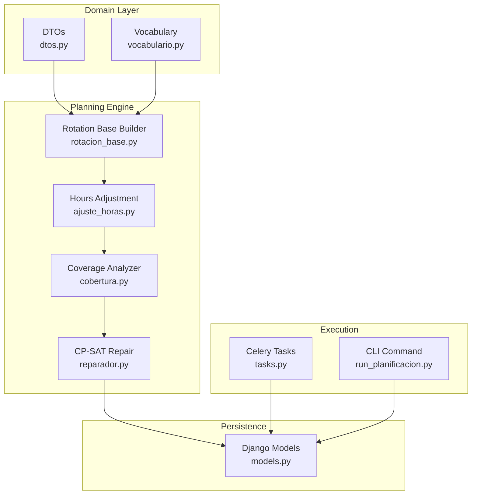
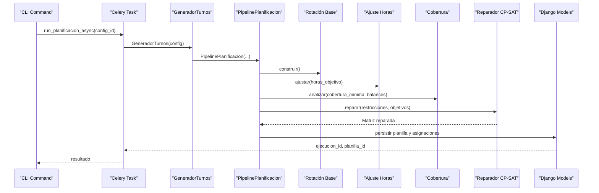
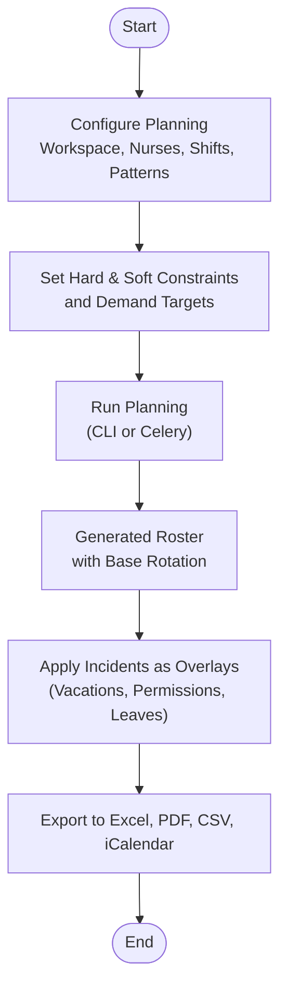
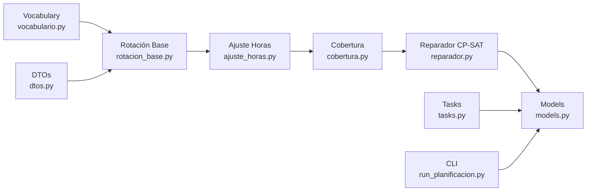

# System Overview

<cite>
**Referenced Files in This Document**
- [README.md](file://README.md)
- [ARQUITECTURA.md](file://docs/ARQUITECTURA.md)
- [models.py](file://turnos/models.py)
- [rotacion_base.py](file://turnos/motor/rotacion_base.py)
- [ajuste_horas.py](file://turnos/motor/ajuste_horas.py)
- [cobertura.py](file://turnos/motor/cobertura.py)
- [incidencias.py](file://turnos/motor/incidencias.py)
- [reparador.py](file://turnos/motor/reparador.py)
- [generador_refactorizado.py](file://turnos/generador_refactorizado.py)
- [resolvedor.py](file://turnos/resolvedor.py)
- [dtos.py](file://turnos/dominio/dtos.py)
- [vocabulario.py](file://turnos/dominio/vocabulario.py)
- [tasks.py](file://turnos/tasks.py)
- [run_planificacion.py](file://turnos/management/commands/run_planificacion.py)
- [settings.py](file://proyecto_turnos/settings.py)
</cite>

## Table of Contents
1. [Introduction](#introduction)
2. [Project Structure](#project-structure)
3. [Core Components](#core-components)
4. [Architecture Overview](#architecture-overview)
5. [Detailed Component Analysis](#detailed-component-analysis)
6. [Dependency Analysis](#dependency-analysis)
7. [Performance Considerations](#performance-considerations)
8. [Troubleshooting Guide](#troubleshooting-guide)
9. [Conclusion](#conclusion)

## Introduction
This nursing shift scheduling platform is a specialized, automated planner for regular nursing rotations. It generates realistic monthly rosters based on explicit cyclic patterns, hourly balance optimization, and incident correction. Unlike generic schedulers, it preserves the predictable “rotación base” (base rotation) while using a CP-SAT solver to repair conflicts and minimize deviations from the established pattern. The system emphasizes:
- Monthly roster generation aligned with real-world nursing cuadrantes (shift blocks)
- Explicit rotation patterns and cyclic base construction
- Hourly balance across weeks/months/years, including historical context (“balance histórico”)
- Incident correction (vacations, permissions, leaves, training) applied as overlays after generation
- Asynchronous execution via Celery/Redis and robust export capabilities

Key differentiators:
- CP-SAT solver as a repair mechanism, not a free generator
- Metrics grounded in actual hours worked, not counts of shifts
- Contextual planning using historical accumulations per nurse
- Multi-workspace support for multiple organizations
- Comprehensive export formats (Excel, PDF, CSV, iCalendar)

## Project Structure
High-level structure relevant to the system’s purpose:
- Domain layer: typed DTOs, vocabulary, and domain models
- Planning engine: pipeline stages (rotation base, coverage analysis, CP-SAT repair)
- Persistence: Django models for configurations, executions, plans, and assignments
- Execution: Celery tasks orchestrating asynchronous runs
- CLI and web: management command and Django app for configuration and execution

**Diagram sources**
- [dtos.py:196-274](file://turnos/dominio/dtos.py#L196-L274)
- [vocabulario.py:1-112](file://turnos/dominio/vocabulario.py#L1-L112)
- [rotacion_base.py:21-94](file://turnos/motor/rotacion_base.py#L21-L94)
- [ajuste_horas.py:21-233](file://turnos/motor/ajuste_horas.py#L21-L233)
- [cobertura.py:21-208](file://turnos/motor/cobertura.py#L21-L208)
- [reparador.py:24-609](file://turnos/motor/reparador.py#L24-L609)
- [models.py:332-825](file://turnos/models.py#L332-L825)
- [tasks.py:17-240](file://turnos/tasks.py#L17-L240)
- [run_planificacion.py:7-40](file://turnos/management/commands/run_planificacion.py#L7-L40)

**Section sources**
- [README.md:1-111](file://README.md#L1-L111)
- [ARQUITECTURA.md:1-302](file://docs/ARQUITECTURA.md#L1-L302)
- [settings.py:134-160](file://proyecto_turnos/settings.py#L134-L160)

## Core Components
- Base rotation builder: constructs the deterministic matrix using configured cyclic patterns and per-nurse offsets
- Hours adjustment: aligns generated hours toward contractual targets with minimal disruption
- Coverage analyzer: computes metrics, detects violations, and identifies imbalances
- CP-SAT repair: resolves conflicts respecting hard constraints and proximity to the base rotation
- Execution orchestration: Celery tasks and CLI command to run planning asynchronously or on-demand
- Domain models: typed DTOs, vocabulary, and persistent models for contracts, rotations, incidents, and historical balances

Practical outcomes:
- Monthly planillas (rosters) with explicit rotación base
- Balanced distribution of hours, nights, weekends, and holidays
- Historical context incorporated for fair inter-month balancing
- Clear separation of incident application (overlay) from generation

**Section sources**
- [rotacion_base.py:21-94](file://turnos/motor/rotacion_base.py#L21-L94)
- [ajuste_horas.py:21-233](file://turnos/motor/ajuste_horas.py#L21-L233)
- [cobertura.py:21-208](file://turnos/motor/cobertura.py#L21-L208)
- [reparador.py:24-609](file://turnos/motor/reparador.py#L24-L609)
- [dtos.py:196-274](file://turnos/dominio/dtos.py#L196-L274)
- [models.py:629-825](file://turnos/models.py#L629-L825)

## Architecture Overview
The system follows a five-stage pipeline:
1. Construct base rotation deterministically from configured cycles and per-nurse offsets
2. Apply fixed incidents (vacations, permissions, leaves, training) as non-modifiable cells
3. Compute coverage and deviations against targets
4. Repair conflicts with CP-SAT while minimizing changes to the base rotation
5. Validate and persist planilla, assignments, and updated historical balances

**Diagram sources**
- [run_planificacion.py:7-40](file://turnos/management/commands/run_planificacion.py#L7-L40)
- [tasks.py:17-240](file://turnos/tasks.py#L17-L240)
- [generador_refactorizado.py:17-140](file://turnos/generador_refactorizado.py#L17-L140)
- [rotacion_base.py:41-94](file://turnos/motor/rotacion_base.py#L41-L94)
- [ajuste_horas.py:46-88](file://turnos/motor/ajuste_horas.py#L46-L88)
- [cobertura.py:46-73](file://turnos/motor/cobertura.py#L46-L73)
- [reparador.py:63-96](file://turnos/motor/reparador.py#L63-L96)
- [models.py:534-624](file://turnos/models.py#L534-L624)

## Detailed Component Analysis

### System Purpose and Capabilities
- Monthly cuadrante-style rosters with explicit cyclic patterns
- Hourly balance across weeks/months/years, incorporating historical accumulations
- Incident correction applied as overlays after generation
- CP-SAT solver as repair mechanism, not free generation
- Multi-workspace isolation and asynchronous execution

Differentiators from generic schedulers:
- Preserves rotación base to maintain predictable nursing schedules
- Uses actual hours worked as the equity metric
- Incorporates balance histórico for inter-month fairness
- Provides explicit rotation models and typed DTOs for clarity and safety

**Section sources**
- [README.md:5-16](file://README.md#L5-L16)
- [ARQUITECTURA.md:3-16](file://docs/ARQUITECTURA.md#L3-L16)
- [models.py:629-825](file://turnos/models.py#L629-L825)
- [dtos.py:196-274](file://turnos/dominio/dtos.py#L196-L274)

### Monthly Planning Workflow (Conceptual)
- Configure workspace, nurses, shifts, and rotation patterns
- Define hard and soft constraints and demand targets
- Run planning (CLI or Celery task)
- Review results, apply incidents as overlays, and export

[No sources needed since this diagram shows conceptual workflow, not actual code structure]

### Technical Highlights for Developers
- Typed DTOs encapsulate internal data structures and metadata
- Vocabulary defines canonical identifiers for constraints, patterns, and priorities
- Pipeline stages are modular and testable
- CP-SAT model construction and objective weighting are explicit
- Asynchronous execution with retries and cleanup tasks

**Section sources**
- [dtos.py:1-274](file://turnos/dominio/dtos.py#L1-L274)
- [vocabulario.py:1-112](file://turnos/dominio/vocabulario.py#L1-L112)
- [reparador.py:297-334](file://turnos/motor/reparador.py#L297-L334)
- [tasks.py:17-240](file://turnos/tasks.py#L17-L240)

### System Boundaries and Supported Use Cases
Supported use cases:
- Generate monthly rosters for nursing teams
- Apply fixed incidents (vacations, permissions, leaves, training)
- Optimize for equitable distribution of hours, nights, weekends, and holidays
- Incorporate historical accumulations for inter-month balance
- Export results to multiple formats

Integration capabilities:
- Asynchronous execution via Celery/Redis
- Multi-workspace isolation for multi-organization deployments
- Email notifications for execution completion/error
- CLI commands for automation and testing

**Section sources**
- [tasks.py:17-240](file://turnos/tasks.py#L17-L240)
- [settings.py:134-160](file://proyecto_turnos/settings.py#L134-L160)
- [models.py:12-28](file://turnos/models.py#L12-L28)

## Dependency Analysis
The planning pipeline depends on typed DTOs and vocabulary for consistent semantics, and on Django models for persistence. Execution relies on Celery for asynchronous processing.

**Diagram sources**
- [vocabulario.py:1-112](file://turnos/dominio/vocabulario.py#L1-L112)
- [dtos.py:1-274](file://turnos/dominio/dtos.py#L1-L274)
- [rotacion_base.py:21-94](file://turnos/motor/rotacion_base.py#L21-L94)
- [ajuste_horas.py:21-233](file://turnos/motor/ajuste_horas.py#L21-L233)
- [cobertura.py:21-208](file://turnos/motor/cobertura.py#L21-L208)
- [reparador.py:24-609](file://turnos/motor/reparador.py#L24-L609)
- [models.py:332-825](file://turnos/models.py#L332-L825)
- [tasks.py:17-240](file://turnos/tasks.py#L17-L240)
- [run_planificacion.py:7-40](file://turnos/management/commands/run_planificacion.py#L7-L40)

**Section sources**
- [ARQUITECTURA.md:177-217](file://docs/ARQUITECTURA.md#L177-L217)

## Performance Considerations
- CP-SAT parameters tuned for reasonable resolution time and worker count
- Objective weighting prioritizes preserving base rotation over minor imbalances
- Minimal modifications enforced to reduce solver search space
- Asynchronous execution prevents blocking and supports retries

[No sources needed since this section provides general guidance]

## Troubleshooting Guide
Common issues and diagnostics:
- Infeasible solutions: review hard constraint violations extracted during validation
- Excessive penalties: adjust soft constraints weights or relax bounds
- Historical balance anomalies: verify accumulated values and period references
- Asynchronous failures: inspect Celery task logs and retry policies

**Section sources**
- [resolvedor.py:21-50](file://turnos/resolvedor.py#L21-L50)
- [tasks.py:204-240](file://turnos/tasks.py#L204-L240)
- [models.py:787-825](file://turnos/models.py#L787-L825)

## Conclusion
This platform delivers a robust, predictable, and fair solution for nursing shift planning. By combining explicit cyclic patterns, historical context, and CP-SAT-based repairs, it produces monthly rosters that are both operationally sound and equitable. Its asynchronous execution, multi-workspace support, and rich export capabilities make it suitable for production healthcare environments.