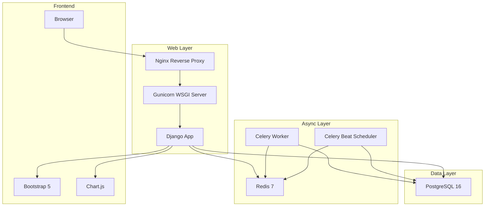
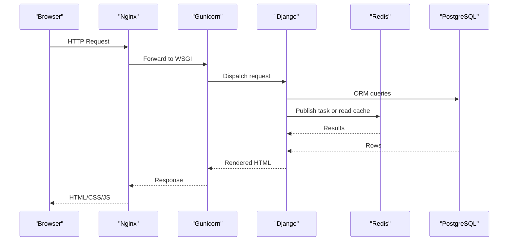
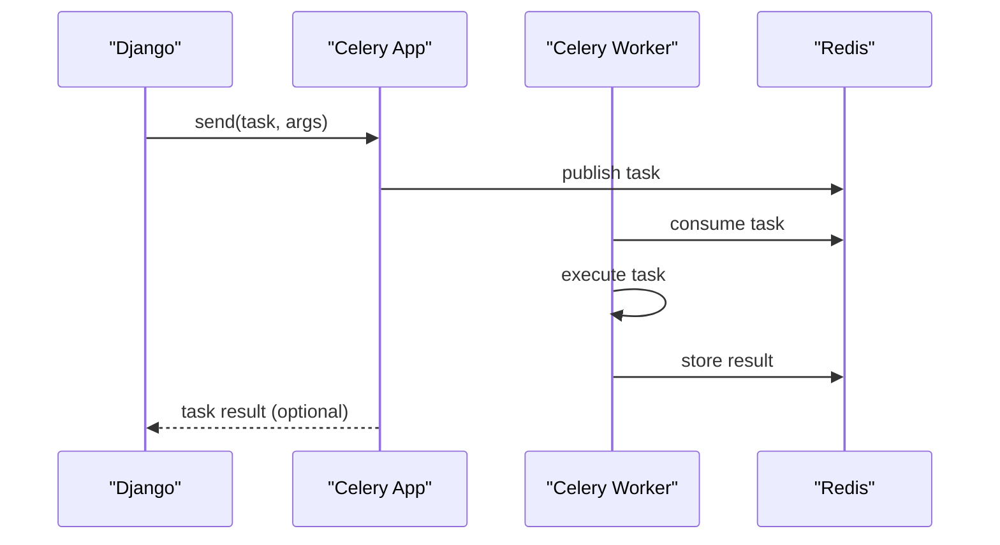
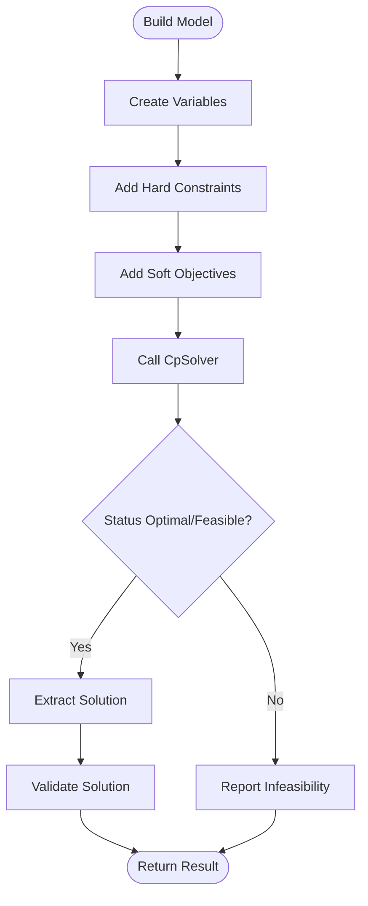
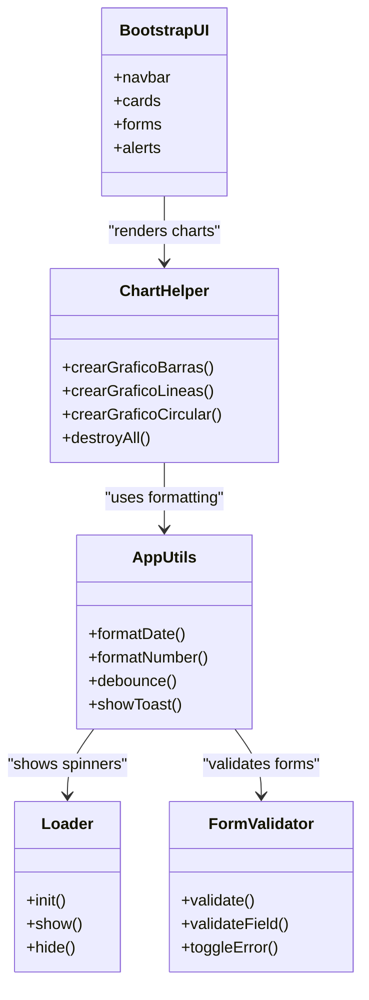
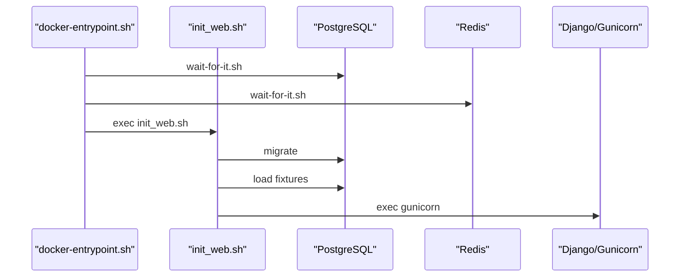
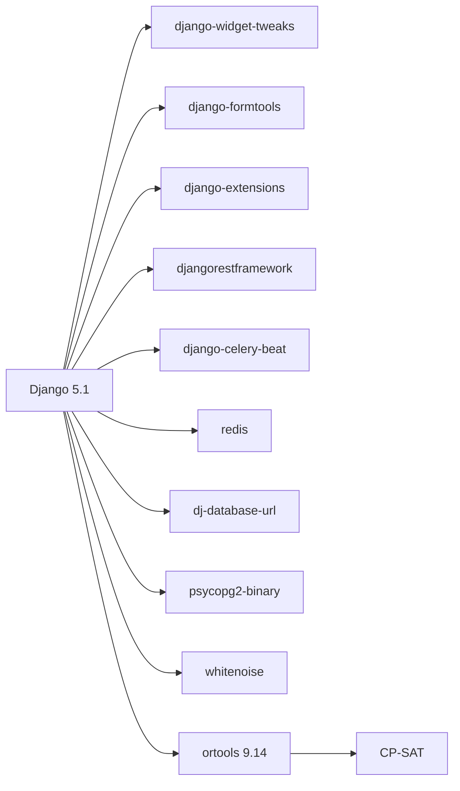

# Technology Stack and Dependencies

<cite>
**Referenced Files in This Document**
- [settings.py](file://proyecto_turnos/settings.py)
- [celery.py](file://proyecto_turnos/celery.py)
- [wsgi.py](file://proyecto_turnos/wsgi.py)
- [asgi.py](file://proyecto_turnos/asgi.py)
- [requirements.txt](file://requirements.txt)
- [Dockerfile](file://Dockerfile)
- [docker-compose.yml](file://docker-compose.yml)
- [docker-compose.dev.yml](file://docker-compose.dev.yml)
- [docker-entrypoint.sh](file://docker-entrypoint.sh)
- [init_web.sh](file://init_web.sh)
- [main.js](file://static/js/main.js)
- [charts.js](file://static/js/charts.js)
- [base.html](file://turnos/templates/base.html)
- [generador-corregido.py](file://generador-corregido.py)
- [reparador.py](file://turnos/motor/reparador.py)
- [resolvedor.py](file://turnos/resolvedor.py)
</cite>

## Table of Contents
1. [Introduction](#introduction)
2. [Project Structure](#project-structure)
3. [Core Technologies](#core-technologies)
4. [Architecture Overview](#architecture-overview)
5. [Detailed Component Analysis](#detailed-component-analysis)
6. [Dependency Analysis](#dependency-analysis)
7. [Performance Considerations](#performance-considerations)
8. [Troubleshooting Guide](#troubleshooting-guide)
9. [Conclusion](#conclusion)

## Introduction
This document describes the complete technology stack and dependencies powering the nursing shift scheduling system. It covers backend frameworks and libraries, asynchronous processing, databases, frontend assets, containerization, environment management, and operational characteristics. It also explains integration patterns, version compatibility, upgrade paths, and performance/scalability implications.

## Project Structure
The system is organized around a Django 5 application with integrated Celery/Redis for async tasks, PostgreSQL for persistence, and a modern frontend built with Bootstrap 5 and Chart.js. Container orchestration is handled via Docker and docker-compose, supporting both development and production environments.

**Diagram sources**
- [docker-compose.yml:44-151](file://docker-compose.yml#L44-L151)
- [Dockerfile:82-86](file://Dockerfile#L82-L86)
- [wsgi.py:14-27](file://proyecto_turnos/wsgi.py#L14-L27)
- [settings.py:134-160](file://proyecto_turnos/settings.py#L134-L160)

**Section sources**
- [docker-compose.yml:1-168](file://docker-compose.yml#L1-L168)
- [Dockerfile:1-87](file://Dockerfile#L1-L87)

## Core Technologies
This section documents each core technology, rationale, version compatibility, and integration patterns.

- Django 5.1
  - Rationale: Full-stack web framework providing ORM, admin, authentication, templating, and deployment hooks. Used here for rapid development and robustness.
  - Version compatibility: The requirements constrain Django to >=5.1,<5.2.
  - Integration patterns:
    - Settings define middleware, apps, static/media, and storage backends.
    - WSGI and ASGI applications expose the Django app for production and optional WebSocket routing.
    - Environment variables drive configuration (database, debug, allowed hosts, email, maintenance mode).
  - Practical examples:
    - Static files served via WhiteNoise in production.
    - Celery configured through Django settings with JSON serialization and timezone-aware tasks.

- Python 3.11+
  - Rationale: Modern language with excellent performance, typing support, and ecosystem maturity.
  - Version compatibility: The Dockerfile uses python:3.11-slim-bookworm.
  - Integration patterns:
    - Pip installs pinned dependencies from requirements.txt.
    - Gunicorn runs the Django WSGI application with tuned workers and threads.

- Google OR-Tools 9.14
  - Rationale: Constraint Programming SAT solver for efficient shift scheduling optimization.
  - Version compatibility: The requirements pin ortools==9.14.x.
  - Integration patterns:
    - CP-SAT model construction and solving in dedicated modules.
    - Solver parameters tuned for time limits and parallel search workers.
  - Practical examples:
    - Generators and repair routines construct models and extract solutions.

- Celery 5.5 + Redis 7
  - Rationale: Distributed task queue for background jobs and scheduled tasks.
  - Version compatibility: Celery==5.5.3; Redis==5.0.1; Redis image 7-alpine in compose.
  - Integration patterns:
    - Celery app configured from Django settings with JSON serializer and UTC timezone.
    - Workers and beat scheduler run as separate containers/services.
  - Practical examples:
    - Task timeouts, soft limits, and extended result backend enabled.

- PostgreSQL 16
  - Rationale: Production-grade relational database with strong ACID guarantees and advanced features.
  - Version compatibility: Image postgres:16-alpine; dj-database-url parsing for DATABASE_URL.
  - Integration patterns:
    - SQLite fallback for development; production uses DATABASE_URL.
    - Health checks and persistent volumes for reliability.

- Frontend Stack
  - Bootstrap 5: UI framework loaded via CDN in templates.
  - Chart.js: Charts library initialized and configured in JavaScript helpers.
  - JavaScript libraries: Bootstrap JS bundle, plus custom modules for UI behaviors and chart rendering.

**Section sources**
- [requirements.txt](file://requirements.txt#L17)
- [requirements.txt](file://requirements.txt#L37)
- [Dockerfile:2-2](file://Dockerfile#L2-L2)
- [Dockerfile:51-53](file://Dockerfile#L51-L53)
- [settings.py:134-160](file://proyecto_turnos/settings.py#L134-L160)
- [docker-compose.yml:6-6](file://docker-compose.yml#L6-L6)
- [docker-compose.yml:27-28](file://docker-compose.yml#L27-L28)
- [base.html:11-15](file://turnos/templates/base.html#L11-L15)
- [base.html:367-368](file://turnos/templates/base.html#L367-L368)
- [charts.js:1-275](file://static/js/charts.js#L1-L275)
- [main.js:533-577](file://static/js/main.js#L533-L577)

## Architecture Overview
The system follows a layered architecture:
- Presentation: Django templates and static assets (Bootstrap 5, Chart.js).
- Application: Django views, forms, and business logic; Celery tasks for heavy computation.
- Data: PostgreSQL for persistent data; Redis for caching and task queues.
- Infrastructure: Dockerized services orchestrated by docker-compose; Nginx proxy and Gunicorn for production.

**Diagram sources**
- [docker-compose.yml:129-151](file://docker-compose.yml#L129-L151)
- [Dockerfile:82-86](file://Dockerfile#L82-L86)
- [wsgi.py:14-27](file://proyecto_turnos/wsgi.py#L14-L27)
- [settings.py:62-76](file://proyecto_turnos/settings.py#L62-L76)
- [settings.py:134-160](file://proyecto_turnos/settings.py#L134-L160)

## Detailed Component Analysis

### Backend Framework: Django 5.1
- Configuration highlights:
  - Middleware stack includes WhiteNoise for static files.
  - Templates configured with context processors and app directories.
  - Password validators and internationalization settings.
  - Storage backends for default and staticfiles.
  - Environment-driven database selection (SQLite dev, DATABASE_URL prod).
- Integration with deployment:
  - WSGI application exported for Gunicorn.
  - ASGI application ready for potential WebSocket routing.

**Section sources**
- [settings.py:14-58](file://proyecto_turnos/settings.py#L14-L58)
- [settings.py:78-110](file://proyecto_turnos/settings.py#L78-L110)
- [settings.py:62-76](file://proyecto_turnos/settings.py#L62-L76)
- [wsgi.py:14-27](file://proyecto_turnos/wsgi.py#L14-L27)
- [asgi.py:14-43](file://proyecto_turnos/asgi.py#L14-L43)

### Asynchronous Processing: Celery 5.5 + Redis 7
- Configuration highlights:
  - Broker and result backend URLs from environment.
  - JSON serialization and UTC timezone.
  - Task limits, extended results, retries, and worker events.
- Orchestration:
  - Separate services for worker and beat scheduler.
  - Health checks and dependency ordering ensure startup stability.

**Diagram sources**
- [settings.py:134-160](file://proyecto_turnos/settings.py#L134-L160)
- [celery.py:5-10](file://proyecto_turnos/celery.py#L5-L10)
- [docker-compose.yml:81-127](file://docker-compose.yml#L81-L127)

**Section sources**
- [settings.py:134-160](file://proyecto_turnos/settings.py#L134-L160)
- [celery.py:1-14](file://proyecto_turnos/celery.py#L1-L14)
- [docker-compose.yml:81-127](file://docker-compose.yml#L81-L127)

### Database: PostgreSQL 16
- Configuration highlights:
  - Production via DATABASE_URL parsed by dj-database-url.
  - SQLite fallback for development with explicit timeout.
  - Health checks and persistent volumes in compose.
- Operational notes:
  - Use init script volume for schema/data initialization.
  - Environment variables for credentials and database name.

**Section sources**
- [settings.py:62-76](file://proyecto_turnos/settings.py#L62-L76)
- [docker-compose.yml:4-24](file://docker-compose.yml#L4-L24)

### Constraint Satisfaction: Google OR-Tools 9.14
- Implementation patterns:
  - CP-SAT model creation and solving in generator and repair modules.
  - Tunable solver parameters (time limit, search workers).
  - Validation pipeline to ensure solution feasibility.
- Complexity and performance:
  - CP-SAT is well-suited for combinatorial optimization problems typical in scheduling.
  - Parameter tuning impacts solution quality and latency.

**Diagram sources**
- [generador-corregido.py:340-349](file://generador-corregido.py#L340-L349)
- [reparador.py:67-95](file://turnos/motor/reparador.py#L67-L95)
- [resolvedor.py:85-112](file://turnos/resolvedor.py#L85-L112)

**Section sources**
- [requirements.txt](file://requirements.txt#L37)
- [generador-corregido.py:340-349](file://generador-corregido.py#L340-L349)
- [reparador.py:67-95](file://turnos/motor/reparador.py#L67-L95)
- [resolvedor.py:85-112](file://turnos/resolvedor.py#L85-L112)

### Frontend: Bootstrap 5, Chart.js, and JavaScript Libraries
- Bootstrap 5:
  - Loaded via CDN in base templates.
  - Used for layout, navigation, cards, forms, and alerts.
- Chart.js:
  - Helper module encapsulates chart creation and theming.
  - Provides reusable chart types for scheduling analytics.
- JavaScript:
  - Global main.js module initializes loaders, forms, tooltips, and live search.
  - Utilities for date formatting, number formatting, and notifications.

**Diagram sources**
- [base.html:11-15](file://turnos/templates/base.html#L11-L15)
- [base.html:367-368](file://turnos/templates/base.html#L367-L368)
- [charts.js:8-267](file://static/js/charts.js#L8-L267)
- [main.js:21-176](file://static/js/main.js#L21-L176)
- [main.js:181-214](file://static/js/main.js#L181-L214)
- [main.js:219-314](file://static/js/main.js#L219-L314)

**Section sources**
- [base.html:11-15](file://turnos/templates/base.html#L11-L15)
- [base.html:367-368](file://turnos/templates/base.html#L367-L368)
- [charts.js:1-275](file://static/js/charts.js#L1-L275)
- [main.js:533-577](file://static/js/main.js#L533-L577)

### Containerization: Docker and docker-compose
- Base image and runtime:
  - Python 3.11 slim image with system dependencies for PostgreSQL client, Cairo/Pango for PDF generation, and OR-Tools.
  - Non-root user and health checks.
- Services:
  - web: Django + Gunicorn, with init script applying migrations and collecting static.
  - celery_worker and celery_beat: separate containers for async processing.
  - redis: caching and broker.
  - db: PostgreSQL 16 with init SQL.
  - nginx: reverse proxy and static file serving.
- Entrypoints and initialization:
  - docker-entrypoint.sh waits for db and redis readiness.
  - init_web.sh runs migrations, collects static, seeds admin user, loads fixtures, then starts Gunicorn.

**Diagram sources**
- [docker-entrypoint.sh:4-11](file://docker-entrypoint.sh#L4-L11)
- [init_web.sh:4-25](file://init_web.sh#L4-L25)
- [Dockerfile:78-86](file://Dockerfile#L78-L86)
- [docker-compose.yml:44-79](file://docker-compose.yml#L44-L79)

**Section sources**
- [Dockerfile:1-87](file://Dockerfile#L1-L87)
- [docker-compose.yml:1-168](file://docker-compose.yml#L1-L168)
- [docker-compose.dev.yml:1-68](file://docker-compose.dev.yml#L1-L68)
- [docker-entrypoint.sh:1-15](file://docker-entrypoint.sh#L1-L15)
- [init_web.sh:1-26](file://init_web.sh#L1-L26)

## Dependency Analysis
- Backend dependencies:
  - Django 5.1.x with extensions for forms, widgets, and REST APIs.
  - Celery 5.5.x with django-celery-beat for scheduling.
  - Redis client for result backend and broker.
  - PostgreSQL adapter and dj-database-url for connection management.
  - WhiteNoise for static file serving.
- Frontend dependencies:
  - Bootstrap 5 via CDN.
  - Chart.js via CDN.
  - Custom JavaScript modules for UI behaviors and chart rendering.
- OR-Tools:
  - CP-SAT solver for optimization tasks.

**Diagram sources**
- [requirements.txt](file://requirements.txt#L17)
- [requirements.txt:6-8](file://requirements.txt#L6-L8)
- [requirements.txt](file://requirements.txt#L54)
- [requirements.txt](file://requirements.txt#L23)
- [requirements.txt](file://requirements.txt#L24)
- [requirements.txt](file://requirements.txt#L66)
- [requirements.txt](file://requirements.txt#L37)

**Section sources**
- [requirements.txt:1-67](file://requirements.txt#L1-L67)

## Performance Considerations
- Django
  - Use WhiteNoise in production for static delivery; keep DEBUG off.
  - Tune middleware order and enable caching where appropriate.
- Celery
  - Adjust concurrency and time limits per workload.
  - Monitor result backend retries and extended metadata.
- PostgreSQL
  - Use connection pooling and proper indexing for high-write workloads.
  - Consider read replicas for reporting-heavy dashboards.
- OR-Tools
  - Tune solver parameters (time limits, search workers) for balancing speed and solution quality.
  - Preprocess constraints to reduce search space.
- Frontend
  - Minimize DOM updates; leverage debounced input handlers.
  - Lazy-load heavy chart components when possible.

[No sources needed since this section provides general guidance]

## Troubleshooting Guide
- Startup failures
  - Verify database and Redis readiness using health checks and wait-for-it scripts.
  - Confirm environment variables for DATABASE_URL, REDIS_URL, and Celery settings.
- Static files not served
  - Ensure collectstatic runs during initialization and WhiteNoise is active in production.
- Celery tasks not executing
  - Check broker connectivity, serializer settings, and timezone configuration.
  - Inspect worker logs and task event tracking.
- OR-Tools solver issues
  - Review solver status codes and adjust time limits or constraints.
  - Validate input data and model construction.

**Section sources**
- [docker-entrypoint.sh:4-11](file://docker-entrypoint.sh#L4-L11)
- [init_web.sh:4-8](file://init_web.sh#L4-L8)
- [settings.py:134-160](file://proyecto_turnos/settings.py#L134-L160)
- [docker-compose.yml:74-79](file://docker-compose.yml#L74-L79)

## Conclusion
The system leverages a mature, scalable stack: Django 5.1 for the web framework, Celery/Redis for asynchronous processing, PostgreSQL 16 for persistence, and a modern frontend with Bootstrap 5 and Chart.js. Containerization with Docker and docker-compose ensures reproducible deployments across environments. The integration of Google OR-Tools enables efficient scheduling optimization. Proper configuration of environment variables, health checks, and task parameters is essential for reliable operation and performance.