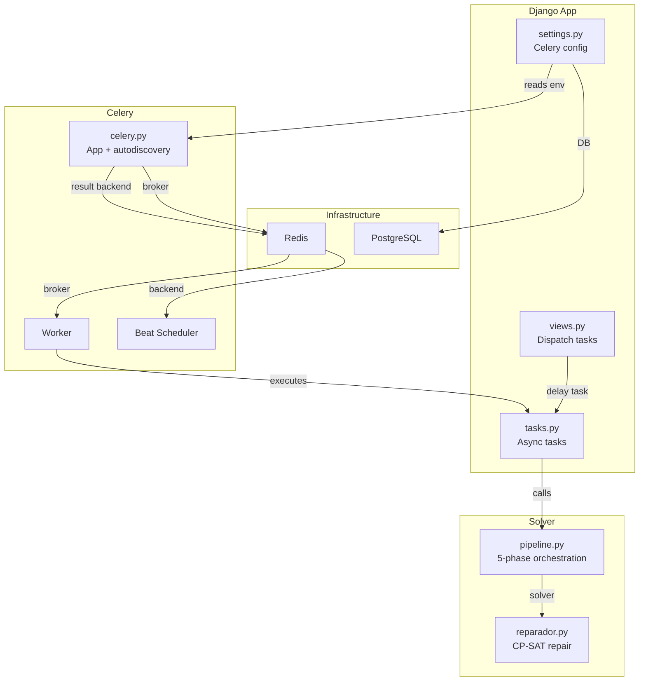
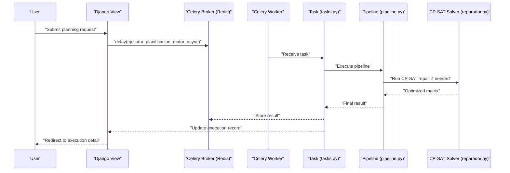
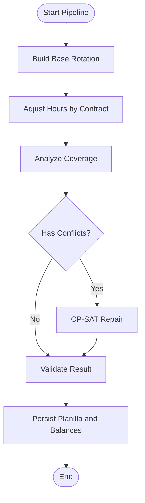
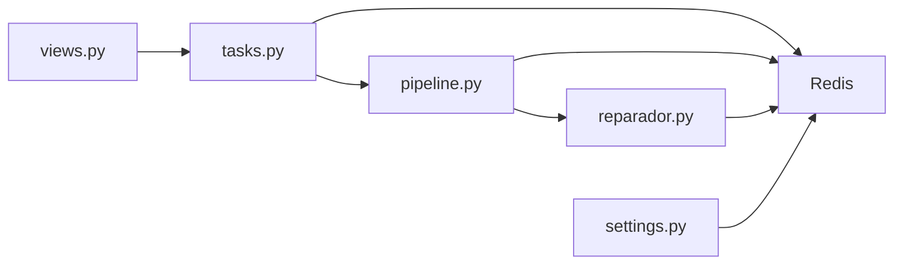

# Asynchronous Processing

<cite>
**Referenced Files in This Document**
- [celery.py](file://proyecto_turnos/celery.py)
- [settings.py](file://proyecto_turnos/settings.py)
- [tasks.py](file://turnos/tasks.py)
- [pipeline.py](file://turnos/motor/pipeline.py)
- [reparador.py](file://turnos/motor/reparador.py)
- [resolvedor.py](file://turnos/resolvedor.py)
- [views.py](file://turnos/views.py)
- [ajax-helpers.js](file://static/js/ajax-helpers.js)
- [docker-compose.yml](file://docker-compose.yml)
- [docker-entrypoint.sh](file://docker-entrypoint.sh)
- [start.sh](file://start.sh)
- [restart_celery.sh](file://restart_celery.sh)
- [email.py](file://turnos/utils/email.py)
</cite>

## Table of Contents
1. [Introduction](#introduction)
2. [Project Structure](#project-structure)
3. [Core Components](#core-components)
4. [Architecture Overview](#architecture-overview)
5. [Detailed Component Analysis](#detailed-component-analysis)
6. [Dependency Analysis](#dependency-analysis)
7. [Performance Considerations](#performance-considerations)
8. [Troubleshooting Guide](#troubleshooting-guide)
9. [Conclusion](#conclusion)
10. [Appendices](#appendices)

## Introduction
This document explains the asynchronous task processing system built with Celery and Redis for the turn scheduling application. It covers task queue configuration, background job execution, progress tracking, integration with the CP-SAT solver for long-running planning operations, monitoring, and result delivery. It also documents serialization, error handling, retry mechanisms, Redis and broker setup, scaling considerations, and practical examples for large-scale planning, bulk operations, and scheduled reporting.

## Project Structure
The asynchronous system spans Django settings, Celery app initialization, task definitions, the CP-SAT pipeline, and frontend polling for progress updates. The infrastructure is containerized with Docker Compose, using Redis as both broker and result backend.

**Diagram sources**
- [celery.py:1-14](file://proyecto_turnos/celery.py#L1-L14)
- [settings.py:134-159](file://proyecto_turnos/settings.py#L134-L159)
- [tasks.py:17-240](file://turnos/tasks.py#L17-L240)
- [pipeline.py:92-245](file://turnos/motor/pipeline.py#L92-L245)
- [reparador.py:63-96](file://turnos/motor/reparador.py#L63-L96)
- [docker-compose.yml:26-42](file://docker-compose.yml#L26-L42)

**Section sources**
- [celery.py:1-14](file://proyecto_turnos/celery.py#L1-L14)
- [settings.py:134-159](file://proyecto_turnos/settings.py#L134-L159)
- [docker-compose.yml:26-42](file://docker-compose.yml#L26-L42)

## Core Components
- Celery app initialization and autodiscovery
- Task definitions for planning execution and reporting
- CP-SAT pipeline orchestrating five phases and solver-based repairs
- Frontend polling for execution status
- Redis as broker and result backend
- Scheduled tasks via Celery Beat

Key implementation references:
- Celery app and autodiscovery: [celery.py:1-14](file://proyecto_turnos/celery.py#L1-L14)
- Celery settings and serialization: [settings.py:134-159](file://proyecto_turnos/settings.py#L134-L159)
- Planning tasks (old and new motor): [tasks.py:17-240](file://turnos/tasks.py#L17-L240), [tasks.py:333-696](file://turnos/tasks.py#L333-L696)
- Pipeline orchestration: [pipeline.py:92-245](file://turnos/motor/pipeline.py#L92-L245)
- CP-SAT repair: [reparador.py:63-96](file://turnos/motor/reparador.py#L63-L96)
- Execution dispatch from views: [views.py:722-791](file://turnos/views.py#L722-L791)
- Progress polling helpers: [ajax-helpers.js:204-250](file://static/js/ajax-helpers.js#L204-L250)

**Section sources**
- [celery.py:1-14](file://proyecto_turnos/celery.py#L1-L14)
- [settings.py:134-159](file://proyecto_turnos/settings.py#L134-L159)
- [tasks.py:17-240](file://turnos/tasks.py#L17-L240)
- [tasks.py:333-696](file://turnos/tasks.py#L333-L696)
- [pipeline.py:92-245](file://turnos/motor/pipeline.py#L92-L245)
- [reparador.py:63-96](file://turnos/motor/reparador.py#L63-L96)
- [views.py:722-791](file://turnos/views.py#L722-L791)
- [ajax-helpers.js:204-250](file://static/js/ajax-helpers.js#L204-L250)

## Architecture Overview
The system uses Redis as both message broker and result backend. Tasks are dispatched from Django views, executed asynchronously by Celery workers, and progress is tracked via database records. The new planning motor integrates a CP-SAT solver to repair conflicts and optimize assignments while preserving base rotation patterns.

**Diagram sources**
- [views.py:722-791](file://turnos/views.py#L722-L791)
- [tasks.py:333-696](file://turnos/tasks.py#L333-L696)
- [pipeline.py:92-245](file://turnos/motor/pipeline.py#L92-L245)
- [reparador.py:63-96](file://turnos/motor/reparador.py#L63-L96)

## Detailed Component Analysis

### Celery App Initialization and Settings
- The Celery app loads Django settings and enables autodiscovery of tasks.
- Redis is configured as both broker and result backend via environment variables.
- Serialization is set to JSON; time limits and event tracking are enabled.

Implementation references:
- App creation and autodiscovery: [celery.py:1-14](file://proyecto_turnos/celery.py#L1-L14)
- Broker/result backend and serialization: [settings.py:134-159](file://proyecto_turnos/settings.py#L134-L159)

**Section sources**
- [celery.py:1-14](file://proyecto_turnos/celery.py#L1-L14)
- [settings.py:134-159](file://proyecto_turnos/settings.py#L134-L159)

### Task Queue Configuration and Broker Setup
- Broker and result backend URLs are read from environment variables.
- Redis is used in production via Docker Compose with password protection.
- Local startup scripts dynamically configure Celery environment and launch workers and beat.

References:
- Environment-driven broker/result backend: [settings.py:134-136](file://proyecto_turnos/settings.py#L134-L136)
- Redis service definition and credentials: [docker-compose.yml:26-42](file://docker-compose.yml#L26-L42)
- Startup script setting Redis-based Celery env and launching workers/beat: [start.sh:147-182](file://start.sh#L147-L182)
- Entrypoint waiting for Redis and DB readiness: [docker-entrypoint.sh:1-14](file://docker-entrypoint.sh#L1-L14)

**Section sources**
- [settings.py:134-159](file://proyecto_turnos/settings.py#L134-L159)
- [docker-compose.yml:26-42](file://docker-compose.yml#L26-L42)
- [start.sh:147-182](file://start.sh#L147-L182)
- [docker-entrypoint.sh:1-14](file://docker-entrypoint.sh#L1-L14)

### Background Job Execution: Planning Tasks
Two primary tasks coordinate planning execution:
- Old generator task: [tasks.py:17-240](file://turnos/tasks.py#L17-L240)
- New motor task: [tasks.py:333-696](file://turnos/tasks.py#L333-L696)

Both tasks:
- Validate configuration ID and fetch configuration
- Create or update an execution record with state transitions
- Execute the planner and persist results
- Handle errors with retries and state updates

Key flows:
- Execution record creation and state transitions: [tasks.py:70-85](file://turnos/tasks.py#L70-L85)
- Result processing and planilla creation: [tasks.py:106-173](file://turnos/tasks.py#L106-L173)
- Error handling and retry logic: [tasks.py:204-239](file://turnos/tasks.py#L204-L239)

**Section sources**
- [tasks.py:17-240](file://turnos/tasks.py#L17-L240)
- [tasks.py:333-696](file://turnos/tasks.py#L333-L696)

### CP-SAT Integration and Repair Workflow
The new planning motor orchestrates five phases and optionally repairs conflicts using CP-SAT:
- Pipeline orchestration: [pipeline.py:92-245](file://turnos/motor/pipeline.py#L92-L245)
- Conflict detection and optional repair: [pipeline.py:170-200](file://turnos/motor/pipeline.py#L170-L200)
- CP-SAT repair implementation: [reparador.py:63-96](file://turnos/motor/reparador.py#L63-L96)
- Objective and constraints applied in solver: [reparador.py:297-579](file://turnos/motor/reparador.py#L297-L579)

**Diagram sources**
- [pipeline.py:92-245](file://turnos/motor/pipeline.py#L92-L245)
- [reparador.py:63-96](file://turnos/motor/reparador.py#L63-L96)

**Section sources**
- [pipeline.py:92-245](file://turnos/motor/pipeline.py#L92-L245)
- [reparador.py:63-96](file://turnos/motor/reparador.py#L63-L96)

### Progress Tracking and Monitoring
- Execution state is stored in the database and updated by tasks.
- Frontend polls execution status via AJAX and stops when completion or error is reached.
- Email notifications are sent upon completion or failure.

References:
- Execution state updates in tasks: [tasks.py:106-125](file://turnos/tasks.py#L106-L125)
- Frontend polling helpers: [ajax-helpers.js:204-250](file://static/js/ajax-helpers.js#L204-L250)
- Email notification on completion: [email.py:265-295](file://turnos/utils/email.py#L265-L295)

**Section sources**
- [tasks.py:106-125](file://turnos/tasks.py#L106-L125)
- [ajax-helpers.js:204-250](file://static/js/ajax-helpers.js#L204-L250)
- [email.py:265-295](file://turnos/utils/email.py#L265-L295)

### Task Serialization, Error Handling, and Retry Mechanisms
- Serialization: JSON for both tasks and results.
- Time limits: soft and hard time limits configured.
- Event tracking: worker sends task events and sent events.
- Retry policy: tasks define max retries and default delay.
- Error handling: tasks catch exceptions, mark execution as error, and optionally retry.

References:
- Serialization and time limits: [settings.py:138-150](file://proyecto_turnos/settings.py#L138-L150)
- Worker events: [settings.py:157-159](file://proyecto_turnos/settings.py#L157-L159)
- Retry configuration and handling: [tasks.py:17-17](file://turnos/tasks.py#L17-L17), [tasks.py:229-239](file://turnos/tasks.py#L229-L239)

**Section sources**
- [settings.py:138-159](file://proyecto_turnos/settings.py#L138-L159)
- [tasks.py:17-17](file://turnos/tasks.py#L17-L17)
- [tasks.py:229-239](file://turnos/tasks.py#L229-L239)

### Examples of Asynchronous Operations
- Large-scale planning execution:
  - Dispatch from view: [views.py:754-757](file://turnos/views.py#L754-L757)
  - Execute new motor pipeline: [tasks.py:333-696](file://turnos/tasks.py#L333-L696)
- Bulk data processing:
  - Cleaning old executions: [tasks.py:242-268](file://turnos/tasks.py#L242-L268)
- Scheduled reporting:
  - Monthly statistics generation: [tasks.py:271-314](file://turnos/tasks.py#L271-L314)
  - Celery Beat scheduler: [docker-compose.yml:105-127](file://docker-compose.yml#L105-L127)

**Section sources**
- [views.py:754-757](file://turnos/views.py#L754-L757)
- [tasks.py:242-314](file://turnos/tasks.py#L242-L314)
- [docker-compose.yml:105-127](file://docker-compose.yml#L105-L127)

## Dependency Analysis
The system exhibits clear separation of concerns:
- Django views dispatch tasks to Celery
- Celery workers execute tasks and interact with the database
- Redis mediates messaging and result storage
- The CP-SAT solver runs within the pipeline to resolve conflicts

**Diagram sources**
- [views.py:722-791](file://turnos/views.py#L722-L791)
- [tasks.py:333-696](file://turnos/tasks.py#L333-L696)
- [pipeline.py:92-245](file://turnos/motor/pipeline.py#L92-L245)
- [reparador.py:63-96](file://turnos/motor/reparador.py#L63-L96)
- [settings.py:134-159](file://proyecto_turnos/settings.py#L134-L159)

**Section sources**
- [views.py:722-791](file://turnos/views.py#L722-L791)
- [tasks.py:333-696](file://turnos/tasks.py#L333-L696)
- [pipeline.py:92-245](file://turnos/motor/pipeline.py#L92-L245)
- [reparador.py:63-96](file://turnos/motor/reparador.py#L63-L96)
- [settings.py:134-159](file://proyecto_turnos/settings.py#L134-L159)

## Performance Considerations
- Time limits: Soft and hard time limits prevent runaway tasks.
- Serialization: JSON serialization is explicit and compatible with Redis.
- Worker concurrency: Controlled via startup scripts and Docker Compose.
- CP-SAT tuning: Solver parameters include time limit and number of search workers.
- Database contention: Tasks wrap critical sections in atomic transactions.

Recommendations:
- Adjust worker concurrency based on CPU and memory availability.
- Monitor Redis memory usage and tune persistence.
- Consider result backend caching for frequently accessed results.
- Scale horizontally by adding worker containers.

**Section sources**
- [settings.py:148-150](file://proyecto_turnos/settings.py#L148-L150)
- [settings.py:157-159](file://proyecto_turnos/settings.py#L157-L159)
- [reparador.py:75-77](file://turnos/motor/reparador.py#L75-L77)

## Troubleshooting Guide
Common issues and remedies:
- Redis connectivity:
  - Verify Redis service is healthy and credentials match environment variables.
  - References: [docker-compose.yml:26-42](file://docker-compose.yml#L26-L42), [docker-entrypoint.sh:1-14](file://docker-entrypoint.sh#L1-L14)
- Celery worker/beat startup:
  - Check logs for PID verification and startup errors.
  - References: [start.sh:158-182](file://start.sh#L158-L182), [restart_celery.sh:32-43](file://restart_celery.sh#L32-L43)
- Task timeouts:
  - Increase time limits if planning windows are large.
  - References: [settings.py:148-150](file://proyecto_turnos/settings.py#L148-L150)
- Task failures:
  - Inspect task logs and execution record messages.
  - References: [tasks.py:204-239](file://turnos/tasks.py#L204-L239)
- Progress polling:
  - Ensure AJAX polling endpoint is reachable and returns expected JSON.
  - References: [ajax-helpers.js:204-250](file://static/js/ajax-helpers.js#L204-L250)

**Section sources**
- [docker-compose.yml:26-42](file://docker-compose.yml#L26-L42)
- [docker-entrypoint.sh:1-14](file://docker-entrypoint.sh#L1-L14)
- [start.sh:158-182](file://start.sh#L158-L182)
- [restart_celery.sh:32-43](file://restart_celery.sh#L32-L43)
- [settings.py:148-150](file://proyecto_turnos/settings.py#L148-L150)
- [tasks.py:204-239](file://turnos/tasks.py#L204-L239)
- [ajax-helpers.js:204-250](file://static/js/ajax-helpers.js#L204-L250)

## Conclusion
The asynchronous processing system leverages Celery and Redis to handle long-running planning tasks reliably. The new motor integrates CP-SAT to repair conflicts and optimize schedules while maintaining robust progress tracking, error handling, and notifications. With proper Redis configuration, time limits, and horizontal scaling, the system supports large-scale planning, bulk operations, and scheduled reporting.

## Appendices

### Scaling Considerations
- Add worker replicas in Docker Compose or deploy separate worker nodes.
- Use multiple Redis shards or dedicated Redis instances for high throughput.
- Monitor task queues and adjust concurrency per workload.

**Section sources**
- [docker-compose.yml:81-103](file://docker-compose.yml#L81-L103)
- [settings.py:148-150](file://proyecto_turnos/settings.py#L148-L150)