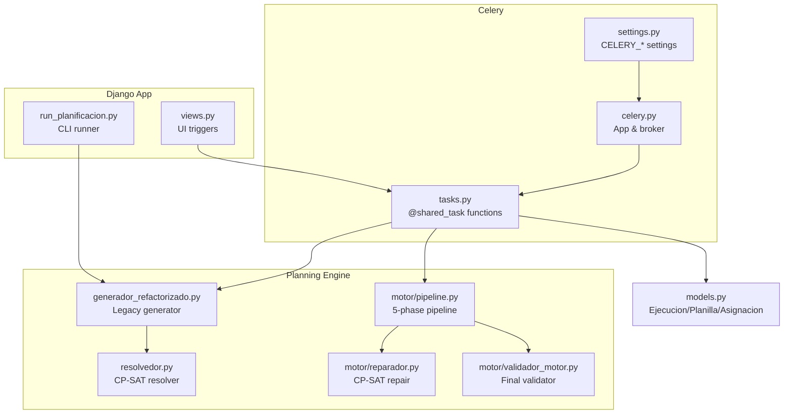
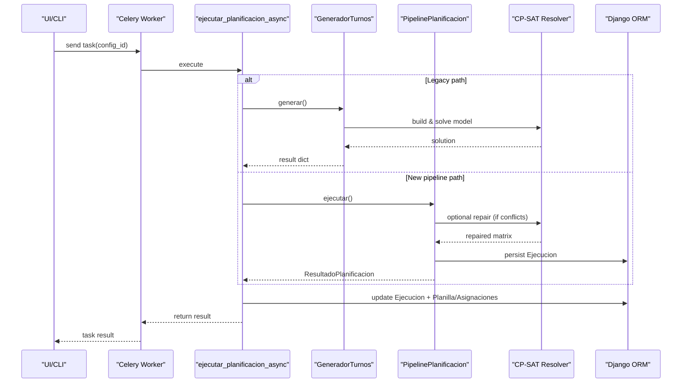
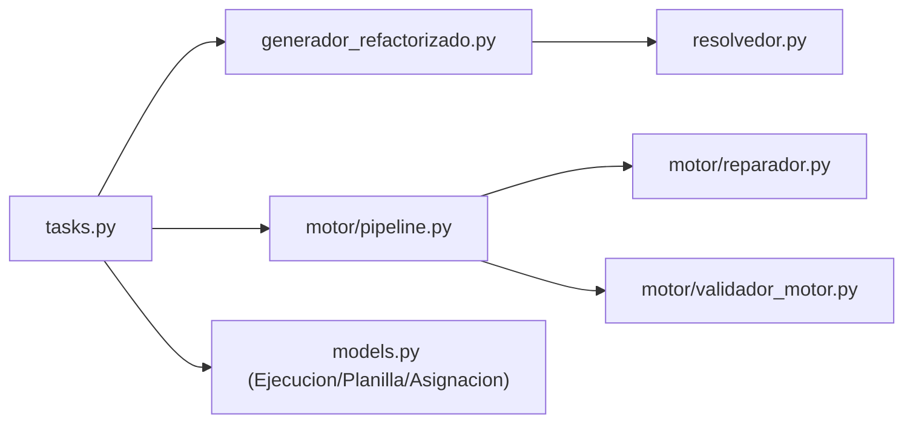

# Background Tasks

<cite>
**Referenced Files in This Document**
- [tasks.py](file://turnos/tasks.py)
- [celery.py](file://proyecto_turnos/celery.py)
- [settings.py](file://proyecto_turnos/settings.py)
- [resolvedor.py](file://turnos/resolvedor.py)
- [generador_refactorizado.py](file://turnos/generador_refactorizado.py)
- [pipeline.py](file://turnos/motor/pipeline.py)
- [reparador.py](file://turnos/motor/reparador.py)
- [validador_motor.py](file://turnos/motor/validador_motor.py)
- [models.py](file://turnos/models.py)
- [run_planificacion.py](file://turnos/management/commands/run_planificacion.py)
</cite>

## Table of Contents
1. [Introduction](#introduction)
2. [Project Structure](#project-structure)
3. [Core Components](#core-components)
4. [Architecture Overview](#architecture-overview)
5. [Detailed Component Analysis](#detailed-component-analysis)
6. [Dependency Analysis](#dependency-analysis)
7. [Performance Considerations](#performance-considerations)
8. [Troubleshooting Guide](#troubleshooting-guide)
9. [Conclusion](#conclusion)

## Introduction
This document explains the background task execution system for the planning system, focusing on how long-running planning operations are scheduled, executed, and monitored asynchronously. It covers the integration with the CP-SAT solver, the new planning pipeline, and the robust task lifecycle including retries, timeouts, and result persistence. It also documents serialization, progress tracking, status monitoring, and operational controls such as prioritization and queue management.

## Project Structure
The background task system centers around Celery, with Django integration and a dedicated tasks module orchestrating planning runs. The CP-SAT solver is integrated via two pathways:
- Legacy generator path: builds and solves a CP-SAT model directly.
- New pipeline path: orchestrates deterministic base rotation, contract hour adjustments, coverage analysis, optional CP-SAT repair, and final validation.

**Diagram sources**
- [tasks.py:17-240](file://turnos/tasks.py#L17-L240)
- [celery.py:1-14](file://proyecto_turnos/celery.py#L1-L14)
- [settings.py:134-160](file://proyecto_turnos/settings.py#L134-L160)
- [generador_refactorizado.py:17-140](file://turnos/generador_refactorizado.py#L17-L140)
- [resolvedor.py:11-113](file://turnos/resolvedor.py#L11-L113)
- [pipeline.py:31-267](file://turnos/motor/pipeline.py#L31-L267)
- [reparador.py:24-609](file://turnos/motor/reparador.py#L24-L609)
- [validador_motor.py:23-451](file://turnos/motor/validador_motor.py#L23-L451)
- [models.py:482-532](file://turnos/models.py#L482-L532)

**Section sources**
- [tasks.py:17-240](file://turnos/tasks.py#L17-L240)
- [celery.py:1-14](file://proyecto_turnos/celery.py#L1-L14)
- [settings.py:134-160](file://proyecto_turnos/settings.py#L134-L160)
- [models.py:482-532](file://turnos/models.py#L482-L532)

## Core Components
- Celery app and configuration: Broker and result backend are configured via environment variables, with JSON serialization and UTC timezone settings.
- Task orchestration: Two primary tasks:
  - Legacy: executes a single-run generator and persists results.
  - New pipeline: runs a five-phase pipeline, optionally repairs conflicts with CP-SAT, and validates outcomes.
- CP-SAT integration:
  - Legacy: solver parameters are read from configuration (workers, timeout, seed).
  - New pipeline: optional repair phase uses CP-SAT with tailored constraints and weighted objectives.
- Persistence: Each planning run creates an Ejecucion record with state, timing, and result metadata; successful runs create Planilla and AsignacionTurno entries.

Key behaviors:
- Retry policy: automatic retries with bounded attempts and delays.
- Timeouts: per-task hard and soft limits; solver-specific limits embedded in the pipeline.
- Serialization: JSON serialization for Celery tasks and results.
- Monitoring: task events, result backend extended metadata, and database-backed execution records.

**Section sources**
- [tasks.py:17-240](file://turnos/tasks.py#L17-L240)
- [resolvedor.py:21-51](file://turnos/resolvedor.py#L21-L51)
- [pipeline.py:92-245](file://turnos/motor/pipeline.py#L92-L245)
- [reparador.py:75-96](file://turnos/motor/reparador.py#L75-L96)
- [settings.py:134-160](file://proyecto_turnos/settings.py#L134-L160)
- [models.py:482-532](file://turnos/models.py#L482-L532)

## Architecture Overview
The system separates concerns across layers:
- Presentation and CLI trigger planning runs.
- Celery schedules tasks against a message broker and executes workers.
- Tasks coordinate domain logic: either a legacy generator or the new pipeline.
- The pipeline composes specialized modules: rotation builder, hour adjuster, coverage analyzer, CP-SAT repair, and final validator.
- Results are persisted to the database and surfaced via task results and UI.

**Diagram sources**
- [tasks.py:17-240](file://turnos/tasks.py#L17-L240)
- [generador_refactorizado.py:105-139](file://turnos/generador_refactorizado.py#L105-L139)
- [pipeline.py:92-245](file://turnos/motor/pipeline.py#L92-L245)
- [reparador.py:63-96](file://turnos/motor/reparador.py#L63-L96)
- [models.py:482-532](file://turnos/models.py#L482-L532)

## Detailed Component Analysis

### Celery Configuration and Task Execution
- Broker and result backend are configured via environment variables and loaded into Django settings.
- JSON serialization ensures compatibility across systems and reproducibility.
- Time limits and worker event tracking enable monitoring and graceful degradation.
- The Celery app is initialized with Django’s settings and autodiscovers tasks.

Operational implications:
- Choose a persistent broker/backend (Redis recommended) for production reliability.
- Tune worker concurrency and pool settings to match CPU-bound CP-SAT workloads.
- Monitor task events and result metadata for progress tracking.

**Section sources**
- [settings.py:134-160](file://proyecto_turnos/settings.py#L134-L160)
- [celery.py:1-14](file://proyecto_turnos/celery.py#L1-L14)

### Legacy Task: ejecutar_planificacion_async
Purpose:
- Orchestrates a single-run planning execution using the legacy generator.
- Creates or updates an Ejecucion record, runs the generator, persists results, and constructs Planilla/Asignaciones on success.

Key steps:
- Parameter normalization and validation.
- Transactional creation/update of Ejecucion with state transitions.
- Execution of GeneradorTurnos and extraction of results.
- Transactional persistence of Ejecucion fields (including penalties and validation reports).
- Conditional creation of Planilla and AsignacionTurno entries.
- Structured return payload with execution summary.

Retry and error handling:
- Automatic retries up to a configured limit with exponential backoff semantics.
- On final failure, marks Ejecucion as ERROR and returns structured error info.

Timeouts:
- Task-level soft and hard time limits enforced by Celery.
- Solver-level timeout controlled by configuration fields.

**Section sources**
- [tasks.py:17-240](file://turnos/tasks.py#L17-L240)
- [generador_refactorizado.py:105-139](file://turnos/generador_refactorizado.py#L105-L139)
- [resolvedor.py:21-51](file://turnos/resolvedor.py#L21-L51)
- [models.py:482-532](file://turnos/models.py#L482-L532)
- [settings.py:147-151](file://proyecto_turnos/settings.py#L147-L151)

### New Pipeline Task: ejecutar_planificacion_motor_async
Purpose:
- Executes the five-phase pipeline for advanced planning, including coverage analysis and optional CP-SAT repair.
- Persists Ejecucion state and, on success, creates Planilla and Asignaciones.

Key steps:
- Validates configuration and period bounds.
- Prepares domain DTOs: dates, selected nurses, selected shifts, rotations, and historical balances.
- Builds constraints from configuration (hard and soft).
- Runs PipelinePlanificacion, which:
  - Constructs a deterministic base rotation.
  - Adjusts hours according to contracts.
  - Analyzes coverage and deviations.
  - Optionally repairs conflicts with CP-SAT.
  - Validates final result and computes balances.
- Persists Ejecucion and Planilla/Asignaciones on success, updating historical balances.

CP-SAT integration:
- Repair phase uses CP-SAT with explicit constraints and a weighted objective favoring adherence to base rotation while balancing hours and equity.
- Solver parameters include worker count and a short timeout to keep interactive responsiveness.

**Section sources**
- [tasks.py:333-697](file://turnos/tasks.py#L333-L697)
- [pipeline.py:92-245](file://turnos/motor/pipeline.py#L92-L245)
- [reparador.py:75-96](file://turnos/motor/reparador.py#L75-L96)
- [validador_motor.py:48-86](file://turnos/motor/validador_motor.py#L48-L86)
- [models.py:482-532](file://turnos/models.py#L482-L532)

### CP-SAT Resolver (Legacy)
Responsibilities:
- Applies solver parameters from configuration (workers, max time, seed).
- Extracts assignments and validates the solution via a dedicated validator.
- Produces a structured result including feasibility, objective value, and validation report.

**Section sources**
- [resolvedor.py:21-113](file://turnos/resolvedor.py#L21-L113)
- [generador_refactorizado.py:105-139](file://turnos/generador_refactorizado.py#L105-L139)

### Pipeline Orchestration
Responsibilities:
- Defines the five-phase process: base rotation → hour adjustment → coverage analysis → optional CP-SAT repair → final validation.
- Normalizes configuration-derived constraints and feeds them into specialized modules.
- Tracks solver status and counts modified cells during repair.

**Section sources**
- [pipeline.py:31-267](file://turnos/motor/pipeline.py#L31-L267)

### CP-SAT Repair Module
Responsibilities:
- Transforms conflict-prone matrices into CP-SAT models with explicit constraints and objectives.
- Uses a sentinel “LIBRE” option to preserve or revert free days.
- Applies weighted penalties to minimize deviation from base rotation, balance hours, and equitably distribute nights and weekends.
- Stores solver status and returns the repaired matrix or the original if infeasible.

**Section sources**
- [reparador.py:24-609](file://turnos/motor/reparador.py#L24-L609)

### Final Validator
Responsibilities:
- Ensures no hard constraint violations remain after repair.
- Computes quality metrics and warnings for equity.
- Aggregates final balances per nurse, incorporating historical accumulations.

**Section sources**
- [validador_motor.py:23-451](file://turnos/motor/validador_motor.py#L23-L451)

### Task Serialization, Progress Tracking, and Status Monitoring
- Serialization: Celery uses JSON serialization for tasks and results, ensuring portability and readability.
- Progress tracking: While there is no explicit periodic heartbeat, the Ejecucion model stores timestamps and duration, enabling approximate progress estimation. The task logs provide granular checkpoints.
- Status monitoring: Ejecucion.state transitions (PENDING → PROCESSING → COMPLETADA/INVIABLE/ERROR) reflect execution health. Task-level events and result backend metadata can be used for dashboards.

**Section sources**
- [settings.py:138-141](file://proyecto_turnos/settings.py#L138-L141)
- [models.py:482-532](file://turnos/models.py#L482-L532)
- [tasks.py:17-240](file://turnos/tasks.py#L17-L240)

### Examples of Task Execution Patterns
- Triggering a legacy run:
  - Send task with a configuration ID; the task fetches the configuration, starts Ejecucion, runs the generator, and persists results.
- Triggering the new pipeline:
  - Send task with a configuration ID; the task prepares DTOs, runs the pipeline, optionally repairs with CP-SAT, and persists results.
- CLI execution:
  - A management command demonstrates invoking the generator directly from the command line for testing and debugging.

**Section sources**
- [tasks.py:17-240](file://turnos/tasks.py#L17-L240)
- [tasks.py:333-697](file://turnos/tasks.py#L333-L697)
- [run_planificacion.py:13-40](file://turnos/management/commands/run_planificacion.py#L13-L40)

### Parameter Passing and Result Retrieval
- Parameters:
  - Configuration ID passed as an integer or dictionary (normalized).
  - For the new pipeline, additional DTOs are constructed from configuration: dates, selected nurses, selected shifts, rotations, and historical balances.
- Results:
  - Tasks return structured dictionaries containing success flags, execution IDs, planilla IDs, optimization status, counts, and validation summaries.
  - Ejecucion.resultado stores the full result payload for later inspection.

**Section sources**
- [tasks.py:17-240](file://turnos/tasks.py#L17-L240)
- [tasks.py:333-697](file://turnos/tasks.py#L333-L697)
- [models.py:509-512](file://turnos/models.py#L509-L512)

### Error Handling, Retry Mechanisms, and Timeouts
- Retries:
  - Tasks are decorated with max retries and default retry delay; failures are retried until exhausted.
- Final failure:
  - On exhaustion, the task sets Ejecucion.state to ERROR and returns an error payload.
- Timeouts:
  - Celery enforces task-level hard and soft time limits.
  - CP-SAT solver parameters enforce internal timeouts and worker counts.

**Section sources**
- [tasks.py:17-240](file://turnos/tasks.py#L17-L240)
- [settings.py:147-151](file://proyecto_turnos/settings.py#L147-L151)
- [resolvedor.py:25-32](file://turnos/resolvedor.py#L25-L32)
- [reparador.py:75-78](file://turnos/motor/reparador.py#L75-L78)

### Task Prioritization, Queue Management, and Resource Allocation
- Prioritization:
  - Use Celery queues and routing rules to separate high-priority vs. batch runs.
  - Assign dedicated queues per workload type (e.g., “repair” vs. “coverage”).
- Queue management:
  - Configure multiple worker instances per queue to scale throughput.
  - Use prefetch limits to avoid overloading workers.
- Resource allocation:
  - Tune solver worker counts and timeouts to balance accuracy and latency.
  - Ensure sufficient memory for large planning windows.

[No sources needed since this section provides general guidance]

## Dependency Analysis
The task layer depends on the domain engine and persistence layer. The pipeline composes multiple modules, each encapsulating a specific phase. CP-SAT is used both directly (legacy) and indirectly (pipeline repair).

**Diagram sources**
- [tasks.py:17-240](file://turnos/tasks.py#L17-L240)
- [generador_refactorizado.py:17-140](file://turnos/generador_refactorizado.py#L17-L140)
- [resolvedor.py:11-113](file://turnos/resolvedor.py#L11-L113)
- [pipeline.py:31-267](file://turnos/motor/pipeline.py#L31-L267)
- [reparador.py:24-609](file://turnos/motor/reparador.py#L24-L609)
- [validador_motor.py:23-451](file://turnos/motor/validador_motor.py#L23-L451)
- [models.py:482-532](file://turnos/models.py#L482-L532)

**Section sources**
- [tasks.py:17-240](file://turnos/tasks.py#L17-L240)
- [generador_refactorizado.py:17-140](file://turnos/generador_refactorizado.py#L17-L140)
- [pipeline.py:31-267](file://turnos/motor/pipeline.py#L31-L267)
- [reparador.py:24-609](file://turnos/motor/reparador.py#L24-L609)
- [validador_motor.py:23-451](file://turnos/motor/validador_motor.py#L23-L451)
- [models.py:482-532](file://turnos/models.py#L482-L532)

## Performance Considerations
- Solver tuning:
  - Adjust num_search_workers and max_time_in_seconds to trade off solution quality and speed.
  - Use seeds for reproducible runs when needed.
- Pipeline phases:
  - Base rotation and hour adjustments reduce the search space for CP-SAT repair.
  - Coverage analysis helps detect conflicts early, reducing unnecessary solver calls.
- Memory and CPU:
  - Larger planning windows increase variable counts; provision adequate resources.
  - Use queues and workers to parallelize independent runs.

[No sources needed since this section provides general guidance]

## Troubleshooting Guide
Common issues and resolutions:
- Invalid configuration ID:
  - Normalize incoming IDs and log conversion attempts; return structured errors when IDs are invalid.
- Missing selected resources:
  - Ensure configurations include selected nurses and shifts; otherwise, abort early with clear messages.
- Infeasible solutions:
  - Legacy resolver returns INFEASIBLE with validation reports; review constraints and demands.
  - Pipeline repair may fail if conflicts are severe; relax constraints or reduce window size.
- Long execution times:
  - Verify Celery time limits and solver timeouts; consider scaling workers and adjusting solver parameters.
- Persistence errors:
  - Transactions wrap critical writes; check database connectivity and permissions.

**Section sources**
- [tasks.py:17-240](file://turnos/tasks.py#L17-L240)
- [tasks.py:333-697](file://turnos/tasks.py#L333-L697)
- [resolvedor.py:40-48](file://turnos/resolvedor.py#L40-L48)
- [settings.py:147-151](file://proyecto_turnos/settings.py#L147-L151)

## Conclusion
The background task system integrates Celery with a robust planning engine featuring dual execution paths: a legacy CP-SAT-driven generator and a modern five-phase pipeline with optional CP-SAT repair. The design emphasizes reliability through transactions, retries, and structured persistence, while offering tunable performance via solver parameters and queue management. Together, these mechanisms support scalable, observable, and maintainable long-running planning operations.