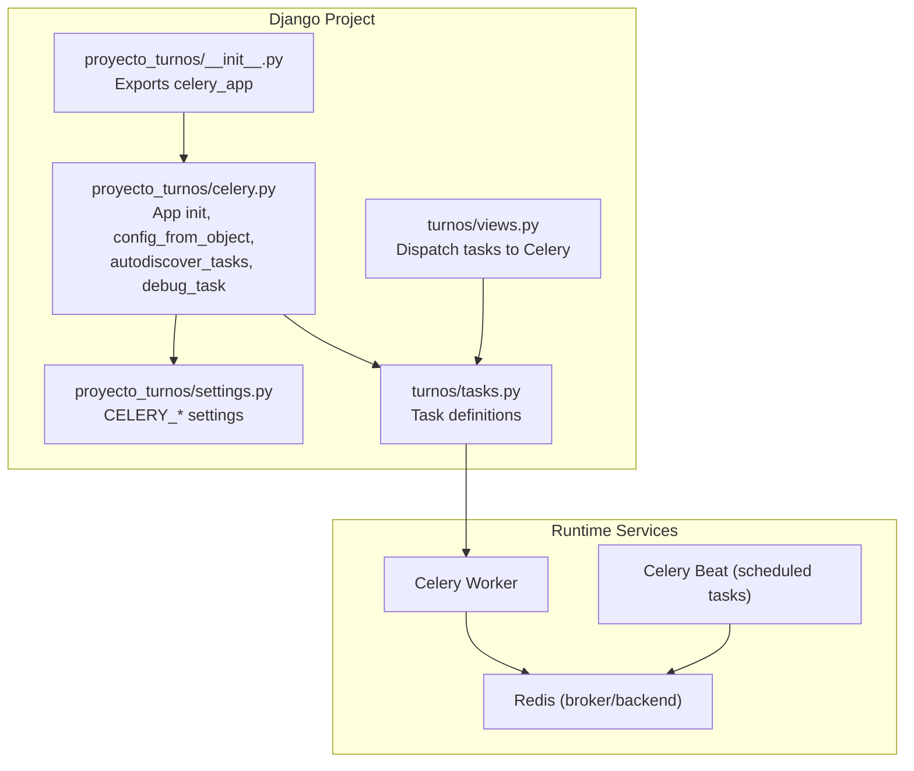
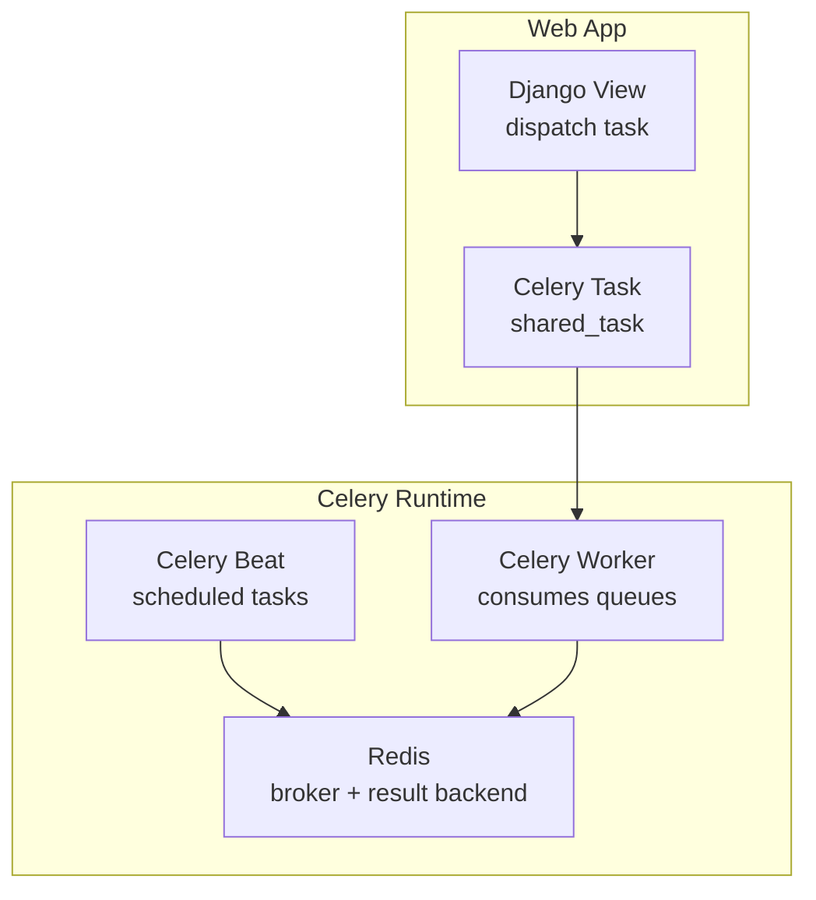
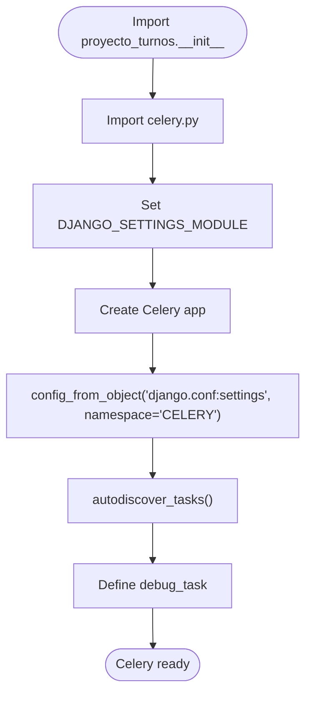
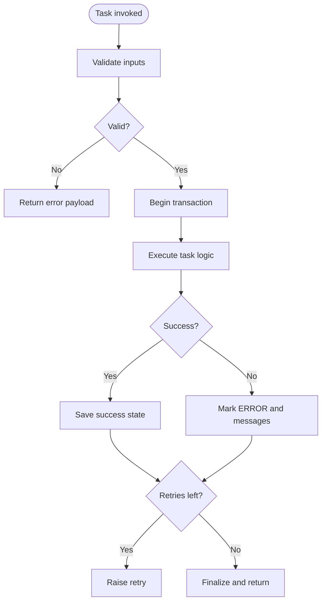
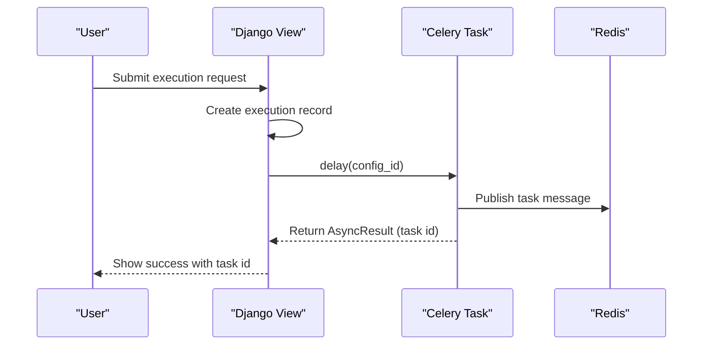
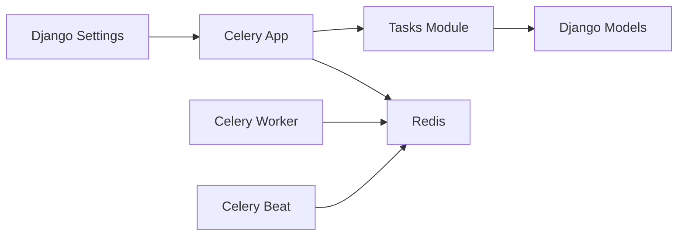

# Celery Configuration

<cite>
**Referenced Files in This Document**
- [celery.py](file://proyecto_turnos/celery.py)
- [settings.py](file://proyecto_turnos/settings.py)
- [__init__.py](file://proyecto_turnos/__init__.py)
- [tasks.py](file://turnos/tasks.py)
- [views.py](file://turnos/views.py)
- [docker-compose.yml](file://docker-compose.yml)
- [restart_celery.sh](file://restart_celery.sh)
- [start.sh](file://start.sh)
- [stop.sh](file://stop.sh)
- [Dockerfile](file://Dockerfile)
- [requirements.txt](file://requirements.txt)
</cite>

## Table of Contents
1. [Introduction](#introduction)
2. [Project Structure](#project-structure)
3. [Core Components](#core-components)
4. [Architecture Overview](#architecture-overview)
5. [Detailed Component Analysis](#detailed-component-analysis)
6. [Dependency Analysis](#dependency-analysis)
7. [Performance Considerations](#performance-considerations)
8. [Troubleshooting Guide](#troubleshooting-guide)
9. [Conclusion](#conclusion)
10. [Appendices](#appendices)

## Introduction
This document explains how Celery is configured and integrated into the Django application. It covers Celery app initialization, Django integration, task autodiscovery, broker configuration for Redis, serialization settings, task routing and queue configuration, worker pool settings, and the debug task. It also provides configuration best practices for development and production, along with common issues and performance tuning recommendations.

## Project Structure
Celery is integrated at the project level via a dedicated module that initializes the Celery app and wires it to Django settings. Tasks are defined in the turnos app and discovered automatically. The Docker Compose setup runs Redis as the broker and Celery worker/beat as separate services.

**Diagram sources**
- [celery.py:1-14](file://proyecto_turnos/celery.py#L1-L14)
- [settings.py:134-159](file://proyecto_turnos/settings.py#L134-L159)
- [tasks.py:1-716](file://turnos/tasks.py#L1-L716)
- [views.py:677-780](file://turnos/views.py#L677-L780)
- [docker-compose.yml:26-127](file://docker-compose.yml#L26-L127)

**Section sources**
- [celery.py:1-14](file://proyecto_turnos/celery.py#L1-L14)
- [settings.py:134-159](file://proyecto_turnos/settings.py#L134-L159)
- [docker-compose.yml:26-127](file://docker-compose.yml#L26-L127)

## Core Components
- Celery app initialization and autodiscovery:
  - The Celery app is created and configured to load settings from Django using a namespace. Autodiscovery scans installed Django apps for tasks.
  - A debug task is defined for development diagnostics.
- Django settings integration:
  - Broker and result backend URLs are set via environment variables with sensible defaults.
  - Serialization, timezone, task limits, result backend retry policy, and worker event settings are configured.
- Task definitions:
  - Tasks are defined using the shared task decorator and include retry logic, database transactions, and structured logging.
- Dispatch from views:
  - Views dispatch tasks asynchronously and handle errors gracefully.

**Section sources**
- [celery.py:5-14](file://proyecto_turnos/celery.py#L5-L14)
- [settings.py:134-159](file://proyecto_turnos/settings.py#L134-L159)
- [tasks.py:17-240](file://turnos/tasks.py#L17-L240)
- [views.py:677-780](file://turnos/views.py#L677-L780)

## Architecture Overview
The Celery architecture integrates with Django’s settings and uses Redis for message passing and result storage. In production, Celery worker and beat run as separate containers. In development, Celery is started locally with configurable concurrency.

**Diagram sources**
- [views.py:754-762](file://turnos/views.py#L754-L762)
- [tasks.py:17-240](file://turnos/tasks.py#L17-L240)
- [docker-compose.yml:81-127](file://docker-compose.yml#L81-L127)

## Detailed Component Analysis

### Celery App Initialization and Autodiscovery
- The Celery app is created with the project label and configured to load settings from Django using the CELERY namespace.
- Autodiscovery scans installed apps for task modules.
- A debug task is defined for development diagnostics.

**Diagram sources**
- [celery.py:5-14](file://proyecto_turnos/celery.py#L5-L14)
- [__init__.py:1-4](file://proyecto_turnos/__init__.py#L1-L4)

**Section sources**
- [celery.py:5-14](file://proyecto_turnos/celery.py#L5-L14)
- [__init__.py:1-4](file://proyecto_turnos/__init__.py#L1-L4)

### Django Settings Integration and Configuration Parameters
Key Celery configuration parameters defined in Django settings:
- Broker and result backend URLs (with defaults pointing to Redis).
- Serialization: accept content, task serializer, and result serializer set to JSON.
- Timezone and UTC settings aligned with Django.
- Task tracking, time limits, and soft time limits.
- Result backend extended metadata, retry policy, and worker/task event settings.

These settings are loaded automatically by Celery because the app is configured with the Django settings object and the CELERY namespace.

**Section sources**
- [settings.py:134-159](file://proyecto_turnos/settings.py#L134-L159)

### Task Definitions and Retry Behavior
- Tasks use the shared task decorator and bind to self for retries and metadata.
- Database operations are wrapped in atomic transactions.
- Structured logging and retry logic with max retries and default delay.
- Some tasks include specialized logic for planning and statistics generation.

**Diagram sources**
- [tasks.py:17-240](file://turnos/tasks.py#L17-L240)

**Section sources**
- [tasks.py:17-240](file://turnos/tasks.py#L17-L240)

### Task Dispatch from Django Views
- Views create execution records and dispatch Celery tasks with delay.
- Errors during dispatch are caught, execution state is updated, and user feedback is provided.

**Diagram sources**
- [views.py:744-780](file://turnos/views.py#L744-L780)
- [tasks.py:17-240](file://turnos/tasks.py#L17-L240)

**Section sources**
- [views.py:744-780](file://turnos/views.py#L744-L780)

### Broker Settings for Redis
- Production: Redis is configured as both broker and result backend via environment variables in Docker Compose.
- Development: The start script sets broker and result backend to Redis on localhost with a development port fallback to memory if Redis is unavailable.
- Restart script demonstrates autoscaling and concurrency tuning for development.

**Section sources**
- [docker-compose.yml:64-66](file://docker-compose.yml#L64-L66)
- [start.sh:147-156](file://start.sh#L147-L156)
- [restart_celery.sh:22-22](file://restart_celery.sh#L22-L22)

### Task Routing, Queue Configuration, and Worker Pool Settings
- The project does not define explicit queues or routing rules in the provided configuration.
- Worker concurrency and autoscaling are controlled via command-line arguments in Docker Compose and the restart script.
- In Docker Compose, the worker is started with a fixed concurrency value; the restart script uses autoscaling.

**Section sources**
- [docker-compose.yml:88-88](file://docker-compose.yml#L88-L88)
- [restart_celery.sh:22-22](file://restart_celery.sh#L22-L22)

### Debug Task Functionality
- A debug task is defined to print the Celery request context. This is useful for verifying that the worker is consuming tasks and for basic connectivity checks.

**Section sources**
- [celery.py:12-14](file://proyecto_turnos/celery.py#L12-L14)

### Configuration Best Practices for Development and Production
- Development:
  - Use Redis for both broker and result backend; if Redis is unavailable, fall back to in-memory (not recommended for production).
  - Start Celery worker and beat in the background with appropriate logging.
  - Use autoscaling for dynamic concurrency in development.
- Production:
  - Use Redis as broker and result backend with credentials and TLS in secure environments.
  - Run Celery worker and beat as separate containers.
  - Configure health checks and resource limits.
  - Align timezone and UTC settings with Django.

**Section sources**
- [start.sh:147-182](file://start.sh#L147-L182)
- [restart_celery.sh:22-22](file://restart_celery.sh#L22-L22)
- [docker-compose.yml:26-127](file://docker-compose.yml#L26-L127)

## Dependency Analysis
- Celery depends on Django settings being available and properly configured.
- Tasks depend on Django models and database transactions.
- Runtime services (Redis, worker, beat) are orchestrated via Docker Compose.

**Diagram sources**
- [settings.py:134-159](file://proyecto_turnos/settings.py#L134-L159)
- [celery.py:8-10](file://proyecto_turnos/celery.py#L8-L10)
- [tasks.py:17-240](file://turnos/tasks.py#L17-L240)
- [docker-compose.yml:26-127](file://docker-compose.yml#L26-L127)

**Section sources**
- [settings.py:134-159](file://proyecto_turnos/settings.py#L134-L159)
- [celery.py:8-10](file://proyecto_turnos/celery.py#L8-L10)
- [docker-compose.yml:26-127](file://docker-compose.yml#L26-L127)

## Performance Considerations
- Serialization: Using JSON ensures compatibility and simplicity; avoid pickle for security and performance reasons.
- Timezone and UTC: Align Celery timezone with Django to prevent unexpected scheduling behavior.
- Time limits: Configure hard and soft time limits to detect slow tasks and fail fast.
- Result backend: Enable extended results and configure retries to improve resilience.
- Worker concurrency: Use autoscaling in development and fixed concurrency in production; tune based on CPU and I/O characteristics.
- Redis: Use a dedicated Redis instance with persistence and monitoring; consider sharding for high throughput.

[No sources needed since this section provides general guidance]

## Troubleshooting Guide
Common issues and resolutions:
- Broker connection failures:
  - Verify broker URL and credentials; ensure Redis is reachable from the worker container or host.
  - Confirm environment variables match the runtime context (Docker vs. local).
- Task not found or not discovered:
  - Ensure tasks are defined in apps included in INSTALLED_APPS and that autodiscovery is enabled.
  - Confirm the Celery app is imported early (via Django app initialization).
- Serialization errors:
  - Ensure task arguments are JSON serializable; avoid complex objects.
- Timezone mismatch:
  - Align CELERY_TIMEZONE with Django TIME_ZONE and ensure UTC is enabled/disabled consistently.
- Worker not consuming tasks:
  - Check that the worker is started with the correct application module and that queues are not misconfigured.
- Memory backend in development:
  - Prefer Redis for reliable task and result persistence; memory backend loses state after restart.

**Section sources**
- [settings.py:134-159](file://proyecto_turnos/settings.py#L134-L159)
- [celery.py:8-10](file://proyecto_turnos/celery.py#L8-L10)
- [docker-compose.yml:64-66](file://docker-compose.yml#L64-L66)
- [start.sh:147-156](file://start.sh#L147-L156)

## Conclusion
The project integrates Celery with Django using a straightforward configuration that loads settings from Django and enables automatic task discovery. Redis serves as the broker and result backend in both development and production. Tasks are defined with robust retry logic and transactional safety. For production, run Celery worker and beat as separate services behind Redis, and tune concurrency and time limits according to workload characteristics.

[No sources needed since this section summarizes without analyzing specific files]

## Appendices

### Appendix A: Environment Variables and Defaults
- Broker and result backend defaults point to Redis on localhost; overridden by environment variables in Docker Compose and scripts.
- Serialization set to JSON; timezone and UTC aligned with Django.

**Section sources**
- [settings.py:134-159](file://proyecto_turnos/settings.py#L134-L159)
- [docker-compose.yml:64-66](file://docker-compose.yml#L64-L66)
- [start.sh:147-156](file://start.sh#L147-L156)

### Appendix B: Docker and Startup Scripts
- Docker Compose defines Redis, Celery worker, and Celery beat services with environment variables for broker and result backend.
- Start script configures development Redis and launches Celery worker and beat.
- Restart script demonstrates autoscaling and concurrency tuning.

**Section sources**
- [docker-compose.yml:26-127](file://docker-compose.yml#L26-L127)
- [start.sh:147-182](file://start.sh#L147-L182)
- [restart_celery.sh:22-22](file://restart_celery.sh#L22-L22)

### Appendix C: Requirements and Entrypoint
- Celery and Redis client are included in requirements.
- Dockerfile sets up the environment and runs Gunicorn by default; Celery is launched via Compose or scripts.

**Section sources**
- [requirements.txt:6-6](file://requirements.txt#L6-L6)
- [requirements.txt:54-54](file://requirements.txt#L54-L54)
- [Dockerfile:83-87](file://Dockerfile#L83-L87)