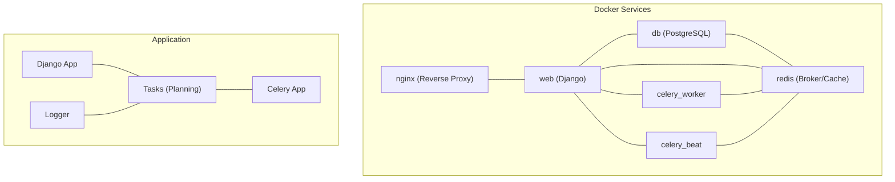
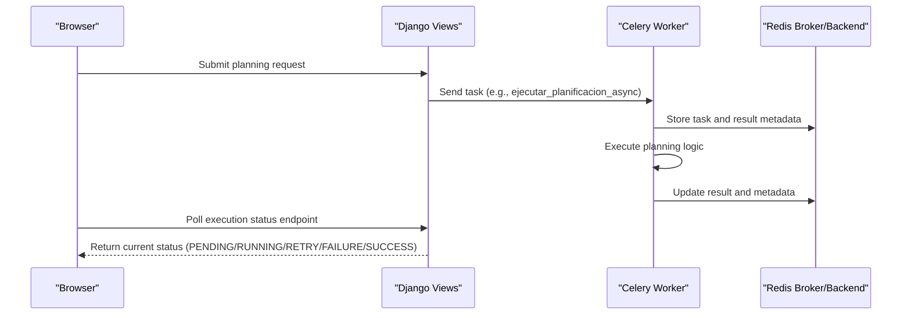
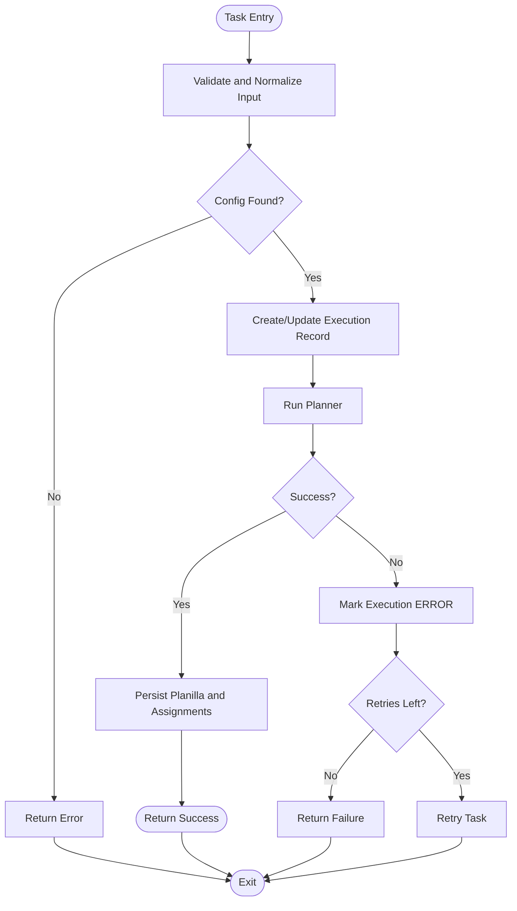
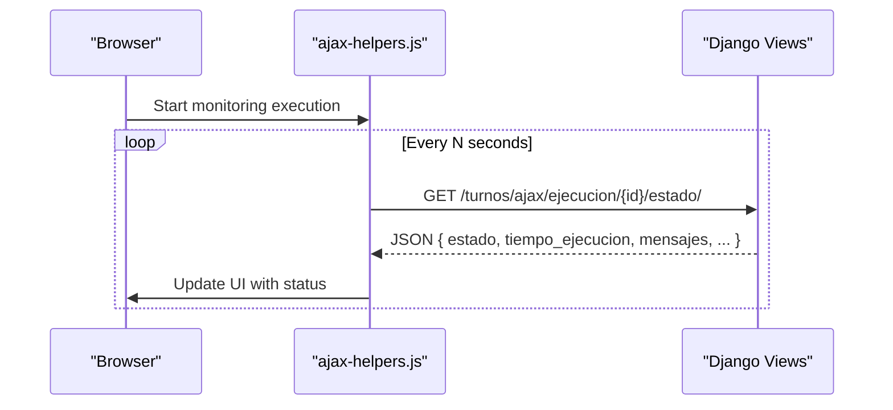
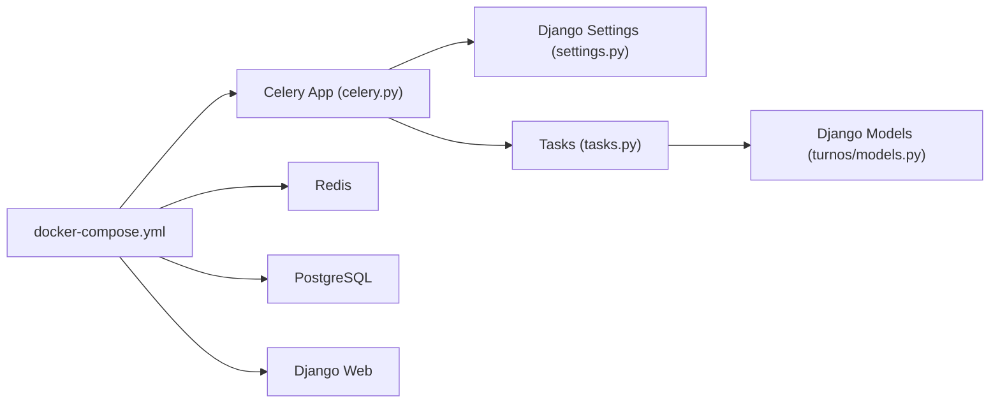

# Task Monitoring and Management

<cite>
**Referenced Files in This Document**
- [celery.py](file://proyecto_turnos/celery.py)
- [tasks.py](file://turnos/tasks.py)
- [settings.py](file://proyecto_turnos/settings.py)
- [asgi.py](file://proyecto_turnos/asgi.py)
- [restart_celery.sh](file://restart_celery.sh)
- [start.sh](file://start.sh)
- [stop.sh](file://stop.sh)
- [docker-compose.yml](file://docker-compose.yml)
- [docker-compose.dev.yml](file://docker-compose.dev.yml)
- [logger_config.py](file://turnos/logger_config.py)
- [ajax-helpers.js](file://turnos/static/js/ajax-helpers.js)
- [views.py](file://turnos/views.py)
</cite>

## Table of Contents
1. [Introduction](#introduction)
2. [Project Structure](#project-structure)
3. [Core Components](#core-components)
4. [Architecture Overview](#architecture-overview)
5. [Detailed Component Analysis](#detailed-component-analysis)
6. [Dependency Analysis](#dependency-analysis)
7. [Performance Considerations](#performance-considerations)
8. [Troubleshooting Guide](#troubleshooting-guide)
9. [Conclusion](#conclusion)
10. [Appendices](#appendices)

## Introduction
This document describes the task monitoring, management, and maintenance procedures for the turn scheduling system. It covers the Celery worker lifecycle, process supervision, health checks, monitoring and alerting integration points, metrics collection, real-time status updates via ASGI, log management, debugging techniques, and performance monitoring strategies. Procedures for restarting workers, scaling operations, and troubleshooting common issues are included.

## Project Structure
The system integrates Django with Celery for asynchronous task execution and optionally ASGI for real-time capabilities. Celery tasks encapsulate long-running planning operations, while Django views and frontend JavaScript poll execution status to provide near real-time feedback. Docker Compose orchestrates database, Redis, web, Celery worker, and Celery beat services with health checks.

**Diagram sources**
- [docker-compose.yml:1-168](file://docker-compose.yml#L1-L168)
- [celery.py:1-14](file://proyecto_turnos/celery.py#L1-L14)
- [tasks.py:1-716](file://turnos/tasks.py#L1-L716)
- [logger_config.py:1-33](file://turnos/logger_config.py#L1-L33)

**Section sources**
- [docker-compose.yml:1-168](file://docker-compose.yml#L1-L168)
- [docker-compose.dev.yml:1-68](file://docker-compose.dev.yml#L1-L68)

## Core Components
- Celery app initialization and task registry
- Planning tasks for generating schedules
- Django settings enabling Celery and task tracking
- Health-checked orchestration via Docker Compose
- Logging configuration for planning tasks
- Frontend polling for execution status

Key responsibilities:
- Celery app: loads Django settings, discovers tasks, and runs workers/beat.
- Tasks: execute planning logic, persist results, handle retries, and log outcomes.
- Settings: configure broker/result backend, serialization, time limits, and task tracking.
- Docker: define health checks and inter-service dependencies.
- Logging: centralized configuration for planning logs.
- Frontend: periodic AJAX polling to update UI with execution status.

**Section sources**
- [celery.py:1-14](file://proyecto_turnos/celery.py#L1-L14)
- [tasks.py:17-240](file://turnos/tasks.py#L17-L240)
- [tasks.py:242-268](file://turnos/tasks.py#L242-L268)
- [tasks.py:271-314](file://turnos/tasks.py#L271-L314)
- [tasks.py:333-697](file://turnos/tasks.py#L333-L697)
- [settings.py:134-160](file://proyecto_turnos/settings.py#L134-L160)
- [logger_config.py:1-33](file://turnos/logger_config.py#L1-L33)
- [ajax-helpers.js:207-250](file://turnos/static/js/ajax-helpers.js#L207-L250)

## Architecture Overview
The system uses Celery for asynchronous planning tasks. Workers pull jobs from Redis, execute tasks, and write results back to Redis. Django views expose endpoints to trigger tasks and to fetch execution status. Optional ASGI can be enabled for WebSocket support; currently configured as a simple ASGI application. Docker Compose defines health checks for database, Redis, and web application.

**Diagram sources**
- [tasks.py:17-240](file://turnos/tasks.py#L17-L240)
- [settings.py:134-160](file://proyecto_turnos/settings.py#L134-L160)
- [docker-compose.yml:81-127](file://docker-compose.yml#L81-L127)

## Detailed Component Analysis

### Celery App Initialization and Lifecycle
- Initializes Celery with Django settings and autodiscovers tasks.
- Provides a debug task for development.
- Workers and beat are started via scripts and Docker Compose.

Lifecycle stages:
- Startup: Celery loads Django settings and registers tasks.
- Execution: Worker processes queued tasks.
- Shutdown: Graceful termination via scripts or container stop.

Scaling:
- Autoscaling worker pool via CLI flag.
- Concurrency tuning per environment.

Health checks:
- Docker Compose health checks for DB, Redis, web, and nginx.

**Section sources**
- [celery.py:1-14](file://proyecto_turnos/celery.py#L1-L14)
- [restart_celery.sh:20-30](file://restart_celery.sh#L20-L30)
- [docker-compose.yml:20-79](file://docker-compose.yml#L20-L79)

### Task Execution and Retry Logic
- Planning tasks wrap execution in transactions, create/update execution records, and persist results.
- Built-in retry with max attempts and delay.
- Error handling writes failure details to execution records and logs.

Execution flow:
- Validate and normalize input.
- Fetch configuration and create execution record.
- Run planner and persist planilla and assignments.
- Record success/failure, penalties, and validation messages.

**Diagram sources**
- [tasks.py:17-240](file://turnos/tasks.py#L17-L240)
- [tasks.py:333-697](file://turnos/tasks.py#L333-L697)

**Section sources**
- [tasks.py:17-240](file://turnos/tasks.py#L17-L240)
- [tasks.py:333-697](file://turnos/tasks.py#L333-L697)

### Monitoring Tools Integration and Metrics Collection
- Celery task tracking enabled to capture task events and sent events.
- Time limits and soft time limits configured to detect slow tasks.
- Extended results and retries configured for robustness.
- Logging captures structured execution summaries and errors.

Integration points:
- Broker/Result backend configured via environment variables.
- Health checks in Docker Compose for readiness and liveness.
- Frontend polling for real-time status updates.

**Section sources**
- [settings.py:134-160](file://proyecto_turnos/settings.py#L134-L160)
- [docker-compose.yml:20-79](file://docker-compose.yml#L20-L79)
- [logger_config.py:1-33](file://turnos/logger_config.py#L1-L33)

### Alerting Systems
- Health checks in Docker Compose serve as basic alerting signals for service availability.
- Celery task failures are logged and stored in execution records.
- Frontend polling can trigger alerts when tasks reach terminal states.

Recommendations:
- Integrate external monitoring (e.g., Prometheus/Grafana) to scrape Celery metrics and service health.
- Set up alerts for failed task counts, queue backlog, and slow task durations.

**Section sources**
- [docker-compose.yml:20-79](file://docker-compose.yml#L20-L79)
- [tasks.py:204-239](file://turnos/tasks.py#L204-L239)

### Restarting Workers and Scaling Operations
- Restart script stops existing Celery processes, clears caches, and starts worker and beat with autoscaling.
- Production startup script configures Redis broker/backend, starts Celery worker and beat, and launches Django.
- Development mode supports local Redis or Podman-managed Redis.

Scaling:
- Adjust concurrency and autoscale parameters in startup and restart scripts.
- Use Docker Compose scale for multiple worker instances.

**Section sources**
- [restart_celery.sh:1-45](file://restart_celery.sh#L1-L45)
- [start.sh:147-182](file://start.sh#L147-L182)
- [docker-compose.yml:81-127](file://docker-compose.yml#L81-L127)

### Real-Time Status Updates via ASGI
- ASGI application is configured for Django; optional Channels routing is present but disabled by default.
- Frontend JavaScript polls execution status endpoints to update UI in near real time.

**Diagram sources**
- [ajax-helpers.js:207-250](file://turnos/static/js/ajax-helpers.js#L207-L250)
- [views.py:1-200](file://turnos/views.py#L1-L200)

**Section sources**
- [asgi.py:1-44](file://proyecto_turnos/asgi.py#L1-L44)
- [ajax-helpers.js:207-250](file://turnos/static/js/ajax-helpers.js#L207-L250)

### Log Management and Debugging
- Centralized logging configuration creates file and stream handlers for planning logs.
- Tasks log structured summaries and error details for analysis.
- Scripts capture Celery worker/beat logs to temporary files for inspection.

Debugging tips:
- Review planning logs for execution summaries and errors.
- Inspect Celery worker/beat logs via script-generated paths.
- Enable debug logging in development mode.

**Section sources**
- [logger_config.py:1-33](file://turnos/logger_config.py#L1-L33)
- [tasks.py:40-240](file://turnos/tasks.py#L40-L240)
- [start.sh:158-182](file://start.sh#L158-L182)

## Dependency Analysis
The Celery app depends on Django settings and autodiscovers tasks from the turnos app. Docker Compose ties together services with health checks and environment-specific configurations.

**Diagram sources**
- [celery.py:1-14](file://proyecto_turnos/celery.py#L1-L14)
- [settings.py:134-160](file://proyecto_turnos/settings.py#L134-L160)
- [tasks.py:1-716](file://turnos/tasks.py#L1-L716)
- [docker-compose.yml:1-168](file://docker-compose.yml#L1-L168)

**Section sources**
- [celery.py:1-14](file://proyecto_turnos/celery.py#L1-L14)
- [settings.py:134-160](file://proyecto_turnos/settings.py#L134-L160)
- [docker-compose.yml:1-168](file://docker-compose.yml#L1-L168)

## Performance Considerations
- Time limits: Hard and soft time limits configured to prevent runaway tasks.
- Serialization: JSON serialization ensures compatibility and predictable payloads.
- Task tracking: Enabled to monitor task lifecycle and detect stalled tasks.
- Autoscaling: Worker autoscaling reduces idle capacity while accommodating bursts.
- Database contention: Tasks use atomic transactions to minimize race conditions.

Recommendations:
- Monitor queue length and task duration distributions.
- Tune concurrency and autoscale thresholds based on CPU/memory utilization.
- Consider result backends optimized for production workloads.

**Section sources**
- [settings.py:147-160](file://proyecto_turnos/settings.py#L147-L160)
- [restart_celery.sh:22-24](file://restart_celery.sh#L22-L24)

## Troubleshooting Guide
Common issues and resolutions:
- Celery worker fails to start
  - Verify broker URL and credentials in environment variables.
  - Check Redis availability and health.
  - Inspect worker logs generated by startup script.
- Tasks stuck or slow
  - Confirm time limit settings and adjust if needed.
  - Review task logs for long-running phases.
  - Scale workers or increase autoscale bounds.
- Execution status not updating
  - Ensure polling endpoint is reachable.
  - Check Django logs for exceptions during status retrieval.
- Database connectivity
  - Validate database URL and credentials.
  - Confirm DB health check passes in Docker Compose.

Procedures:
- Restart Celery using the restart script to reload code and clear stale state.
- Stop all services cleanly using the stop script.
- Inspect Docker Compose logs for service-level diagnostics.

**Section sources**
- [restart_celery.sh:1-45](file://restart_celery.sh#L1-L45)
- [stop.sh:1-116](file://stop.sh#L1-L116)
- [docker-compose.yml:20-79](file://docker-compose.yml#L20-L79)
- [start.sh:158-182](file://start.sh#L158-L182)

## Conclusion
The system provides a robust foundation for asynchronous planning with clear lifecycle management, health-checked orchestration, and real-time status updates. By leveraging Celery’s built-in task tracking, Docker health checks, and centralized logging, operators can monitor, maintain, and scale the system effectively. Extending monitoring and alerting with external tools will further improve observability and incident response.

## Appendices

### Celery Worker Lifecycle and Process Supervision
- Startup: Celery worker and beat launched with appropriate log levels and schedulers.
- Scaling: Concurrency and autoscaling configured via CLI flags.
- Shutdown: Scripts terminate processes and clean caches.

**Section sources**
- [start.sh:158-182](file://start.sh#L158-L182)
- [restart_celery.sh:20-30](file://restart_celery.sh#L20-L30)
- [docker-compose.yml:81-127](file://docker-compose.yml#L81-L127)

### Health Checking Mechanisms
- Database: health check using pg_isready.
- Redis: health check using redis-cli.
- Web: Django application health check via manage.py check.
- Nginx: health check via HTTP GET to health endpoint.

**Section sources**
- [docker-compose.yml:20-79](file://docker-compose.yml#L20-L79)

### Monitoring and Alerting Integration
- Celery task tracking and extended results enable metric extraction.
- Docker health checks provide basic operational signals.
- Frontend polling delivers near real-time status to users.

**Section sources**
- [settings.py:147-160](file://proyecto_turnos/settings.py#L147-L160)
- [docker-compose.yml:20-79](file://docker-compose.yml#L20-L79)
- [ajax-helpers.js:207-250](file://turnos/static/js/ajax-helpers.js#L207-L250)