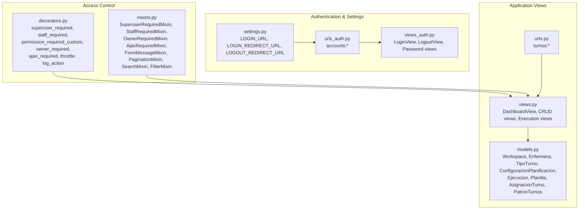
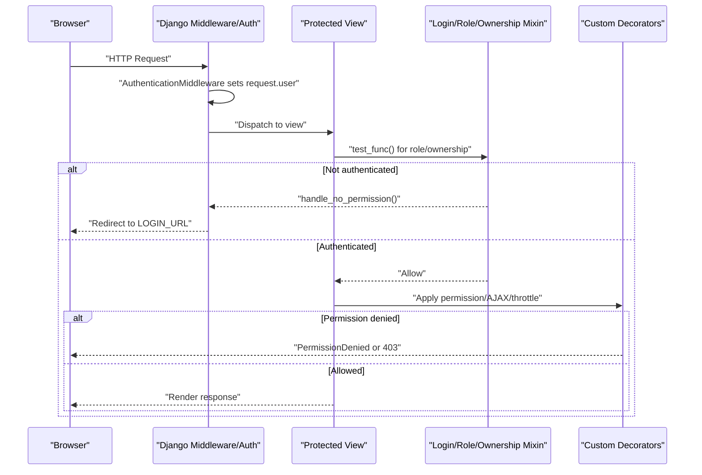
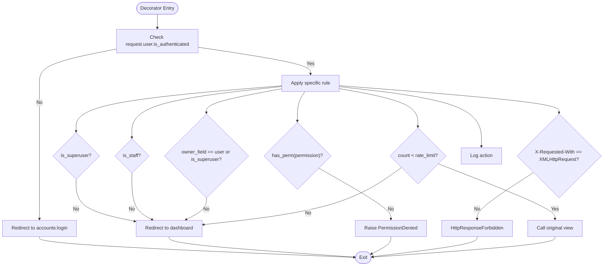
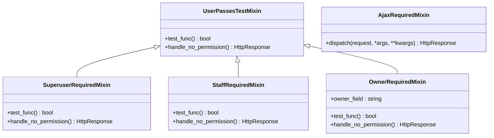
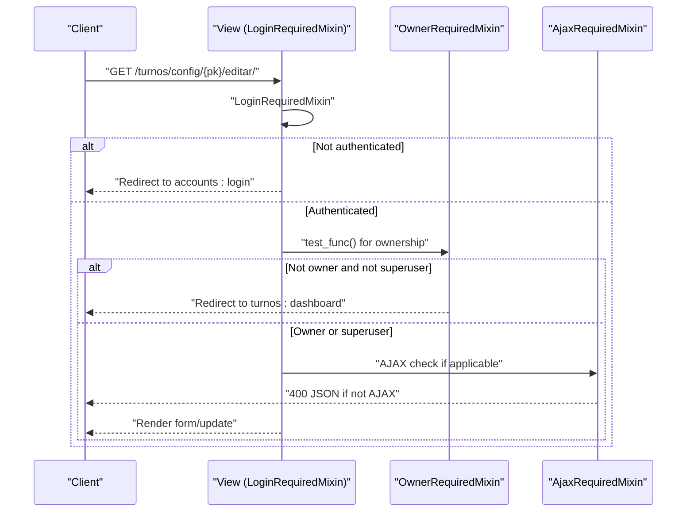
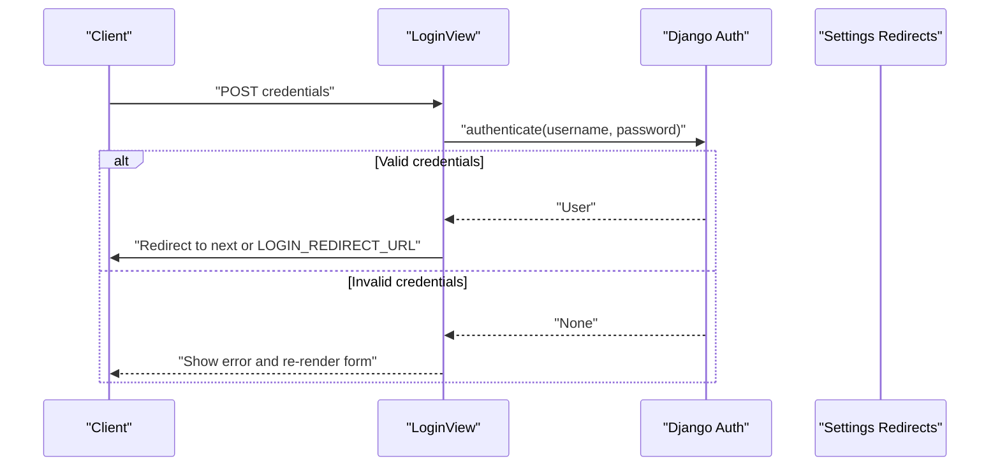
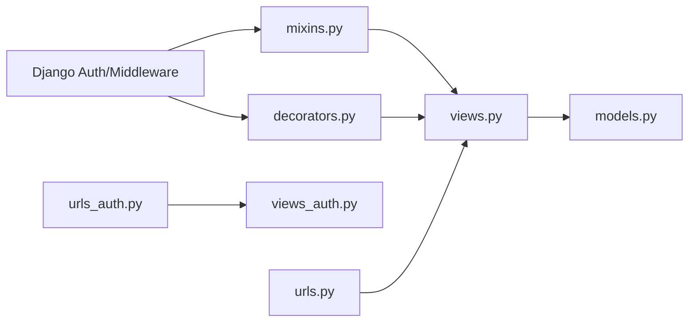

# Access Control and Permissions

<cite>
**Referenced Files in This Document**
- [decorators.py](file://turnos/decorators.py)
- [mixins.py](file://turnos/mixins.py)
- [views_auth.py](file://turnos/views_auth.py)
- [views.py](file://turnos/views.py)
- [urls_auth.py](file://turnos/urls_auth.py)
- [urls.py](file://turnos/urls.py)
- [settings.py](file://proyecto_turnos/settings.py)
- [models.py](file://turnos/models.py)
- [admin.py](file://turnos/admin.py)
</cite>

## Table of Contents
1. [Introduction](#introduction)
2. [Project Structure](#project-structure)
3. [Core Components](#core-components)
4. [Architecture Overview](#architecture-overview)
5. [Detailed Component Analysis](#detailed-component-analysis)
6. [Dependency Analysis](#dependency-analysis)
7. [Performance Considerations](#performance-considerations)
8. [Troubleshooting Guide](#troubleshooting-guide)
9. [Conclusion](#conclusion)

## Introduction
This document explains the access control mechanisms implemented in the project, focusing on custom decorators, permission mixins, and authorization patterns. It covers how the system integrates with Django’s built-in permission system, manages user roles, and enforces view-level access control. It also documents security middleware, permission validation, and unauthorized access handling, with practical examples of protected views, permission-based redirects, and access control patterns.

## Project Structure
Access control spans several modules:
- Authentication and session management via Django’s contrib.auth stack and project settings.
- Custom decorators for role checks, ownership verification, AJAX enforcement, throttling, and action logging.
- Custom mixins extending Django’s UserPassesTestMixin for reusable authorization logic.
- Protected views grouped under LoginRequiredMixin and specialized mixins.
- URL routing separating authentication and application views.

**Diagram sources**
- [settings.py:121-123](file://proyecto_turnos/settings.py#L121-L123)
- [urls_auth.py:9-21](file://turnos/urls_auth.py#L9-L21)
- [views_auth.py:24-149](file://turnos/views_auth.py#L24-L149)
- [decorators.py:12-162](file://turnos/decorators.py#L12-L162)
- [mixins.py:11-229](file://turnos/mixins.py#L11-L229)
- [urls.py:11-108](file://turnos/urls.py#L11-L108)
- [views.py:52-800](file://turnos/views.py#L52-L800)
- [models.py:12-200](file://turnos/models.py#L12-L200)

**Section sources**
- [settings.py:121-123](file://proyecto_turnos/settings.py#L121-L123)
- [urls_auth.py:9-21](file://turnos/urls_auth.py#L9-L21)
- [views_auth.py:24-149](file://turnos/views_auth.py#L24-L149)
- [decorators.py:12-162](file://turnos/decorators.py#L12-L162)
- [mixins.py:11-229](file://turnos/mixins.py#L11-L229)
- [urls.py:11-108](file://turnos/urls.py#L11-L108)
- [views.py:52-800](file://turnos/views.py#L52-L800)
- [models.py:12-200](file://turnos/models.py#L12-L200)

## Core Components
- Custom decorators:
  - Role-based: superuser_required, staff_required.
  - Permission-based: permission_required_custom(permission).
  - Ownership-based: owner_required(model_field).
  - Request type: ajax_required.
  - Operational safeguards: throttle(rate_limit, period), log_action(action_name).
- Custom mixins:
  - Role-based: SuperuserRequiredMixin, StaffRequiredMixin.
  - Ownership: OwnerRequiredMixin with configurable owner_field.
  - AJAX enforcement: AjaxRequiredMixin.
  - Utility: FormMessageMixin, PaginationMixin, SearchMixin, FilterMixin.
- Protected views:
  - Dashboard and most application views inherit LoginRequiredMixin.
  - Specific views apply OwnerRequiredMixin for object-level protection.
- Authentication views:
  - LoginView, LogoutView, Registration, Password reset/change views.
- URL routing:
  - Separate accounts/* and turnos/* namespaces.

**Section sources**
- [decorators.py:12-162](file://turnos/decorators.py#L12-L162)
- [mixins.py:11-229](file://turnos/mixins.py#L11-L229)
- [views.py:52-800](file://turnos/views.py#L52-L800)
- [views_auth.py:24-149](file://turnos/views_auth.py#L24-L149)
- [urls_auth.py:9-21](file://turnos/urls_auth.py#L9-L21)
- [urls.py:11-108](file://turnos/urls.py#L11-L108)

## Architecture Overview
The access control architecture combines Django’s built-in authentication and authorization with custom decorators and mixins. The flow ensures:
- Unauthenticated users are redirected to the login page.
- Authorized users proceed to views; otherwise, they receive permission errors or are redirected.
- Object-level ownership checks enforce who can edit or delete records.
- AJAX-only endpoints are enforced via mixin or decorator.
- Throttling and logging decorate sensitive operations.

**Diagram sources**
- [settings.py:121-123](file://proyecto_turnos/settings.py#L121-L123)
- [mixins.py:11-47](file://turnos/mixins.py#L11-L47)
- [decorators.py:12-107](file://turnos/decorators.py#L12-L107)
- [views.py:52-800](file://turnos/views.py#L52-L800)

## Detailed Component Analysis

### Custom Decorators
- superuser_required: Requires is_superuser; otherwise redirects to dashboard with an error message.
- staff_required: Requires is_staff; otherwise redirects to dashboard with an error message.
- permission_required_custom(permission): Uses request.user.has_perm(permission); raises PermissionDenied if missing.
- owner_required(model_field='creado_por'): Compares object.owner_field to request.user; allows superusers; otherwise redirects to dashboard.
- ajax_required: Validates X-Requested-With header; returns 403 JSON for non-AJAX requests.
- throttle(rate_limit, period): Uses cache to limit requests per user per view; redirects to dashboard on limit exceeded.
- log_action(action_name): Logs user actions to aid auditing.

**Diagram sources**
- [decorators.py:12-162](file://turnos/decorators.py#L12-L162)

**Section sources**
- [decorators.py:12-162](file://turnos/decorators.py#L12-L162)

### Permission Mixins
- SuperuserRequiredMixin: Enforces is_superuser via test_func; custom handle_no_permission redirects to dashboard with an error message.
- StaffRequiredMixin: Enforces is_staff via test_func; custom handle_no_permission redirects to dashboard with an error message.
- OwnerRequiredMixin: Compares owner_field to request.user; allows superusers; custom handle_no_permission redirects to dashboard with an error message.
- AjaxRequiredMixin: Enforces AJAX via dispatch; returns JSON 400 on failure.
- Utility mixins (FormMessageMixin, PaginationMixin, SearchMixin, FilterMixin) support UX and data filtering.

**Diagram sources**
- [mixins.py:11-57](file://turnos/mixins.py#L11-L57)

**Section sources**
- [mixins.py:11-57](file://turnos/mixins.py#L11-L57)

### View-Level Access Control
- LoginRequiredMixin is applied broadly to protect dashboards and CRUD views.
- OwnerRequiredMixin is used on update/delete views to ensure only owners (or superusers) can modify objects.
- AjaxRequiredMixin is used on AJAX-only views to enforce request type.
- Examples of protected views:
  - DashboardView, Configuracion* views, Ejecucion* views, Enfermera* views, TipoTurno* views.
- Permission-based redirects:
  - On insufficient permissions, views redirect to turnos:dashboard with a message.

**Diagram sources**
- [views.py:52-800](file://turnos/views.py#L52-L800)
- [mixins.py:33-47](file://turnos/mixins.py#L33-L47)
- [mixins.py:50-56](file://turnos/mixins.py#L50-L56)

**Section sources**
- [views.py:52-800](file://turnos/views.py#L52-L800)
- [mixins.py:33-56](file://turnos/mixins.py#L33-L56)

### Authentication Views and Redirects
- LoginView authenticates users and redirects to success_url or next parameter.
- LogoutView clears session and redirects to accounts:login.
- Password reset/change views integrate with Django’s contrib.auth views.
- Settings define LOGIN_URL, LOGIN_REDIRECT_URL, LOGOUT_REDIRECT_URL.

**Diagram sources**
- [views_auth.py:24-56](file://turnos/views_auth.py#L24-L56)
- [settings.py:121-123](file://proyecto_turnos/settings.py#L121-L123)

**Section sources**
- [views_auth.py:24-149](file://turnos/views_auth.py#L24-L149)
- [settings.py:121-123](file://proyecto_turnos/settings.py#L121-L123)

### Integration with Django’s Permission System and Roles
- Built-in roles:
  - is_staff: Used by StaffRequiredMixin and staff_required decorator.
  - is_superuser: Used by SuperuserRequiredMixin and superuser_required decorator.
- Custom permissions:
  - permission_required_custom(permission) leverages request.user.has_perm(permission).
- Ownership:
  - owner_required and OwnerRequiredMixin compare object.owner_field to request.user; superusers bypass ownership checks.
- URL namespaces:
  - accounts:* for auth routes; turnos:* for application routes.

**Section sources**
- [mixins.py:11-47](file://turnos/mixins.py#L11-L47)
- [decorators.py:12-107](file://turnos/decorators.py#L12-L107)
- [urls_auth.py:9-21](file://turnos/urls_auth.py#L9-L21)
- [urls.py:11-108](file://turnos/urls.py#L11-L108)

### Security Middleware and Unauthorized Access Handling
- AuthenticationMiddleware ensures request.user is set.
- CSRF, session, and message middleware support secure sessions and flash messaging.
- Unauthorized access:
  - PermissionDenied raised by permission_required_custom.
  - HttpResponseForbidden returned by ajax_required.
  - Redirects to dashboard with messages via mixins’ handle_no_permission.

**Section sources**
- [settings.py:29-39](file://proyecto_turnos/settings.py#L29-L39)
- [decorators.py:58-62](file://turnos/decorators.py#L58-L62)
- [decorators.py:77-81](file://turnos/decorators.py#L77-L81)
- [mixins.py:17-19](file://turnos/mixins.py#L17-L19)
- [mixins.py:28-30](file://turnos/mixins.py#L28-L30)
- [mixins.py:45-47](file://turnos/mixins.py#L45-L47)

## Dependency Analysis
- Mixins depend on Django’s UserPassesTestMixin and LoginRequiredMixin.
- Decorators depend on Django shortcuts, exceptions, and request.user attributes.
- Views depend on mixins and decorators for authorization.
- URLs separate auth and app namespaces, enabling clear routing.

**Diagram sources**
- [mixins.py:4-8](file://turnos/mixins.py#L4-L8)
- [decorators.py:4-9](file://turnos/decorators.py#L4-L9)
- [views.py:11-46](file://turnos/views.py#L11-L46)
- [urls_auth.py:4-21](file://turnos/urls_auth.py#L4-L21)
- [urls.py:4-108](file://turnos/urls.py#L4-L108)
- [models.py:2-9](file://turnos/models.py#L2-L9)

**Section sources**
- [mixins.py:4-8](file://turnos/mixins.py#L4-L8)
- [decorators.py:4-9](file://turnos/decorators.py#L4-L9)
- [views.py:11-46](file://turnos/views.py#L11-L46)
- [urls_auth.py:4-21](file://turnos/urls_auth.py#L4-L21)
- [urls.py:4-108](file://turnos/urls.py#L4-L108)
- [models.py:2-9](file://turnos/models.py#L2-L9)

## Performance Considerations
- Throttle decorator uses cache to limit requests per user per view; tune rate_limit and period to balance usability and abuse prevention.
- Logging decorator adds minimal overhead; ensure log levels are configured appropriately in production.
- AJAXRequiredMixin short-circuits non-AJAX requests early, reducing unnecessary processing.

[No sources needed since this section provides general guidance]

## Troubleshooting Guide
- Users redirected to login:
  - Verify LOGIN_URL and session cookies.
  - Confirm LoginRequiredMixin is present on the view.
- PermissionDenied errors:
  - Ensure the user has the required permission or role.
  - Use permission_required_custom with the correct permission codename.
- Ownership failures:
  - Confirm owner_field matches the model’s owner attribute.
  - Verify the object’s owner matches request.user or user is superuser.
- AJAX-only endpoints failing:
  - Ensure X-Requested-With header is set to XMLHttpRequest.
  - Use AjaxRequiredMixin or ajax_required decorator.
- Unexpected redirects to dashboard:
  - Check handle_no_permission behavior in mixins and decorator fallbacks.

**Section sources**
- [settings.py:121-123](file://proyecto_turnos/settings.py#L121-L123)
- [mixins.py:17-19](file://turnos/mixins.py#L17-L19)
- [mixins.py:28-30](file://turnos/mixins.py#L28-L30)
- [mixins.py:45-47](file://turnos/mixins.py#L45-L47)
- [decorators.py:58-62](file://turnos/decorators.py#L58-L62)
- [decorators.py:77-81](file://turnos/decorators.py#L77-L81)

## Conclusion
The project implements robust access control by combining Django’s built-in authentication and authorization with custom decorators and mixins. Role-based checks, permission validation, ownership verification, and AJAX enforcement ensure secure and predictable behavior. The separation of authentication and application views, along with clear redirect policies, simplifies maintenance and improves security posture.