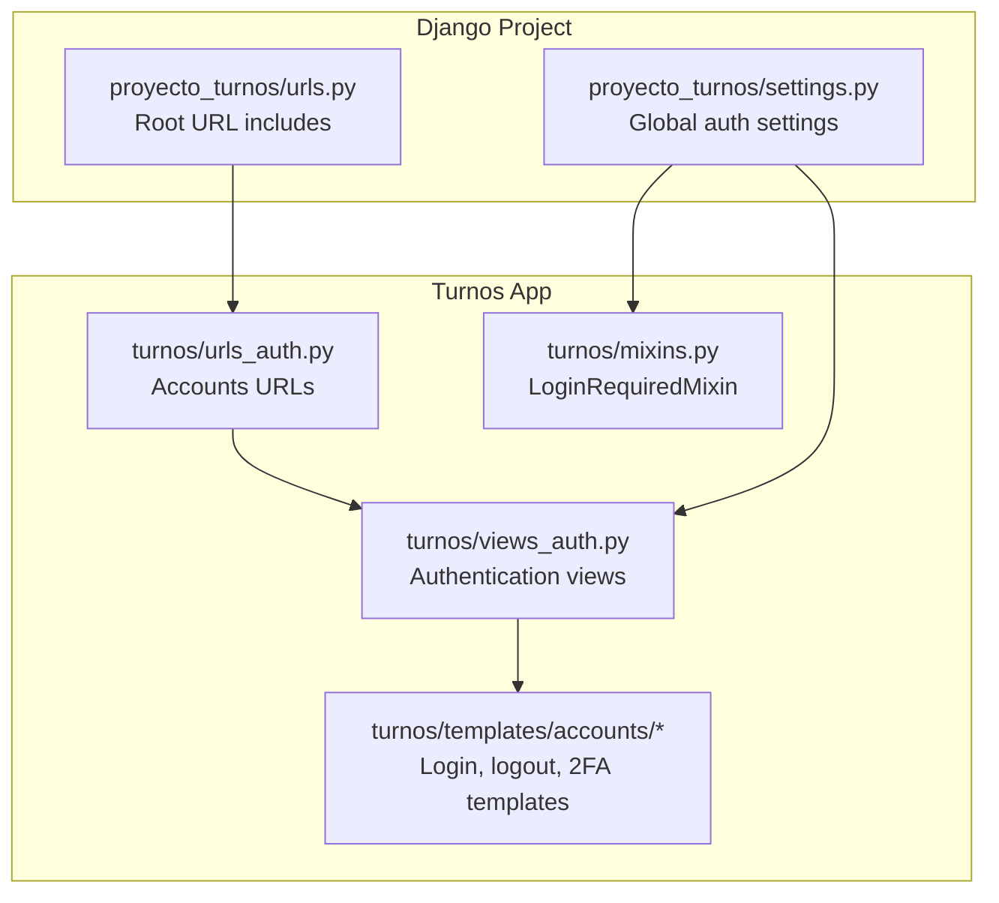
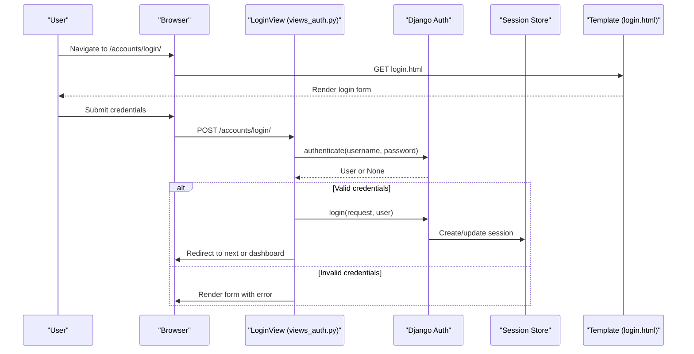
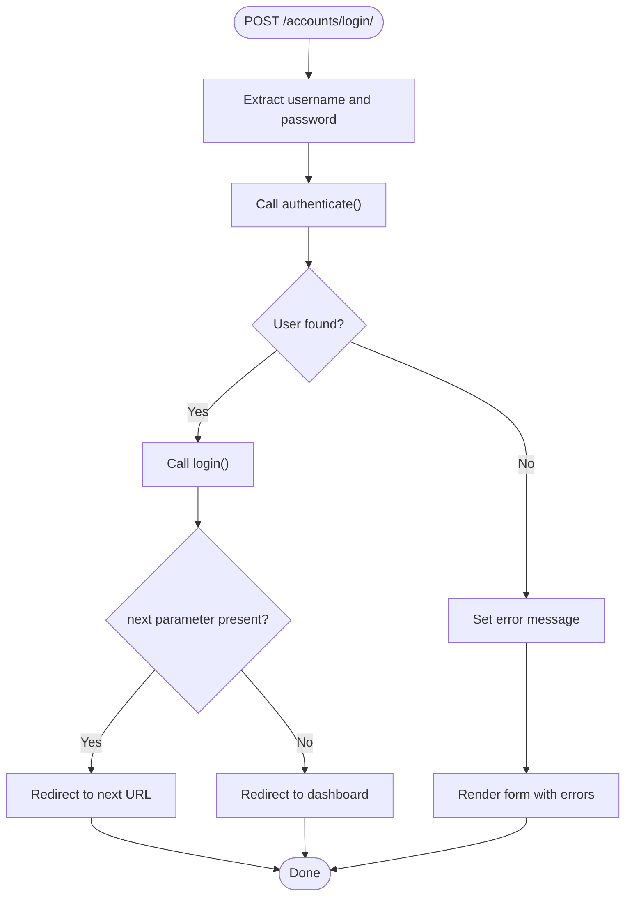
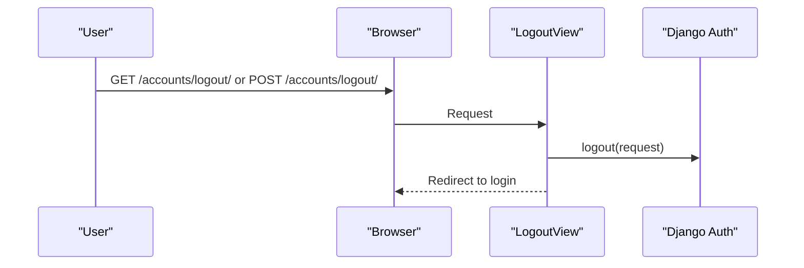
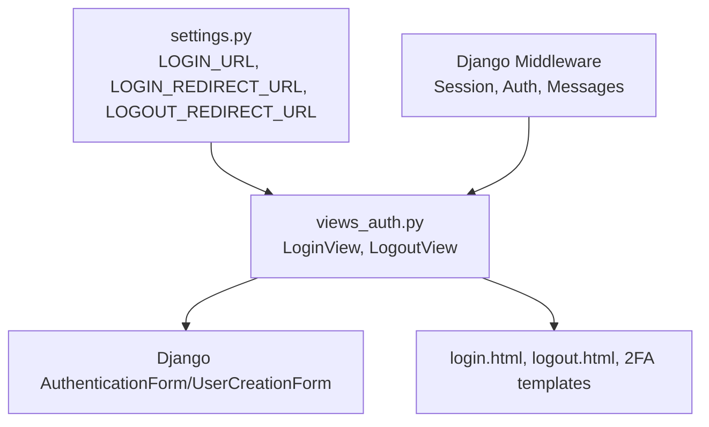

# Authentication Workflow

<cite>
**Referenced Files in This Document**
- [views_auth.py](file://turnos/views_auth.py)
- [urls_auth.py](file://turnos/urls_auth.py)
- [login.html](file://turnos/templates/accounts/login.html)
- [logout.html](file://turnos/templates/accounts/logout.html)
- [settings.py](file://proyecto_turnos/settings.py)
- [urls.py](file://proyecto_turnos/urls.py)
- [mixins.py](file://turnos/mixins.py)
- [verify_2fa.html](file://turnos/templates/accounts/verify_2fa.html)
- [setup_2fa.html](file://turnos/templates/accounts/setup_2fa.html)
- [default.conf](file://docker/nginx/default.conf)
</cite>

## Table of Contents
1. [Introduction](#introduction)
2. [Project Structure](#project-structure)
3. [Core Components](#core-components)
4. [Architecture Overview](#architecture-overview)
5. [Detailed Component Analysis](#detailed-component-analysis)
6. [Dependency Analysis](#dependency-analysis)
7. [Performance Considerations](#performance-considerations)
8. [Troubleshooting Guide](#troubleshooting-guide)
9. [Conclusion](#conclusion)

## Introduction
This document explains the authentication workflow for the application, focusing on login processes, logout handling, session management, and integration with Django's authentication system. It covers the custom LoginView implementation, authentication validation, session creation, automatic redirection logic, form processing, and success/error handling. It also addresses login form validation, user credential verification, session persistence, security considerations, session timeout handling, and authentication state management.

## Project Structure
Authentication-related components are organized under the turnos app with dedicated views, URL routing, and templates. The Django project configuration defines global authentication behavior and redirects.

**Diagram sources**
- [settings.py:121-123](file://proyecto_turnos/settings.py#L121-L123)
- [urls.py:16-17](file://proyecto_turnos/urls.py#L16-L17)
- [urls_auth.py:9-20](file://turnos/urls_auth.py#L9-L20)
- [views_auth.py:24-67](file://turnos/views_auth.py#L24-L67)
- [mixins.py:11-20](file://turnos/mixins.py#L11-L20)

**Section sources**
- [settings.py:121-123](file://proyecto_turnos/settings.py#L121-L123)
- [urls.py:16-17](file://proyecto_turnos/urls.py#L16-L17)
- [urls_auth.py:9-20](file://turnos/urls_auth.py#L9-L20)

## Core Components
- LoginView: Custom FormView that authenticates users via Django’s authenticate, logs them in via login, and handles redirection and messaging.
- LogoutView: Handles logout via Django’s logout and redirects to the login page.
- Registration and Password Management: Uses Django’s built-in views for registration and password reset/change flows.
- Session Management: Controlled by Django middleware and settings; LoginView supports next parameter redirection and success messaging.
- Security: CSRF protection in templates, rate limiting at the reverse proxy for login, and optional two-factor authentication templates.

**Section sources**
- [views_auth.py:24-67](file://turnos/views_auth.py#L24-L67)
- [views_auth.py:58-67](file://turnos/views_auth.py#L58-L67)
- [urls_auth.py:9-20](file://turnos/urls_auth.py#L9-L20)
- [login.html:35-91](file://turnos/templates/accounts/login.html#L35-L91)
- [logout.html:23-33](file://turnos/templates/accounts/logout.html#L23-L33)

## Architecture Overview
The authentication flow integrates Django’s contrib.auth with custom views and templates. The LoginView leverages Django’s authenticate and login functions, while settings define redirect behavior and global auth configuration. Optional 2FA templates support an additional verification step.

**Diagram sources**
- [views_auth.py:30-49](file://turnos/views_auth.py#L30-L49)
- [login.html:35-91](file://turnos/templates/accounts/login.html#L35-L91)
- [settings.py:121-123](file://proyecto_turnos/settings.py#L121-L123)

## Detailed Component Analysis

### LoginView
- Purpose: Custom authentication entry point using Django’s AuthenticationForm.
- Validation: Extracts cleaned username and password, calls authenticate.
- Success path: Calls login, sets a success message, checks for a next parameter, and redirects accordingly.
- Failure path: Sets an error message and returns invalid form rendering.
- Pre-authenticated guard: dispatch redirects authenticated users to the dashboard.

**Diagram sources**
- [views_auth.py:30-49](file://turnos/views_auth.py#L30-L49)
- [login.html:84](file://turnos/templates/accounts/login.html#L84)

**Section sources**
- [views_auth.py:24-55](file://turnos/views_auth.py#L24-L55)
- [login.html:35-91](file://turnos/templates/accounts/login.html#L35-L91)

### LogoutView
- Purpose: Logs out the current user and redirects to the login page.
- Supports both GET and POST requests for convenience.

**Diagram sources**
- [views_auth.py:58-67](file://turnos/views_auth.py#L58-L67)
- [logout.html:23-33](file://turnos/templates/accounts/logout.html#L23-L33)

**Section sources**
- [views_auth.py:58-67](file://turnos/views_auth.py#L58-L67)
- [logout.html:23-33](file://turnos/templates/accounts/logout.html#L23-L33)

### Session Management and Redirection
- Global redirects: LOGIN_URL, LOGIN_REDIRECT_URL, LOGOUT_REDIRECT_URL control auth behavior.
- LoginView success_url and next parameter handling override defaults for granular control.
- Mixins: LoginRequiredMixin ensures protected views require authentication.

**Section sources**
- [settings.py:121-123](file://proyecto_turnos/settings.py#L121-L123)
- [views_auth.py:28](file://turnos/views_auth.py#L28)
- [views_auth.py:42-46](file://turnos/views_auth.py#L42-L46)
- [mixins.py:11-20](file://turnos/mixins.py#L11-L20)

### Two-Factor Authentication (2FA) Templates
- Setup 2FA: Provides QR code generation and token verification steps.
- Verify 2FA: Accepts a 6-digit token or backup code, with optional attempt counters.
- These templates support an additional authentication layer during login flows.

**Section sources**
- [setup_2fa.html:102-139](file://turnos/templates/accounts/setup_2fa.html#L102-L139)
- [verify_2fa.html:34-88](file://turnos/templates/accounts/verify_2fa.html#L34-L88)

### URL Routing and Namespacing
- Accounts URLs are included under the accounts namespace.
- LoginView, LogoutView, and password management endpoints are mapped here.

**Section sources**
- [urls_auth.py:9-20](file://turnos/urls_auth.py#L9-L20)
- [urls.py:16-17](file://proyecto_turnos/urls.py#L16-L17)

## Dependency Analysis
Authentication depends on Django’s contrib.auth, middleware, and project settings. Views rely on generic FormView and View base classes, and templates depend on CSRF tokens and message rendering.

**Diagram sources**
- [settings.py:121-123](file://proyecto_turnos/settings.py#L121-L123)
- [views_auth.py:4-19](file://turnos/views_auth.py#L4-L19)
- [login.html:35](file://turnos/templates/accounts/login.html#L35)
- [logout.html:23](file://turnos/templates/accounts/logout.html#L23)

**Section sources**
- [settings.py:121-123](file://proyecto_turnos/settings.py#L121-L123)
- [views_auth.py:4-19](file://turnos/views_auth.py#L4-L19)

## Performance Considerations
- Session storage: Ensure database-backed sessions are tuned for expected concurrency.
- Middleware order: AuthenticationMiddleware should precede message middleware to maintain state.
- Template rendering: Keep login/logout templates minimal to reduce overhead.
- Rate limiting: Reverse proxy rate limiting for login endpoint reduces brute-force attempts.

**Section sources**
- [default.conf:138-147](file://docker/nginx/default.conf#L138-L147)

## Troubleshooting Guide
- Login fails silently: Verify CSRF token presence in the login form and ensure AuthenticationForm is used.
- Redirect loops: Check LOGIN_REDIRECT_URL vs LoginView success_url and next parameter precedence.
- Authenticated users redirected away: Confirm dispatch logic in LoginView and LoginRequiredMixin usage.
- 2FA integration: Ensure templates render properly and token validation is handled by the appropriate view.
- Session not persisting: Confirm session middleware and backend configuration.

**Section sources**
- [login.html:35-91](file://turnos/templates/accounts/login.html#L35-L91)
- [views_auth.py:51-55](file://turnos/views_auth.py#L51-L55)
- [mixins.py:11-20](file://turnos/mixins.py#L11-L20)
- [verify_2fa.html:34-88](file://turnos/templates/accounts/verify_2fa.html#L34-L88)

## Conclusion
The authentication workflow combines Django’s built-in authentication with custom views and templates. LoginView centralizes credential validation, session creation, and redirection logic, while LogoutView cleanly terminates sessions. Global settings govern redirects, and optional 2FA templates enhance security. The system leverages CSRF protection, middleware, and URL namespaces for a cohesive and secure authentication experience.