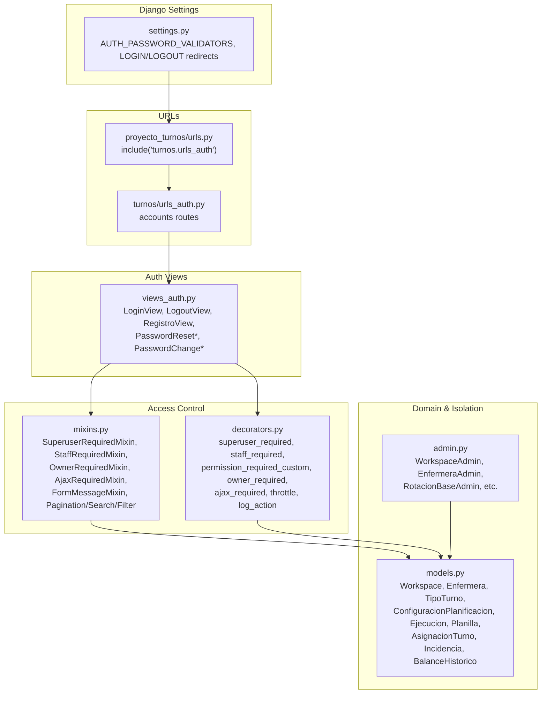
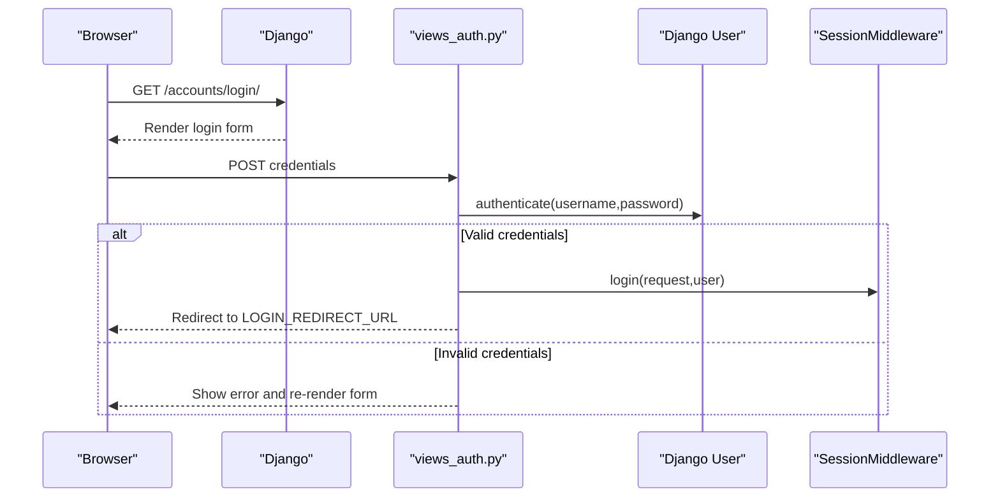
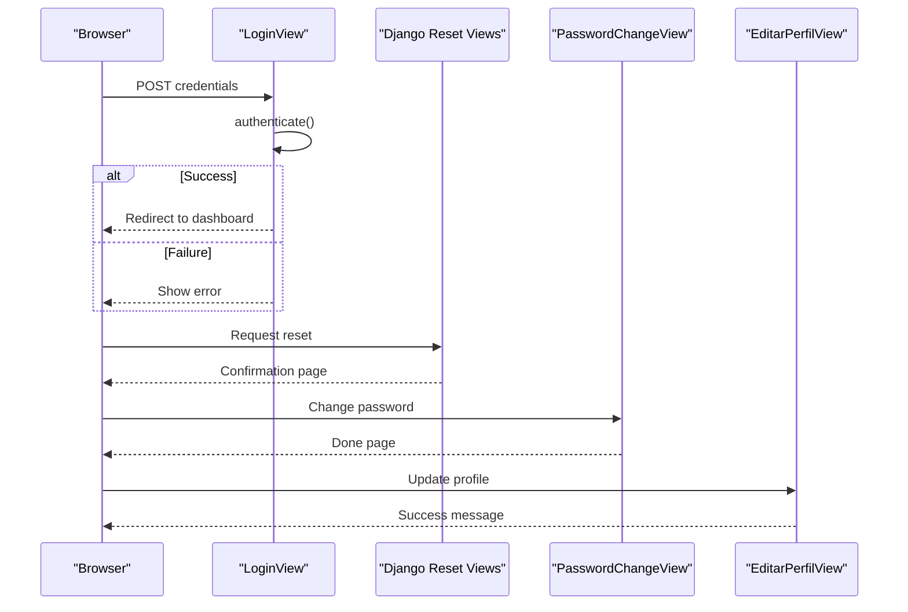
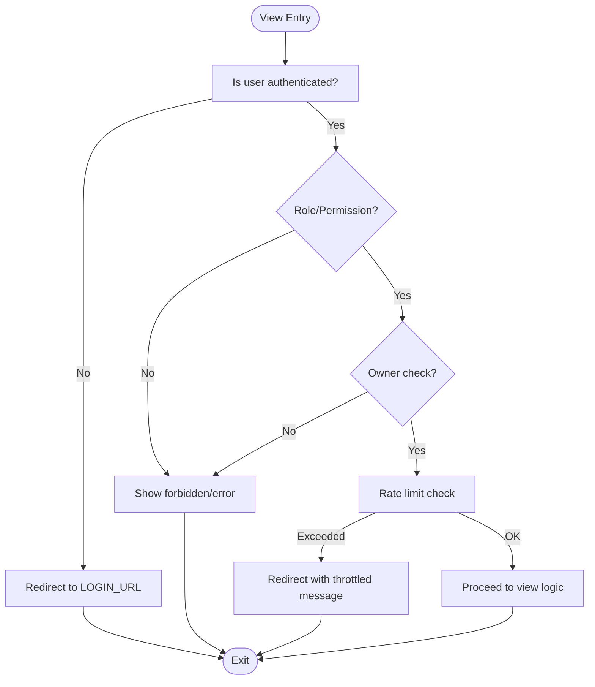
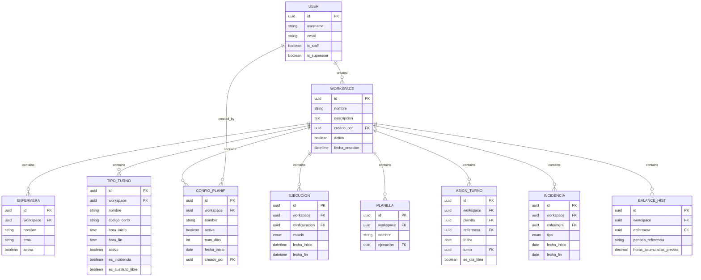
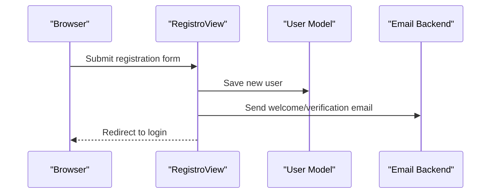
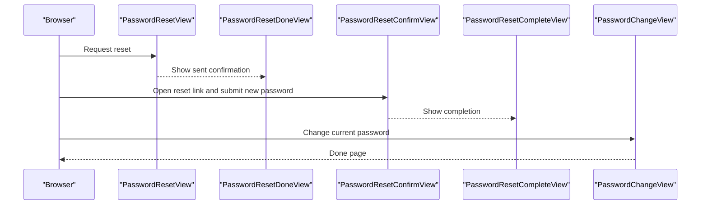
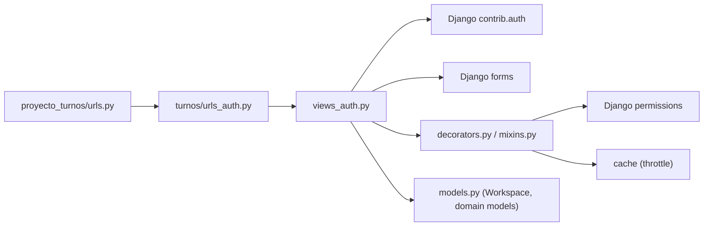

# Authentication and Authorization

<cite>
**Referenced Files in This Document**
- [settings.py](file://proyecto_turnos/settings.py)
- [urls.py](file://proyecto_turnos/urls.py)
- [urls_auth.py](file://turnos/urls_auth.py)
- [views_auth.py](file://turnos/views_auth.py)
- [decorators.py](file://turnos/decorators.py)
- [mixins.py](file://turnos/mixins.py)
- [models.py](file://turnos/models.py)
- [views.py](file://turnos/views.py)
- [admin.py](file://turnos/admin.py)
</cite>

## Table of Contents
1. [Introduction](#introduction)
2. [Project Structure](#project-structure)
3. [Core Components](#core-components)
4. [Architecture Overview](#architecture-overview)
5. [Detailed Component Analysis](#detailed-component-analysis)
6. [Dependency Analysis](#dependency-analysis)
7. [Performance Considerations](#performance-considerations)
8. [Troubleshooting Guide](#troubleshooting-guide)
9. [Conclusion](#conclusion)

## Introduction
This document explains the authentication and authorization system of the application, focusing on Django’s built-in authentication integration, user management, permission controls, and the multi-workspace architecture that ensures data isolation. It covers login/logout flows, password management, session handling, role-based access control, custom decorators and mixins, and the mechanisms that enforce workspace boundaries across models. It also documents the registration workflow, email verification processes, password recovery, and profile management.

## Project Structure
The authentication subsystem spans several modules:
- Django settings define authentication defaults and redirects.
- URL routing exposes authentication endpoints under the accounts namespace.
- Views implement login, logout, registration, password change/reset, and profile editing.
- Custom decorators and mixins provide granular access control and convenience behaviors.
- Models define the Workspace entity and embed workspace foreign keys across domain models to enforce isolation.
- Admin integrates Workspace administration.

**Diagram sources**
- [settings.py:78-124](file://proyecto_turnos/settings.py#L78-L124)
- [urls.py:16-17](file://proyecto_turnos/urls.py#L16-L17)
- [urls_auth.py:9-20](file://turnos/urls_auth.py#L9-L20)
- [views_auth.py:24-149](file://turnos/views_auth.py#L24-L149)
- [decorators.py:12-162](file://turnos/decorators.py#L12-L162)
- [mixins.py:11-229](file://turnos/mixins.py#L11-L229)
- [models.py:12-58](file://turnos/models.py#L12-L58)
- [admin.py:270-287](file://turnos/admin.py#L270-L287)

**Section sources**
- [settings.py:78-124](file://proyecto_turnos/settings.py#L78-L124)
- [urls.py:16-17](file://proyecto_turnos/urls.py#L16-L17)
- [urls_auth.py:9-20](file://turnos/urls_auth.py#L9-L20)
- [views_auth.py:24-149](file://turnos/views_auth.py#L24-L149)
- [decorators.py:12-162](file://turnos/decorators.py#L12-L162)
- [mixins.py:11-229](file://turnos/mixins.py#L11-L229)
- [models.py:12-58](file://turnos/models.py#L12-L58)
- [admin.py:270-287](file://turnos/admin.py#L270-L287)

## Core Components
- Authentication configuration and redirects:
  - Password validators, login/logout redirects, and site URL are configured centrally.
- Authentication views:
  - Login, logout, registration, password reset/change, and profile edit.
- Access control primitives:
  - Decorators for superuser/staff/permission/owner/ajax/throttle/log actions.
  - Mixins mirroring the same semantics for class-based views.
- Multi-workspace isolation:
  - Workspace model and foreign keys on domain entities to segment data per workspace.
- Admin integration:
  - Workspace admin and other domain admins to manage workspaces and related entities.

**Section sources**
- [settings.py:78-124](file://proyecto_turnos/settings.py#L78-L124)
- [views_auth.py:24-149](file://turnos/views_auth.py#L24-L149)
- [decorators.py:12-162](file://turnos/decorators.py#L12-L162)
- [mixins.py:11-229](file://turnos/mixins.py#L11-L229)
- [models.py:12-58](file://turnos/models.py#L12-L58)
- [admin.py:270-287](file://turnos/admin.py#L270-L287)

## Architecture Overview
The authentication stack integrates Django’s contrib.auth with custom views and access control helpers. The multi-workspace architecture is enforced by embedding a Workspace foreign key on core models, ensuring queries and mutations remain isolated to the current workspace context.

**Diagram sources**
- [views_auth.py:24-55](file://turnos/views_auth.py#L24-L55)
- [settings.py:121-123](file://proyecto_turnos/settings.py#L121-L123)

**Section sources**
- [views_auth.py:24-55](file://turnos/views_auth.py#L24-L55)
- [settings.py:121-123](file://proyecto_turnos/settings.py#L121-L123)

## Detailed Component Analysis

### Authentication Views
- LoginView: Accepts credentials, authenticates via Django’s authenticate, logs in the user, and redirects to the dashboard or the requested next page.
- LogoutView: Ends the session and redirects to the login page.
- RegistroView: Uses Django’s UserCreationForm to create new users.
- PasswordReset*: Built on Django’s generic PasswordReset views to send reset emails and confirm resets.
- PasswordChange*: Built on Django’s generic PasswordChange views to change passwords securely.
- EditarPerfilView: Allows updating first_name, last_name, and email.

**Diagram sources**
- [views_auth.py:24-149](file://turnos/views_auth.py#L24-L149)

**Section sources**
- [views_auth.py:24-149](file://turnos/views_auth.py#L24-L149)

### Access Control: Decorators and Mixins
- Decorators:
  - superuser_required, staff_required: Enforce staff/superuser status.
  - permission_required_custom: Checks arbitrary Django permissions.
  - owner_required: Ensures the logged-in user owns the object (via a field like created_by).
  - ajax_required: Restricts views to AJAX requests.
  - throttle: Rate-limit per-user per-view using cache.
  - log_action: Logs user actions for auditing.
- Mixins:
  - SuperuserRequiredMixin, StaffRequiredMixin: Class-based equivalents of decorators.
  - OwnerRequiredMixin: Same ownership check as decorator.
  - AjaxRequiredMixin: Returns JSON 400 for non-AJAX requests.

**Diagram sources**
- [decorators.py:12-162](file://turnos/decorators.py#L12-L162)
- [mixins.py:11-57](file://turnos/mixins.py#L11-L57)

**Section sources**
- [decorators.py:12-162](file://turnos/decorators.py#L12-L162)
- [mixins.py:11-57](file://turnos/mixins.py#L11-L57)

### Multi-Workspace Architecture and Data Isolation
- Workspace model defines isolated spaces with creators and members.
- Domain models (Enfermera, TipoTurno, ConfiguracionPlanificacion, Ejecucion, Planilla, AsignacionTurno, Incidencia, BalanceHistoricoEnfermera) include a workspace foreign key to enforce per-workspace boundaries.
- Admin integrates WorkspaceAdmin and adjusts list displays for models after migrations enable workspace fields.

**Diagram sources**
- [models.py:12-58](file://turnos/models.py#L12-L58)
- [models.py:30-58](file://turnos/models.py#L30-L58)
- [models.py:60-208](file://turnos/models.py#L60-L208)
- [models.py:332-424](file://turnos/models.py#L332-L424)
- [models.py:482-532](file://turnos/models.py#L482-L532)
- [models.py:534-624](file://turnos/models.py#L534-L624)
- [models.py:749-784](file://turnos/models.py#L749-L784)
- [models.py:787-825](file://turnos/models.py#L787-L825)

**Section sources**
- [models.py:12-58](file://turnos/models.py#L12-L58)
- [models.py:30-58](file://turnos/models.py#L30-L58)
- [models.py:60-208](file://turnos/models.py#L60-L208)
- [models.py:332-424](file://turnos/models.py#L332-L424)
- [models.py:482-532](file://turnos/models.py#L482-L532)
- [models.py:534-624](file://turnos/models.py#L534-L624)
- [models.py:749-784](file://turnos/models.py#L749-L784)
- [models.py:787-825](file://turnos/models.py#L787-L825)
- [admin.py:270-287](file://turnos/admin.py#L270-L287)

### Registration Workflow and Email Verification
- Registration uses Django’s UserCreationForm in RegistroView. After successful creation, the user is redirected to the login page.
- Email backend is configurable via environment variables. The project includes templates for welcome and verification emails, indicating support for sending verification emails during registration workflows.

**Diagram sources**
- [views_auth.py:70-89](file://turnos/views_auth.py#L70-L89)
- [settings.py:125-129](file://proyecto_turnos/settings.py#L125-L129)

**Section sources**
- [views_auth.py:70-89](file://turnos/views_auth.py#L70-L89)
- [settings.py:125-129](file://proyecto_turnos/settings.py#L125-L129)

### Password Recovery and Management
- Password reset flow leverages Django’s PasswordReset views with custom templates and subjects.
- Password change flow uses Django’s PasswordChange views with success messaging.
- Password validators are configured to enforce minimum length and other policies.

**Diagram sources**
- [views_auth.py:110-149](file://turnos/views_auth.py#L110-L149)
- [settings.py:78-95](file://proyecto_turnos/settings.py#L78-L95)

**Section sources**
- [views_auth.py:110-149](file://turnos/views_auth.py#L110-L149)
- [settings.py:78-95](file://proyecto_turnos/settings.py#L78-L95)

### Session Handling and Redirects
- LOGIN_URL, LOGIN_REDIRECT_URL, LOGOUT_REDIRECT_URL are set to centralize redirect behavior after authentication actions.
- Session middleware is enabled to persist user sessions.

**Section sources**
- [settings.py:121-123](file://proyecto_turnos/settings.py#L121-L123)
- [settings.py:29-39](file://proyecto_turnos/settings.py#L29-L39)

### Role-Based Access Control and Ownership
- Superuser and staff mixins/decorators restrict access to administrative areas.
- OwnerRequiredMixin/owner_required ensure users can only modify objects they own (with superuser override).
- Permission checks can be enforced via permission_required_custom.

**Section sources**
- [mixins.py:11-47](file://turnos/mixins.py#L11-L47)
- [decorators.py:12-68](file://turnos/decorators.py#L12-L68)

### Two-Factor Authentication (2FA)
- The codebase does not implement two-factor authentication. There are no 2FA views, models, or integrations present.

[No sources needed since this section summarizes absence of 2FA]

### Examples of Common Authentication Scenarios and Authorization Patterns
- Logging in and accessing protected dashboards:
  - Use LoginView; upon success, users are redirected to the dashboard.
- Editing profile details:
  - Use EditarPerfilView to update first_name, last_name, and email.
- Changing password:
  - Use PasswordChangeView to securely update the password.
- Resetting password:
  - Use PasswordResetView and PasswordResetConfirmView to recover access.
- Admin-only operations:
  - Apply superuser_required or SuperuserRequiredMixin to restrict access to superusers.
- Owner-only edits:
  - Apply owner_required or OwnerRequiredMixin to ensure users can only edit their own objects.
- AJAX-only endpoints:
  - Apply ajax_required or AjaxRequiredMixin to enforce AJAX-only access.

**Section sources**
- [views_auth.py:24-149](file://turnos/views_auth.py#L24-L149)
- [mixins.py:11-57](file://turnos/mixins.py#L11-L57)
- [decorators.py:12-83](file://turnos/decorators.py#L12-L83)

## Dependency Analysis
- URL routing:
  - proyecto_turnos/urls.py includes turnos.urls_auth under the accounts namespace.
  - turnos/urls_auth.py defines the authentication routes.
- Views depend on Django’s contrib.auth views and forms.
- Access control decorators/mixins depend on Django’s authentication and permission systems.
- Models depend on the Workspace entity to enforce isolation.

**Diagram sources**
- [urls.py:16-17](file://proyecto_turnos/urls.py#L16-L17)
- [urls_auth.py:9-20](file://turnos/urls_auth.py#L9-L20)
- [views_auth.py:24-149](file://turnos/views_auth.py#L24-L149)
- [decorators.py:12-162](file://turnos/decorators.py#L12-L162)
- [mixins.py:11-229](file://turnos/mixins.py#L11-L229)
- [models.py:12-58](file://turnos/models.py#L12-L58)

**Section sources**
- [urls.py:16-17](file://proyecto_turnos/urls.py#L16-L17)
- [urls_auth.py:9-20](file://turnos/urls_auth.py#L9-L20)
- [views_auth.py:24-149](file://turnos/views_auth.py#L24-L149)
- [decorators.py:12-162](file://turnos/decorators.py#L12-L162)
- [mixins.py:11-229](file://turnos/mixins.py#L11-L229)
- [models.py:12-58](file://turnos/models.py#L12-L58)

## Performance Considerations
- Use mixins and decorators judiciously to avoid redundant permission checks.
- The throttle decorator uses cache; ensure cache backend is properly configured for production.
- Owner checks traverse object attributes; keep owner fields indexed if frequently queried.
- Workspace filtering should be applied early in view logic to minimize database load.

[No sources needed since this section provides general guidance]

## Troubleshooting Guide
- Login failures:
  - Verify credentials and that the user is not disabled. Check messages and form errors.
- Permission denied:
  - Confirm user roles (staff/superuser) and object ownership. Review owner_required and permission_required_custom usage.
- Rate-limited:
  - Throttle decorator enforces limits; adjust cache TTL or reduce frequency.
- Workspace visibility issues:
  - Ensure the current workspace context is set and that queries filter by workspace foreign keys.

**Section sources**
- [views_auth.py:24-55](file://turnos/views_auth.py#L24-L55)
- [decorators.py:12-162](file://turnos/decorators.py#L12-L162)
- [mixins.py:11-57](file://turnos/mixins.py#L11-L57)

## Conclusion
The application integrates Django’s authentication system with custom views and robust access control primitives. The multi-workspace model provides strong data isolation across all domain entities. While the core authentication flows (login, logout, registration, password reset/change, and profile management) are fully implemented, two-factor authentication is not currently supported. The provided decorators and mixins offer flexible, reusable mechanisms to enforce roles, ownership, and request constraints across the application.