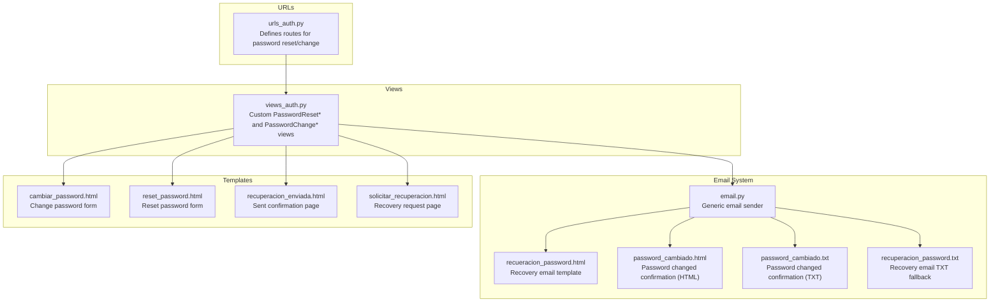
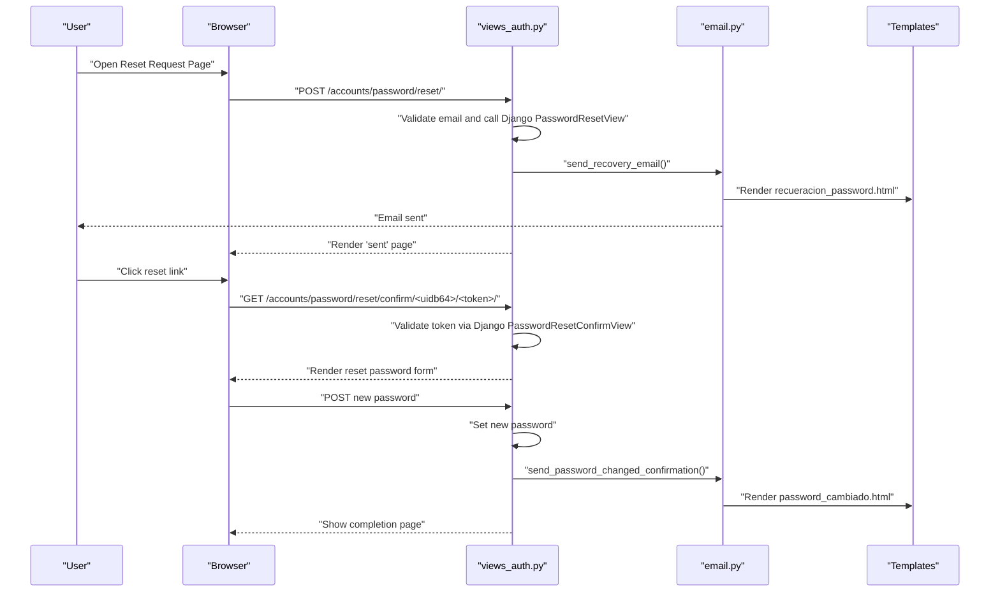
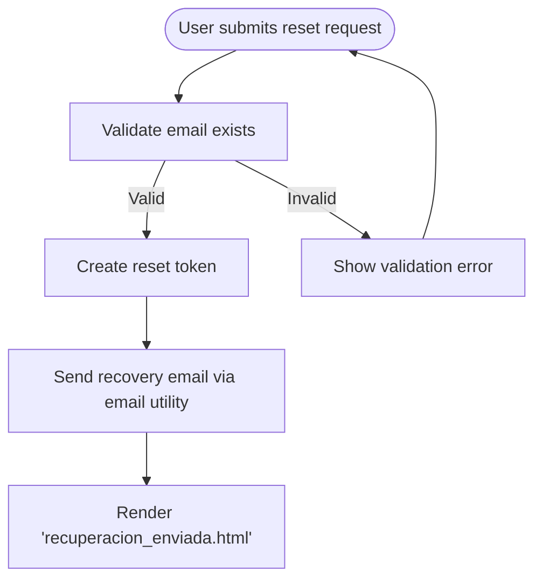
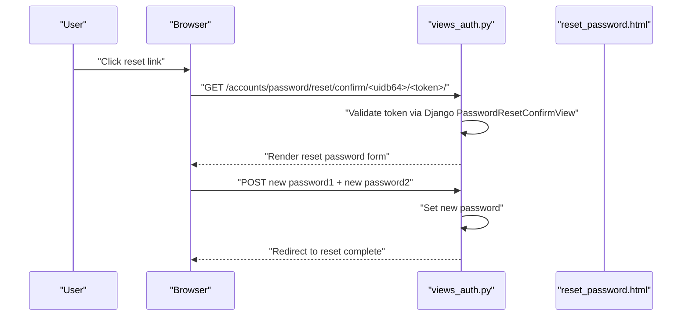
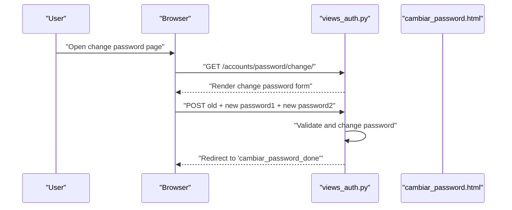
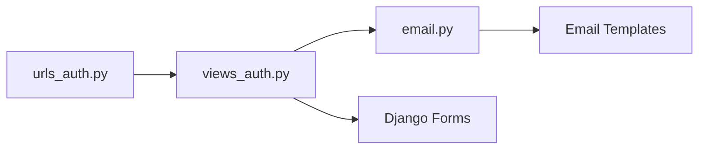

# Password Management

<cite>
**Referenced Files in This Document**
- [views_auth.py](file://turnos/views_auth.py)
- [urls_auth.py](file://turnos/urls_auth.py)
- [email.py](file://turnos/utils/email.py)
- [recueracion_password.html](file://turnos/templates/emails/recueracion_password.html)
- [cambiar_password.html](file://turnos/templates/accounts/cambiar_password.html)
- [reset_password.html](file://turnos/templates/accounts/reset_password.html)
- [recuperacion_enviada.html](file://turnos/templates/accounts/recuperacion_enviada.html)
- [solicitar_recuperacion.html](file://turnos/templates/accounts/solicitar_recuperacion.html)
- [password_cambiado.html](file://turnos/templates/emails/password_cambiado.html)
- [password_cambiado.txt](file://turnos/templates/emails/password_cambiado.txt)
- [recuperacion_password.txt](file://turnos/templates/emails/recuperacion_password.txt)
</cite>

## Table of Contents
1. [Introduction](#introduction)
2. [Project Structure](#project-structure)
3. [Core Components](#core-components)
4. [Architecture Overview](#architecture-overview)
5. [Detailed Component Analysis](#detailed-component-analysis)
6. [Dependency Analysis](#dependency-analysis)
7. [Performance Considerations](#performance-considerations)
8. [Troubleshooting Guide](#troubleshooting-guide)
9. [Conclusion](#conclusion)

## Introduction
This document explains the password management functionality implemented in the project, covering password reset requests, password change processes, and recovery workflows. It documents the integration with Django’s built-in password reset and change views, the email notification system, password validation requirements, and secure password handling. It also describes token generation and expiration, email templates, and confirmation processes. Examples of password reset and change interfaces are included via template references.

## Project Structure
Password management spans three main areas:
- URL routing for authentication endpoints
- Views that extend Django’s generic password reset/change views
- Email utilities and templates for notifications



**Diagram sources**
- [urls_auth.py:1-21](file://turnos/urls_auth.py#L1-L21)
- [views_auth.py:110-149](file://turnos/views_auth.py#L110-L149)
- [email.py:16-93](file://turnos/utils/email.py#L16-L93)
- [recueracion_password.html:1-85](file://turnos/templates/emails/recueracion_password.html#L1-L85)
- [password_cambiado.html:1-240](file://turnos/templates/emails/password_cambiado.html#L1-L240)
- [password_cambiado.txt:1-240](file://turnos/templates/emails/password_cambiado.txt#L1-L240)
- [recuperacion_password.txt:1-240](file://turnos/templates/emails/recuperacion_password.txt#L1-L240)
- [cambiar_password.html:1-124](file://turnos/templates/accounts/cambiar_password.html#L1-L124)
- [reset_password.html:29-70](file://turnos/templates/accounts/reset_password.html#L29-L70)
- [recuperacion_enviada.html:32-52](file://turnos/templates/accounts/recuperacion_enviada.html#L32-L52)
- [solicitar_recuperacion.html:38-56](file://turnos/templates/accounts/solicitar_recuperacion.html#L38-L56)

**Section sources**
- [urls_auth.py:1-21](file://turnos/urls_auth.py#L1-L21)
- [views_auth.py:110-149](file://turnos/views_auth.py#L110-L149)
- [email.py:16-93](file://turnos/utils/email.py#L16-L93)

## Core Components
- Password reset request flow: handled by a custom view extending Django’s PasswordResetView, rendering a dedicated template and sending a recovery email.
- Password reset confirmation flow: handled by a custom view extending Django’s PasswordResetConfirmView, validating the token and allowing the user to set a new password.
- Password change flow: handled by a custom view extending Django’s PasswordChangeView, requiring the current password and enforcing validation.
- Email notification system: centralized in a reusable utility that renders HTML and optional plain-text templates and sends multipart emails.
- Templates: dedicated pages for requesting recovery, confirming sent status, resetting passwords, and changing passwords, plus confirmation and recovery email templates.

Key implementation references:
- Password reset views and URLs: [views_auth.py:110-132](file://turnos/views_auth.py#L110-L132), [urls_auth.py:13-16](file://turnos/urls_auth.py#L13-L16)
- Password change views and URL: [views_auth.py:136-149](file://turnos/views_auth.py#L136-L149), [urls_auth.py:17-18](file://turnos/urls_auth.py#L17-L18)
- Email sender and templates: [email.py:16-93](file://turnos/utils/email.py#L16-L93), [recueracion_password.html:1-85](file://turnos/templates/emails/recueracion_password.html#L1-L85), [password_cambiado.html:1-240](file://turnos/templates/emails/password_cambiado.html#L1-L240), [password_cambiado.txt:1-240](file://turnos/templates/emails/password_cambiado.txt#L1-L240), [recuperacion_password.txt:1-240](file://turnos/templates/emails/recuperacion_password.txt#L1-L240)

**Section sources**
- [views_auth.py:110-149](file://turnos/views_auth.py#L110-L149)
- [urls_auth.py:13-18](file://turnos/urls_auth.py#L13-L18)
- [email.py:16-93](file://turnos/utils/email.py#L16-L93)
- [recueracion_password.html:1-85](file://turnos/templates/emails/recueracion_password.html#L1-L85)
- [password_cambiado.html:1-240](file://turnos/templates/emails/password_cambiado.html#L1-L240)
- [password_cambiado.txt:1-240](file://turnos/templates/emails/password_cambiado.txt#L1-L240)
- [recuperacion_password.txt:1-240](file://turnos/templates/emails/recuperacion_password.txt#L1-L240)

## Architecture Overview
The password management architecture integrates Django’s generic views with custom templates and a shared email utility. The flow ensures secure token handling, user-friendly UX, and robust notifications.



**Diagram sources**
- [views_auth.py:110-132](file://turnos/views_auth.py#L110-L132)
- [views_auth.py:136-149](file://turnos/views_auth.py#L136-L149)
- [email.py:141-184](file://turnos/utils/email.py#L141-L184)
- [email.py:217-244](file://turnos/utils/email.py#L217-L244)
- [recueracion_password.html:1-85](file://turnos/templates/emails/recueracion_password.html#L1-L85)
- [password_cambiado.html:1-240](file://turnos/templates/emails/password_cambiado.html#L1-L240)

## Detailed Component Analysis

### Password Reset Request Workflow
- Endpoint: Defined in URLs and mapped to a custom view that extends Django’s PasswordResetView.
- Behavior: Renders a request page, validates the user’s email, and triggers the reset process.
- Email: Uses the generic email utility to render and send the recovery email template.
- Confirmation: Redirects to a “sent” page indicating the recovery email was dispatched.



**Diagram sources**
- [urls_auth.py:13](file://turnos/urls_auth.py#L13)
- [views_auth.py:110-121](file://turnos/views_auth.py#L110-L121)
- [email.py:141-184](file://turnos/utils/email.py#L141-L184)
- [recueracion_password.html:1-85](file://turnos/templates/emails/recueracion_password.html#L1-L85)
- [recuperacion_enviada.html:32-52](file://turnos/templates/accounts/recuperacion_enviada.html#L32-L52)

**Section sources**
- [urls_auth.py:13](file://turnos/urls_auth.py#L13)
- [views_auth.py:110-121](file://turnos/views_auth.py#L110-L121)
- [email.py:141-184](file://turnos/utils/email.py#L141-L184)
- [recueracion_password.html:1-85](file://turnos/templates/emails/recueracion_password.html#L1-L85)
- [recuperacion_enviada.html:32-52](file://turnos/templates/accounts/recuperacion_enviada.html#L32-L52)

### Password Reset Confirmation and New Password Entry
- Endpoint: Tokenized confirmation URL mapped to a custom view extending Django’s PasswordResetConfirmView.
- Behavior: Validates the token and user ID, then presents a form to enter the new password twice.
- Security: Enforced by Django’s built-in validation and the underlying form logic.



**Diagram sources**
- [urls_auth.py:15](file://turnos/urls_auth.py#L15)
- [views_auth.py:123-127](file://turnos/views_auth.py#L123-L127)
- [reset_password.html:29-70](file://turnos/templates/accounts/reset_password.html#L29-L70)

**Section sources**
- [urls_auth.py:15](file://turnos/urls_auth.py#L15)
- [views_auth.py:123-127](file://turnos/views_auth.py#L123-L127)
- [reset_password.html:29-70](file://turnos/templates/accounts/reset_password.html#L29-L70)

### Password Change Process (Authenticated Users)
- Endpoint: Defined in URLs and mapped to a custom view extending Django’s PasswordChangeView.
- Behavior: Requires the current password, validates the new password against Django’s validators, and updates the user’s password.
- Feedback: Displays success messages and redirects to a completion page.



**Diagram sources**
- [urls_auth.py:17](file://turnos/urls_auth.py#L17)
- [views_auth.py:136-149](file://turnos/views_auth.py#L136-L149)
- [cambiar_password.html:31-118](file://turnos/templates/accounts/cambiar_password.html#L31-L118)

**Section sources**
- [urls_auth.py:17](file://turnos/urls_auth.py#L17)
- [views_auth.py:136-149](file://turnos/views_auth.py#L136-L149)
- [cambiar_password.html:31-118](file://turnos/templates/accounts/cambiar_password.html#L31-L118)

### Email Notification System
- Generic sender: Renders HTML and optional plain-text templates, attaches alternatives, and logs outcomes.
- Recovery email: Includes a prominent reset link, explanatory text, and security notices.
- Password changed confirmation: Sent after successful password change to inform the user.

```mermaid
classDiagram
class EmailSender {
+enviar_email_con_template(destinatario, asunto, template_html, template_txt, contexto, adjuntos, reply_to) bool
}
class RecoveryEmailTemplate {
+context : {usuario, url_reset, nombre_completo, expiracion_horas}
}
class ChangedConfirmationTemplate {
+context : {usuario, nombre_completo, fecha_cambio}
}
EmailSender --> RecoveryEmailTemplate : "renders"
EmailSender --> ChangedConfirmationTemplate : "renders"
```

**Diagram sources**
- [email.py:16-93](file://turnos/utils/email.py#L16-L93)
- [recueracion_password.html:1-85](file://turnos/templates/emails/recueracion_password.html#L1-L85)
- [password_cambiado.html:1-240](file://turnos/templates/emails/password_cambiado.html#L1-L240)
- [password_cambiado.txt:1-240](file://turnos/templates/emails/password_cambiado.txt#L1-L240)

**Section sources**
- [email.py:16-93](file://turnos/utils/email.py#L16-L93)
- [recueracion_password.html:1-85](file://turnos/templates/emails/recueracion_password.html#L1-L85)
- [password_cambiado.html:1-240](file://turnos/templates/emails/password_cambiado.html#L1-L240)
- [password_cambiado.txt:1-240](file://turnos/templates/emails/password_cambiado.txt#L1-L240)

### Password Validation Requirements
- Minimum length and composition hints are shown in the change/reset forms.
- Django’s built-in validators apply to password fields during reset and change operations.
- The change form explicitly communicates minimum length and composition requirements to users.

References:
- Change form UI and hints: [cambiar_password.html:72-76](file://turnos/templates/accounts/cambiar_password.html#L72-L76), [cambiar_password.html:100-108](file://turnos/templates/accounts/cambiar_password.html#L100-L108)
- Reset form UI and hints: [reset_password.html:48-52](file://turnos/templates/accounts/reset_password.html#L48-L52)

**Section sources**
- [cambiar_password.html:72-76](file://turnos/templates/accounts/cambiar_password.html#L72-L76)
- [cambiar_password.html:100-108](file://turnos/templates/accounts/cambiar_password.html#L100-L108)
- [reset_password.html:48-52](file://turnos/templates/accounts/reset_password.html#L48-L52)

### Token Generation, Expiration, and Security Measures
- Tokenized reset links: Django generates uid/token pairs; the project’s custom views rely on Django’s built-in validation.
- Expiration: Recovery emails indicate a short-lived window (e.g., 1 hour) to limit exposure.
- Security notices: Emails warn about ignoring suspicious requests and suggest additional security steps.

References:
- Tokenized URL pattern: [urls_auth.py:15](file://turnos/urls_auth.py#L15)
- Recovery email content and timeout notice: [recueracion_password.html:22-28](file://turnos/templates/emails/recueracion_password.html#L22-L28)
- Recovery request page timeout notice: [solicitar_recuperacion.html:50-53](file://turnos/templates/accounts/solicitar_recuperacion.html#L50-L53)

**Section sources**
- [urls_auth.py:15](file://turnos/urls_auth.py#L15)
- [recueracion_password.html:22-28](file://turnos/templates/emails/recueracion_password.html#L22-L28)
- [solicitar_recuperacion.html:50-53](file://turnos/templates/accounts/solicitar_recuperacion.html#L50-L53)

### Password Confirmation Processes
- After a successful password change, a confirmation email is sent to the user.
- The confirmation email template provides a friendly summary and reassurance.

References:
- Confirmation email sender: [email.py:217-244](file://turnos/utils/email.py#L217-L244)
- Confirmation email templates: [password_cambiado.html:1-240](file://turnos/templates/emails/password_cambiado.html#L1-L240), [password_cambiado.txt:1-240](file://turnos/templates/emails/password_cambiado.txt#L1-L240)

**Section sources**
- [email.py:217-244](file://turnos/utils/email.py#L217-L244)
- [password_cambiado.html:1-240](file://turnos/templates/emails/password_cambiado.html#L1-L240)
- [password_cambiado.txt:1-240](file://turnos/templates/emails/password_cambiado.txt#L1-L240)

## Dependency Analysis
The password management module exhibits low coupling and clear separation of concerns:
- URLs depend on views.
- Views depend on Django’s generic views and the email utility.
- Email utility depends on Django’s template loader and mail backend.
- Templates are decoupled and rendered by the email utility.



**Diagram sources**
- [urls_auth.py:1-21](file://turnos/urls_auth.py#L1-L21)
- [views_auth.py:110-149](file://turnos/views_auth.py#L110-L149)
- [email.py:16-93](file://turnos/utils/email.py#L16-L93)

**Section sources**
- [urls_auth.py:1-21](file://turnos/urls_auth.py#L1-L21)
- [views_auth.py:110-149](file://turnos/views_auth.py#L110-L149)
- [email.py:16-93](file://turnos/utils/email.py#L16-L93)

## Performance Considerations
- Email delivery: The email utility sends synchronous emails; consider asynchronous task queues for production workloads.
- Template rendering: Keep email templates lightweight to minimize render overhead.
- Token validation: Leverage Django’s optimized token validation to avoid redundant checks.

## Troubleshooting Guide
Common issues and resolutions:
- Reset email not received:
  - Verify outgoing email settings and credentials.
  - Confirm the destination address and check spam folders.
  - Review logs from the email utility for exceptions.
- Invalid or expired reset link:
  - Ensure the link is used within the indicated time window.
  - Regenerate a new reset request if the token has expired.
- Password change fails:
  - Confirm the old password matches the current account password.
  - Ensure the new password meets the minimum length and composition requirements.
  - Check for server-side validation errors surfaced in the form.

Helpful references:
- Email sender behavior and logging: [email.py:16-93](file://turnos/utils/email.py#L16-L93)
- Recovery email template content: [recueracion_password.html:1-85](file://turnos/templates/emails/recueracion_password.html#L1-L85)
- Password changed confirmation template: [password_cambiado.html:1-240](file://turnos/templates/emails/password_cambiado.html#L1-L240)

**Section sources**
- [email.py:16-93](file://turnos/utils/email.py#L16-L93)
- [recueracion_password.html:1-85](file://turnos/templates/emails/recueracion_password.html#L1-L85)
- [password_cambiado.html:1-240](file://turnos/templates/emails/password_cambiado.html#L1-L240)

## Conclusion
The password management implementation leverages Django’s robust built-in views while providing clear user experiences through dedicated templates and a reliable email utility. Token-based reset flows, explicit validation hints, and timely confirmation emails collectively enhance usability and security. For production deployments, consider asynchronous email delivery and additional monitoring around token lifetimes and validation failures.