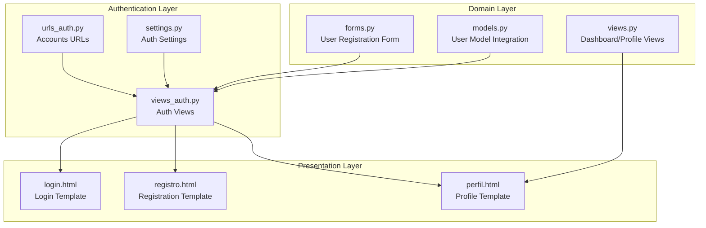
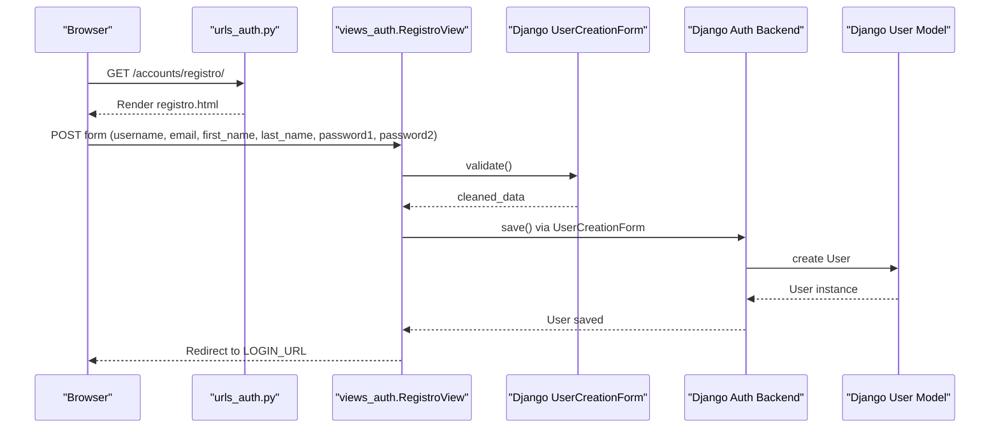
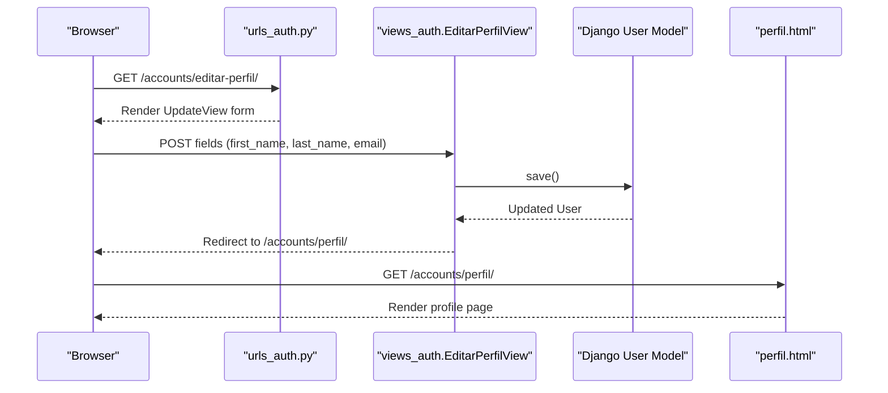
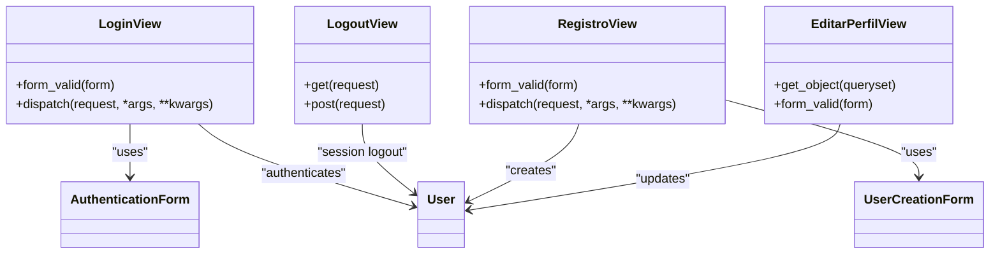
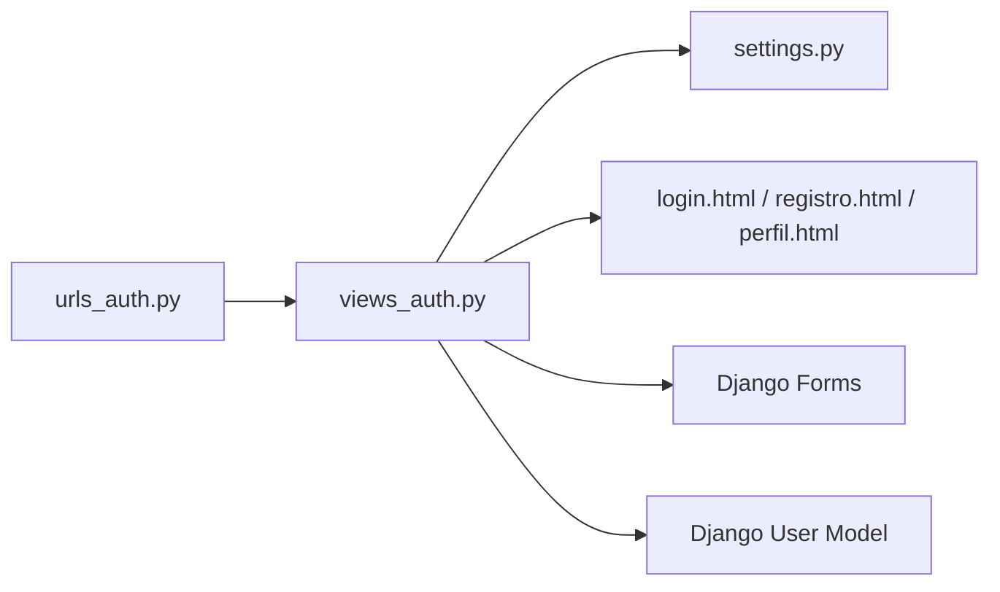

# User Management

<cite>
**Referenced Files in This Document**
- [views_auth.py](file://turnos/views_auth.py)
- [urls_auth.py](file://turnos/urls_auth.py)
- [settings.py](file://proyecto_turnos/settings.py)
- [login.html](file://turnos/templates/accounts/login.html)
- [registro.html](file://turnos/templates/accounts/registro.html)
- [perfil.html](file://turnos/templates/accounts/perfil.html)
- [models.py](file://turnos/models.py)
- [forms.py](file://turnos/forms.py)
- [views.py](file://turnos/views.py)
</cite>

## Table of Contents
1. [Introduction](#introduction)
2. [Project Structure](#project-structure)
3. [Core Components](#core-components)
4. [Architecture Overview](#architecture-overview)
5. [Detailed Component Analysis](#detailed-component-analysis)
6. [Dependency Analysis](#dependency-analysis)
7. [Performance Considerations](#performance-considerations)
8. [Troubleshooting Guide](#troubleshooting-guide)
9. [Conclusion](#conclusion)

## Introduction
This document explains the user management functionality of the application, focusing on user registration, profile editing, and user data handling. It covers the end-to-end flow from form submission to user creation, profile updates, and validation. It also documents the integration with Django’s built-in User model, form handling, and template rendering. Security, input sanitization, and error handling are addressed throughout.

## Project Structure
User management spans several modules:
- URLs define routes under the accounts namespace.
- Views handle authentication logic and profile updates.
- Templates render login, registration, and profile pages.
- Settings configure authentication defaults and redirects.
- Forms and models support validation and persistence.

**Diagram sources**
- [urls_auth.py:1-21](file://turnos/urls_auth.py#L1-L21)
- [views_auth.py:1-149](file://turnos/views_auth.py#L1-L149)
- [settings.py:121-123](file://proyecto_turnos/settings.py#L121-L123)
- [login.html:1-143](file://turnos/templates/accounts/login.html#L1-L143)
- [registro.html:1-227](file://turnos/templates/accounts/registro.html#L1-L227)
- [perfil.html:1-191](file://turnos/templates/accounts/perfil.html#L1-L191)
- [forms.py:1-800](file://turnos/forms.py#L1-L800)
- [models.py:1-825](file://turnos/models.py#L1-L825)
- [views.py:52-95](file://turnos/views.py#L52-L95)

**Section sources**
- [urls_auth.py:1-21](file://turnos/urls_auth.py#L1-L21)
- [views_auth.py:1-149](file://turnos/views_auth.py#L1-L149)
- [settings.py:121-123](file://proyecto_turnos/settings.py#L121-L123)
- [login.html:1-143](file://turnos/templates/accounts/login.html#L1-L143)
- [registro.html:1-227](file://turnos/templates/accounts/registro.html#L1-L227)
- [perfil.html:1-191](file://turnos/templates/accounts/perfil.html#L1-L191)
- [forms.py:1-800](file://turnos/forms.py#L1-L800)
- [models.py:1-825](file://turnos/models.py#L1-L825)
- [views.py:52-95](file://turnos/views.py#L52-L95)

## Core Components
- Authentication views:
  - LoginView handles credentials, session creation, and redirection.
  - LogoutView manages session termination.
  - RegistroView uses Django’s UserCreationForm to create users.
  - EditarPerfilView updates current user’s first_name, last_name, and email via UpdateView.
- URL routing:
  - Accounts namespace routes for login, logout, registration, password reset/change, and profile edit.
- Templates:
  - Login and registration forms with CSRF protection and validation feedback.
  - Profile page displaying user info, stats, and preferences.
- Settings:
  - LOGIN_URL, LOGIN_REDIRECT_URL, LOGOUT_REDIRECT_URL control auth behavior.
  - AUTH_PASSWORD_VALIDATORS enforce strong passwords.
- Forms and models:
  - Registration leverages Django’s built-in User model and form.
  - Profile update targets the same model fields.

**Section sources**
- [views_auth.py:24-89](file://turnos/views_auth.py#L24-L89)
- [views_auth.py:92-106](file://turnos/views_auth.py#L92-L106)
- [urls_auth.py:9-20](file://turnos/urls_auth.py#L9-L20)
- [settings.py:121-123](file://proyecto_turnos/settings.py#L121-L123)
- [settings.py:79-95](file://proyecto_turnos/settings.py#L79-L95)
- [login.html:35-91](file://turnos/templates/accounts/login.html#L35-L91)
- [registro.html:29-205](file://turnos/templates/accounts/registro.html#L29-L205)
- [perfil.html:12-152](file://turnos/templates/accounts/perfil.html#L12-L152)

## Architecture Overview
The user management flow integrates Django’s auth system with custom views and templates. The diagram below maps the major components and their interactions during registration and profile editing.

**Diagram sources**
- [urls_auth.py:12](file://turnos/urls_auth.py#L12)
- [views_auth.py:70-84](file://turnos/views_auth.py#L70-L84)
- [registro.html:29-205](file://turnos/templates/accounts/registro.html#L29-L205)

**Diagram sources**
- [urls_auth.py:19](file://turnos/urls_auth.py#L19)
- [views_auth.py:92-106](file://turnos/views_auth.py#L92-L106)
- [perfil.html:12-152](file://turnos/templates/accounts/perfil.html#L12-L152)

## Detailed Component Analysis

### Authentication Views
- LoginView
  - Uses Django’s AuthenticationForm.
  - Authenticates credentials, logs the user in, sets success/error messages, and redirects to next or dashboard.
  - Prevents authenticated users from accessing login again.
- LogoutView
  - Clears session and redirects to login.
- RegistroView
  - Uses Django’s UserCreationForm.
  - Saves the user and redirects to login with a success message.
  - Prevents authenticated users from accessing registration.
- EditarPerfilView
  - LoginRequiredMixin ensures only logged-in users can edit.
  - Updates first_name, last_name, and email via UpdateView.
  - Redirects to profile page and displays success messages.

Security and validation highlights:
- CSRF protection is enforced by Django’s form rendering and middleware.
- Password strength is validated by AUTH_PASSWORD_VALIDATORS.
- User uniqueness and constraints are handled by Django’s User model and form validation.

**Section sources**
- [views_auth.py:24-56](file://turnos/views_auth.py#L24-L56)
- [views_auth.py:58-68](file://turnos/views_auth.py#L58-L68)
- [views_auth.py:70-89](file://turnos/views_auth.py#L70-L89)
- [views_auth.py:92-106](file://turnos/views_auth.py#L92-L106)
- [settings.py:79-95](file://proyecto_turnos/settings.py#L79-L95)

### URL Routing for Accounts
- Namespaced under accounts.
- Routes include login, logout, registration, password reset/change, and profile edit.

**Section sources**
- [urls_auth.py:9-20](file://turnos/urls_auth.py#L9-L20)

### Templates and Forms
- Login template
  - Renders AuthenticationForm fields with validation feedback.
  - Includes CSRF token and optional “remember me” checkbox.
- Registration template
  - Renders UserCreationForm fields: username, email, first_name, last_name, password1, password2, plus a terms acceptance checkbox.
  - Provides inline hints and error display.
- Profile template
  - Displays user avatar, roles, contact info, stats, recent activity, and preferences form.

Validation patterns:
- Form fields render errors via Bootstrap classes (is-invalid) and messages.
- Terms acceptance is required for registration.
- Password minimum length and complexity are enforced by settings.

**Section sources**
- [login.html:35-91](file://turnos/templates/accounts/login.html#L35-L91)
- [registro.html:29-205](file://turnos/templates/accounts/registro.html#L29-L205)
- [perfil.html:12-152](file://turnos/templates/accounts/perfil.html#L12-L152)
- [settings.py:79-95](file://proyecto_turnos/settings.py#L79-L95)

### User Data Handling and Validation
- Registration
  - Uses Django’s UserCreationForm to validate uniqueness and password policies.
  - On success, the user is persisted and redirected to login.
- Profile Editing
  - EditarPerfilView updates first_name, last_name, and email.
  - The profile page aggregates stats and preferences for display.
- Settings Integration
  - LOGIN_URL, LOGIN_REDIRECT_URL, LOGOUT_REDIRECT_URL govern navigation after auth actions.
  - AUTH_PASSWORD_VALIDATORS ensure secure password creation.

Data integrity:
- Django’s User model enforces unique username and email constraints.
- Password validation is centralized in AUTH_PASSWORD_VALIDATORS.

**Section sources**
- [views_auth.py:70-84](file://turnos/views_auth.py#L70-L84)
- [views_auth.py:92-106](file://turnos/views_auth.py#L92-L106)
- [settings.py:121-123](file://proyecto_turnos/settings.py#L121-L123)
- [settings.py:79-95](file://proyecto_turnos/settings.py#L79-L95)
- [perfil.html:12-152](file://turnos/templates/accounts/perfil.html#L12-L152)

### Class Relationships

**Diagram sources**
- [views_auth.py:24-56](file://turnos/views_auth.py#L24-L56)
- [views_auth.py:58-68](file://turnos/views_auth.py#L58-L68)
- [views_auth.py:70-89](file://turnos/views_auth.py#L70-L89)
- [views_auth.py:92-106](file://turnos/views_auth.py#L92-L106)

## Dependency Analysis
- URLs depend on views_auth for route resolution.
- Views depend on Django’s User model and forms.
- Templates depend on context provided by views and global settings.
- Settings influence redirects and password policies.

**Diagram sources**
- [urls_auth.py:1-21](file://turnos/urls_auth.py#L1-L21)
- [views_auth.py:1-149](file://turnos/views_auth.py#L1-L149)
- [settings.py:121-123](file://proyecto_turnos/settings.py#L121-L123)
- [login.html:1-143](file://turnos/templates/accounts/login.html#L1-L143)
- [registro.html:1-227](file://turnos/templates/accounts/registro.html#L1-L227)
- [perfil.html:1-191](file://turnos/templates/accounts/perfil.html#L1-L191)

**Section sources**
- [urls_auth.py:1-21](file://turnos/urls_auth.py#L1-L21)
- [views_auth.py:1-149](file://turnos/views_auth.py#L1-L149)
- [settings.py:121-123](file://proyecto_turnos/settings.py#L121-L123)

## Performance Considerations
- Use generic views (FormView, UpdateView) to minimize boilerplate and reduce latency.
- Keep form validations lightweight; rely on Django’s built-in validators to avoid redundant checks.
- Redirect after POST to prevent duplicate submissions and improve perceived performance.
- Leverage browser caching for static assets and ensure efficient template rendering.

## Troubleshooting Guide
Common issues and resolutions:
- Login fails with invalid credentials
  - Verify AuthenticationForm validation and that user exists with correct password.
  - Check LOGIN_URL and session middleware configuration.
- Registration does not create user
  - Confirm UserCreationForm validation passes and no duplicate username/email.
  - Review AUTH_PASSWORD_VALIDATORS and ensure passwords meet requirements.
- Profile update has no effect
  - Ensure EditarPerfilView fields match model fields and user is authenticated.
  - Verify success_url and redirect behavior.
- Template errors
  - Ensure CSRF token is present in forms.
  - Confirm context processors and template paths are configured.

**Section sources**
- [views_auth.py:30-49](file://turnos/views_auth.py#L30-L49)
- [views_auth.py:76-83](file://turnos/views_auth.py#L76-L83)
- [views_auth.py:103-105](file://turnos/views_auth.py#L103-L105)
- [login.html:35-91](file://turnos/templates/accounts/login.html#L35-L91)
- [registro.html:29-205](file://turnos/templates/accounts/registro.html#L29-L205)

## Conclusion
The user management subsystem integrates Django’s authentication framework with custom views and templates to provide a secure, user-friendly experience. Registration, login/logout, and profile editing are handled consistently with Django’s built-in forms and model validation, while settings and redirects ensure predictable navigation. The design emphasizes clarity, security, and maintainability.