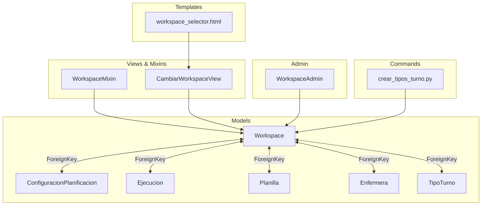
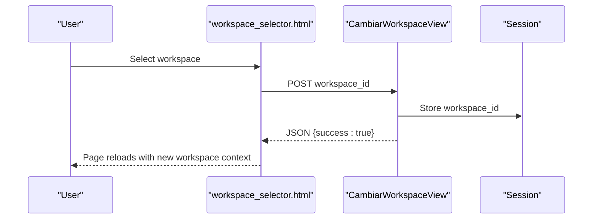
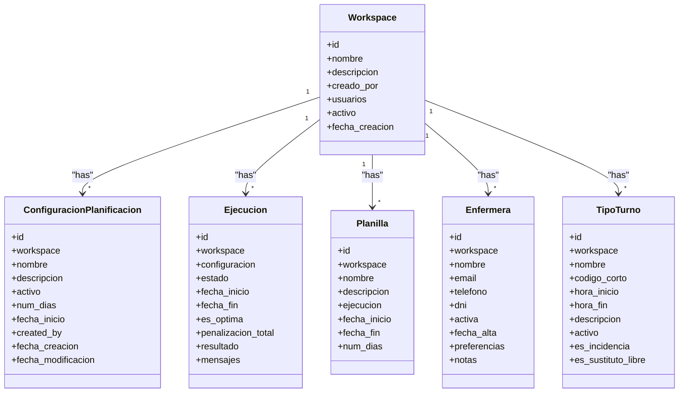
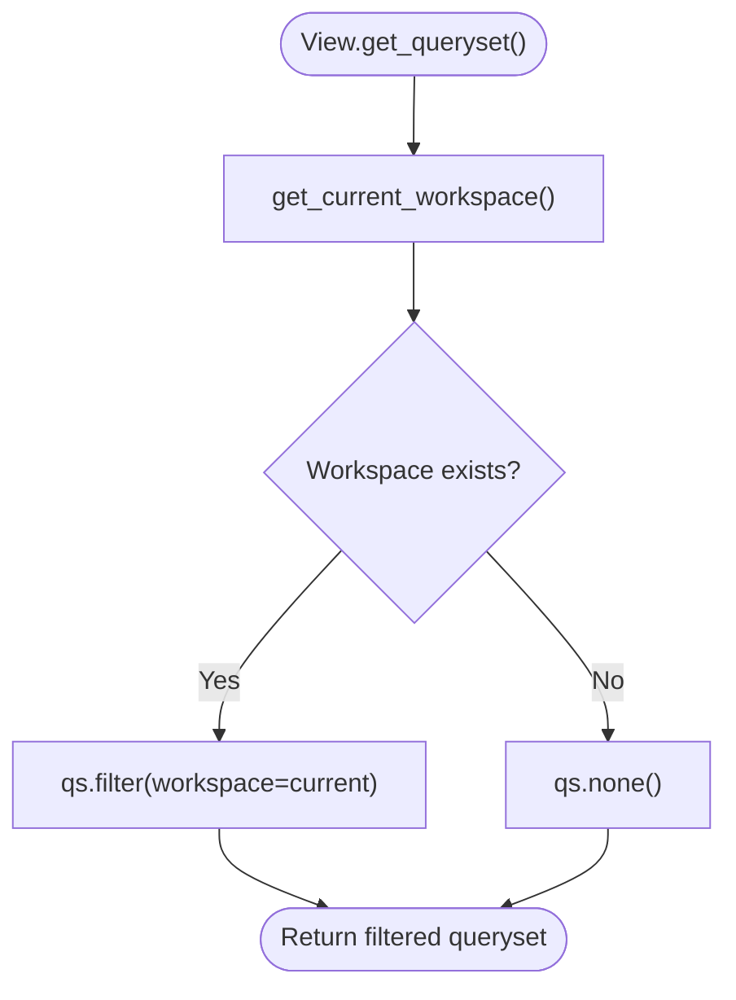
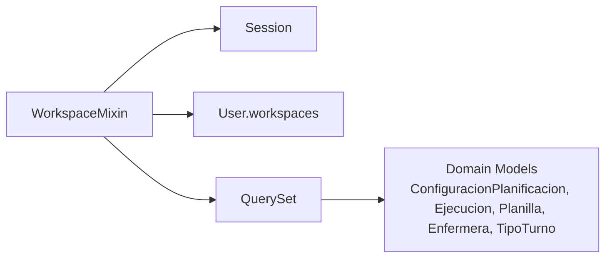

# Workspace Isolation

<cite>
**Referenced Files in This Document**
- [models.py](file://turnos/models.py)
- [views.py](file://turnos/views.py)
- [mixins.py](file://turnos/mixins.py)
- [decorators.py](file://turnos/decorators.py)
- [admin.py](file://turnos/admin.py)
- [urls.py](file://turnos/urls.py)
- [workspace_selector.html](file://turnos/templates/includes/workspace_selector.html)
- [crear_tipos_turno.py](file://turnos/management/commands/crear_tipos_turno.py)
- [0003_alter_configuracionplanificacion_num_dias_workspace_and_more.py](file://turnos/migrations/0003_alter_configuracionplanificacion_num_dias_workspace_and_more.py)
</cite>

## Table of Contents
1. [Introduction](#introduction)
2. [Project Structure](#project-structure)
3. [Core Components](#core-components)
4. [Architecture Overview](#architecture-overview)
5. [Detailed Component Analysis](#detailed-component-analysis)
6. [Dependency Analysis](#dependency-analysis)
7. [Performance Considerations](#performance-considerations)
8. [Troubleshooting Guide](#troubleshooting-guide)
9. [Conclusion](#conclusion)

## Introduction
This document explains the multi-workspace architecture and data isolation mechanisms implemented in the application. It covers how users are associated with specific workspaces, how workspace selection and switching works, and how data segregation is enforced across workspaces. It also documents the WorkspaceMixin implementation, decorator-based workspace validation, model-level workspace filtering, workspace permissions and membership, cross-workspace access prevention, workspace creation, user invitation processes, and workspace administration capabilities.

## Project Structure
The workspace feature spans models, views, mixins, decorators, admin configuration, URL routing, templates, and management commands. The core idea is to attach domain entities to a Workspace and enforce isolation via session-scoped current workspace selection.

**Diagram sources**
- [models.py:12-825](file://turnos/models.py#L12-L825)
- [views.py:2079-2100](file://turnos/views.py#L2079-L2100)
- [workspace_selector.html:1-18](file://turnos/templates/includes/workspace_selector.html#L1-L18)
- [admin.py:270-276](file://turnos/admin.py#L270-L276)
- [crear_tipos_turno.py:1-345](file://turnos/management/commands/crear_tipos_turno.py#L1-L345)

**Section sources**
- [models.py:12-825](file://turnos/models.py#L12-L825)
- [views.py:2079-2100](file://turnos/views.py#L2079-L2100)
- [workspace_selector.html:1-18](file://turnos/templates/includes/workspace_selector.html#L1-L18)
- [admin.py:270-276](file://turnos/admin.py#L270-L276)
- [crear_tipos_turno.py:1-345](file://turnos/management/commands/crear_tipos_turno.py#L1-L345)

## Core Components
- Workspace model: central entity for data isolation, linking users and domain objects.
- Domain models: ConfiguracionPlanificacion, Ejecucion, Planilla, Enfermera, TipoTurno, and others are linked to a Workspace.
- WorkspaceMixin: filters querysets by the current workspace derived from the user’s session and membership.
- Workspace selector UI: allows users to switch workspaces.
- Workspace switching view: updates the session workspace.
- Admin configuration: WorkspaceAdmin supports managing members and activation.
- Management command: creates standard and custom turn types scoped to a workspace.

**Section sources**
- [models.py:12-825](file://turnos/models.py#L12-L825)
- [views.py:2079-2100](file://turnos/views.py#L2079-L2100)
- [workspace_selector.html:1-18](file://turnos/templates/includes/workspace_selector.html#L1-L18)
- [admin.py:270-276](file://turnos/admin.py#L270-L276)
- [crear_tipos_turno.py:1-345](file://turnos/management/commands/crear_tipos_turno.py#L1-L345)

## Architecture Overview
The system enforces data isolation by associating domain entities with a Workspace and applying a WorkspaceMixin to views to constrain queries to the current workspace. Users select a workspace via a dropdown that posts to a dedicated view, persisting the choice in the session.

**Diagram sources**
- [workspace_selector.html:1-18](file://turnos/templates/includes/workspace_selector.html#L1-L18)
- [views.py:2094-2100](file://turnos/views.py#L2094-L2100)

**Diagram sources**
- [models.py:12-825](file://turnos/models.py#L12-L825)

## Detailed Component Analysis

### Workspace Model and Data Association
- Workspace defines isolation boundaries and links to users via a many-to-many relationship.
- Domain models include a workspace foreign key to ensure all persisted data belongs to a single workspace.
- Unique constraints on TipoTurno prevent duplicate names/codes within a workspace.

**Section sources**
- [models.py:12-825](file://turnos/models.py#L12-L825)

### WorkspaceMixin Implementation
- Provides a get_current_workspace() method that reads workspace_id from the session and validates membership.
- Overrides get_queryset() to filter by the current workspace, returning an empty queryset if no workspace is selected.

**Diagram sources**
- [views.py:2079-2092](file://turnos/views.py#L2079-L2092)

**Section sources**
- [views.py:2079-2092](file://turnos/views.py#L2079-L2092)

### Workspace Selection and Switching
- The template workspace_selector.html renders a dropdown populated from the user’s workspaces.
- On change, it posts to the CambiarWorkspaceView endpoint, which validates membership and stores the workspace_id in the session.
- The view responds with JSON and triggers a page reload to apply the new context.

**Section sources**
- [workspace_selector.html:1-18](file://turnos/templates/includes/workspace_selector.html#L1-L18)
- [views.py:2094-2100](file://turnos/views.py#L2094-L2100)

### Model-Level Workspace Filtering
- Views inheriting from WorkspaceMixin automatically restrict returned objects to the current workspace.
- This ensures cross-workspace access is prevented by default.

**Section sources**
- [views.py:2079-2092](file://turnos/views.py#L2079-L2092)

### Decorator-Based Workspace Validation
- While there is no dedicated workspace decorator, the WorkspaceMixin pattern is analogous to decorators in that it injects workspace-aware behavior into views.
- OwnerRequiredMixin and similar mixins demonstrate the pattern of validating access based on request context and object ownership.

**Section sources**
- [mixins.py:33-47](file://turnos/mixins.py#L33-L47)
- [views.py:2079-2092](file://turnos/views.py#L2079-L2092)

### Cross-Workspace Access Prevention
- WorkspaceMixin.get_queryset() returns qs.none() when no workspace is set, preventing accidental exposure of unrelated data.
- Membership checks ensure only user-associated workspaces can be selected.

**Section sources**
- [views.py:2079-2092](file://turnos/views.py#L2079-L2092)

### Workspace Permissions and User Membership
- Workspace membership is enforced by requiring that the selected workspace_id exists in the user’s workspaces.
- Admin configuration exposes WorkspaceAdmin with a filterable member list for management.

**Section sources**
- [views.py:2080-2084](file://turnos/views.py#L2080-L2084)
- [admin.py:270-276](file://turnos/admin.py#L270-L276)

### Workspace Creation and Administration
- Workspaces are created by users and associated with the creator.
- Admin supports listing, filtering, and editing workspace members.
- Management command supports creating standard and custom turn types scoped to a workspace.

**Section sources**
- [models.py:12-27](file://turnos/models.py#L12-L27)
- [admin.py:270-276](file://turnos/admin.py#L270-L276)
- [crear_tipos_turno.py:1-345](file://turnos/management/commands/crear_tipos_turno.py#L1-L345)

### User Invitation Processes
- Membership is managed via WorkspaceAdmin’s filterable member list.
- There is no dedicated invitation endpoint in the provided code; membership is controlled by administrators.

**Section sources**
- [admin.py:270-276](file://turnos/admin.py#L270-L276)

### Data Migration and Schema Evolution
- Initial migration introduces Workspace and adds workspace foreign keys to domain models.
- This establishes the foundation for multi-workspace isolation.

**Section sources**
- [0003_alter_configuracionplanificacion_num_dias_workspace_and_more.py:16-41](file://turnos/migrations/0003_alter_configuracionplanificacion_num_dias_workspace_and_more.py#L16-L41)

## Dependency Analysis
WorkspaceMixin depends on:
- Session-stored workspace_id for current context.
- User membership verification against Workspace.users.
- Domain models’ workspace foreign keys for filtering.

**Diagram sources**
- [views.py:2079-2092](file://turnos/views.py#L2079-L2092)
- [models.py:12-825](file://turnos/models.py#L12-L825)

**Section sources**
- [views.py:2079-2092](file://turnos/views.py#L2079-L2092)
- [models.py:12-825](file://turnos/models.py#L12-L825)

## Performance Considerations
- WorkspaceMixin filters at the database level via qs.filter(workspace=current), minimizing Python-side filtering overhead.
- Using session storage for workspace_id avoids repeated database lookups for membership validation.
- Ensure proper indexing on workspace foreign keys and user membership fields for optimal query performance.

## Troubleshooting Guide
- If a user cannot see data after switching workspaces, verify that the workspace_id is stored in the session and that the user belongs to the selected workspace.
- If a view returns empty results unexpectedly, confirm that the view inherits from WorkspaceMixin and that the mixin’s get_queryset() is invoked.
- If membership appears incorrect in admin, review WorkspaceAdmin’s filter_horizontal configuration and ensure the user is included in the workspace’s users.

**Section sources**
- [views.py:2079-2092](file://turnos/views.py#L2079-L2092)
- [admin.py:270-276](file://turnos/admin.py#L270-L276)

## Conclusion
The application implements robust multi-workspace isolation by associating domain entities with a Workspace and enforcing access via a WorkspaceMixin that filters querysets based on the current workspace derived from the user’s session and membership. The workspace selector UI and dedicated switching view streamline user-driven workspace selection, while admin and management tools support workspace administration and configuration. Together, these components prevent cross-workspace access and provide a clear, maintainable isolation boundary.