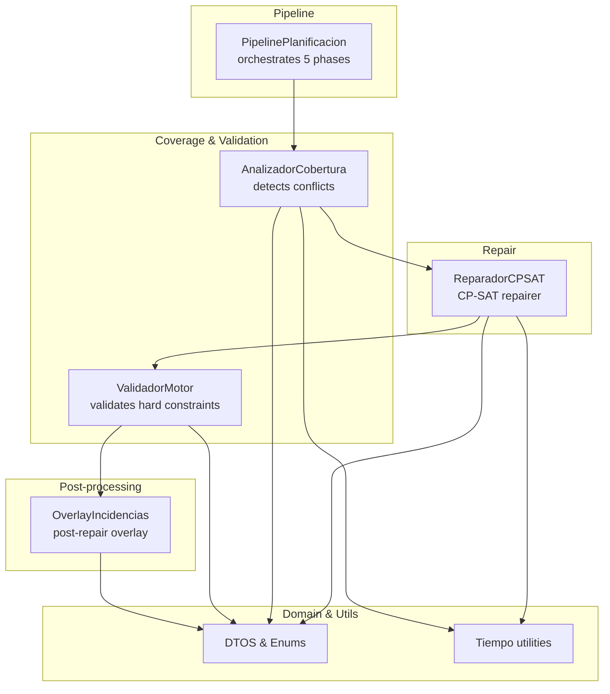
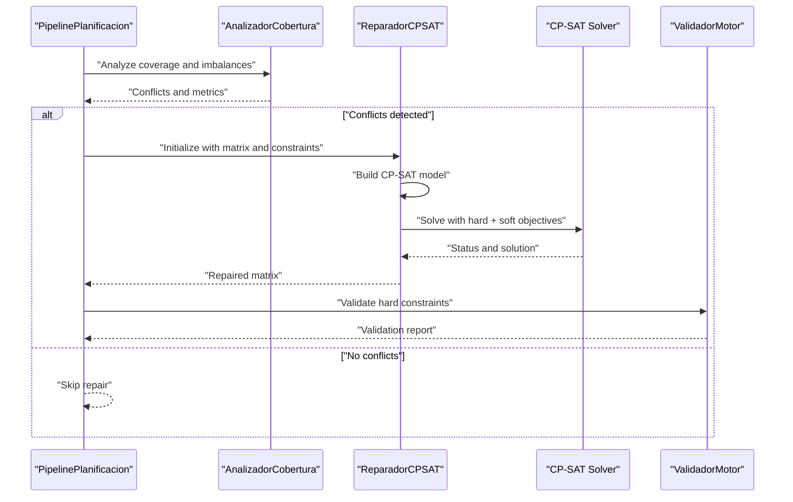
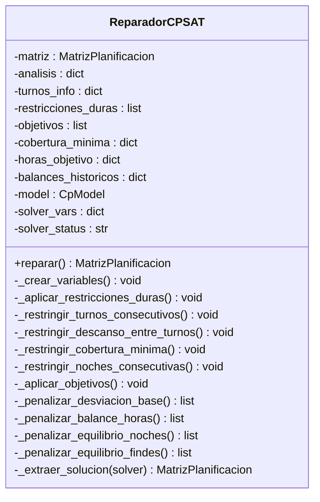
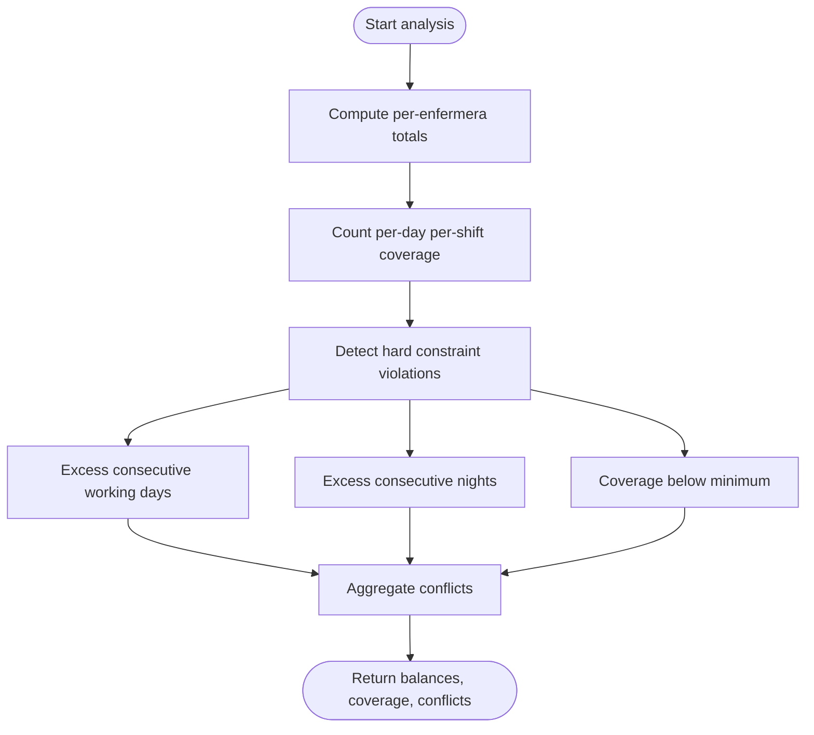
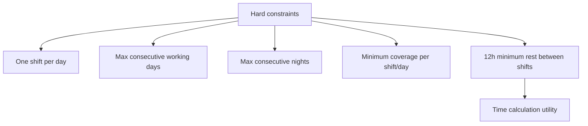
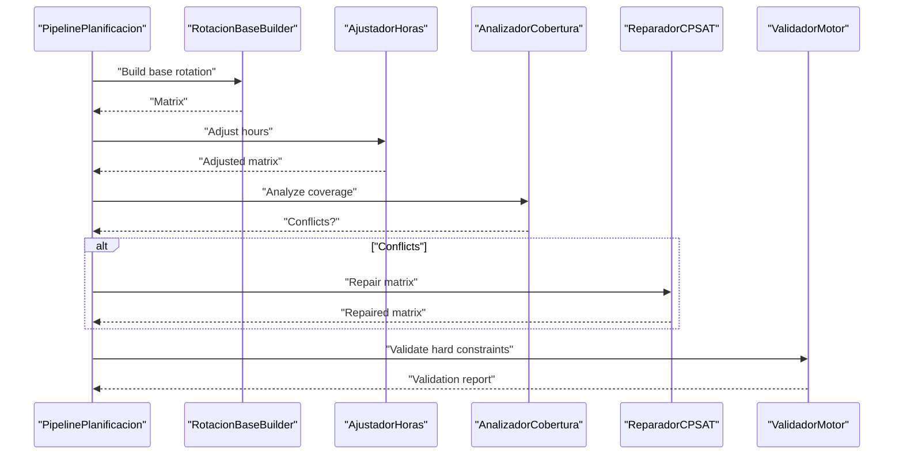
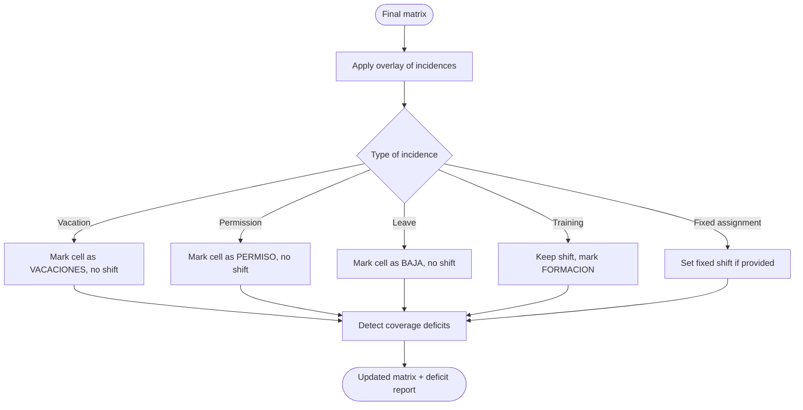
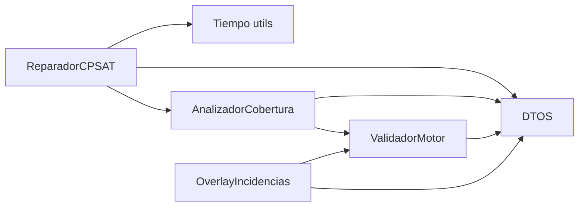

# Constraint Repair

<cite>
**Referenced Files in This Document**
- [reparador.py](file://turnos/motor/reparador.py)
- [pipeline.py](file://turnos/motor/pipeline.py)
- [cobertura.py](file://turnos/motor/cobertura.py)
- [validador_motor.py](file://turnos/motor/validador_motor.py)
- [overlay_incidencias.py](file://turnos/motor/overlay_incidencias.py)
- [dtos.py](file://turnos/dominio/dtos.py)
- [tiempo.py](file://turnos/utils/tiempo.py)
- [test_reparador.py](file://turnos/tests/test_motor/test_reparador.py)
- [test_pipeline.py](file://turnos/tests/test_motor/test_pipeline.py)
- [restricciones_duras.py](file://turnos/restricciones_duras.py)
- [restricciones_blandas.py](file://turnos/restricciones_blandas.py)
- [resolvedor.py](file://turnos/resolvedor.py)
</cite>

## Table of Contents
1. [Introduction](#introduction)
2. [Project Structure](#project-structure)
3. [Core Components](#core-components)
4. [Architecture Overview](#architecture-overview)
5. [Detailed Component Analysis](#detailed-component-analysis)
6. [Dependency Analysis](#dependency-analysis)
7. [Performance Considerations](#performance-considerations)
8. [Troubleshooting Guide](#troubleshooting-guide)
9. [Conclusion](#conclusion)

## Introduction
This document explains the constraint repair system that detects conflicts and repairs infeasibilities in the nursing shift scheduling solution. It focuses on the CP-SAT-based repair module, conflict detection mechanisms, hard and soft constraint handling, and the integration with the overall pipeline orchestration. It also covers repair hierarchy, priorities among constraint types, and how repairs contribute to solution convergence.

## Project Structure
The constraint repair system spans several modules:
- Pipeline orchestrator that sequences generation, adjustment, coverage analysis, and optional repair
- Coverage analyzer that detects hard constraint violations and soft constraint imbalances
- CP-SAT repairer that minimizes deviations from the base rotation while satisfying hard constraints
- Validator that ensures hard constraints are satisfied after repair
- Overlay system for applying incidences post-repair
- Supporting utilities for time calculations and constraint definitions

**Diagram sources**
- [pipeline.py:92-234](file://turnos/motor/pipeline.py#L92-L234)
- [cobertura.py:46-73](file://turnos/motor/cobertura.py#L46-L73)
- [reparador.py:63-96](file://turnos/motor/reparador.py#L63-L96)
- [validador_motor.py:48-86](file://turnos/motor/validador_motor.py#L48-L86)
- [overlay_incidencias.py:45-75](file://turnos/motor/overlay_incidencias.py#L45-L75)
- [dtos.py:22-237](file://turnos/dominio/dtos.py#L22-L237)
- [tiempo.py:8-31](file://turnos/utils/tiempo.py#L8-L31)

**Section sources**
- [pipeline.py:31-234](file://turnos/motor/pipeline.py#L31-L234)
- [cobertura.py:21-73](file://turnos/motor/cobertura.py#L21-L73)
- [reparador.py:24-96](file://turnos/motor/reparador.py#L24-L96)
- [validador_motor.py:23-86](file://turnos/motor/validador_motor.py#L23-L86)
- [overlay_incidencias.py:24-75](file://turnos/motor/overlay_incidencias.py#L24-L75)
- [dtos.py:22-237](file://turnos/dominio/dtos.py#L22-L237)
- [tiempo.py:8-31](file://turnos/utils/tiempo.py#L8-L31)

## Core Components
- ReparadorCPSAT: Builds a CP-SAT model with hard constraints and weighted soft objectives, then repairs conflicts by minimizing deviations from the base rotation while preserving hard constraints.
- AnalizadorCobertura: Computes per-enfermera balances, per-day per-shift coverage counts, and detects hard constraint violations (coverage shortfalls, consecutive shifts, consecutive nights).
- ValidadorMotor: Final verification of hard constraints (no violations), quality metrics, and data integrity after repair.
- PipelinePlanificacion: Orchestrates the five-phase pipeline: base rotation → hours adjustment → coverage analysis → optional CP-SAT repair → validation.
- OverlayIncidencias: Post-repair overlay of incidences (vacations, permissions, etc.) that do not affect solver generation.

Key behaviors:
- Hard constraints are enforced by the solver and validator; violations are reported as errors.
- Soft constraints are encoded as weighted penalties in the objective; higher weights prioritize preservation of base rotation and equity.
- Repair is invoked only when coverage analysis detects conflicts.

**Section sources**
- [reparador.py:24-96](file://turnos/motor/reparador.py#L24-L96)
- [cobertura.py:46-73](file://turnos/motor/cobertura.py#L46-L73)
- [validador_motor.py:48-86](file://turnos/motor/validador_motor.py#L48-L86)
- [pipeline.py:92-234](file://turnos/motor/pipeline.py#L92-L234)
- [overlay_incidencias.py:45-75](file://turnos/motor/overlay_incidencias.py#L45-L75)

## Architecture Overview
The repair system operates as follows:
- Base rotation is generated deterministically.
- Hours adjustment may modify assignments to meet contractual targets.
- Coverage analysis checks hard constraints and computes soft constraint imbalances.
- If conflicts are detected, CP-SAT repairer constructs a model with:
  - Boolean variables for each (enfermera, fecha, turno) assignment plus a special LIBRE sentinel.
  - Hard constraints: one shift per day, consecutive shift limits, consecutive night limits, minimum coverage per shift/day, and 12-hour rest between shifts.
  - Soft objectives: minimize deviation from base rotation, balance monthly hours, equalize nights, and equalize weekends.
- After solving, the validator ensures no hard constraint violations remain.

**Diagram sources**
- [pipeline.py:107-200](file://turnos/motor/pipeline.py#L107-L200)
- [cobertura.py:46-73](file://turnos/motor/cobertura.py#L46-L73)
- [reparador.py:63-96](file://turnos/motor/reparador.py#L63-L96)
- [validador_motor.py:48-86](file://turnos/motor/validador_motor.py#L48-L86)

## Detailed Component Analysis

### ReparadorCPSAT: CP-SAT Repair Engine
Responsibilities:
- Construct CP-SAT variables for all cells, including a LIBRE sentinel.
- Enforce hard constraints:
  - One shift per day per nurse.
  - Maximum consecutive working days.
  - Maximum consecutive nights.
  - Minimum coverage per shift per day.
  - 12-hour minimum rest between shifts (using precise time calculations).
- Encode soft objectives with weighted penalties:
  - Base rotation deviation (highest weight).
  - Monthly hours balance.
  - Night workload equality.
  - Weekend workload equality.
- Extract solution and update matrix, respecting LIBRE sentinel semantics.

**Diagram sources**
- [reparador.py:24-609](file://turnos/motor/reparador.py#L24-L609)

Key implementation notes:
- Variables include a LIBRE sentinel to allow cells to remain free.
- Hard constraints are derived from configuration and analyzed coverage.
- Soft objective weights prioritize base rotation preservation over other soft goals.
- Solution extraction respects the LIBRE sentinel and TurnoInfo lookups.

**Section sources**
- [reparador.py:63-96](file://turnos/motor/reparador.py#L63-L96)
- [reparador.py:97-132](file://turnos/motor/reparador.py#L97-L132)
- [reparador.py:133-296](file://turnos/motor/reparador.py#L133-L296)
- [reparador.py:297-334](file://turnos/motor/reparador.py#L297-L334)
- [reparador.py:336-374](file://turnos/motor/reparador.py#L336-L374)
- [reparador.py:376-446](file://turnos/motor/reparador.py#L376-L446)
- [reparador.py:448-508](file://turnos/motor/reparador.py#L448-L508)
- [reparador.py:510-578](file://turnos/motor/reparador.py#L510-L578)
- [reparador.py:581-609](file://turnos/motor/reparador.py#L581-L609)

### Conflict Detection: AnalizadorCobertura
Responsibilities:
- Compute per-enfermera totals (hours, nights, weekend days).
- Count per-day per-shift coverage.
- Detect hard constraint violations:
  - Coverage below minimum thresholds.
  - Excessive consecutive working days.
  - Excessive consecutive nights.
- Report conflicts and presence flag for downstream repair decisions.

**Diagram sources**
- [cobertura.py:46-73](file://turnos/motor/cobertura.py#L46-L73)
- [cobertura.py:139-161](file://turnos/motor/cobertura.py#L139-L161)
- [cobertura.py:163-184](file://turnos/motor/cobertura.py#L163-L184)
- [cobertura.py:186-207](file://turnos/motor/cobertura.py#L186-L207)

**Section sources**
- [cobertura.py:46-73](file://turnos/motor/cobertura.py#L46-L73)
- [cobertura.py:139-207](file://turnos/motor/cobertura.py#L139-L207)

### Hard Constraints: Definitions and Application
Hard constraints are enforced both by the CP-SAT model and by the final validator:
- One shift per day per nurse.
- Maximum consecutive working days.
- Maximum consecutive nights.
- Minimum coverage per shift per day.
- 12-hour minimum rest between shifts (computed precisely using TurnoInfo time spans).

**Diagram sources**
- [reparador.py:133-296](file://turnos/motor/reparador.py#L133-L296)
- [reparador.py:193-238](file://turnos/motor/reparador.py#L193-L238)
- [validador_motor.py:88-104](file://turnos/motor/validador_motor.py#L88-L104)
- [validador_motor.py:164-202](file://turnos/motor/validador_motor.py#L164-L202)
- [tiempo.py:8-31](file://turnos/utils/tiempo.py#L8-L31)

**Section sources**
- [reparador.py:133-296](file://turnos/motor/reparador.py#L133-L296)
- [validador_motor.py:88-202](file://turnos/motor/validador_motor.py#L88-L202)
- [tiempo.py:8-31](file://turnos/utils/tiempo.py#L8-L31)

### Soft Constraints and Objective Priorities
Soft constraints are encoded as weighted penalties:
- Base rotation deviation: highest weight (500).
- Monthly hours balance: weight 5.
- Night workload equality: weight 5.
- Weekend workload equality: weight 3.

These weights ensure the solver prefers maintaining the base rotation pattern over other soft goals, reducing unnecessary churn.

**Section sources**
- [reparador.py:297-334](file://turnos/motor/reparador.py#L297-L334)
- [reparador.py:336-374](file://turnos/motor/reparador.py#L336-L374)
- [reparador.py:376-446](file://turnos/motor/reparador.py#L376-L446)
- [reparador.py:448-508](file://turnos/motor/reparador.py#L448-L508)
- [reparador.py:510-578](file://turnos/motor/reparador.py#L510-L578)

### Pipeline Orchestration and Repair Invocation
The pipeline executes five phases:
1. Base rotation construction.
2. Hours adjustment to meet contractual targets.
3. Coverage analysis and conflict detection.
4. Optional CP-SAT repair if conflicts are found.
5. Final validation of hard constraints.

**Diagram sources**
- [pipeline.py:107-234](file://turnos/motor/pipeline.py#L107-L234)

**Section sources**
- [pipeline.py:92-234](file://turnos/motor/pipeline.py#L92-L234)

### Post-Repair Overlay of Incidences
After the solver completes, overlays can be applied to reflect real-world events (e.g., vacations, permissions). These overlays do not influence solver generation but adjust the final matrix and detect coverage deficits caused by the overlay.

**Diagram sources**
- [overlay_incidencias.py:45-75](file://turnos/motor/overlay_incidencias.py#L45-L75)
- [overlay_incidencias.py:77-164](file://turnos/motor/overlay_incidencias.py#L77-L164)
- [overlay_incidencias.py:166-204](file://turnos/motor/overlay_incidencias.py#L166-L204)

**Section sources**
- [overlay_incidencias.py:24-204](file://turnos/motor/overlay_incidencias.py#L24-L204)

### Domain Models and Utilities
- DTOS define the core data structures: MatrizPlanificacion, CeldaPlanificacion, TurnoInfo, BalanceEnfermera, and enums for cell types and incidence types.
- Tiempo utilities compute precise rest periods between shifts across midnight boundaries.

**Section sources**
- [dtos.py:22-237](file://turnos/dominio/dtos.py#L22-L237)
- [tiempo.py:8-31](file://turnos/utils/tiempo.py#L8-L31)

## Dependency Analysis
The repair system exhibits clear separation of concerns:
- ReparadorCPSAT depends on:
  - MatrizPlanificacion and TurnoInfo for problem representation.
  - Tiempo utilities for 12-hour rest computations.
  - Configuration-driven hard constraints and soft objectives.
- AnalizadorCobertura depends on MatrizPlanificacion and TurnoInfo to compute balances and coverage.
- ValidadorMotor validates hard constraints against the final matrix and TurnoInfo.
- OverlayIncidencias depends on MatrizPlanificacion and Incidencia to apply post-repair adjustments.

**Diagram sources**
- [reparador.py:9-21](file://turnos/motor/reparador.py#L9-L21)
- [cobertura.py:11-16](file://turnos/motor/cobertura.py#L11-L16)
- [validador_motor.py:11-18](file://turnos/motor/validador_motor.py#L11-L18)
- [overlay_incidencias.py:11-19](file://turnos/motor/overlay_incidencias.py#L11-L19)
- [tiempo.py:5-6](file://turnos/utils/tiempo.py#L5-L6)

**Section sources**
- [reparador.py:9-21](file://turnos/motor/reparador.py#L9-L21)
- [cobertura.py:11-16](file://turnos/motor/cobertura.py#L11-L16)
- [validador_motor.py:11-18](file://turnos/motor/validador_motor.py#L11-L18)
- [overlay_incidencias.py:11-19](file://turnos/motor/overlay_incidencias.py#L11-L19)
- [tiempo.py:5-6](file://turnos/utils/tiempo.py#L5-L6)

## Performance Considerations
- CP-SAT parameters: limited search time and worker threads are configured to balance speed and solution quality.
- Weighted objectives: prioritizing base rotation reduces unnecessary modifications, limiting solver branching.
- Coverage analysis is linear in the number of cells; repair scales with the number of variables and constraints.
- Post-overlay deficit detection is proportional to the number of days and shifts.

Recommendations:
- Tune solver parameters for larger instances.
- Monitor solver status and runtime to assess feasibility and convergence.
- Consider lex-order optimization if strict priority among soft goals is required.

[No sources needed since this section provides general guidance]

## Troubleshooting Guide
Common issues and resolutions:
- No feasible solution found: Verify hard constraints are not overly restrictive; check coverage analysis for excessive violations.
- Unexpected solver status: Inspect solver status mapping and logs; confirm configuration of hard constraints and objective weights.
- Incorrect 12-hour rest enforcement: Ensure TurnoInfo time spans are accurate and that the time utility is used consistently.
- Post-overlay coverage deficits: Review overlay logic and minimum coverage configuration; adjust requirements if necessary.

Validation checklist:
- Hard constraints must be satisfied (no violations).
- Quality warnings should be reviewed for equity imbalances.
- Data integrity: cell types and identifiers must be valid.

**Section sources**
- [reparador.py:82-88](file://turnos/motor/reparador.py#L82-L88)
- [validador_motor.py:57-86](file://turnos/motor/validador_motor.py#L57-L86)
- [overlay_incidencias.py:166-204](file://turnos/motor/overlay_incidencias.py#L166-L204)

## Conclusion
The constraint repair system leverages CP-SAT to repair conflicts while preserving hard constraints and prioritizing base rotation stability. The pipeline’s five-phase orchestration ensures deterministic generation, targeted repair, and rigorous validation. Soft constraints are balanced via weighted penalties, and post-repair overlays capture real-world events without compromising solver integrity. Together, these mechanisms converge toward feasible, equitable, and maintainable schedules.