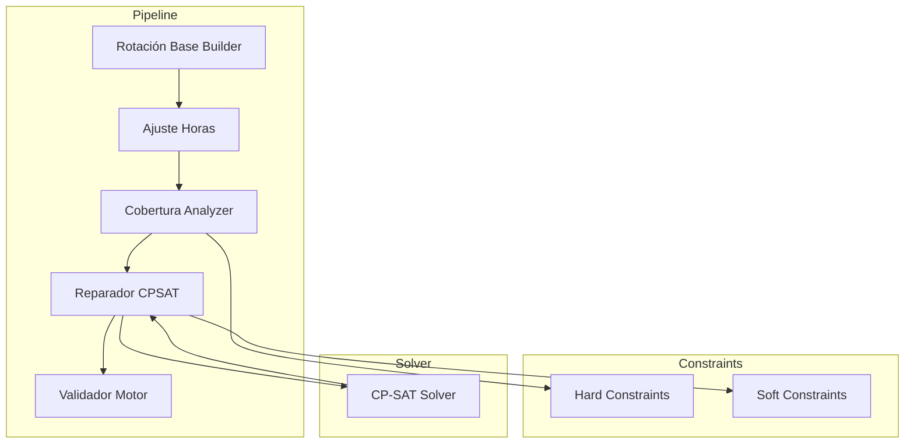
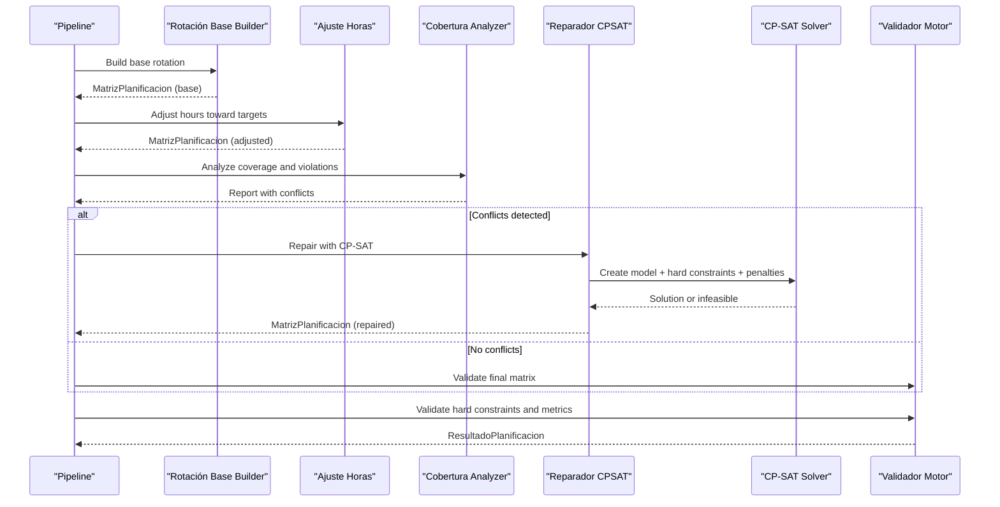
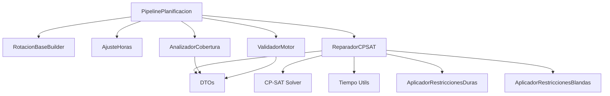

# Constraint System

<cite>
**Referenced Files in This Document**
- [restricciones_duras.py](file://turnos/restricciones_duras.py)
- [restricciones_blandas.py](file://turnos/restricciones_blandas.py)
- [resolvedor.py](file://turnos/resolvedor.py)
- [pipeline.py](file://turnos/motor/pipeline.py)
- [reparador.py](file://turnos/motor/reparador.py)
- [vocabulario.py](file://turnos/dominio/vocabulario.py)
- [normalizacion.py](file://turnos/dominio/normalizacion.py)
- [cobertura.py](file://turnos/motor/cobertura.py)
- [validador_motor.py](file://turnos/motor/validador_motor.py)
- [rotacion_base.py](file://turnos/motor/rotacion_base.py)
- [ajuste_horas.py](file://turnos/motor/ajuste_horas.py)
- [dtos.py](file://turnos/dominio/dtos.py)
- [tiempo.py](file://turnos/utils/tiempo.py)
- [models.py](file://turnos/models.py)
</cite>

## Table of Contents
1. [Introduction](#introduction)
2. [Project Structure](#project-structure)
3. [Core Components](#core-components)
4. [Architecture Overview](#architecture-overview)
5. [Detailed Component Analysis](#detailed-component-analysis)
6. [Dependency Analysis](#dependency-analysis)
7. [Performance Considerations](#performance-considerations)
8. [Troubleshooting Guide](#troubleshooting-guide)
9. [Conclusion](#conclusion)
10. [Appendices](#appendices)

## Introduction
This document explains the constraint satisfaction system used by the planner, focusing on both hard and soft constraints. It covers constraint definition patterns, validation mechanisms, and repair strategies implemented with the CP-SAT solver. It also clarifies the differences between mandatory constraints (hard) and preference-based constraints (soft), their impact on solution quality, and resolution approaches. The documentation includes coverage analysis, rotation requirements, individual staff preferences, and historical pattern considerations. It documents constraint vocabulary normalization, dynamic constraint creation, and evaluation strategies, and provides examples of common constraint configurations and their business rule implementations.

## Project Structure
The constraint system spans several modules:
- Hard constraints: applied during model construction and solver phases to enforce mandatory rules.
- Soft constraints: encoded as weighted penalties in the solver objective to optimize solution quality.
- Pipeline orchestration: builds a base rotation, adjusts hours, analyzes coverage, repairs conflicts with CP-SAT, and validates results.
- Validation: ensures hard constraints are satisfied and evaluates solution quality metrics.
- Domain models and utilities: define DTOs, normalize constraint names, compute time-based transitions, and support the solver.

**Diagram sources**
- [pipeline.py:92-234](file://turnos/motor/pipeline.py#L92-L234)
- [reparador.py:63-96](file://turnos/motor/reparador.py#L63-L96)
- [restricciones_duras.py:37-85](file://turnos/restricciones_duras.py#L37-L85)
- [restricciones_blandas.py:36-47](file://turnos/restricciones_blandas.py#L36-L47)

**Section sources**
- [pipeline.py:92-234](file://turnos/motor/pipeline.py#L92-L234)

## Core Components
- Hard constraints module applies mandatory rules such as daily shift limits, minimum rest between shifts, minimum/maximum coverage per shift, annual free days, weekly rest, and maximum consecutive shifts.
- Soft constraints module translates preferences into penalties (e.g., equity, minimizing night shifts, meeting optimal demand) and constructs a weighted objective.
- CP-SAT solver orchestrator resolves the model and extracts assignments, then validates the solution.
- Pipeline orchestrates phases: base rotation, hourly adjustments, coverage analysis, CP-SAT repair, and final validation.
- Coverage analyzer detects violations against coverage targets and consecutive shift limits.
- Validator checks hard constraints, quality metrics, and data integrity after repair.
- Vocabulary and normalization provide canonical identifiers for constraints and patterns.
- DTOs define the internal data structures used across the system.

**Section sources**
- [restricciones_duras.py:10-156](file://turnos/restricciones_duras.py#L10-L156)
- [restricciones_blandas.py:9-138](file://turnos/restricciones_blandas.py#L9-L138)
- [resolvedor.py:11-113](file://turnos/resolvedor.py#L11-L113)
- [pipeline.py:31-267](file://turnos/motor/pipeline.py#L31-L267)
- [cobertura.py:21-208](file://turnos/motor/cobertura.py#L21-L208)
- [validador_motor.py:23-451](file://turnos/motor/validador_motor.py#L23-L451)
- [vocabulario.py:10-112](file://turnos/dominio/vocabulario.py#L10-L112)
- [normalizacion.py:68-190](file://turnos/dominio/normalizacion.py#L68-L190)
- [dtos.py:22-200](file://turnos/dominio/dtos.py#L22-L200)

## Architecture Overview
The system follows a deterministic-first pipeline with optional CP-SAT repair:
- Base rotation is built deterministically from configured cycles.
- Hours are adjusted to approximate contractual targets.
- Coverage is analyzed to detect conflicts and violations.
- If conflicts are found, CP-SAT repairs the matrix while respecting hard constraints and minimizing deviations from the base rotation.
- Final validation ensures hard constraints are met and quality metrics are acceptable.

**Diagram sources**
- [pipeline.py:92-234](file://turnos/motor/pipeline.py#L92-L234)
- [reparador.py:63-96](file://turnos/motor/reparador.py#L63-L96)
- [validador_motor.py:48-86](file://turnos/motor/validador_motor.py#L48-L86)

## Detailed Component Analysis

### Hard Constraints Module
Purpose:
- Enforce mandatory rules that must be satisfied in any feasible solution.

Key capabilities:
- Daily shift limit: at most one shift per day per nurse.
- Minimum 12-hour rest between shifts across consecutive days.
- Coverage bounds: per-shift minimum and maximum staffing.
- Annual free days: ensure a minimum number of days off per nurse.
- Weekly rest: enforce at least one day off every seven days when long schedules are used; otherwise enforce at least one free day overall.
- Maximum consecutive shifts: configurable sliding-window constraint.

Implementation highlights:
- Uses integer variables and linear constraints to encode rules.
- Reads configuration-driven parameters (e.g., maximum consecutive shifts).
- Logs the number of constraints applied.

Evaluation strategy:
- Applied before CP-SAT repair to prevent infeasibility.
- Used by validators to check compliance.

**Section sources**
- [restricciones_duras.py:10-156](file://turnos/restricciones_duras.py#L10-L156)

### Soft Constraints Module
Purpose:
- Encode preferences and quality objectives as penalties in the solver objective.

Key capabilities:
- Equity in shift distribution across nurses.
- Preference to minimize night shifts.
- Preference to meet optimal demand targets.
- Pattern penalties integrated from external sources.

Implementation highlights:
- Creates auxiliary integer variables for totals and absolute deviations.
- Builds a weighted sum objective combining all penalties.
- Applies weights proportional to importance (e.g., equity, minimizing nights, demand optimality).

Evaluation strategy:
- Minimizing the objective improves solution fairness and preference alignment.
- Objective value indicates total penalty and thus deviation from preferences.

**Section sources**
- [restricciones_blandas.py:9-138](file://turnos/restricciones_blandas.py#L9-L138)

### CP-SAT Solver Orchestrator
Purpose:
- Configure and run the CP-SAT solver, extract results, and validate.

Key capabilities:
- Set solver parameters (workers, timeout, seed).
- Extract assignments and build a structured result including objective value and timing.
- Delegate post-resolution validation to the validator.

Evaluation strategy:
- Reports OPTIMAL vs FEASIBLE status.
- Provides runtime statistics for diagnostics.

**Section sources**
- [resolvedor.py:11-113](file://turnos/resolvedor.py#L11-L113)

### Pipeline Orchestration
Purpose:
- Coordinate the five-phase pipeline: base rotation → hourly adjustment → coverage analysis → CP-SAT repair → final validation.

Key capabilities:
- Normalizes coverage targets to integers.
- Extracts configuration for validators from hard constraints.
- Detects maximum consecutive shifts and night sequences from hard constraints.
- Executes repair only when conflicts are detected.

Evaluation strategy:
- Tracks cells modified by repair and overall execution time.
- Aggregates results into a unified plan.

**Section sources**
- [pipeline.py:31-267](file://turnos/motor/pipeline.py#L31-L267)

### Coverage Analyzer
Purpose:
- Compute coverage, balances, and detect conflicts.

Key capabilities:
- Computes per-day, per-shift counts and compares to minimum targets.
- Detects violations of maximum consecutive shifts and maximum consecutive nights.
- Incorporates historical balances for richer metrics.

Evaluation strategy:
- Produces a conflict list and a flag indicating presence of conflicts.
- Supports downstream repair decisions.

**Section sources**
- [cobertura.py:21-208](file://turnos/motor/cobertura.py#L21-L208)

### Validator (Final)
Purpose:
- Ensure hard constraints are satisfied and evaluate solution quality.

Key capabilities:
- Validates one shift per day, maximum consecutive shifts, maximum consecutive nights, minimum 12-hour rest between shifts, and minimum coverage.
- Checks data integrity (cell type correctness).
- Computes final balances including historical accumulations.
- Emits warnings for significant equity issues.

Evaluation strategy:
- Reports violations and warnings; marks plan successful only if no hard constraint violations.

**Section sources**
- [validador_motor.py:23-451](file://turnos/motor/validador_motor.py#L23-L451)

### Constraint Vocabulary and Normalization
Purpose:
- Provide canonical identifiers and normalize legacy names.

Key capabilities:
- Canonical lists for hard and soft constraints and patterns.
- Normalization functions to translate legacy keys to canonical identifiers.
- Logging of normalization events.

Evaluation strategy:
- Ensures consistent constraint matching across configuration, pipeline, and solver.

**Section sources**
- [vocabulario.py:10-112](file://turnos/dominio/vocabulario.py#L10-L112)
- [normalizacion.py:68-190](file://turnos/dominio/normalizacion.py#L68-L190)

### CP-SAT Repair Module
Purpose:
- Repair conflicts by adjusting minimal sets of cells while preserving hard constraints and proximity to base rotation.

Key capabilities:
- Creates Boolean variables for each (nurse, date, shift-or-free) combination.
- Enforces hard constraints: one shift per day, maximum consecutive shifts, minimum 12-hour rest, minimum coverage, maximum consecutive nights.
- Encodes soft objectives: minimize deviation from base rotation, balance monthly hours, balance nights, balance weekends.
- Uses a weighted-sum objective with explicit weights.

Evaluation strategy:
- If feasible/infeasible, returns repaired matrix or original matrix unchanged.
- Stores solver status for reporting.

**Section sources**
- [reparador.py:24-609](file://turnos/motor/reparador.py#L24-L609)

### Base Rotation Builder
Purpose:
- Construct a deterministic base rotation matrix from configured cycles and offsets.

Key capabilities:
- Assigns turns or free days according to cycle and per-nurse phase.
- Marks cells as part of base rotation and preserves immutable base snapshot.

Evaluation strategy:
- Provides a deterministic starting point for repair.

**Section sources**
- [rotacion_base.py:21-94](file://turnos/motor/rotacion_base.py#L21-L94)

### Hour Adjustment
Purpose:
- Adjust the base rotation to approach contractual monthly hour targets.

Key capabilities:
- Converts shifts to free days to reduce excess hours or free days to shifts to increase deficit hours.
- Prioritizes modifications near free or working neighbors to preserve patterns.

Evaluation strategy:
- Limits number of changes per nurse and uses tolerance thresholds.

**Section sources**
- [ajuste_horas.py:21-233](file://turnos/motor/ajuste_horas.py#L21-L233)

### Domain Models and Utilities
Purpose:
- Define DTOs, enums, and utilities used across the system.

Key capabilities:
- DTOs for matrices, cells, balances, rotations, and incidents.
- Enums for cell types and incident types.
- Time utilities for computing realistic rest between shifts.
- Turn type utilities for determining night/free status.

Evaluation strategy:
- Centralized definitions enable consistent behavior across modules.

**Section sources**
- [dtos.py:22-200](file://turnos/dominio/dtos.py#L22-L200)
- [tiempo.py:8-32](file://turnos/utils/tiempo.py#L8-L32)
- [models.py:60-200](file://turnos/models.py#L60-L200)

## Dependency Analysis
The constraint system exhibits layered dependencies:
- Pipeline orchestrates higher-level phases and depends on builder, adjuster, analyzer, and validator.
- Repair module encapsulates CP-SAT logic and depends on time utilities and vocabulary.
- Hard and soft constraints modules are invoked by the pipeline and repair module respectively.
- Validators depend on DTOs and time utilities.

**Diagram sources**
- [pipeline.py:31-267](file://turnos/motor/pipeline.py#L31-L267)
- [reparador.py:24-609](file://turnos/motor/reparador.py#L24-L609)
- [cobertura.py:21-208](file://turnos/motor/cobertura.py#L21-L208)
- [validador_motor.py:23-451](file://turnos/motor/validador_motor.py#L23-L451)
- [restricciones_duras.py:10-156](file://turnos/restricciones_duras.py#L10-L156)
- [restricciones_blandas.py:9-138](file://turnos/restricciones_blandas.py#L9-L138)
- [dtos.py:22-200](file://turnos/dominio/dtos.py#L22-L200)
- [tiempo.py:8-32](file://turnos/utils/tiempo.py#L8-L32)

**Section sources**
- [pipeline.py:31-267](file://turnos/motor/pipeline.py#L31-L267)
- [reparador.py:24-609](file://turnos/motor/reparador.py#L24-L609)

## Performance Considerations
- Solver parameters: workers, timeout, and random seed are configurable and influence feasibility and speed.
- Constraint density: reducing unnecessary constraints and leveraging normalization helps maintain manageable model sizes.
- Repair scope: limiting modifications to conflicted areas and preserving base rotation reduces solver branching.
- Coverage analysis: early detection of conflicts avoids unnecessary solver runs.
- Weighted objectives: tuning soft weights balances quality improvements without overwhelming hard constraints.

[No sources needed since this section provides general guidance]

## Troubleshooting Guide
Common issues and resolutions:
- No feasible solution: verify hard constraints are satisfiable given coverage targets and consecutive shift limits; review minimum 12-hour rest calculations across days.
- Excessive repair modifications: check coverage targets and consecutive shift parameters; consider relaxing constraints or increasing free days.
- Violations after repair: inspect validator outputs for specific constraint types (consecutive shifts, nights, coverage); adjust weights or parameters.
- Inconsistent constraint names: ensure configuration uses normalized identifiers; rely on normalization utilities to avoid mismatches.

**Section sources**
- [resolvedor.py:21-50](file://turnos/resolvedor.py#L21-L50)
- [validador_motor.py:88-311](file://turnos/motor/validador_motor.py#L88-L311)
- [normalizacion.py:68-190](file://turnos/dominio/normalizacion.py#L68-L190)

## Conclusion
The constraint satisfaction system combines deterministic base generation with CP-SAT repair to satisfy hard constraints while optimizing soft preferences. Hard constraints guarantee safety and regulatory compliance, while soft constraints improve fairness and adherence to preferences. The pipeline’s coverage analysis and validator ensure robustness. Normalization and canonical vocabularies unify constraint handling across modules. Tuning parameters and weights allows balancing feasibility and quality for practical deployments.

[No sources needed since this section summarizes without analyzing specific files]

## Appendices

### Constraint Definition Patterns and Business Rules
- Mandatory constraints (hard):
  - One shift per day per nurse.
  - Minimum 12-hour rest between consecutive shifts.
  - Coverage bounds per shift (minimum and maximum).
  - Annual free days requirement.
  - Weekly rest or minimum free days for shorter periods.
  - Maximum consecutive shifts (configurable).
- Preference-based constraints (soft):
  - Equity in shift distribution.
  - Preference to minimize night shifts.
  - Preference to meet optimal demand targets.
  - Pattern penalties integrated from external sources.

**Section sources**
- [restricciones_duras.py:45-156](file://turnos/restricciones_duras.py#L45-L156)
- [restricciones_blandas.py:36-138](file://turnos/restricciones_blandas.py#L36-L138)
- [vocabulario.py:10-32](file://turnos/dominio/vocabulario.py#L10-L32)

### Dynamic Constraint Creation and Evaluation
- Dynamic creation:
  - Coverage analyzer computes per-day, per-shift counts and flags violations.
  - Repair module dynamically creates variables and constraints for conflicted regions.
  - Pipeline extracts configuration for validators from hard constraints.
- Evaluation:
  - Validator checks hard constraints and quality metrics.
  - Objective value reflects total penalty from soft constraints.

**Section sources**
- [cobertura.py:139-208](file://turnos/motor/cobertura.py#L139-L208)
- [reparador.py:133-296](file://turnos/motor/reparador.py#L133-L296)
- [pipeline.py:247-267](file://turnos/motor/pipeline.py#L247-L267)
- [validador_motor.py:48-86](file://turnos/motor/validador_motor.py#L48-L86)

### Constraint Vocabulary Normalization
- Canonical identifiers for hard and soft constraints and patterns.
- Normalization functions translate legacy names to canonical forms.
- Logging warns on legacy-to-canonical conversions.

**Section sources**
- [vocabulario.py:10-112](file://turnos/dominio/vocabulario.py#L10-L112)
- [normalizacion.py:68-190](file://turnos/dominio/normalizacion.py#L68-L190)

### Time-Based Transition Utilities
- Computes realistic rest between shifts across midnight boundaries.
- Used by validators and repair module to ensure minimum 12-hour rest.

**Section sources**
- [tiempo.py:8-32](file://turnos/utils/tiempo.py#L8-L32)

### Domain Data Structures
- DTOs define matrices, cells, balances, rotations, and incidents.
- Enums standardize cell types and incident categories.
- Turn type helpers determine night/free status and durations.

**Section sources**
- [dtos.py:22-200](file://turnos/dominio/dtos.py#L22-L200)