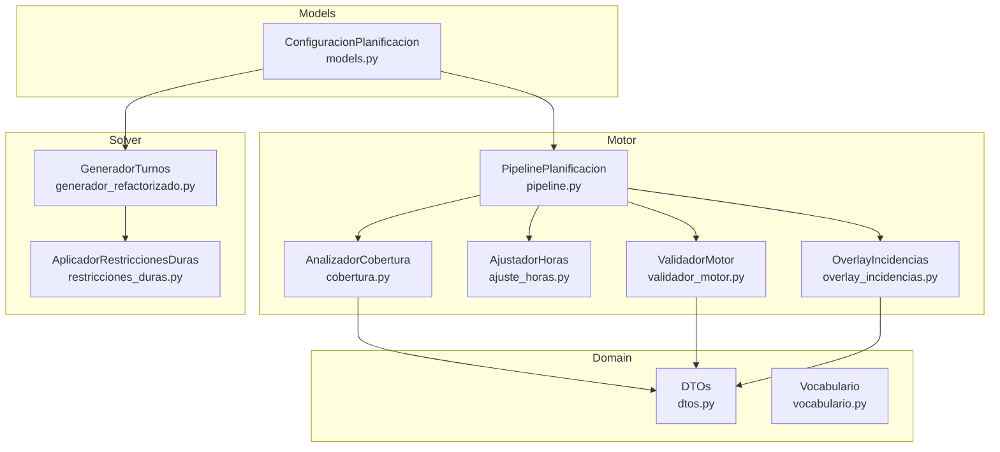
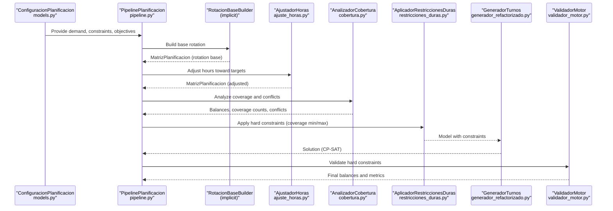
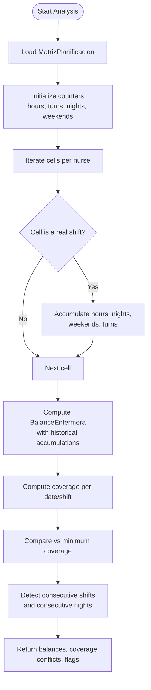
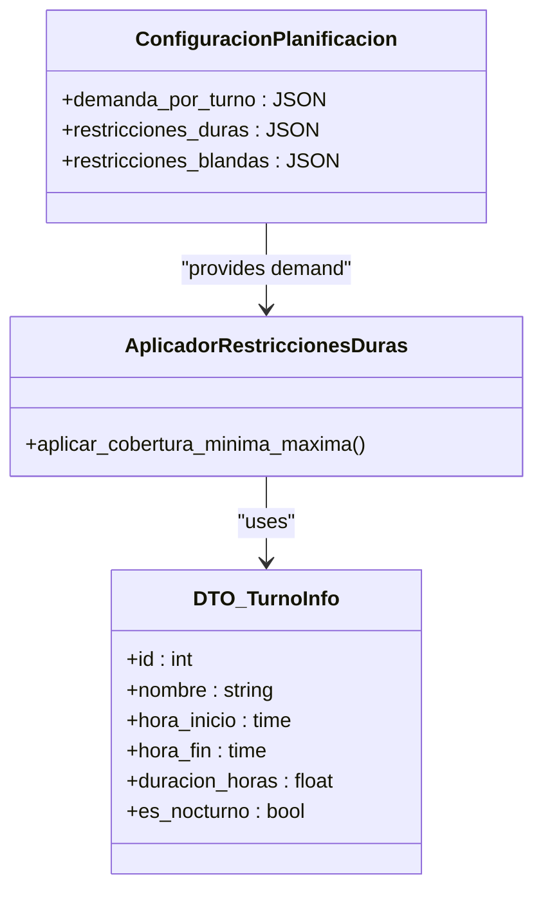
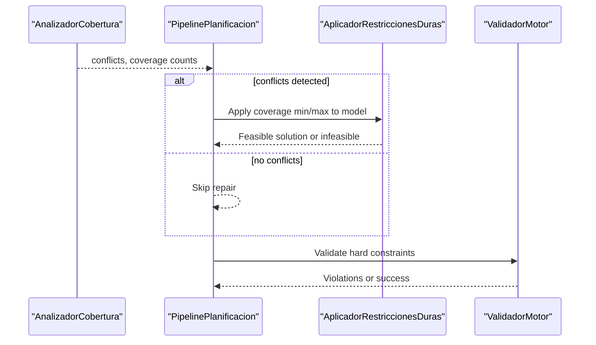
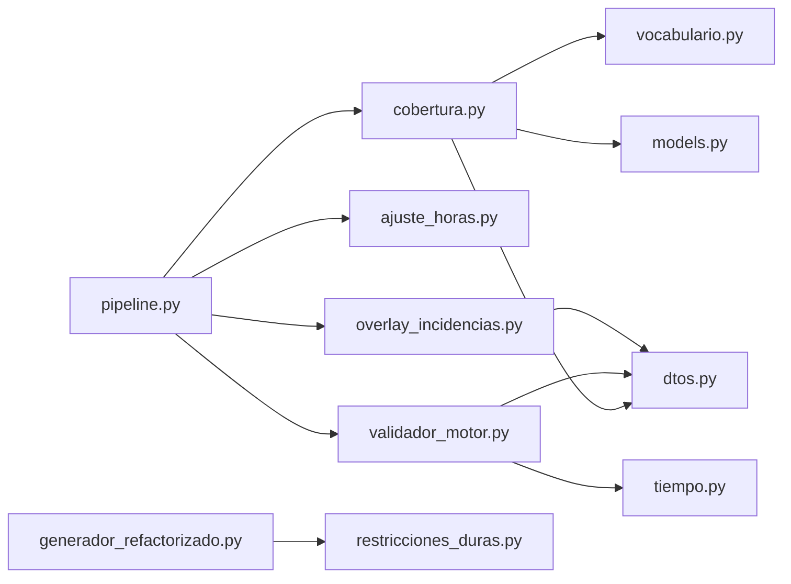

# Coverage Analysis

<cite>
**Referenced Files in This Document**
- [cobertura.py](file://turnos/motor/cobertura.py)
- [pipeline.py](file://turnos/motor/pipeline.py)
- [ajuste_horas.py](file://turnos/motor/ajuste_horas.py)
- [validador_motor.py](file://turnos/motor/validador_motor.py)
- [overlay_incidencias.py](file://turnos/motor/overlay_incidencias.py)
- [dtos.py](file://turnos/dominio/dtos.py)
- [vocabulario.py](file://turnos/dominio/vocabulario.py)
- [restricciones_duras.py](file://turnos/restricciones_duras.py)
- [models.py](file://turnos/models.py)
- [generador_refactorizado.py](file://turnos/generador_refactorizado.py)
- [test_pipeline.py](file://turnos/tests/test_motor/test_pipeline.py)
- [demo_configuracion.json](file://turnos/fixtures/demo_configuracion.json)
- [tiempo.py](file://turnos/utils/tiempo.py)
</cite>

## Table of Contents
1. [Introduction](#introduction)
2. [Project Structure](#project-structure)
3. [Core Components](#core-components)
4. [Architecture Overview](#architecture-overview)
5. [Detailed Component Analysis](#detailed-component-analysis)
6. [Dependency Analysis](#dependency-analysis)
7. [Performance Considerations](#performance-considerations)
8. [Troubleshooting Guide](#troubleshooting-guide)
9. [Conclusion](#conclusion)
10. [Appendices](#appendices)

## Introduction
This document explains the coverage analysis system that evaluates staffing requirements against demand patterns. It covers:
- Coverage calculation algorithms and demand forecasting mechanisms
- How coverage gaps are identified and quantified
- The relationship between coverage analysis and hard constraints (minimum and maximum coverage requirements)
- Examples of coverage scenarios and demand pattern analysis
- How coverage metrics influence constraint enforcement and integrate into the planning pipeline

## Project Structure
The coverage analysis spans several modules:
- Motor: coverage analyzer, pipeline orchestration, hours adjustment, validator, and overlay for incidents
- Domain: DTOs and canonical vocabulary for constraints and objectives
- Models: configuration and plan data structures
- Generators and constraints: solver integration and hard constraints application
- Tests: scenario validation and examples

**Diagram sources**
- [cobertura.py:21-208](file://turnos/motor/cobertura.py#L21-L208)
- [pipeline.py:31-267](file://turnos/motor/pipeline.py#L31-L267)
- [ajuste_horas.py:21-233](file://turnos/motor/ajuste_horas.py#L21-L233)
- [validador_motor.py:23-451](file://turnos/motor/validador_motor.py#L23-L451)
- [overlay_incidencias.py:24-205](file://turnos/motor/overlay_incidencias.py#L24-L205)
- [dtos.py:197-274](file://turnos/dominio/dtos.py#L197-L274)
- [vocabulario.py:7-112](file://turnos/dominio/vocabulario.py#L7-L112)
- [models.py:332-481](file://turnos/models.py#L332-L481)
- [generador_refactorizado.py:17-140](file://turnos/generador_refactorizado.py#L17-L140)
- [restricciones_duras.py:10-156](file://turnos/restricciones_duras.py#L10-L156)

**Section sources**
- [cobertura.py:1-208](file://turnos/motor/cobertura.py#L1-L208)
- [pipeline.py:1-267](file://turnos/motor/pipeline.py#L1-L267)
- [dtos.py:1-274](file://turnos/dominio/dtos.py#L1-L274)
- [models.py:332-481](file://turnos/models.py#L332-L481)

## Core Components
- AnalizadorCobertura: Computes per-enfermera balances, per-turno per-date coverage counts, detects coverage conflicts, and identifies violations for consecutive shifts and nights.
- PipelinePlanificacion: Orchestrates rotation base generation, hours adjustment, coverage analysis, optional repair via CP-SAT, and final validation.
- AjustadorHoras: Adjusts generated schedules to meet contractual hours targets with minimal disruption.
- ValidadorMotor: Validates final solution against hard constraints, including coverage minimums.
- OverlayIncidencias: Applies post-generation incidents and detects resulting coverage deficits.
- DTOs and Vocabulario: Define canonical identifiers for constraints and objectives, and shared data structures.
- GeneradorTurnos and AplicadorRestriccionesDuras: Apply hard constraints during solver phase (including coverage min/max).

**Section sources**
- [cobertura.py:21-208](file://turnos/motor/cobertura.py#L21-L208)
- [pipeline.py:31-267](file://turnos/motor/pipeline.py#L31-L267)
- [ajuste_horas.py:21-233](file://turnos/motor/ajuste_horas.py#L21-L233)
- [validador_motor.py:23-451](file://turnos/motor/validador_motor.py#L23-L451)
- [overlay_incidencias.py:24-205](file://turnos/motor/overlay_incidencias.py#L24-L205)
- [dtos.py:197-274](file://turnos/dominio/dtos.py#L197-L274)
- [vocabulario.py:7-112](file://turnos/dominio/vocabulario.py#L7-L112)
- [restricciones_duras.py:10-156](file://turnos/restricciones_duras.py#L10-L156)

## Architecture Overview
Coverage analysis integrates across three phases:
- Pre-solver: Rotation base + hours adjustment
- Solver: Hard constraints (including coverage min/max) applied to model
- Post-generation: Coverage analysis, optional repair, and validation

**Diagram sources**
- [pipeline.py:92-234](file://turnos/motor/pipeline.py#L92-L234)
- [ajuste_horas.py:46-88](file://turnos/motor/ajuste_horas.py#L46-L88)
- [cobertura.py:46-73](file://turnos/motor/cobertura.py#L46-L73)
- [restricciones_duras.py:37-111](file://turnos/restricciones_duras.py#L37-L111)
- [generador_refactorizado.py:105-135](file://turnos/generador_refactorizado.py#L105-L135)
- [validador_motor.py:48-86](file://turnos/motor/validador_motor.py#L48-L86)

## Detailed Component Analysis

### Coverage Calculation Algorithms
- Per-enfermera balances:
  - Summarize assigned hours, number of turns, nights, weekend days, and optionally incorporate historical accumulations.
- Per-turno per-date coverage:
  - Count assigned staff per shift per day, including fixed assignments.
- Conflict detection:
  - Compare actual coverage against configured minimums for each turn on each date.
  - Track consecutive shifts and consecutive night shifts exceeding limits.

**Diagram sources**
- [cobertura.py:75-137](file://turnos/motor/cobertura.py#L75-L137)
- [cobertura.py:139-207](file://turnos/motor/cobertura.py#L139-L207)

**Section sources**
- [cobertura.py:75-137](file://turnos/motor/cobertura.py#L75-L137)
- [cobertura.py:139-207](file://turnos/motor/cobertura.py#L139-L207)
- [dtos.py:134-166](file://turnos/dominio/dtos.py#L134-L166)

### Demand Forecasting Mechanisms
- Configuration-driven demand:
  - Minimum, optimal, and maximum demand per shift are configured in the configuration object.
  - The solver applies coverage minimums and maximums directly from this configuration.
- Pattern-based demand:
  - Coverage minimums can be augmented by patterns (e.g., weekend increments) defined in configuration.

**Diagram sources**
- [models.py:360-364](file://turnos/models.py#L360-L364)
- [restricciones_duras.py:87-111](file://turnos/restricciones_duras.py#L87-L111)
- [dtos.py:44-58](file://turnos/dominio/dtos.py#L44-L58)

**Section sources**
- [models.py:360-364](file://turnos/models.py#L360-L364)
- [restricciones_duras.py:87-111](file://turnos/restricciones_duras.py#L87-L111)
- [demo_configuracion.json:13-29](file://turnos/fixtures/demo_configuracion.json#L13-L29)

### Coverage Gap Quantification
- Coverage gap per date/shift:
  - Gap = minimum requirement − actual assignment.
- Aggregated metrics:
  - Total gaps, worst-case gaps, and distribution across dates and shifts.
- Historical context:
  - Balances incorporate accumulated historical totals to inform future planning.

**Section sources**
- [overlay_incidencias.py:166-204](file://turnos/motor/overlay_incidencias.py#L166-L204)
- [validador_motor.py:279-310](file://turnos/motor/validador_motor.py#L279-L310)
- [dtos.py:134-166](file://turnos/dominio/dtos.py#L134-L166)

### Relationship Between Coverage Analysis and Hard Constraints
- Hard constraints enforced by the solver include coverage minimums and maximums.
- Coverage analysis informs whether repairs are needed; if conflicts exist, CP-SAT attempts to fix them while preserving hard constraints.
- Final validation ensures no hard constraint violations remain.

**Diagram sources**
- [cobertura.py:46-73](file://turnos/motor/cobertura.py#L46-L73)
- [pipeline.py:170-200](file://turnos/motor/pipeline.py#L170-L200)
- [restricciones_duras.py:37-111](file://turnos/restricciones_duras.py#L37-L111)
- [validador_motor.py:88-105](file://turnos/motor/validador_motor.py#L88-L105)

**Section sources**
- [restricciones_duras.py:87-111](file://turnos/restricciones_duras.py#L87-L111)
- [validador_motor.py:279-310](file://turnos/motor/validador_motor.py#L279-L310)
- [pipeline.py:170-200](file://turnos/motor/pipeline.py#L170-L200)

### Examples of Coverage Scenarios and Demand Pattern Analysis
- Scenario 1: Coverage below minimum
  - Example configuration defines minimum demand per shift; if actual coverage falls short for certain dates/shifts, conflicts are reported.
- Scenario 2: Weekend augmentation
  - Patterns can increase minimum coverage on weekends; the analyzer compares against adjusted requirements.
- Scenario 3: Incident overlay creates deficits
  - Applying vacation/leave after generation reduces coverage; overlay detects deficits and reports them.

**Section sources**
- [test_pipeline.py:245-269](file://turnos/tests/test_motor/test_pipeline.py#L245-L269)
- [overlay_incidencias.py:166-204](file://turnos/motor/overlay_incidencias.py#L166-L204)
- [demo_configuracion.json:30-42](file://turnos/fixtures/demo_configuracion.json#L30-L42)

### How Coverage Metrics Drive Constraint Enforcement
- During solver construction, coverage minimums and maximums are translated into integer constraints.
- Post-generation, coverage analysis validates that these constraints are satisfied.
- If not, CP-SAT attempts repairs guided by soft constraints and the coverage analyzer’s conflict signals.

**Section sources**
- [restricciones_duras.py:87-111](file://turnos/restricciones_duras.py#L87-L111)
- [validador_motor.py:279-310](file://turnos/motor/validador_motor.py#L279-L310)
- [pipeline.py:170-200](file://turnos/motor/pipeline.py#L170-L200)

### Integration With the Planning Pipeline
- Pipeline stages:
  - Rotation base → Hours adjustment → Coverage analysis → Optional repair → Validation.
- Coverage analysis is invoked after hours adjustment and before optional repair.
- Final validation ensures hard constraints (including coverage) are met.

**Section sources**
- [pipeline.py:92-234](file://turnos/motor/pipeline.py#L92-L234)
- [ajuste_horas.py:46-88](file://turnos/motor/ajuste_horas.py#L46-L88)
- [cobertura.py:46-73](file://turnos/motor/cobertura.py#L46-L73)
- [validador_motor.py:48-86](file://turnos/motor/validador_motor.py#L48-L86)

## Dependency Analysis
Coverage analysis depends on:
- DTOs for typed structures (MatrizPlanificacion, BalanceEnfermera, TurnoInfo)
- Canonical vocabulary for constraint identifiers
- Configuration for demand and hard constraints
- Utilities for time calculations

**Diagram sources**
- [cobertura.py:11-16](file://turnos/motor/cobertura.py#L11-L16)
- [dtos.py:197-274](file://turnos/dominio/dtos.py#L197-L274)
- [vocabulario.py:7-112](file://turnos/dominio/vocabulario.py#L7-L112)
- [models.py:332-481](file://turnos/models.py#L332-L481)
- [pipeline.py:24-26](file://turnos/motor/pipeline.py#L24-L26)
- [ajuste_horas.py:11-16](file://turnos/motor/ajuste_horas.py#L11-L16)
- [validador_motor.py:11-18](file://turnos/motor/validador_motor.py#L11-L18)
- [overlay_incidencias.py:11-19](file://turnos/motor/overlay_incidencias.py#L11-L19)
- [generador_refactorizado.py:7-11](file://turnos/generador_refactorizado.py#L7-L11)
- [restricciones_duras.py:3-7](file://turnos/restricciones_duras.py#L3-L7)
- [tiempo.py:8-31](file://turnos/utils/tiempo.py#L8-L31)

**Section sources**
- [cobertura.py:11-16](file://turnos/motor/cobertura.py#L11-L16)
- [pipeline.py:24-26](file://turnos/motor/pipeline.py#L24-L26)
- [validador_motor.py:11-18](file://turnos/motor/validador_motor.py#L11-L18)
- [overlay_incidencias.py:11-19](file://turnos/motor/overlay_incidencias.py#L11-L19)
- [restricciones_duras.py:3-7](file://turnos/restricciones_duras.py#L3-L7)

## Performance Considerations
- Coverage computation iterates over all nurses and dates; complexity is O(N × D) for counting plus O(D × T) for comparing against minimums.
- Consecutive shift checks scan ordered dates per nurse; complexity is O(N × D).
- For large periods, consider caching coverage counts and minimizing repeated scans.

## Troubleshooting Guide
Common issues and resolutions:
- Coverage below minimum:
  - Verify configuration demand values and ensure they reflect realistic staffing needs.
  - Confirm that patterns (e.g., weekend increments) are correctly applied.
- Excessive consecutive shifts or nights:
  - Adjust hard constraints for maximum consecutive shifts and nights.
  - Review rotation base and desfases to distribute workload.
- Post-generation deficits:
  - Use overlay to apply incidents and check resulting deficits.
  - Re-run pipeline with adjusted constraints or increased staffing.

**Section sources**
- [validador_motor.py:118-163](file://turnos/motor/validador_motor.py#L118-L163)
- [overlay_incidencias.py:166-204](file://turnos/motor/overlay_incidencias.py#L166-L204)
- [pipeline.py:140-154](file://turnos/motor/pipeline.py#L140-L154)

## Conclusion
Coverage analysis provides a robust mechanism to quantify mismatches between planned coverage and demand, enabling targeted constraint enforcement and post-generation incident handling. By integrating with the pipeline and solver, it ensures hard constraints (including coverage minimums and maximums) are consistently met while maintaining operational flexibility.

## Appendices

### Appendix A: Canonical Constraint Identifiers
- Hard constraints include canonical identifiers such as COBERTURA_MINIMA and COBERTURA_MAXIMA.

**Section sources**
- [vocabulario.py:8-19](file://turnos/dominio/vocabulario.py#L8-L19)

### Appendix B: Time-Based Constraint Utilities
- Utilities compute real-world rest periods between shifts to validate minimum rest constraints.

**Section sources**
- [tiempo.py:8-31](file://turnos/utils/tiempo.py#L8-L31)