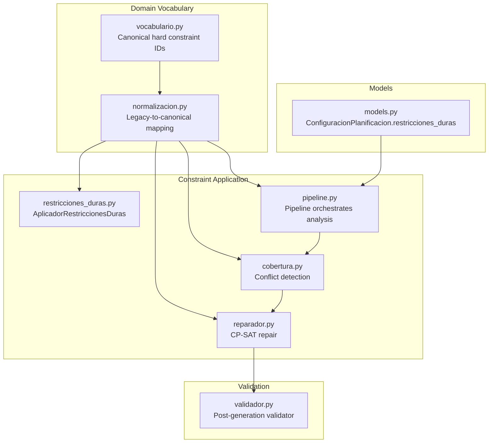
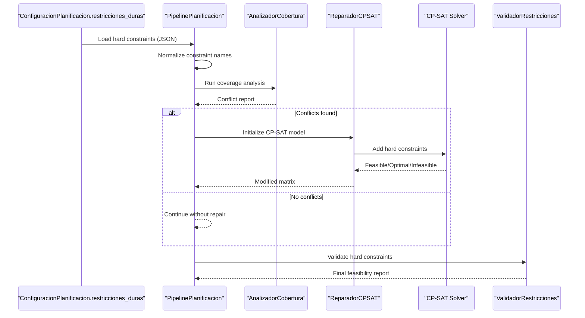
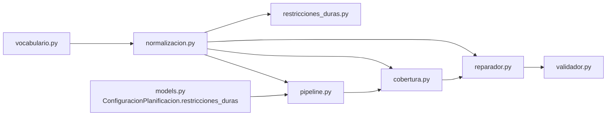

# Hard Constraints

<cite>
**Referenced Files in This Document**
- [restricciones_duras.py](file://turnos/restricciones_duras.py)
- [vocabulario.py](file://turnos/dominio/vocabulario.py)
- [normalizacion.py](file://turnos/dominio/normalizacion.py)
- [models.py](file://turnos/models.py)
- [validador.py](file://turnos/validador.py)
- [pipeline.py](file://turnos/motor/pipeline.py)
- [cobertura.py](file://turnos/motor/cobertura.py)
- [reparador.py](file://turnos/motor/reparador.py)
- [dtos.py](file://turnos/dominio/dtos.py)
- [restricciones_sacyl_ejemplo.json](file://turnos/fixtures/restricciones_sacyl_ejemplo.json)
- [demo_configuracion.json](file://turnos/fixtures/demo_configuracion.json)
</cite>

## Table of Contents
1. [Introduction](#introduction)
2. [Project Structure](#project-structure)
3. [Core Components](#core-components)
4. [Architecture Overview](#architecture-overview)
5. [Detailed Component Analysis](#detailed-component-analysis)
6. [Dependency Analysis](#dependency-analysis)
7. [Performance Considerations](#performance-considerations)
8. [Troubleshooting Guide](#troubleshooting-guide)
9. [Conclusion](#conclusion)

## Introduction
This document explains the mandatory hard constraints that define feasibility in the shift scheduling system. It covers:
- Rest periods between shifts (RD006)
- Minimum and maximum coverage requirements (RD019)
- Annual leave requirements (RD017/RD018)
- Weekly rest days (RD007)
- Consecutive shift limits

It documents implementation logic, mathematical formulations, normalization and dynamic application mechanisms, and how violations are prevented. Examples of constraint configurations and parameter specifications are included to guide setup and troubleshooting.

## Project Structure
Hard constraints are defined and applied across several modules:
- Constraint vocabulary and canonical identifiers
- Constraint normalization from legacy names to canonical forms
- Constraint application during generation and repair
- Coverage analysis and conflict detection
- Validation after generation and repair

**Diagram sources**
- [vocabulario.py:10-19](file://turnos/dominio/vocabulario.py#L10-L19)
- [normalizacion.py:68-92](file://turnos/dominio/normalizacion.py#L68-L92)
- [restricciones_duras.py:10-23](file://turnos/restricciones_duras.py#L10-L23)
- [pipeline.py:31-77](file://turnos/motor/pipeline.py#L31-L77)
- [cobertura.py:21-45](file://turnos/motor/cobertura.py#L21-L45)
- [reparador.py:24-59](file://turnos/motor/reparador.py#L24-L59)
- [validador.py:11-34](file://turnos/validador.py#L11-L34)
- [models.py:366-378](file://turnos/models.py#L366-L378)

**Section sources**
- [vocabulario.py:10-19](file://turnos/dominio/vocabulario.py#L10-L19)
- [normalizacion.py:68-92](file://turnos/dominio/normalizacion.py#L68-L92)
- [restricciones_duras.py:10-23](file://turnos/restricciones_duras.py#L10-L23)
- [pipeline.py:31-77](file://turnos/motor/pipeline.py#L31-L77)
- [cobertura.py:21-45](file://turnos/motor/cobertura.py#L21-L45)
- [reparador.py:24-59](file://turnos/motor/reparador.py#L24-L59)
- [validador.py:11-34](file://turnos/validador.py#L11-L34)
- [models.py:366-378](file://turnos/models.py#L366-L378)

## Core Components
- Canonical hard constraint identifiers and human-readable names are defined centrally.
- Legacy constraint names are normalized to canonical IDs to support dynamic configuration.
- Constraints are applied in two stages:
  - During generation: coverage analysis and conflict detection
  - During repair: CP-SAT model enforcement with hard constraints
- A post-generation validator ensures feasibility against configured hard constraints.

Key responsibilities:
- Vocabulary: central registry of canonical hard constraint IDs
- Normalization: robust mapping from legacy names to canonical IDs
- Application: enforcement in CP-SAT model and domain logic
- Validation: post-run verification of hard constraints

**Section sources**
- [vocabulario.py:10-19](file://turnos/dominio/vocabulario.py#L10-L19)
- [normalizacion.py:68-92](file://turnos/dominio/normalizacion.py#L68-L92)
- [reparador.py:133-150](file://turnos/motor/reparador.py#L133-L150)
- [validador.py:20-33](file://turnos/validador.py#L20-L33)

## Architecture Overview
The hard constraints pipeline integrates vocabulary, normalization, application, and validation:

**Diagram sources**
- [models.py:366-378](file://turnos/models.py#L366-L378)
- [pipeline.py:92-200](file://turnos/motor/pipeline.py#L92-L200)
- [cobertura.py:46-73](file://turnos/motor/cobertura.py#L46-L73)
- [reparador.py:63-96](file://turnos/motor/reparador.py#L63-L96)
- [validador.py:20-33](file://turnos/validador.py#L20-L33)

## Detailed Component Analysis

### Constraint Vocabulary and Normalization
- Canonical hard constraint IDs are defined in the vocabulary module.
- A normalization layer converts legacy names to canonical IDs and logs warnings for legacy usage.
- Dynamic constraint application relies on normalized names to select and configure constraints.

Implementation highlights:
- Canonical IDs include “TURNO_POR_DIA”, “TURNO_CONSECUTIVOS_MAX”, “DESCANSO_ENTRE_TURNOS”, “COBERTURA_MINIMA”, “COBERTURA_MAXIMA”, “DIAS_LIBRES_ANUALES”, “DESCANSO_SEMANAL”, “NOCHES_CONSECUTIVAS_MAX”.
- Normalization supports both “nombre” and “tipo” fields and handles mixed-case legacy inputs.

**Section sources**
- [vocabulario.py:10-19](file://turnos/dominio/vocabulario.py#L10-L19)
- [normalizacion.py:68-92](file://turnos/dominio/normalizacion.py#L68-L92)
- [normalizacion.py:95-112](file://turnos/dominio/normalizacion.py#L95-L112)
- [normalizacion.py:135-148](file://turnos/dominio/normalizacion.py#L135-L148)

### Rest Period Between Shifts (RD006)
- Prevents less than 12 hours of rest between shifts across consecutive days.
- Two enforcement mechanisms:
  - Pairwise prohibition of shift sequences violating the 12-hour rule
  - One-enfermera-one-shift-per-day constraint (already enforced by variable construction)

Mathematical formulation:
- For each pair of shifts t1 and t2, and for each consecutive day d and nurse e, enforce:
  - shifts[e, d, t1] + shifts[e, d+1, t2] ≤ 1
- Additional pairwise exclusivity per day d and nurse e:
  - shifts[e, d, t1] + shifts[e, d, t2] ≤ 1

Impact on feasibility:
- Reduces risk of fatigue-related violations
- Ensures continuity of rest across day boundaries

Dynamic application:
- The constraint is applied automatically when “DESCANSO_ENTRE_TURNOS” is present in normalized hard constraints.

**Section sources**
- [restricciones_duras.py:45-85](file://turnos/restricciones_duras.py#L45-L85)
- [reparador.py:193-210](file://turnos/motor/reparador.py#L193-L210)
- [validador.py:127-147](file://turnos/validador.py#L127-L147)

### Minimum and Maximum Coverage Requirements (RD019)
- Enforces per-turn minimum and maximum staffing levels.
- Demand can be specified as a scalar or dictionary with keys “min”, “optimo”, “max”.

Mathematical formulation:
- For each day d and turn t:
  - sum over nurses e of shifts[e, d, t] ≥ min_req
  - sum over nurses e of shifts[e, d, t] ≤ max_req

Dynamic application:
- The pipeline extracts normalized “COBERTURA_MINIMA” and “COBERTURA_MAXIMA” from configuration and applies them during coverage analysis and CP-SAT repair.

**Section sources**
- [restricciones_duras.py:87-112](file://turnos/restricciones_duras.py#L87-L112)
- [pipeline.py:78-90](file://turnos/motor/pipeline.py#L78-L90)
- [pipeline.py:140-163](file://turnos/motor/pipeline.py#L140-L163)
- [cobertura.py:139-161](file://turnos/motor/cobertura.py#L139-L161)
- [validador.py:85-126](file://turnos/validador.py#L85-L126)

### Annual Leave Requirements (RD017/RD018)
- Ensures a minimum number of annual leave days per nurse.
- Computed as a percentage of the planning horizon (approx. 28 days out of 365).

Mathematical formulation:
- For each nurse e:
  - sum over days d and turns t of shifts[e, d, t] ≤ total_days − min_leave_days

Dynamic application:
- Applied automatically when “DIAS_LIBRES_ANUALES” is part of normalized hard constraints.

**Section sources**
- [restricciones_duras.py:113-120](file://turnos/restricciones_duras.py#L113-L120)

### Weekly Rest Days (RD007)
- Two variants:
  - Long horizon (≥300 days): at least one day off per 7-day period
  - Short horizon (<300 days): at least one total day off across the period

Mathematical formulation:
- Long horizon: for each nurse e and week w, sum over days d∈w of (1 − is_working_day[d]) ≥ 1
- Short horizon: sum over e and d of offday_indicator[e, d] ≥ 1

Dynamic application:
- Applied depending on num_dias threshold; also uses an offdays indicator variable in repair stage.

**Section sources**
- [restricciones_duras.py:122-138](file://turnos/restricciones_duras.py#L122-L138)
- [reparador.py:211-230](file://turnos/motor/reparador.py#L211-L230)

### Consecutive Shift Limits
- Maximum consecutive working days without a rest day.
- Maximum consecutive nights (night-only variant).

Mathematical formulation:
- For each nurse e and sliding window of length (max_consec + 1) days:
  - sum of working indicators in window ≤ max_consec
- Night-only variant similarly bounds consecutive night cells.

Dynamic application:
- Extracted from normalized “TURNO_CONSECUTIVOS_MAX” and “NOCHES_CONSECUTIVAS_MAX” in pipeline and repair stages.

**Section sources**
- [restricciones_duras.py:140-155](file://turnos/restricciones_duras.py#L140-L155)
- [pipeline.py:140-154](file://turnos/motor/pipeline.py#L140-L154)
- [reparador.py:151-192](file://turnos/motor/reparador.py#L151-L192)
- [cobertura.py:163-184](file://turnos/motor/cobertura.py#L163-L184)
- [cobertura.py:186-207](file://turnos/motor/cobertura.py#L186-L207)
- [validador.py:148-191](file://turnos/validador.py#L148-L191)

### Constraint Configuration Examples and Parameter Specifications
- Example fixture demonstrates RD006, RD019, and RD020 (one shift per day) entries with parameters.
- Demo configuration includes soft constraints; hard constraints are stored in JSON fields on the configuration model.

Configuration fields:
- ConfiguracionPlanificacion.restricciones_duras: JSON list of hard constraints with fields “nombre”, “tipo”, “parametros”, “descripcion”
- Demand specification: “demanda_por_turno” supports integer or dictionary with “min”, “optimo”, “max”

**Section sources**
- [restricciones_sacyl_ejemplo.json:3-14](file://turnos/fixtures/restricciones_sacyl_ejemplo.json#L3-L14)
- [demo_configuracion.json:105-152](file://turnos/fixtures/demo_configuracion.json#L105-L152)
- [models.py:366-378](file://turnos/models.py#L366-L378)

### Violation Prevention Mechanisms
- Generation stage:
  - Coverage analysis detects under-coverage and excessive consecutive work
  - Conflict report triggers repair when violations are detected
- Repair stage:
  - CP-SAT model enforces hard constraints with minimal deviation from base rotation
- Post-generation validation:
  - Final check confirms all hard constraints are satisfied

**Section sources**
- [cobertura.py:46-73](file://turnos/motor/cobertura.py#L46-L73)
- [reparador.py:63-96](file://turnos/motor/reparador.py#L63-L96)
- [validador.py:20-33](file://turnos/validador.py#L20-L33)

## Dependency Analysis
The hard constraints depend on:
- Canonical vocabulary for constraint identity
- Normalization to unify legacy and canonical names
- Configuration model storing constraints as JSON
- Coverage analyzer and CP-SAT repair to enforce constraints
- Post-generation validator to confirm feasibility

**Diagram sources**
- [vocabulario.py:10-19](file://turnos/dominio/vocabulario.py#L10-L19)
- [normalizacion.py:68-92](file://turnos/dominio/normalizacion.py#L68-L92)
- [restricciones_duras.py:10-23](file://turnos/restricciones_duras.py#L10-L23)
- [pipeline.py:31-77](file://turnos/motor/pipeline.py#L31-L77)
- [cobertura.py:21-45](file://turnos/motor/cobertura.py#L21-L45)
- [reparador.py:24-59](file://turnos/motor/reparador.py#L24-L59)
- [validador.py:11-34](file://turnos/validador.py#L11-L34)
- [models.py:366-378](file://turnos/models.py#L366-L378)

**Section sources**
- [vocabulario.py:10-19](file://turnos/dominio/vocabulario.py#L10-L19)
- [normalizacion.py:68-92](file://turnos/dominio/normalizacion.py#L68-L92)
- [restricciones_duras.py:10-23](file://turnos/restricciones_duras.py#L10-L23)
- [pipeline.py:31-77](file://turnos/motor/pipeline.py#L31-L77)
- [cobertura.py:21-45](file://turnos/motor/cobertura.py#L21-L45)
- [reparador.py:24-59](file://turnos/motor/reparador.py#L24-L59)
- [validador.py:11-34](file://turnos/validador.py#L11-L34)
- [models.py:366-378](file://turnos/models.py#L366-L378)

## Performance Considerations
- Constraint enforcement scales with number of nurses, days, and shifts; pairwise sequence checks for RD006 iterate over all shift pairs and consecutive day pairs.
- CP-SAT repair is triggered only when coverage conflicts are detected, minimizing unnecessary solving.
- Normalization avoids repeated string comparisons by mapping to canonical IDs once per configuration load.

[No sources needed since this section provides general guidance]

## Troubleshooting Guide
Common issues and resolutions:
- Violations of RD006:
  - Cause: Shift sequence across consecutive days violates 12-hour rest
  - Resolution: Adjust shift types or schedule gaps; ensure normalization recognizes “DESCANSO_ENTRE_TURNOS”
- Violations of RD019:
  - Cause: Insufficient staff per turn or missing demand specification
  - Resolution: Increase “max” or decrease “min” in demand; verify “demanda_por_turno” format
- Excessive consecutive work (RD020/TURNO_CONSECUTIVOS_MAX):
  - Cause: Too many working days in a row
  - Resolution: Lower “max_dias_consecutivos”; review base rotation and demand
- Night consecutive limit (NOCHES_CONSECUTIVAS_MAX):
  - Cause: Too many nights in a row
  - Resolution: Reduce “max_noches_consecutivas”; adjust night-off patterns
- Weekly rest (RD007):
  - Cause: No off-day in long horizon or insufficient off-days in short horizon
  - Resolution: Ensure at least one off-day per 7-day block or one off-day over the period

Validation steps:
- Use the post-generation validator to list violations and successes
- Confirm normalized constraint names match canonical IDs

**Section sources**
- [validador.py:20-33](file://turnos/validador.py#L20-L33)
- [validador.py:51-84](file://turnos/validador.py#L51-L84)
- [validador.py:85-126](file://turnos/validador.py#L85-L126)
- [validador.py:127-147](file://turnos/validador.py#L127-L147)
- [validador.py:148-191](file://turnos/validador.py#L148-L191)

## Conclusion
Hard constraints are the backbone of solution feasibility. They are defined with canonical identifiers, normalized from legacy names, and enforced both during coverage analysis and CP-SAT repair. The system’s validation ensures that generated plans satisfy mandatory requirements, while dynamic configuration allows flexible tuning of parameters such as coverage targets, consecutive limits, and rest periods.