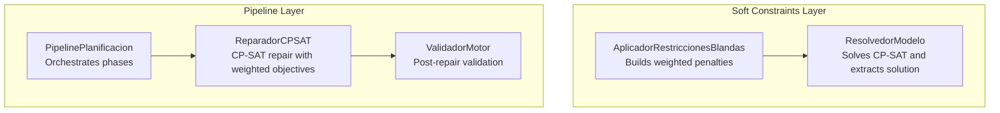
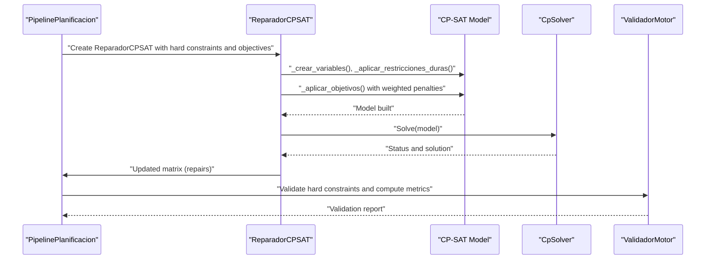
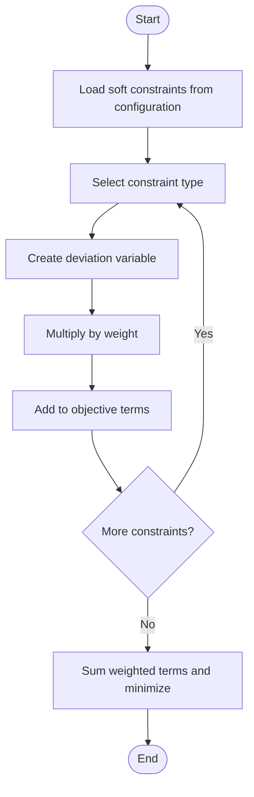
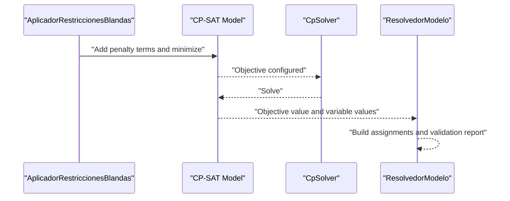
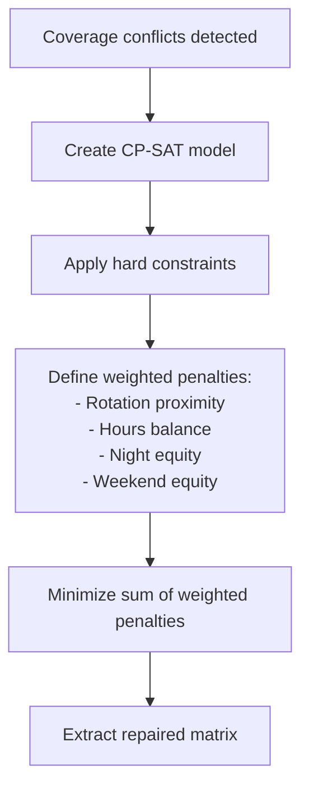
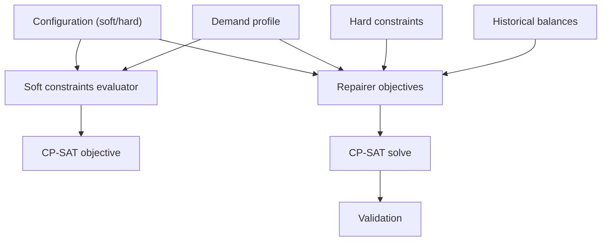

# Soft Constraints

<cite>
**Referenced Files in This Document**
- [restricciones_blandas.py](file://turnos/restricciones_blandas.py)
- [resolvedor.py](file://turnos/resolvedor.py)
- [pipeline.py](file://turnos/motor/pipeline.py)
- [reparador.py](file://turnos/motor/reparador.py)
- [validador_motor.py](file://turnos/motor/validador_motor.py)
- [restricciones_duras.py](file://turnos/restricciones_duras.py)
- [dtos.py](file://turnos/dominio/dtos.py)
- [demo_configuracion.json](file://turnos/fixtures/demo_configuracion.json)
- [test_integracion_final.py](file://turnos/tests/test_motor/test_integracion_final.py)
</cite>

## Table of Contents
1. [Introduction](#introduction)
2. [Project Structure](#project-structure)
3. [Core Components](#core-components)
4. [Architecture Overview](#architecture-overview)
5. [Detailed Component Analysis](#detailed-component-analysis)
6. [Dependency Analysis](#dependency-analysis)
7. [Performance Considerations](#performance-considerations)
8. [Troubleshooting Guide](#troubleshooting-guide)
9. [Conclusion](#conclusion)
10. [Appendices](#appendices)

## Introduction
This document explains the soft constraint system that represents preferences and optimization goals rather than strict requirements. It covers how soft constraints are evaluated, how penalties are computed and integrated into the CP-SAT solver’s objective function, and how constraint weights and violation scoring influence solution quality. It also documents common soft constraints such as staff preferences, rotation patterns, and historical continuity requirements, along with constraint repair strategies used during optimization.

## Project Structure
Soft constraints are implemented across several modules:
- Constraint application and objective construction for soft constraints
- CP-SAT solver orchestration and result extraction
- Pipeline orchestration that applies hard constraints, detects conflicts, repairs with CP-SAT, and validates outcomes
- Validation of hard constraints and quality metrics after repair

**Diagram sources**
- [restricciones_blandas.py:36-138](file://turnos/restricciones_blandas.py#L36-L138)
- [resolvedor.py:21-112](file://turnos/resolvedor.py#L21-L112)
- [pipeline.py:92-234](file://turnos/motor/pipeline.py#L92-L234)
- [reparador.py:63-96](file://turnos/motor/reparador.py#L63-L96)
- [validador_motor.py:48-86](file://turnos/motor/validador_motor.py#L48-L86)

**Section sources**
- [restricciones_blandas.py:1-138](file://turnos/restricciones_blandas.py#L1-L138)
- [resolvedor.py:1-113](file://turnos/resolvedor.py#L1-L113)
- [pipeline.py:1-267](file://turnos/motor/pipeline.py#L1-L267)
- [reparador.py:1-609](file://turnos/motor/reparador.py#L1-L609)
- [validador_motor.py:1-451](file://turnos/motor/validador_motor.py#L1-L451)

## Core Components
- Soft constraint evaluator: builds weighted penalties from configured objectives and adds them to the CP-SAT objective.
- CP-SAT solver orchestrator: runs the solver, extracts assignments, and reports objective value.
- Pipeline orchestrator: applies hard constraints, detects coverage conflicts, repairs with CP-SAT, and validates.
- Repairer: constructs a CP-SAT model with weighted objectives to minimize deviations from base rotation and improve equity.
- Validator: checks hard constraints and computes quality metrics after repair.

Key responsibilities:
- Weighted-sum objective: soft constraints contribute additive penalty terms multiplied by weights.
- Violation scoring: penalties quantify deviations (e.g., imbalance, demand mismatch, rotation changes).
- Integration with CP-SAT: penalties are encoded as integer variables and added to minimize the total objective.

**Section sources**
- [restricciones_blandas.py:36-138](file://turnos/restricciones_blandas.py#L36-L138)
- [resolvedor.py:21-112](file://turnos/resolvedor.py#L21-L112)
- [pipeline.py:92-234](file://turnos/motor/pipeline.py#L92-L234)
- [reparador.py:63-96](file://turnos/motor/reparador.py#L63-L96)
- [validador_motor.py:48-86](file://turnos/motor/validador_motor.py#L48-L86)

## Architecture Overview
Soft constraints are integrated into two complementary systems:
- CP-SAT objective-based soft constraints: penalties are constructed and minimized as part of the solver’s objective.
- CP-SAT repair objectives: during conflict resolution, weighted objectives guide the solver to preserve rotation proximity and balance.

**Diagram sources**
- [pipeline.py:170-200](file://turnos/motor/pipeline.py#L170-L200)
- [reparador.py:63-96](file://turnos/motor/reparador.py#L63-L96)
- [validador_motor.py:48-86](file://turnos/motor/validador_motor.py#L48-L86)

## Detailed Component Analysis

### Soft Constraint Evaluation and Penalty Mechanisms
- Soft constraints are represented as weighted penalties that are minimized by the solver.
- Penalties are built from:
  - Equity in distribution of shifts among staff
  - Minimization of night shifts
  - Demand satisfaction around optimal targets
- Each penalty term is multiplied by a configurable weight to reflect importance.

Penalty construction flow:
- Collect applicable soft constraints from configuration.
- For each constraint, define an integer variable representing the deviation.
- Multiply by the weight and add to the objective.

Objective construction:
- Sum all weighted penalty terms.
- Minimize the total objective.

**Diagram sources**
- [restricciones_blandas.py:36-138](file://turnos/restricciones_blandas.py#L36-L138)

**Section sources**
- [restricciones_blandas.py:36-138](file://turnos/restricciones_blandas.py#L36-L138)

### CP-SAT Objective Integration
- The CP-SAT solver’s objective is set to minimize the total penalty.
- The solver returns the objective value, which reflects the total weighted violations.
- After solving, assignments are extracted and validated.

**Diagram sources**
- [restricciones_blandas.py:120-138](file://turnos/restricciones_blandas.py#L120-L138)
- [resolvedor.py:21-112](file://turnos/resolvedor.py#L21-L112)

**Section sources**
- [restricciones_blandas.py:120-138](file://turnos/restricciones_blandas.py#L120-L138)
- [resolvedor.py:21-112](file://turnos/resolvedor.py#L21-L112)

### Constraint Weight System and Violation Scoring
- Weights determine the relative importance of each soft constraint.
- Violations are scored as integer deviations (e.g., absolute difference from optimal demand, counts of imbalance).
- The total objective equals the sum of weighted violations.

Weight usage examples:
- Equitability of shift distribution
- Night shift minimization
- Deviation from optimal demand per day and turn type

Scoring:
- Absolute deviation variables are introduced for demand satisfaction.
- Imbalance variables (max-min differences) are used for equity objectives.

**Section sources**
- [restricciones_blandas.py:48-118](file://turnos/restricciones_blandas.py#L48-L118)
- [demo_configuracion.json:116-146](file://turnos/fixtures/demo_configuracion.json#L116-L146)

### Integration with CP-SAT Repair Objectives
During conflict resolution, the repairer defines a weighted-sum objective to:
- Preserve base rotation proximity (highest weight)
- Balance monthly hours
- Equalize night shifts and weekend workloads

**Diagram sources**
- [pipeline.py:170-200](file://turnos/motor/pipeline.py#L170-L200)
- [reparador.py:297-334](file://turnos/motor/reparador.py#L297-L334)

**Section sources**
- [pipeline.py:170-200](file://turnos/motor/pipeline.py#L170-L200)
- [reparador.py:297-334](file://turnos/motor/reparador.py#L297-L334)

### Common Soft Constraints
Examples from configuration and implementation:
- Equitable distribution of shifts across staff
- Minimizing night shifts
- Preferential coverage toward optimal demand targets
- Maintaining rotation proximity during repair
- Balancing monthly hours and weekend workload

These are configured with weights and parameters and translated into penalty terms.

**Section sources**
- [demo_configuracion.json:116-146](file://turnos/fixtures/demo_configuracion.json#L116-L146)
- [restricciones_blandas.py:48-118](file://turnos/restricciones_blandas.py#L48-L118)
- [reparador.py:317-331](file://turnos/motor/reparador.py#L317-L331)

### Constraint Repair Strategies
- Detect coverage conflicts after applying hard constraints.
- Construct a CP-SAT model with:
  - Hard constraints (non-negotiable)
  - Soft objectives (weighted penalties)
- Solve and extract the repaired matrix.
- Validate hard constraints and compute quality metrics.

Repair behavior:
- If feasible or optimal, return the repaired matrix.
- If infeasible, return the original matrix unchanged.

**Section sources**
- [pipeline.py:170-200](file://turnos/motor/pipeline.py#L170-L200)
- [reparador.py:63-96](file://turnos/motor/reparador.py#L63-L96)
- [validador_motor.py:48-86](file://turnos/motor/validador_motor.py#L48-L86)

## Dependency Analysis
Soft constraints depend on:
- Configuration of soft constraints and weights
- Turn types and demand profiles
- Hard constraints that must remain satisfied
- Historical balances for continuity objectives

**Diagram sources**
- [restricciones_blandas.py:12-22](file://turnos/restricciones_blandas.py#L12-L22)
- [reparador.py:47-56](file://turnos/motor/reparador.py#L47-L56)
- [pipeline.py:170-200](file://turnos/motor/pipeline.py#L170-L200)

**Section sources**
- [restricciones_blandas.py:12-22](file://turnos/restricciones_blandas.py#L12-L22)
- [reparador.py:47-56](file://turnos/motor/reparador.py#L47-L56)
- [pipeline.py:170-200](file://turnos/motor/pipeline.py#L170-L200)

## Performance Considerations
- Weight scaling affects solver behavior; higher weights increase the cost of violating a constraint.
- Integer variables for penalties and absolute deviations increase model size; tune weights and scopes to keep the problem tractable.
- Repair timeout and worker settings are configured to balance speed and solution quality.

[No sources needed since this section provides general guidance]

## Troubleshooting Guide
Common issues and resolutions:
- Infeasible solutions: review hard constraints and adjust limits; verify demand and coverage requirements.
- Excessive penalties: reduce weights for less critical soft constraints.
- Repair not finding feasible solution: relax hard constraints temporarily or increase solver time/threads.
- Validation warnings: address imbalances flagged by the validator (e.g., high deviation in hours or nights).

**Section sources**
- [resolvedor.py:34-48](file://turnos/resolvedor.py#L34-L48)
- [validador_motor.py:340-364](file://turnos/motor/validador_motor.py#L340-L364)

## Conclusion
Soft constraints enable the planner to encode preferences and optimization goals while maintaining strict hard constraints. By constructing weighted penalties and integrating them into the CP-SAT objective, the system achieves balanced, fair, and historically aware schedules. During repair, weighted objectives guide the solver to preserve rotation proximity and equity, ensuring practical and sustainable solutions.

[No sources needed since this section summarizes without analyzing specific files]

## Appendices

### Appendix A: Example Configuration of Soft Constraints
- Equitable distribution of shifts
- Minimizing night shifts
- Preferential coverage toward optimal demand
- Maintaining rotation proximity
- Balancing monthly hours and weekend workload

Weights and parameters are configurable and reflected in the configuration JSON.

**Section sources**
- [demo_configuracion.json:116-146](file://turnos/fixtures/demo_configuracion.json#L116-L146)

### Appendix B: DTOs Related to Soft Constraints
- TurnoInfo: turn type metadata used to compute penalties (e.g., duration, whether nocturnal).
- CeldaPlanificacion: cell metadata used to track rotation base and modifications.

**Section sources**
- [dtos.py:44-132](file://turnos/dominio/dtos.py#L44-L132)

### Appendix C: Tests Demonstrating Behavior
- Repairer behavior with historical balances and monthly hour objectives.
- Validation of weighted penalties and solver status reporting.

**Section sources**
- [test_integracion_final.py:982-1007](file://turnos/tests/test_motor/test_integracion_final.py#L982-L1007)