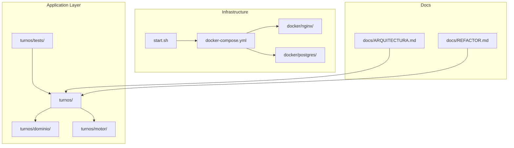
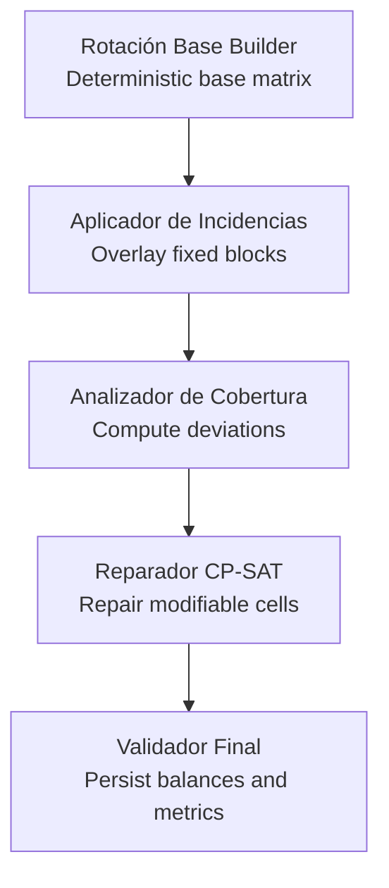
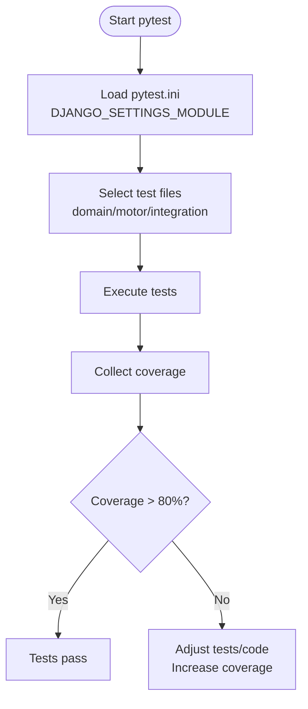
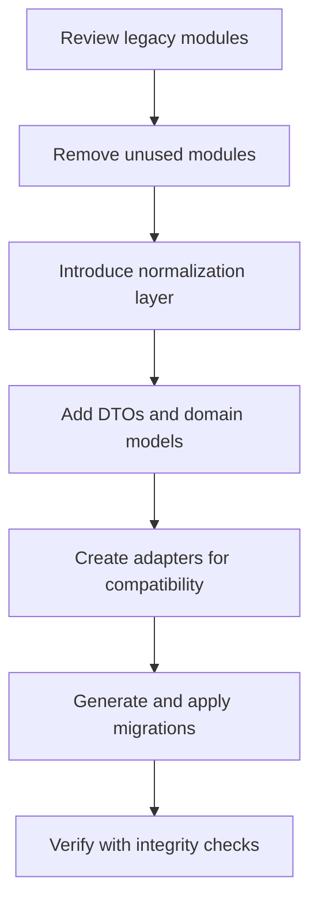

# Contributing and Development

<cite>
**Referenced Files in This Document**
- [README.md](file://README.md)
- [AGENTS.md](file://AGENTS.md)
- [pytest.ini](file://pytest.ini)
- [turnos/tests/README.md](file://turnos/tests/README.md)
- [turnos/tests/conftest.py](file://turnos/tests/conftest.py)
- [turnos/tests/test_models.py](file://turnos/tests/test_models.py)
- [turnos/tests/test_dominio/test_dtos.py](file://turnos/tests/test_dominio/test_dtos.py)
- [turnos/tests/test_motor/test_pipeline.py](file://turnos/tests/test_motor/test_pipeline.py)
- [proyecto_turnos/settings.py](file://proyecto_turnos/settings.py)
- [docker-compose.yml](file://docker-compose.yml)
- [start.sh](file://start.sh)
- [manage.py](file://manage.py)
- [requirements.txt](file://requirements.txt)
- [docs/ARQUITECTURA.md](file://docs/ARQUITECTURA.md)
- [docs/REFACTOR.md](file://docs/REFACTOR.md)
</cite>

## Table of Contents
1. [Introduction](#introduction)
2. [Project Structure](#project-structure)
3. [Core Components](#core-components)
4. [Architecture Overview](#architecture-overview)
5. [Development Environment Setup](#development-environment-setup)
6. [Coding Standards and Conventions](#coding-standards-and-conventions)
7. [Testing Requirements and Quality Gates](#testing-requirements-and-quality-gates)
8. [Refactoring Guidelines](#refactoring-guidelines)
9. [Pull Request Process and Code Review Standards](#pull-request-process-and-code-review-standards)
10. [Continuous Integration Expectations](#continuous-integration-expectations)
11. [Documentation Standards](#documentation-standards)
12. [Issue Reporting and Community Contribution Norms](#issue-reporting-and-community-contribution-norms)
13. [Troubleshooting Guide](#troubleshooting-guide)
14. [Conclusion](#conclusion)

## Introduction
This document defines the end-to-end development workflow, standards, and collaboration procedures for contributors working on the nursing shift scheduler. It consolidates environment setup, coding conventions, testing requirements, refactoring guidelines, documentation standards, and CI expectations. It also outlines the pull request process, code review criteria, and maintainer responsibilities to ensure consistent, high-quality contributions aligned with the project’s architecture and goals.

## Project Structure
The project follows a Django application layout with clear separation of concerns:
- Application code under turnos/
- Domain and motor layers under turnos/dominio/ and turnos/motor/
- Tests organized by domain, motor, and integration under turnos/tests/
- Infrastructure and deployment under docker/, docker-compose.yml, and scripts
- Documentation under docs/

**Diagram sources**
- [docker-compose.yml:1-168](file://docker-compose.yml#L1-L168)
- [start.sh:1-256](file://start.sh#L1-L256)
- [docs/ARQUITECTURA.md:1-302](file://docs/ARQUITECTURA.md#L1-L302)
- [docs/REFACTOR.md:1-290](file://docs/REFACTOR.md#L1-L290)

**Section sources**
- [README.md:1-111](file://README.md#L1-L111)
- [docs/ARQUITECTURA.md:237-281](file://docs/ARQUITECTURA.md#L237-L281)

## Core Components
Key components and their roles:
- Domain layer: Models, normalization, DTOs, and vocabulary canonicalization
- Motor layer: Pipeline orchestration, rotation builder, incident application, coverage analyzer, repairer, validators
- Application layer: Django app with views, forms, tasks, and management commands
- Infrastructure: Dockerized stack with PostgreSQL, Redis, Nginx, and Celery
- Tests: pytest suite with fixtures and coverage

**Section sources**
- [docs/ARQUITECTURA.md:103-142](file://docs/ARQUITECTURA.md#L103-L142)
- [docs/ARQUITECTURA.md:240-269](file://docs/ARQUITECTURA.md#L240-L269)
- [turnos/tests/README.md:1-32](file://turnos/tests/README.md#L1-L32)

## Architecture Overview
The system is a monthly roster generator for nursing shifts using deterministic base rotations and CP-SAT repair. The pipeline enforces hard constraints first, then optimizes soft objectives lexicographically.

**Diagram sources**
- [docs/ARQUITECTURA.md:53-84](file://docs/ARQUITECTURA.md#L53-L84)
- [docs/ARQUITECTURA.md:177-217](file://docs/ARQUITECTURA.md#L177-L217)

**Section sources**
- [docs/ARQUITECTURA.md:53-100](file://docs/ARQUITECTURA.md#L53-L100)

## Development Environment Setup
Follow the official quickstart and scripts for local development and production.

- Quickstart (recommended for testing)
  - Create and activate a virtual environment
  - Install dependencies from requirements.txt
  - Run migrations, create standard shift types, generate test data, create a superuser
  - Start the development server

- Automated development startup
  - Use the provided script to initialize Redis, Celery workers and beat, and launch the Django server locally

- Production mode (Docker/Podman)
  - Copy and edit .env.example, then bring up services via Podman or Docker Compose

- Environment variables and configuration
  - Settings support environment-driven configuration for database, Celery, and other services
  - Static and media assets configured for WhiteNoise and whitenoise storage

- Useful commands
  - Management commands for generating types, importing staff, running simulations, and statistics

**Section sources**
- [README.md:17-102](file://README.md#L17-L102)
- [start.sh:1-256](file://start.sh#L1-L256)
- [proyecto_turnos/settings.py:62-160](file://proyecto_turnos/settings.py#L62-L160)
- [docker-compose.yml:1-168](file://docker-compose.yml#L1-L168)
- [manage.py:1-23](file://manage.py#L1-L23)

## Coding Standards and Conventions
- Naming and vocabulary
  - Canonical identifiers in UPPER_SNAKE_CASE (e.g., TURNO_CONSECUTIVOS_MAX, ROTACION_CICLICA)
  - Automatic normalization from legacy keys to canonical names
  - Use canonical names in new code; legacy names are normalized with logging warnings

- Django conventions
  - Use UTF-8 encoding without BOM
  - Prefer portable paths (e.g., BASE_DIR-relative SQLite)
  - Use related_name conventions and avoid property/annotation conflicts
  - Access optional relations via hasattr checks

- CP-SAT constraints
  - All expressions must be integers; cast before adding to constraints
  - Exclude LIBRE sentinel from consecutive work and weekend balance objectives
  - Respect solver order: hard constraints first, then lexicographic soft objectives

- Pipeline and motor
  - Strict 5-phase pipeline order: rotation base → incidents → coverage → repair → validation
  - Do not skip phases or change order

**Section sources**
- [AGENTS.md:106-143](file://AGENTS.md#L106-L143)
- [AGENTS.md:146-157](file://AGENTS.md#L146-L157)
- [AGENTS.md:160-167](file://AGENTS.md#L160-L167)
- [AGENTS.md:170-182](file://AGENTS.md#L170-L182)
- [AGENTS.md:184-193](file://AGENTS.md#L184-L193)
- [docs/ARQUITECTURA.md:145-174](file://docs/ARQUITECTURA.md#L145-L174)

## Testing Requirements and Quality Gates
- Framework and configuration
  - pytest with pytest-django, coverage, and factory-boy
  - Root and app-specific pytest.ini configurations

- Test categories
  - Domain and DTOs: turnos/tests/test_dominio/
  - Motor pipeline: turnos/tests/test_motor/
  - Integration and models: turnos/tests/test_models.py and others

- Coverage expectations
  - Aim for coverage >80% in motor and domain areas
  - Run with coverage reports and HTML output

- Execution
  - Run all tests, category-specific subsets, and coverage-enabled runs
  - Use fixtures for shared setup (users, nurses, shifts, configurations)

- Quality gates
  - All tests passing
  - No regressions introduced
  - Coverage thresholds met

**Diagram sources**
- [pytest.ini:1-6](file://pytest.ini#L1-L6)
- [turnos/tests/README.md:13-24](file://turnos/tests/README.md#L13-L24)
- [docs/ARQUITECTURA.md:298-302](file://docs/ARQUITECTURA.md#L298-L302)

**Section sources**
- [pytest.ini:1-6](file://pytest.ini#L1-L6)
- [turnos/tests/README.md:1-32](file://turnos/tests/README.md#L1-L32)
- [turnos/tests/conftest.py:1-67](file://turnos/tests/conftest.py#L1-L67)
- [turnos/tests/test_models.py:1-36](file://turnos/tests/test_models.py#L1-L36)
- [turnos/tests/test_dominio/test_dtos.py:1-238](file://turnos/tests/test_dominio/test_dtos.py#L1-L238)
- [turnos/tests/test_motor/test_pipeline.py:1-362](file://turnos/tests/test_motor/test_pipeline.py#L1-L362)
- [docs/ARQUITECTURA.md:298-302](file://docs/ARQUITECTURA.md#L298-L302)

## Refactoring Guidelines
- Remove legacy artifacts and unused modules
- Introduce canonical vocabulary and normalization layer
- Add typed DTOs and explicit domain models incrementally
- Keep backward compatibility via adapters during migration
- Apply migrations carefully in non-production environments first

**Diagram sources**
- [docs/REFACTOR.md:8-290](file://docs/REFACTOR.md#L8-L290)

**Section sources**
- [docs/REFACTOR.md:8-290](file://docs/REFACTOR.md#L8-L290)

## Pull Request Process and Code Review Standards
- Workflow
  - Fork and branch from the latest main
  - Implement feature, fix, or improvement with clear commit messages
  - Open a PR with a concise description, rationale, and links to related issues
  - Ensure tests pass and coverage remains acceptable

- Code review criteria
  - Adherence to naming conventions and canonical vocabulary
  - Correctness of CP-SAT constraints and solver assumptions
  - Pipeline order and phase boundaries respected
  - Django conventions followed (encoding, related names, ORM access patterns)
  - Documentation updates included where applicable

- Continuous integration
  - CI should run the full test suite and coverage checks
  - PRs must not lower coverage below established thresholds

**Section sources**
- [AGENTS.md:106-143](file://AGENTS.md#L106-L143)
- [AGENTS.md:170-182](file://AGENTS.md#L170-L182)
- [docs/ARQUITECTURA.md:298-302](file://docs/ARQUITECTURA.md#L298-L302)

## Continuous Integration Expectations
- Test automation
  - Run pytest with pytest.ini configuration
  - Collect coverage and enforce minimum thresholds
  - Execute domain, motor, and integration suites

- Environment parity
  - Use settings-driven configuration for databases and Celery
  - Validate with manage.py check and migration readiness

- Deployment verification
  - Docker compose health checks for web, Redis, and DB
  - Nginx health endpoint checks

**Section sources**
- [pytest.ini:1-6](file://pytest.ini#L1-L6)
- [proyecto_turnos/settings.py:62-160](file://proyecto_turnos/settings.py#L62-L160)
- [docker-compose.yml:74-79](file://docker-compose.yml#L74-L79)
- [docker-compose.yml:147-151](file://docker-compose.yml#L147-L151)

## Documentation Standards
- Architecture and design decisions
  - Document major decisions and trade-offs in docs/ARQUITECTURA.md
  - Keep refactoring summaries current in docs/REFACTOR.md

- Developer-facing guidance
  - Maintain AGENTS.md with essential commands, rules, and pitfalls
  - Update README.md with setup, usage, and testing instructions

- Coverage
  - Ensure new features include tests and documentation updates
  - Keep docs synchronized with code changes

**Section sources**
- [docs/ARQUITECTURA.md:177-217](file://docs/ARQUITECTURA.md#L177-L217)
- [docs/REFACTOR.md:1-290](file://docs/REFACTOR.md#L1-L290)
- [AGENTS.md:1-193](file://AGENTS.md#L1-L193)
- [README.md:70-102](file://README.md#L70-L102)

## Issue Reporting and Community Contribution Norms
- Issue reporting
  - Provide clear reproduction steps, expected vs. actual behavior, and environment details
  - Include relevant logs, screenshots, and configuration excerpts if applicable

- Community norms
  - Be respectful and collaborative
  - Use canonical terminology and refer to docs/ARQUITECTURA.md and AGENTS.md for context
  - Link to related discussions and decisions

- Maintainer responsibilities
  - Review PRs promptly and provide constructive feedback
  - Ensure adherence to standards and pipeline correctness
  - Keep documentation and tests up to date

**Section sources**
- [AGENTS.md:1-193](file://AGENTS.md#L1-L193)
- [docs/ARQUITECTURA.md:177-217](file://docs/ARQUITECTURA.md#L177-L217)

## Troubleshooting Guide
- Environment setup
  - Verify virtual environment activation and dependency installation
  - Confirm manage.py is executed with the project’s Python interpreter

- Database and migrations
  - Apply migrations and verify with manage.py check
  - For production, ensure DATABASE_URL points to PostgreSQL

- Celery and Redis
  - Ensure Redis is reachable on the expected port (development vs. production)
  - Check Celery worker and beat logs for errors

- Docker and containers
  - Health checks for web, Redis, and DB indicate service readiness
  - Inspect container logs for startup failures

- Testing
  - Run pytest with proper settings module and coverage flags
  - Use fixtures to reproduce test scenarios consistently

**Section sources**
- [start.sh:62-212](file://start.sh#L62-L212)
- [proyecto_turnos/settings.py:62-160](file://proyecto_turnos/settings.py#L62-L160)
- [docker-compose.yml:1-168](file://docker-compose.yml#L1-L168)
- [turnos/tests/README.md:13-24](file://turnos/tests/README.md#L13-L24)

## Conclusion
By following these contributing and development guidelines, contributors can deliver reliable, maintainable changes that align with the project’s architecture and quality standards. The combination of strict conventions, robust testing, and clear documentation ensures predictable evolution of the shift scheduling system.