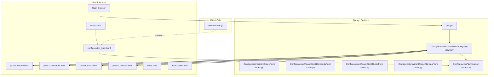
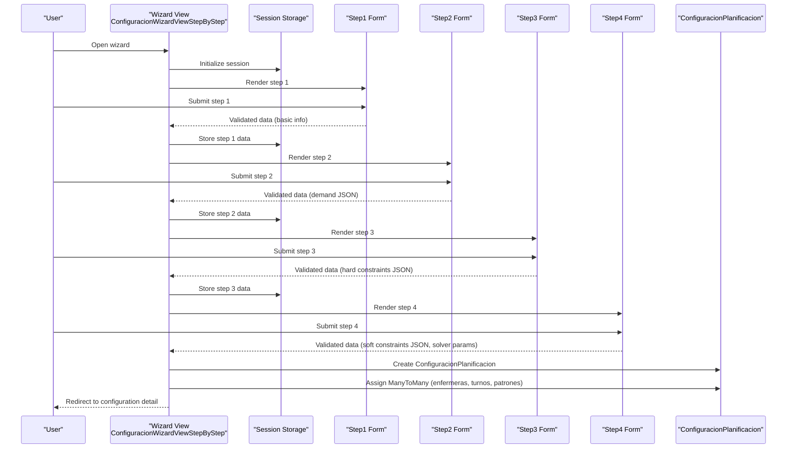
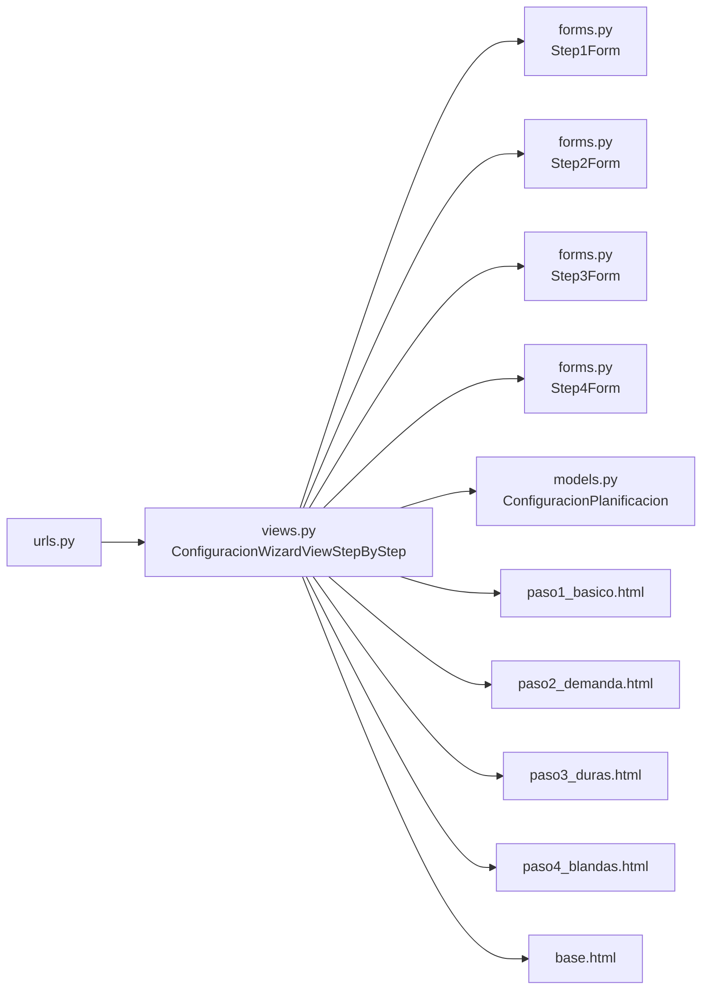

# Configuration Wizard

<cite>
**Referenced Files in This Document**
- [views.py](file://turnos/views.py)
- [forms.py](file://turnos/forms.py)
- [models.py](file://turnos/models.py)
- [urls.py](file://turnos/urls.py)
- [base.html](file://turnos/templates/turnos/wizard/base.html)
- [paso1_basico.html](file://turnos/templates/turnos/wizard/paso1_basico.html)
- [paso2_demanda.html](file://turnos/templates/turnos/wizard/paso2_demanda.html)
- [paso3_duras.html](file://turnos/templates/turnos/wizard/paso3_duras.html)
- [paso4_blandas.html](file://turnos/templates/turnos/wizard/paso4_blandas.html)
- [configuration_form.html](file://turnos/templates/turnos/configuration_form.html)
- [nueva.html](file://turnos/templates/turnos/config/nueva.html)
- [form_fields.html](file://turnos/templates/turnos/config/form_fields.html)
- [restricciones.js](file://static/js/restricciones.js)
</cite>

## Table of Contents
1. [Introduction](#introduction)
2. [Project Structure](#project-structure)
3. [Core Components](#core-components)
4. [Architecture Overview](#architecture-overview)
5. [Detailed Component Analysis](#detailed-component-analysis)
6. [Dependency Analysis](#dependency-analysis)
7. [Performance Considerations](#performance-considerations)
8. [Troubleshooting Guide](#troubleshooting-guide)
9. [Conclusion](#conclusion)

## Introduction
This document explains the step-by-step configuration wizard that guides users through creating scheduling configurations. It covers each wizard step (basic info, demand, hard constraints, soft constraints), form validation, data persistence across steps, error handling, and the relationship between wizard-generated configurations and direct form submissions. Practical examples, best practices, and troubleshooting tips are included to help both administrators and developers maintain and extend the system.

## Project Structure
The wizard is implemented as a multi-step Django session wizard backed by dedicated HTML templates and JavaScript helpers. The flow is routed via URLs to a wizard view that persists validated data into the database model for later execution.

**Diagram sources**
- [urls.py:23-30](file://turnos/urls.py#L23-L30)
- [views.py:378-482](file://turnos/views.py#L378-L482)
- [base.html:1-157](file://turnos/templates/turnos/wizard/base.html#L1-L157)
- [paso1_basico.html:1-225](file://turnos/templates/turnos/wizard/paso1_basico.html#L1-L225)
- [paso2_demanda.html:1-109](file://turnos/templates/turnos/wizard/paso2_demanda.html#L1-L109)
- [paso3_duras.html:1-243](file://turnos/templates/turnos/wizard/paso3_duras.html#L1-L243)
- [paso4_blandas.html:1-274](file://turnos/templates/turnos/wizard/paso4_blandas.html#L1-L274)
- [configuration_form.html:1-800](file://turnos/templates/turnos/configuration_form.html#L1-L800)
- [nueva.html:1-37](file://turnos/templates/turnos/config/nueva.html#L1-L37)
- [form_fields.html:1-13](file://turnos/templates/turnos/config/form_fields.html#L1-L13)
- [restricciones.js:1-568](file://static/js/restricciones.js#L1-L568)
- [models.py:332-480](file://turnos/models.py#L332-L480)

**Section sources**
- [urls.py:23-30](file://turnos/urls.py#L23-L30)
- [views.py:378-482](file://turnos/views.py#L378-L482)
- [base.html:1-157](file://turnos/templates/turnos/wizard/base.html#L1-L157)

## Core Components
- Step-by-step wizard controller: Orchestrates navigation, validation, and persistence across four steps.
- Forms per step: Validate and normalize user input for each step, including JSON fields.
- Templates per step: Present step-specific UI and collect user input.
- Model: Stores configuration data, including JSON fields for demand and constraints.
- Optional client-side builder: Provides visual builders for constraints and patterns in the direct form.

Key responsibilities:
- Persist validated wizard data into ConfiguracionPlanificacion.
- Ensure JSON fields are valid and normalized.
- Provide helpful error feedback and preserve user progress.

**Section sources**
- [views.py:378-482](file://turnos/views.py#L378-L482)
- [forms.py:328-512](file://turnos/forms.py#L328-L512)
- [models.py:332-480](file://turnos/models.py#L332-L480)

## Architecture Overview
The wizard uses Django’s SessionWizardView to keep step data in the session until completion. On completion, the wizard aggregates cleaned data from all steps and creates a ConfiguracionPlanificacion instance, including ManyToMany relations.

**Diagram sources**
- [views.py:378-482](file://turnos/views.py#L378-L482)
- [forms.py:328-512](file://turnos/forms.py#L328-L512)
- [models.py:332-480](file://turnos/models.py#L332-L480)

## Detailed Component Analysis

### Step 1: Basic Information
Purpose: Collects configuration metadata, selection of nurses and shift types, and sets the planning horizon.

Key validations:
- At least two nurses selected.
- At least one shift type selected.
- Number of days within allowed bounds.
- Start date is present.

UI highlights:
- Progress bar and step indicator.
- Checkbox lists for nurses and shift types.
- Help text and placeholders.

Persistence:
- Data stored in session until wizard completion.
- On completion, persisted to ConfiguracionPlanificacion and ManyToMany relations.

**Section sources**
- [paso1_basico.html:1-225](file://turnos/templates/turnos/wizard/paso1_basico.html#L1-L225)
- [base.html:1-157](file://turnos/templates/turnos/wizard/base.html#L1-L157)
- [forms.py:328-392](file://turnos/forms.py#L328-L392)
- [views.py:378-482](file://turnos/views.py#L378-L482)

### Step 2: Demand Forecasting
Purpose: Define staffing demand per shift type for the planning period.

Input format:
- JSON object keyed by shift type codes with min/optimal/max values.

Validations:
- If provided, must be a JSON object/dictionary.
- Empty input is accepted and treated as empty demand.

UI highlights:
- Example JSON provided for quick copy/paste.
- Clear guidance on min/optimal/max semantics.

Persistence:
- Stored as a JSON field in ConfiguracionPlanificacion.

**Section sources**
- [paso2_demanda.html:1-109](file://turnos/templates/turnos/wizard/paso2_demanda.html#L1-L109)
- [forms.py:394-419](file://turnos/forms.py#L394-L419)
- [models.py:360-364](file://turnos/models.py#L360-L364)

### Step 3: Hard Constraints Definition
Purpose: Define mandatory constraints the solver must satisfy.

Input format:
- JSON array of constraint objects with name and parameters.

Validations:
- If provided, must be a JSON array.
- Empty input is accepted and treated as no constraints.

UI highlights:
- Pre-filled example constraints for quick adoption.
- List of available hard constraints with brief descriptions.
- Notes on parameters and special cases.

Persistence:
- Stored as a JSON array in ConfiguracionPlanificacion.

**Section sources**
- [paso3_duras.html:1-243](file://turnos/templates/turnos/wizard/paso3_duras.html#L1-L243)
- [forms.py:421-446](file://turnos/forms.py#L421-L446)
- [models.py:367-378](file://turnos/models.py#L367-L378)

### Step 4: Soft Constraints Setup and Solver Parameters
Purpose: Define optional preferences (soft constraints), select built-in patterns, and configure solver parameters.

Soft constraints:
- JSON array of objects with name, weight, and optional parameters.
- Weight controls importance; higher weight increases priority.

Patterns:
- Built-in pattern templates (e.g., rest after consecutive shifts, maximum consecutive shifts, required sequences, blocked transitions, minimum coverage, equitable distribution).
- Patterns can be toggled on/off and configured via a visual builder.

Solver parameters:
- Parallel workers.
- Maximum solving time (seconds).
- Random seed for reproducibility.

UI highlights:
- Example soft constraints JSON.
- Visual sliders and toggles for weights and activation.
- Clear guidance on parameters and impact.

Persistence:
- Soft constraints JSON and solver parameters stored in ConfiguracionPlanificacion.
- Pattern selections mapped to JSON patterns for storage.

**Section sources**
- [paso4_blandas.html:1-274](file://turnos/templates/turnos/wizard/paso4_blandas.html#L1-L274)
- [forms.py:448-512](file://turnos/forms.py#L448-L512)
- [models.py:380-407](file://turnos/models.py#L380-L407)

### Relationship Between Wizard and Direct Form Submissions
The wizard and the direct form submission share the same underlying model and validation logic. The direct form (configuration_form.html) provides a single-page interface with visual builders for demand, hard constraints, soft constraints, and patterns. Both approaches persist identical JSON structures and ManyToMany relations.

Key equivalencies:
- Basic info (name, description, num_days, start_date, nurses, shift types) -> ConfiguracionPlanificacion fields.
- Demand JSON -> demanda_por_turno.
- Hard constraints JSON -> restricciones_duras.
- Soft constraints JSON -> restricciones_blandas.
- Pattern selections -> patrones_turnos_json.
- Solver parameters -> num_trabajadores, tiempo_maximo_segundos, seed.

Direct form advantages:
- Real-time visual builders and tooltips.
- Single submit vs. multi-step navigation.

Wizard advantages:
- Guided workflow with clear progress.
- Session-backed step navigation.

**Section sources**
- [configuration_form.html:1-800](file://turnos/templates/turnos/configuration_form.html#L1-L800)
- [nueva.html:1-37](file://turnos/templates/turnos/config/nueva.html#L1-L37)
- [form_fields.html:1-13](file://turnos/templates/turnos/config/form_fields.html#L1-L13)
- [forms.py:164-326](file://turnos/forms.py#L164-L326)
- [models.py:332-480](file://turnos/models.py#L332-L480)

### Client-Side Constraint Builders (Optional)
The direct form leverages JavaScript to build constraints and patterns visually. It serializes the current state into hidden JSON fields for submission.

Highlights:
- Visual builder for hard constraints with parameter inputs.
- Visual builder for soft constraints with weight sliders.
- Visual builder for patterns with configurable fields.
- Validation ensures at least one hard constraint exists before allowing submission.

**Section sources**
- [restricciones.js:1-568](file://static/js/restricciones.js#L1-L568)
- [configuration_form.html:1-800](file://turnos/templates/turnos/configuration_form.html#L1-L800)

## Dependency Analysis
The wizard depends on:
- Django SessionWizardView for multi-step navigation and session-backed data.
- Step-specific forms for validation and normalization of JSON fields.
- ConfiguracionPlanificacion model for persistence.
- Templates for rendering each step and the shared base layout.

**Diagram sources**
- [urls.py:23-30](file://turnos/urls.py#L23-L30)
- [views.py:378-482](file://turnos/views.py#L378-L482)
- [forms.py:328-512](file://turnos/forms.py#L328-L512)
- [models.py:332-480](file://turnos/models.py#L332-L480)
- [base.html:1-157](file://turnos/templates/turnos/wizard/base.html#L1-L157)
- [paso1_basico.html:1-225](file://turnos/templates/turnos/wizard/paso1_basico.html#L1-L225)
- [paso2_demanda.html:1-109](file://turnos/templates/turnos/wizard/paso2_demanda.html#L1-L109)
- [paso3_duras.html:1-243](file://turnos/templates/turnos/wizard/paso3_duras.html#L1-L243)
- [paso4_blandas.html:1-274](file://turnos/templates/turnos/wizard/paso4_blandas.html#L1-L274)

**Section sources**
- [urls.py:23-30](file://turnos/urls.py#L23-L30)
- [views.py:378-482](file://turnos/views.py#L378-L482)
- [forms.py:328-512](file://turnos/forms.py#L328-L512)
- [models.py:332-480](file://turnos/models.py#L332-L480)

## Performance Considerations
- Solver parameters: Adjust num_trabajadores and tiempo_maximo_segundos based on dataset size and hardware capabilities. Higher worker counts increase CPU usage; longer timeouts improve solution quality but delay execution.
- JSON sizes: Large demand or constraint JSON structures increase serialization overhead. Keep JSON concise and avoid redundant entries.
- Pattern complexity: Complex pattern sets (e.g., long sequences, multiple blocked transitions) can increase solving time. Prefer simpler patterns when feasible.
- Database writes: The wizard performs a single atomic transaction for creation and relation assignment, minimizing write contention.

## Troubleshooting Guide
Common issues and resolutions:
- JSON validation errors:
  - Ensure demand, hard constraints, and soft constraints are valid JSON arrays or objects as required by each step.
  - Use the provided examples as templates and adjust values carefully.
- Missing required selections:
  - Nurses and shift types must meet minimum counts. Verify selections on step 1.
- Wizard completion failures:
  - Review server logs for exceptions during creation or relation assignment.
  - Confirm that JSON fields are properly serialized and normalized.
- Direct form submission issues:
  - If using visual builders, ensure all required fields are filled and at least one hard constraint is present.
  - Check browser console for JavaScript errors in the builder scripts.

Operational checks:
- Verify URL routing to the wizard and that the step templates render correctly.
- Confirm that the model fields match the expected JSON structures.

**Section sources**
- [forms.py:231-284](file://turnos/forms.py#L231-L284)
- [forms.py:408-446](file://turnos/forms.py#L408-L446)
- [forms.py:501-512](file://turnos/forms.py#L501-L512)
- [views.py:404-482](file://turnos/views.py#L404-L482)
- [restricciones.js:523-539](file://static/js/restricciones.js#L523-L539)

## Conclusion
The configuration wizard provides a guided, structured approach to define scheduling configurations, while the direct form offers a powerful visual builder for advanced users. Both pathways produce identical model structures and JSON fields, enabling consistent execution and reporting. By following the validation rules, using the provided examples, and tuning solver parameters, administrators can create robust, maintainable scheduling configurations tailored to their operational needs.