# Core Features

<cite>
**Referenced Files in This Document**
- [models.py](file://turnos/models.py)
- [generador.py](file://turnos/generador.py)
- [resolvedor.py](file://turnos/resolvedor.py)
- [pipeline.py](file://turnos/motor/pipeline.py)
- [restricciones_duras.py](file://turnos/restricciones_duras.py)
- [restricciones_blandas.py](file://turnos/restricciones_blandas.py)
- [generador_patrones.py](file://turnos/generador_patrones.py)
- [rotacion_base.py](file://turnos/motor/rotacion_base.py)
- [incidencias.py](file://turnos/motor/incidencias.py)
- [dtos.py](file://turnos/dominio/dtos.py)
- [vocabulario.py](file://turnos/dominio/vocabulario.py)
- [views.py](file://turnos/views.py)
- [forms.py](file://turnos/forms.py)
</cite>

## Table of Contents
1. [Introduction](#introduction)
2. [Project Structure](#project-structure)
3. [Core Components](#core-components)
4. [Architecture Overview](#architecture-overview)
5. [Detailed Component Analysis](#detailed-component-analysis)
6. [Dependency Analysis](#dependency-analysis)
7. [Performance Considerations](#performance-considerations)
8. [Troubleshooting Guide](#troubleshooting-guide)
9. [Conclusion](#conclusion)
10. [Appendices](#appendices)

## Introduction
This document explains the core scheduling features of the system, focusing on shift generation, constraint management, and rotation patterns. It covers the wizard-based configuration process, demand forecasting, hard and soft constraint definitions, and the CP-SAT solver integration. It also documents the cyclic rotation system, individual staff preferences handling, conflict resolution mechanisms, and the planning pipeline from configuration input through coverage analysis to final solution generation. Staff management features, incident handling for vacations and leaves, and preference-based scheduling adjustments are included, along with practical examples of common scheduling scenarios.

## Project Structure
The scheduling system is organized around Django models, a CP-SAT generator and solver, a pipeline orchestrating deterministic rotation, hours adjustment, coverage analysis, optional repair with CP-SAT, and validation. Domain objects decouple the engine from Django models. Forms and views support the wizard-based configuration and execution.

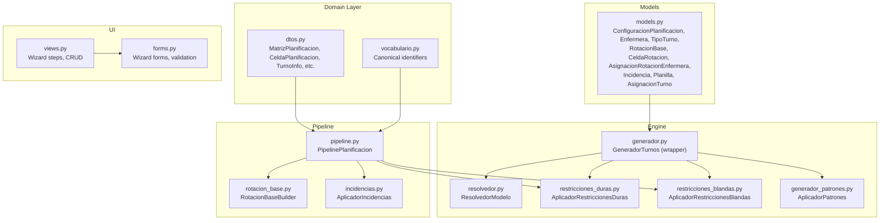

**Diagram sources**
- [models.py:30-825](file://turnos/models.py#L30-L825)
- [generador.py:26-65](file://turnos/generador.py#L26-L65)
- [resolvedor.py:11-113](file://turnos/resolvedor.py#L11-L113)
- [restricciones_duras.py:10-156](file://turnos/restricciones_duras.py#L10-L156)
- [restricciones_blandas.py:9-138](file://turnos/restricciones_blandas.py#L9-L138)
- [generador_patrones.py:7-231](file://turnos/generador_patrones.py#L7-L231)
- [pipeline.py:31-267](file://turnos/motor/pipeline.py#L31-L267)
- [rotacion_base.py:21-94](file://turnos/motor/rotacion_base.py#L21-L94)
- [incidencias.py:21-98](file://turnos/motor/incidencias.py#L21-L98)
- [dtos.py:43-274](file://turnos/dominio/dtos.py#L43-L274)
- [vocabulario.py:7-112](file://turnos/dominio/vocabulario.py#L7-L112)
- [views.py:148-200](file://turnos/views.py#L148-L200)
- [forms.py:328-513](file://turnos/forms.py#L328-L513)

**Section sources**
- [models.py:30-825](file://turnos/models.py#L30-L825)
- [pipeline.py:31-267](file://turnos/motor/pipeline.py#L31-L267)
- [dtos.py:43-274](file://turnos/dominio/dtos.py#L43-L274)
- [vocabulario.py:7-112](file://turnos/dominio/vocabulario.py#L7-L112)
- [views.py:148-200](file://turnos/views.py#L148-L200)
- [forms.py:328-513](file://turnos/forms.py#L328-L513)

## Core Components
- Shift generation and CP-SAT integration:
  - The generator wraps a refactored engine and delegates to CP-SAT via a solver wrapper. Constraints are applied as hard constraints and soft penalties; the solver extracts assignments and validates results.
- Constraint management:
  - Hard constraints enforce mandatory rules (e.g., daily single shift, minimum 12-hour break between shifts, weekly rest, maximum consecutive shifts, coverage bounds).
  - Soft constraints define objectives (e.g., equity of turns, minimizing night shifts, meeting optimal demand).
- Rotation patterns:
  - Pattern application supports descanso post turno, max consecutive, and rotation cycles. These are encoded as either hard constraints or soft penalties depending on configuration.
- Planning pipeline:
  - Deterministic base rotation → hours adjustment per contract → coverage analysis → optional CP-SAT repair → validation.
- Wizard-based configuration:
  - Multi-step forms capture basic info, demand, hard and soft constraints, solver parameters, and pattern definitions. Views orchestrate persistence and JSON normalization/validation.
- Staff management and incidents:
  - Staff profiles include preferences; incidents (vacations, permissions, sick leave, training, fixed assignments) are applied after base generation to block or fix cells.

**Section sources**
- [generador.py:26-65](file://turnos/generador.py#L26-L65)
- [resolvedor.py:11-113](file://turnos/resolvedor.py#L11-L113)
- [restricciones_duras.py:10-156](file://turnos/restricciones_duras.py#L10-L156)
- [restricciones_blandas.py:9-138](file://turnos/restricciones_blandas.py#L9-L138)
- [generador_patrones.py:7-231](file://turnos/generador_patrones.py#L7-L231)
- [pipeline.py:31-267](file://turnos/motor/pipeline.py#L31-L267)
- [rotacion_base.py:21-94](file://turnos/motor/rotacion_base.py#L21-L94)
- [incidencias.py:21-98](file://turnos/motor/incidencias.py#L21-L98)
- [views.py:148-200](file://turnos/views.py#L148-L200)
- [forms.py:328-513](file://turnos/forms.py#L328-L513)

## Architecture Overview
The system separates concerns across domain DTOs, Django models, engine components, and the pipeline. The CP-SAT solver is configured with worker count, timeout, and seed. Constraints are applied in two layers: hard constraints enforced by the model, and soft constraints turned into penalties for the objective function.

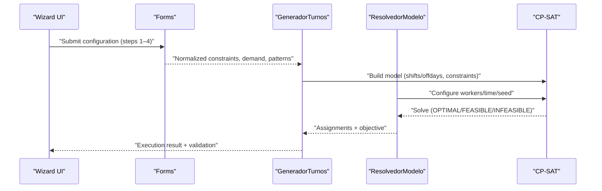

**Diagram sources**
- [generador.py:26-65](file://turnos/generador.py#L26-L65)
- [resolvedor.py:11-113](file://turnos/resolvedor.py#L11-L113)
- [restricciones_duras.py:10-156](file://turnos/restricciones_duras.py#L10-L156)
- [restricciones_blandas.py:9-138](file://turnos/restricciones_blandas.py#L9-L138)
- [generador_patrones.py:7-231](file://turnos/generador_patrones.py#L7-L231)
- [views.py:148-200](file://turnos/views.py#L148-L200)
- [forms.py:328-513](file://turnos/forms.py#L328-L513)

## Detailed Component Analysis

### Shift Generation and CP-SAT Integration
- Generator wrapper delegates to a refactored engine that builds variables for shifts and off-days, applies constraints, and constructs penalties. The solver wrapper configures parallel workers, time limits, and seed, then extracts assignments and runs validation.
- The generator also exposes a validator wrapper for legacy compatibility.

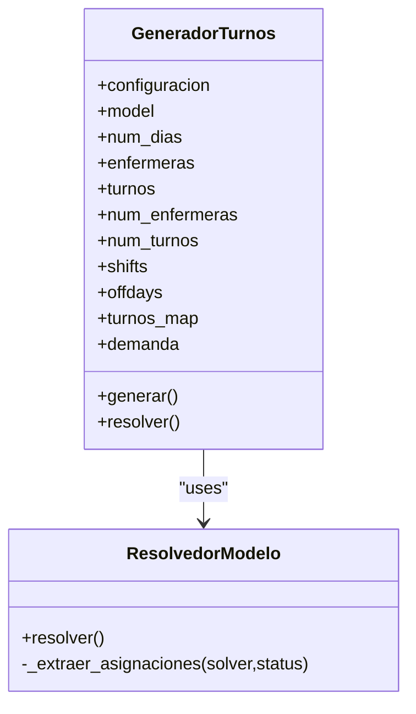

**Diagram sources**
- [generador.py:26-65](file://turnos/generador.py#L26-L65)
- [resolvedor.py:11-113](file://turnos/resolvedor.py#L11-L113)

**Section sources**
- [generador.py:26-65](file://turnos/generador.py#L26-L65)
- [resolvedor.py:11-113](file://turnos/resolvedor.py#L11-L113)

### Constraint Management: Hard and Soft
- Hard constraints:
  - Single shift per day per nurse.
  - Minimum 12-hour break between shifts.
  - Coverage bounds (min/max) per shift type.
  - Annual minimum days off.
  - Weekly rest policy.
  - Maximum consecutive shifts (configurable).
- Soft constraints:
  - Equity of total turns across nurses.
  - Minimize night shifts.
  - Prefer optimal demand targets.

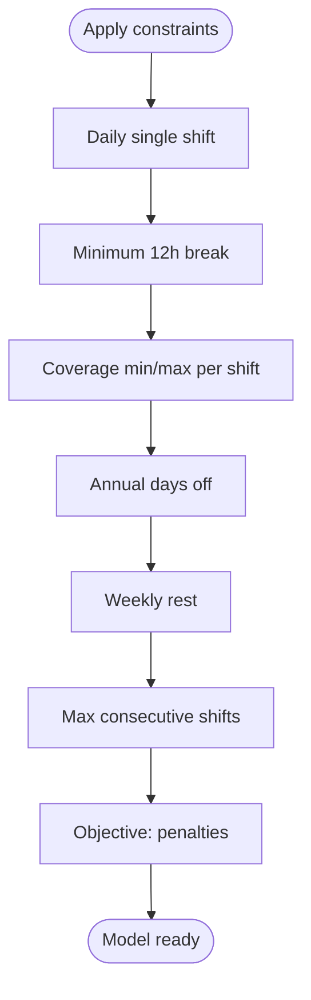

**Diagram sources**
- [restricciones_duras.py:10-156](file://turnos/restricciones_duras.py#L10-L156)
- [restricciones_blandas.py:9-138](file://turnos/restricciones_blandas.py#L9-L138)

**Section sources**
- [restricciones_duras.py:10-156](file://turnos/restricciones_duras.py#L10-L156)
- [restricciones_blandas.py:9-138](file://turnos/restricciones_blandas.py#L9-L138)

### Rotation Patterns Application
- Patterns supported include descanso post turno, max consecutive, and rotation cycles. They can be enforced as hard constraints or as soft penalties with weights.
- The pattern applicator iterates over nurses, windows, and turn types to encode implications and penalties.

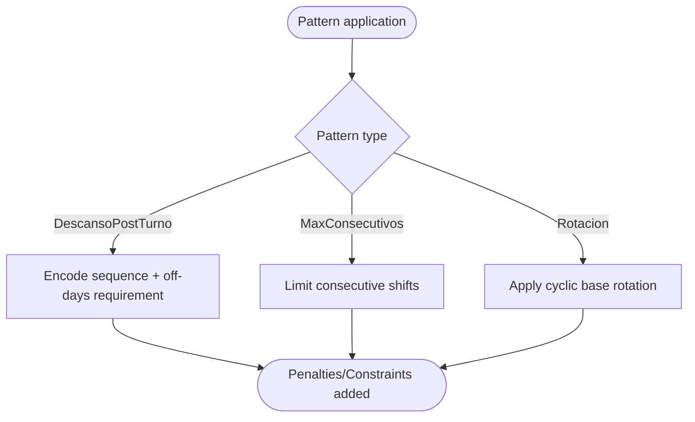

**Diagram sources**
- [generador_patrones.py:7-231](file://turnos/generador_patrones.py#L7-L231)

**Section sources**
- [generador_patrones.py:7-231](file://turnos/generador_patrones.py#L7-L231)

### Planning Pipeline: From Configuration to Solution
- The pipeline orchestrates five phases:
  1) Build deterministic base rotation from configured cycles and offsets.
  2) Adjust hours according to contractual targets.
  3) Analyze coverage and compute deviations.
  4) Repair conflicts with CP-SAT if needed.
  5) Validate the final matrix and collect metrics.

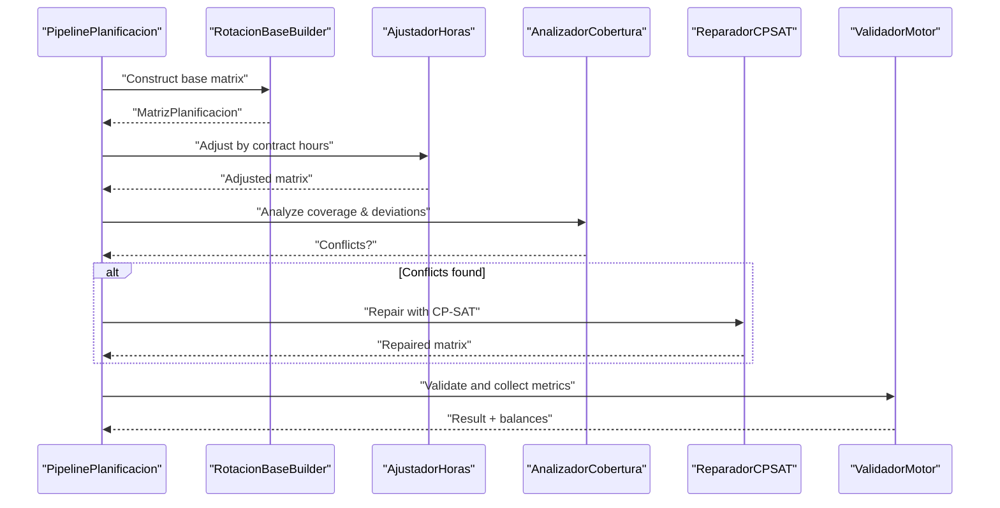

**Diagram sources**
- [pipeline.py:31-267](file://turnos/motor/pipeline.py#L31-L267)
- [rotacion_base.py:21-94](file://turnos/motor/rotacion_base.py#L21-L94)

**Section sources**
- [pipeline.py:31-267](file://turnos/motor/pipeline.py#L31-L267)
- [rotacion_base.py:21-94](file://turnos/motor/rotacion_base.py#L21-L94)

### Wizard-Based Configuration Process
- Step 1: Basic info (name, description, period, staff, shift types).
- Step 2: Demand by shift type (min/optimal/max).
- Step 3: Hard constraints (JSON/array).
- Step 4: Soft constraints, patterns, solver parameters.
- Forms validate JSON, lists, and selections; views persist configurations and handle pattern JSON processing.

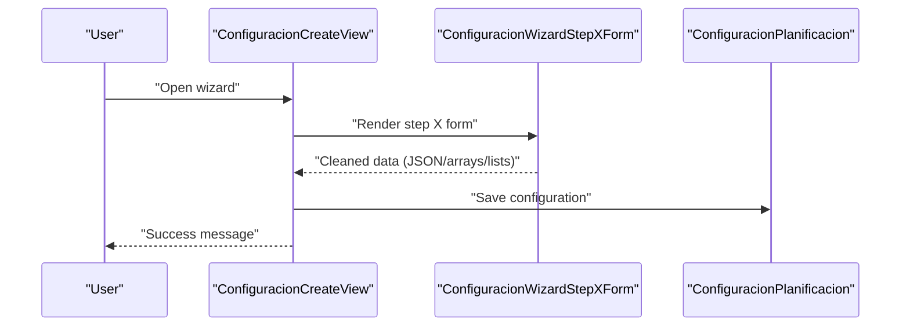

**Diagram sources**
- [views.py:148-200](file://turnos/views.py#L148-L200)
- [forms.py:328-513](file://turnos/forms.py#L328-L513)

**Section sources**
- [views.py:148-200](file://turnos/views.py#L148-L200)
- [forms.py:328-513](file://turnos/forms.py#L328-L513)

### Staff Management and Incidents
- Staff profiles include preferences stored as JSON; contracts define target hours and percentages.
- Incidents (vacations, permissions, sick leave, training, fixed assignments) are applied to the base matrix to mark non-modifiable cells and set appropriate cell types.

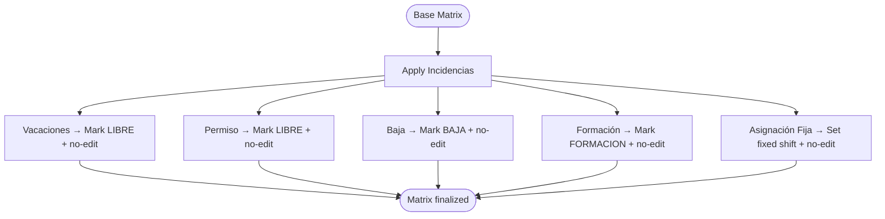

**Diagram sources**
- [incidencias.py:21-98](file://turnos/motor/incidencias.py#L21-L98)
- [models.py:629-784](file://turnos/models.py#L629-L784)

**Section sources**
- [incidencias.py:21-98](file://turnos/motor/incidencias.py#L21-L98)
- [models.py:629-784](file://turnos/models.py#L629-L784)

### Cyclic Rotation System
- Explicit rotation cycles define repeating sequences of shifts or free days. Each nurse’s assignment includes a cycle, position within the cycle, and optional phase offset. The builder assigns turn types or frees based on cycle positions and flags.

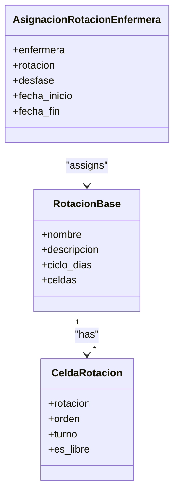

**Diagram sources**
- [models.py:666-746](file://turnos/models.py#L666-L746)

**Section sources**
- [models.py:666-746](file://turnos/models.py#L666-L746)

### Conflict Resolution Mechanisms
- Coverage analysis detects conflicts; if present, the repair component adjusts the matrix using CP-SAT to minimize deviations from base rotation and contractual hours while satisfying hard constraints. Final validation ensures compliance.

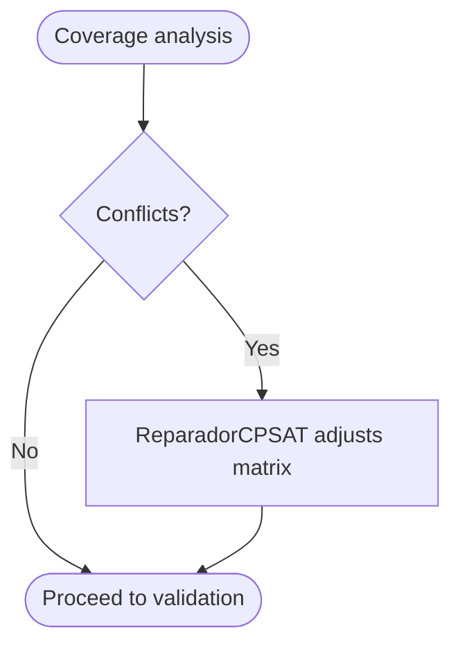

**Diagram sources**
- [pipeline.py:170-200](file://turnos/motor/pipeline.py#L170-L200)

**Section sources**
- [pipeline.py:170-200](file://turnos/motor/pipeline.py#L170-L200)

### Practical Examples of Common Scenarios
- Scenario A: Balanced weekly workload
  - Define hard constraints: weekly rest and max consecutive shifts; soft constraints: equity of turns and minimizing nights.
  - Configure demand per shift type and run the pipeline.
- Scenario B: Vacation coverage
  - Add vacation incidents for affected dates; the system marks those cells as non-modifiable and free; adjust demand accordingly.
- Scenario C: Contractual hours
  - Set target hours per nurse; the hours adjustment phase ensures totals align with contracts.
- Scenario D: Pattern-based rotation
  - Apply rotation patterns (e.g., after N nights, require M days off) as hard constraints or soft penalties depending on policy.

[No sources needed since this section provides scenario guidance without analyzing specific files]

## Dependency Analysis
The system exhibits layered cohesion:
- Domain DTOs and vocabulary decouple engine logic from Django models.
- The generator depends on CP-SAT and constraint applicators.
- The pipeline composes builders, analyzers, and validators.
- Forms and views depend on models and configuration JSON normalization.

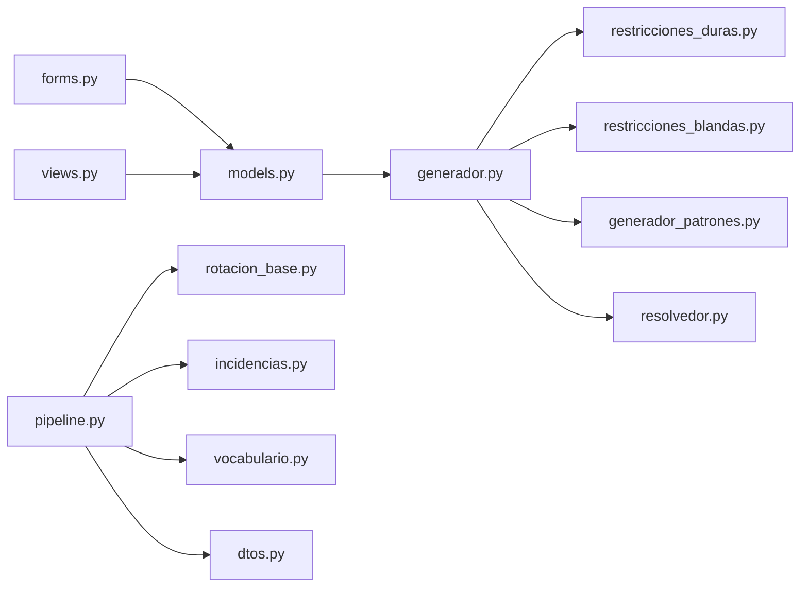

**Diagram sources**
- [forms.py:328-513](file://turnos/forms.py#L328-L513)
- [views.py:148-200](file://turnos/views.py#L148-L200)
- [models.py:30-825](file://turnos/models.py#L30-L825)
- [generador.py:26-65](file://turnos/generador.py#L26-L65)
- [restricciones_duras.py:10-156](file://turnos/restricciones_duras.py#L10-L156)
- [restricciones_blandas.py:9-138](file://turnos/restricciones_blandas.py#L9-L138)
- [generador_patrones.py:7-231](file://turnos/generador_patrones.py#L7-L231)
- [resolvedor.py:11-113](file://turnos/resolvedor.py#L11-L113)
- [pipeline.py:31-267](file://turnos/motor/pipeline.py#L31-L267)
- [rotacion_base.py:21-94](file://turnos/motor/rotacion_base.py#L21-L94)
- [incidencias.py:21-98](file://turnos/motor/incidencias.py#L21-L98)
- [vocabulario.py:7-112](file://turnos/dominio/vocabulario.py#L7-L112)
- [dtos.py:43-274](file://turnos/dominio/dtos.py#L43-L274)

**Section sources**
- [forms.py:328-513](file://turnos/forms.py#L328-L513)
- [views.py:148-200](file://turnos/views.py#L148-L200)
- [models.py:30-825](file://turnos/models.py#L30-L825)
- [generador.py:26-65](file://turnos/generador.py#L26-L65)
- [restricciones_duras.py:10-156](file://turnos/restricciones_duras.py#L10-L156)
- [restricciones_blandas.py:9-138](file://turnos/restricciones_blandas.py#L9-L138)
- [generador_patrones.py:7-231](file://turnos/generador_patrones.py#L7-L231)
- [resolvedor.py:11-113](file://turnos/resolvedor.py#L11-L113)
- [pipeline.py:31-267](file://turnos/motor/pipeline.py#L31-L267)
- [rotacion_base.py:21-94](file://turnos/motor/rotacion_base.py#L21-L94)
- [incidencias.py:21-98](file://turnos/motor/incidencias.py#L21-L98)
- [vocabulario.py:7-112](file://turnos/dominio/vocabulario.py#L7-L112)
- [dtos.py:43-274](file://turnos/dominio/dtos.py#L43-L274)

## Performance Considerations
- Solver configuration: tune parallel workers, time limit, and seed for reproducibility and performance.
- Constraint granularity: reduce unnecessary penalties; prefer hard constraints for critical policies.
- Coverage analysis: keep demand and contract targets realistic to avoid excessive repairs.
- Rotation cycles: shorter cycles increase flexibility but may raise complexity; ensure patterns match real-world expectations.

[No sources needed since this section provides general guidance]

## Troubleshooting Guide
- No feasible solution:
  - Review hard constraints and coverage demands; relax some constraints temporarily to isolate infeasibility.
  - Increase solver time or workers cautiously.
- Excessive modifications during repair:
  - Reduce penalties or adjust rotation base to minimize changes.
- Validation failures:
  - Inspect generated assignments and re-run validation; check for overlapping incidents and conflicting patterns.

**Section sources**
- [resolvedor.py:21-50](file://turnos/resolvedor.py#L21-L50)
- [pipeline.py:236-245](file://turnos/motor/pipeline.py#L236-L245)

## Conclusion
The system integrates deterministic rotation, CP-SAT optimization, and robust constraint management to produce fair and feasible schedules. The wizard streamlines configuration, while domain DTOs and canonical vocabularies ensure clarity and maintainability. Incident handling and preference-aware adjustments further tailor solutions to operational needs.

[No sources needed since this section summarizes without analyzing specific files]

## Appendices
- Demand forecasting:
  - Supply demand per shift type as min/optimal/max; the system uses these to guide coverage analysis and soft penalties.
- Preference-based adjustments:
  - Preferences are captured in staff profiles; while explicit preference constraints are not shown in the referenced files, the framework supports extending soft constraints to incorporate preferences.
- Canonical identifiers:
  - Use canonical names for constraints and patterns to ensure consistent interpretation across the engine, validator, and configuration UI.

**Section sources**
- [vocabulario.py:7-112](file://turnos/dominio/vocabulario.py#L7-L112)
- [dtos.py:135-181](file://turnos/dominio/dtos.py#L135-L181)
- [models.py:30-825](file://turnos/models.py#L30-L825)