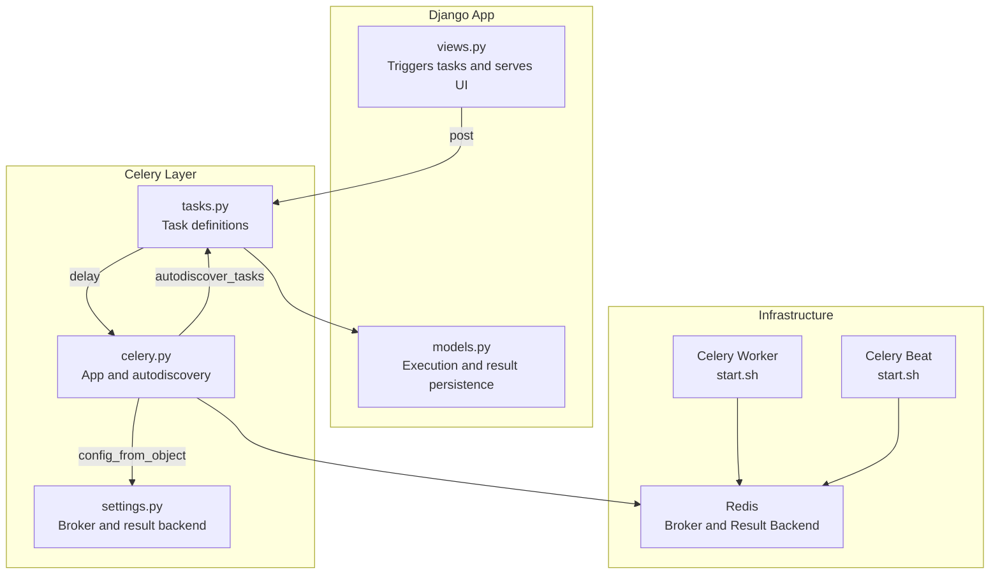
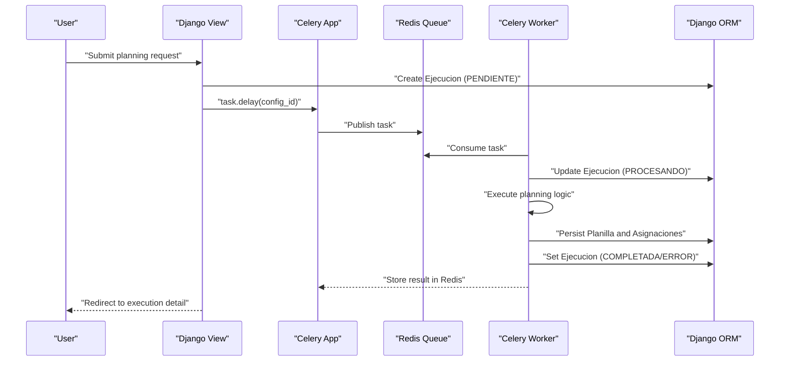
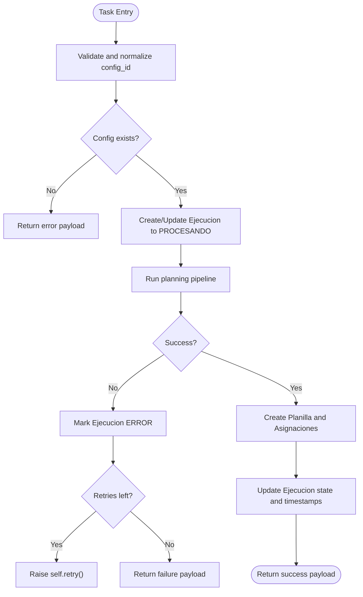
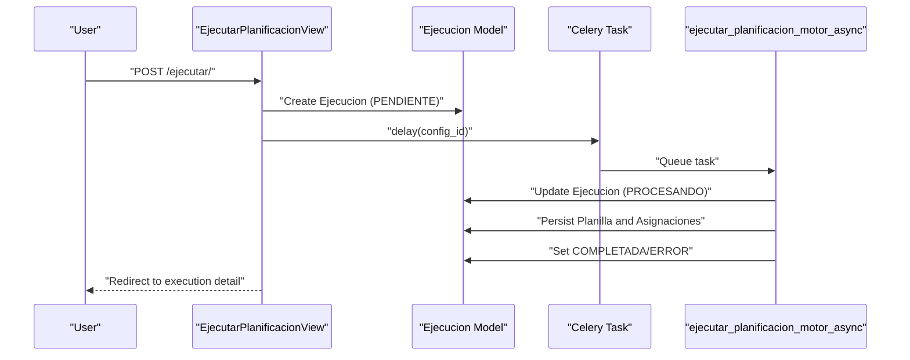
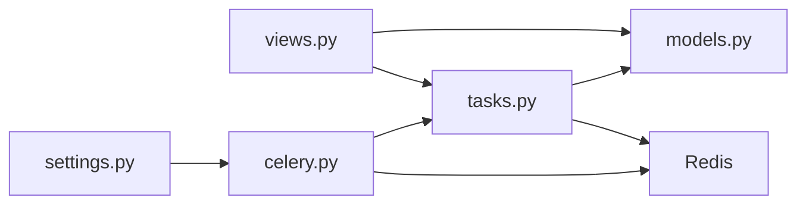

# Asynchronous Task Processing

<cite>
**Referenced Files in This Document**
- [celery.py](file://proyecto_turnos/celery.py)
- [settings.py](file://proyecto_turnos/settings.py)
- [tasks.py](file://turnos/tasks.py)
- [views.py](file://turnos/views.py)
- [models.py](file://turnos/models.py)
- [start.sh](file://start.sh)
- [ajax-helpers.js](file://turnos/static/js/ajax-helpers.js)
- [API.md](file://docs/API.md)
</cite>

## Table of Contents
1. [Introduction](#introduction)
2. [Project Structure](#project-structure)
3. [Core Components](#core-components)
4. [Architecture Overview](#architecture-overview)
5. [Detailed Component Analysis](#detailed-component-analysis)
6. [Dependency Analysis](#dependency-analysis)
7. [Performance Considerations](#performance-considerations)
8. [Troubleshooting Guide](#troubleshooting-guide)
9. [Conclusion](#conclusion)
10. [Appendices](#appendices)

## Introduction
This document explains the asynchronous execution architecture built with Celery and Redis. It covers how background jobs are submitted, processed, tracked, and persisted, along with the lifecycle of tasks from initiation to completion. It also documents Celery configuration, worker management, task routing, error handling, retries, timeouts, and performance optimization techniques. Practical examples show how to submit tasks, monitor progress, and implement custom task handlers.

## Project Structure
The asynchronous execution spans several modules:
- Celery app initialization and configuration
- Task definitions for planning and reporting
- Django views that trigger tasks and expose monitoring endpoints
- Models that persist execution state and results
- Startup scripts that launch Celery workers and beat
- Frontend helpers for polling execution status

**Diagram sources**
- [celery.py:1-14](file://proyecto_turnos/celery.py#L1-L14)
- [settings.py:134-159](file://proyecto_turnos/settings.py#L134-L159)
- [tasks.py:17-240](file://turnos/tasks.py#L17-L240)
- [views.py:722-791](file://turnos/views.py#L722-L791)
- [models.py:482-531](file://turnos/models.py#L482-L531)
- [start.sh:147-182](file://start.sh#L147-L182)

**Section sources**
- [celery.py:1-14](file://proyecto_turnos/celery.py#L1-L14)
- [settings.py:134-159](file://proyecto_turnos/settings.py#L134-L159)
- [tasks.py:17-240](file://turnos/tasks.py#L17-L240)
- [views.py:722-791](file://turnos/views.py#L722-L791)
- [models.py:482-531](file://turnos/models.py#L482-L531)
- [start.sh:147-182](file://start.sh#L147-L182)

## Core Components
- Celery app and autodiscovery: Initializes the Celery app and discovers tasks automatically.
- Celery configuration: Defines broker and result backend URIs, serialization, timezone, limits, and worker event settings.
- Task definitions: Two primary tasks implement the planning pipeline and a cleanup task.
- Django views: Trigger tasks asynchronously and manage execution records.
- Execution models: Persist execution state, timing, results, and messages.
- Startup orchestration: Launches Celery worker and beat with Redis.

Key responsibilities:
- Task submission: Views dispatch tasks via Celery’s delay method.
- Execution state: Models track status, timestamps, and outcomes.
- Persistence: Results and intermediate artifacts are stored in the database.
- Monitoring: Frontend polls execution status via AJAX helpers.

**Section sources**
- [celery.py:8-10](file://proyecto_turnos/celery.py#L8-L10)
- [settings.py:135-159](file://proyecto_turnos/settings.py#L135-L159)
- [tasks.py:17-240](file://turnos/tasks.py#L17-L240)
- [views.py:722-791](file://turnos/views.py#L722-L791)
- [models.py:482-531](file://turnos/models.py#L482-L531)
- [start.sh:147-182](file://start.sh#L147-L182)

## Architecture Overview
The system uses Redis as both the message broker and result backend. Celery workers consume tasks from Redis queues, execute them, and write results back to Redis. Django views create execution records and dispatch tasks. The frontend polls execution status to reflect progress.

**Diagram sources**
- [views.py:722-791](file://turnos/views.py#L722-L791)
- [tasks.py:17-240](file://turnos/tasks.py#L17-L240)
- [models.py:482-531](file://turnos/models.py#L482-L531)
- [settings.py:135-136](file://proyecto_turnos/settings.py#L135-L136)

## Detailed Component Analysis

### Celery App Initialization
- Sets the Django settings module and configures the Celery app from Django settings with the CELERY namespace.
- Enables automatic discovery of tasks in installed apps.

Operational impact:
- Ensures tasks are loaded from the turnos app.
- Inherits serialization, timezone, and result backend settings from Django settings.

**Section sources**
- [celery.py:5-10](file://proyecto_turnos/celery.py#L5-L10)

### Celery Configuration
- Broker and result backend: Redis by default; configurable via environment variables.
- Serialization: JSON for tasks and results.
- Timezone: Europe/Madrid with UTC enabled.
- Task limits: Hard and soft time limits configured.
- Result backend behavior: Extended metadata and retries.
- Worker events: Enabled to track task lifecycle.

Best practices:
- Keep serialization consistent across services.
- Align timezone with application expectations.
- Tune time limits based on workload characteristics.

**Section sources**
- [settings.py:135-159](file://proyecto_turnos/settings.py#L135-L159)

### Task Definitions

#### Primary Planning Task
- Name: [ejecutar_planificacion_motor_async:334-696](file://turnos/tasks.py#L334-L696)
- Purpose: Executes the new planning pipeline, creates an execution record, runs the pipeline, persists planilla and assignments, and updates execution state.
- Retry behavior: Uses bind=True with max_retries and default_retry_delay.
- Error handling: Marks execution as ERROR, captures exception details, and retries up to configured limit.

Processing stages:
1. Validate and normalize configuration ID.
2. Fetch configuration and related entities.
3. Create or update execution record to PROCESANDO.
4. Run pipeline and collect results.
5. Persist planilla and assignments in bulk.
6. Update execution state and timestamps.
7. Return structured result.

**Diagram sources**
- [tasks.py:334-696](file://turnos/tasks.py#L334-L696)

**Section sources**
- [tasks.py:334-696](file://turnos/tasks.py#L334-L696)

#### Legacy Planning Task
- Name: [ejecutar_planificacion_async:17-240](file://turnos/tasks.py#L17-L240)
- Purpose: Legacy implementation of planning logic with similar lifecycle and error handling.
- Behavior: Validates input, manages execution record, runs generator, persists planilla and assignments, and updates execution state.

**Section sources**
- [tasks.py:17-240](file://turnos/tasks.py#L17-L240)

#### Support Tasks
- Name: [limpiar_ejecuciones_antiguas:242-268](file://turnos/tasks.py#L242-L268)
  - Purpose: Periodic cleanup of old completed/error executions older than N days.
  - Invocation example: See [API.md:75-82](file://docs/API.md#L75-L82).
- Name: [generar_reporte_estadisticas:271-314](file://turnos/tasks.py#L271-L314)
  - Purpose: Aggregates monthly statistics for executions and planillas.
- Name: [test_db_connection:316-332](file://turnos/tasks.py#L316-L332)
  - Purpose: Basic connectivity check against the database.

**Section sources**
- [tasks.py:242-268](file://turnos/tasks.py#L242-L268)
- [tasks.py:271-314](file://turnos/tasks.py#L271-L314)
- [tasks.py:316-332](file://turnos/tasks.py#L316-L332)
- [API.md:75-82](file://docs/API.md#L75-L82)

### Django Views and Execution Lifecycle
- View: [EjecutarPlanificacionView.post:722-791](file://turnos/views.py#L722-L791)
  - Creates an Ejecucion record in PENDIENTE state.
  - Dispatches the planning task via Celery.
  - Redirects to the execution detail page.
  - Handles errors during task dispatch by marking execution as ERROR.

Execution model: [Ejecucion:482-531](file://turnos/models.py#L482-L531)
- Fields include state, timestamps, optimality flag, penalties, raw results, and messages.
- Provides duration property computed from timestamps.

**Diagram sources**
- [views.py:722-791](file://turnos/views.py#L722-L791)
- [tasks.py:334-696](file://turnos/tasks.py#L334-L696)
- [models.py:482-531](file://turnos/models.py#L482-L531)

**Section sources**
- [views.py:722-791](file://turnos/views.py#L722-L791)
- [models.py:482-531](file://turnos/models.py#L482-L531)

### Execution State Tracking and Progress Monitoring
- Frontend polling: [obtenerEstadoEjecucion:234-236](file://turnos/static/js/ajax-helpers.js#L234-L236) and [monitorizarEjecucion:241-250](file://turnos/static/js/ajax-helpers.js#L241-L250) periodically fetch execution status and stop polling upon completion.
- Polling interval and maximum attempts are encapsulated in the helper.

Usage pattern:
- On task submission, store the execution ID.
- Start polling with callbacks for updates and completion.

**Section sources**
- [ajax-helpers.js:234-250](file://turnos/static/js/ajax-helpers.js#L234-L250)

### Startup and Worker Management
- Environment variables for Celery are set based on Redis availability.
- Celery worker and beat are launched in background with logging to temporary files.
- Concurrency is configured in the startup script.

Operational notes:
- Ensure Redis is reachable before starting workers.
- Monitor worker and beat logs for failures.

**Section sources**
- [start.sh:147-182](file://start.sh#L147-L182)

## Dependency Analysis
High-level dependencies:
- Celery app depends on Django settings for configuration.
- Tasks depend on Django models for persistence and on domain logic for planning.
- Views depend on tasks for background execution and on models for state.
- Infrastructure (Redis) underpins both broker and result storage.

**Diagram sources**
- [settings.py:134-159](file://proyecto_turnos/settings.py#L134-L159)
- [celery.py:8-10](file://proyecto_turnos/celery.py#L8-L10)
- [tasks.py:17-240](file://turnos/tasks.py#L17-L240)
- [models.py:482-531](file://turnos/models.py#L482-L531)
- [views.py:722-791](file://turnos/views.py#L722-L791)

**Section sources**
- [settings.py:134-159](file://proyecto_turnos/settings.py#L134-L159)
- [celery.py:8-10](file://proyecto_turnos/celery.py#L8-L10)
- [tasks.py:17-240](file://turnos/tasks.py#L17-L240)
- [models.py:482-531](file://turnos/models.py#L482-L531)
- [views.py:722-791](file://turnos/views.py#L722-L791)

## Performance Considerations
- Timeouts: Configure hard and soft time limits to prevent long-running tasks from blocking workers.
- Serialization: Use JSON consistently to avoid compatibility issues.
- Bulk operations: Use bulk_create for assigning many shifts to reduce database overhead.
- Database contention: Wrap execution updates in atomic transactions to maintain consistency.
- Result backend: Enable extended results and retries to improve resilience.
- Worker concurrency: Adjust concurrency in startup scripts according to CPU and memory capacity.

[No sources needed since this section provides general guidance]

## Troubleshooting Guide
Common issues and remedies:
- Redis connectivity: Verify broker and result backend URIs; confirm Redis is running and accessible.
- Task not consumed: Check worker logs and ensure the worker process is alive.
- Serialization errors: Confirm task and result serializers match across services.
- Timeouts: Increase soft and hard time limits if tasks are CPU-intensive or I/O-bound.
- Retries exhausted: Inspect task exceptions and adjust retry counts or implement idempotent logic.
- Execution stuck in PENDIENTE: Ensure the view successfully dispatches the task and that the worker is consuming the queue.

Operational checks:
- Review Celery worker and beat logs generated by the startup script.
- Validate task invocation and execution IDs returned by task.delay.

**Section sources**
- [settings.py:135-159](file://proyecto_turnos/settings.py#L135-L159)
- [start.sh:147-182](file://start.sh#L147-L182)
- [tasks.py:204-240](file://turnos/tasks.py#L204-L240)

## Conclusion
The system leverages Celery with Redis to provide robust asynchronous execution for planning tasks. Tasks are defined with clear lifecycle stages, error handling, and retries. Django views orchestrate task submission and persist execution state, while the frontend monitors progress via polling. Configuration and startup scripts streamline deployment and operation. Following the recommended practices ensures reliability, scalability, and maintainability.

[No sources needed since this section summarizes without analyzing specific files]

## Appendices

### Task Submission Examples
- Submitting the planning task from Python:
  - Reference: [tasks.py:334-696](file://turnos/tasks.py#L334-L696)
- Using the cleanup task:
  - Reference: [API.md:75-82](file://docs/API.md#L75-L82)

**Section sources**
- [tasks.py:334-696](file://turnos/tasks.py#L334-L696)
- [API.md:75-82](file://docs/API.md#L75-L82)

### Monitoring Execution Progress
- Frontend helper functions:
  - [obtenerEstadoEjecucion:234-236](file://turnos/static/js/ajax-helpers.js#L234-L236)
  - [monitorizarEjecucion:241-250](file://turnos/static/js/ajax-helpers.js#L241-L250)

**Section sources**
- [ajax-helpers.js:234-250](file://turnos/static/js/ajax-helpers.js#L234-L250)

### Implementing Custom Task Handlers
- Define a new task using the shared task decorator and include appropriate error handling and retries.
- Persist execution state and results in the database within atomic blocks.
- Use the same serialization and timezone settings as the existing tasks.

**Section sources**
- [tasks.py:17-240](file://turnos/tasks.py#L17-L240)
- [settings.py:138-145](file://proyecto_turnos/settings.py#L138-L145)