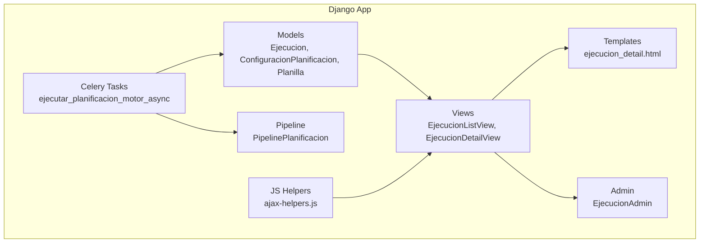
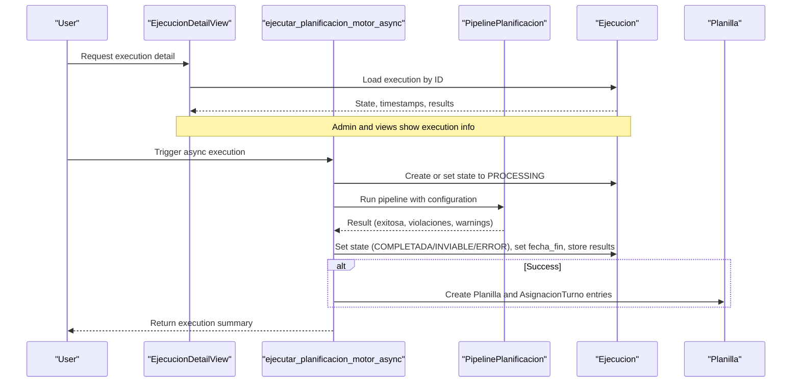
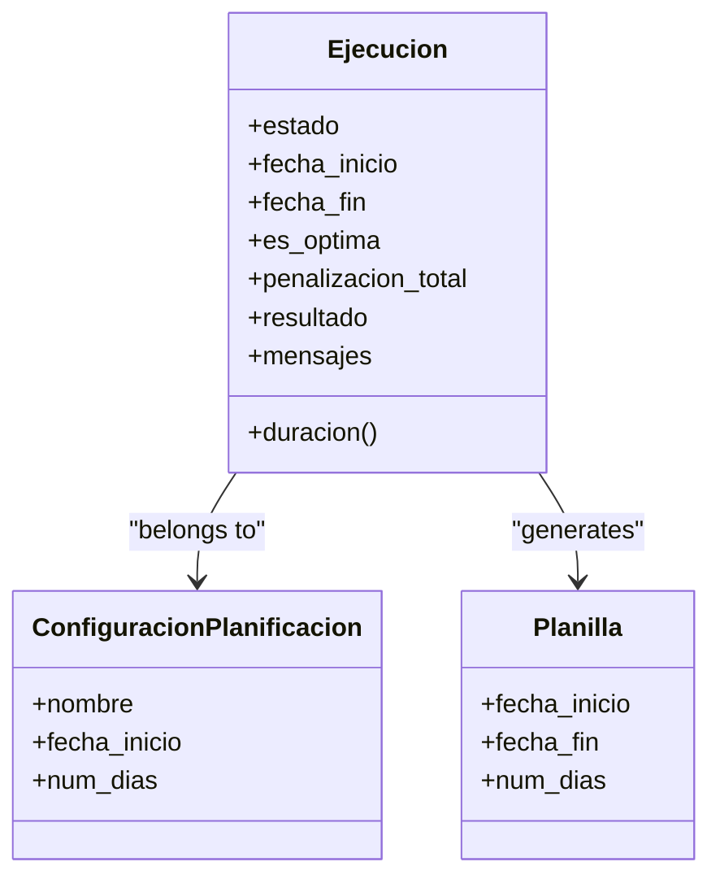
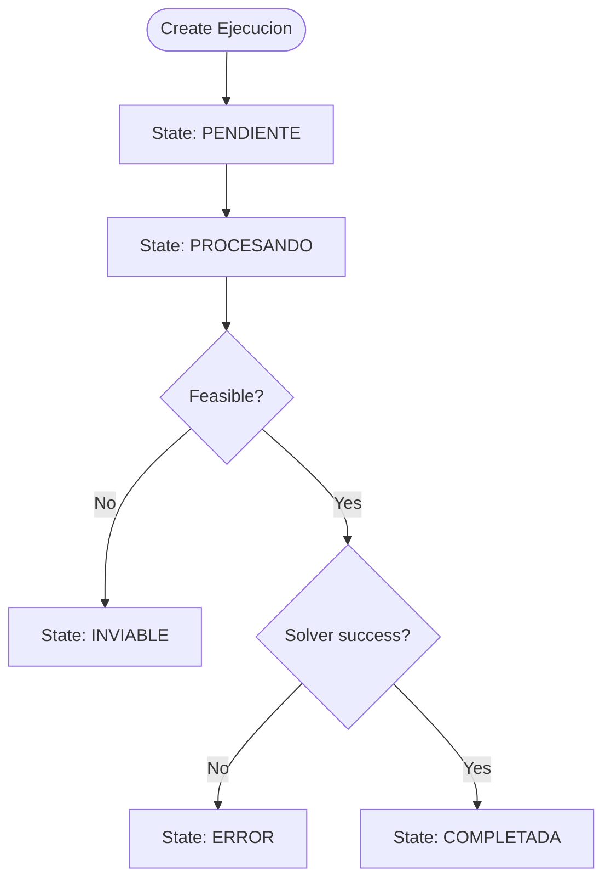
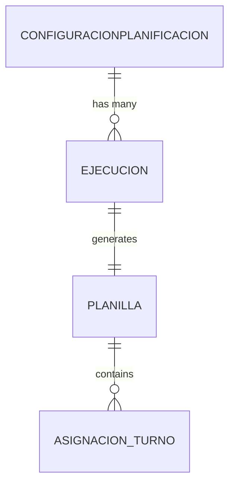
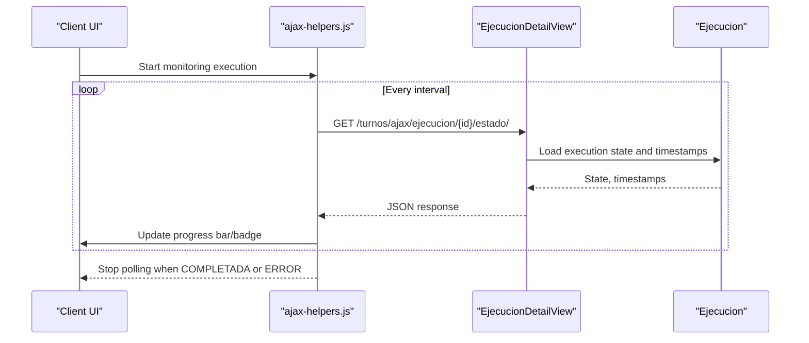
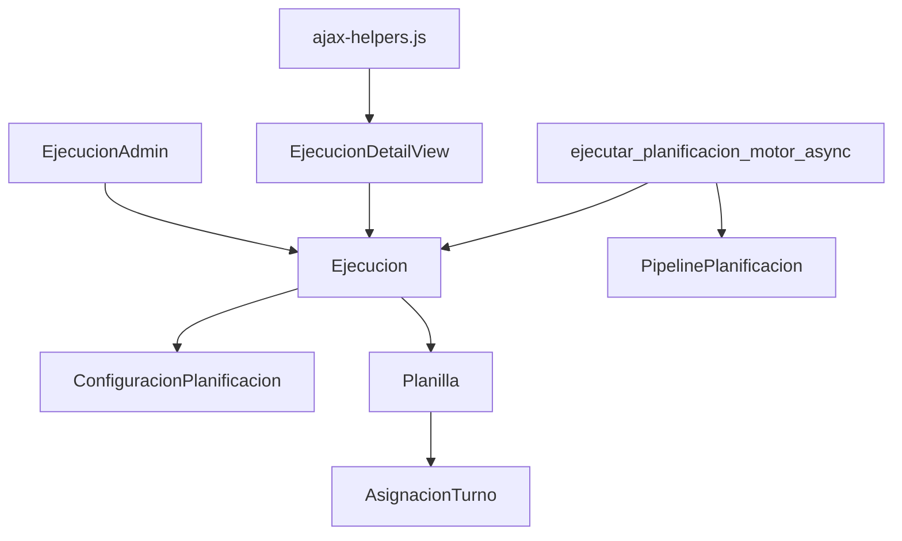

# Execution Model and Status Tracking

<cite>
**Referenced Files in This Document**
- [models.py](file://turnos/models.py)
- [tasks.py](file://turnos/tasks.py)
- [admin.py](file://turnos/admin.py)
- [views.py](file://turnos/views.py)
- [pipeline.py](file://turnos/motor/pipeline.py)
- [ajax-helpers.js](file://static/js/ajax-helpers.js)
- [ejecucion_detail.html](file://turnos/templates/turnos/ejecucion_detail.html)
- [limpiar_base_datos.py](file://turnos/management/commands/limpiar_base_datos.py)
</cite>

## Table of Contents
1. [Introduction](#introduction)
2. [Project Structure](#project-structure)
3. [Core Components](#core-components)
4. [Architecture Overview](#architecture-overview)
5. [Detailed Component Analysis](#detailed-component-analysis)
6. [Dependency Analysis](#dependency-analysis)
7. [Performance Considerations](#performance-considerations)
8. [Troubleshooting Guide](#troubleshooting-guide)
9. [Conclusion](#conclusion)

## Introduction
This document explains the Ejecucion model that tracks the lifecycle of scheduling executions. It covers execution states (PENDING, PROCESSING, COMPLETED, INFEASIBLE, ERROR), state transitions, metadata fields (timestamps, duration), execution results storage, and the relationship with related models (ConfiguracionPlanificacion and Planilla). It also provides examples of state queries, monitoring patterns, result interpretation, persistence, validation, and audit trails.

## Project Structure
The execution lifecycle spans Django models, asynchronous tasks, admin UI, views, templates, and client-side polling helpers. The following diagram maps the primary components involved in execution tracking.

**Diagram sources**
- [models.py:482-531](file://turnos/models.py#L482-L531)
- [views.py:485-679](file://turnos/views.py#L485-L679)
- [admin.py:182-231](file://turnos/admin.py#L182-L231)
- [tasks.py:333-696](file://turnos/tasks.py#L333-L696)
- [pipeline.py:31-236](file://turnos/motor/pipeline.py#L31-L236)
- [ejecucion_detail.html:300-391](file://turnos/templates/turnos/ejecucion_detail.html#L300-L391)
- [ajax-helpers.js:231-250](file://static/js/ajax-helpers.js#L231-L250)

**Section sources**
- [models.py:482-531](file://turnos/models.py#L482-L531)
- [tasks.py:333-696](file://turnos/tasks.py#L333-L696)
- [views.py:485-679](file://turnos/views.py#L485-L679)
- [admin.py:182-231](file://turnos/admin.py#L182-L231)
- [pipeline.py:31-236](file://turnos/motor/pipeline.py#L31-L236)
- [ejecucion_detail.html:300-391](file://turnos/templates/turnos/ejecucion_detail.html#L300-L391)
- [ajax-helpers.js:231-250](file://static/js/ajax-helpers.js#L231-L250)

## Core Components
- Ejecucion: Tracks a single scheduling run with state, timestamps, optimization flag, penalties, and JSON results/messages.
- ConfiguracionPlanificacion: Parent configuration that spawns Ejecucion instances.
- Planilla: Generated output linked to Ejecucion via a one-to-one relationship.

Key fields and behaviors:
- State choices: PENDIENTE, PROCESANDO, COMPLETADA, INVIABLE, ERROR.
- Timestamps: fecha_inicio (auto-created), fecha_fin (set upon completion).
- Duration: computed property from fecha_fin - fecha_inicio.
- Results: JSONField storing solver results and validation messages.
- Audit: Workspace isolation, created_by, and automatic ordering by most recent start.

**Section sources**
- [models.py:482-531](file://turnos/models.py#L482-L531)

## Architecture Overview
The execution lifecycle is orchestrated by Celery tasks that create/update Ejecucion records, run the planning pipeline, persist results, and optionally create Planilla and AsignacionTurno entries. The admin and views expose execution details and status, while client-side polling updates users in real time.

**Diagram sources**
- [views.py:511-648](file://turnos/views.py#L511-L648)
- [tasks.py:333-696](file://turnos/tasks.py#L333-L696)
- [pipeline.py:92-236](file://turnos/motor/pipeline.py#L92-L236)
- [models.py:482-531](file://turnos/models.py#L482-L531)

## Detailed Component Analysis

### Ejecucion Model
- Purpose: Encapsulates a single scheduling execution with state, timing, and outcome.
- State machine:
  - Initial: PENDIENTE (when created via web view).
  - Transition to: PROCESANDO (when task starts).
  - Final outcomes:
    - COMPLETADA: successful solution.
    - INVIABLE: infeasible problem detected.
    - ERROR: runtime exception or failure.
- Metadata:
  - fecha_inicio: auto-assigned at creation.
  - fecha_fin: assigned when task completes.
  - duracion: seconds elapsed between timestamps.
  - es_optima: True when no hard violations remain after repair/validation.
  - penalizacion_total: optional numeric penalty value.
  - resultado: structured JSON containing solver metrics and matrices.
  - mensajes: validation statistics (OK/warnings/violations).
- Relationships:
  - belongs to ConfiguracionPlanificacion.
  - one-to-one with Planilla (via planilla_generada).

**Diagram sources**
- [models.py:482-531](file://turnos/models.py#L482-L531)
- [models.py:534-565](file://turnos/models.py#L534-L565)

**Section sources**
- [models.py:482-531](file://turnos/models.py#L482-L531)

### Execution State Transitions and Validation Rules
- Creation path (web):
  - Ejecucion is created with state PENDIENTE.
  - Celery task is dispatched; Ejecucion state transitions to PROCESANDO.
- Completion path (task):
  - If pipeline reports success: state becomes COMPLETADA.
  - If feasibility check fails: state becomes INVIABLE.
  - On exceptions: state becomes ERROR; error stored in mensajes.
- Validation rules enforced by the pipeline:
  - Hard constraints must be satisfied; otherwise, the result is infeasible.
  - Soft constraints may produce warnings and penalties captured in results.

**Diagram sources**
- [tasks.py:333-696](file://turnos/tasks.py#L333-L696)
- [pipeline.py:92-236](file://turnos/motor/pipeline.py#L92-L236)
- [models.py:491-497](file://turnos/models.py#L491-L497)

**Section sources**
- [tasks.py:333-696](file://turnos/tasks.py#L333-L696)
- [pipeline.py:92-236](file://turnos/motor/pipeline.py#L92-L236)

### Execution Metadata Fields
- Timestamps:
  - fecha_inicio: when Ejecucion is created or updated to PROCESANDO.
  - fecha_fin: set when task finishes (success, infeasible, or error).
- Duration:
  - duracion: difference in seconds between fecha_fin and fecha_inicio; None if not finished yet.
- Optimization and penalties:
  - es_optima: True when no hard constraint violations remain after repair/validation.
  - penalizacion_total: optional aggregated penalty value from solver.
- Results and messages:
  - resultado: JSON payload with solver matrices, balances, and metrics.
  - mensajes: validation statistics (e.g., counts of validations, warnings, violations).

**Section sources**
- [models.py:522-531](file://turnos/models.py#L522-L531)
- [tasks.py:106-125](file://turnos/tasks.py#L106-L125)

### Relationship Between Ejecucion and Related Models
- Ejecucion.ConfiguracionPlanificacion: Each execution corresponds to a specific configuration.
- Ejecucion.Planilla: One-to-one relationship; generated when execution succeeds.
- Ejecucion.AsignacionTurno: Created in bulk when Planilla is generated; links planilla to assignments.

**Diagram sources**
- [models.py:499-504](file://turnos/models.py#L499-L504)
- [models.py:545-550](file://turnos/models.py#L545-L550)
- [models.py:568-623](file://turnos/models.py#L568-L623)

**Section sources**
- [models.py:499-504](file://turnos/models.py#L499-L504)
- [models.py:545-550](file://turnos/models.py#L545-L550)
- [models.py:568-623](file://turnos/models.py#L568-L623)

### Examples of Execution State Queries
- Count executions by state:
  - COMPLETADA, ERROR, PENDIENTE, PROCESANDO, INVIABLE.
- Filter by configuration:
  - Ejecucion.objects.filter(configuracion_id=X).
- Monitor recent runs:
  - Order by fecha_inicio descending; limit results.
- Compute averages:
  - Average duration and average penalties for COMPLETADA runs.

These patterns are supported by the model’s ordering and filtering capabilities exposed in views and management commands.

**Section sources**
- [views.py:495-508](file://turnos/views.py#L495-L508)
- [limpiar_base_datos.py:70-112](file://turnos/management/commands/limpiar_base_datos.py#L70-L112)

### Status Monitoring Patterns
- Polling endpoint:
  - Client-side helper polls a dedicated AJAX endpoint to fetch Ejecucion.estado and timestamps.
- Stop conditions:
  - Poll until state reaches COMPLETADA or ERROR.
- UI feedback:
  - Admin badge displays state color-coded (e.g., pending, processing, completed, error).
  - Template shows execution details and planilla linkage.

**Diagram sources**
- [ajax-helpers.js:231-250](file://static/js/ajax-helpers.js#L231-L250)
- [views.py:511-648](file://turnos/views.py#L511-L648)
- [admin.py:206-231](file://turnos/admin.py#L206-L231)
- [ejecucion_detail.html:300-391](file://turnos/templates/turnos/ejecucion_detail.html#L300-L391)

**Section sources**
- [ajax-helpers.js:231-250](file://static/js/ajax-helpers.js#L231-L250)
- [admin.py:206-231](file://turnos/admin.py#L206-L231)
- [ejecucion_detail.html:300-391](file://turnos/templates/turnos/ejecucion_detail.html#L300-L391)

### Execution Result Interpretation
- COMPLETADA:
  - Solver produced a feasible assignment; planilla and assignments were created.
  - es_optima indicates whether hard constraints were fully satisfied.
- INVIABLE:
  - Problem was declared infeasible during pipeline analysis.
- ERROR:
  - Exception occurred; error details stored in mensajes; task may retry depending on configuration.
- Messages:
  - mensajes includes counts of validations, warnings, and violations for post-run diagnostics.

**Section sources**
- [tasks.py:106-125](file://turnos/tasks.py#L106-L125)
- [pipeline.py:206-236](file://turnos/motor/pipeline.py#L206-L236)
- [views.py:517-541](file://turnos/views.py#L517-L541)

### Persistence, Data Validation, and Audit Trail
- Persistence:
  - Ejecucion is saved within atomic transactions during task execution to maintain consistency.
  - Planilla and AsignacionTurno are created in bulk after successful execution.
- Data validation:
  - Pipeline validates hard constraints; results indicate feasibility and violations.
  - Validation messages are persisted in mensajes for later inspection.
- Audit trail:
  - Workspace association isolates data per team.
  - created_by on ConfiguracionPlanificacion and automatic ordering by fecha_inicio support traceability.
  - Admin exposes readonly fields for timestamps and messages to prevent accidental edits.

**Section sources**
- [tasks.py:106-125](file://turnos/tasks.py#L106-L125)
- [tasks.py:130-170](file://turnos/tasks.py#L130-L170)
- [models.py:482-531](file://turnos/models.py#L482-L531)
- [admin.py:182-231](file://turnos/admin.py#L182-L231)

## Dependency Analysis
The execution system depends on:
- Celery tasks to orchestrate long-running planning work.
- The pipeline module to enforce constraints and produce solutions.
- Django ORM for persistence and admin/templating for visibility.

**Diagram sources**
- [models.py:482-531](file://turnos/models.py#L482-L531)
- [tasks.py:333-696](file://turnos/tasks.py#L333-L696)
- [pipeline.py:31-236](file://turnos/motor/pipeline.py#L31-L236)
- [views.py:511-648](file://turnos/views.py#L511-L648)
- [admin.py:182-231](file://turnos/admin.py#L182-L231)
- [ajax-helpers.js:231-250](file://static/js/ajax-helpers.js#L231-L250)

**Section sources**
- [models.py:482-531](file://turnos/models.py#L482-L531)
- [tasks.py:333-696](file://turnos/tasks.py#L333-L696)
- [pipeline.py:31-236](file://turnos/motor/pipeline.py#L31-L236)
- [views.py:511-648](file://turnos/views.py#L511-L648)
- [admin.py:182-231](file://turnos/admin.py#L182-L231)
- [ajax-helpers.js:231-250](file://static/js/ajax-helpers.js#L231-L250)

## Performance Considerations
- Use atomic blocks around Ejecucion updates to avoid race conditions during task execution.
- Prefer bulk creation for AsignacionTurno to minimize database round trips.
- Limit polling intervals and stop conditions to reduce client-server load.
- Clean old executions periodically to keep the database size manageable.

[No sources needed since this section provides general guidance]

## Troubleshooting Guide
- State remains PENDIENTE:
  - Verify the web view created Ejecucion and the Celery task was dispatched.
- State stuck on PROCESANDO:
  - Check task logs and retries; ensure the pipeline is reachable and not timing out.
- INVIABLE state:
  - Review configuration constraints and demand; adjust restrictions or increase coverage.
- ERROR state:
  - Inspect mensajes for error details; check task retry policy and logs.
- Cleanup old data:
  - Use management command to remove old COMPLETADA or ERROR executions.

**Section sources**
- [tasks.py:204-240](file://turnos/tasks.py#L204-L240)
- [limpiar_base_datos.py:70-112](file://turnos/management/commands/limpiar_base_datos.py#L70-L112)

## Conclusion
The Ejecucion model centralizes scheduling execution lifecycle tracking with explicit states, robust metadata, and clear relationships to configuration and planilla. The combination of Celery tasks, the planning pipeline, admin/UI, and client-side polling provides a complete monitoring and auditing solution for scheduling runs.