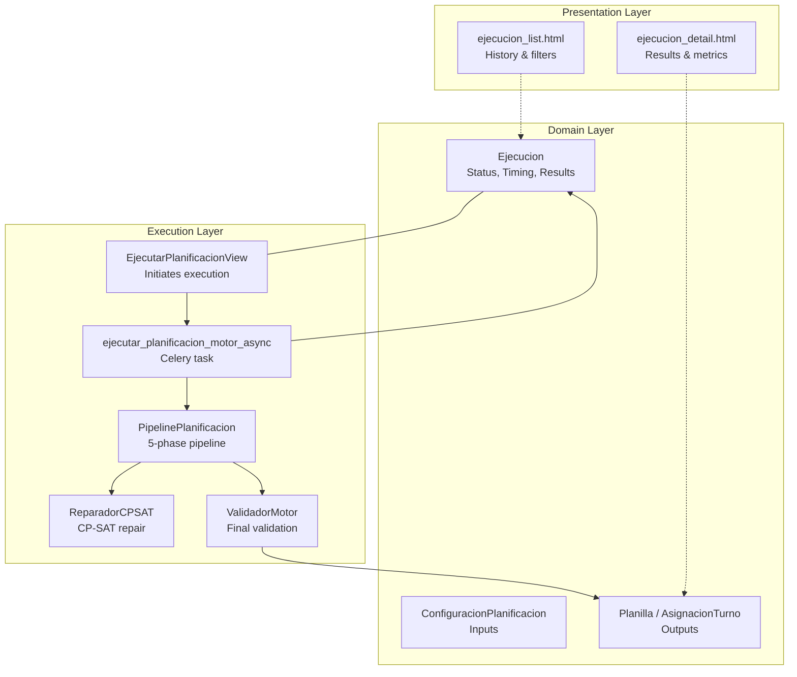
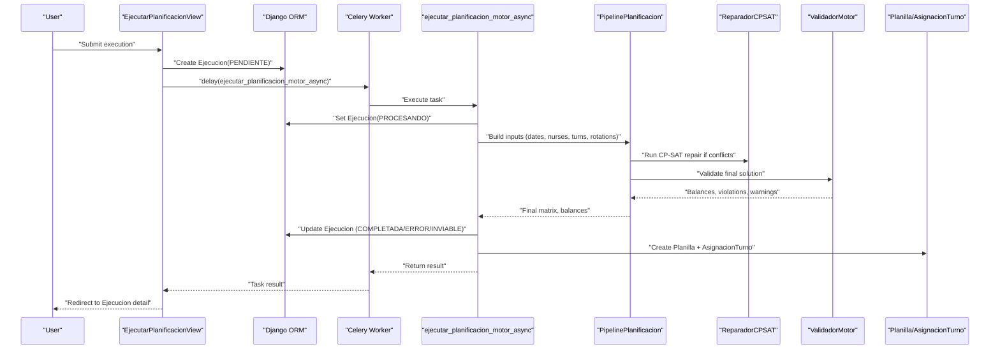
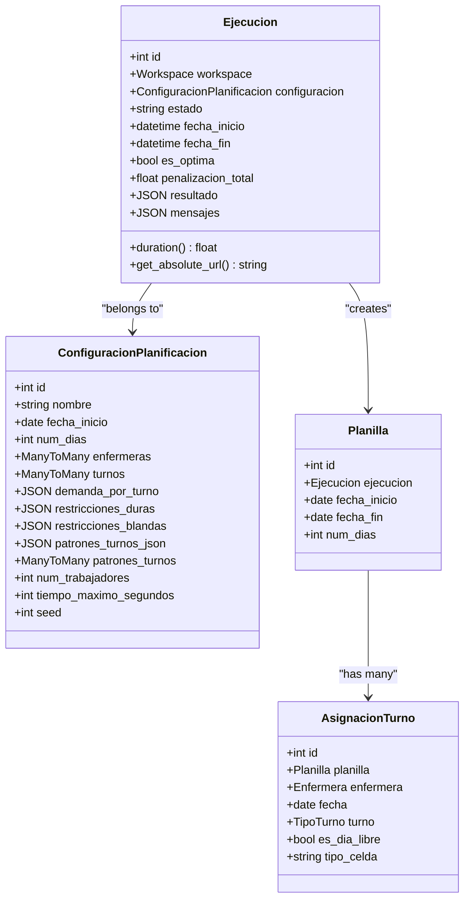
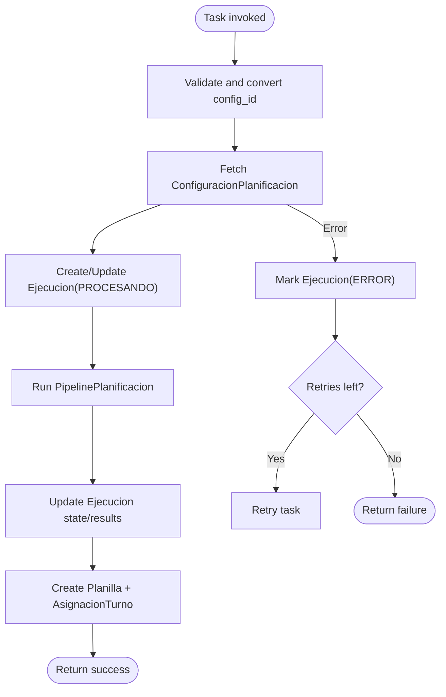
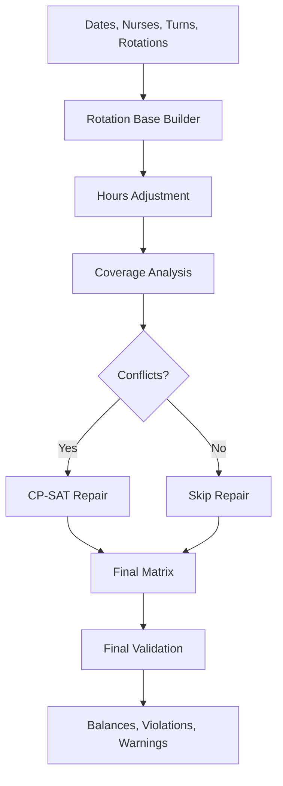
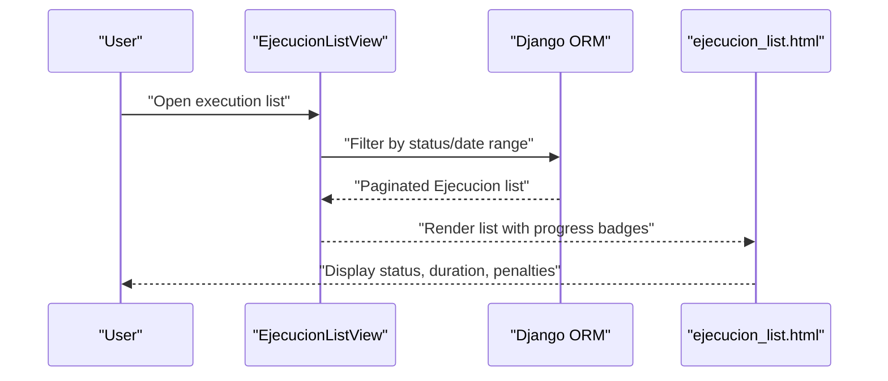
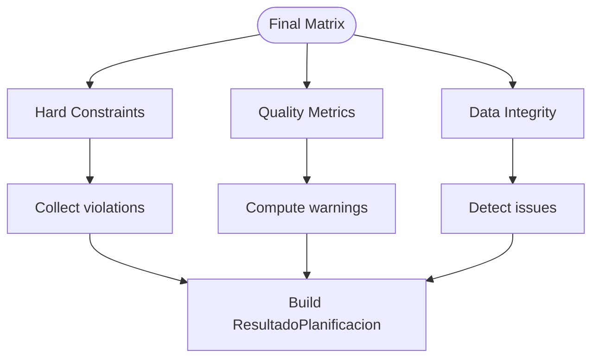
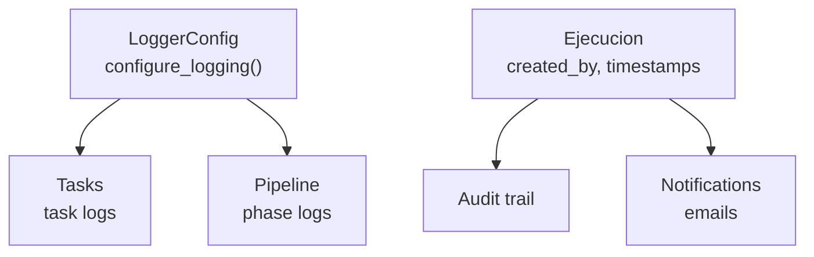
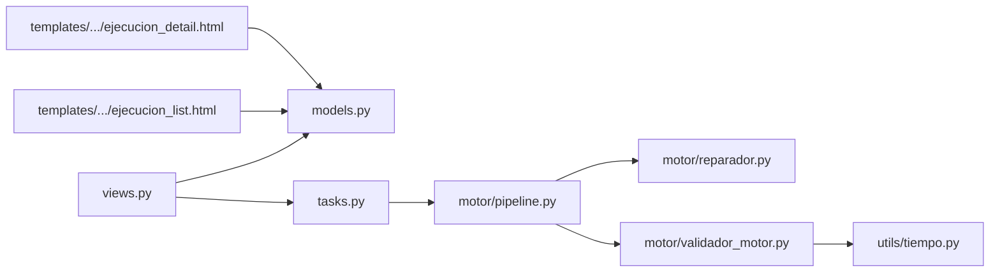

# Execution Monitoring

<cite>
**Referenced Files in This Document**
- [models.py](file://turnos/models.py)
- [tasks.py](file://turnos/tasks.py)
- [celery.py](file://proyecto_turnos/celery.py)
- [views.py](file://turnos/views.py)
- [pipeline.py](file://turnos/motor/pipeline.py)
- [validador_motor.py](file://turnos/motor/validador_motor.py)
- [reparador.py](file://turnos/motor/reparador.py)
- [generador.py](file://turnos/generador.py)
- [logger_config.py](file://turnos/logger_config.py)
- [tiempo.py](file://turnos/utils/tiempo.py)
- [ejecucion_detail.html](file://turnos/templates/turnos/ejecucion_detail.html)
- [ejecucion_list.html](file://turnos/templates/turnos/ejecucion_list.html)
</cite>

## Table of Contents
1. [Introduction](#introduction)
2. [Project Structure](#project-structure)
3. [Core Components](#core-components)
4. [Architecture Overview](#architecture-overview)
5. [Detailed Component Analysis](#detailed-component-analysis)
6. [Dependency Analysis](#dependency-analysis)
7. [Performance Considerations](#performance-considerations)
8. [Troubleshooting Guide](#troubleshooting-guide)
9. [Conclusion](#conclusion)
10. [Appendices](#appendices)

## Introduction
This document describes the execution monitoring system that tracks scheduling runs from initiation to completion. It covers the Ejecucion model, execution status tracking, progress indicators, and result validation. It explains the asynchronous execution architecture using Celery, task queuing, and execution state management. It also documents execution history, performance metrics, error handling, and retry mechanisms. Practical examples demonstrate monitoring execution progress, interpreting validation results, and troubleshooting failed executions. Finally, it addresses execution notifications, logging strategies, and audit trail functionality.

## Project Structure
The execution monitoring system spans several layers:
- Domain models define the execution lifecycle and persisted results.
- Celery tasks encapsulate asynchronous execution and state transitions.
- Views orchestrate user actions and trigger task dispatch.
- The new motor pipeline validates and repairs solutions.
- Templates render execution history and results for end-users.

**Diagram sources**
- [models.py:482-532](file://turnos/models.py#L482-L532)
- [views.py:683-792](file://turnos/views.py#L683-L792)
- [tasks.py:333-696](file://turnos/tasks.py#L333-L696)
- [pipeline.py:92-245](file://turnos/motor/pipeline.py#L92-L245)
- [reparador.py:63-95](file://turnos/motor/reparador.py#L63-L95)
- [validador_motor.py:48-86](file://turnos/motor/validador_motor.py#L48-L86)
- [ejecucion_list.html:60-131](file://turnos/templates/turnos/ejecucion_list.html#L60-L131)
- [ejecucion_detail.html:194-383](file://turnos/templates/turnos/ejecucion_detail.html#L194-L383)

**Section sources**
- [models.py:482-532](file://turnos/models.py#L482-L532)
- [views.py:683-792](file://turnos/views.py#L683-L792)
- [tasks.py:333-696](file://turnos/tasks.py#L333-L696)
- [pipeline.py:92-245](file://turnos/motor/pipeline.py#L92-L245)
- [ejecucion_list.html:60-131](file://turnos/templates/turnos/ejecucion_list.html#L60-L131)
- [ejecucion_detail.html:194-383](file://turnos/templates/turnos/ejecucion_detail.html#L194-L383)

## Core Components
- Ejecucion: Tracks scheduling run lifecycle, status, timing, penalties, and validation results.
- Celery Tasks: Asynchronous execution of the new motor pipeline with retries and cleanup.
- PipelinePlanificacion: Orchestrates five phases: rotation base → hours adjustment → coverage analysis → CP-SAT repair → validation.
- ValidadorMotor: Final validation checks hard constraints, quality metrics, and data integrity.
- ReparadorCPSAT: CP-SAT solver repairs conflicts while preserving base rotation proximity.
- Views: Initiate execution, monitor progress, and render results.
- Templates: Present execution history and detailed results.

**Section sources**
- [models.py:482-532](file://turnos/models.py#L482-L532)
- [tasks.py:333-696](file://turnos/tasks.py#L333-L696)
- [pipeline.py:31-245](file://turnos/motor/pipeline.py#L31-L245)
- [validador_motor.py:23-86](file://turnos/motor/validador_motor.py#L23-L86)
- [reparador.py:24-95](file://turnos/motor/reparador.py#L24-L95)
- [views.py:683-792](file://turnos/views.py#L683-L792)
- [ejecucion_list.html:60-131](file://turnos/templates/turnos/ejecucion_list.html#L60-L131)
- [ejecucion_detail.html:194-383](file://turnos/templates/turnos/ejecucion_detail.html#L194-L383)

## Architecture Overview
The system uses Django with Celery for asynchronous execution. Users trigger a run via a view, which creates a pending Ejecucion and dispatches a Celery task. The task executes the new motor pipeline, updates Ejecucion state and results, and persists Planilla and AsignacionTurno records. Frontend templates render execution history and detailed results.

**Diagram sources**
- [views.py:722-791](file://turnos/views.py#L722-L791)
- [tasks.py:372-696](file://turnos/tasks.py#L372-L696)
- [pipeline.py:92-245](file://turnos/motor/pipeline.py#L92-L245)
- [reparador.py:63-95](file://turnos/motor/reparador.py#L63-L95)
- [validador_motor.py:48-86](file://turnos/motor/validador_motor.py#L48-L86)

## Detailed Component Analysis

### Ejecucion Model
The Ejecucion model captures the lifecycle of a scheduling run:
- Status: PENDIENTE → PROCESANDO → COMPLETADA/INVIABLE/ERROR
- Timing: fecha_inicio, fecha_fin, duration
- Quality: es_optima, penalizacion_total
- Results: resultado (structured data), mensajes (validation outcomes)

Key behaviors:
- Duration calculation uses start and end timestamps.
- Absolute URL for detail pages.
- JSON fields for flexible result storage.

**Diagram sources**
- [models.py:482-532](file://turnos/models.py#L482-L532)
- [models.py:534-623](file://turnos/models.py#L534-L623)

**Section sources**
- [models.py:482-532](file://turnos/models.py#L482-L532)

### Asynchronous Execution with Celery
Celery is configured to autodiscover tasks from Django settings. The primary execution task is ejecutar_planificacion_motor_async, which:
- Validates and converts configuration ID
- Creates or updates Ejecucion to PROCESANDO
- Executes PipelinePlanificacion
- Updates Ejecucion state and results
- Persists Planilla and AsignacionTurno records
- Handles exceptions, marks ERROR, and retries up to configured limits

**Diagram sources**
- [tasks.py:17-240](file://turnos/tasks.py#L17-L240)
- [tasks.py:333-696](file://turnos/tasks.py#L333-L696)

**Section sources**
- [celery.py:1-14](file://proyecto_turnos/celery.py#L1-L14)
- [tasks.py:17-240](file://turnos/tasks.py#L17-L240)
- [tasks.py:333-696](file://turnos/tasks.py#L333-L696)

### New Motor Pipeline
The pipeline orchestrates five phases:
1. Rotation base builder: deterministic base schedule
2. Hours adjustment: align with contractual hours
3. Coverage analysis: compute deviations and conflicts
4. CP-SAT repair: fix conflicts minimizing rotation deviation
5. Validation: hard constraints, quality metrics, and integrity

**Diagram sources**
- [pipeline.py:92-245](file://turnos/motor/pipeline.py#L92-L245)
- [reparador.py:63-95](file://turnos/motor/reparador.py#L63-L95)
- [validador_motor.py:48-86](file://turnos/motor/validador_motor.py#L48-L86)

**Section sources**
- [pipeline.py:31-245](file://turnos/motor/pipeline.py#L31-L245)
- [reparador.py:24-95](file://turnos/motor/reparador.py#L24-L95)
- [validador_motor.py:23-86](file://turnos/motor/validador_motor.py#L23-L86)

### Execution History and Progress Indicators
Execution history is presented in a paginated list with filtering by status and date range. Progress indicators include:
- Status badges (PENDING → PROCESSING → COMPLETED/INVIABLE/ERROR)
- Duration display
- Penalty indicator with color-coded severity
- Optimal flag badge

**Diagram sources**
- [views.py:486-508](file://turnos/views.py#L486-L508)
- [ejecucion_list.html:60-131](file://turnos/templates/turnos/ejecucion_list.html#L60-L131)

**Section sources**
- [views.py:486-508](file://turnos/views.py#L486-L508)
- [ejecucion_list.html:60-131](file://turnos/templates/turnos/ejecucion_list.html#L60-L131)

### Result Validation and Metrics
Validation results are stored in Ejecucion.mensajes and Ejecucion.resultado. The final validator computes:
- Hard constraint violations (turn per day, consecutive days, nights, rest between shifts, coverage)
- Quality metrics (hourly distribution, night equity, weekend equity)
- Integrity checks (cell types, presence of turn IDs)
- Balances per nurse (hours, nights, weekends, holidays)

**Diagram sources**
- [validador_motor.py:48-86](file://turnos/motor/validador_motor.py#L48-L86)
- [validador_motor.py:88-388](file://turnos/motor/validador_motor.py#L88-L388)
- [validador_motor.py:389-451](file://turnos/motor/validador_motor.py#L389-L451)

**Section sources**
- [validador_motor.py:48-86](file://turnos/motor/validador_motor.py#L48-L86)
- [validador_motor.py:88-388](file://turnos/motor/validador_motor.py#L88-L388)
- [validador_motor.py:389-451](file://turnos/motor/validador_motor.py#L389-L451)

### Monitoring Execution Progress and Interpreting Results
Users can monitor progress and interpret results via:
- Execution detail page: displays status, duration, optimal flag, and validation counts
- Statistics tab: distribution of turns and workload per nurse
- Details tab: raw execution metadata and validation outcomes

Practical examples:
- Monitoring progress: observe Ejecucion.estado transitions and Ejecucion.duracion updates
- Interpreting validation results: review Ejecucion.mensajes for validations and violations; optima vs. feasible
- Exporting results: download Excel/PDF/CSV/JSON/iCalendar from execution detail

**Section sources**
- [views.py:511-648](file://turnos/views.py#L511-L648)
- [ejecucion_detail.html:194-383](file://turnos/templates/turnos/ejecucion_detail.html#L194-L383)

### Notifications, Logging, and Audit Trail
- Logging: Centralized logger configuration and per-module logging for tasks and pipeline stages
- Notifications: Email templates for execution completion and errors are included in the repository
- Audit trail: Ejecucion stores creation time, last modification, and user who initiated runs; planilla links back to execution

**Diagram sources**
- [logger_config.py:6-33](file://turnos/logger_config.py#L6-L33)
- [tasks.py:17-240](file://turnos/tasks.py#L17-L240)
- [pipeline.py:102-105](file://turnos/motor/pipeline.py#L102-L105)
- [models.py:482-532](file://turnos/models.py#L482-L532)

**Section sources**
- [logger_config.py:6-33](file://turnos/logger_config.py#L6-L33)
- [tasks.py:17-240](file://turnos/tasks.py#L17-L240)
- [pipeline.py:102-105](file://turnos/motor/pipeline.py#L102-L105)
- [models.py:482-532](file://turnos/models.py#L482-L532)

## Dependency Analysis
The execution monitoring system exhibits clear separation of concerns:
- Views depend on models and Celery tasks
- Tasks depend on the new motor pipeline and models
- Pipeline depends on repair and validation modules
- Templates depend on models for rendering

**Diagram sources**
- [views.py:683-792](file://turnos/views.py#L683-L792)
- [tasks.py:333-696](file://turnos/tasks.py#L333-L696)
- [pipeline.py:31-245](file://turnos/motor/pipeline.py#L31-L245)
- [reparador.py:24-95](file://turnos/motor/reparador.py#L24-L95)
- [validador_motor.py:23-86](file://turnos/motor/validador_motor.py#L23-L86)
- [tiempo.py:8-32](file://turnos/utils/tiempo.py#L8-L32)
- [ejecucion_list.html:60-131](file://turnos/templates/turnos/ejecucion_list.html#L60-L131)
- [ejecucion_detail.html:194-383](file://turnos/templates/turnos/ejecucion_detail.html#L194-L383)

**Section sources**
- [views.py:683-792](file://turnos/views.py#L683-L792)
- [tasks.py:333-696](file://turnos/tasks.py#L333-L696)
- [pipeline.py:31-245](file://turnos/motor/pipeline.py#L31-L245)
- [reparador.py:24-95](file://turnos/motor/reparador.py#L24-L95)
- [validador_motor.py:23-86](file://turnos/motor/validador_motor.py#L23-L86)
- [tiempo.py:8-32](file://turnos/utils/tiempo.py#L8-L32)
- [ejecucion_list.html:60-131](file://turnos/templates/turnos/ejecucion_list.html#L60-L131)
- [ejecucion_detail.html:194-383](file://turnos/templates/turnos/ejecucion_detail.html#L194-L383)

## Performance Considerations
- CP-SAT solver timeout and worker configuration are set to balance speed and feasibility.
- Weighted objective prioritizes maintaining base rotation over other adjustments.
- Bulk creation of assignments reduces database overhead.
- Logging includes compressed JSON for large result sets to reduce verbosity.

[No sources needed since this section provides general guidance]

## Troubleshooting Guide
Common issues and resolutions:
- Invalid configuration ID: ensure integer ID passed to task; task logs conversion attempts and errors.
- Missing nurses or turns: validation prevents execution with insufficient resources.
- CP-SAT infeasibility: indicates hard constraints cannot be satisfied; review restrictions and coverage targets.
- Excessive penalties: inspect Ejecucion.penalizacion_total and Ejecucion.resultado for violation details.
- Task retries exhausted: check Ejecucion.mensajes for error details and retry count.

Operational steps:
- Inspect Ejecucion.estado and Ejecucion.fecha_fin to confirm completion timing.
- Review Ejecucion.mensajes for validation outcomes and warnings.
- Use execution detail page to export results and share with stakeholders.
- Clean old executions periodically using the cleanup task.

**Section sources**
- [tasks.py:17-240](file://turnos/tasks.py#L17-L240)
- [tasks.py:242-268](file://turnos/tasks.py#L242-L268)
- [views.py:722-791](file://turnos/views.py#L722-L791)
- [ejecucion_detail.html:306-378](file://turnos/templates/turnos/ejecucion_detail.html#L306-L378)

## Conclusion
The execution monitoring system provides robust asynchronous scheduling with clear status tracking, comprehensive validation, and rich reporting. The Ejecucion model anchors the lifecycle, Celery ensures scalable execution, and the new motor pipeline guarantees high-quality, constraint-compliant results. Users can monitor progress, interpret validation outcomes, and export actionable insights through intuitive templates.

[No sources needed since this section summarizes without analyzing specific files]

## Appendices

### Example Workflows

- Monitor execution progress
  - Navigate to execution list and filter by status
  - Observe Ejecucion.estado transitions and duration updates
  - Click detail to view validation counts and export options

- Interpret validation results
  - COMPLETADA with es_optima indicates no hard constraint violations
  - INVIABLE suggests infeasibility; adjust constraints or coverage targets
  - ERROR indicates runtime failure; check Ejecucion.mensajes for details

- Troubleshoot failed executions
  - Verify configuration completeness (nurses, turns)
  - Reduce solver timeout or constraints if infeasible
  - Use cleanup task to remove stale entries

[No sources needed since this section provides general guidance]