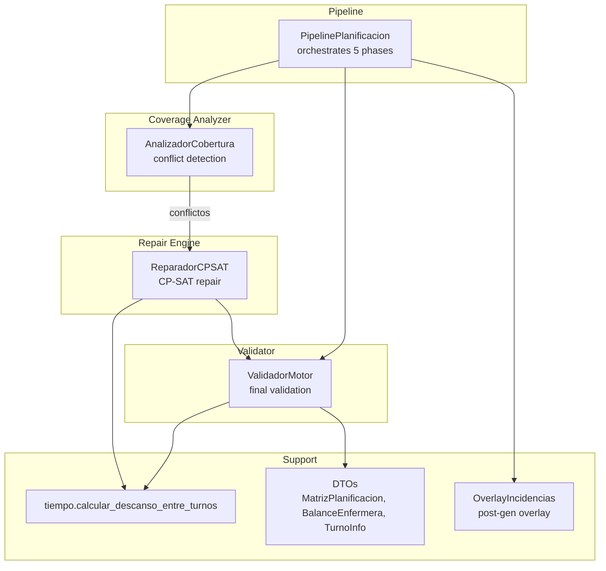
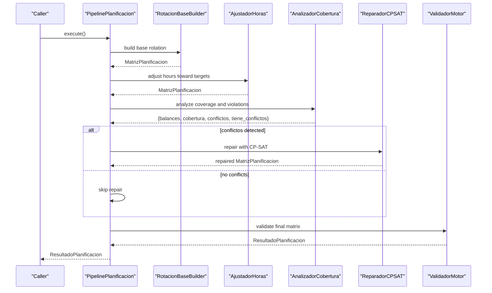
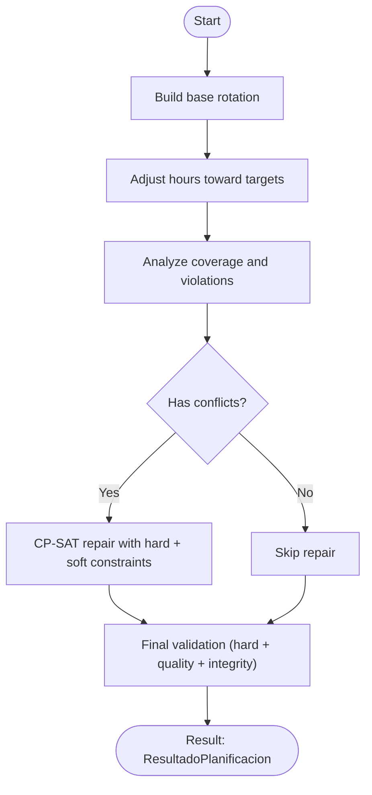
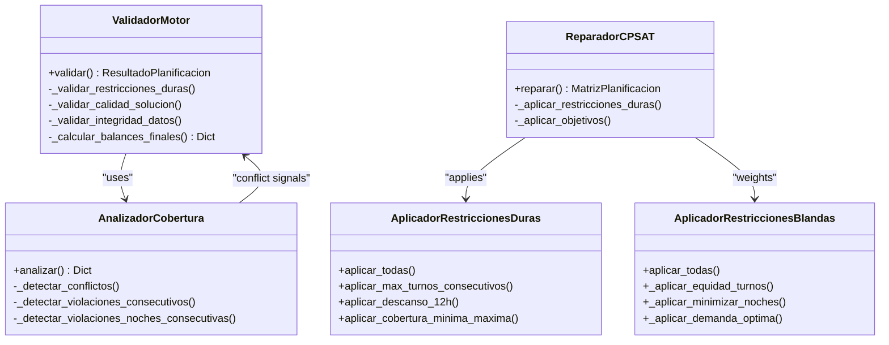
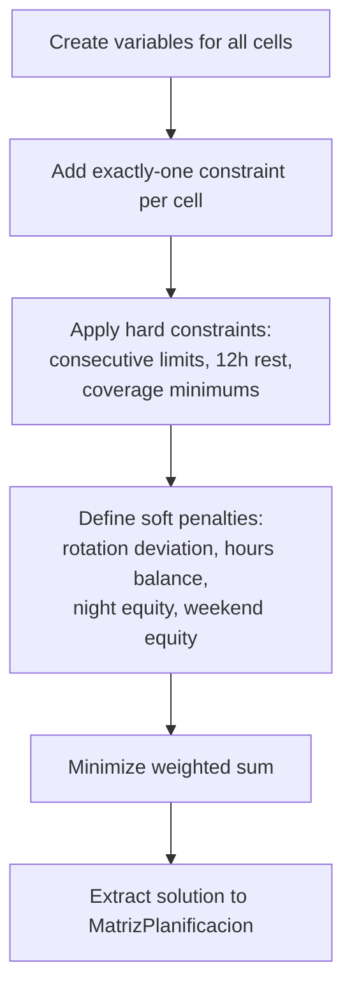
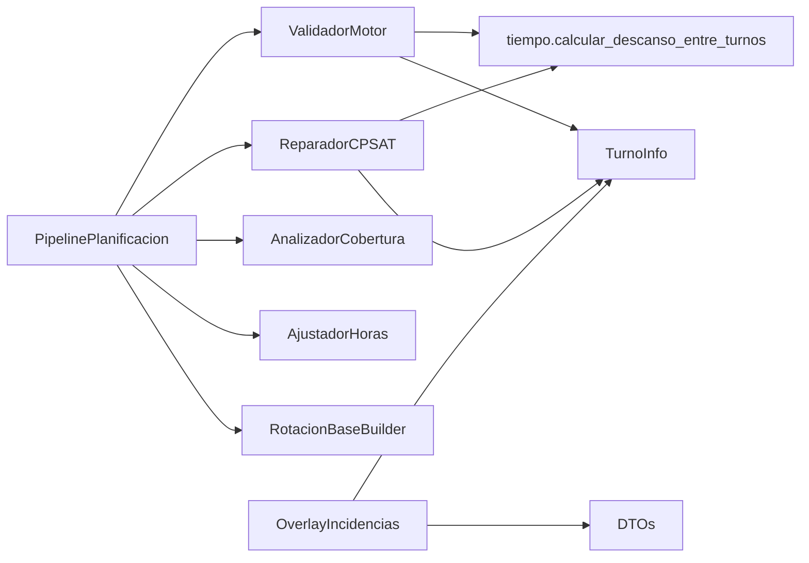

# Execution Result Validation and Quality Assurance

<cite>
**Referenced Files in This Document**
- [pipeline.py](file://turnos/motor/pipeline.py)
- [reparador.py](file://turnos/motor/reparador.py)
- [validador_motor.py](file://turnos/motor/validador_motor.py)
- [cobertura.py](file://turnos/motor/cobertura.py)
- [ajuste_horas.py](file://turnos/motor/ajuste_horas.py)
- [dtos.py](file://turnos/dominio/dtos.py)
- [tiempo.py](file://turnos/utils/tiempo.py)
- [overlay_incidencias.py](file://turnos/motor/overlay_incidencias.py)
- [restricciones_duras.py](file://turnos/restricciones_duras.py)
- [restricciones_blandas.py](file://turnos/restricciones_blandas.py)
- [test_reparador.py](file://turnos/tests/test_motor/test_reparador.py)
- [test_pipeline.py](file://turnos/tests/test_motor/test_pipeline.py)
- [test_integracion_final.py](file://turnos/tests/test_motor/test_integracion_final.py)
</cite>

## Table of Contents
1. [Introduction](#introduction)
2. [Project Structure](#project-structure)
3. [Core Components](#core-components)
4. [Architecture Overview](#architecture-overview)
5. [Detailed Component Analysis](#detailed-component-analysis)
6. [Dependency Analysis](#dependency-analysis)
7. [Performance Considerations](#performance-considerations)
8. [Troubleshooting Guide](#troubleshooting-guide)
9. [Conclusion](#conclusion)

## Introduction
This document explains the execution result validation system that ensures scheduling quality and constraint satisfaction. It covers the validation pipeline that checks generated schedules against hard constraints, soft constraints penalties, and business rule compliance. It also details repair mechanisms for resolving constraint violations, penalty calculation methods, and solution quality assessment. Finally, it describes validation criteria for optimal solutions, conflict detection and resolution, and result interpretation for different execution outcomes.

## Project Structure
The validation system spans several modules:
- Pipeline orchestration: builds the schedule, repairs conflicts, and validates results.
- Repair engine: CP-SAT-based repair minimizing deviation from base rotation.
- Coverage analyzer: detects coverage deficits and violation patterns.
- Validator: final verification of hard constraints, quality metrics, and data integrity.
- Supporting utilities: time calculations, DTOs, and overlay for post-generation incidents.

**Diagram sources**
- [pipeline.py:92-234](file://turnos/motor/pipeline.py#L92-L234)
- [reparador.py:63-96](file://turnos/motor/reparador.py#L63-L96)
- [cobertura.py:46-73](file://turnos/motor/cobertura.py#L46-L73)
- [validador_motor.py:48-86](file://turnos/motor/validador_motor.py#L48-L86)
- [tiempo.py:8-31](file://turnos/utils/tiempo.py#L8-L31)
- [dtos.py:197-274](file://turnos/dominio/dtos.py#L197-L274)
- [overlay_incidencias.py:45-75](file://turnos/motor/overlay_incidencias.py#L45-L75)

**Section sources**
- [pipeline.py:31-266](file://turnos/motor/pipeline.py#L31-L266)

## Core Components
- PipelinePlanificacion orchestrates five sequential phases: base rotation, hours adjustment, coverage analysis, CP-SAT repair, and final validation. It passes configuration, constraints, and historical balances to downstream components.
- ReparadorCPSAT applies hard constraints and weighted soft objectives to repair conflicts, preserving base rotation patterns and balancing equity.
- AnalizadorCobertura computes per-enfermera balances, per-day per-shift coverage, and detects violations of consecutive shifts and nights.
- ValidadorMotor performs final checks: hard constraints, solution quality metrics, data integrity, and calculates final balances including historical accumulation.
- OverlayIncidencias applies post-generation incidents (vacations, permissions, etc.) as deterministic overlays after the solver completes.

**Section sources**
- [pipeline.py:92-234](file://turnos/motor/pipeline.py#L92-L234)
- [reparador.py:24-96](file://turnos/motor/reparador.py#L24-L96)
- [cobertura.py:46-207](file://turnos/motor/cobertura.py#L46-L207)
- [validador_motor.py:23-86](file://turnos/motor/validador_motor.py#L23-L86)
- [overlay_incidencias.py:45-204](file://turnos/motor/overlay_incidencias.py#L45-L204)

## Architecture Overview
The validation pipeline proceeds through deterministic construction, optional repair, and final validation. Hard constraints are enforced at both modeling and validation stages; soft constraints become penalties in the solver objective and warnings in the validator.

**Diagram sources**
- [pipeline.py:92-234](file://turnos/motor/pipeline.py#L92-L234)
- [reparador.py:63-96](file://turnos/motor/reparador.py#L63-L96)
- [cobertura.py:46-73](file://turnos/motor/cobertura.py#L46-L73)
- [validador_motor.py:48-86](file://turnos/motor/validador_motor.py#L48-L86)

## Detailed Component Analysis

### Validation Pipeline and Control Flow
- Base rotation: Deterministic assignment respecting cycles and offsets.
- Hours adjustment: Converts excess or deficit turns to/from free days to meet target hours within tolerance.
- Coverage analysis: Computes per-day per-shift coverage and flags violations of consecutive limits and minimum coverage.
- CP-SAT repair: Applies hard constraints and weighted soft objectives; preserves base rotation pattern with minimal changes.
- Final validation: Checks hard constraints, quality metrics, data integrity, and persists final balances.

**Diagram sources**
- [pipeline.py:107-234](file://turnos/motor/pipeline.py#L107-L234)
- [ajuste_horas.py:46-88](file://turnos/motor/ajuste_horas.py#L46-L88)
- [cobertura.py:46-73](file://turnos/motor/cobertura.py#L46-L73)
- [reparador.py:63-96](file://turnos/motor/reparador.py#L63-L96)
- [validador_motor.py:48-86](file://turnos/motor/validador_motor.py#L48-L86)

**Section sources**
- [pipeline.py:92-234](file://turnos/motor/pipeline.py#L92-L234)
- [ajuste_horas.py:46-88](file://turnos/motor/ajuste_horas.py#L46-L88)
- [cobertura.py:46-73](file://turnos/motor/cobertura.py#L46-L73)
- [reparador.py:63-96](file://turnos/motor/reparador.py#L63-L96)
- [validador_motor.py:48-86](file://turnos/motor/validador_motor.py#L48-L86)

### Constraint Types and Enforcement
- Hard constraints (must be satisfied):
  - One shift per day per nurse.
  - Maximum consecutive working days.
  - Maximum consecutive nights.
  - Minimum 12-hour real rest between shifts.
  - Minimum coverage per shift per day.
- Soft constraints (penalized in solver objective):
  - Minimize deviation from base rotation.
  - Balance monthly hours.
  - Equitably distribute night shifts.
  - Equitably distribute weekend work.

**Diagram sources**
- [validador_motor.py:23-86](file://turnos/motor/validador_motor.py#L23-L86)
- [reparador.py:133-334](file://turnos/motor/reparador.py#L133-L334)
- [cobertura.py:46-207](file://turnos/motor/cobertura.py#L46-L207)
- [restricciones_duras.py:37-155](file://turnos/restricciones_duras.py#L37-L155)
- [restricciones_blandas.py:36-137](file://turnos/restricciones_blandas.py#L36-L137)

**Section sources**
- [validador_motor.py:88-311](file://turnos/motor/validador_motor.py#L88-L311)
- [reparador.py:133-334](file://turnos/motor/reparador.py#L133-L334)
- [cobertura.py:139-207](file://turnos/motor/cobertura.py#L139-L207)
- [restricciones_duras.py:37-155](file://turnos/restricciones_duras.py#L37-L155)
- [restricciones_blandas.py:36-137](file://turnos/restricciones_blandas.py#L36-L137)

### Repair Mechanisms and Penalty Calculation
- CP-SAT variables represent assigning a shift or “free” to each cell. A sentinel value encodes “free” explicitly.
- Hard constraints:
  - Maximum consecutive shifts and nights.
  - Minimum 12-hour real rest computed using precise datetimes.
  - Minimum coverage per shift per day.
- Soft objectives (weighted sum):
  - Rotation base preservation (highest weight).
  - Monthly hours balance.
  - Night equity.
  - Weekend equity.
- Historical balances influence soft penalties to favor nurses with higher accumulated hours.

**Diagram sources**
- [reparador.py:97-132](file://turnos/motor/reparador.py#L97-L132)
- [reparador.py:133-296](file://turnos/motor/reparador.py#L133-L296)
- [reparador.py:297-334](file://turnos/motor/reparador.py#L297-L334)
- [reparador.py:581-608](file://turnos/motor/reparador.py#L581-L608)

**Section sources**
- [reparador.py:63-96](file://turnos/motor/reparador.py#L63-L96)
- [reparador.py:97-132](file://turnos/motor/reparador.py#L97-L132)
- [reparador.py:133-296](file://turnos/motor/reparador.py#L133-L296)
- [reparador.py:297-334](file://turnos/motor/reparador.py#L297-L334)
- [reparador.py:581-608](file://turnos/motor/reparador.py#L581-L608)

### Solution Quality Assessment and Metrics
- Hard constraint satisfaction: zero violations imply success.
- Quality warnings:
  - High deviation in total hours per nurse.
  - Imbalance in number of nights worked.
  - Imbalance in weekend work.
- Integrity checks:
  - Cell type enumeration validity.
  - Presence of shift IDs for shift-type cells.
- Final balances include:
  - Assigned hours, nights, weekends, holidays.
  - Accumulated historical totals.
  - Objective-derived deviations.

**Section sources**
- [validador_motor.py:312-388](file://turnos/motor/validador_motor.py#L312-L388)
- [validador_motor.py:389-438](file://turnos/motor/validador_motor.py#L389-L438)
- [dtos.py:135-166](file://turnos/dominio/dtos.py#L135-L166)

### Conflict Detection and Resolution
- Coverage analyzer detects:
  - Insufficient staff per shift per day.
  - Excessive consecutive working days.
  - Excessive consecutive nights.
- Repair resolves conflicts by adjusting minimal sets of cells under hard constraints while optimizing soft objectives.
- Final validator ensures no hard constraint violations remain.

**Section sources**
- [cobertura.py:139-207](file://turnos/motor/cobertura.py#L139-L207)
- [reparador.py:63-96](file://turnos/motor/reparador.py#L63-L96)
- [validador_motor.py:88-105](file://turnos/motor/validador_motor.py#L88-L105)

### Result Interpretation and Outcomes
- Successful execution: ResultadoPlanificacion.exitosa is true; violaciones empty; warnings indicate equity issues.
- Repair occurred: celdas_modificadas indicates number of changed cells; solver status recorded.
- Historical balances persisted: included in balances for future planning.

**Section sources**
- [pipeline.py:215-228](file://turnos/motor/pipeline.py#L215-L228)
- [validador_motor.py:48-86](file://turnos/motor/validador_motor.py#L48-L86)
- [dtos.py:251-274](file://turnos/dominio/dtos.py#L251-L274)

### Examples of Validation Criteria and Messages
- Violations:
  - “Enfermera X no tiene asignación para YYY.”
  - “Excede Z turnos consecutivos.”
  - “Excede W noches consecutivas.”
  - “Descanso real < 12h entre turnos.”
  - “Cobertura mínima insuficiente para turno T en fecha D.”
- Warnings:
  - “Desviación alta en horas: …”
  - “Desbalance de noches: diferencia de …”
  - “Desbalance de fines de semana: diferencia de …”

These reflect the structured validation performed during final validation.

**Section sources**
- [validador_motor.py:106-202](file://turnos/motor/validador_motor.py#L106-L202)
- [validador_motor.py:279-310](file://turnos/motor/validador_motor.py#L279-L310)
- [validador_motor.py:312-364](file://turnos/motor/validador_motor.py#L312-L364)

### Business Rule Compliance and Overlay
- OverlayIncidencias applies post-generation incidents deterministically:
  - Vacations, permissions, illness, training, fixed assignments.
  - Detects coverage deficits caused by overlays.
- The pipeline itself does not apply incidents automatically; they are applied separately via overlay.

**Section sources**
- [overlay_incidencias.py:45-204](file://turnos/motor/overlay_incidencias.py#L45-L204)
- [pipeline.py:42-44](file://turnos/motor/pipeline.py#L42-L44)

## Dependency Analysis
Key dependencies:
- Pipeline depends on RotacionBaseBuilder, AjustadorHoras, AnalizadorCobertura, ReparadorCPSAT, and ValidadorMotor.
- ReparadorCPSAT depends on TurnoInfo and time utilities for rest calculations.
- ValidadorMotor depends on TurnoInfo and time utilities for rest calculations.
- OverlayIncidencias depends on DTOs and TurnoInfo.

**Diagram sources**
- [pipeline.py:16-26](file://turnos/motor/pipeline.py#L16-L26)
- [reparador.py:11-18](file://turnos/motor/reparador.py#L11-L18)
- [validador_motor.py:11-18](file://turnos/motor/validador_motor.py#L11-L18)
- [tiempo.py:8-31](file://turnos/utils/tiempo.py#L8-L31)
- [overlay_incidencias.py:11-19](file://turnos/motor/overlay_incidencias.py#L11-L19)
- [dtos.py:44-57](file://turnos/dominio/dtos.py#L44-L57)

**Section sources**
- [pipeline.py:16-26](file://turnos/motor/pipeline.py#L16-L26)
- [reparador.py:11-18](file://turnos/motor/reparador.py#L11-L18)
- [validador_motor.py:11-18](file://turnos/motor/validador_motor.py#L11-L18)
- [overlay_incidencias.py:11-19](file://turnos/motor/overlay_incidencias.py#L11-L19)

## Performance Considerations
- CP-SAT solver configured with timeout and worker count to bound repair time.
- Weighted objective prioritizes rotation base preservation to minimize disruption.
- Coverage analysis and validator operate over the full matrix; performance scales with number of nurses × days.
- Historical balances integrated into penalties to reduce long-term imbalance without adding heavy computation.

[No sources needed since this section provides general guidance]

## Troubleshooting Guide
Common issues and resolutions:
- Excessive consecutive shifts/nights:
  - Verify configuration limits and adjust if needed.
  - Review repair logs for solver status and number of modified cells.
- Insufficient coverage:
  - Increase demand or add more nurses.
  - Confirm TurnoInfo durations and types.
- Violations of 12-hour rest:
  - Check shift transitions and TurnoInfo timing.
  - Use time utility to confirm real rest calculation.
- Equity warnings:
  - Investigate imbalances in hours, nights, or weekends.
  - Consider adjusting soft objective weights or historical balances.
- Overlay-induced deficits:
  - Apply OverlayIncidencias and review detected deficits.
  - Re-run pipeline to incorporate incident adjustments.

Validation and repair behaviors are covered by tests:
- CP-SAT solver status and variable collection verified.
- Pipeline end-to-end produces ResultadoPlanificacion with exitosa flag.
- Historical balances integration validated.

**Section sources**
- [test_reparador.py:130-184](file://turnos/tests/test_motor/test_reparador.py#L130-L184)
- [test_pipeline.py:274-361](file://turnos/tests/test_motor/test_pipeline.py#L274-L361)
- [test_integracion_final.py:202-270](file://turnos/tests/test_motor/test_integracion_final.py#L202-L270)

## Conclusion
The validation system ensures high-quality schedules by combining deterministic construction, targeted CP-SAT repair, and rigorous final validation. Hard constraints are enforced at both modeling and validation stages, while soft constraints guide solution equity. Historical balances inform penalties to maintain long-term fairness. Overlay mechanisms handle post-generation incidents without compromising the core validation pipeline.