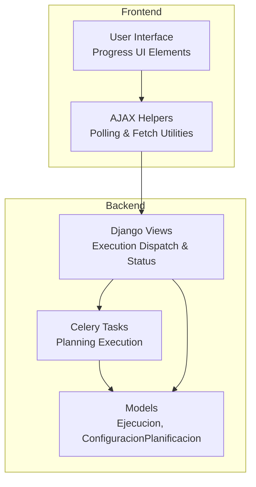
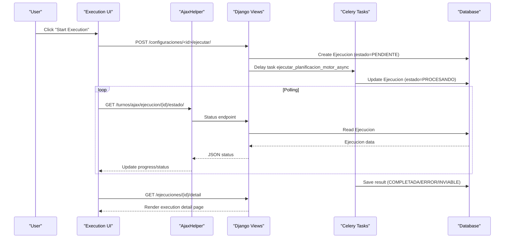
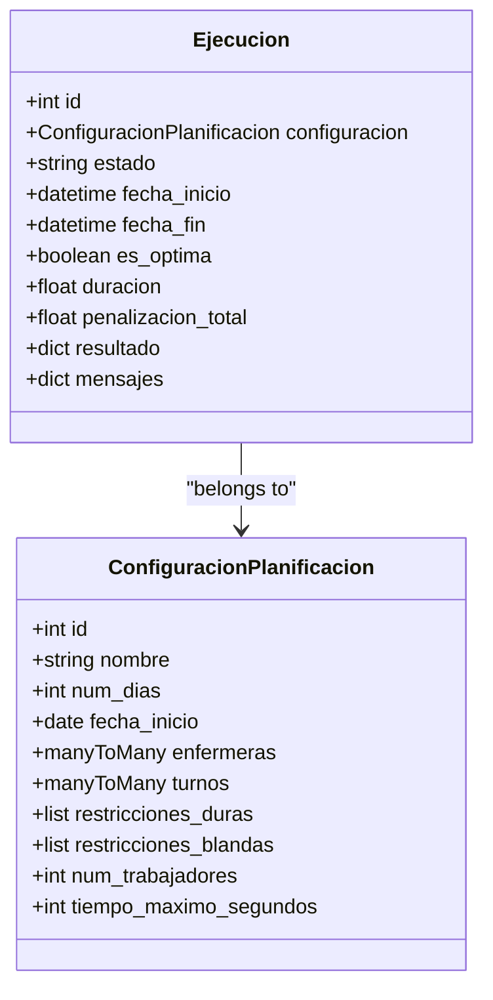
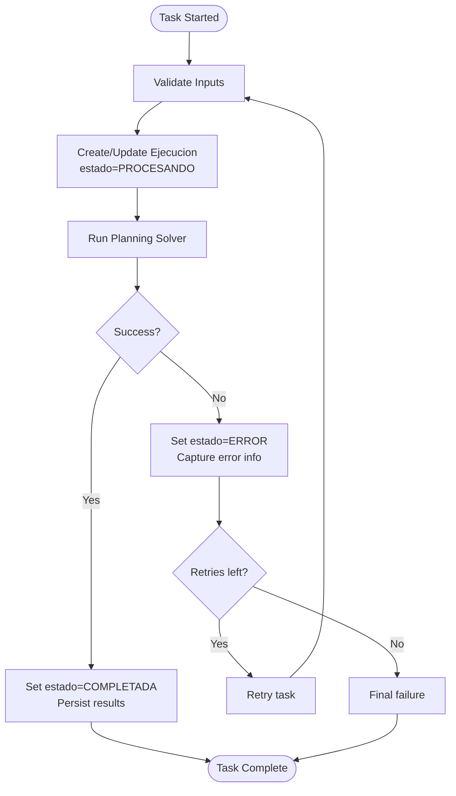
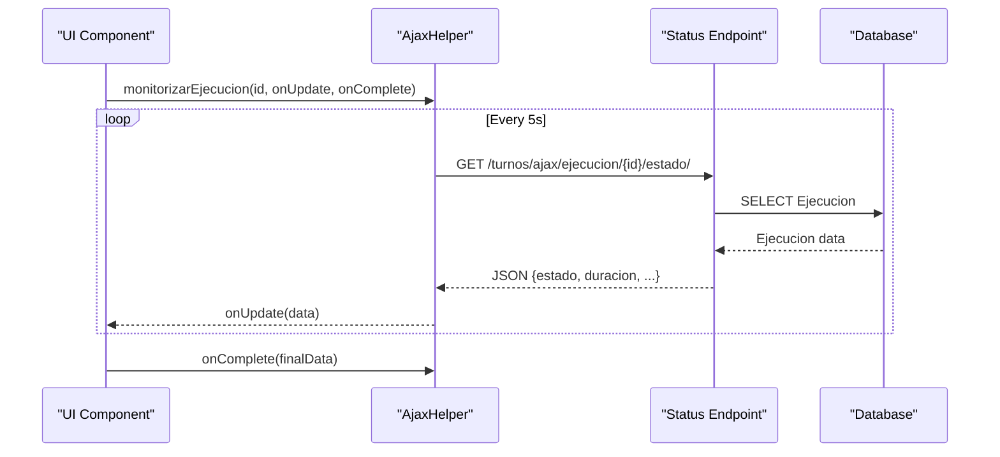
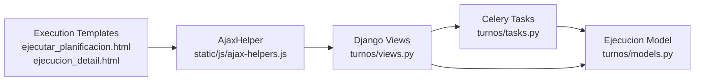

# Progress Monitoring and Real-time Updates

<cite>
**Referenced Files in This Document**
- [ajax-helpers.js](file://static/js/ajax-helpers.js)
- [tasks.py](file://turnos/tasks.py)
- [views.py](file://turnos/views.py)
- [models.py](file://turnos/models.py)
- [ejecutar_planificacion.html](file://turnos/templates/turnos/ejecutar_planificacion.html)
- [ejecucion_detail.html](file://turnos/templates/turnos/ejecucion_detail.html)
- [estadisticas.html](file://turnos/templates/turnos/partials/estadisticas.html)
- [urls.py](file://turnos/urls.py)
</cite>

## Table of Contents
1. [Introduction](#introduction)
2. [Project Structure](#project-structure)
3. [Core Components](#core-components)
4. [Architecture Overview](#architecture-overview)
5. [Detailed Component Analysis](#detailed-component-analysis)
6. [Dependency Analysis](#dependency-analysis)
7. [Performance Considerations](#performance-considerations)
8. [Troubleshooting Guide](#troubleshooting-guide)
9. [Conclusion](#conclusion)

## Introduction
This document explains how execution progress monitoring and real-time status updates are implemented in the system. It covers the backend execution tracking via Celery tasks, the frontend AJAX polling mechanism, and the user interface patterns used to display progress and status. It also documents the data synchronization between backend and frontend, error handling strategies, and user feedback mechanisms. Examples include progress bar implementations, status message formatting, and handling network connectivity issues during execution monitoring.

## Project Structure
The progress monitoring feature spans three layers:
- Backend: Celery tasks orchestrate long-running planning execution and persist execution records.
- Views: Django views coordinate task dispatch and expose execution status endpoints.
- Frontend: JavaScript helpers poll execution status and update UI elements.

**Diagram sources**
- [ajax-helpers.js:1-316](file://static/js/ajax-helpers.js#L1-L316)
- [views.py:683-792](file://turnos/views.py#L683-L792)
- [tasks.py:17-240](file://turnos/tasks.py#L17-L240)
- [models.py:481-520](file://turnos/models.py#L481-L520)

**Section sources**
- [ajax-helpers.js:1-316](file://static/js/ajax-helpers.js#L1-L316)
- [views.py:683-792](file://turnos/views.py#L683-L792)
- [tasks.py:17-240](file://turnos/tasks.py#L17-L240)
- [models.py:481-520](file://turnos/models.py#L481-L520)

## Core Components
- Execution tracking model: The Ejecucion model stores execution state, timestamps, optimization status, and results.
- Celery tasks: Two primary tasks handle execution:
  - Legacy generator task for backward compatibility.
  - New motor task implementing a five-phase pipeline for planning.
- Frontend polling: A reusable AjaxHelper polls execution status at a fixed interval until completion or error.
- UI templates: Templates render execution details, progress bars, and status badges.

Key responsibilities:
- Backend: Create or update Ejecucion records, run planning logic, persist outcomes, and mark completion/error.
- Frontend: Initiate polling, update progress bars and status badges, and handle errors gracefully.

**Section sources**
- [models.py:481-520](file://turnos/models.py#L481-L520)
- [tasks.py:17-240](file://turnos/tasks.py#L17-L240)
- [tasks.py:333-696](file://turnos/tasks.py#L333-L696)
- [ajax-helpers.js:204-257](file://static/js/ajax-helpers.js#L204-L257)
- [ejecucion_detail.html:306-347](file://turnos/templates/turnos/ejecucion_detail.html#L306-L347)

## Architecture Overview
The execution lifecycle integrates Django, Celery, and the browser frontend:

**Diagram sources**
- [views.py:683-792](file://turnos/views.py#L683-L792)
- [tasks.py:333-696](file://turnos/tasks.py#L333-L696)
- [ajax-helpers.js:241-257](file://static/js/ajax-helpers.js#L241-L257)
- [models.py:481-520](file://turnos/models.py#L481-L520)

## Detailed Component Analysis

### Backend Execution Tracking (Ejecucion Model)
The Ejecucion model captures execution metadata and outcomes:
- Fields include state, timestamps, optimization flag, penalties, and serialized results.
- The model supports three terminal states: COMPLETADA, ERROR, and INVIABLE.
- Durations and optimization flags are recorded for reporting.

**Diagram sources**
- [models.py:481-520](file://turnos/models.py#L481-L520)
- [models.py:332-420](file://turnos/models.py#L332-L420)

**Section sources**
- [models.py:481-520](file://turnos/models.py#L481-L520)

### Celery Task Orchestration
Two Celery tasks coordinate execution:
- Legacy task: Validates inputs, creates or updates Ejecucion, runs the generator, and persists results.
- New motor task: Uses a five-phase pipeline, validates configuration, prepares data, executes pipeline, and persists planilla and balances.

Both tasks:
- Set Ejecucion state to PROCESANDO initially.
- On success, set state to COMPLETADA and persist results.
- On failure, set state to ERROR and capture retry counts and error details.
- Retry up to a configured number of times with exponential backoff.

**Diagram sources**
- [tasks.py:17-240](file://turnos/tasks.py#L17-L240)
- [tasks.py:333-696](file://turnos/tasks.py#L333-L696)

**Section sources**
- [tasks.py:17-240](file://turnos/tasks.py#L17-L240)
- [tasks.py:333-696](file://turnos/tasks.py#L333-L696)

### Frontend Polling and Status Updates
The AjaxHelper provides:
- Generic fetch utilities with CSRF support.
- A polling function that periodically requests execution status.
- Application-specific functions to obtain execution status and monitor execution progress.

The polling logic:
- Requests status endpoint every 5 seconds.
- Stops when execution reaches COMPLETADA or ERROR.
- Limits maximum attempts to avoid indefinite polling.

**Diagram sources**
- [ajax-helpers.js:204-257](file://static/js/ajax-helpers.js#L204-L257)

**Section sources**
- [ajax-helpers.js:1-316](file://static/js/ajax-helpers.js#L1-L316)
- [ajax-helpers.js:204-257](file://static/js/ajax-helpers.js#L204-L257)

### Execution UI Patterns and Templates
Templates implement:
- Execution summary and options page with progress messaging and warnings.
- Execution detail page with status badges, duration, optimization flag, and downloadable exports.
- Partial statistics rendering with progress bars for workload distribution.

UI patterns:
- Status badges reflect execution state and optimality.
- Progress bars visualize distribution metrics.
- Tabbed interface organizes planilla, statistics, and details.

**Section sources**
- [ejecutar_planificacion.html:1-164](file://turnos/templates/turnos/ejecutar_planificacion.html#L1-L164)
- [ejecucion_detail.html:1-391](file://turnos/templates/turnos/ejecucion_detail.html#L1-L391)
- [estadisticas.html:278-311](file://turnos/templates/turnos/partials/estadisticas.html#L278-L311)

### URL Routing for Execution Endpoints
The URL configuration exposes:
- Execution detail page.
- Export endpoints for various formats.
- Execution initiation endpoint.

These routes enable the frontend to navigate to execution pages and trigger exports after completion.

**Section sources**
- [urls.py:39-51](file://turnos/urls.py#L39-L51)
- [urls.py:45-51](file://turnos/urls.py#L45-L51)

## Dependency Analysis
The execution monitoring feature depends on:
- Django views to dispatch tasks and serve status data.
- Celery workers to execute planning logic and update Ejecucion.
- Frontend AjaxHelper to poll status and update UI.
- Templates to render progress and results.

**Diagram sources**
- [ajax-helpers.js:1-316](file://static/js/ajax-helpers.js#L1-L316)
- [views.py:683-792](file://turnos/views.py#L683-L792)
- [tasks.py:17-240](file://turnos/tasks.py#L17-L240)
- [models.py:481-520](file://turnos/models.py#L481-L520)
- [ejecutar_planificacion.html:1-164](file://turnos/templates/turnos/ejecutar_planificacion.html#L1-L164)
- [ejecucion_detail.html:1-391](file://turnos/templates/turnos/ejecucion_detail.html#L1-L391)

**Section sources**
- [ajax-helpers.js:1-316](file://static/js/ajax-helpers.js#L1-L316)
- [views.py:683-792](file://turnos/views.py#L683-L792)
- [tasks.py:17-240](file://turnos/tasks.py#L17-L240)
- [models.py:481-520](file://turnos/models.py#L481-L520)

## Performance Considerations
- Polling interval: 5 seconds strikes a balance between responsiveness and server load. Adjust based on expected execution durations.
- Maximum attempts: Defaults to 120 attempts (~10 minutes) to prevent runaway polling.
- Database writes: Ejecucion updates occur on task creation, processing, and completion to minimize read contention.
- Frontend rendering: Statistics and planilla are rendered client-side from JSON payloads to reduce server-side templating overhead.

## Troubleshooting Guide
Common issues and remedies:
- Network connectivity failures during polling:
  - The polling function catches errors and clears intervals. Re-initiate polling on reconnect or show a retry prompt.
- Task retries exhausted:
  - The task sets Ejecucion state to ERROR and captures error details. Display user-friendly messages and suggest reviewing configuration.
- Long-running executions:
  - Increase maximum polling attempts or adjust polling interval. Ensure Celery workers are healthy and have sufficient resources.
- Infeasible configurations:
  - The new motor task may mark execution as INVIABLE. Provide actionable suggestions to relax constraints.

**Section sources**
- [ajax-helpers.js:217-221](file://static/js/ajax-helpers.js#L217-L221)
- [tasks.py:204-240](file://turnos/tasks.py#L204-L240)
- [tasks.py:566-580](file://turnos/tasks.py#L566-L580)

## Conclusion
The system implements robust execution progress monitoring through a combination of Celery-backed execution tracking, Django endpoints, and frontend AJAX polling. The UI presents clear status indicators, progress visuals, and actionable feedback. The design emphasizes reliability with retries, graceful error handling, and user-centric messaging, ensuring a smooth experience even under challenging conditions.