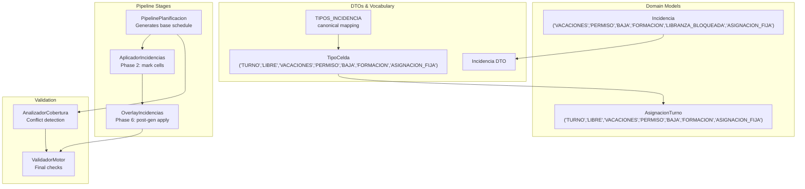
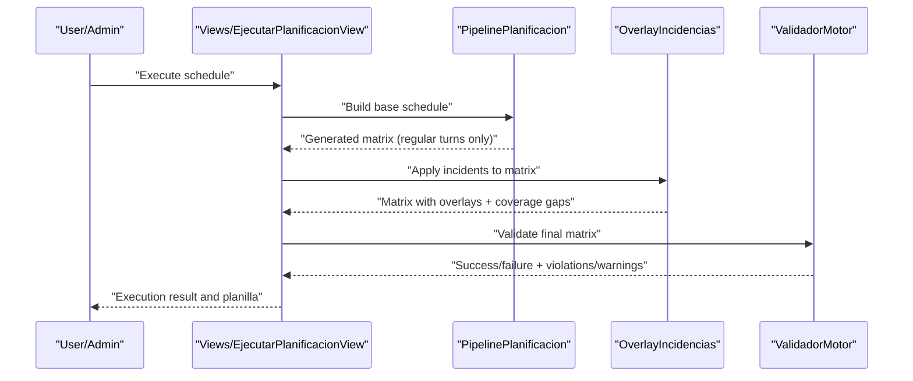
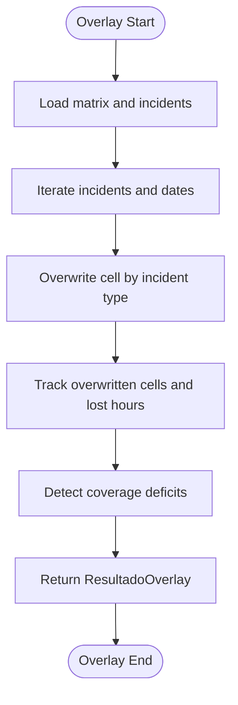
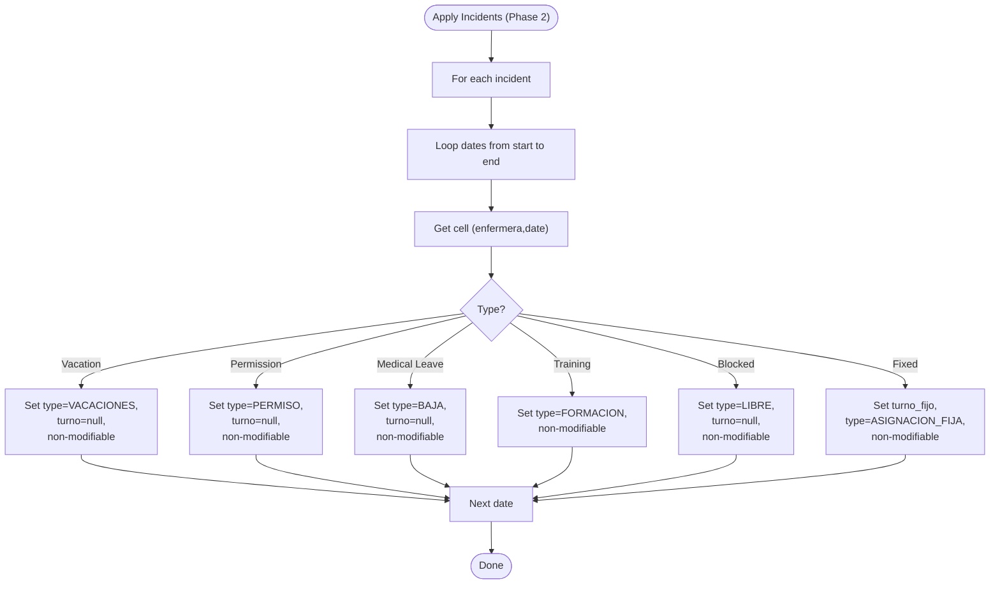
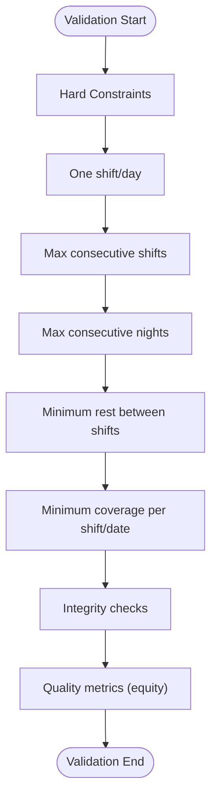
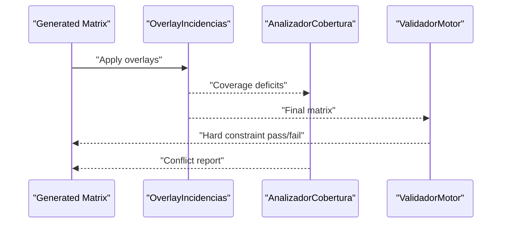
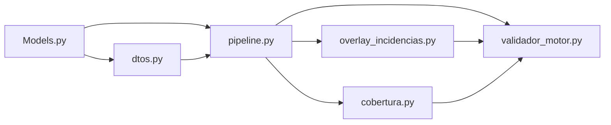

# Incident Handling

<cite>
**Referenced Files in This Document**
- [models.py](file://turnos/models.py)
- [dtos.py](file://turnos/dominio/dtos.py)
- [vocabulario.py](file://turnos/dominio/vocabulario.py)
- [incidencias.py](file://turnos/motor/incidencias.py)
- [overlay_incidencias.py](file://turnos/motor/overlay_incidencias.py)
- [pipeline.py](file://turnos/motor/pipeline.py)
- [validador_motor.py](file://turnos/motor/validador_motor.py)
- [cobertura.py](file://turnos/motor/cobertura.py)
- [admin.py](file://turnos/admin.py)
- [views.py](file://turnos/views.py)
- [forms.py](file://turnos/forms.py)
</cite>

## Table of Contents
1. [Introduction](#introduction)
2. [Project Structure](#project-structure)
3. [Core Components](#core-components)
4. [Architecture Overview](#architecture-overview)
5. [Detailed Component Analysis](#detailed-component-analysis)
6. [Dependency Analysis](#dependency-analysis)
7. [Performance Considerations](#performance-considerations)
8. [Troubleshooting Guide](#troubleshooting-guide)
9. [Conclusion](#conclusion)
10. [Appendices](#appendices)

## Introduction
This document describes the incident handling system for managing staff absences such as vacation requests, medical leaves, and other planned time off. It explains the incident lifecycle from creation to integration into the scheduling solution, the overlay mechanism for temporarily modifying staff availability, validation rules, and conflict detection with planned shifts. Practical examples illustrate common scenarios, approval workflows, and impact assessments on schedule coverage. Reporting, historical tracking, and compliance considerations are also addressed.

## Project Structure
The incident handling capability spans domain models, DTOs, pipeline stages, and administrative interfaces:
- Domain models define staff, shifts, and absence records.
- DTOs and vocabulary define canonical types and enumerations used across the engine.
- Pipeline orchestrates generation and validation; overlay applies incidents after generation.
- Admin and views support creation, review, and reporting of incidents.



**Diagram sources**
- [models.py:749-785](file://turnos/models.py#L749-L785)
- [dtos.py:22-41](file://turnos/dominio/dtos.py#L22-L41)
- [vocabulario.py:63-70](file://turnos/dominio/vocabulario.py#L63-L70)
- [pipeline.py:31-267](file://turnos/motor/pipeline.py#L31-L267)
- [incidencias.py:21-98](file://turnos/motor/incidencias.py#L21-L98)
- [overlay_incidencias.py:24-205](file://turnos/motor/overlay_incidencias.py#L24-L205)
- [validador_motor.py:23-451](file://turnos/motor/validador_motor.py#L23-L451)
- [cobertura.py:21-208](file://turnos/motor/cobertura.py#L21-L208)

**Section sources**
- [models.py:749-785](file://turnos/models.py#L749-L785)
- [dtos.py:22-41](file://turnos/dominio/dtos.py#L22-L41)
- [vocabulario.py:63-70](file://turnos/dominio/vocabulario.py#L63-L70)
- [pipeline.py:31-267](file://turnos/motor/pipeline.py#L31-L267)

## Core Components
- Incidencia model: Stores absence events per staff member with start/end dates and optional fixed shift assignment.
- DTO Incidencia: Internal representation used by the engine.
- AplicadorIncidencias: Marks cells affected by incidents as non-modifiable and sets type.
- OverlayIncidencias: Applies incidents as a post-generation overlay to the generated schedule.
- PipelinePlanificacion: Orchestrates generation and validation; overlays are applied independently afterward.
- ValidadorMotor and AnalizadorCobertura: Enforce hard constraints and detect conflicts.

**Section sources**
- [models.py:749-785](file://turnos/models.py#L749-L785)
- [dtos.py:169-181](file://turnos/dominio/dtos.py#L169-L181)
- [incidencias.py:21-98](file://turnos/motor/incidencias.py#L21-L98)
- [overlay_incidencias.py:24-205](file://turnos/motor/overlay_incidencias.py#L24-L205)
- [pipeline.py:31-267](file://turnos/motor/pipeline.py#L31-L267)
- [validador_motor.py:23-451](file://turnos/motor/validador_motor.py#L23-L451)
- [cobertura.py:21-208](file://turnos/motor/cobertura.py#L21-L208)

## Architecture Overview
The system separates automatic generation from incident application:
- Generation phase builds a base schedule using rotation and solver adjustments.
- Incidents are applied as deterministic overlays after generation, not during solving.
- Validation ensures hard constraints are met and reports quality metrics.



**Diagram sources**
- [views.py:683-792](file://turnos/views.py#L683-L792)
- [pipeline.py:92-234](file://turnos/motor/pipeline.py#L92-L234)
- [overlay_incidencias.py:45-75](file://turnos/motor/overlay_incidencias.py#L45-L75)
- [validador_motor.py:48-86](file://turnos/motor/validador_motor.py#L48-L86)

## Detailed Component Analysis

### Incident Types and Mapping
- Canonical types include Vacation, Permission, Medical Leave, Training, Blocked Assignment, and Fixed Assignment.
- These types are mapped consistently across models, DTOs, and vocabulary.

```mermaid
classDiagram
class IncidenciaModel {
+int id
+int enfermera_id
+string tipo
+date fecha_inicio
+date fecha_fin
+int? turno_fijo_id
+string observaciones
}
class IncidenciaDTO {
+int enfermera_id
+string enfermera_nombre
+TipoIncidencia tipo
+date fecha_inicio
+date fecha_fin
+TurnoInfo? turno_fijo
+string observaciones
}
class TipoIncidencia {
<<enum>>
"VACACIONES"
"PERMISO"
"BAJA"
"FORMACION"
"LIBRANZA_BLOQUEADA"
"ASIGNACION_FIJA"
}
IncidenciaModel --> IncidenciaDTO : "domain->DTO"
IncidenciaDTO --> TipoIncidencia : "uses"
```

**Diagram sources**
- [models.py:749-785](file://turnos/models.py#L749-L785)
- [dtos.py:169-181](file://turnos/dominio/dtos.py#L169-L181)
- [dtos.py:33-41](file://turnos/dominio/dtos.py#L33-L41)

**Section sources**
- [models.py:749-785](file://turnos/models.py#L749-L785)
- [dtos.py:33-41](file://turnos/dominio/dtos.py#L33-L41)
- [vocabulario.py:63-70](file://turnos/dominio/vocabulario.py#L63-L70)

### Overlay Mechanism for Temporary Availability Changes
OverlayIncidencias applies incidents to the generated matrix after solver completion:
- Iterates over incident date ranges and overwrites cell assignments.
- Preserves original turnos for comparison and computes lost hours.
- Detects coverage deficits caused by overlays.



**Diagram sources**
- [overlay_incidencias.py:45-164](file://turnos/motor/overlay_incidencias.py#L45-L164)
- [overlay_incidencias.py:166-205](file://turnos/motor/overlay_incidencias.py#L166-L205)

**Section sources**
- [overlay_incidencias.py:24-205](file://turnos/motor/overlay_incidencias.py#L24-L205)

### Incident Application During Generation (Phase 2)
AplicadorIncidencias marks cells as non-modifiable and sets type during early pipeline stage:
- Sets type to Vacation, Permission, Medical Leave, Training, Blocked, or Fixed Assignment.
- Clears assigned turnos for non-fixed types and marks cells as non-modifiable.



**Diagram sources**
- [incidencias.py:37-97](file://turnos/motor/incidencias.py#L37-L97)

**Section sources**
- [incidencias.py:21-98](file://turnos/motor/incidencias.py#L21-L98)

### Validation Rules and Conflict Detection
Hard constraints validated after generation and overlay:
- One shift per day per staff member.
- Maximum consecutive shifts and nights.
- Minimum rest between shifts (real hours).
- Minimum coverage per shift per date.
- Data integrity checks (cell types, turnos present when required).



**Diagram sources**
- [validador_motor.py:88-311](file://turnos/motor/validador_motor.py#L88-L311)
- [cobertura.py:139-207](file://turnos/motor/cobertura.py#L139-L207)

**Section sources**
- [validador_motor.py:88-311](file://turnos/motor/validador_motor.py#L88-L311)
- [cobertura.py:139-207](file://turnos/motor/cobertura.py#L139-L207)

### Integration with Scheduling Solution
- Generated matrices exclude overlays; overlays are applied post-generation to reflect actual availability.
- Coverage deficits detected by overlay are surfaced for review.
- Final validation ensures hard constraints remain satisfied.



**Diagram sources**
- [overlay_incidencias.py:45-75](file://turnos/motor/overlay_incidencias.py#L45-L75)
- [cobertura.py:46-73](file://turnos/motor/cobertura.py#L46-L73)
- [validador_motor.py:48-86](file://turnos/motor/validador_motor.py#L48-L86)

**Section sources**
- [overlay_incidencias.py:45-75](file://turnos/motor/overlay_incidencias.py#L45-L75)
- [cobertura.py:46-73](file://turnos/motor/cobertura.py#L46-L73)
- [validador_motor.py:48-86](file://turnos/motor/validador_motor.py#L48-L86)

### Practical Scenarios and Workflows
- Vacation Request: Mark dates as Vacation; overlay clears assigned shifts; coverage deficits reported.
- Medical Leave: Mark dates as Medical Leave; overlay clears shifts; minimum rest validated across transitions.
- Permission: Mark dates as Permission; overlay clears shifts; no assigned turnos.
- Training: Mark dates as Training; overlay preserves existing shift if applicable.
- Fixed Assignment: Assign a specific shift for the period; overlay sets non-modifiable cell with assigned turno.
- Blocked Assignment: Treat as blocked day without assigned shift.

These scenarios are implemented via the overlay and validation logic described above.

**Section sources**
- [overlay_incidencias.py:77-164](file://turnos/motor/overlay_incidencias.py#L77-L164)
- [validador_motor.py:106-202](file://turnos/motor/validador_motor.py#L106-L202)

### Administrative and Reporting Interfaces
- Admin interface supports viewing and editing Incidencia records, including duration and fixed shift assignments.
- Execution detail pages show validation outcomes, coverage metrics, and planilla summaries.

**Section sources**
- [admin.py:386-415](file://turnos/admin.py#L386-L415)
- [views.py:511-648](file://turnos/views.py#L511-L648)

## Dependency Analysis
- Models depend on Django ORM and define relationships among staff, shifts, and incidents.
- DTOs and vocabulary decouple engine internals from Django models.
- Pipeline depends on builder, adjuster, coverage analyzer, repairer, and validator.
- Overlay depends on DTOs and vocabulary to interpret and apply incidents.
- Validation depends on turnos metadata and historical balances.



**Diagram sources**
- [models.py:749-785](file://turnos/models.py#L749-L785)
- [dtos.py:169-181](file://turnos/dominio/dtos.py#L169-L181)
- [pipeline.py:31-267](file://turnos/motor/pipeline.py#L31-L267)
- [overlay_incidencias.py:24-205](file://turnos/motor/overlay_incidencias.py#L24-L205)
- [validador_motor.py:23-451](file://turnos/motor/validador_motor.py#L23-L451)
- [cobertura.py:21-208](file://turnos/motor/cobertura.py#L21-L208)

**Section sources**
- [models.py:749-785](file://turnos/models.py#L749-L785)
- [dtos.py:169-181](file://turnos/dominio/dtos.py#L169-L181)
- [pipeline.py:31-267](file://turnos/motor/pipeline.py#L31-L267)
- [overlay_incidencias.py:24-205](file://turnos/motor/overlay_incidencias.py#L24-L205)
- [validador_motor.py:23-451](file://turnos/motor/validador_motor.py#L23-L451)
- [cobertura.py:21-208](file://turnos/motor/cobertura.py#L21-L208)

## Performance Considerations
- Overlay operates on a deep copy of the matrix to avoid altering the solver’s base; overhead scales with number of incidents and days.
- Coverage deficit detection iterates over all dates and turnos; keep incident ranges minimal and consolidated.
- Validation runs after overlay; ensure generated base is feasible to minimize post-generation repairs.

## Troubleshooting Guide
Common issues and resolutions:
- Violations of “one shift per day”: Ensure no overlapping incidents or conflicting assignments.
- Exceeded consecutive shifts/nights: Adjust incident ranges or redistribute shifts.
- Insufficient rest between shifts: Review transitions across periods and historical last shift.
- Coverage deficits after overlay: Reassess planned shifts or reduce incident overlap.
- Data integrity errors: Verify cell types and turno presence for TURNO-type cells.

**Section sources**
- [validador_motor.py:106-311](file://turnos/motor/validador_motor.py#L106-L311)
- [cobertura.py:139-207](file://turnos/motor/cobertura.py#L139-L207)

## Conclusion
The incident handling system integrates seamlessly with the scheduling pipeline by applying absence-related changes as deterministic overlays after generation. Hard constraints and coverage requirements are enforced by validators and analyzers, ensuring compliance and operational feasibility. Administrative interfaces and execution reports support transparency and auditing of incidents and their impacts.

## Appendices

### Compliance and Historical Tracking
- Historical balances capture accumulated hours and counts to inform future planning and equity checks.
- Execution logs and validation messages provide audit trails for compliance reporting.

**Section sources**
- [validador_motor.py:389-438](file://turnos/motor/validador_motor.py#L389-L438)
- [views.py:511-648](file://turnos/views.py#L511-L648)