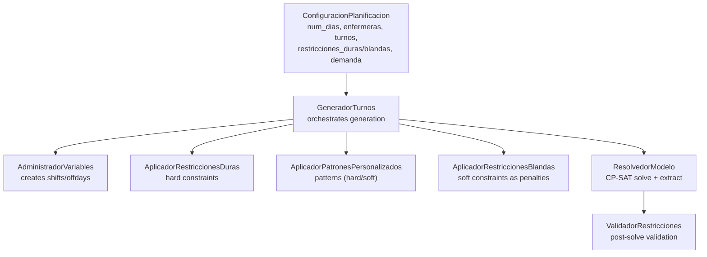
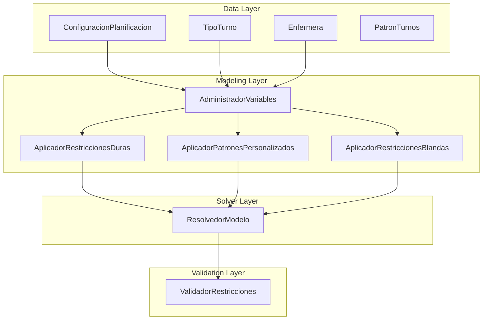
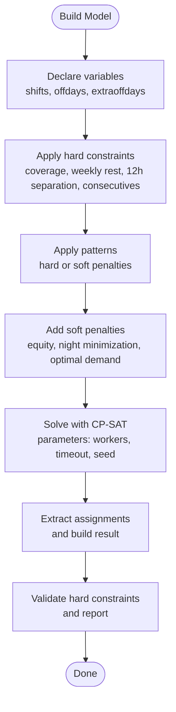
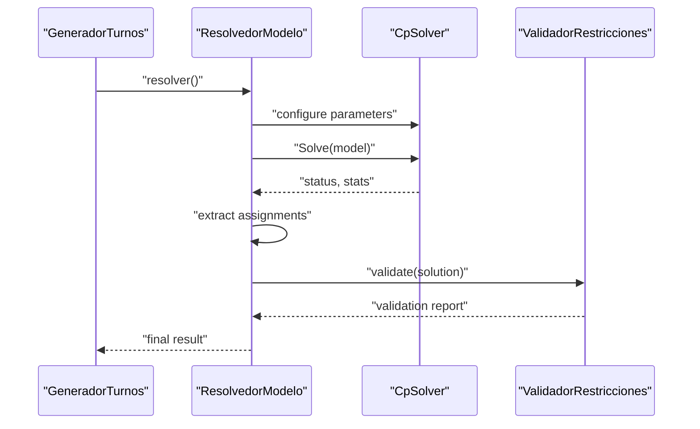
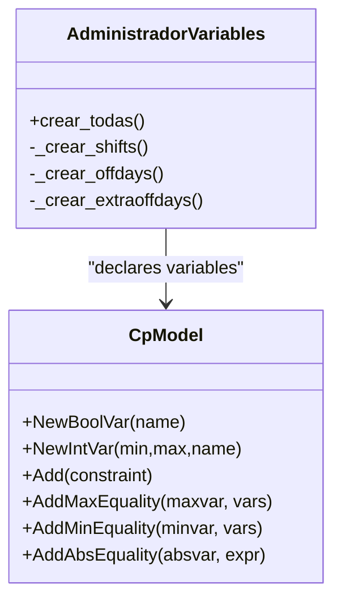
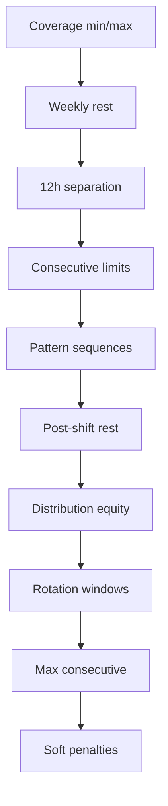
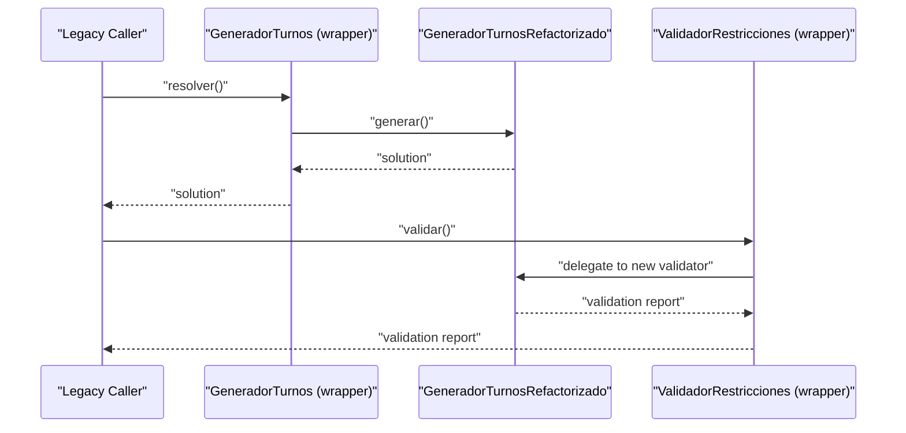
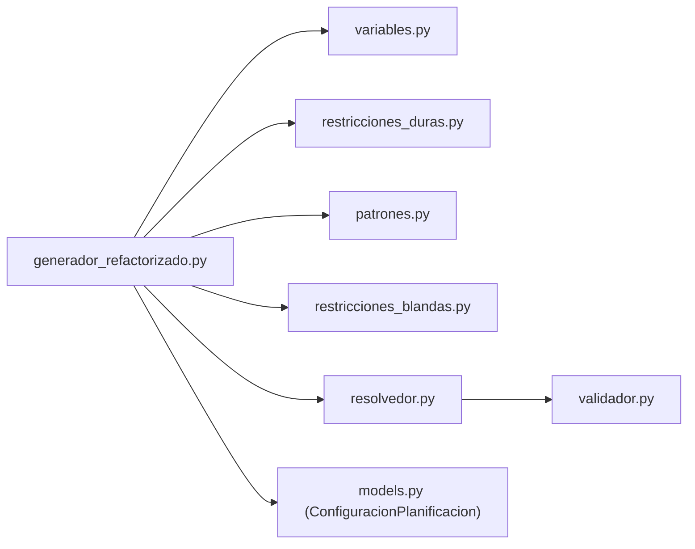

# Algorithmic Foundations

<cite>
**Referenced Files in This Document**
- [generador.py](file://turnos/generador.py)
- [generador_refactorizado.py](file://turnos/generador_refactorizado.py)
- [resolvedor.py](file://turnos/resolvedor.py)
- [variables.py](file://turnos/variables.py)
- [restricciones_duras.py](file://turnos/restricciones_duras.py)
- [restricciones_blandas.py](file://turnos/restricciones_blandas.py)
- [patrones.py](file://turnos/patrones.py)
- [generador_patrones.py](file://turnos/generador_patrones.py)
- [validador.py](file://turnos/validador.py)
- [models.py](file://turnos/models.py)
- [logger_config.py](file://turnos/logger_config.py)
- [WIKI.md](file://docs/WIKI.md)
- [reparador.py](file://turnos/motor/reparador.py)
</cite>

## Table of Contents
1. [Introduction](#introduction)
2. [Project Structure](#project-structure)
3. [Core Components](#core-components)
4. [Architecture Overview](#architecture-overview)
5. [Detailed Component Analysis](#detailed-component-analysis)
6. [Dependency Analysis](#dependency-analysis)
7. [Performance Considerations](#performance-considerations)
8. [Troubleshooting Guide](#troubleshooting-guide)
9. [Conclusion](#conclusion)
10. [Appendices](#appendices)

## Introduction
This document explains the algorithmic foundations of the shift generation process. It covers the constraint satisfaction formulation, the CP-SAT modeling strategy, hard and soft constraints, objective construction, and solution extraction. It also documents the legacy compatibility wrapper, migration paths, debugging and profiling techniques, and performance tuning for different problem scales.

## Project Structure
The shift generation pipeline is organized around a modular CP-SAT model built in Python with Google OR-Tools. The core flow is:
- Build variables and constraints
- Apply hard constraints (covering minimum/maximum, weekly rest, consecutive limits, 12-hour rest)
- Apply pattern constraints (hard or soft penalties)
- Add soft constraints as penalties to an objective
- Solve via CP-SAT with tunable parameters
- Extract assignments and validate

**Diagram sources**
- [generador_refactorizado.py:105-139](file://turnos/generador_refactorizado.py#L105-L139)
- [variables.py:21-48](file://turnos/variables.py#L21-L48)
- [restricciones_duras.py:37-44](file://turnos/restricciones_duras.py#L37-L44)
- [patrones.py:23-59](file://turnos/patrones.py#L23-L59)
- [restricciones_blandas.py:36-46](file://turnos/restricciones_blandas.py#L36-L46)
- [resolvedor.py:21-50](file://turnos/resolvedor.py#L21-L50)
- [validador.py:20-33](file://turnos/validador.py#L20-L33)

**Section sources**
- [generador_refactorizado.py:105-139](file://turnos/generador_refactorizado.py#L105-L139)
- [variables.py:21-48](file://turnos/variables.py#L21-L48)
- [restricciones_duras.py:37-44](file://turnos/restricciones_duras.py#L37-L44)
- [patrones.py:23-59](file://turnos/patrones.py#L23-L59)
- [restricciones_blandas.py:36-46](file://turnos/restricciones_blandas.py#L36-L46)
- [resolvedor.py:21-50](file://turnos/resolvedor.py#L21-L50)
- [validador.py:20-33](file://turnos/validador.py#L20-L33)

## Core Components
- GeneradorTurnos orchestrates the model creation, constraint application, and resolution.
- AdministradorVariables declares decision variables (shifts and offdays) and encodes day-off semantics.
- AplicadorRestriccionesDuras defines hard constraints (covering, weekly rest, 12-hour rest, consecutive limits).
- AplicadorPatronesPersonalizados applies pattern rules (sequences, post-shift rest, distribution, rotation, max consecutive) as hard constraints or soft penalties.
- AplicadorRestriccionesBlandas adds soft objectives as penalties (equity, minimizing night shifts, meeting optimal demand).
- ResolvedorModelo invokes CP-SAT with tunable parameters, extracts results, and validates.
- ValidadorRestricciones checks the solution against hard constraints and reports violations.

**Section sources**
- [generador_refactorizado.py:17-139](file://turnos/generador_refactorizado.py#L17-L139)
- [variables.py:8-71](file://turnos/variables.py#L8-L71)
- [restricciones_duras.py:10-156](file://turnos/restricciones_duras.py#L10-L156)
- [patrones.py:8-276](file://turnos/patrones.py#L8-L276)
- [restricciones_blandas.py:9-138](file://turnos/restricciones_blandas.py#L9-L138)
- [resolvedor.py:11-113](file://turnos/resolvedor.py#L11-L113)
- [validador.py:11-200](file://turnos/validador.py#L11-L200)

## Architecture Overview
The system follows a layered CP-SAT architecture:
- Data layer: Django models define configuration, resources, and patterns.
- Modeling layer: Variables, hard constraints, patterns, and soft penalties.
- Solver layer: CP-SAT with tunable parameters.
- Validation layer: Post-resolution checks.

**Diagram sources**
- [models.py:332-400](file://turnos/models.py#L332-L400)
- [models.py:60-200](file://turnos/models.py#L60-L200)
- [models.py:221-330](file://turnos/models.py#L221-L330)
- [variables.py:8-71](file://turnos/variables.py#L8-L71)
- [restricciones_duras.py:10-156](file://turnos/restricciones_duras.py#L10-L156)
- [patrones.py:8-276](file://turnos/patrones.py#L8-L276)
- [restricciones_blandas.py:9-138](file://turnos/restricciones_blandas.py#L9-L138)
- [resolvedor.py:11-113](file://turnos/resolvedor.py#L11-L113)
- [validador.py:11-200](file://turnos/validador.py#L11-L200)

## Detailed Component Analysis

### Constraint Satisfaction Formulation
- Decision variables:
  - shifts[e,d,t] ∈ {0,1} indicating whether nurse e works shift t on day d.
  - offdays[e,d] ∈ {0,1} indicating a day off for nurse e on day d.
  - Additional auxiliary variables for extra off-days after night shifts when applicable.
- Domain constraints:
  - Exactly one activity per day: sum over t of shifts[e,d,t] + offdays[e,d] == 1.
- Hard constraints:
  - Minimum/maximum coverage per shift type.
  - Weekly rest or minimal total off-days depending on horizon length.
  - 12-hour separation between shifts across days.
  - Maximum consecutive working days/shifts.
- Pattern constraints:
  - Hard or soft penalties for sequences, post-shift rest windows, equitable distribution, rotation windows, and maximum consecutive occurrences.
- Objective:
  - Sum of soft penalties weighted by importance; minimized subject to satisfying hard constraints.

**Diagram sources**
- [variables.py:21-71](file://turnos/variables.py#L21-L71)
- [restricciones_duras.py:37-156](file://turnos/restricciones_duras.py#L37-L156)
- [patrones.py:23-276](file://turnos/patrones.py#L23-L276)
- [restricciones_blandas.py:36-138](file://turnos/restricciones_blandas.py#L36-L138)
- [resolvedor.py:21-50](file://turnos/resolvedor.py#L21-L50)
- [validador.py:20-33](file://turnos/validador.py#L20-L33)

**Section sources**
- [variables.py:21-71](file://turnos/variables.py#L21-L71)
- [restricciones_duras.py:37-156](file://turnos/restricciones_duras.py#L37-L156)
- [patrones.py:23-276](file://turnos/patrones.py#L23-L276)
- [restricciones_blandas.py:36-138](file://turnos/restricciones_blandas.py#L36-L138)
- [resolvedor.py:21-50](file://turnos/resolvedor.py#L21-L50)
- [validador.py:20-33](file://turnos/validador.py#L20-L33)

### Google OR-Tools CP-SAT Solver Integration
- Solver parameters:
  - num_search_workers: number of parallel workers.
  - max_time_in_seconds: global timeout.
  - random_seed: optional seed for reproducibility.
- Solution status interpretation:
  - OPTIMAL: solution found and proven optimal.
  - FEASIBLE: solution found satisfying all hard constraints.
  - Other statuses indicate infeasibility or model issues.
- Extraction:
  - Iterate over nurses, days, and shifts to collect assignments.
  - Compute derived metrics (objective value, wall time).

**Diagram sources**
- [resolvedor.py:21-113](file://turnos/resolvedor.py#L21-L113)
- [validador.py:20-33](file://turnos/validador.py#L20-L33)

**Section sources**
- [resolvedor.py:21-113](file://turnos/resolvedor.py#L21-L113)
- [WIKI.md:940-959](file://docs/WIKI.md#L940-L959)

### Variable Declaration Strategies
- shifts[e,d,t]: Boolean variable per nurse-day-shift.
- offdays[e,d]: Boolean variable per nurse-day; linked to shifts via a cardinality constraint ensuring one activity per day.
- extraoffdays[e,d]: Optional auxiliary variable to enforce extra off-day semantics after night shifts when configured.

**Diagram sources**
- [variables.py:8-71](file://turnos/variables.py#L8-L71)

**Section sources**
- [variables.py:8-71](file://turnos/variables.py#L8-L71)

### Constraint Modeling Techniques
- Hard constraints:
  - Coverage: sum over nurses equals assigned count; bound by min/max demand per shift.
  - Weekly rest: enforced either as strict weekly off-days or as a global lower bound on off-days.
  - 12-hour separation: forbids transitions violating the minimum rest window across consecutive days.
  - Consecutive limits: sliding-window sums constrained to upper bounds.
- Pattern constraints:
  - Sequences: implication chains enforcing required sequences.
  - Post-shift rest: implication from a “has N consecutive” trigger to mandatory off-days.
  - Distribution: pairwise differences bounded (or penalized) to maintain equity.
  - Rotation: ensures at least one of selected shifts appears in rolling windows.
  - Max consecutive: sliding window constraint or soft violation variable.
- Soft constraints as penalties:
  - Equity: deviation of total shifts per nurse.
  - Night minimization: total count of night shifts.
  - Optimal demand: absolute deviation from target demand per shift.

**Diagram sources**
- [restricciones_duras.py:37-156](file://turnos/restricciones_duras.py#L37-L156)
- [patrones.py:23-276](file://turnos/patrones.py#L23-L276)
- [restricciones_blandas.py:36-138](file://turnos/restricciones_blandas.py#L36-L138)

**Section sources**
- [restricciones_duras.py:37-156](file://turnos/restricciones_duras.py#L37-L156)
- [patrones.py:23-276](file://turnos/patrones.py#L23-L276)
- [restricciones_blandas.py:36-138](file://turnos/restricciones_blandas.py#L36-L138)

### Legacy Compatibility Wrapper and Migration
- Legacy wrapper:
  - GeneradorTurnos delegates to the refactored generator for compatibility.
  - ValidadorRestricciones wraps the new validator for legacy validation calls.
- Migration path:
  - New configuration supports JSON-based patterns and constraints.
  - Existing database-backed patterns remain supported alongside new JSON patterns.
  - The refactored generator composes constraints and patterns consistently.

**Diagram sources**
- [generador.py:26-65](file://turnos/generador.py#L26-L65)
- [generador_refactorizado.py:17-139](file://turnos/generador_refactorizado.py#L17-L139)
- [validador.py:52-65](file://turnos/validador.py#L52-L65)

**Section sources**
- [generador.py:26-65](file://turnos/generador.py#L26-L65)
- [generador_refactorizado.py:17-139](file://turnos/generador_refactorizado.py#L17-L139)
- [validador.py:52-65](file://turnos/validador.py#L52-L65)

### Theoretical Background and Complexity
- Nature: Constraint Programming with integer/Boolean variables and linear constraints; objective is piecewise linear via penalty variables.
- Complexity: Mixed NP-hard (constraint feasibility) and combinatorial optimization. CP-SAT performs branch-and-bound with clause learning; practical performance depends on variable ordering, tight constraints, and symmetry-breaking.
- Scaling: Problem size grows with O(E·D·T) for shifts plus auxiliary variables. Tight constraints reduce branching.

[No sources needed since this section provides general guidance]

### Algorithm Tuning, Convergence, and Quality Metrics
- Tuning parameters:
  - num_search_workers: parallel threads.
  - max_time_in_seconds: solver timeout.
  - seed: reproducibility.
- Convergence:
  - CP-SAT returns OPTIMAL or FEASIBLE when feasible; otherwise infeasible.
- Quality metrics:
  - Objective value (penalty sum).
  - Number of assignments.
  - Wall time.
  - Validation outcomes (violations vs. successes).

**Section sources**
- [WIKI.md:940-959](file://docs/WIKI.md#L940-L959)
- [resolvedor.py:25-50](file://turnos/resolvedor.py#L25-L50)

### Debugging, Profiling, and Optimization Strategies
- Logging:
  - Centralized logging configuration and per-module loggers capture model construction, constraints, and solver statistics.
- Debugging:
  - Inspect generated constraints and penalties.
  - Validate extracted solutions against hard constraints.
- Profiling:
  - Use solver statistics (conflicts, branches, wall time).
  - Adjust workers/timeouts based on problem scale.
- Optimization strategies:
  - Tighten constraints to reduce search space.
  - Prefer hard constraints for critical rules; use soft penalties for preferences.
  - Use weekly rest patterns appropriate to horizon length.

**Section sources**
- [logger_config.py:6-33](file://turnos/logger_config.py#L6-L33)
- [generador_refactorizado.py:49-104](file://turnos/generador_refactorizado.py#L49-L104)
- [validador.py:20-33](file://turnos/validador.py#L20-L33)
- [reparador.py:63-96](file://turnos/motor/reparador.py#L63-L96)

## Dependency Analysis
The refactored generator composes several modules that collaborate to build and solve the CP-SAT model. Coupling is primarily through shared variables and configuration objects.

**Diagram sources**
- [generador_refactorizado.py:105-139](file://turnos/generador_refactorizado.py#L105-L139)
- [variables.py:8-71](file://turnos/variables.py#L8-L71)
- [restricciones_duras.py:10-156](file://turnos/restricciones_duras.py#L10-L156)
- [patrones.py:8-276](file://turnos/patrones.py#L8-L276)
- [restricciones_blandas.py:9-138](file://turnos/restricciones_blandas.py#L9-L138)
- [resolvedor.py:11-113](file://turnos/resolvedor.py#L11-L113)
- [validador.py:11-200](file://turnos/validador.py#L11-L200)
- [models.py:332-400](file://turnos/models.py#L332-L400)

**Section sources**
- [generador_refactorizado.py:105-139](file://turnos/generador_refactorizado.py#L105-L139)
- [variables.py:8-71](file://turnos/variables.py#L8-L71)
- [restricciones_duras.py:10-156](file://turnos/restricciones_duras.py#L10-L156)
- [patrones.py:8-276](file://turnos/patrones.py#L8-L276)
- [restricciones_blandas.py:9-138](file://turnos/restricciones_blandas.py#L9-L138)
- [resolvedor.py:11-113](file://turnos/resolvedor.py#L11-L113)
- [validador.py:11-200](file://turnos/validador.py#L11-L200)
- [models.py:332-400](file://turnos/models.py#L332-L400)

## Performance Considerations
- Parameter tuning:
  - Workers: increase for larger problems; cap at hardware threads.
  - Timeout: scale with horizon and resource count.
  - Seed: set for reproducible runs.
- Model tightening:
  - Prefer explicit daily activity constraints.
  - Use tight bounds for penalties.
  - Avoid redundant constraints.
- Pattern selection:
  - Limit overly restrictive patterns to reduce infeasibility risk.
  - Use soft penalties judiciously.

[No sources needed since this section provides general guidance]

## Troubleshooting Guide
- Infeasible solution:
  - Review hard constraints (coverage, weekly rest, 12h separation, consecutive limits).
  - Temporarily relax or remove patterns to localize conflicts.
- Slow solving:
  - Reduce horizon or resource count.
  - Tighten constraints; adjust workers/timeout.
- Incorrect assignments:
  - Validate with the post-solve validator.
  - Inspect logs for applied constraints and penalties.

**Section sources**
- [resolvedor.py:34-48](file://turnos/resolvedor.py#L34-L48)
- [validador.py:20-33](file://turnos/validador.py#L20-L33)

## Conclusion
The shift generation system combines a clear CP-SAT formulation with modular constraint application and robust validation. The refactored design improves maintainability while preserving legacy compatibility. Proper tuning of solver parameters, careful constraint modeling, and thorough validation yield reliable solutions across diverse scales.

[No sources needed since this section summarizes without analyzing specific files]

## Appendices

### Appendix A: Configuration and Data Models
- ConfiguracionPlanificacion holds scheduling horizon, resources, demand, hard/soft constraints, and solver parameters.
- TipoTurno defines shift types with optional time windows and short codes.
- PatronTurnos defines reusable pattern rules with JSON configurations.

**Section sources**
- [models.py:332-400](file://turnos/models.py#L332-L400)
- [models.py:60-200](file://turnos/models.py#L60-L200)
- [models.py:221-330](file://turnos/models.py#L221-L330)

### Appendix B: Legacy Pattern Application
- Legacy pattern application is supported via a separate applicator that translates stored patterns into CP-SAT constraints or penalties.

**Section sources**
- [generador_patrones.py:7-64](file://turnos/generador_patrones.py#L7-L64)