# Pattern Generation

<cite>
**Referenced Files in This Document**
- [generador_refactorizado.py](file://turnos/generador_refactorizado.py)
- [variables.py](file://turnos/variables.py)
- [restricciones_duras.py](file://turnos/restricciones_duras.py)
- [restricciones_blandas.py](file://turnos/restricciones_blandas.py)
- [patrones.py](file://turnos/patrones.py)
- [generador_patrones.py](file://turnos/generador_patrones.py)
- [resolvedor.py](file://turnos/resolvedor.py)
- [validador.py](file://turnos/validador.py)
- [vocabulario.py](file://turnos/dominio/vocabulario.py)
- [dtos.py](file://turnos/dominio/dtos.py)
- [rotacion_base.py](file://turnos/motor/rotacion_base.py)
- [pipeline.py](file://turnos/motor/pipeline.py)
- [normalizacion.py](file://turnos/dominio/normalizacion.py)
</cite>

## Table of Contents
1. [Introduction](#introduction)
2. [Project Structure](#project-structure)
3. [Core Components](#core-components)
4. [Architecture Overview](#architecture-overview)
5. [Detailed Component Analysis](#detailed-component-analysis)
6. [Dependency Analysis](#dependency-analysis)
7. [Performance Considerations](#performance-considerations)
8. [Troubleshooting Guide](#troubleshooting-guide)
9. [Conclusion](#conclusion)
10. [Appendices](#appendices)

## Introduction
This document explains the pattern generation subsystem responsible for creating and applying cyclic rotation patterns and other shift-related constraints to the scheduling model. It covers:
- Mathematical foundations for cyclic rotation pattern creation
- Seed value algorithms for randomization and reproducibility
- Pattern validation and conflict detection
- How patterns relate to shift types and durations
- Optimization criteria and integration with the constraint satisfaction solver
- Practical workflows for pattern creation and mapping to shifts

## Project Structure
The pattern generation subsystem spans several modules:
- Model orchestration and variable creation
- Hard and soft constraint application
- Pattern application and penalties
- Solver invocation and solution extraction
- Validation and pipeline integration

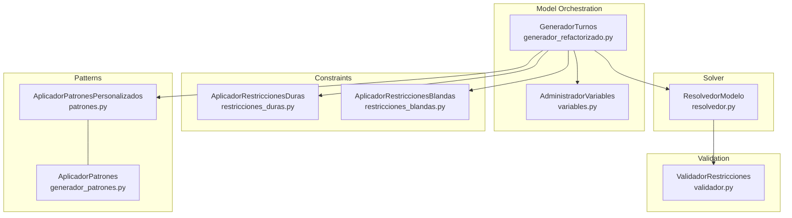

**Diagram sources**
- [generador_refactorizado.py:105-135](file://turnos/generador_refactorizado.py#L105-L135)
- [variables.py:21-48](file://turnos/variables.py#L21-L48)
- [restricciones_duras.py:37-44](file://turnos/restricciones_duras.py#L37-L44)
- [restricciones_blandas.py:36-46](file://turnos/restricciones_blandas.py#L36-L46)
- [patrones.py:23-58](file://turnos/patrones.py#L23-L58)
- [generador_patrones.py:21-64](file://turnos/generador_patrones.py#L21-L64)
- [resolvedor.py:21-50](file://turnos/resolvedor.py#L21-L50)
- [validador.py:20-33](file://turnos/validador.py#L20-L33)

**Section sources**
- [generador_refactorizado.py:105-135](file://turnos/generador_refactorizado.py#L105-L135)
- [variables.py:21-48](file://turnos/variables.py#L21-L48)
- [restricciones_duras.py:37-44](file://turnos/restricciones_duras.py#L37-L44)
- [restricciones_blandas.py:36-46](file://turnos/restricciones_blandas.py#L36-L46)
- [patrones.py:23-58](file://turnos/patrones.py#L23-L58)
- [generador_patrones.py:21-64](file://turnos/generador_patrones.py#L21-L64)
- [resolvedor.py:21-50](file://turnos/resolvedor.py#L21-L50)
- [validador.py:20-33](file://turnos/validador.py#L20-L33)

## Core Components
- GeneradorTurnos orchestrates model creation, hard constraints, pattern application, soft constraints, and solver resolution.
- AdministradorVariables creates decision variables for shifts and off days, enforcing mutual exclusivity per day.
- AplicadorRestriccionesDuras applies hard constraints (coverage, rest periods, weekly rest, max consecutive shifts).
- AplicadorRestriccionesBlandas builds the objective function from soft constraints and pattern penalties.
- AplicadorPatronesPersonalizados applies canonical patterns (sequence, rest after shift, max consecutive, distribution, rotation).
- AplicadorPatrones (legacy) supports similar pattern application but is currently partially implemented.
- ResolvedorModelo invokes the CP-SAT solver with seed and timeout parameters.
- ValidadorRestricciones validates the solution against hard constraints.

**Section sources**
- [generador_refactorizado.py:17-135](file://turnos/generador_refactorizado.py#L17-L135)
- [variables.py:8-71](file://turnos/variables.py#L8-L71)
- [restricciones_duras.py:10-155](file://turnos/restricciones_duras.py#L10-L155)
- [restricciones_blandas.py:9-137](file://turnos/restricciones_blandas.py#L9-L137)
- [patrones.py:8-276](file://turnos/patrones.py#L8-L276)
- [generador_patrones.py:7-231](file://turnos/generador_patrones.py#L7-L231)
- [resolvedor.py:11-113](file://turnos/resolvedor.py#L11-L113)
- [validador.py:11-200](file://turnos/validador.py#L11-L200)

## Architecture Overview
The pattern generation subsystem integrates with the broader scheduling pipeline. Patterns are applied as hard or soft constraints within the CP-SAT model, while the solver minimizes a weighted objective composed of soft constraints and pattern penalties.

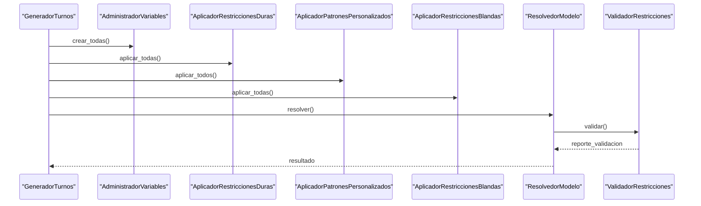

**Diagram sources**
- [generador_refactorizado.py:105-135](file://turnos/generador_refactorizado.py#L105-L135)
- [variables.py:21-48](file://turnos/variables.py#L21-L48)
- [restricciones_duras.py:37-44](file://turnos/restricciones_duras.py#L37-L44)
- [patrones.py:23-58](file://turnos/patrones.py#L23-L58)
- [restricciones_blandas.py:36-46](file://turnos/restricciones_blandas.py#L36-L46)
- [resolvedor.py:21-50](file://turnos/resolvedor.py#L21-L50)
- [validador.py:20-33](file://turnos/validador.py#L20-L33)

## Detailed Component Analysis

### Mathematical Foundations of Cyclic Rotation Pattern Creation
Cyclic rotation patterns define deterministic sequences of shifts over fixed cycles. The system converts abstract patterns into explicit cycles and maps them onto the schedule horizon.

- Explicit cycle definition: A cycle is a repeating sequence of shift assignments over a number of days. The cycle length determines periodicity.
- Mapping to calendar: For each nurse and each date, the position within the cycle is computed using modular arithmetic, incorporating per-nurse phase offsets.
- Special handling for “free” cells: If a cycle cell corresponds to a free day, the resulting cell is marked as free regardless of the underlying shift type.

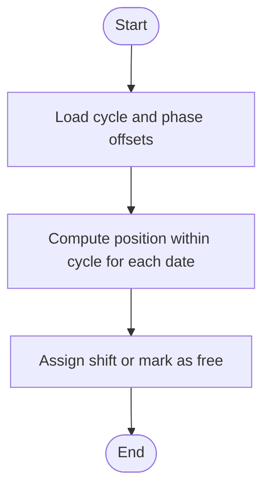

**Diagram sources**
- [rotacion_base.py:41-94](file://turnos/motor/rotacion_base.py#L41-L94)
- [dtos.py:184-194](file://turnos/dominio/dtos.py#L184-L194)

**Section sources**
- [rotacion_base.py:21-94](file://turnos/motor/rotacion_base.py#L21-L94)
- [dtos.py:184-194](file://turnos/dominio/dtos.py#L184-L194)

### Seed Value Algorithms for Randomization
The solver’s randomness can be controlled via a seed parameter. When configured, the solver uses a fixed seed to ensure reproducible solutions across runs.

- Seed injection: The seed is passed to the solver parameters prior to solving.
- Impact: Using the same seed yields identical branching and tie-breaking behavior, enabling reproducibility for comparative experiments.

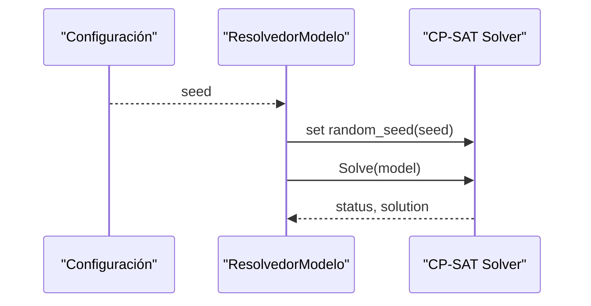

**Diagram sources**
- [resolvedor.py:25-32](file://turnos/resolvedor.py#L25-L32)

**Section sources**
- [resolvedor.py:25-32](file://turnos/resolvedor.py#L25-L32)

### Pattern Types and Shift Assignments
Patterns are mapped to shift types and durations through:
- Turn type indexing: Each shift type is mapped to an index for efficient constraint construction.
- Duration-aware logic: Some patterns consider shift duration and night shifts to compute transitions and rest periods.
- Canonical vocabulary: Pattern identifiers are normalized to canonical names for consistent handling.

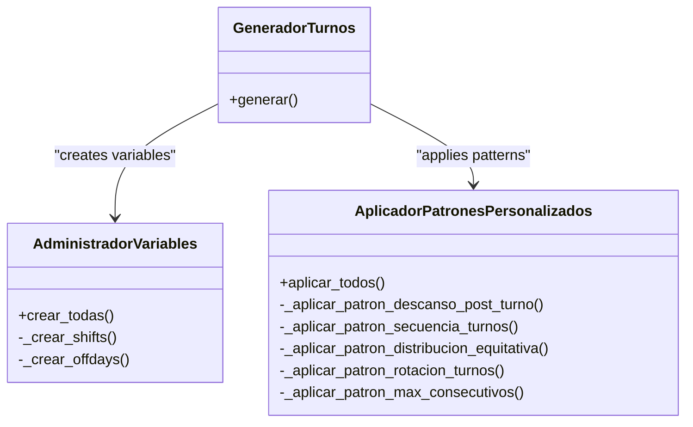

**Diagram sources**
- [patrones.py:8-276](file://turnos/patrones.py#L8-L276)
- [generador_refactorizado.py:105-135](file://turnos/generador_refactorizado.py#L105-L135)
- [variables.py:21-48](file://turnos/variables.py#L21-L48)

**Section sources**
- [patrones.py:8-276](file://turnos/patrones.py#L8-L276)
- [generador_refactorizado.py:105-135](file://turnos/generador_refactorizado.py#L105-L135)
- [variables.py:21-48](file://turnos/variables.py#L21-L48)
- [vocabulario.py:37-45](file://turnos/dominio/vocabulario.py#L37-L45)
- [normalizacion.py:48-58](file://turnos/dominio/normalizacion.py#L48-L58)

### Pattern Validation Mechanisms
Patterns are validated both at application time and post-solution:
- Application-time checks: Missing shift types, invalid sequences, or missing configuration fields are logged and skipped.
- Post-resolution validation: The solution is checked against hard constraints (e.g., coverage, rest periods, max consecutive shifts).

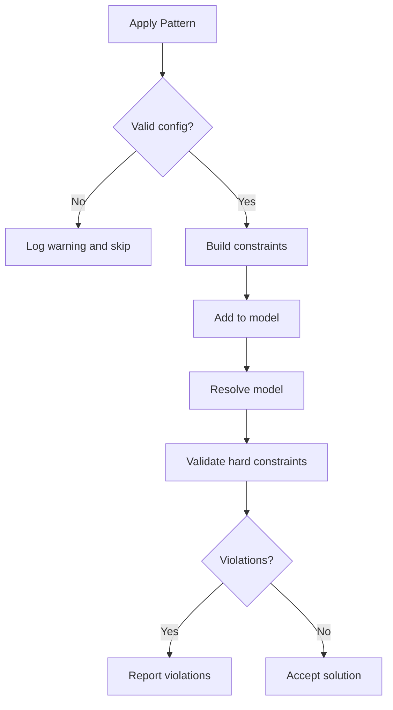

**Diagram sources**
- [patrones.py:60-99](file://turnos/patrones.py#L60-L99)
- [patrones.py:101-151](file://turnos/patrones.py#L101-L151)
- [patrones.py:200-241](file://turnos/patrones.py#L200-L241)
- [validador.py:20-33](file://turnos/validador.py#L20-L33)

**Section sources**
- [patrones.py:60-99](file://turnos/patrones.py#L60-L99)
- [patrones.py:101-151](file://turnos/patrones.py#L101-L151)
- [patrones.py:200-241](file://turnos/patrones.py#L200-L241)
- [validador.py:20-33](file://turnos/validador.py#L20-L33)

### Relationship Between Pattern Types and Shift Assignments
- Sequence patterns enforce specific orderings of shift types across adjacent days.
- Max-consecutive patterns limit repeated occurrences of a given shift type within sliding windows.
- Distribution patterns balance totals across nurses for a given shift type.
- Rotation patterns ensure that each nurse receives a balanced exposure to a set of shift types over defined windows.

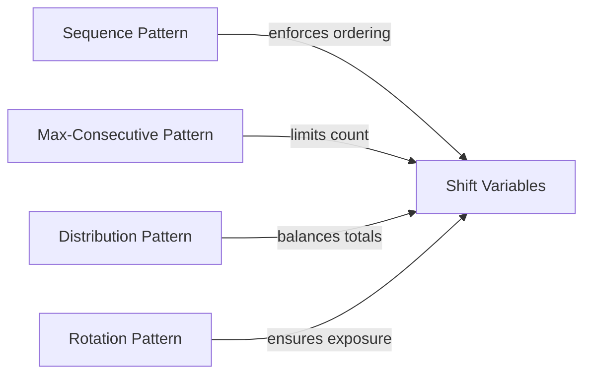

**Diagram sources**
- [patrones.py:101-151](file://turnos/patrones.py#L101-L151)
- [patrones.py:243-275](file://turnos/patrones.py#L243-L275)
- [patrones.py:153-198](file://turnos/patrones.py#L153-L198)
- [patrones.py:200-241](file://turnos/patrones.py#L200-L241)

**Section sources**
- [patrones.py:101-151](file://turnos/patrones.py#L101-L151)
- [patrones.py:243-275](file://turnos/patrones.py#L243-L275)
- [patrones.py:153-198](file://turnos/patrones.py#L153-L198)
- [patrones.py:200-241](file://turnos/patrones.py#L200-L241)

### How Patterns Are Generated From Demand Requirements
- Coverage constraints ensure minimum and maximum staffing per shift per day.
- Soft objectives prefer meeting optimal demand targets.
- Patterns complement hard constraints by shaping shift distributions and enforcing cyclic behavior.

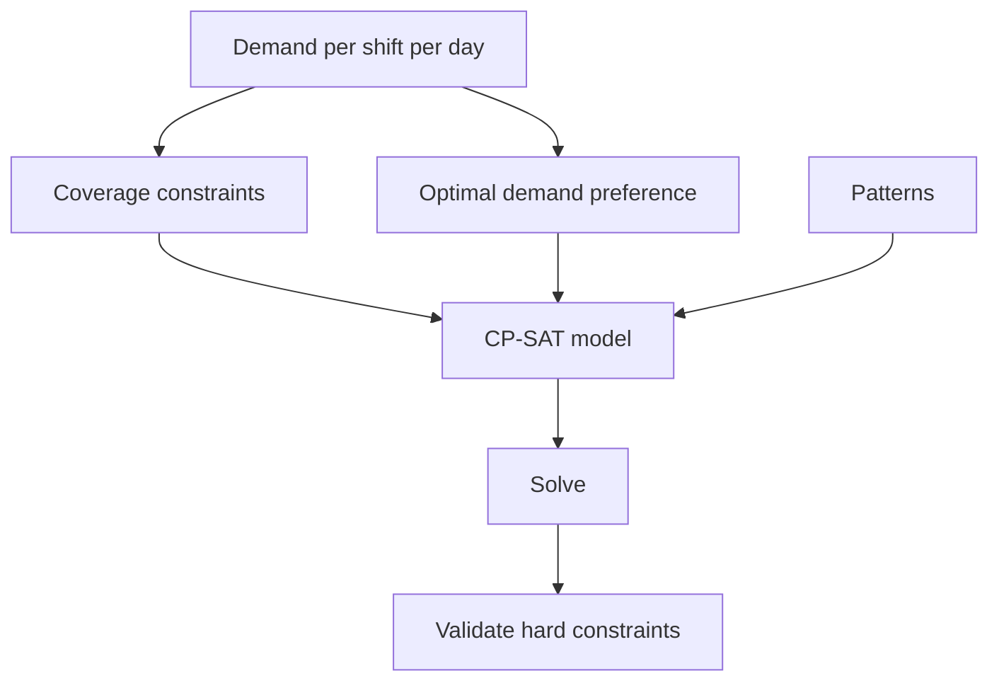

**Diagram sources**
- [restricciones_duras.py:87-112](file://turnos/restricciones_duras.py#L87-L112)
- [restricciones_blandas.py:96-118](file://turnos/restricciones_blandas.py#L96-L118)
- [patrones.py:23-58](file://turnos/patrones.py#L23-L58)

**Section sources**
- [restricciones_duras.py:87-112](file://turnos/restricciones_duras.py#L87-L112)
- [restricciones_blandas.py:96-118](file://turnos/restricciones_blandas.py#L96-L118)
- [patrones.py:23-58](file://turnos/patrones.py#L23-L58)

### Pattern-to-Shift Mapping Algorithms
- Index mapping: Shift names are mapped to integer indices for efficient constraint building.
- Acronym support: New-style short codes are supported alongside legacy names.
- Off-day enforcement: For each nurse and day, exactly one of shift or off-day must be selected.

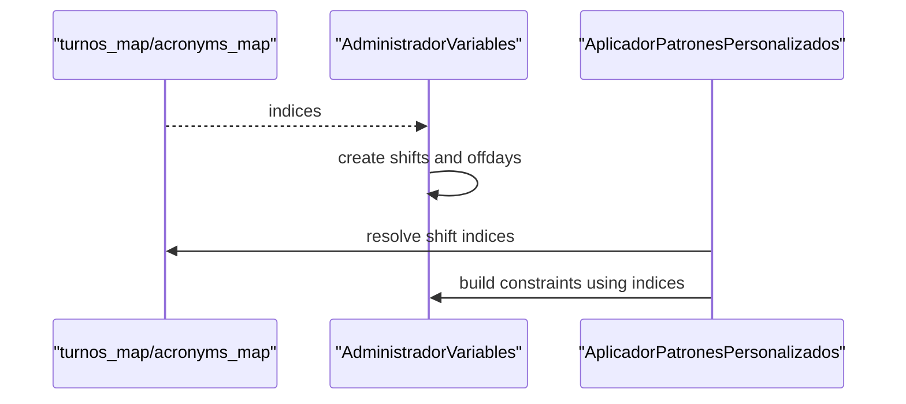

**Diagram sources**
- [generador_refactorizado.py:29-31](file://turnos/generador_refactorizado.py#L29-L31)
- [variables.py:27-48](file://turnos/variables.py#L27-L48)
- [patrones.py:109-119](file://turnos/patrones.py#L109-L119)

**Section sources**
- [generador_refactorizado.py:29-31](file://turnos/generador_refactorizado.py#L29-L31)
- [variables.py:27-48](file://turnos/variables.py#L27-L48)
- [patrones.py:109-119](file://turnos/patrones.py#L109-L119)

### Integration With the Constraint Satisfaction Solver
- Hard constraints are enforced as logical implications and cardinality constraints.
- Soft constraints and pattern penalties contribute to the objective function.
- The solver minimizes the total penalty subject to hard constraints.

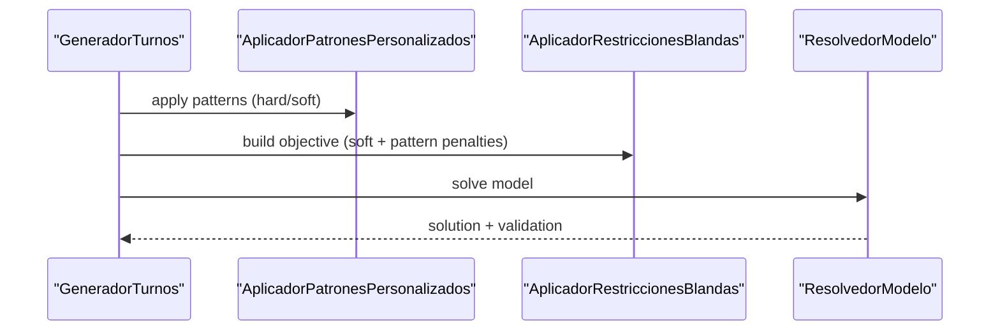

**Diagram sources**
- [generador_refactorizado.py:105-135](file://turnos/generador_refactorizado.py#L105-L135)
- [patrones.py:23-58](file://turnos/patrones.py#L23-L58)
- [restricciones_blandas.py:36-46](file://turnos/restricciones_blandas.py#L36-L46)
- [resolvedor.py:21-50](file://turnos/resolvedor.py#L21-L50)

**Section sources**
- [generador_refactorizado.py:105-135](file://turnos/generador_refactorizado.py#L105-L135)
- [patrones.py:23-58](file://turnos/patrones.py#L23-L58)
- [restricciones_blandas.py:36-46](file://turnos/restricciones_blandas.py#L36-L46)
- [resolvedor.py:21-50](file://turnos/resolvedor.py#L21-L50)

### Conflict Detection During Pattern Generation
- Coverage conflicts: When the base rotation plus adjustments fail to meet demand, the pipeline detects conflicts and triggers repair.
- Consecutive shift limits: Patterns and hard constraints jointly prevent excessive consecutive work.
- Weekly rest and 12-hour rest: Enforced via pairwise constraints across adjacent days.

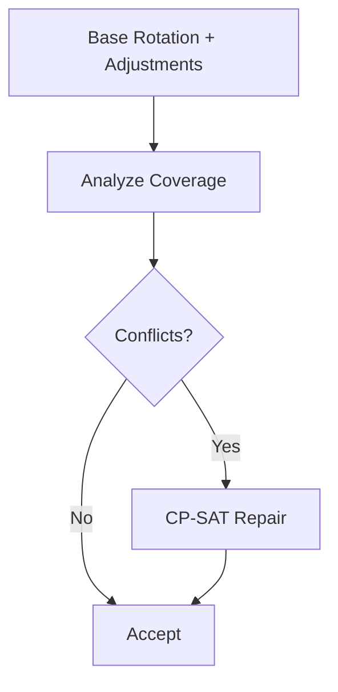

**Diagram sources**
- [pipeline.py:137-200](file://turnos/motor/pipeline.py#L137-L200)
- [restricciones_duras.py:45-85](file://turnos/restricciones_duras.py#L45-L85)

**Section sources**
- [pipeline.py:137-200](file://turnos/motor/pipeline.py#L137-L200)
- [restricciones_duras.py:45-85](file://turnos/restricciones_duras.py#L45-L85)

### Optimization Criteria Used for Pattern Selection
- Weighted penalties: Soft constraints and pattern violations are multiplied by weights to form the objective.
- Preference for optimal demand: Deviations from target demand are penalized.
- Equity objectives: Minimize variance in total shifts and special categories (e.g., nights, weekends, holidays).

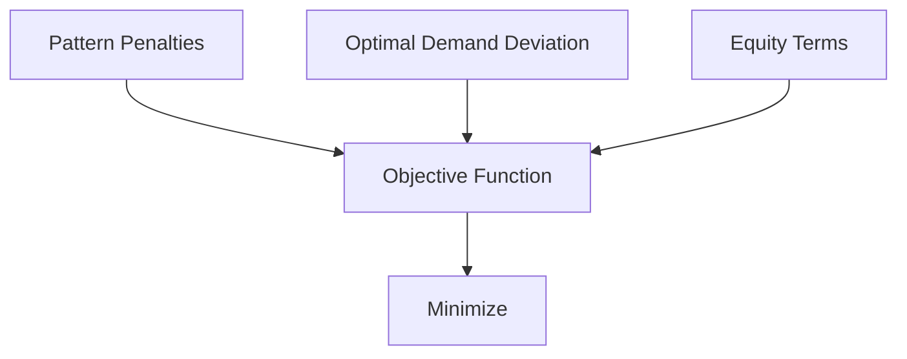

**Diagram sources**
- [restricciones_blandas.py:120-137](file://turnos/restricciones_blandas.py#L120-L137)
- [restricciones_blandas.py:96-118](file://turnos/restricciones_blandas.py#L96-L118)
- [restricciones_blandas.py:48-75](file://turnos/restricciones_blandas.py#L48-L75)

**Section sources**
- [restricciones_blandas.py:120-137](file://turnos/restricciones_blandas.py#L120-L137)
- [restricciones_blandas.py:96-118](file://turnos/restricciones_blandas.py#L96-L118)
- [restricciones_blandas.py:48-75](file://turnos/restricciones_blandas.py#L48-L75)

## Dependency Analysis
The pattern generation subsystem exhibits clear layering:
- GeneradorTurnos depends on variable creation and constraint applicators.
- Pattern application relies on shift type indices and off-day variables.
- The solver consumes the constructed model and produces a validated solution.

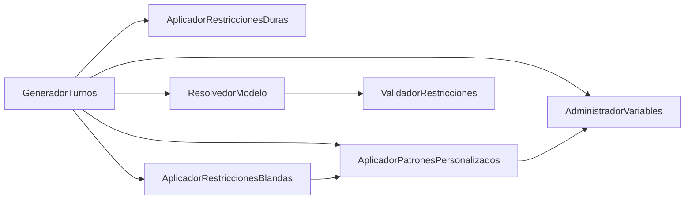

**Diagram sources**
- [generador_refactorizado.py:105-135](file://turnos/generador_refactorizado.py#L105-L135)
- [variables.py:21-48](file://turnos/variables.py#L21-L48)
- [restricciones_duras.py:37-44](file://turnos/restricciones_duras.py#L37-L44)
- [patrones.py:23-58](file://turnos/patrones.py#L23-L58)
- [restricciones_blandas.py:36-46](file://turnos/restricciones_blandas.py#L36-L46)
- [resolvedor.py:21-50](file://turnos/resolvedor.py#L21-L50)
- [validador.py:20-33](file://turnos/validador.py#L20-L33)

**Section sources**
- [generador_refactorizado.py:105-135](file://turnos/generador_refactorizado.py#L105-L135)
- [variables.py:21-48](file://turnos/variables.py#L21-L48)
- [restricciones_duras.py:37-44](file://turnos/restricciones_duras.py#L37-L44)
- [patrones.py:23-58](file://turnos/patrones.py#L23-L58)
- [restricciones_blandas.py:36-46](file://turnos/restricciones_blandas.py#L36-L46)
- [resolvedor.py:21-50](file://turnos/resolvedor.py#L21-L50)
- [validador.py:20-33](file://turnos/validador.py#L20-L33)

## Performance Considerations
- Variable count: Shift variables scale as nurses × days × shift types; off-day variables scale linearly with nurses × days. Large horizons increase model size.
- Pattern complexity: Sequence and rotation patterns introduce pairwise and sliding-window constraints, increasing constraint counts.
- Solver parameters: Seed and time limits influence reproducibility and runtime. Larger problems may require more workers and extended timeouts.
- Preprocessing: Base rotation reduces search space by fixing predictable assignments, improving solver performance.

[No sources needed since this section provides general guidance]

## Troubleshooting Guide
Common issues and remedies:
- Missing shift types: Ensure shift names or acronyms match configured turn types; otherwise, patterns are skipped with warnings.
- Excessive consecutive shifts: Verify max-consecutive limits and adjust patterns accordingly.
- Coverage failures: Review demand targets and hard constraints; consider relaxing bounds or adding more nurses.
- Reproducibility: Set a fixed seed to obtain repeatable results across runs.

**Section sources**
- [patrones.py:60-99](file://turnos/patrones.py#L60-L99)
- [patrones.py:101-151](file://turnos/patrones.py#L101-L151)
- [restricciones_duras.py:140-155](file://turnos/restricciones_duras.py#L140-L155)
- [resolvedor.py:25-32](file://turnos/resolvedor.py#L25-L32)

## Conclusion
The pattern generation subsystem combines deterministic cyclic rotations with flexible pattern constraints to produce feasible and equitable schedules. By leveraging CP-SAT with carefully designed hard and soft constraints, the system ensures compliance with rest periods, coverage targets, and organizational preferences while maintaining scalability and reproducibility.

[No sources needed since this section summarizes without analyzing specific files]

## Appendices

### Practical Examples of Pattern Creation Workflows
- Sequence pattern: Define a required order of shifts (e.g., morning → afternoon → night) and apply as a hard constraint so that violating transitions are prevented.
- Rest-after-shift pattern: Enforce mandatory rest days after a specified number of consecutive shifts of a given type.
- Max-consecutive pattern: Limit repeated shifts of a type within sliding windows to avoid fatigue.
- Distribution pattern: Balance the total count of a shift type across all nurses within tolerance bounds.
- Rotation pattern: Ensure each nurse works a balanced mix of shifts over defined windows.

**Section sources**
- [patrones.py:101-151](file://turnos/patrones.py#L101-L151)
- [patrones.py:60-99](file://turnos/patrones.py#L60-L99)
- [patrones.py:243-275](file://turnos/patrones.py#L243-L275)
- [patrones.py:153-198](file://turnos/patrones.py#L153-L198)
- [patrones.py:200-241](file://turnos/patrones.py#L200-L241)

### Canonical Vocabulary and Normalization
- Canonical identifiers standardize pattern and constraint names across the system.
- Legacy names are normalized to canonical forms for consistent processing.

**Section sources**
- [vocabulario.py:37-45](file://turnos/dominio/vocabulario.py#L37-L45)
- [normalizacion.py:48-58](file://turnos/dominio/normalizacion.py#L48-L58)