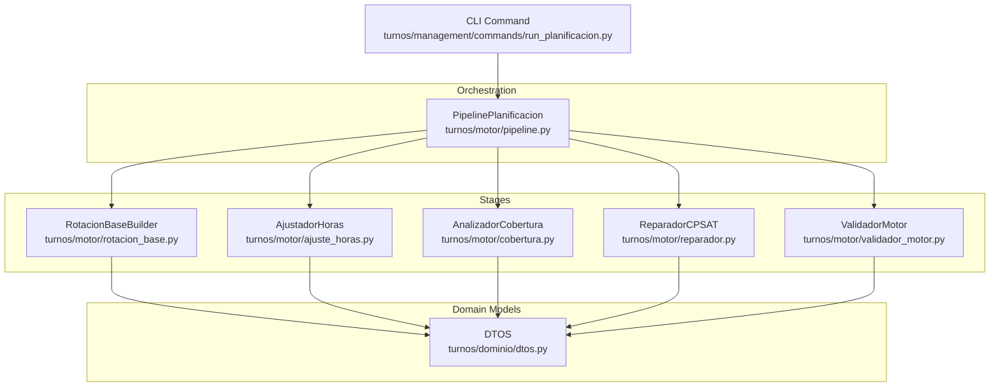
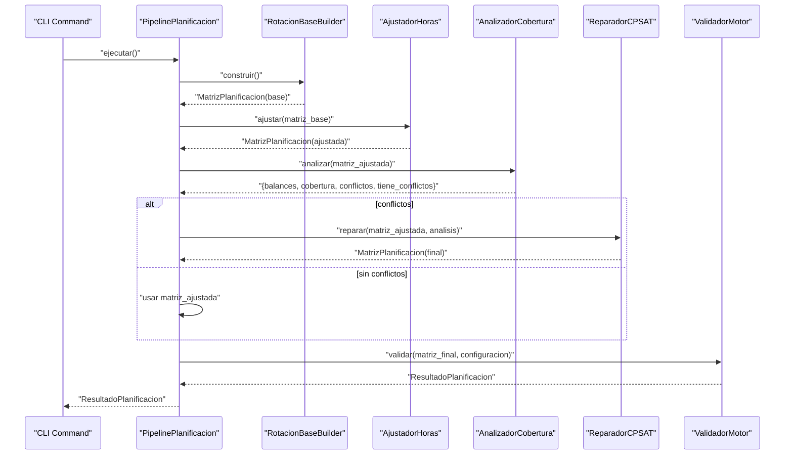
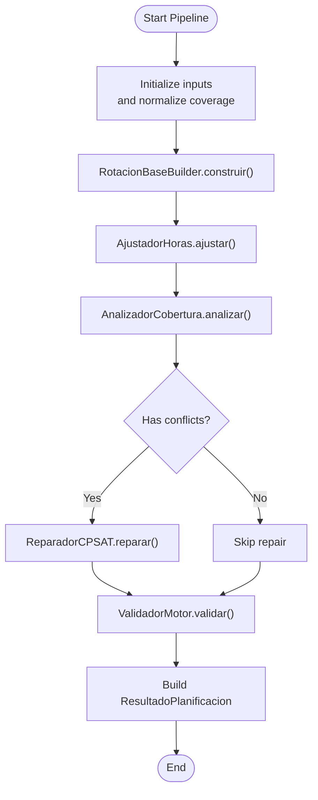
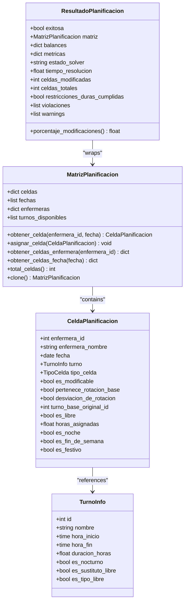
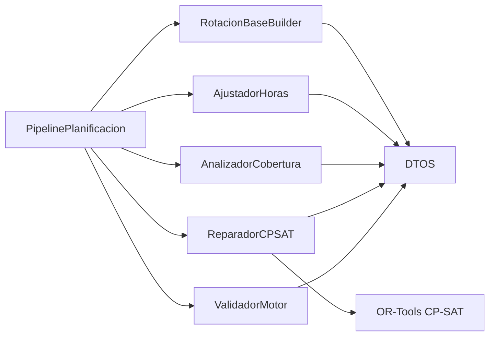

# Pipeline Orchestration

<cite>
**Referenced Files in This Document**
- [pipeline.py](file://turnos/motor/pipeline.py)
- [rotacion_base.py](file://turnos/motor/rotacion_base.py)
- [ajuste_horas.py](file://turnos/motor/ajuste_horas.py)
- [cobertura.py](file://turnos/motor/cobertura.py)
- [reparador.py](file://turnos/motor/reparador.py)
- [validador_motor.py](file://turnos/motor/validador_motor.py)
- [dtos.py](file://turnos/dominio/dtos.py)
- [run_planificacion.py](file://turnos/management/commands/run_planificacion.py)
- [test_pipeline.py](file://turnos/tests/test_motor/test_pipeline.py)
</cite>

## Table of Contents
1. [Introduction](#introduction)
2. [Project Structure](#project-structure)
3. [Core Components](#core-components)
4. [Architecture Overview](#architecture-overview)
5. [Detailed Component Analysis](#detailed-component-analysis)
6. [Dependency Analysis](#dependency-analysis)
7. [Performance Considerations](#performance-considerations)
8. [Troubleshooting Guide](#troubleshooting-guide)
9. [Conclusion](#conclusion)
10. [Appendices](#appendices)

## Introduction
This document describes the pipeline orchestration subsystem responsible for end-to-end scheduling of nursing staff. It covers the sequential stages from configuration input to final solution generation, including coordination among pattern application, constraint enforcement, and solver integration. The pipeline is deterministic for base rotation, then applies fine-tuning repairs guided by hard and soft constraints, and finally validates the result. Practical execution flows, configuration options, monitoring, performance, memory, and scalability are explained to support both small and large workloads.

## Project Structure
The orchestration lives under the motor package and coordinates domain DTOs and utilities:
- Pipeline orchestrator: turnos/motor/pipeline.py
- Stages: rotation base, hours adjustment, coverage analysis, repair with CP-SAT, validation
- Domain models: turnos/dominio/dtos.py
- CLI command to trigger planning: turnos/management/commands/run_planificacion.py
- Tests validating pipeline behavior: turnos/tests/test_motor/test_pipeline.py

**Diagram sources**
- [pipeline.py:92-234](file://turnos/motor/pipeline.py#L92-L234)
- [rotacion_base.py:41-93](file://turnos/motor/rotacion_base.py#L41-L93)
- [ajuste_horas.py:46-88](file://turnos/motor/ajuste_horas.py#L46-L88)
- [cobertura.py:46-73](file://turnos/motor/cobertura.py#L46-L73)
- [reparador.py:63-95](file://turnos/motor/reparador.py#L63-L95)
- [validador_motor.py:48-86](file://turnos/motor/validador_motor.py#L48-L86)
- [dtos.py:197-237](file://turnos/dominio/dtos.py#L197-L237)
- [run_planificacion.py:13-39](file://turnos/management/commands/run_planificacion.py#L13-L39)

**Section sources**
- [pipeline.py:92-234](file://turnos/motor/pipeline.py#L92-L234)
- [dtos.py:197-237](file://turnos/dominio/dtos.py#L197-L237)
- [run_planificacion.py:13-39](file://turnos/management/commands/run_planificacion.py#L13-L39)

## Core Components
- PipelinePlanificacion: Orchestrates five sequential stages, manages solver configuration, and aggregates results.
- RotacionBaseBuilder: Builds a deterministic base schedule from configured cycles.
- AjustadorHoras: Adjusts base schedule to match contractual hours targets within tolerance.
- AnalizadorCobertura: Computes balances, coverage, and detects conflicts and violations.
- ReparadorCPSAT: Repair conflicts with CP-SAT while preserving proximity to base rotation.
- ValidadorMotor: Final validation of hard constraints, quality metrics, and persistence of balances.

Key configuration inputs:
- Dates, nurses, rotation assignments, offsets, optional incidents, target hours per nurse, minimum coverage per shift, solver tuning, turn types metadata, hard and soft constraints, historical balances.

Outputs:
- ResultadoPlanificacion with success flag, matrix, balances, solver status, timing, and validation artifacts.

**Section sources**
- [pipeline.py:47-73](file://turnos/motor/pipeline.py#L47-L73)
- [pipeline.py:92-234](file://turnos/motor/pipeline.py#L92-L234)
- [rotacion_base.py:29-40](file://turnos/motor/rotacion_base.py#L29-L40)
- [ajuste_horas.py:32-44](file://turnos/motor/ajuste_horas.py#L32-L44)
- [cobertura.py:30-44](file://turnos/motor/cobertura.py#L30-L44)
- [reparador.py:37-58](file://turnos/motor/reparador.py#L37-L58)
- [validador_motor.py:34-44](file://turnos/motor/validador_motor.py#L34-L44)

## Architecture Overview
The pipeline executes in strict order, passing a MatrizPlanificacion between stages. Hard constraints are enforced by the coverage analyzer and the CP-SAT repairer. Soft objectives guide the solver to minimize deviations from the base rotation and balance loads.

**Diagram sources**
- [pipeline.py:107-234](file://turnos/motor/pipeline.py#L107-L234)
- [rotacion_base.py:41-93](file://turnos/motor/rotacion_base.py#L41-L93)
- [ajuste_horas.py:46-88](file://turnos/motor/ajuste_horas.py#L46-L88)
- [cobertura.py:46-73](file://turnos/motor/cobertura.py#L46-L73)
- [reparador.py:63-95](file://turnos/motor/reparador.py#L63-L95)
- [validador_motor.py:48-86](file://turnos/motor/validador_motor.py#L48-L86)

## Detailed Component Analysis

### PipelinePlanificacion
- Responsibilities:
  - Initialize stage inputs from configuration.
  - Execute five stages in order.
  - Extract solver status and build ResultadoPlanificacion.
  - Normalize coverage thresholds.
  - Derive validator configuration from hard constraints.
- Stage transitions:
  - Base rotation → Hours adjustment → Coverage analysis → Optional repair → Final validation.
- Error handling:
  - Catches exceptions and returns a failed ResultadoPlanificacion with error details.

**Diagram sources**
- [pipeline.py:92-234](file://turnos/motor/pipeline.py#L92-L234)

**Section sources**
- [pipeline.py:47-73](file://turnos/motor/pipeline.py#L47-L73)
- [pipeline.py:78-90](file://turnos/motor/pipeline.py#L78-L90)
- [pipeline.py:247-266](file://turnos/motor/pipeline.py#L247-L266)

### RotacionBaseBuilder
- Role: Deterministic base schedule from rotation cycles and offsets.
- Behavior: For each nurse-day, compute cycle position with offset and assign TurnoInfo or mark as LIBRE if None or substitute-free.
- Outputs: MatrizPlanificacion with all cells assigned and marked as belonging to base rotation.

**Section sources**
- [rotacion_base.py:29-40](file://turnos/motor/rotacion_base.py#L29-L40)
- [rotacion_base.py:41-93](file://turnos/motor/rotacion_base.py#L41-L93)

### AjustadorHoras
- Role: Aligns total hours per nurse toward target within tolerance.
- Strategy:
  - For excess: convert turnos to LIBRE near free neighbors to minimize disruption.
  - For deficit: convert LIBRE to most frequent turno type near existing work neighbors.
- Limits: capped number of modifications per nurse.

**Section sources**
- [ajuste_horas.py:32-44](file://turnos/motor/ajuste_horas.py#L32-L44)
- [ajuste_horas.py:46-88](file://turnos/motor/ajuste_horas.py#L46-L88)
- [ajuste_horas.py:98-150](file://turnos/motor/ajuste_horas.py#L98-L150)
- [ajuste_horas.py:152-213](file://turnos/motor/ajuste_horas.py#L152-L213)

### AnalizadorCobertura
- Role: Detects conflicts and computes balances.
- Metrics:
  - Hours, turns, nights, weekend days per nurse.
  - Coverage per shift per day.
  - Violations: consecutive shifts, consecutive nights, and minimum coverage.
- Inputs: historical balances and configurable maxima.

**Section sources**
- [cobertura.py:30-44](file://turnos/motor/cobertura.py#L30-L44)
- [cobertura.py:46-73](file://turnos/motor/cobertura.py#L46-L73)
- [cobertura.py:75-124](file://turnos/motor/cobertura.py#L75-L124)
- [cobertura.py:126-137](file://turnos/motor/cobertura.py#L126-L137)
- [cobertura.py:139-161](file://turnos/motor/cobertura.py#L139-L161)
- [cobertura.py:163-184](file://turnos/motor/cobertura.py#L163-L184)
- [cobertura.py:186-207](file://turnos/motor/cobertura.py#L186-L207)

### ReparadorCPSAT
- Role: Repair conflicts with CP-SAT while preserving proximity to base rotation.
- Hard constraints applied:
  - One shift per day per nurse.
  - Maximum consecutive shifts.
  - Minimum 12-hour break between shifts respecting TurnoInfo durations.
  - Minimum coverage per shift per day.
  - Maximum consecutive nights.
- Objective: weighted-sum minimizing deviation from base rotation, plus balances and equity.
- Solver parameters: fixed timeout and worker count; stores solver status.

**Section sources**
- [reparador.py:37-58](file://turnos/motor/reparador.py#L37-L58)
- [reparador.py:63-95](file://turnos/motor/reparador.py#L63-L95)
- [reparador.py:133-150](file://turnos/motor/reparador.py#L133-L150)
- [reparador.py:151-192](file://turnos/motor/reparador.py#L151-L192)
- [reparador.py:193-238](file://turnos/motor/reparador.py#L193-L238)
- [reparador.py:239-256](file://turnos/motor/reparador.py#L239-L256)
- [reparador.py:258-295](file://turnos/motor/reparador.py#L258-L295)
- [reparador.py:297-334](file://turnos/motor/reparador.py#L297-L334)
- [reparador.py:336-374](file://turnos/motor/reparador.py#L336-L374)
- [reparador.py:376-446](file://turnos/motor/reparador.py#L376-L446)
- [reparador.py:448-508](file://turnos/motor/reparador.py#L448-L508)
- [reparador.py:510-577](file://turnos/motor/reparador.py#L510-L577)
- [reparador.py:581-608](file://turnos/motor/reparador.py#L581-L608)

### ValidadorMotor
- Role: Final validation after repair.
- Checks:
  - Hard constraints: one shift/day, max consecutive shifts/nights, minimum 12-hour break, minimum coverage.
  - Quality: imbalance warnings for hours, nights, weekends.
  - Data integrity: cell types and mandatory fields.
- Persists final balances including historical accumulations.

**Section sources**
- [validador_motor.py:34-44](file://turnos/motor/validador_motor.py#L34-L44)
- [validador_motor.py:48-86](file://turnos/motor/validador_motor.py#L48-L86)
- [validador_motor.py:88-104](file://turnos/motor/validador_motor.py#L88-L104)
- [validador_motor.py:118-140](file://turnos/motor/validador_motor.py#L118-L140)
- [validador_motor.py:141-162](file://turnos/motor/validador_motor.py#L141-L162)
- [validador_motor.py:164-202](file://turnos/motor/validador_motor.py#L164-L202)
- [validador_motor.py:207-277](file://turnos/motor/validador_motor.py#L207-L277)
- [validador_motor.py:279-310](file://turnos/motor/validador_motor.py#L279-L310)
- [validador_motor.py:312-364](file://turnos/motor/validador_motor.py#L312-L364)
- [validador_motor.py:366-387](file://turnos/motor/validador_motor.py#L366-L387)
- [validador_motor.py:389-438](file://turnos/motor/validador_motor.py#L389-L438)

### Data Models and DTOs
- MatrizPlanificacion: central data structure holding per-nurse-per-day cells.
- CeldaPlanificacion: per-cell metadata including type, modifiability, base rotation snapshot, and helpers.
- TurnoInfo: shift metadata including duration and night flag.
- ResultadoPlanificacion: unified output container for success, matrix, balances, solver stats, and validation artifacts.

**Diagram sources**
- [dtos.py:197-237](file://turnos/dominio/dtos.py#L197-L237)
- [dtos.py:61-131](file://turnos/dominio/dtos.py#L61-L131)
- [dtos.py:44-57](file://turnos/dominio/dtos.py#L44-L57)
- [dtos.py:251-274](file://turnos/dominio/dtos.py#L251-L274)

**Section sources**
- [dtos.py:197-237](file://turnos/dominio/dtos.py#L197-L237)
- [dtos.py:61-131](file://turnos/dominio/dtos.py#L61-L131)
- [dtos.py:251-274](file://turnos/dominio/dtos.py#L251-L274)

### Execution Flows and Monitoring
- CLI entry point: run_planificacion command reads a configuration ID, instantiates the generator, and prints outcomes and violations.
- Pipeline execution: logs stage boundaries and counts modified cells; returns structured result with solver status and validation artifacts.

**Section sources**
- [run_planificacion.py:13-39](file://turnos/management/commands/run_planificacion.py#L13-L39)
- [pipeline.py:107-234](file://turnos/motor/pipeline.py#L107-L234)

### Testing Guidance
- Integration tests demonstrate reproducibility, absence of automatic incidence application in the pipeline, and balanced coverage computation.

**Section sources**
- [test_pipeline.py:271-362](file://turnos/tests/test_motor/test_pipeline.py#L271-L362)

## Dependency Analysis
- Internal dependencies:
  - Pipeline depends on RotacionBaseBuilder, AjustadorHoras, AnalizadorCobertura, ReparadorCPSAT, and ValidadorMotor.
  - All stages operate on MatrizPlanificacion and TurnoInfo from DTOs.
- External dependencies:
  - OR-Tools CP-SAT for the repair stage.
  - Logging for monitoring and diagnostics.

**Diagram sources**
- [pipeline.py:22-26](file://turnos/motor/pipeline.py#L22-L26)
- [rotacion_base.py:10-16](file://turnos/motor/rotacion_base.py#L10-L16)
- [ajuste_horas.py:11-16](file://turnos/motor/ajuste_horas.py#L11-L16)
- [cobertura.py:11-16](file://turnos/motor/cobertura.py#L11-L16)
- [reparador.py](file://turnos/motor/reparador.py#L9)
- [validador_motor.py:11-18](file://turnos/motor/validador_motor.py#L11-L18)

**Section sources**
- [pipeline.py:22-26](file://turnos/motor/pipeline.py#L22-L26)

## Performance Considerations
- Deterministic base rotation avoids solver overhead for predictable patterns.
- Repair only runs when coverage conflicts are detected, reducing unnecessary optimization.
- Solver parameters (workers, timeout) are set to balance speed and feasibility.
- Memory footprint:
  - MatrizPlanificacion holds dense per-nurse-per-day cells; consider sparse representations for very large workspaces.
  - CP-SAT variable creation scales with nurses × days × shifts; tune model complexity (restricting shifts per day or limiting penalties) when needed.
- Scalability:
  - Horizontal scaling via batch processing multiple configurations.
  - Vertical scaling by adjusting solver workers and timeouts.
  - Precompute and cache frequently used metadata (e.g., turn durations, historical balances).

## Troubleshooting Guide
Common issues and remedies:
- No feasible solution:
  - Review hard constraints (coverage minimums, consecutive limits, 12-hour break).
  - Reduce minimum coverage or increase available nurses.
  - Verify turn durations and shift continuity.
- Excessive modifications:
  - Tight hours targets or insufficient nurses cause solver to change many cells.
  - Relax tolerance or adjust historical balances to favor equity.
- Validation warnings:
  - High hour deviation or night/findes imbalances indicate soft objective mismatches.
  - Adjust soft weights or add targeted penalties.
- Logging:
  - Pipeline logs stage counts and solver status; inspect logs around repair stage for solver outcomes.

**Section sources**
- [pipeline.py:236-245](file://turnos/motor/pipeline.py#L236-L245)
- [reparador.py:75-89](file://turnos/motor/reparador.py#L75-L89)
- [validador_motor.py:79-84](file://turnos/motor/validador_motor.py#L79-L84)

## Conclusion
The pipeline orchestrates a robust, staged approach to scheduling: deterministic base rotation, targeted hours adjustment, conflict detection, optional CP-SAT repair, and final validation. Its modular design, explicit DTOs, and logging enable monitoring, debugging, and optimization across diverse workloads. For large-scale deployments, focus on solver configuration, data structure efficiency, and careful constraint tuning.

## Appendices

### Stage Configuration Options
- Coverage normalization: supports integer or dict minimums; pipeline normalizes to integers.
- Hard constraints extraction: maximum consecutive shifts and nights are derived from hard constraints.
- Repair objective weights: prioritize base rotation proximity, then hourly balance, nights, and weekends.

**Section sources**
- [pipeline.py:78-90](file://turnos/motor/pipeline.py#L78-L90)
- [pipeline.py:247-266](file://turnos/motor/pipeline.py#L247-L266)
- [reparador.py:315-334](file://turnos/motor/reparador.py#L315-L334)