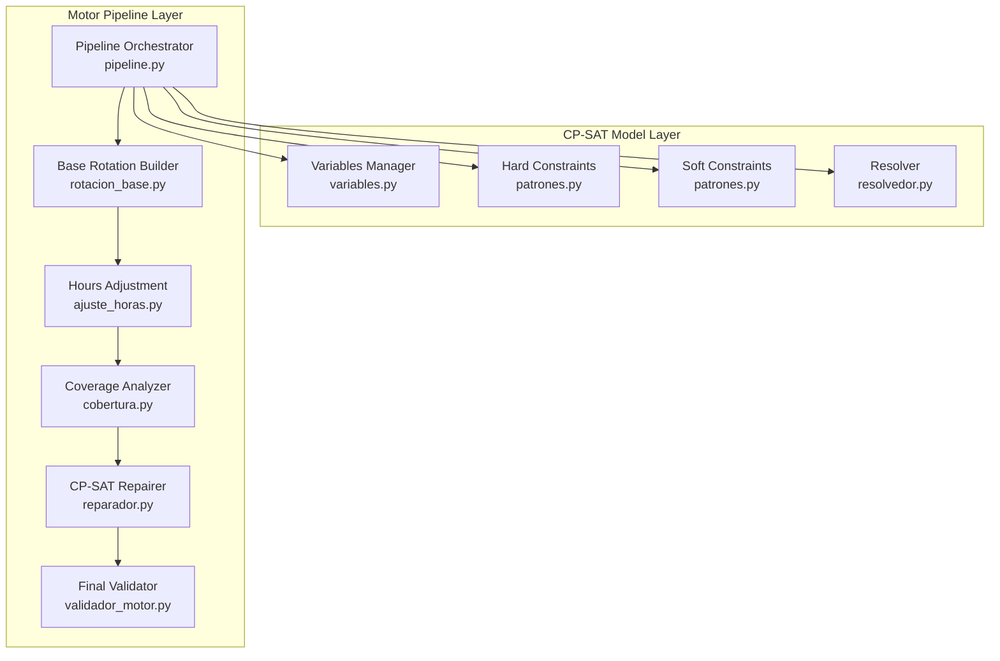
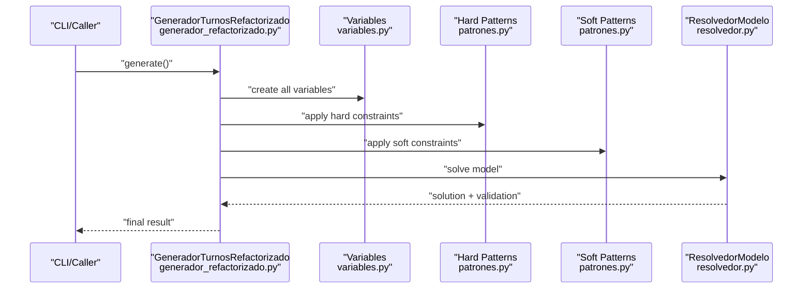
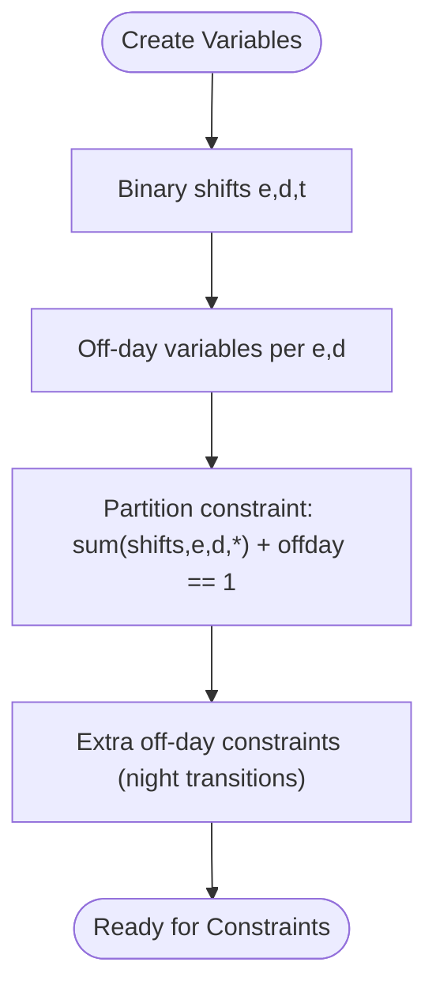
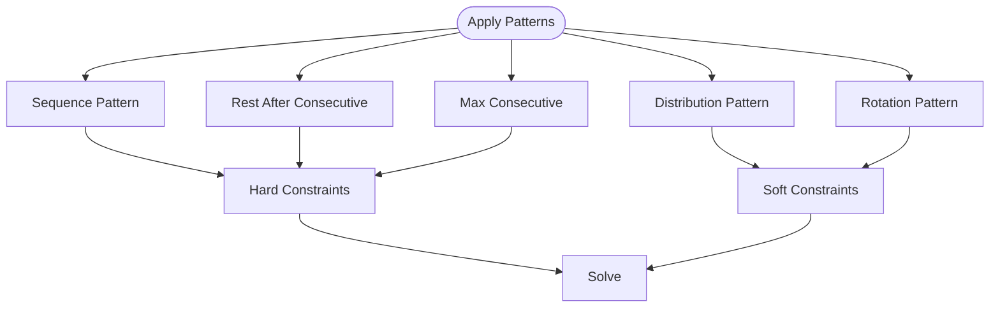
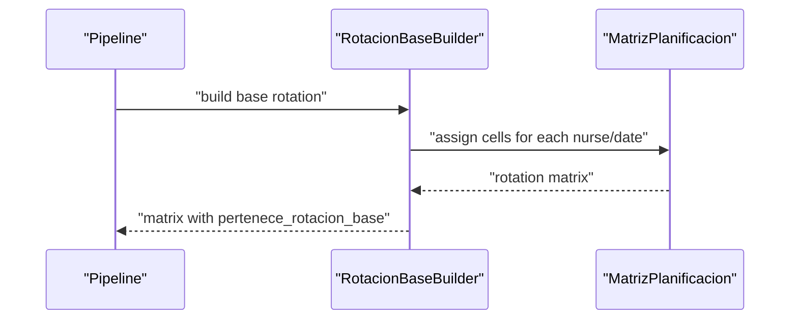
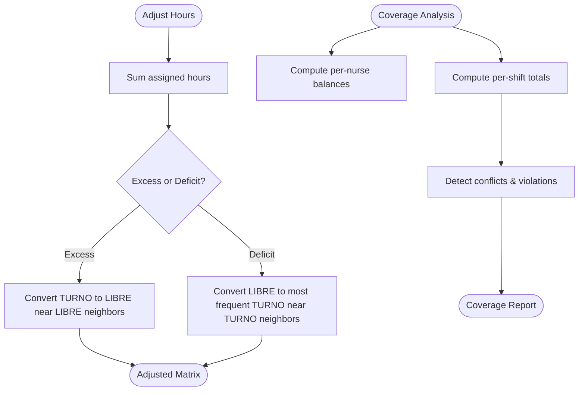
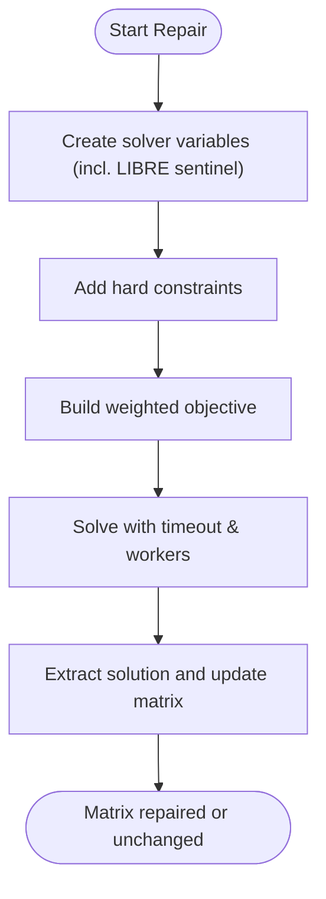
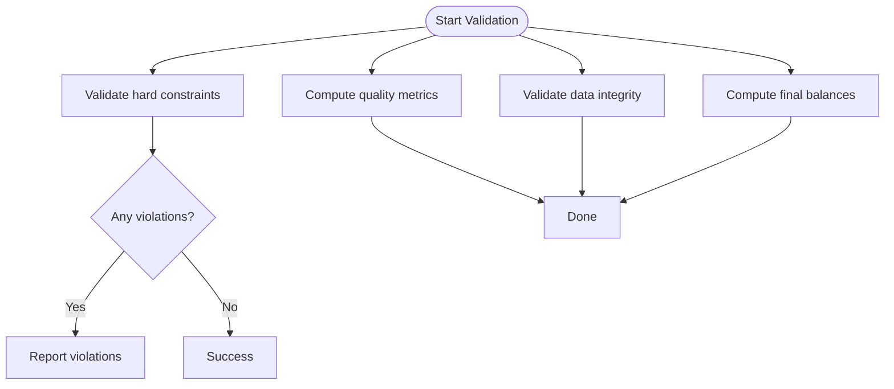
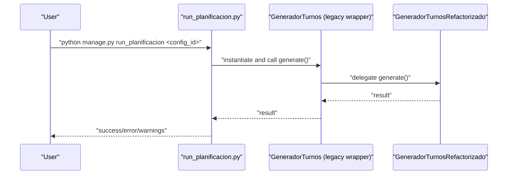
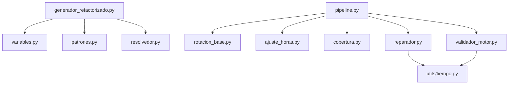

# Shift Generation Engine

<cite>
**Referenced Files in This Document**
- [generador.py](file://turnos/generador.py)
- [generador_refactorizado.py](file://turnos/generador_refactorizado.py)
- [variables.py](file://turnos/variables.py)
- [patrones.py](file://turnos/patrones.py)
- [generador_patrones.py](file://turnos/generador_patrones.py)
- [resolvedor.py](file://turnos/resolvedor.py)
- [pipeline.py](file://turnos/motor/pipeline.py)
- [rotacion_base.py](file://turnos/motor/rotacion_base.py)
- [ajuste_horas.py](file://turnos/motor/ajuste_horas.py)
- [cobertura.py](file://turnos/motor/cobertura.py)
- [reparador.py](file://turnos/motor/reparador.py)
- [validador_motor.py](file://turnos/motor/validador_motor.py)
- [dtos.py](file://turnos/dominio/dtos.py)
- [models.py](file://turnos/models.py)
- [tiempo.py](file://turnos/utils/tiempo.py)
- [run_planificacion.py](file://turnos/management/commands/run_planificacion.py)
</cite>

## Table of Contents
1. [Introduction](#introduction)
2. [Project Structure](#project-structure)
3. [Core Components](#core-components)
4. [Architecture Overview](#architecture-overview)
5. [Detailed Component Analysis](#detailed-component-analysis)
6. [Dependency Analysis](#dependency-analysis)
7. [Performance Considerations](#performance-considerations)
8. [Troubleshooting Guide](#troubleshooting-guide)
9. [Conclusion](#conclusion)
10. [Appendices](#appendices)

## Introduction
This document describes the shift generation engine subsystem responsible for creating cyclic rotation patterns, orchestrating the end-to-end pipeline from configuration to solution, and applying pattern-based constraints to shift assignments. It explains the mathematical foundations underpinning the generation process, the role of seed values in randomization, and how the system handles different shift types and durations. Practical examples illustrate pattern creation, rotation cycle implementation, and integration with the constraint satisfaction solver. Finally, it covers performance considerations, memory optimization techniques, and scalability limits for large staff numbers.

## Project Structure
The shift generation engine spans two complementary layers:
- Constraint Programming (CP-SAT) model layer: Variables, hard and soft constraints, and resolution.
- Motor pipeline layer: Deterministic base rotation, coverage analysis, repair with CP-SAT, and validation.

**Diagram sources**
- [pipeline.py:31-267](file://turnos/motor/pipeline.py#L31-L267)
- [rotacion_base.py:21-94](file://turnos/motor/rotacion_base.py#L21-L94)
- [ajuste_horas.py:21-233](file://turnos/motor/ajuste_horas.py#L21-L233)
- [cobertura.py:21-208](file://turnos/motor/cobertura.py#L21-L208)
- [reparador.py:24-609](file://turnos/motor/reparador.py#L24-L609)
- [validador_motor.py:23-451](file://turnos/motor/validador_motor.py#L23-L451)
- [variables.py:8-71](file://turnos/variables.py#L8-L71)
- [patrones.py:8-276](file://turnos/patrones.py#L8-L276)
- [resolvedor.py:11-113](file://turnos/resolvedor.py#L11-L113)

**Section sources**
- [pipeline.py:31-267](file://turnos/motor/pipeline.py#L31-L267)
- [generador_refactorizado.py:17-140](file://turnos/generador_refactorizado.py#L17-L140)

## Core Components
- Variables Manager: Creates binary variables for shifts and off-days, and enforces day partitioning constraints.
- Pattern Application: Applies hard and soft constraints (sequence, rest after consecutive, max consecutive, distribution, rotation).
- CP-SAT Resolver: Solves the model with worker count, timeout, and optional random seed.
- Pipeline Orchestrator: Executes deterministic base rotation, hours adjustment, coverage analysis, optional repair, and final validation.
- Coverage Analyzer: Computes hourly totals, night counts, weekend counts, and detects coverage violations and consecutive-day violations.
- CP-SAT Repairer: Adds hard constraints and weighted objectives to minimize deviations from base rotation while satisfying hard constraints.
- Final Validator: Ensures hard constraints are satisfied, checks continuity, and computes final balances.

**Section sources**
- [variables.py:8-71](file://turnos/variables.py#L8-L71)
- [patrones.py:8-276](file://turnos/patrones.py#L8-L276)
- [resolvedor.py:11-113](file://turnos/resolvedor.py#L11-L113)
- [pipeline.py:31-267](file://turnos/motor/pipeline.py#L31-L267)
- [cobertura.py:21-208](file://turnos/motor/cobertura.py#L21-L208)
- [reparador.py:24-609](file://turnos/motor/reparador.py#L24-L609)
- [validador_motor.py:23-451](file://turnos/motor/validador_motor.py#L23-L451)

## Architecture Overview
The engine follows a hybrid deterministic + constraint programming approach:
- Phase 1 (Deterministic): Build a base rotation matrix from explicit cycles and offsets.
- Phase 2 (Adjustment): Align total hours per nurse to contractual targets with minimal changes.
- Phase 3 (Coverage): Compute coverage and detect conflicts.
- Phase 4 (Repair): If conflicts exist, resolve with CP-SAT while preserving proximity to base rotation.
- Phase 5 (Validation): Verify hard constraints and compute final metrics.

**Diagram sources**
- [generador_refactorizado.py:105-139](file://turnos/generador_refactorizado.py#L105-L139)
- [variables.py:21-71](file://turnos/variables.py#L21-L71)
- [patrones.py:23-276](file://turnos/patrones.py#L23-L276)
- [resolvedor.py:21-113](file://turnos/resolvedor.py#L21-L113)

## Detailed Component Analysis

### Mathematical Foundations and Variables
- Binary variables encode whether a nurse works a given shift on a given day.
- Off-day variables enforce that each day is either a shift or a free day.
- Extra off-day variables capture “rest after a night shift” conditions.
- Day partitioning ensures exactly one of shift or off-day per day per nurse.

**Diagram sources**
- [variables.py:21-71](file://turnos/variables.py#L21-L71)

**Section sources**
- [variables.py:8-71](file://turnos/variables.py#L8-L71)

### Pattern-Based Approach to Shift Assignment
Patterns define hard and soft constraints applied to the CP-SAT model:
- Sequence: Enforce mandatory sequences of shifts across adjacent days.
- Rest after consecutive: After N consecutive shifts of a type, require M free days.
- Max consecutive: Limit maximum consecutive working days of a type.
- Distribution: Encourage equitable distribution of a shift type across nurses.
- Rotation: Encourage balanced rotation of selected shift types over windows.

**Diagram sources**
- [patrones.py:23-276](file://turnos/patrones.py#L23-L276)

**Section sources**
- [patrones.py:8-276](file://turnos/patrones.py#L8-L276)

### Rotation Cycle Implementation
- Base rotation is built deterministically from explicit cycles and per-nurse offsets.
- Each cell is marked as TURNO or LIBRE depending on the assigned shift or absence.
- The builder respects special “substitute-free” shifts.

**Diagram sources**
- [rotacion_base.py:41-94](file://turnos/motor/rotacion_base.py#L41-L94)

**Section sources**
- [rotacion_base.py:21-94](file://turnos/motor/rotacion_base.py#L21-L94)
- [dtos.py:184-194](file://turnos/dominio/dtos.py#L184-L194)

### Hours Adjustment and Coverage Analysis
- Hours adjustment converts excess or deficit by switching between TURNO and LIBRE, prioritizing neighbors of existing free days or existing work days.
- Coverage analysis computes per-nurse totals, per-shift totals, and detects violations of minimum coverage and consecutive-day limits.

**Diagram sources**
- [ajuste_horas.py:46-233](file://turnos/motor/ajuste_horas.py#L46-L233)
- [cobertura.py:46-208](file://turnos/motor/cobertura.py#L46-L208)

**Section sources**
- [ajuste_horas.py:21-233](file://turnos/motor/ajuste_horas.py#L21-L233)
- [cobertura.py:21-208](file://turnos/motor/cobertura.py#L21-L208)

### CP-SAT Repair and Objective Function
- Repair adds hard constraints (consecutive limits, minimum rest between shifts, coverage minimums, maximum nights) and a weighted objective minimizing deviations from base rotation.
- The objective includes penalties for hours balance, night equity, and weekend equity, with higher weight for base rotation proximity.

**Diagram sources**
- [reparador.py:63-609](file://turnos/motor/reparador.py#L63-L609)

**Section sources**
- [reparador.py:24-609](file://turnos/motor/reparador.py#L24-L609)

### Final Validation and Continuity Checks
- Validates hard constraints: one shift per day, consecutive limits, nights limits, minimum rest between shifts, and coverage minimums.
- Checks continuity across periods using injected holiday calendar and computed rest between last shift of previous period and first shift of current period.
- Computes final balances including accumulated historical totals.

**Diagram sources**
- [validador_motor.py:48-451](file://turnos/motor/validador_motor.py#L48-L451)

**Section sources**
- [validador_motor.py:23-451](file://turnos/motor/validador_motor.py#L23-L451)
- [tiempo.py:8-32](file://turnos/utils/tiempo.py#L8-L32)

### Integration with Legacy Wrapper and Management Command
- Legacy wrapper delegates to the refactorized generator for compatibility.
- Management command executes a specific configuration by ID and reports outcomes.

**Diagram sources**
- [run_planificacion.py:7-40](file://turnos/management/commands/run_planificacion.py#L7-L40)
- [generador.py:26-65](file://turnos/generador.py#L26-L65)
- [generador_refactorizado.py:105-139](file://turnos/generador_refactorizado.py#L105-L139)

**Section sources**
- [generador.py:26-65](file://turnos/generador.py#L26-L65)
- [run_planificacion.py:7-40](file://turnos/management/commands/run_planificacion.py#L7-L40)

## Dependency Analysis
- The CP-SAT model depends on variables, patterns, and the resolver.
- The pipeline orchestrates deterministic steps and optionally invokes the CP-SAT repairer.
- Utilities support time calculations for rest between shifts.

**Diagram sources**
- [generador_refactorizado.py:17-140](file://turnos/generador_refactorizado.py#L17-L140)
- [variables.py:8-71](file://turnos/variables.py#L8-L71)
- [patrones.py:8-276](file://turnos/patrones.py#L8-L276)
- [resolvedor.py:11-113](file://turnos/resolvedor.py#L11-L113)
- [pipeline.py:31-267](file://turnos/motor/pipeline.py#L31-L267)
- [rotacion_base.py:21-94](file://turnos/motor/rotacion_base.py#L21-L94)
- [ajuste_horas.py:21-233](file://turnos/motor/ajuste_horas.py#L21-L233)
- [cobertura.py:21-208](file://turnos/motor/cobertura.py#L21-L208)
- [reparador.py:24-609](file://turnos/motor/reparador.py#L24-L609)
- [validador_motor.py:23-451](file://turnos/motor/validador_motor.py#L23-L451)
- [tiempo.py:8-32](file://turnos/utils/tiempo.py#L8-L32)

**Section sources**
- [generador_refactorizado.py:17-140](file://turnos/generador_refactorizado.py#L17-L140)
- [pipeline.py:31-267](file://turnos/motor/pipeline.py#L31-L267)

## Performance Considerations
- Variable count scales with O(E × D × T) for shifts and O(E × D) for off-days, where E is number of nurses, D days, T shift types. Memory usage grows accordingly.
- CP-SAT parameters:
  - Worker count and timeout are configurable; increasing workers improves parallelism but may increase memory.
  - Random seed enables reproducible runs; useful for tuning and regression testing.
- Pattern application complexity:
  - Sequence and rotation patterns iterate over windows of days and shift types; keep window sizes and sequence lengths reasonable.
  - Distribution and rotation patterns add pairwise constraints; limit to necessary pairs to reduce model size.
- Pipeline phases:
  - Deterministic base rotation and hours adjustment are linear in E × D.
  - Coverage analysis and repairs add overhead proportional to model size; use targeted repairs only when conflicts are detected.
- Practical tips:
  - Reduce D or T to test feasibility quickly.
  - Use smaller sequence lengths and rotation windows during development.
  - Monitor solver wall time and adjust parameters for production.

[No sources needed since this section provides general guidance]

## Troubleshooting Guide
Common issues and resolutions:
- No feasible solution found:
  - Review hard constraints and relax temporarily to isolate infeasibility.
  - Check coverage minimums and consecutive limits.
  - Verify shift durations and rest requirements are compatible.
- Excessive solver time:
  - Lower worker count or reduce timeout.
  - Simplify patterns or reduce windows.
- Violations after repair:
  - Confirm that hard constraints were properly encoded.
  - Inspect continuity checks across periods.
- Logging:
  - Enable debug logs to trace constraint application and solver status.

**Section sources**
- [resolvedor.py:21-113](file://turnos/resolvedor.py#L21-L113)
- [reparador.py:63-96](file://turnos/motor/reparador.py#L63-L96)
- [validador_motor.py:88-105](file://turnos/motor/validador_motor.py#L88-L105)

## Conclusion
The shift generation engine combines deterministic base rotation with CP-SAT repair to produce high-quality, feasible schedules respecting hard constraints and optimizing soft objectives. Patterns enable expressive control over sequences, rest periods, and distribution, while the pipeline ensures robustness through coverage analysis and validation. With careful configuration of seeds, timeouts, and pattern complexity, the system scales to large teams and evolving requirements.

[No sources needed since this section summarizes without analyzing specific files]

## Appendices

### Practical Examples

- Pattern creation
  - Sequence: Enforce MAÑANA → TARDE → NOCHE over three consecutive days.
  - Rest after consecutive: After 2 NOCHE, require 3 free days.
  - Max consecutive: Limit to 5 consecutive working days of type MAÑANA.
  - Distribution: Keep differences in NOCHE counts below tolerance.
  - Rotation: Ensure at least one of {MAÑANA, TARDE, NOCHE} per 14-day window.

- Rotation cycle implementation
  - Define a cycle with fixed shift types and offsets per nurse.
  - Mark substitute-free shifts as LIBRE in the base matrix.

- Integration with the constraint satisfaction solver
  - Apply hard constraints first, then soft constraints with weights.
  - Use the LIBRE sentinel to preserve free days during repair.

**Section sources**
- [patrones.py:101-276](file://turnos/patrones.py#L101-L276)
- [rotacion_base.py:41-94](file://turnos/motor/rotacion_base.py#L41-L94)
- [reparador.py:133-334](file://turnos/motor/reparador.py#L133-L334)

### Role of Seed Values in Randomization
- The CP-SAT solver supports a random seed for reproducibility.
- Seed influences branching order and search behavior; useful for consistent comparisons across runs.

**Section sources**
- [resolvedor.py:29-31](file://turnos/resolvedor.py#L29-L31)

### Handling Different Shift Types and Durations
- Shift types are modeled with duration and nocturnal flags.
- Coverage analysis distinguishes nights and weekends for equity metrics.
- Minimum rest between shifts is computed using precise start/end times.

**Section sources**
- [dtos.py:44-58](file://turnos/dominio/dtos.py#L44-L58)
- [cobertura.py:163-207](file://turnos/motor/cobertura.py#L163-L207)
- [tiempo.py:8-32](file://turnos/utils/tiempo.py#L8-L32)

### Scalability Limits and Recommendations
- Memory: Expect quadratic growth in constraints for distribution and rotation patterns.
- CPU: Increase workers cautiously; monitor memory footprint.
- Strategy: Prefer localized windows and sequences; defer to repair only when coverage analysis detects conflicts.

[No sources needed since this section provides general guidance]