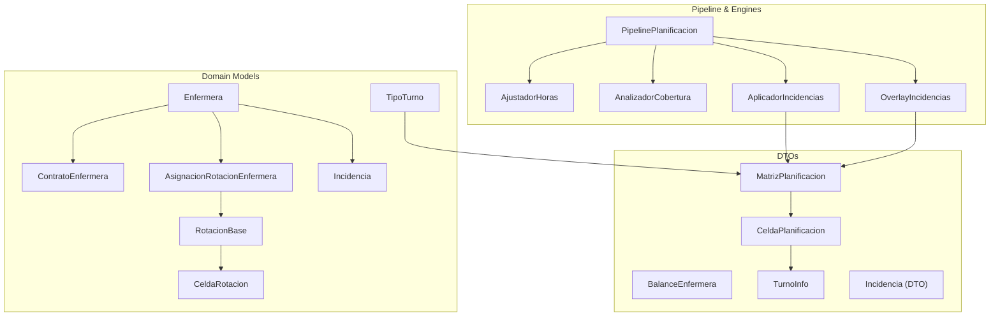
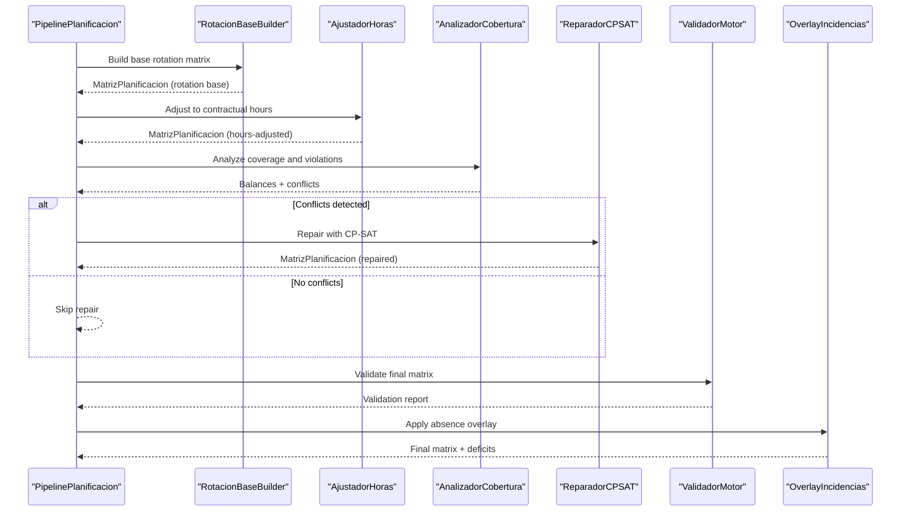
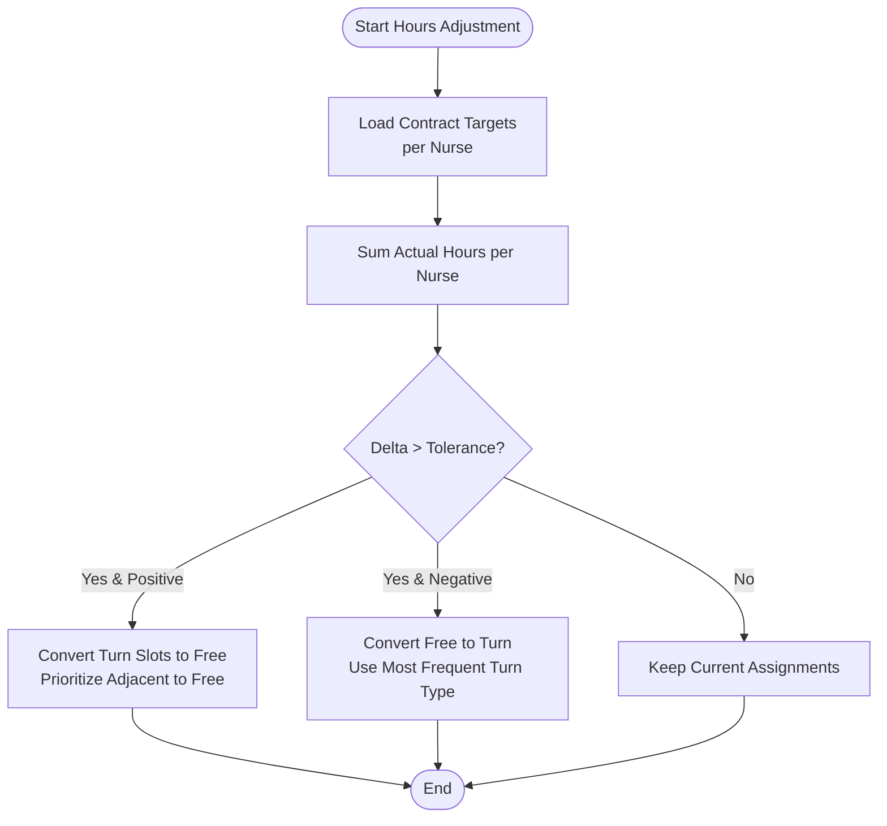
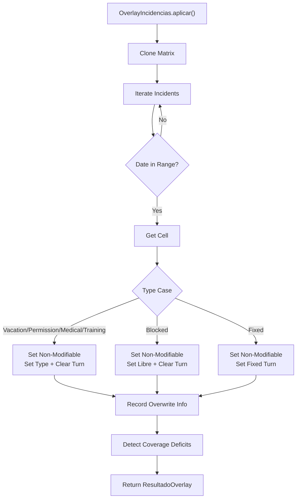
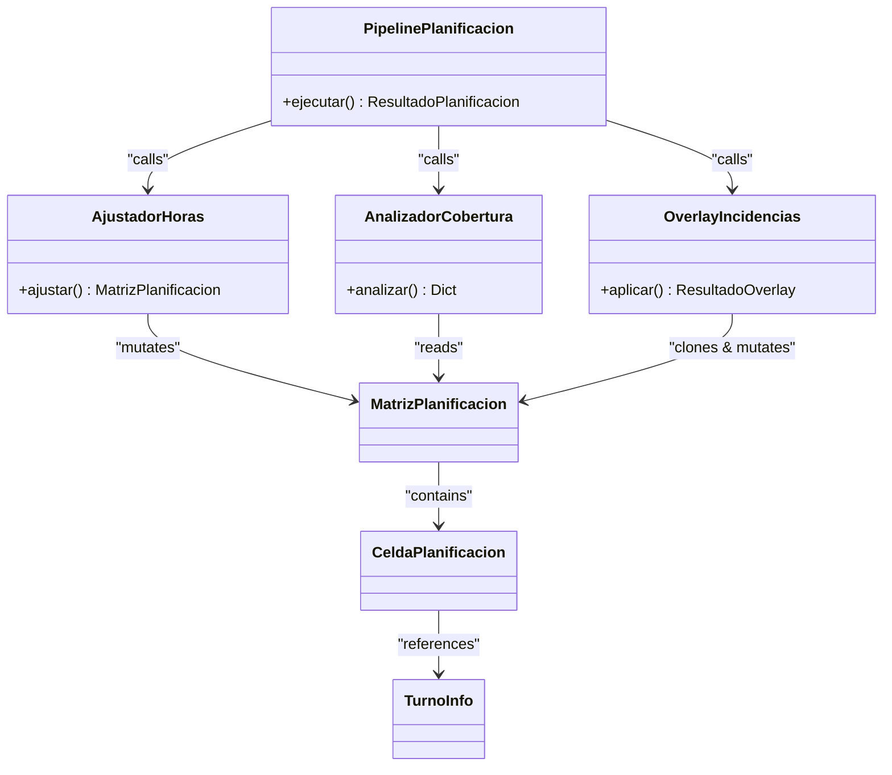
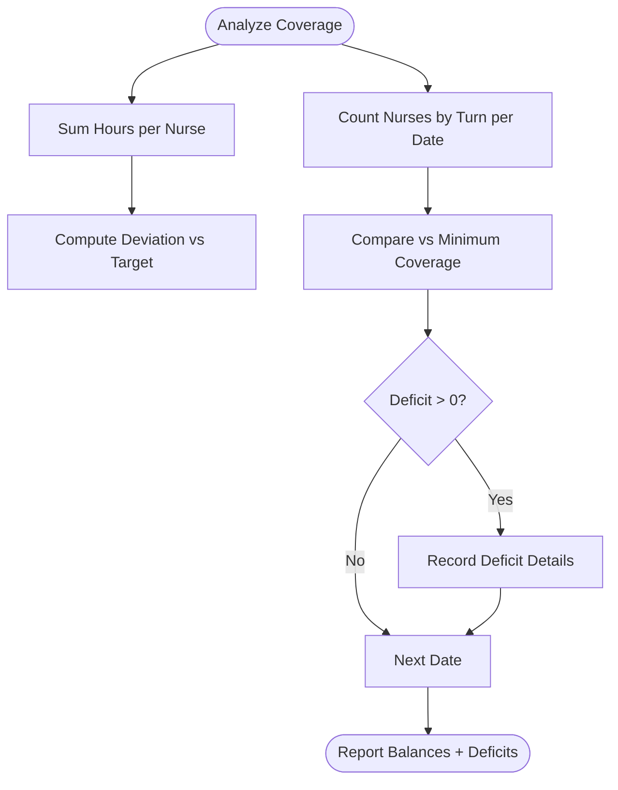
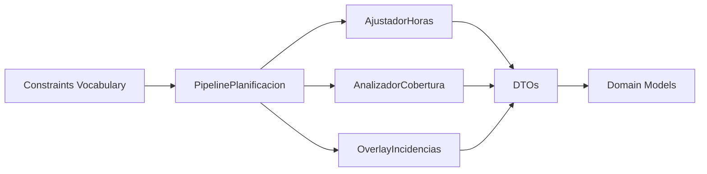

# Staff Capacity and Skill Management

<cite>
**Referenced Files in This Document**
- [models.py](file://turnos/models.py)
- [dtos.py](file://turnos/dominio/dtos.py)
- [vocabulario.py](file://turnos/dominio/vocabulario.py)
- [pipeline.py](file://turnos/motor/pipeline.py)
- [ajuste_horas.py](file://turnos/motor/ajuste_horas.py)
- [cobertura.py](file://turnos/motor/cobertura.py)
- [incidencias.py](file://turnos/motor/incidencias.py)
- [overlay_incidencias.py](file://turnos/motor/overlay_incidencias.py)
- [demo_enfermeras.json](file://turnos/fixtures/demo_enfermeras.json)
- [restricciones_sacyl_ejemplo.json](file://turnos/fixtures/restricciones_sacyl_ejemplo.json)
</cite>

## Table of Contents
1. [Introduction](#introduction)
2. [Project Structure](#project-structure)
3. [Core Components](#core-components)
4. [Architecture Overview](#architecture-overview)
5. [Detailed Component Analysis](#detailed-component-analysis)
6. [Dependency Analysis](#dependency-analysis)
7. [Performance Considerations](#performance-considerations)
8. [Troubleshooting Guide](#troubleshooting-guide)
9. [Conclusion](#conclusion)
10. [Appendices](#appendices)

## Introduction
This document explains the staff capacity planning and skill management capabilities of the system. It focuses on:
- Defining staffing contracts and workload targets via the ContratoEnfermera model
- Hourly targets and workload calculations across the planning horizon
- Managing staff absences, leaves, and special circumstances with the Incidencia model
- Capacity planning workflows, staff allocation strategies, and resource utilization analysis
- Examples of capacity planning scenarios, skill-based scheduling, and capacity forecasting
- Staff availability windows, capacity constraints, and dynamic capacity adjustments based on business rules

## Project Structure
The capacity and skill management features span domain models, DTOs, and the planning pipeline:
- Domain models define staff profiles, contracts, rotations, and incidents
- DTOs encapsulate the internal representation of plan cells, balances, and matrices
- The pipeline orchestrates rotation building, hours adjustment, coverage analysis, repair, and validation
- Modules apply hard restrictions, adjust for contractual hours, and overlay absences post-generation

**Diagram sources**
- [models.py:30-825](file://turnos/models.py#L30-L825)
- [dtos.py:43-274](file://turnos/dominio/dtos.py#L43-L274)
- [pipeline.py:31-267](file://turnos/motor/pipeline.py#L31-L267)
- [ajuste_horas.py:21-233](file://turnos/motor/ajuste_horas.py#L21-L233)
- [cobertura.py:21-208](file://turnos/motor/cobertura.py#L21-L208)
- [incidencias.py:21-98](file://turnos/motor/incidencias.py#L21-L98)
- [overlay_incidencias.py:24-205](file://turnos/motor/overlay_incidencias.py#L24-L205)

**Section sources**
- [models.py:30-825](file://turnos/models.py#L30-L825)
- [dtos.py:1-274](file://turnos/dominio/dtos.py#L1-L274)
- [pipeline.py:1-267](file://turnos/motor/pipeline.py#L1-L267)

## Core Components
- ContratoEnfermera: Defines weekly, annual, and proportional workload targets per nurse and their validity period. These targets drive the hours adjustment phase.
- Incidencia: Captures planned and unplanned events that block or alter assignments (e.g., vacations, permissions, illness, fixed assignments).
- MatrizPlanificacion and CeldaPlanificacion: Internal matrix representation of assignments with metadata for rotation adherence, modifiability, and night/fine/weekday indicators.
- PipelinePlanificacion: Orchestrates five phases: rotation base, hours adjustment, coverage analysis, optional repair, and validation.
- AjustadorHoras: Adjusts generated assignments to meet contractual hours targets within tolerance.
- AnalizadorCobertura: Computes per-nurse balances, per-turn coverage, and detects violations against hard constraints.
- AplicadorIncidencias and OverlayIncidencias: Apply absence-related overlays after generation to mark non-modifiable cells and compute coverage deficits.

**Section sources**
- [models.py:629-784](file://turnos/models.py#L629-L784)
- [dtos.py:43-274](file://turnos/dominio/dtos.py#L43-L274)
- [pipeline.py:31-267](file://turnos/motor/pipeline.py#L31-L267)
- [ajuste_horas.py:21-233](file://turnos/motor/ajuste_horas.py#L21-L233)
- [cobertura.py:21-208](file://turnos/motor/cobertura.py#L21-L208)
- [incidencias.py:21-98](file://turnos/motor/incidencias.py#L21-L98)
- [overlay_incidencias.py:24-205](file://turnos/motor/overlay_incidencias.py#L24-L205)

## Architecture Overview
The system separates concerns between deterministic rotation generation and constraint-driven repair/validation. Absences are applied as a post-processing overlay to preserve solver-generated optimality.

**Diagram sources**
- [pipeline.py:92-246](file://turnos/motor/pipeline.py#L92-L246)
- [ajuste_horas.py:46-88](file://turnos/motor/ajuste_horas.py#L46-L88)
- [cobertura.py:46-73](file://turnos/motor/cobertura.py#L46-L73)
- [overlay_incidencias.py:45-75](file://turnos/motor/overlay_incidencias.py#L45-L75)

## Detailed Component Analysis

### ContratoEnfermera: Staffing Contracts and Workload Targets
- Purpose: Define target workloads per nurse (weekly, annual, proportional) and validity window.
- Inputs to planning:
  - Weekly and annual targets feed the hours adjustment engine.
  - Proportion factor allows part-time equivalents (e.g., 50% for half-time).
  - Validity dates constrain when targets apply.
- Planning impact:
  - During hours adjustment, the system compares actual vs. target hours and converts turn slots to free days or vice versa to minimize deviation within tolerance.

**Diagram sources**
- [ajuste_horas.py:46-233](file://turnos/motor/ajuste_horas.py#L46-L233)
- [models.py:629-664](file://turnos/models.py#L629-L664)

**Section sources**
- [models.py:629-664](file://turnos/models.py#L629-L664)
- [ajuste_horas.py:46-88](file://turnos/motor/ajuste_horas.py#L46-L88)

### Incidencia: Managing Absences, Leaves, and Special Circumstances
- Types supported: Vacations, Permission (paid/unpaid), Medical Leave, Training, Blocked Availability, Fixed Assignment.
- During generation: Hard restrictions prevent overlapping assignments; absence types are not applied until post-generation overlay.
- Overlay behavior:
  - Marks affected cells as non-modifiable and sets cell type accordingly.
  - Tracks hours lost per cell and computes coverage deficits compared to configured minimums.
  - Supports fixed assignment to a specific shift during blackout periods.

**Diagram sources**
- [overlay_incidencias.py:45-205](file://turnos/motor/overlay_incidencias.py#L45-L205)
- [incidencias.py:37-98](file://turnos/motor/incidencias.py#L37-L98)
- [dtos.py:169-181](file://turnos/dominio/dtos.py#L169-L181)

**Section sources**
- [models.py:749-784](file://turnos/models.py#L749-L784)
- [overlay_incidencias.py:45-205](file://turnos/motor/overlay_incidencias.py#L45-L205)
- [incidencias.py:37-98](file://turnos/motor/incidencias.py#L37-L98)
- [dtos.py:169-181](file://turnos/dominio/dtos.py#L169-L181)

### Capacity Planning Workflows and Staff Allocation Strategies
- Rotation base: Deterministic cycle-based assignments using RotacionBase and CeldaRotacion.
- Hours adjustment: Ensures contractual targets are met with minimal disruption.
- Coverage analysis: Validates hard constraints (e.g., consecutive shifts, nights) and compares actual vs. target coverage.
- Repair: Uses CP-SAT to resolve conflicts when coverage analysis detects violations.
- Overlay: Applies absence-related overlays post-generation to reflect real-world constraints.

**Diagram sources**
- [pipeline.py:31-267](file://turnos/motor/pipeline.py#L31-L267)
- [ajuste_horas.py:21-233](file://turnos/motor/ajuste_horas.py#L21-L233)
- [cobertura.py:21-208](file://turnos/motor/cobertura.py#L21-L208)
- [overlay_incidencias.py:24-205](file://turnos/motor/overlay_incidencias.py#L24-L205)
- [dtos.py:197-238](file://turnos/dominio/dtos.py#L197-L238)

**Section sources**
- [pipeline.py:92-246](file://turnos/motor/pipeline.py#L92-L246)
- [ajuste_horas.py:46-88](file://turnos/motor/ajuste_horas.py#L46-L88)
- [cobertura.py:46-73](file://turnos/motor/cobertura.py#L46-L73)
- [overlay_incidencias.py:45-75](file://turnos/motor/overlay_incidencias.py#L45-L75)

### Resource Utilization Analysis
- Per-nurse metrics: Total hours assigned, deviations from targets, number of nights, weekend and holiday counts.
- Historical balances: Accumulated hours, nights, weekends, and holidays to inform fairness and long-term equilibrium.
- Coverage deficits: Count of under-covered turns per day and type, enabling targeted interventions.

**Diagram sources**
- [cobertura.py:75-208](file://turnos/motor/cobertura.py#L75-L208)
- [dtos.py:135-166](file://turnos/dominio/dtos.py#L135-L166)

**Section sources**
- [cobertura.py:46-208](file://turnos/motor/cobertura.py#L46-L208)
- [dtos.py:135-166](file://turnos/dominio/dtos.py#L135-L166)

### Skill Assignments, Qualification Tracking, and Competency Management
- The current codebase models staff profiles and preferences via Enfermera and stores notes. There is no explicit skill/qualification model in the referenced files.
- Practical guidance:
  - Use Enfermera.notas to capture specialty or competency notes (e.g., ICU, pediatrics).
  - Restrict assignments by filtering eligible nurses for specific shifts in higher-level orchestration logic.
  - Integrate with external competency systems by mapping competency IDs to Enfermera records and enforcing filters during planning.

[No sources needed since this section provides general guidance]

### Examples of Capacity Planning Scenarios
- Scenario A: Part-time nurse with 50% contract and 20 weekly hours target
  - Use ContratoEnfermera with proportion at 50 and weekly target around 20 hours.
  - AjustadorHoras will convert excess or deficit slots to/from free days to reach target within tolerance.
- Scenario B: Vacation blackout for two weeks
  - Create Incidencia entries for the vacation period.
  - OverlayIncidencias marks cells as non-modifiable and clears turns; coverage analyzer reports deficits if minimums require more staff.
- Scenario C: Rotational pattern with alternating nights and days
  - Define RotacionBase with CeldaRotacion entries for night and day slots.
  - PipelinePlanificacion builds the base matrix, adjusts hours, repairs conflicts, and applies overlays.

[No sources needed since this section provides general guidance]

### Capacity Forecasting
- Historical balances (BalanceHistoricoEnfermera) enable trend-aware planning by incorporating prior accumulated hours and counts.
- Use monthly aggregation (YYYY-MM) to project future loads and align with contractual targets.

**Section sources**
- [models.py:787-825](file://turnos/models.py#L787-L825)
- [dtos.py:135-166](file://turnos/dominio/dtos.py#L135-L166)

## Dependency Analysis
- PipelinePlanificacion depends on:
  - AjustadorHoras for contractual hours alignment
  - AnalizadorCobertura for conflict detection and coverage metrics
  - OverlayIncidencias for post-generation overlays
- DTOs decouple domain models from the solver internals, ensuring maintainability and testability.
- Constraints vocabulary defines canonical identifiers for hard and soft constraints, enabling consistent configuration across the system.

**Diagram sources**
- [pipeline.py:31-267](file://turnos/motor/pipeline.py#L31-L267)
- [ajuste_horas.py:21-233](file://turnos/motor/ajuste_horas.py#L21-L233)
- [cobertura.py:21-208](file://turnos/motor/cobertura.py#L21-L208)
- [overlay_incidencias.py:24-205](file://turnos/motor/overlay_incidencias.py#L24-L205)
- [dtos.py:1-274](file://turnos/dominio/dtos.py#L1-L274)
- [vocabulario.py:10-112](file://turnos/dominio/vocabulario.py#L10-L112)

**Section sources**
- [pipeline.py:31-267](file://turnos/motor/pipeline.py#L31-L267)
- [vocabulario.py:10-112](file://turnos/dominio/vocabulario.py#L10-L112)

## Performance Considerations
- Prefer deterministic rotation base to reduce solver search space.
- Tune solver parameters (workers, timeout, seed) in configuration to balance quality and speed.
- Limit excessive consecutive shifts and night sequences to avoid frequent repairs.
- Use historical balances to distribute workload fairly and reduce long-term deviations.

[No sources needed since this section provides general guidance]

## Troubleshooting Guide
- Excess or deficit hours persist after adjustment:
  - Verify contractual targets and tolerance thresholds.
  - Check rotation base frequency and whether enough free days exist to absorb excess.
- Coverage deficits after overlay:
  - Review minimum coverage configuration and incident types that block assignments.
  - Consider adding temporary substitutes or adjusting fixed assignments.
- Violations of consecutive shifts or nights:
  - Adjust hard constraint limits or relax constraints via configuration normalization.
  - Review pipeline’s constraint extraction logic for max consecutive and night limits.

**Section sources**
- [ajuste_horas.py:46-88](file://turnos/motor/ajuste_horas.py#L46-L88)
- [overlay_incidencias.py:166-205](file://turnos/motor/overlay_incidencias.py#L166-L205)
- [cobertura.py:163-207](file://turnos/motor/cobertura.py#L163-L207)
- [pipeline.py:143-154](file://turnos/motor/pipeline.py#L143-L154)

## Conclusion
The system provides robust capacity planning through deterministic rotation bases, contractual hours alignment, and strict coverage analysis with optional CP-SAT repair. Absences are handled via a controlled overlay that preserves solution integrity while reflecting real-world constraints. Extending the model to include explicit skills and qualifications would enable skill-based scheduling and competency management aligned with operational needs.

[No sources needed since this section summarizes without analyzing specific files]

## Appendices

### Appendix A: Example Data References
- Sample nurses with notes and availability hints are provided in fixtures for demonstration and testing.
- Constraint configurations demonstrate canonical hard and soft constraints.

**Section sources**
- [demo_enfermeras.json:1-197](file://turnos/fixtures/demo_enfermeras.json#L1-L197)
- [restricciones_sacyl_ejemplo.json:1-21](file://turnos/fixtures/restricciones_sacyl_ejemplo.json#L1-L21)